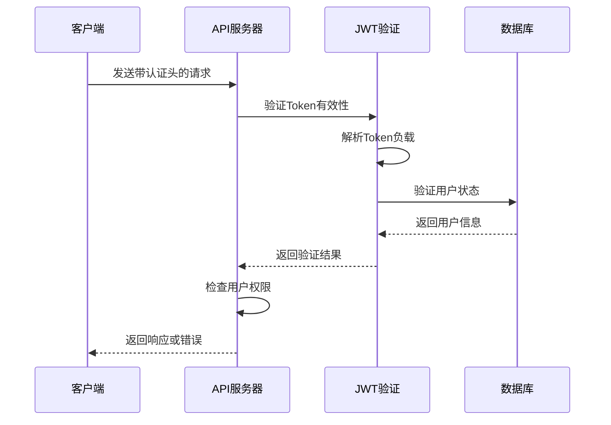
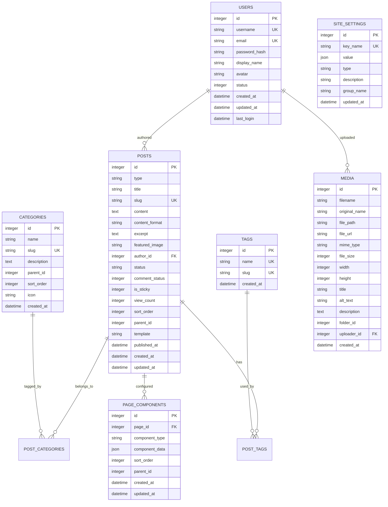
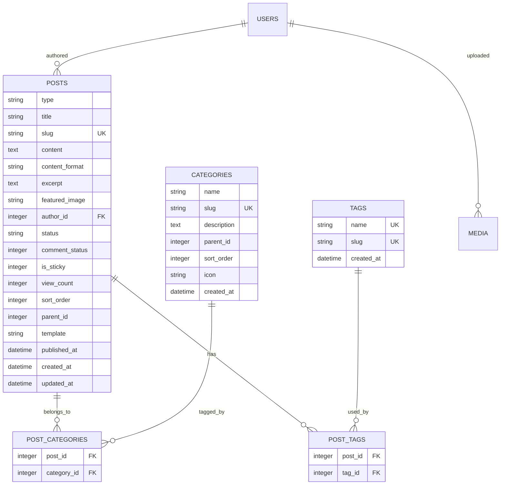
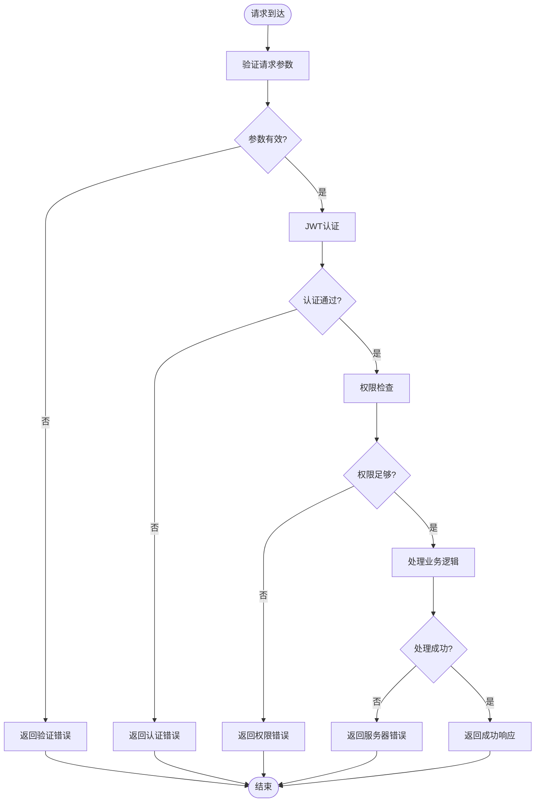

# API接口文档

<cite>
**本文档引用的文件**
- [app/__init__.py](file://company_cms_project/backend/app/__init__.py)
- [config.py](file://company_cms_project/backend/config.py)
- [auth/routes.py](file://company_cms_project/backend/app/auth/routes.py)
- [api/posts.py](file://company_cms_project/backend/app/api/posts.py)
- [api/users.py](file://company_cms_project/backend/app/api/users.py)
- [api/categories.py](file://company_cms_project/backend/app/api/categories.py)
- [api/tags.py](file://company_cms_project/backend/app/api/tags.py)
- [api/media.py](file://company_cms_project/backend/app/api/media.py)
- [api/menus.py](file://company_cms_project/backend/app/api/menus.py)
- [api/settings.py](file://company_cms_project/backend/app/api/settings.py)
- [models/post.py](file://company_cms_project/backend/app/models/post.py)
- [models/user.py](file://company_cms_project/backend/app/models/user.py)
</cite>

## 目录
1. [简介](#简介)
2. [项目概述](#项目概述)
3. [API架构设计](#api架构设计)
4. [认证与授权](#认证与授权)
5. [用户认证API](#用户认证api)
6. [用户管理API](#用户管理api)
7. [内容管理API](#内容管理api)
8. [媒体库API](#媒体库api)
9. [菜单管理API](#菜单管理api)
10. [系统配置API](#系统配置api)
11. [数据模型](#数据模型)
12. [错误处理](#错误处理)
13. [性能优化](#性能优化)
14. [安全考虑](#安全考虑)
15. [部署与监控](#部署与监控)
16. [故障排除指南](#故障排除指南)
17. [结论](#结论)

## 简介

本API接口文档详细描述了企业网站CMS系统的RESTful API端点，涵盖用户认证、用户管理、内容管理、媒体库、菜单管理和系统配置六大核心功能模块。该系统采用Python Flask作为后端框架，支持JWT身份认证，提供完整的CRUD操作接口，适用于中小企业的官方网站内容管理需求。

## 项目概述

### 技术架构

系统采用前后端分离架构，后端使用Python Flask框架，前端支持React/Vue.js技术栈。主要技术栈包括：

- **后端**: Flask 2.3+, Flask-RESTful, SQLAlchemy, Flask-JWT-Extended
- **数据库**: SQLite3 (主数据库) + Redis (可选缓存)
- **文件存储**: 本地存储 + 云存储支持
- **部署**: Nginx反向代理 + Waitress WSGI服务器

### 核心特性

- **RESTful API设计**: 符合REST规范的资源导向接口
- **JWT身份认证**: 基于令牌的无状态认证机制
- **多角色权限管理**: 支持超级管理员、管理员、编辑者等角色
- **完整的用户管理**: 用户注册、编辑、密码管理等功能
- **高级内容管理**: 支持分类、标签、媒体文件管理
- **可视化编辑器**: 支持拖拽式页面布局配置
- **多语言支持**: 中英文切换功能
- **SEO优化**: 友好URL结构和Meta标签管理

## API架构设计

### 基础规范

所有API遵循统一的设计规范：

- **协议**: HTTPS (生产环境)
- **格式**: JSON (application/json)
- **编码**: UTF-8
- **API前缀**: `/api/v1/`
- **版本控制**: 语义化版本控制 (SemVer)
- **分页**: 默认每页20条记录

### 请求格式

```json
{
  "code": 200,
  "message": "success",
  "data": {},
  "meta": {
    "timestamp": 1234567890,
    "request_id": "uuid"
  }
}
```

### 响应格式

```json
{
  "code": 200,
  "message": "success",
  "data": {},
  "meta": {
    "timestamp": 1234567890,
    "request_id": "uuid"
  }
}
```

### HTTP状态码

| 状态码 | 含义 | 描述 |
|--------|------|------|
| 200 | OK | 请求成功 |
| 201 | Created | 创建成功 |
| 204 | No Content | 删除成功 |
| 400 | Bad Request | 请求参数错误 |
| 401 | Unauthorized | 未认证 |
| 403 | Forbidden | 无权限 |
| 404 | Not Found | 资源不存在 |
| 429 | Too Many Requests | 请求过于频繁 |
| 500 | Internal Server Error | 服务器内部错误 |

## 认证与授权

### JWT Token机制

系统采用JWT (JSON Web Token) 进行身份认证：

- **Access Token**: 有效期2小时
- **Refresh Token**: 有效期30天
- **Token存储**: LocalStorage/Cookie
- **认证头**: `Authorization: Bearer <token>`

### 权限体系

系统支持多角色权限管理：

1. **超级管理员 (Super Admin)**: 拥有所有权限
2. **管理员 (Admin)**: 内容管理、用户管理
3. **编辑者 (Editor)**: 内容编辑、媒体上传
4. **作者 (Author)**: 创建文章、编辑自己的内容
5. **访客 (Viewer)**: 仅查看权限

### 权限验证流程



**章节来源**
- [config.py:19-23](file://company_cms_project/backend/config.py#L19-L23)
- [auth/routes.py:105-159](file://company_cms_project/backend/app/auth/routes.py#L105-L159)

## 用户认证API

### 登录接口

**HTTP方法**: POST  
**URL**: `/api/v1/auth/login`  
**认证**: 无需认证  
**功能**: 用户登录获取JWT Token

**请求参数**:
```json
{
  "username": "string",
  "password": "string"
}
```

**响应数据**:
```json
{
  "code": 200,
  "message": "登录成功",
  "data": {
    "user": {
      "id": "integer",
      "username": "string",
      "email": "string",
      "display_name": "string",
      "avatar": "string",
      "status": "integer",
      "created_at": "datetime",
      "last_login": "datetime"
    },
    "access_token": "string",
    "refresh_token": "string"
  }
}
```

### 注销接口

**HTTP方法**: POST  
**URL**: `/api/v1/auth/logout`  
**认证**: 需要认证  
**功能**: 用户注销，使Token失效

**请求参数**: 无  
**响应数据**:
```json
{
  "code": 200,
  "message": "登出成功"
}
```

### 注册接口

**HTTP方法**: POST  
**URL**: `/api/v1/auth/register`  
**认证**: 无需认证  
**功能**: 用户注册

**请求参数**:
```json
{
  "username": "string",
  "email": "string",
  "password": "string",
  "display_name": "string"
}
```

**响应数据**:
```json
{
  "code": 201,
  "message": "注册成功",
  "data": {
    "user": {
      "id": "integer",
      "username": "string",
      "email": "string",
      "display_name": "string",
      "avatar": "string",
      "status": "integer",
      "created_at": "datetime",
      "last_login": "datetime"
    },
    "access_token": "string",
    "refresh_token": "string"
  }
}
```

### 刷新Token接口

**HTTP方法**: POST  
**URL**: `/api/v1/auth/refresh`  
**认证**: 需要刷新Token  
**功能**: 刷新Access Token

**请求参数**: 无  
**响应数据**:
```json
{
  "code": 200,
  "message": "Token刷新成功",
  "data": {
    "access_token": "string"
  }
}
```

### 当前用户信息接口

**HTTP方法**: GET  
**URL**: `/api/v1/auth/me`  
**认证**: 需要认证  
**功能**: 获取当前登录用户信息

**请求参数**: 无  
**响应数据**:
```json
{
  "code": 200,
  "message": "获取成功",
  "data": {
    "user": {
      "id": "integer",
      "username": "string",
      "email": "string",
      "display_name": "string",
      "avatar": "string",
      "status": "integer",
      "created_at": "datetime",
      "last_login": "datetime"
    }
  }
}
```

**章节来源**
- [auth/routes.py:25-225](file://company_cms_project/backend/app/auth/routes.py#L25-L225)

## 用户管理API

### 用户管理API

#### 用户列表接口

**HTTP方法**: GET  
**URL**: `/api/v1/users`  
**认证**: 需要认证  
**功能**: 获取用户列表，支持分页、状态过滤和关键字搜索

**查询参数**:
- `page`: 页码，默认1
- `per_page`: 每页数量，默认10
- `status`: 状态过滤 (1:正常, 0:禁用)
- `keyword`: 关键字搜索，支持用户名、邮箱、显示名称

**响应数据**:
```json
{
  "code": 200,
  "message": "获取成功",
  "data": {
    "items": [
      {
        "id": "integer",
        "username": "string",
        "email": "string",
        "display_name": "string",
        "avatar": "string",
        "status": "integer",
        "created_at": "datetime",
        "last_login": "datetime"
      }
    ],
    "total": "integer",
    "page": "integer",
    "per_page": "integer",
    "pages": "integer"
  }
}
```

#### 用户详情接口

**HTTP方法**: GET  
**URL**: `/api/v1/users/{id}`  
**认证**: 需要认证  
**功能**: 获取用户详细信息

**路径参数**:
- `id`: 用户ID

**响应数据**:
```json
{
  "code": 200,
  "message": "获取成功",
  "data": {
    "user": {
      "id": "integer",
      "username": "string",
      "email": "string",
      "display_name": "string",
      "avatar": "string",
      "status": "integer",
      "created_at": "datetime",
      "last_login": "datetime"
    }
  }
}
```

#### 创建用户接口

**HTTP方法**: POST  
**URL**: `/api/v1/users`  
**认证**: 需要认证  
**功能**: 创建新用户

**请求参数**:
```json
{
  "username": "string",
  "email": "string",
  "password": "string",
  "display_name": "string",
  "avatar": "string",
  "status": "integer"
}
```

**响应数据**:
```json
{
  "code": 201,
  "message": "用户创建成功",
  "data": {
    "user": {
      "id": "integer",
      "username": "string",
      "email": "string",
      "display_name": "string",
      "avatar": "string",
      "status": "integer",
      "created_at": "datetime",
      "last_login": "datetime"
    }
  }
}
```

#### 更新用户接口

**HTTP方法**: PUT  
**URL**: `/api/v1/users/{id}`  
**认证**: 需要认证  
**功能**: 更新现有用户信息

**路径参数**:
- `id`: 用户ID

**请求参数**:
```json
{
  "display_name": "string",
  "avatar": "string",
  "status": "integer",
  "email": "string",
  "password": "string"
}
```

**响应数据**:
```json
{
  "code": 200,
  "message": "用户更新成功",
  "data": {
    "user": {
      "id": "integer",
      "username": "string",
      "email": "string",
      "display_name": "string",
      "avatar": "string",
      "status": "integer",
      "created_at": "datetime",
      "last_login": "datetime"
    }
  }
}
```

#### 删除用户接口

**HTTP方法**: DELETE  
**URL**: `/api/v1/users/{id}`  
**认证**: 需要认证  
**功能**: 删除用户

**路径参数**:
- `id`: 用户ID

**响应数据**:
```json
{
  "code": 200,
  "message": "用户删除成功"
}
```

#### 重置密码接口

**HTTP方法**: POST  
**URL**: `/api/v1/users/{id}/reset-password`  
**认证**: 需要认证  
**功能**: 重置用户密码

**路径参数**:
- `id`: 用户ID

**请求参数**:
```json
{
  "password": "string"
}
```

**响应数据**:
```json
{
  "code": 200,
  "message": "密码重置成功"
}
```

**章节来源**
- [api/users.py:24-326](file://company_cms_project/backend/app/api/users.py#L24-L326)
- [models/user.py:35-47](file://company_cms_project/backend/app/models/user.py#L35-L47)

## 内容管理API

### 文章管理API

#### 文章列表接口

**HTTP方法**: GET  
**URL**: `/api/v1/posts`  
**认证**: 需要认证  
**功能**: 获取文章列表，支持分页和高级过滤

**查询参数**:
- `page`: 页码，默认1
- `per_page`: 每页数量，默认10
- `status`: 状态过滤 (draft, published, private)
- `category_id`: 分类ID过滤
- `tag_id`: 标签ID过滤
- `search`: 搜索关键词，支持标题和内容搜索

**响应数据**:
```json
{
  "code": 200,
  "message": "获取成功",
  "data": {
    "items": [
      {
        "id": "integer",
        "type": "string",
        "title": "string",
        "slug": "string",
        "content": "string",
        "content_format": "string",
        "excerpt": "string",
        "featured_image": "string",
        "author_id": "integer",
        "author_name": "string",
        "status": "string",
        "comment_status": "boolean",
        "is_sticky": "boolean",
        "view_count": "integer",
        "sort_order": "integer",
        "parent_id": "integer",
        "template": "string",
        "published_at": "datetime",
        "created_at": "datetime",
        "updated_at": "datetime",
        "categories": [
          {
            "id": "integer",
            "name": "string",
            "slug": "string",
            "description": "string",
            "parent_id": "integer",
            "sort_order": "integer",
            "icon": "string",
            "created_at": "datetime"
          }
        ],
        "tags": [
          {
            "id": "integer",
            "name": "string",
            "slug": "string",
            "created_at": "datetime"
          }
        ]
      }
    ],
    "pagination": {
      "page": "integer",
      "per_page": "integer",
      "total": "integer",
      "pages": "integer"
    }
  }
}
```

#### 公开文章列表接口

**HTTP方法**: GET  
**URL**: `/api/v1/posts/public`  
**认证**: 无需认证  
**功能**: 获取公开文章列表（前台使用）

**查询参数**:
- `page`: 页码，默认1
- `per_page`: 每页数量，默认10
- `category_id`: 分类ID过滤
- `tag_id`: 标签ID过滤
- `search`: 搜索关键词，支持标题和内容搜索

**响应数据**: 同上

#### 文章详情接口

**HTTP方法**: GET  
**URL**: `/api/v1/posts/{id}`  
**认证**: 需要认证  
**功能**: 获取文章详细信息

**路径参数**:
- `id`: 文章ID

**响应数据**:
```json
{
  "code": 200,
  "message": "获取成功",
  "data": {
    "id": "integer",
    "type": "string",
    "title": "string",
    "slug": "string",
    "content": "string",
    "content_format": "string",
    "excerpt": "string",
    "featured_image": "string",
    "author_id": "integer",
    "author_name": "string",
    "status": "string",
    "comment_status": "boolean",
    "is_sticky": "boolean",
    "view_count": "integer",
    "sort_order": "integer",
    "parent_id": "integer",
    "template": "string",
    "published_at": "datetime",
    "created_at": "datetime",
    "updated_at": "datetime",
    "categories": [
      {
        "id": "integer",
        "name": "string",
        "slug": "string",
        "description": "string",
        "parent_id": "integer",
        "sort_order": "integer",
        "icon": "string",
        "created_at": "datetime"
      }
    ],
    "tags": [
      {
        "id": "integer",
        "name": "string",
        "slug": "string",
        "created_at": "datetime"
      }
    ]
  }
}
```

#### 公开文章详情接口

**HTTP方法**: GET  
**URL**: `/api/v1/posts/public/{id}`  
**认证**: 无需认证  
**功能**: 获取公开文章详情（前台使用）

**路径参数**:
- `id`: 文章ID

**响应数据**: 同上

#### 创建文章接口

**HTTP方法**: POST  
**URL**: `/api/v1/posts`  
**认证**: 需要认证  
**功能**: 创建新文章

**请求参数**:
```json
{
  "title": "string",
  "content": "string",
  "content_format": "string",
  "excerpt": "string",
  "featured_image": "string",
  "category_ids": ["integer"],
  "tag_names": ["string"],
  "status": "string",
  "comment_status": "boolean",
  "is_sticky": "boolean",
  "type": "string",
  "update_slug": "boolean"
}
```

**响应数据**:
```json
{
  "code": 201,
  "message": "创建成功",
  "data": {
    "id": "integer",
    "type": "string",
    "title": "string",
    "slug": "string",
    "status": "string"
  }
}
```

#### 更新文章接口

**HTTP方法**: PUT  
**URL**: `/api/v1/posts/{id}`  
**认证**: 需要认证  
**功能**: 更新现有文章

**路径参数**:
- `id`: 文章ID

**请求参数**: 同创建文章接口

**响应数据**:
```json
{
  "code": 200,
  "message": "更新成功",
  "data": {
    "id": "integer",
    "type": "string",
    "title": "string",
    "slug": "string",
    "status": "string"
  }
}
```

#### 删除文章接口

**HTTP方法**: DELETE  
**URL**: `/api/v1/posts/{id}`  
**认证**: 需要认证  
**功能**: 删除文章

**路径参数**:
- `id`: 文章ID

**响应数据**:
```json
{
  "code": 200,
  "message": "删除成功"
}
```

**章节来源**
- [api/posts.py:40-454](file://company_cms_project/backend/app/api/posts.py#L40-L454)
- [models/post.py:35-70](file://company_cms_project/backend/app/models/post.py#L35-L70)

### 页面管理API

页面管理API与文章管理共享相同的CRUD接口，通过`type`字段区分文章和页面类型。

**章节来源**
- [api/posts.py:108-454](file://company_cms_project/backend/app/api/posts.py#L108-L454)

### 分类管理API

#### 分类列表接口

**HTTP方法**: GET  
**URL**: `/api/v1/categories`  
**认证**: 需要认证  
**功能**: 获取分类列表（树形结构）

**查询参数**:
- `parent_id`: 父分类ID，默认0获取顶级分类

**响应数据**:
```json
{
  "code": 200,
  "message": "获取成功",
  "data": [
    {
      "id": "integer",
      "name": "string",
      "slug": "string",
      "description": "string",
      "parent_id": "integer",
      "sort_order": "integer",
      "icon": "string",
      "created_at": "datetime",
      "children": ["object"]
    }
  ]
}
```

#### 创建分类接口

**HTTP方法**: POST  
**URL**: `/api/v1/categories`  
**认证**: 需要认证  
**功能**: 创建新分类

**请求参数**:
```json
{
  "name": "string",
  "slug": "string",
  "description": "string",
  "parent_id": "integer",
  "sort_order": "integer",
  "icon": "string"
}
```

**响应数据**:
```json
{
  "code": 201,
  "message": "创建成功",
  "data": {
    "id": "integer",
    "name": "string",
    "slug": "string"
  }
}
```

#### 更新分类接口

**HTTP方法**: PUT  
**URL**: `/api/v1/categories/{id}`  
**认证**: 需要认证  
**功能**: 更新现有分类

**路径参数**:
- `id`: 分类ID

**请求参数**: 同创建分类接口

**响应数据**:
```json
{
  "code": 200,
  "message": "更新成功",
  "data": {
    "id": "integer",
    "name": "string",
    "slug": "string"
  }
}
```

#### 删除分类接口

**HTTP方法**: DELETE  
**URL**: `/api/v1/categories/{id}`  
**认证**: 需要认证  
**功能**: 删除分类

**路径参数**:
- `id`: 分类ID

**响应数据**:
```json
{
  "code": 200,
  "message": "删除成功"
}
```

**章节来源**
- [api/categories.py:7-185](file://company_cms_project/backend/app/api/categories.py#L7-L185)
- [models/post.py:81-102](file://company_cms_project/backend/app/models/post.py#L81-L102)

### 标签管理API

#### 标签列表接口

**HTTP方法**: GET  
**URL**: `/api/v1/tags`  
**认证**: 需要认证  
**功能**: 获取标签列表

**查询参数**:
- `page`: 页码，默认1
- `per_page`: 每页数量，默认20
- `search`: 搜索关键词

**响应数据**:
```json
{
  "code": 200,
  "message": "获取成功",
  "data": {
    "items": [
      {
        "id": "integer",
        "name": "string",
        "slug": "string",
        "created_at": "datetime"
      }
    ],
    "pagination": {
      "page": "integer",
      "per_page": "integer",
      "total": "integer",
      "pages": "integer"
    }
  }
}
```

#### 创建标签接口

**HTTP方法**: POST  
**URL**: `/api/v1/tags`  
**认证**: 需要认证  
**功能**: 创建新标签

**请求参数**:
```json
{
  "name": "string",
  "slug": "string"
}
```

**响应数据**:
```json
{
  "code": 201,
  "message": "创建成功",
  "data": {
    "id": "integer",
    "name": "string",
    "slug": "string"
  }
}
```

#### 更新标签接口

**HTTP方法**: PUT  
**URL**: `/api/v1/tags/{id}`  
**认证**: 需要认证  
**功能**: 更新现有标签

**路径参数**:
- `id`: 标签ID

**请求参数**: 同创建标签接口

**响应数据**:
```json
{
  "code": 200,
  "message": "更新成功",
  "data": {
    "id": "integer",
    "name": "string",
    "slug": "string"
  }
}
```

#### 删除标签接口

**HTTP方法**: DELETE  
**URL**: `/api/v1/tags/{id}`  
**认证**: 需要认证  
**功能**: 删除标签

**路径参数**:
- `id`: 标签ID

**响应数据**:
```json
{
  "code": 200,
  "message": "删除成功"
}
```

**章节来源**
- [api/tags.py:7-170](file://company_cms_project/backend/app/api/tags.py#L7-L170)
- [models/post.py:104-126](file://company_cms_project/backend/app/models/post.py#L104-L126)

## 媒体库API

### 媒体文件管理

#### 媒体列表接口

**HTTP方法**: GET  
**URL**: `/api/v1/media`  
**认证**: 需要认证  
**功能**: 获取媒体文件列表

**查询参数**:
- `page`: 页码，默认1
- `per_page`: 每页数量，默认20
- `mime_type`: MIME类型过滤
- `search`: 搜索关键词，支持文件名和标题搜索

**响应数据**:
```json
{
  "code": 200,
  "message": "获取成功",
  "data": {
    "items": [
      {
        "id": "integer",
        "filename": "string",
        "original_name": "string",
        "file_path": "string",
        "file_url": "string",
        "mime_type": "string",
        "file_size": "integer",
        "width": "integer",
        "height": "integer",
        "title": "string",
        "alt_text": "string",
        "description": "string",
        "folder_id": "integer",
        "uploader_id": "integer",
        "created_at": "datetime"
      }
    ],
    "pagination": {
      "page": "integer",
      "per_page": "integer",
      "total": "integer",
      "pages": "integer"
    }
  }
}
```

#### 媒体详情接口

**HTTP方法**: GET  
**URL**: `/api/v1/media/{id}`  
**认证**: 需要认证  
**功能**: 获取媒体文件详细信息

**路径参数**:
- `id`: 媒体ID

**响应数据**:
```json
{
  "code": 200,
  "message": "获取成功",
  "data": {
    "id": "integer",
    "filename": "string",
    "original_name": "string",
    "file_path": "string",
    "file_url": "string",
    "mime_type": "string",
    "file_size": "integer",
    "width": "integer",
    "height": "integer",
    "title": "string",
    "alt_text": "string",
    "description": "string",
    "folder_id": "integer",
    "uploader_id": "integer",
    "created_at": "datetime"
  }
}
```

#### 文件上传接口

**HTTP方法**: POST  
**URL**: `/api/v1/media/upload`  
**认证**: 需要认证  
**功能**: 上传文件

**请求类型**: multipart/form-data  
**表单参数**:
- `file`: 文件对象
- `title`: 标题
- `alt_text`: 替代文本
- `description`: 描述

**响应数据**:
```json
{
  "code": 201,
  "message": "上传成功",
  "data": {
    "id": "integer",
    "filename": "string",
    "file_url": "string",
    "file_size": "integer"
  }
}
```

#### 更新媒体信息接口

**HTTP方法**: PUT  
**URL**: `/api/v1/media/{id}`  
**认证**: 需要认证  
**功能**: 更新媒体文件信息

**路径参数**:
- `id`: 媒体ID

**请求参数**:
```json
{
  "title": "string",
  "alt_text": "string",
  "description": "string"
}
```

**响应数据**:
```json
{
  "code": 200,
  "message": "更新成功",
  "data": {
    "id": "integer",
    "filename": "string",
    "file_url": "string",
    "file_size": "integer"
  }
}
```

#### 删除媒体接口

**HTTP方法**: DELETE  
**URL**: `/api/v1/media/{id}`  
**认证**: 需要认证  
**功能**: 删除媒体文件

**路径参数**:
- `id`: 媒体ID

**响应数据**:
```json
{
  "code": 200,
  "message": "删除成功"
}
```

**章节来源**
- [api/media.py:35-247](file://company_cms_project/backend/app/api/media.py#L35-L247)
- [models/post.py:129-169](file://company_cms_project/backend/app/models/post.py#L129-L169)

## 菜单管理API

### 菜单配置管理

#### 获取菜单列表接口

**HTTP方法**: GET  
**URL**: `/api/v1/menus`  
**认证**: 无需认证  
**功能**: 获取菜单列表（公开接口）

**响应数据**:
```json
{
  "code": 200,
  "message": "success",
  "data": {
    "items": [
      {
        "id": "string",
        "title": "string",
        "path": "string",
        "pageKey": "string",
        "order": "integer",
        "visible": "boolean",
        "isSystem": "boolean",
        "createdAt": "datetime",
        "updatedAt": "datetime"
      }
    ],
    "updatedAt": "datetime"
  }
}
```

#### 保存菜单配置接口

**HTTP方法**: PUT  
**URL**: `/api/v1/menus`  
**认证**: 需要认证  
**功能**: 批量保存菜单配置

**请求参数**:
```json
{
  "items": [
    {
      "id": "string",
      "title": "string",
      "path": "string",
      "pageKey": "string",
      "order": "integer",
      "visible": "boolean",
      "isSystem": "boolean"
    }
  ]
}
```

**响应数据**:
```json
{
  "code": 200,
  "message": "菜单配置保存成功",
  "data": {
    "items": ["object"],
    "updatedAt": "datetime"
  }
}
```

#### 添加菜单项接口

**HTTP方法**: POST  
**URL**: `/api/v1/menus`  
**认证**: 需要认证  
**功能**: 添加菜单项

**请求参数**:
```json
{
  "title": "string",
  "path": "string",
  "pageKey": "string",
  "icon": "string",
  "order": "integer",
  "visible": "boolean"
}
```

**响应数据**:
```json
{
  "code": 200,
  "message": "菜单添加成功",
  "data": {
    "id": "string",
    "title": "string",
    "path": "string",
    "pageKey": "string",
    "order": "integer",
    "visible": "boolean",
    "isSystem": "boolean",
    "createdAt": "datetime",
    "updatedAt": "datetime"
  }
}
```

#### 更新菜单项接口

**HTTP方法**: PUT  
**URL**: `/api/v1/menus/{menu_id}`  
**认证**: 需要认证  
**功能**: 更新菜单项

**路径参数**:
- `menu_id`: 菜单项ID

**请求参数**:
```json
{
  "title": "string",
  "path": "string",
  "pageKey": "string",
  "icon": "string",
  "order": "integer",
  "visible": "boolean"
}
```

**响应数据**:
```json
{
  "code": 200,
  "message": "菜单更新成功",
  "data": {
    "id": "string",
    "title": "string",
    "path": "string",
    "pageKey": "string",
    "order": "integer",
    "visible": "boolean",
    "isSystem": "boolean",
    "createdAt": "datetime",
    "updatedAt": "datetime"
  }
}
```

#### 删除菜单项接口

**HTTP方法**: DELETE  
**URL**: `/api/v1/menus/{menu_id}`  
**认证**: 需要认证  
**功能**: 删除菜单项

**路径参数**:
- `menu_id`: 菜单项ID

**响应数据**:
```json
{
  "code": 200,
  "message": "菜单删除成功"
}
```

#### 获取页面列表接口

**HTTP方法**: GET  
**URL**: `/api/v1/pages/list`  
**认证**: 无需认证  
**功能**: 获取可编辑的页面列表

**响应数据**:
```json
{
  "code": 200,
  "message": "success",
  "data": [
    {
      "key": "string",
      "title": "string",
      "path": "string"
    }
  ]
}
```

**章节来源**
- [api/menus.py:70-253](file://company_cms_project/backend/app/api/menus.py#L70-L253)

## 系统配置API

### 站点配置管理

#### 获取配置接口

**HTTP方法**: GET  
**URL**: `/api/v1/settings/{key_name}`  
**认证**: 无需认证  
**功能**: 获取站点配置

**路径参数**:
- `key_name`: 配置键名

**响应数据**:
```json
{
  "code": 200,
  "message": "success",
  "data": {
    "id": "integer",
    "key_name": "string",
    "value": "object",
    "type": "string",
    "description": "string",
    "group_name": "string",
    "updated_at": "datetime"
  }
}
```

#### 更新配置接口

**HTTP方法**: PUT  
**URL**: `/api/v1/settings/{key_name}`  
**认证**: 需要认证  
**功能**: 更新站点配置

**路径参数**:
- `key_name`: 配置键名

**请求参数**:
```json
{
  "value": "object",
  "description": "string",
  "group_name": "string"
}
```

**响应数据**:
```json
{
  "code": 200,
  "message": "保存成功",
  "data": {
    "id": "integer",
    "key_name": "string",
    "value": "object",
    "type": "string",
    "description": "string",
    "group_name": "string",
    "updated_at": "datetime"
  }
}
```

#### 获取所有配置接口

**HTTP方法**: GET  
**URL**: `/api/v1/settings`  
**认证**: 需要认证  
**功能**: 获取所有配置

**查询参数**:
- `group`: 配置分组过滤

**响应数据**:
```json
{
  "code": 200,
  "message": "success",
  "data": [
    {
      "id": "integer",
      "key_name": "string",
      "value": "object",
      "type": "string",
      "description": "string",
      "group_name": "string",
      "updated_at": "datetime"
    }
  ]
}
```

### 页面配置管理

#### 获取首页配置接口

**HTTP方法**: GET  
**URL**: `/api/v1/pages/home`  
**认证**: 无需认证  
**功能**: 获取首页配置

**响应数据**:
```json
{
  "code": 200,
  "message": "success",
  "data": {
    "name": "string",
    "components": ["object"],
    "templateId": "string"
  }
}
```

#### 保存首页配置接口

**HTTP方法**: PUT  
**URL**: `/api/v1/pages/home`  
**认证**: 需要认证  
**功能**: 保存首页配置

**请求参数**:
```json
{
  "name": "string",
  "components": ["object"],
  "templateId": "string"
}
```

**响应数据**:
```json
{
  "code": 200,
  "message": "首页配置保存成功",
  "data": {
    "id": "integer",
    "key_name": "string",
    "value": "object",
    "type": "string",
    "description": "string",
    "group_name": "string",
    "updated_at": "datetime"
  }
}
```

#### 获取页面配置接口

**HTTP方法**: GET  
**URL**: `/api/v1/pages/{page_key}`  
**认证**: 无需认证  
**功能**: 获取指定页面配置

**路径参数**:
- `page_key`: 页面键名

**响应数据**:
```json
{
  "code": 200,
  "message": "success",
  "data": {
    "name": "string",
    "components": ["object"],
    "templateId": "string"
  }
}
```

#### 保存页面配置接口

**HTTP方法**: PUT  
**URL**: `/api/v1/pages/{page_key}`  
**认证**: 需要认证  
**功能**: 保存指定页面配置

**路径参数**:
- `page_key`: 页面键名

**请求参数**:
```json
{
  "name": "string",
  "components": ["object"],
  "templateId": "string"
}
```

**响应数据**:
```json
{
  "code": 200,
  "message": "页面配置保存成功",
  "data": {
    "id": "integer",
    "key_name": "string",
    "value": "object",
    "type": "string",
    "description": "string",
    "group_name": "string",
    "updated_at": "datetime"
  }
}
```

### LOGO配置管理

#### 获取LOGO配置接口

**HTTP方法**: GET  
**URL**: `/api/v1/settings/logo`  
**认证**: 无需认证  
**功能**: 获取LOGO配置

**响应数据**:
```json
{
  "code": 200,
  "message": "success",
  "data": {
    "enabled": "boolean",
    "displayMode": "string",
    "logoImage": "string",
    "logoImageWidth": "integer",
    "logoImageHeight": "integer",
    "logoText": "string",
    "logoSubText": "string",
    "textColor": "string",
    "subTextColor": "string",
    "fontSize": "integer",
    "subFontSize": "integer",
    "fontWeight": "integer",
    "letterSpacing": "integer",
    "imageGap": "integer",
    "linkUrl": "string"
  }
}
```

#### 更新LOGO配置接口

**HTTP方法**: PUT  
**URL**: `/api/v1/settings/logo`  
**认证**: 需要认证  
**功能**: 更新LOGO配置

**请求参数**:
```json
{
  "enabled": "boolean",
  "displayMode": "string",
  "logoImage": "string",
  "logoImageWidth": "integer",
  "logoImageHeight": "integer",
  "logoText": "string",
  "logoSubText": "string",
  "textColor": "string",
  "subTextColor": "string",
  "fontSize": "integer",
  "subFontSize": "integer",
  "fontWeight": "integer",
  "letterSpacing": "integer",
  "imageGap": "integer",
  "linkUrl": "string"
}
```

**响应数据**:
```json
{
  "code": 200,
  "message": "LOGO配置保存成功",
  "data": {
    "enabled": "boolean",
    "displayMode": "string",
    "logoImage": "string",
    "logoImageWidth": "integer",
    "logoImageHeight": "integer",
    "logoText": "string",
    "logoSubText": "string",
    "textColor": "string",
    "subTextColor": "string",
    "fontSize": "integer",
    "subFontSize": "integer",
    "fontWeight": "integer",
    "letterSpacing": "integer",
    "imageGap": "integer",
    "linkUrl": "string"
  }
}
```

### 底栏配置管理

#### 获取底栏配置接口

**HTTP方法**: GET  
**URL**: `/api/v1/settings/footer`  
**认证**: 无需认证  
**功能**: 获取底栏配置

**响应数据**:
```json
{
  "code": 200,
  "message": "success",
  "data": {
    "enabled": "boolean",
    "height": "integer",
    "backgroundColor": "string",
    "textColor": "string",
    "title": "string",
    "description": "string",
    "copyright": "string",
    "elements": ["object"]
  }
}
```

#### 更新底栏配置接口

**HTTP方法**: PUT  
**URL**: `/api/v1/settings/footer`  
**认证**: 需要认证  
**功能**: 更新底栏配置

**请求参数**:
```json
{
  "enabled": "boolean",
  "height": "integer",
  "backgroundColor": "string",
  "textColor": "string",
  "title": "string",
  "description": "string",
  "copyright": "string",
  "elements": ["object"]
}
```

**响应数据**:
```json
{
  "code": 200,
  "message": "底栏配置保存成功",
  "data": {
    "enabled": "boolean",
    "height": "integer",
    "backgroundColor": "string",
    "textColor": "string",
    "title": "string",
    "description": "string",
    "copyright": "string",
    "elements": ["object"]
  }
}
```

**章节来源**
- [api/settings.py:7-360](file://company_cms_project/backend/app/api/settings.py#L7-L360)
- [models/post.py:210-280](file://company_cms_project/backend/app/models/post.py#L210-L280)

## 数据模型

### 用户模型



**图表来源**
- [models/post.py:5-280](file://company_cms_project/backend/app/models/post.py#L5-L280)
- [models/user.py:5-47](file://company_cms_project/backend/app/models/user.py#L5-L47)

### 内容模型关系



**图表来源**
- [models/post.py:5-181](file://company_cms_project/backend/app/models/post.py#L5-L181)

**章节来源**
- [models/post.py:5-280](file://company_cms_project/backend/app/models/post.py#L5-L280)
- [models/user.py:5-47](file://company_cms_project/backend/app/models/user.py#L5-L47)

## 错误处理

### 错误响应格式

系统统一使用以下错误响应格式：

```json
{
  "code": "integer",
  "message": "string",
  "data": "object",
  "meta": {
    "timestamp": "integer",
    "request_id": "string"
  }
}
```

### 常见错误类型

| 错误代码 | HTTP状态码 | 描述 | 处理建议 |
|----------|------------|------|----------|
| VALIDATION_ERROR | 400 | 参数验证失败 | 检查请求参数格式和类型 |
| AUTHENTICATION_FAILED | 401 | 认证失败 | 检查Token有效性 |
| INSUFFICIENT_PERMISSIONS | 403 | 权限不足 | 检查用户角色和权限 |
| RESOURCE_NOT_FOUND | 404 | 资源不存在 | 检查资源ID是否正确 |
| TOO_MANY_REQUESTS | 429 | 请求过于频繁 | 等待冷却时间或提高配额 |
| INTERNAL_ERROR | 500 | 服务器内部错误 | 检查服务器日志 |

### 错误处理流程



**章节来源**
- [app/__init__.py:50-57](file://company_cms_project/backend/app/__init__.py#L50-L57)

## 性能优化

### 缓存策略

系统采用多层缓存机制：

1. **页面缓存**: Redis缓存完整页面HTML
2. **数据缓存**: 缓存常用查询结果
3. **静态资源缓存**: 浏览器缓存和CDN缓存

### 性能指标

- **页面加载时间**: < 3秒
- **API响应时间**: < 500ms
- **数据库查询响应**: < 100ms
- **并发用户支持**: > 1000
- **QPS**: > 500

### 优化建议

1. **数据库优化**:
   - 合理使用索引
   - 避免N+1查询问题
   - 使用连接池

2. **文件优化**:
   - 图片懒加载
   - 响应式图片
   - CDN加速

3. **代码优化**:
   - 异步处理耗时操作
   - 减少不必要的数据库查询
   - 使用缓存减少重复计算

**章节来源**
- [config.py:31-33](file://company_cms_project/backend/config.py#L31-L33)

## 安全考虑

### 认证安全

1. **JWT Token安全**:
   - 使用HTTPS传输
   - 设置合理的过期时间
   - 实施Token刷新机制
   - 存储在安全的地方

2. **密码安全**:
   - 使用bcrypt加密
   - 密码强度要求
   - 登录失败锁定机制
   - 密码历史记录

### 数据安全

1. **SQL注入防护**:
   - 使用ORM参数化查询
   - 输入验证和过滤
   - 避免动态SQL

2. **XSS防护**:
   - 输入过滤
   - 输出转义
   - Content Security Policy

3. **CSRF防护**:
   - CSRF Token验证
   - SameSite Cookie
   - 双重提交Cookie

### API安全

1. **访问频率限制**:
   - 基于IP限流
   - 基于用户限流
   - 不同接口不同限制

2. **文件上传安全**:
   - 文件类型白名单
   - 文件大小限制
   - 文件名随机化
   - 存储路径限制

**章节来源**
- [config.py:19-29](file://company_cms_project/backend/config.py#L19-L29)
- [auth/routes.py:14-23](file://company_cms_project/backend/app/auth/routes.py#L14-L23)

## 部署与监控

### 部署配置

系统采用Nginx + Waitress的部署架构：

1. **Nginx配置**:
   - 反向代理
   - HTTPS终止
   - Gzip压缩
   - 静态文件服务

2. **Windows服务配置**:
   - 使用NSSM注册为Windows服务
   - 开机自启动
   - 崩溃自动重启

### 监控指标

1. **性能监控**:
   - 服务器资源使用率
   - API响应时间
   - 数据库性能指标

2. **错误监控**:
   - 错误日志收集
   - 异常告警
   - 性能瓶颈识别

3. **安全监控**:
   - 登录异常检测
   - API访问监控
   - 文件上传安全监控

### 备份策略

- **数据库备份**: 每日全量备份
- **文件备份**: 每日增量备份
- **备份保留**: 30天
- **异地备份**: 云存储

**章节来源**
- [config.py:35-40](file://company_cms_project/backend/config.py#L35-L40)
- [app/__init__.py:31-34](file://company_cms_project/backend/app/__init__.py#L31-L34)

## 故障排除指南

### 常见问题

1. **登录失败**:
   - 检查用户名密码
   - 确认账户状态
   - 验证Token是否过期

2. **文件上传失败**:
   - 检查文件大小限制
   - 验证文件类型
   - 确认存储权限

3. **API响应慢**:
   - 检查数据库性能
   - 启用缓存
   - 优化查询语句

### 调试工具

1. **API测试工具**:
   - Postman
   - curl命令
   - Swagger UI

2. **日志分析**:
   - Flask应用日志
   - Nginx访问日志
   - 错误日志

3. **性能分析**:
   - 数据库查询分析
   - 缓存命中率
   - 网络延迟分析

### 故障恢复

1. **数据恢复**:
   - 使用备份文件
   - 恢复数据库
   - 重新部署应用

2. **服务恢复**:
   - 重启服务
   - 检查依赖服务
   - 验证配置文件

**章节来源**
- [config.py:24-29](file://company_cms_project/backend/config.py#L24-L29)

## 结论

本API接口文档详细描述了企业网站CMS系统的核心功能和接口规范。系统采用现代化的技术架构，提供了完整的RESTful API接口，支持用户认证、用户管理、内容管理、媒体库、菜单管理和系统配置等核心功能。通过合理的安全设计、性能优化和监控机制，确保系统能够稳定高效地运行。

开发者可以根据本接口文档快速集成和使用系统API，同时也可以根据实际需求进行扩展和定制。建议在生产环境中启用HTTPS、实施严格的权限控制，并建立完善的监控和备份机制。