# 内容管理API

<cite>
**本文档引用的文件**
- [企业网站CMS系统开发需求文档.ini](file://企业网站CMS系统开发需求文档.ini)
- [企业网站CMS系统详细需求文档.md](file://企业网站CMS系统详细需求文档.md)
</cite>

## 目录
1. [简介](#简介)
2. [项目结构](#项目结构)
3. [核心组件](#核心组件)
4. [架构概览](#架构概览)
5. [详细组件分析](#详细组件分析)
6. [依赖分析](#依赖分析)
7. [性能考虑](#性能考虑)
8. [故障排除指南](#故障排除指南)
9. [结论](#结论)

## 简介

企业网站CMS系统是一个功能完善、易于维护的企业官网内容管理系统，支持可视化拖拽配置，降低技术门槛，提升网站管理效率。该系统采用Python Flask + Nginx + Windows Server的技术架构，为中小企业提供快速搭建和运维的解决方案。

系统主要功能包括：
- **前端可视化编辑模块**：支持拖拽布局配置、内容组件管理
- **后台管理模块**：用户权限管理、内容管理、系统配置
- **核心功能**：多语言支持、SEO优化、性能优化

## 项目结构

CMS系统采用前后端分离架构，主要由以下组件构成：

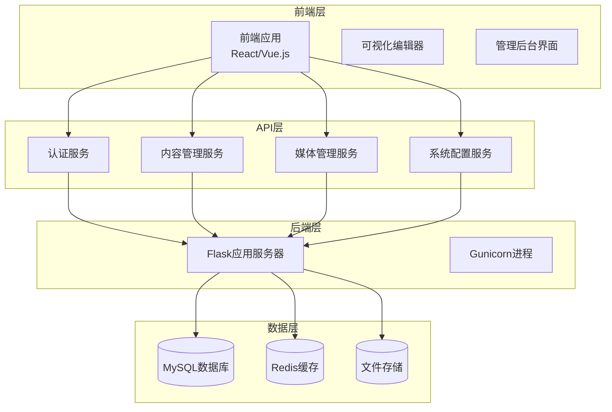

**图表来源**
- [企业网站CMS系统详细需求文档.md](file://企业网站CMS系统详细需求文档.md#L28-L57)

**章节来源**
- [企业网站CMS系统详细需求文档.md](file://企业网站CMS系统详细需求文档.md#L22-L57)

## 核心组件

### 认证与授权系统

系统采用JWT（JSON Web Token）进行身份认证，支持多种用户角色和权限控制：

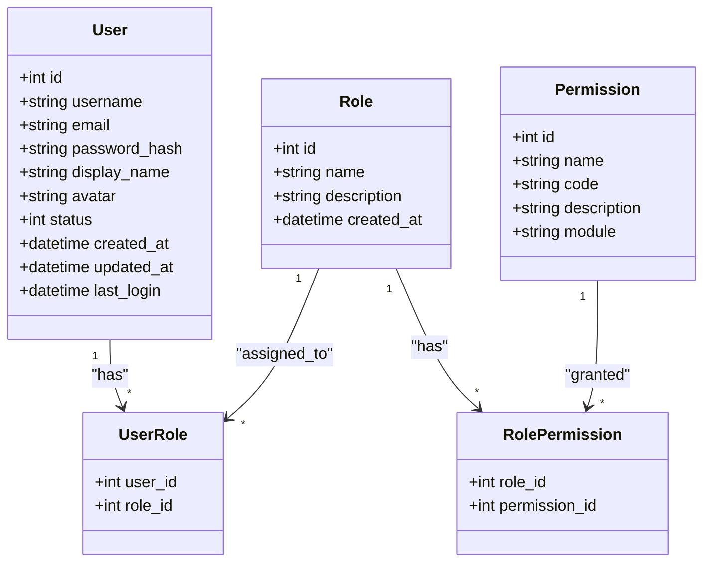

**图表来源**
- [企业网站CMS系统详细需求文档.md](file://企业网站CMS系统详细需求文档.md#L716-L768)

系统支持以下用户角色：
- **超级管理员**：拥有所有权限，可管理用户和系统配置
- **管理员**：内容管理、媒体库管理、页面发布
- **编辑**：内容编辑、媒体上传、页面编辑（需审核）
- **作者**：创建文章、编辑自己的内容、上传媒体
- **访客**：仅查看权限

**章节来源**
- [企业网站CMS系统详细需求文档.md](file://企业网站CMS系统详细需求文档.md#L237-L283)

### 内容管理系统

内容管理是系统的核心功能，主要包括文章管理和页面管理两大模块：

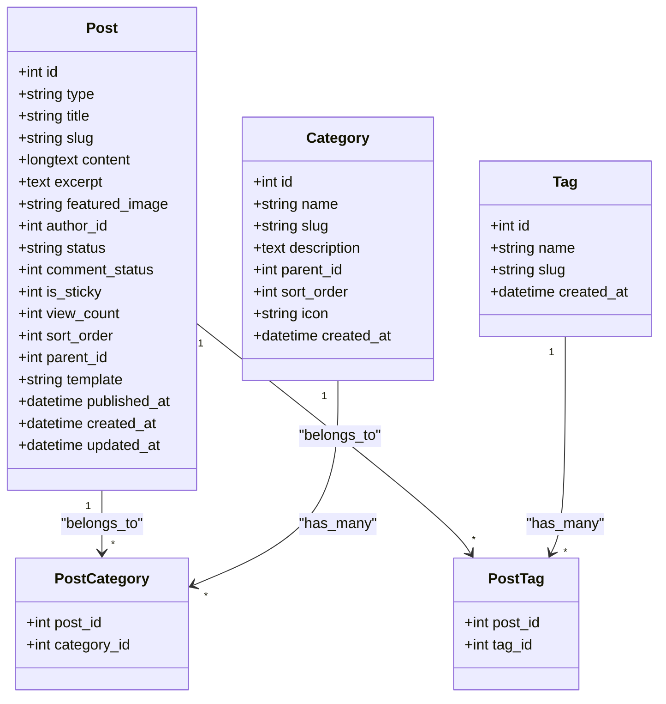

**图表来源**
- [企业网站CMS系统详细需求文档.md](file://企业网站CMS系统详细需求文档.md#L770-L836)

**章节来源**
- [企业网站CMS系统详细需求文档.md](file://企业网站CMS系统详细需求文档.md#L294-L330)

### 媒体库管理系统

媒体库支持多种文件类型的上传和管理，包括图片、视频和文档：

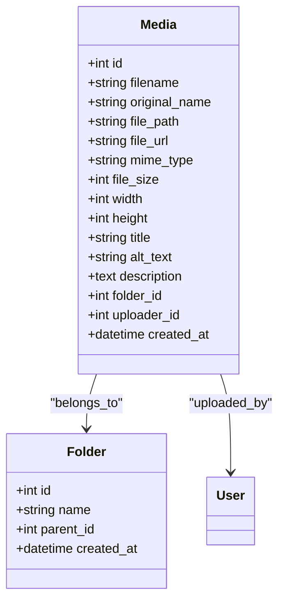

**图表来源**
- [企业网站CMS系统详细需求文档.md](file://企业网站CMS系统详细需求文档.md#L839-L861)

**章节来源**
- [企业网站CMS系统详细需求文档.md](file://企业网站CMS系统详细需求文档.md#L355-L387)

## 架构概览

系统采用RESTful API设计，统一的接口规范和响应格式：

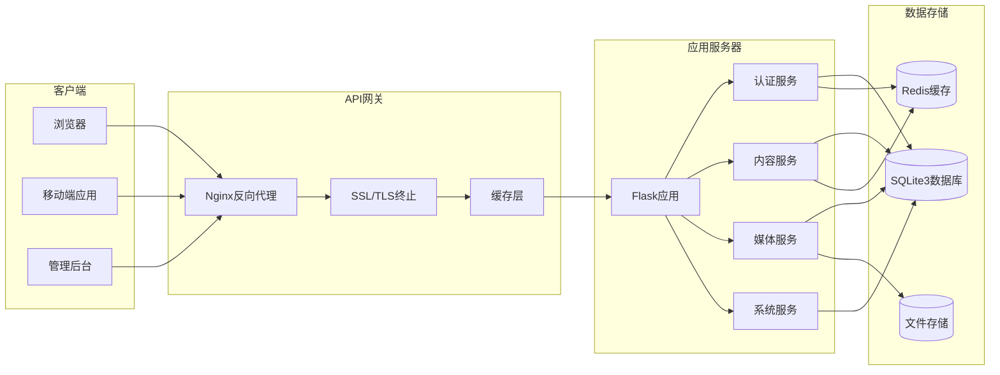

**图表来源**
- [企业网站CMS系统详细需求文档.md](file://企业网站CMS系统详细需求文档.md#L28-L57)

### API接口规范

系统采用统一的API设计规范：

**基础规范**：
- 协议：HTTPS
- 格式：JSON
- 编码：UTF-8
- API前缀：`/api/v1/`
- 认证方式：JWT Token (`Authorization: Bearer <token>`)

**请求格式**：
```json
{
  "data": {},
  "meta": {
    "request_id": "uuid"
  }
}
```

**响应格式**：
```json
{
  "code": 200,
  "message": "success",
  "data": {},
  "meta": {
    "timestamp": 1234567890,
    "request_id": "uuid"
  }
}
```

**HTTP状态码**：
- 200：成功
- 201：创建成功
- 204：删除成功
- 400：请求参数错误
- 401：未认证
- 403：无权限
- 404：资源不存在
- 500：服务器错误

**分页格式**：
```json
{
  "code": 200,
  "data": {
    "items": [],
    "pagination": {
      "page": 1,
      "per_page": 20,
      "total": 100,
      "total_pages": 5
    }
  }
}
```

**章节来源**
- [企业网站CMS系统详细需求文档.md](file://企业网站CMS系统详细需求文档.md#L940-L998)

## 详细组件分析

### 认证接口

认证系统提供完整的用户身份验证和授权管理：

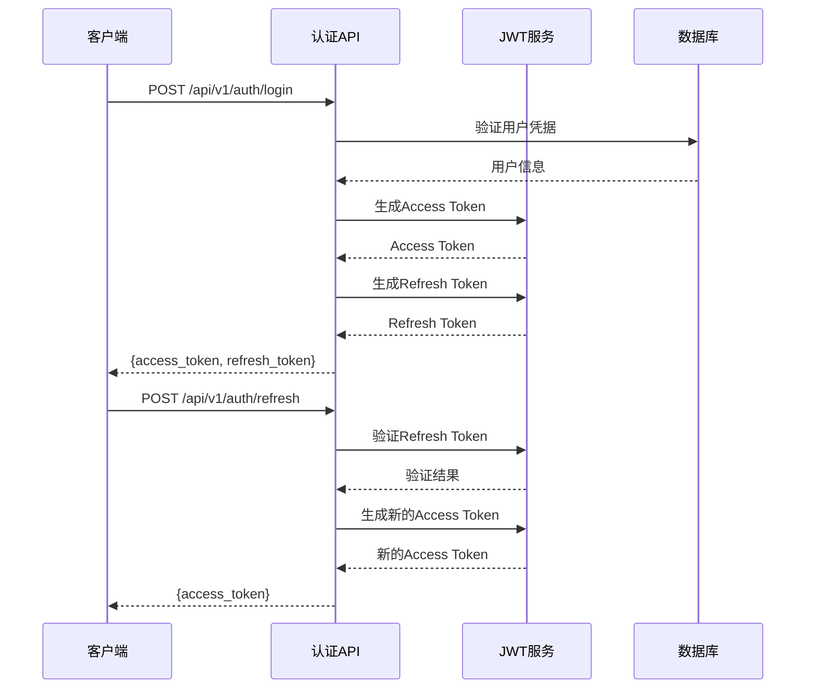

**图表来源**
- [企业网站CMS系统详细需求文档.md](file://企业网站CMS系统详细需求文档.md#L1002-L1011)

**接口列表**：
- `POST /api/v1/auth/login` - 用户登录
- `POST /api/v1/auth/logout` - 用户登出
- `POST /api/v1/auth/register` - 用户注册
- `POST /api/v1/auth/refresh` - 刷新Token
- `POST /api/v1/auth/forgot-password` - 忘记密码
- `POST /api/v1/auth/reset-password` - 重置密码
- `GET /api/v1/auth/me` - 获取当前用户信息

**章节来源**
- [企业网站CMS系统详细需求文档.md](file://企业网站CMS系统详细需求文档.md#L1002-L1011)

### 用户管理接口

用户管理接口支持用户的基本CRUD操作和角色分配：

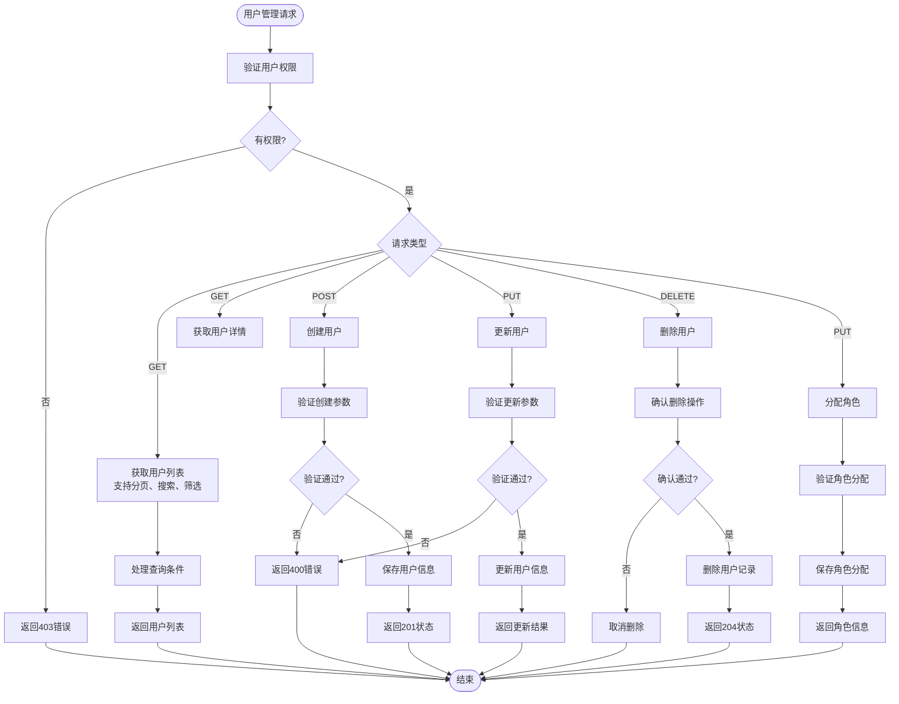

**图表来源**
- [企业网站CMS系统详细需求文档.md](file://企业网站CMS系统详细需求文档.md#L1013-L1021)

**接口列表**：
- `GET /api/v1/users` - 获取用户列表（支持分页、搜索、筛选）
- `GET /api/v1/users/:id` - 获取用户详情
- `POST /api/v1/users` - 创建用户
- `PUT /api/v1/users/:id` - 更新用户
- `DELETE /api/v1/users/:id` - 删除用户
- `PUT /api/v1/users/:id/roles` - 分配角色

**章节来源**
- [企业网站CMS系统详细需求文档.md](file://企业网站CMS系统详细需求文档.md#L1013-L1021)

### 文章管理接口

文章管理接口提供完整的文章生命周期管理：

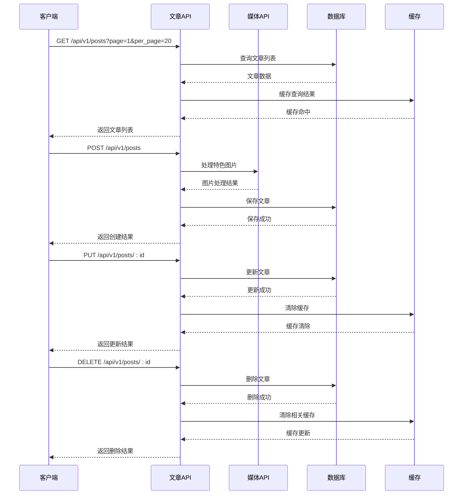

**图表来源**
- [企业网站CMS系统详细需求文档.md](file://企业网站CMS系统详细需求文档.md#L1023-L1032)

**接口列表**：
- `GET /api/v1/posts` - 获取文章列表（支持筛选、分页）
- `GET /api/v1/posts/:id` - 获取文章详情
- `POST /api/v1/posts` - 创建文章
- `PUT /api/v1/posts/:id` - 更新文章
- `DELETE /api/v1/posts/:id` - 删除文章
- `POST /api/v1/posts/bulk-delete` - 批量删除文章
- `PUT /api/v1/posts/:id/status` - 修改文章状态

**功能特性**：
- **分页查询**：支持页码和每页数量参数
- **搜索过滤**：支持标题、内容、作者、分类、标签等多维度搜索
- **批量操作**：支持批量删除、状态修改等操作
- **状态管理**：支持草稿、待审核、已发布等状态
- **SEO优化**：支持URL别名、Meta描述、关键词设置

**章节来源**
- [企业网站CMS系统详细需求文档.md](file://企业网站CMS系统详细需求文档.md#L1023-L1032)

### 页面管理接口

页面管理接口支持可视化拖拽编辑和页面组件配置：

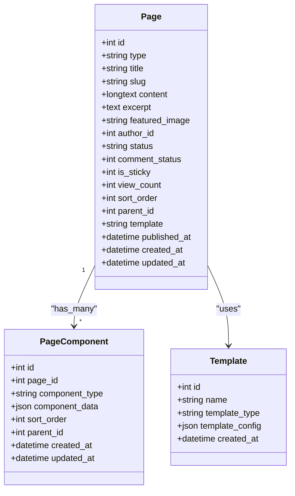

**图表来源**
- [企业网站CMS系统详细需求文档.md](file://企业网站CMS系统详细需求文档.md#L863-L877)

**接口列表**：
- `GET /api/v1/pages` - 获取页面列表
- `GET /api/v1/pages/:id` - 获取页面详情
- `POST /api/v1/pages` - 创建页面
- `PUT /api/v1/pages/:id` - 更新页面
- `DELETE /api/v1/pages/:id` - 删除页面
- `GET /api/v1/pages/:id/components` - 获取页面组件配置
- `PUT /api/v1/pages/:id/components` - 更新页面组件配置

**功能特性**：
- **可视化编辑**：支持拖拽布局配置
- **组件系统**：支持多种内容组件（文本、图片、视频、表单等）
- **模板管理**：支持首页、文章页、单页等模板
- **页面树形结构**：支持父子页面关系
- **SEO配置**：支持页面级别的SEO设置

**章节来源**
- [企业网站CMS系统详细需求文档.md](file://企业网站CMS系统详细需求文档.md#L1034-L1043)

### 分类标签接口

分类标签系统提供内容分类和标签管理功能：

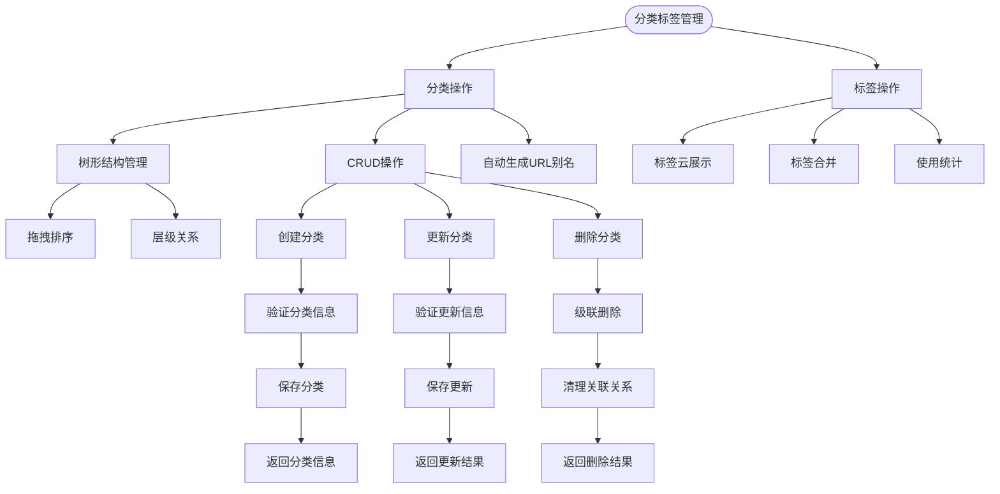

**图表来源**
- [企业网站CMS系统详细需求文档.md](file://企业网站CMS系统详细需求文档.md#L1045-L1056)

**接口列表**：
- `GET /api/v1/categories` - 获取分类列表（树形结构）
- `POST /api/v1/categories` - 创建分类
- `PUT /api/v1/categories/:id` - 更新分类
- `DELETE /api/v1/categories/:id` - 删除分类

- `GET /api/v1/tags` - 获取标签列表
- `POST /api/v1/tags` - 创建标签
- `PUT /api/v1/tags/:id` - 更新标签
- `DELETE /api/v1/tags/:id` - 删除标签

**功能特性**：
- **树形分类**：支持无限层级的分类结构
- **分类排序**：支持拖拽排序和手动排序
- **URL别名**：自动生成slug，支持中文转拼音
- **标签云**：支持标签云展示和统计
- **标签合并**：支持标签合并功能

**章节来源**
- [企业网站CMS系统详细需求文档.md](file://企业网站CMS系统详细需求文档.md#L1045-L1056)

### 媒体库接口

媒体库接口提供完整的文件上传和管理功能：

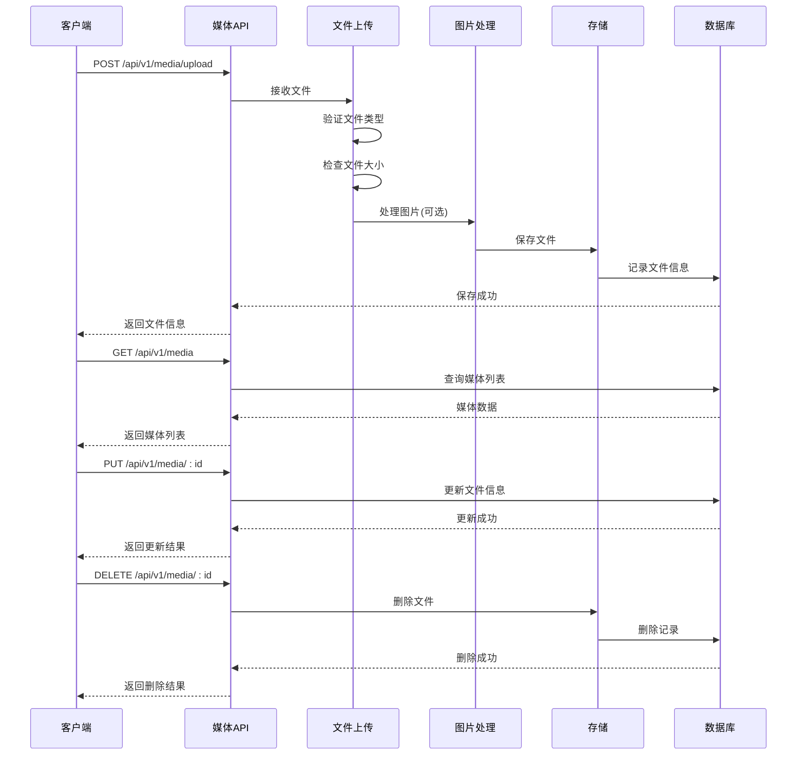

**图表来源**
- [企业网站CMS系统详细需求文档.md](file://企业网站CMS系统详细需求文档.md#L1058-L1066)

**接口列表**：
- `GET /api/v1/media` - 获取媒体列表
- `GET /api/v1/media/:id` - 获取媒体详情
- `POST /api/v1/media/upload` - 上传文件
- `POST /api/v1/media/bulk-upload` - 批量上传
- `PUT /api/v1/media/:id` - 更新媒体信息
- `DELETE /api/v1/media/:id` - 删除媒体

**支持的文件类型**：
- **图片**：JPG, PNG, GIF, SVG, WebP
- **视频**：MP4, WebM, MOV
- **文档**：PDF, DOC, DOCX, XLS, XLSX

**功能特性**：
- **拖拽上传**：支持拖拽上传和批量上传
- **粘贴上传**：支持截图粘贴上传
- **文件压缩**：支持图片自动压缩
- **文件夹管理**：支持文件夹组织
- **文件编辑**：支持图片裁剪、旋转、缩放、滤镜
- **存储管理**：支持本地存储和云存储

**章节来源**
- [企业网站CMS系统详细需求文档.md](file://企业网站CMS系统详细需求文档.md#L1058-L1066)

### 系统配置接口

系统配置接口提供网站设置和系统管理功能：

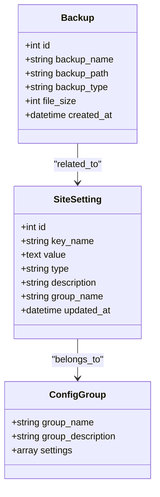

**图表来源**
- [企业网站CMS系统详细需求文档.md](file://企业网站CMS系统详细需求文档.md#L879-L889)

**接口列表**：
- `GET /api/v1/settings` - 获取所有配置
- `GET /api/v1/settings/:group` - 获取分组配置
- `PUT /api/v1/settings` - 更新配置
- `POST /api/v1/backup` - 创建备份
- `GET /api/v1/backup` - 获取备份列表
- `POST /api/v1/backup/:id/restore` - 恢复备份

**配置类别**：
- **网站基本设置**：网站名称、Logo、联系方式、社交媒体链接
- **SEO配置**：Meta标签、Google Analytics、百度统计
- **URL配置**：URL重写规则、固定链接格式
- **邮件配置**：SMTP服务器、发件人邮箱、邮件模板
- **安全设置**：HTTPS、CORS、API频率限制
- **性能配置**：缓存、CDN、图片压缩
- **备份管理**：自动备份、手动备份、备份恢复

**章节来源**
- [企业网站CMS系统详细需求文档.md](file://企业网站CMS系统详细需求文档.md#L1068-L1076)

## 依赖分析

系统采用模块化的依赖设计，各组件之间通过清晰的接口进行通信：

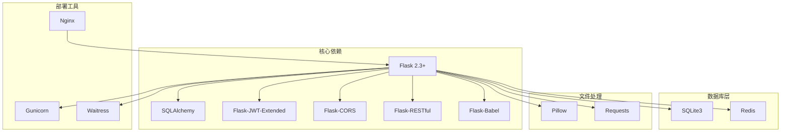

**图表来源**
- [企业网站CMS系统详细需求文档.md](file://企业网站CMS系统详细需求文档.md#L555-L594)

**章节来源**
- [企业网站CMS系统详细需求文档.md](file://企业网站CMS系统详细需求文档.md#L555-L594)

## 性能考虑

系统在设计时充分考虑了性能优化，采用多种策略提升系统性能：

### 缓存策略

系统采用多层缓存架构：
- **页面缓存**：使用Redis缓存全页面内容
- **数据缓存**：缓存数据库查询结果
- **静态资源缓存**：浏览器端缓存静态文件
- **API响应缓存**：缓存API响应数据

### 数据库优化

- **索引优化**：为常用查询字段建立索引
- **查询优化**：避免N+1查询问题
- **连接池**：使用连接池管理数据库连接
- **慢查询日志**：监控和分析慢查询

### 文件处理优化

- **图片压缩**：自动压缩图片文件大小
- **懒加载**：支持图片懒加载
- **CDN支持**：支持静态资源CDN加速
- **响应式图片**：支持srcset响应式图片

**章节来源**
- [企业网站CMS系统详细需求文档.md](file://企业网站CMS系统详细需求文档.md#L512-L548)

## 故障排除指南

### 常见问题及解决方案

**认证相关问题**：
- **Token过期**：使用刷新Token获取新的访问Token
- **权限不足**：检查用户角色和权限配置
- **登录失败**：检查用户名密码是否正确

**文件上传问题**：
- **文件类型错误**：检查文件扩展名是否在允许列表中
- **文件过大**：检查MAX_CONTENT_LENGTH配置
- **上传失败**：检查上传目录权限和磁盘空间

**数据库连接问题**：
- **连接超时**：检查数据库连接配置
- **表结构不匹配**：运行数据库迁移命令
- **权限不足**：检查数据库用户权限

**性能问题**：
- **页面加载慢**：启用缓存和CDN
- **API响应慢**：优化查询和索引
- **内存占用高**：检查内存泄漏和缓存配置

### 调试工具

系统提供了完善的调试和监控工具：
- **日志系统**：详细的访问日志和错误日志
- **性能监控**：监控系统性能指标
- **错误追踪**：集成Sentry进行错误追踪
- **数据库监控**：监控数据库查询性能

**章节来源**
- [企业网站CMS系统详细需求文档.md](file://企业网站CMS系统详细需求文档.md#L1360-L1423)

## 结论

企业网站CMS系统是一个功能完整、架构合理的现代化内容管理系统。通过采用Python Flask + Nginx + Windows Server的技术栈，系统实现了以下目标：

**技术优势**：
- **轻量级架构**：采用SQLite3数据库，部署简单，运维成本低
- **前后端分离**：清晰的API设计，支持多种前端框架
- **可视化编辑**：拖拽式布局配置，降低技术门槛
- **多语言支持**：完整的国际化解决方案

**功能完整性**：
- **内容管理**：完整的文章、页面、媒体管理功能
- **权限控制**：基于角色的细粒度权限管理
- **SEO优化**：内置SEO配置和优化工具
- **性能优化**：多层缓存和性能优化策略

**部署便利性**：
- **Windows友好**：针对Windows Server环境优化
- **自动化部署**：支持NSSM服务管理和自动启动
- **配置简单**：环境变量配置，易于部署和维护

该系统特别适合中小企业的官网建设和维护，能够帮助非技术用户轻松管理网站内容，同时为技术团队提供强大的后台管理功能。