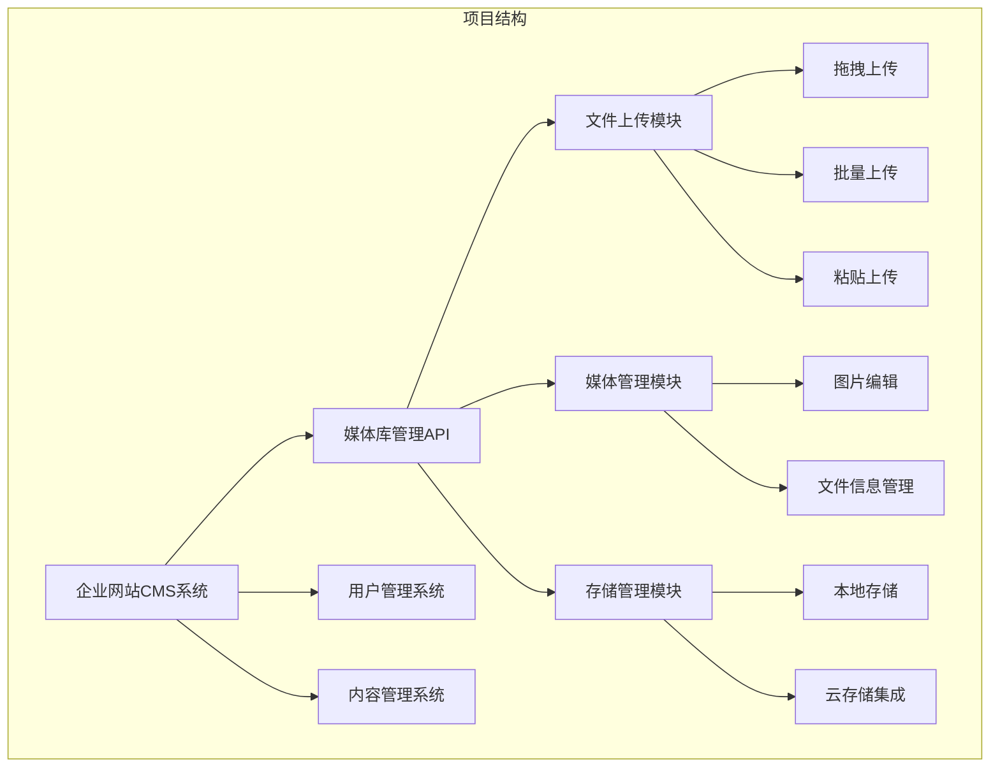
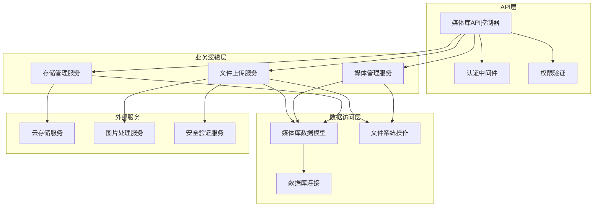
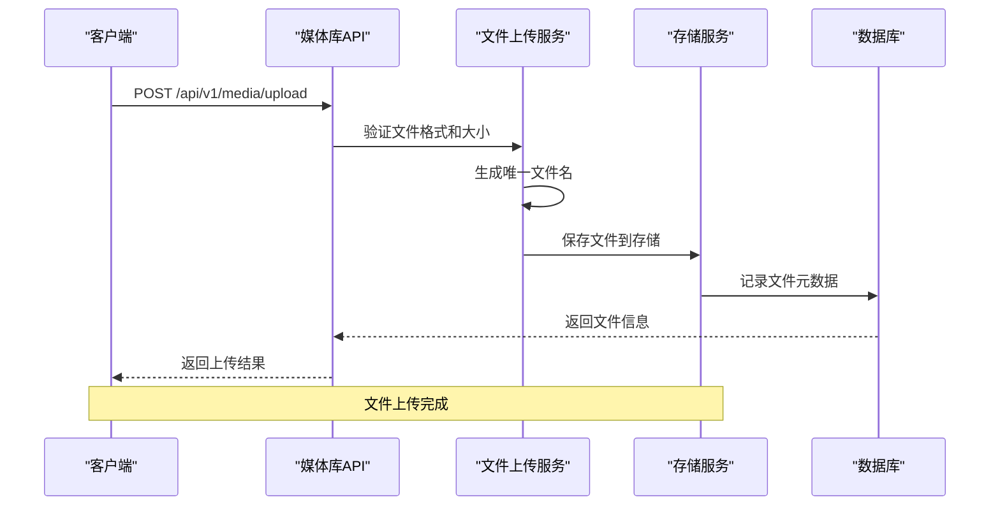
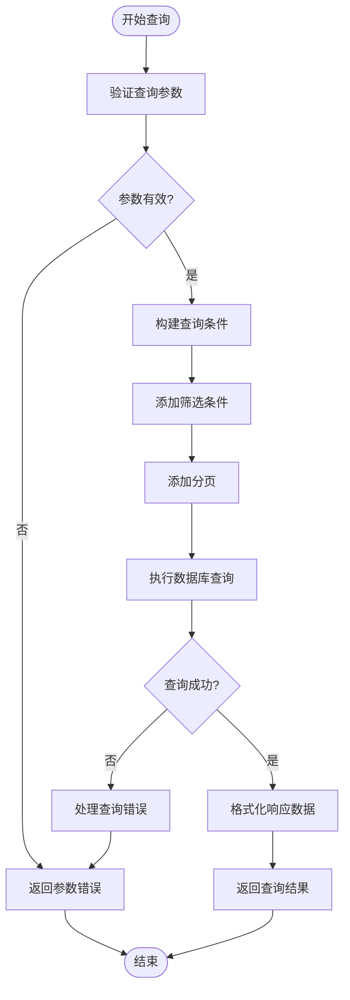
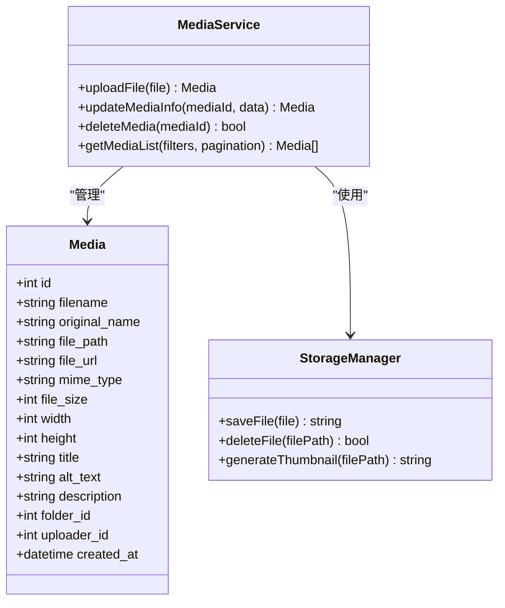
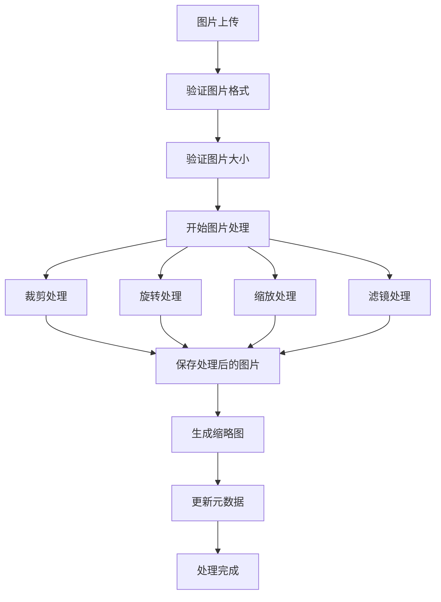
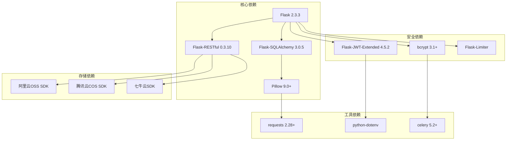

# 媒体库管理API

<cite>
**本文档引用的文件**
- [企业网站CMS系统详细需求文档.md](file://企业网站CMS系统详细需求文档.md)
- [开发计划表_2月4日-2月12日.md](file://开发计划表_2月4日-2月12日.md)
- [企业网站CMS系统开发需求文档.ini](file://企业网站CMS系统开发需求文档.ini)
</cite>

## 目录
1. [简介](#简介)
2. [项目结构](#项目结构)
3. [核心组件](#核心组件)
4. [架构概览](#架构概览)
5. [详细组件分析](#详细组件分析)
6. [依赖关系分析](#依赖关系分析)
7. [性能考虑](#性能考虑)
8. [故障排除指南](#故障排除指南)
9. [结论](#结论)

## 简介

媒体库管理API是企业网站CMS系统的核心功能模块，负责管理网站中的所有媒体文件，包括图片、视频和文档等多媒体资源。该API提供了完整的文件生命周期管理能力，从文件上传、存储、检索到编辑和删除的全流程支持。

本API采用RESTful设计原则，遵循统一的请求/响应格式和错误处理机制，确保系统的可维护性和扩展性。支持多种文件格式，具备完善的文件安全验证和云存储集成能力。

## 项目结构

基于需求文档分析，媒体库管理API位于企业网站CMS系统的后端服务中，采用Flask框架实现。项目结构清晰，功能模块划分明确：



**图表来源**
- [企业网站CMS系统详细需求文档.md](file://企业网站CMS系统详细需求文档.md#L355-L387)

**章节来源**
- [企业网站CMS系统详细需求文档.md](file://企业网站CMS系统详细需求文档.md#L355-L387)
- [开发计划表_2月4日-2月12日.md](file://开发计划表_2月4日-2月12日.md#L196-L252)

## 核心组件

媒体库管理API由以下核心组件构成：

### 1. 文件上传组件
- **拖拽上传**: 支持拖拽文件到指定区域进行上传
- **批量上传**: 支持同时上传多个文件
- **粘贴上传**: 支持截图粘贴上传
- **文件格式支持**: JPG, PNG, GIF, SVG, WebP, MP4, WebM, MOV, PDF, DOC, DOCX, XLS, XLSX

### 2. 媒体管理组件
- **列表视图/网格视图**: 支持多种展示方式
- **文件夹组织**: 支持文件夹层级管理
- **文件筛选**: 支持按类型、日期、尺寸筛选
- **文件搜索**: 支持全文搜索功能

### 3. 图片编辑组件
- **裁剪**: 支持矩形裁剪和自由裁剪
- **旋转**: 支持90°、180°、270°旋转
- **缩放**: 支持等比例缩放
- **滤镜**: 支持多种滤镜效果

### 4. 存储管理组件
- **本地存储**: 文件存储在本地磁盘
- **云存储支持**: 阿里云OSS、腾讯云COS、七牛云
- **存储空间统计**: 实时统计存储使用情况
- **未使用文件清理**: 自动清理未使用的文件

**章节来源**
- [企业网站CMS系统详细需求文档.md](file://企业网站CMS系统详细需求文档.md#L355-L387)
- [开发计划表_2月4日-2月12日.md](file://开发计划表_2月4日-2月12日.md#L196-L252)

## 架构概览

媒体库管理API采用分层架构设计，确保各层职责清晰，便于维护和扩展：



**图表来源**
- [企业网站CMS系统详细需求文档.md](file://企业网站CMS系统详细需求文档.md#L940-L1139)

## 详细组件分析

### API接口规范

#### 基础规范
- **协议**: HTTPS
- **格式**: JSON
- **编码**: UTF-8
- **API前缀**: `/api/v1/`
- **认证方式**: JWT Token (Header: `Authorization: Bearer <token>`)

#### 请求格式
```json
{
  "data": {},
  "meta": {
    "request_id": "uuid"
  }
}
```

#### 响应格式
```json
{
  "code": 200,
  "message": "success",
  "data": {},
  "meta": {
    "timestamp": 1234567890,
    "request_id": "uuid"
  }
}
```

#### HTTP状态码
- **200**: 成功
- **201**: 创建成功
- **204**: 删除成功
- **400**: 请求参数错误
- **401**: 未认证
- **403**: 无权限
- **404**: 资源不存在
- **500**: 服务器错误

**章节来源**
- [企业网站CMS系统详细需求文档.md](file://企业网站CMS系统详细需求文档.md#L940-L983)

### 媒体库接口定义

#### 文件上传接口
- **GET /api/v1/media**: 获取媒体列表
- **GET /api/v1/media/:id**: 获取媒体详情
- **POST /api/v1/media/upload**: 上传单个文件
- **POST /api/v1/media/bulk-upload**: 批量上传文件
- **PUT /api/v1/media/:id**: 更新媒体信息
- **DELETE /api/v1/media/:id**: 删除媒体文件

#### 文件上传流程



**图表来源**
- [企业网站CMS系统详细需求文档.md](file://企业网站CMS系统详细需求文档.md#L1058-L1066)

#### 媒体列表查询
支持分页查询，支持按类型、日期、尺寸等条件筛选：



**图表来源**
- [企业网站CMS系统详细需求文档.md](file://企业网站CMS系统详细需求文档.md#L1058-L1066)

#### 文件信息编辑
支持编辑文件的标题、描述、ALT文本等元数据：



**图表来源**
- [企业网站CMS系统详细需求文档.md](file://企业网站CMS系统详细需求文档.md#L841-L861)

**章节来源**
- [企业网站CMS系统详细需求文档.md](file://企业网站CMS系统详细需求文档.md#L1058-L1066)
- [企业网站CMS系统详细需求文档.md](file://企业网站CMS系统详细需求文档.md#L841-L861)

### 文件格式支持与限制

#### 支持的文件格式
- **图片**: JPG, PNG, GIF, SVG, WebP
- **视频**: MP4, WebM, MOV  
- **文档**: PDF, DOC, DOCX, XLS, XLSX

#### 文件大小限制
- **默认限制**: 50MB
- **可配置**: 支持通过环境变量配置
- **上传路径**: `D:/cms/media/YYYY/MM/`

#### 自动压缩功能
- **图片压缩**: 自动压缩到合理质量
- **缩略图生成**: 自动生成300x300像素缩略图
- **质量控制**: 支持配置压缩质量参数

**章节来源**
- [开发计划表_2月4日-2月12日.md](file://开发计划表_2月4日-2月12日.md#L196-L252)
- [企业网站CMS系统详细需求文档.md](file://企业网站CMS系统详细需求文档.md#L1272-L1276)

### 图片编辑功能

#### 编辑功能列表
- **裁剪**: 支持矩形裁剪和自由裁剪
- **旋转**: 支持90°、180°、270°旋转
- **缩放**: 支持等比例缩放
- **滤镜**: 支持多种滤镜效果

#### 图片处理流程



**图表来源**
- [企业网站CMS系统详细需求文档.md](file://企业网站CMS系统详细需求文档.md#L372-L377)

**章节来源**
- [企业网站CMS系统详细需求文档.md](file://企业网站CMS系统详细需求文档.md#L372-L377)

### 文件夹管理

#### 文件夹组织结构
- **层级管理**: 支持多级文件夹
- **默认文件夹**: ID为0表示根目录
- **文件移动**: 支持将文件移动到不同文件夹

#### 文件夹操作接口
- **创建文件夹**: POST /api/v1/media/folders
- **删除文件夹**: DELETE /api/v1/media/folders/:id
- **重命名文件夹**: PUT /api/v1/media/folders/:id
- **获取文件夹内容**: GET /api/v1/media/folders/:id

**章节来源**
- [企业网站CMS系统详细需求文档.md](file://企业网站CMS系统详细需求文档.md#L369)

### 存储管理

#### 本地存储配置
- **存储路径**: `D:/cms/media/`
- **日期分组**: 按年/月自动创建文件夹
- **文件命名**: 使用随机化文件名避免冲突

#### 云存储集成
支持多种云存储服务：
- **阿里云OSS**: 对象存储服务
- **腾讯云COS**: 对象存储服务  
- **七牛云**: 云存储服务

#### 存储空间统计
- **实时统计**: 显示当前存储使用情况
- **容量限制**: 支持配置存储容量上限
- **清理策略**: 自动清理未使用文件

**章节来源**
- [企业网站CMS系统详细需求文档.md](file://企业网站CMS系统详细需求文档.md#L380-L387)

### 文件安全验证

#### 安全策略
- **文件类型白名单**: 严格限制允许的文件类型
- **文件大小限制**: 防止大文件占用存储空间
- **文件名随机化**: 防止路径遍历攻击
- **病毒扫描**: 可选的病毒扫描功能
- **存储路径限制**: 限制文件只能存储在指定目录

#### 访问频率限制
- **Flask-Limiter**: 基于IP和用户的访问限制
- **不同接口不同限制**: 根据接口重要性设置不同限制
- **异常行为检测**: 检测和阻止恶意请求

**章节来源**
- [企业网站CMS系统详细需求文档.md](file://企业网站CMS系统详细需求文档.md#L1116-L1140)

## 依赖关系分析

媒体库管理API的依赖关系如下：



**图表来源**
- [企业网站CMS系统详细需求文档.md](file://企业网站CMS系统详细需求文档.md#L588-L594)

**章节来源**
- [企业网站CMS系统详细需求文档.md](file://企业网站CMS系统详细需求文档.md#L588-L594)

## 性能考虑

### 性能优化策略
- **图片压缩**: 自动压缩减少存储空间和带宽消耗
- **缓存机制**: Redis缓存常用数据
- **异步处理**: 大文件处理使用Celery异步队列
- **CDN支持**: 静态资源通过CDN加速
- **懒加载**: 图片懒加载提升页面性能

### 性能指标
- **页面加载时间**: < 3秒
- **API响应时间**: < 500ms
- **图片上传速度**: < 5秒/5MB
- **并发用户支持**: > 1000用户
- **数据库查询响应**: < 100ms

### 部署配置
- **Nginx反向代理**: 提供静态文件服务和负载均衡
- **HTTPS强制跳转**: 确保数据传输安全
- **Gzip压缩**: 减少网络传输量
- **客户端最大上传大小**: 50MB

**章节来源**
- [企业网站CMS系统详细需求文档.md](file://企业网站CMS系统详细需求文档.md#L1827-L1852)
- [企业网站CMS系统详细需求文档.md](file://企业网站CMS系统详细需求文档.md#L1141-L1230)

## 故障排除指南

### 常见问题及解决方案

#### 文件上传失败
**问题**: 上传文件时出现错误
**可能原因**:
- 文件格式不在白名单中
- 文件大小超过限制
- 存储空间不足
- 权限不足

**解决方法**:
1. 检查文件格式是否在支持列表中
2. 确认文件大小不超过50MB限制
3. 清理存储空间或升级存储套餐
4. 检查文件系统权限

#### 图片处理异常
**问题**: 图片编辑功能无法正常使用
**可能原因**:
- Pillow库未正确安装
- 图片格式不受支持
- 磁盘空间不足

**解决方法**:
1. 重新安装Pillow库
2. 确认图片格式在支持列表中
3. 检查磁盘空间并清理

#### API访问错误
**问题**: API调用返回401或403错误
**可能原因**:
- JWT Token无效或过期
- 权限不足
- CORS配置问题

**解决方法**:
1. 刷新JWT Token
2. 检查用户权限
3. 配置正确的CORS设置

### 错误处理策略

#### 错误响应格式
```json
{
  "code": 400,
  "message": "文件格式不支持",
  "data": null,
  "meta": {
    "timestamp": 1234567890,
    "request_id": "uuid"
  }
}
```

#### 日志记录
- **访问日志**: 记录所有API请求
- **错误日志**: 记录详细的错误信息
- **安全日志**: 记录安全相关事件
- **性能日志**: 记录响应时间和性能指标

**章节来源**
- [企业网站CMS系统详细需求文档.md](file://企业网站CMS系统详细需求文档.md#L974-L983)
- [企业网站CMS系统详细需求文档.md](file://企业网站CMS系统详细需求文档.md#L1141-L1230)

## 结论

媒体库管理API为企业网站CMS系统提供了完整的媒体文件管理解决方案。该API具有以下特点：

### 核心优势
- **功能完整**: 支持文件上传、管理、编辑、删除的完整生命周期
- **安全可靠**: 采用多重安全验证和防护机制
- **性能优秀**: 优化的存储和传输策略
- **易于扩展**: 模块化的架构设计

### 技术特色
- **RESTful设计**: 符合现代API设计标准
- **云存储集成**: 支持多种云存储服务
- **图片处理**: 内置强大的图片编辑功能
- **分层架构**: 清晰的职责分离

### 适用场景
- 企业官网媒体管理
- 电商产品图片管理
- 新闻媒体内容管理
- 在线教育课程资源管理

该API为后续的功能扩展和维护奠定了坚实的基础，能够满足企业级应用的各种需求。