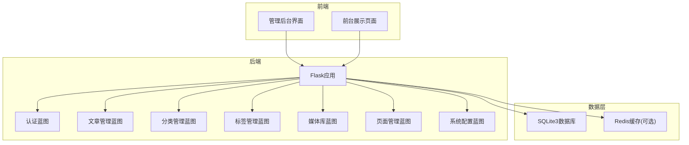
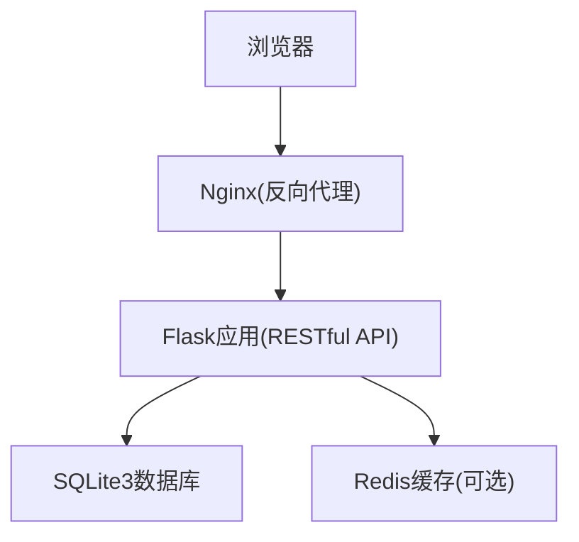
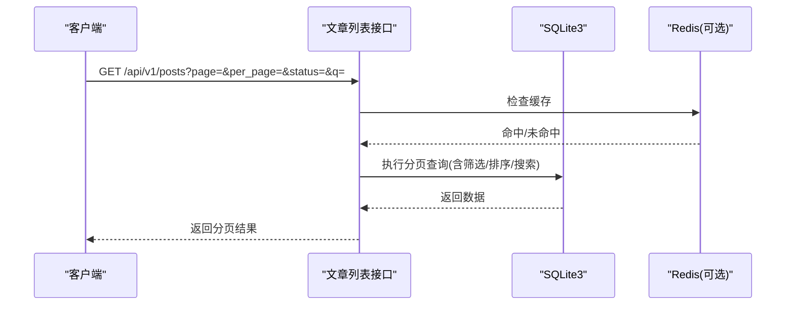
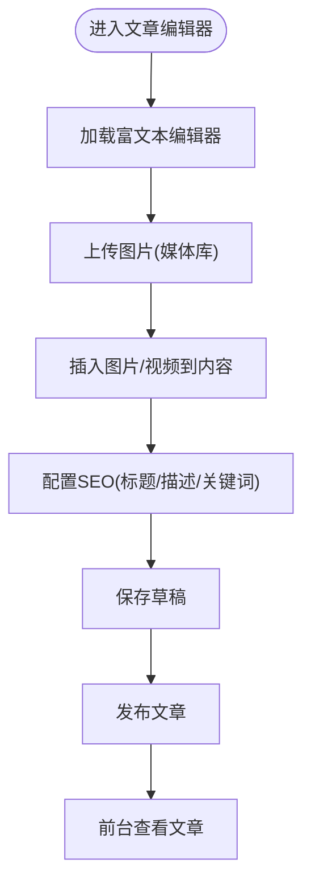
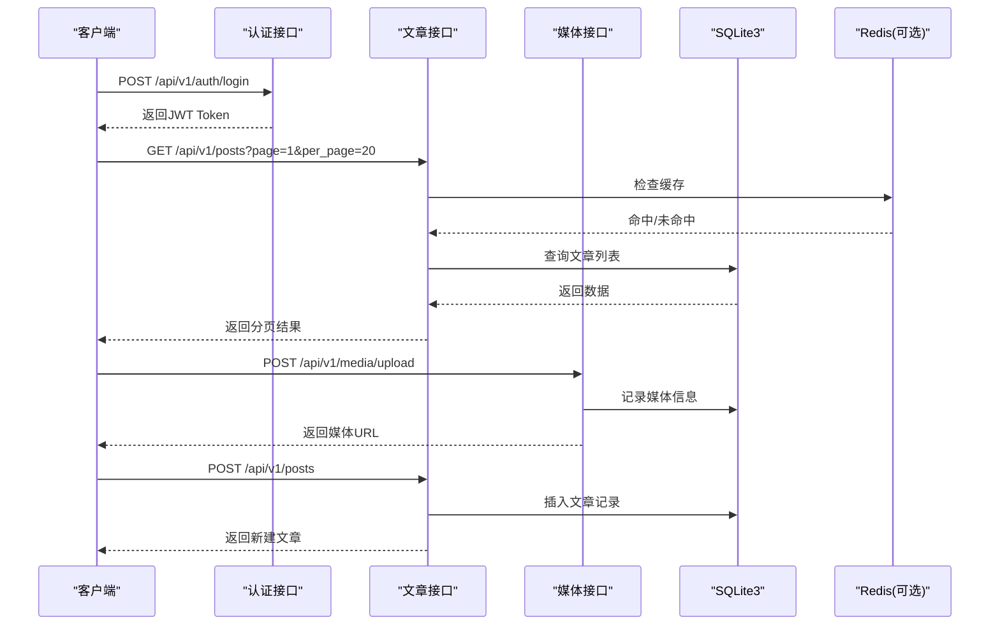
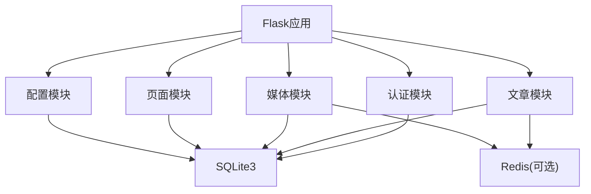

# 文章管理API

<cite>
**本文档引用的文件**
- [企业网站CMS系统详细需求文档.md](file://企业网站CMS系统详细需求文档.md)
- [企业网站CMS系统开发需求文档.ini](file://企业网站CMS系统开发需求文档.ini)
- [开发计划表_2月4日-2月12日.md](file://开发计划表_2月4日-2月12日.md)
</cite>

## 目录
1. [简介](#简介)
2. [项目结构](#项目结构)
3. [核心组件](#核心组件)
4. [架构总览](#架构总览)
5. [详细组件分析](#详细组件分析)
6. [依赖关系分析](#依赖关系分析)
7. [性能考虑](#性能考虑)
8. [故障排除指南](#故障排除指南)
9. [结论](#结论)

## 简介
本文件面向企业网站CMS系统的“文章管理API”，基于仓库中的需求文档与开发计划，系统化梳理文章的完整CRUD接口与相关能力，包括：
- 文章列表查询（分页、筛选、排序）
- 文章创建、更新、删除
- 文章状态管理（草稿/发布/私有等）
- 批量操作（批量删除、批量状态变更）
- 文章内容编辑器相关接口（富文本、特色图片上传、SEO设置）
- 参数校验、错误处理与权限控制

该系统采用前后端分离架构，后端基于Flask，前端可选React/Vue或纯HTML模板，API遵循RESTful风格，统一使用JWT进行认证与授权。

## 项目结构
后端采用Flask蓝图模式组织，核心模块包含认证、文章管理、分类标签、媒体库、页面管理、系统配置等。数据库采用SQLite3，结合Redis（可选）进行缓存与会话管理。

**图表来源**
- [企业网站CMS系统详细需求文档.md](file://企业网站CMS系统详细需求文档.md#L22-L57)
- [开发计划表_2月4日-2月12日.md](file://开发计划表_2月4日-2月12日.md#L92-L105)

**章节来源**
- [企业网站CMS系统详细需求文档.md](file://企业网站CMS系统详细需求文档.md#L22-L57)
- [开发计划表_2月4日-2月12日.md](file://开发计划表_2月4日-2月12日.md#L92-L105)

## 核心组件
- 认证与授权：基于JWT的用户认证、权限装饰器、角色与权限模型
- 文章管理：文章CRUD、状态管理、批量操作、分页与筛选
- 分类与标签：树形分类、标签管理
- 媒体库：文件上传、缩略图生成、媒体列表与信息编辑
- 页面管理：页面CRUD、组件配置（JSON存储）、页面状态管理
- 系统配置：网站基本信息、SEO配置、备份与恢复

**章节来源**
- [企业网站CMS系统详细需求文档.md](file://企业网站CMS系统详细需求文档.md#L235-L446)
- [开发计划表_2月4日-2月12日.md](file://开发计划表_2月4日-2月12日.md#L137-L284)

## 架构总览
系统采用前后端分离架构，Nginx作为反向代理与静态资源服务，Flask提供RESTful API，数据库为SQLite3，Redis用于缓存与会话（可选）。JWT用于认证，支持Access Token与Refresh Token机制。

**图表来源**
- [企业网站CMS系统详细需求文档.md](file://企业网站CMS系统详细需求文档.md#L22-L57)
- [企业网站CMS系统详细需求文档.md](file://企业网站CMS系统详细需求文档.md#L1141-L1230)

**章节来源**
- [企业网站CMS系统详细需求文档.md](file://企业网站CMS系统详细需求文档.md#L22-L57)
- [企业网站CMS系统详细需求文档.md](file://企业网站CMS系统详细需求文档.md#L1141-L1230)

## 详细组件分析

### 文章管理API规范

#### 1. 文章列表查询
- 方法与路径：GET /api/v1/posts
- 功能：支持分页、筛选、排序、搜索
- 分页参数：
  - page：当前页，默认1
  - per_page：每页条数，默认20，最大100
- 筛选条件：
  - status：文章状态（draft/published/private）
  - category_id：分类ID
  - tag_id：标签ID
  - author_id：作者ID
  - date_from/date_to：发布时间范围
- 搜索条件：
  - q：全文搜索（基于FTS5虚拟表）
- 排序规则：
  - created_at（默认降序）
  - updated_at
  - published_at
  - view_count
- 响应格式：包含分页信息的列表数据
- 权限：需要登录；作者仅能查看自己的文章（数据级权限）

**图表来源**
- [企业网站CMS系统详细需求文档.md](file://企业网站CMS系统详细需求文档.md#L940-L998)
- [企业网站CMS系统详细需求文档.md](file://企业网站CMS系统详细需求文档.md#L906-L938)

**章节来源**
- [企业网站CMS系统详细需求文档.md](file://企业网站CMS系统详细需求文档.md#L940-L998)
- [企业网站CMS系统详细需求文档.md](file://企业网站CMS系统详细需求文档.md#L906-L938)

#### 2. 文章详情查询
- 方法与路径：GET /api/v1/posts/:id
- 功能：获取指定文章详情
- 权限：公开文章无需登录；私有文章需作者或管理员；草稿仅作者可见
- 响应：文章完整信息（含内容、SEO、分类、标签、作者等）

**章节来源**
- [企业网站CMS系统详细需求文档.md](file://企业网站CMS系统详细需求文档.md#L1023-L1032)

#### 3. 创建文章
- 方法与路径：POST /api/v1/posts
- 请求体字段：
  - title：标题（必填）
  - slug：URL别名（唯一，可选）
  - content：内容（富文本）
  - excerpt：摘要（可选）
  - featured_image：特色图片（可选）
  - category_ids：分类ID数组（可选）
  - tag_ids：标签ID数组（可选）
  - status：状态（draft/published/private，默认draft）
  - published_at：发布时间（可选）
  - comment_status：是否允许评论（默认允许）
  - is_sticky：是否置顶（默认否）
  - template：页面模板（可选）
  - seo：SEO设置（title/description/keywords/og等，可选）
- 权限：需要登录；作者可创建自己的文章
- 响应：返回新建文章的完整信息

**章节来源**
- [企业网站CMS系统详细需求文档.md](file://企业网站CMS系统详细需求文档.md#L296-L318)
- [开发计划表_2月4日-2月12日.md](file://开发计划表_2月4日-2月12日.md#L160-L174)

#### 4. 更新文章
- 方法与路径：PUT /api/v1/posts/:id
- 请求体字段：同创建接口（可部分更新）
- 权限：作者或管理员；草稿可随时修改；已发布文章可能有限制
- 响应：返回更新后的文章信息

**章节来源**
- [企业网站CMS系统详细需求文档.md](file://企业网站CMS系统详细需求文档.md#L1023-L1032)
- [开发计划表_2月4日-2月12日.md](file://开发计划表_2月4日-2月12日.md#L160-L174)

#### 5. 删除文章
- 方法与路径：DELETE /api/v1/posts/:id
- 权限：作者或管理员
- 响应：删除成功（204 No Content）

**章节来源**
- [企业网站CMS系统详细需求文档.md](file://企业网站CMS系统详细需求文档.md#L1023-L1032)

#### 6. 批量删除
- 方法与路径：POST /api/v1/posts/bulk-delete
- 请求体：ids数组（文章ID列表）
- 权限：作者或管理员
- 响应：批量删除结果

**章节来源**
- [企业网站CMS系统详细需求文档.md](file://企业网站CMS系统详细需求文档.md#L1023-L1032)

#### 7. 修改文章状态
- 方法与路径：PUT /api/v1/posts/:id/status
- 请求体：status（draft/published/private）
- 权限：作者或管理员
- 响应：返回更新后的状态

**章节来源**
- [企业网站CMS系统详细需求文档.md](file://企业网站CMS系统详细需求文档.md#L1023-L1032)

#### 8. 文章内容编辑器相关接口
- 富文本编辑：
  - 富文本内容字段：content（支持图片、视频、表格、代码块等）
  - 编辑器：Quill.js/TinyMCE（前端集成）
- 特色图片上传：
  - 接口：POST /api/v1/media/upload
  - 支持格式：JPG、PNG、GIF、SVG、WebP
  - 大小限制：5MB
  - 自动生成缩略图：300x300
- SEO设置：
  - 字段：slug、seo.title、seo.description、seo.keywords、seo.og等
  - URL别名：自动生成或自定义
  - 规范链接与社交分享标签支持

**图表来源**
- [企业网站CMS系统详细需求文档.md](file://企业网站CMS系统详细需求文档.md#L1058-L1066)
- [企业网站CMS系统详细需求文档.md](file://企业网站CMS系统详细需求文档.md#L482-L511)

**章节来源**
- [企业网站CMS系统详细需求文档.md](file://企业网站CMS系统详细需求文档.md#L1058-L1066)
- [企业网站CMS系统详细需求文档.md](file://企业网站CMS系统详细需求文档.md#L482-L511)

### API调用流程（序列图）

**图表来源**
- [企业网站CMS系统详细需求文档.md](file://企业网站CMS系统详细需求文档.md#L1002-L1011)
- [企业网站CMS系统详细需求文档.md](file://企业网站CMS系统详细需求文档.md#L1023-L1032)
- [企业网站CMS系统详细需求文档.md](file://企业网站CMS系统详细需求文档.md#L1058-L1066)

**章节来源**
- [企业网站CMS系统详细需求文档.md](file://企业网站CMS系统详细需求文档.md#L1002-L1011)
- [企业网站CMS系统详细需求文档.md](file://企业网站CMS系统详细需求文档.md#L1023-L1032)
- [企业网站CMS系统详细需求文档.md](file://企业网站CMS系统详细需求文档.md#L1058-L1066)

## 依赖关系分析
- 认证与授权依赖：JWT、bcrypt、Flask-Login、Flask-JWT-Extended
- 数据持久化：Flask-SQLAlchemy + SQLite3；可选Redis
- 文件上传：Pillow（图片处理）、文件类型白名单、大小限制
- 前端集成：React/Vue（可选）+ Axios；富文本编辑器（Quill/TinyMCE）
- 部署：Nginx反向代理、Windows服务（NSSM/Waitress）

**图表来源**
- [企业网站CMS系统详细需求文档.md](file://企业网站CMS系统详细需求文档.md#L555-L594)
- [开发计划表_2月4日-2月12日.md](file://开发计划表_2月4日-2月12日.md#L92-L105)

**章节来源**
- [企业网站CMS系统详细需求文档.md](file://企业网站CMS系统详细需求文档.md#L555-L594)
- [开发计划表_2月4日-2月12日.md](file://开发计划表_2月4日-2月12日.md#L92-L105)

## 性能考虑
- 分页与索引：合理使用分页参数与数据库索引（如type/status/slug/published_at），避免全表扫描
- 缓存策略：Redis缓存热门文章列表与详情，设置合理过期时间
- 图片优化：上传时压缩与生成缩略图，前端懒加载与CDN加速
- 查询优化：避免N+1查询，批量操作使用批量接口
- 并发写入：SQLite适用于低并发场景；高并发可考虑MySQL/Redis

**章节来源**
- [企业网站CMS系统详细需求文档.md](file://企业网站CMS系统详细需求文档.md#L538-L548)
- [企业网站CMS系统详细需求文档.md](file://企业网站CMS系统详细需求文档.md#L660-L713)

## 故障排除指南
- 认证失败（401/403）：检查Token是否过期、权限是否足够、是否正确携带Authorization头
- 参数错误（400）：检查请求体字段是否符合要求（必填字段、格式、范围）
- 资源不存在（404）：确认ID是否存在、是否被删除
- 服务器错误（500）：查看后端日志，定位异常堆栈
- 文件上传失败：检查文件类型、大小限制、存储路径权限
- 性能问题：启用Redis缓存、优化查询、减少不必要的字段返回

**章节来源**
- [企业网站CMS系统详细需求文档.md](file://企业网站CMS系统详细需求文档.md#L974-L982)
- [开发计划表_2月4日-2月12日.md](file://开发计划表_2月4日-2月12日.md#L439-L507)

## 结论
本文档基于现有需求文档与开发计划，系统化梳理了文章管理API的完整能力边界与接口规范，覆盖CRUD、状态管理、批量操作、富文本与媒体上传、SEO设置等核心功能，并提供了参数校验、错误处理与权限控制的指导。建议在实际开发中：
- 严格遵循JWT认证与RBAC权限模型
- 使用分页与索引优化查询性能
- 对富文本内容进行安全过滤与XSS防护
- 对文件上传进行类型与大小校验
- 在高并发场景评估Redis与数据库迁移方案