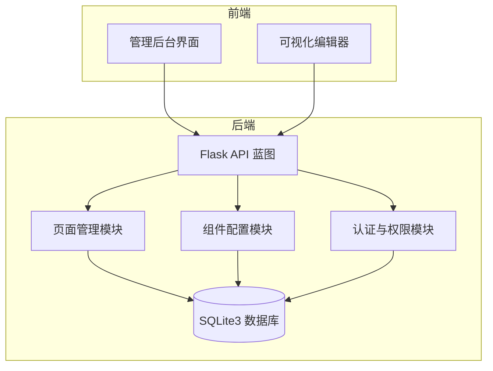
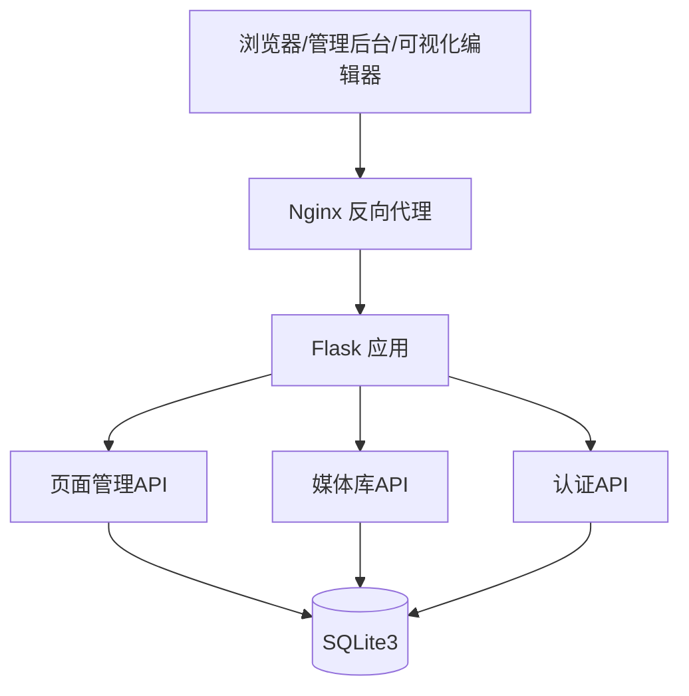
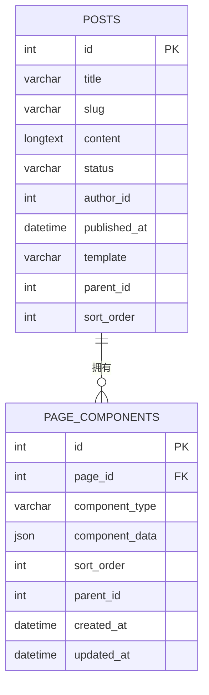
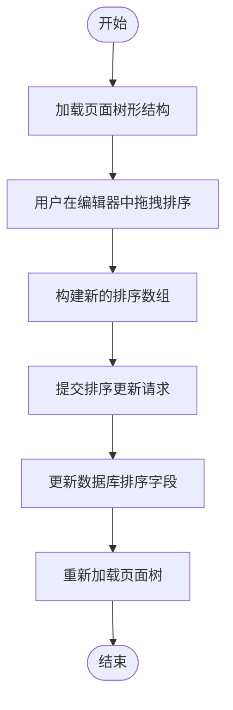
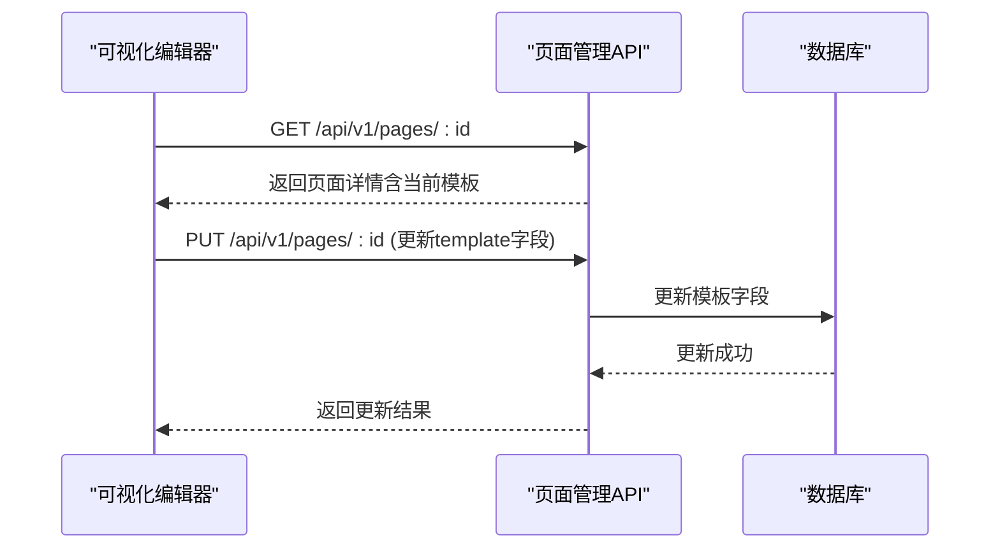
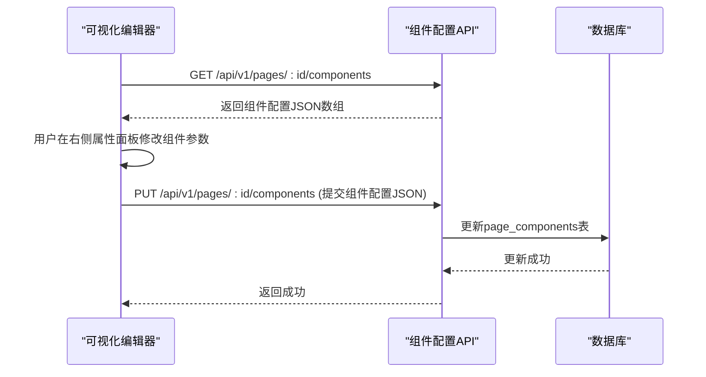
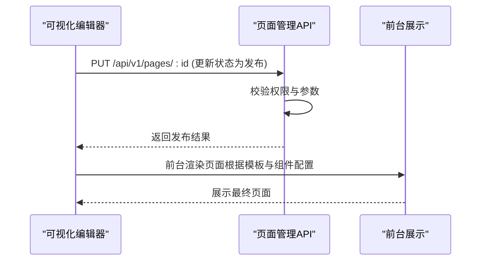
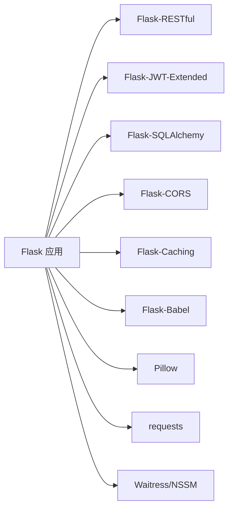

# 页面管理API

<cite>
**本文档引用的文件**
- [企业网站CMS系统详细需求文档.md](file://企业网站CMS系统详细需求文档.md)
- [开发计划表_2月4日-2月12日.md](file://开发计划表_2月4日-2月12日.md)
</cite>

## 目录
1. [简介](#简介)
2. [项目结构](#项目结构)
3. [核心组件](#核心组件)
4. [架构总览](#架构总览)
5. [详细组件分析](#详细组件分析)
6. [依赖分析](#依赖分析)
7. [性能考虑](#性能考虑)
8. [故障排除指南](#故障排除指南)
9. [结论](#结论)
10. [附录](#附录)

## 简介
本文件面向企业网站CMS系统的“页面管理API”，聚焦于可视化编辑、拖拽布局配置、页面模板管理等能力，覆盖页面列表查询、页面创建、页面更新、页面删除、页面组件配置、页面预览、页面发布等RESTful接口。文档同时给出权限验证、错误处理策略、请求/响应示例以及与前端可视化编辑器的对接规范，帮助开发者与产品/运营人员高效理解与使用。

## 项目结构
- 后端采用Flask + SQLite3架构，API统一前缀为 /api/v1/，采用JWT认证。
- 页面管理API位于后端蓝图下的pages模块，配合page_components表存储页面组件配置。
- 前端采用React/Vue（可选），通过HTTP客户端调用后端API；可视化编辑器通过拖拽组件将页面布局配置序列化为JSON并提交至后端。

**章节来源**
- file://开发计划表_2月4日-2月12日.md#L92-L105
- file://开发计划表_2月4日-2月12日.md#L192-L239

## 核心组件
- 页面管理模块：提供页面的CRUD、树形结构、拖拽排序、状态管理、模板选择、SEO设置等能力。
- 组件配置模块：以JSON形式存储页面组件配置，支持组件类型、数据、排序、父子关系等。
- 认证与权限模块：基于JWT的认证体系，RBAC权限控制，支持模块级/操作级/数据级权限。
- 媒体库模块：支持图片上传、缩略图生成、文件信息编辑，为页面可视化编辑提供素材支撑。

**章节来源**
- file://开发计划表_2月4日-2月12日.md#L192-L239
- file://企业网站CMS系统详细需求文档.md#L863-L889
- file://企业网站CMS系统详细需求文档.md#L235-L293

## 架构总览
- 前后端分离：前端通过HTTP客户端调用后端RESTful API；编辑器与管理后台共享同一套API。
- 数据持久化：SQLite3作为主数据库，page_components表存储页面组件配置，posts表存储页面元数据。
- 认证与授权：JWT Token，支持登录、登出、刷新、当前用户信息获取；权限装饰器保护敏感接口。
- 部署：Nginx反向代理，静态资源与API分离；Windows Server + Waitress/Gunicorn。

**章节来源**
- file://企业网站CMS系统详细需求文档.md#L22-L57
- file://企业网站CMS系统详细需求文档.md#L940-L998

## 详细组件分析

### 页面管理API规范
- 基础规范
  - 协议：HTTPS
  - 格式：JSON
  - 编码：UTF-8
  - API前缀：/api/v1/
  - 认证方式：JWT Token（Header: Authorization: Bearer <token>）
- 请求/响应格式
  - 请求体：包含 data 和 meta.request_id
  - 响应体：包含 code、message、data、meta（含 timestamp、request_id）
- HTTP状态码
  - 200：成功
  - 201：创建成功
  - 204：删除成功
  - 400：请求参数错误
  - 401：未认证
  - 403：无权限
  - 404：资源不存在
  - 500：服务器错误
- 分页格式
  - data.items + data.pagination（page、per_page、total、total_pages）

- 页面管理接口
  - GET /api/v1/pages：页面列表（支持筛选）
  - GET /api/v1/pages/:id：页面详情
  - POST /api/v1/pages：创建页面
  - PUT /api/v1/pages/:id：更新页面
  - DELETE /api/v1/pages/:id：删除页面
  - GET /api/v1/pages/:id/components：页面组件配置
  - PUT /api/v1/pages/:id/components：更新组件配置

- 页面组件配置数据模型
  - page_id：页面ID
  - component_type：组件类型（如文本、图片、容器、按钮、表单）
  - component_data：组件配置JSON
  - sort_order：排序
  - parent_id：父组件ID（支持层级结构）
  - created_at/updated_at：时间戳

**图表来源**
- [企业网站CMS系统详细需求文档.md](file://企业网站CMS系统详细需求文档.md#L770-L889)

**章节来源**
- file://企业网站CMS系统详细需求文档.md#L940-L998
- file://企业网站CMS系统详细需求文档.md#L1034-L1043
- file://企业网站CMS系统详细需求文档.md#L863-L889

### 页面树形结构与拖拽排序
- 页面树形结构：通过 parent_id 字段实现层级关系，支持无限层级。
- 拖拽排序：通过 sort_order 字段维护页面顺序，编辑器拖拽后提交新的排序数组。
- 拖拽排序流程示意：

**章节来源**
- file://企业网站CMS系统详细需求文档.md#L331-L347
- file://开发计划表_2月4日-2月12日.md#L344-L359

### 页面设置与模板管理
- 页面设置：URL路径、父级页面、页面状态（草稿/发布/私密）、访问权限（公开/登录可见）、SEO设置等。
- 模板选择：首页模板、文章列表模板、文章详情模板、单页模板、自定义模板。
- 模板选择流程示意：

**章节来源**
- file://企业网站CMS系统详细需求文档.md#L338-L354
- file://开发计划表_2月4日-2月12日.md#L372-L394

### 页面组件配置与布局参数传递
- 组件类型：文本、图片、容器、按钮、表单等。
- 组件数据：component_data 为JSON，包含组件属性（如文本内容、图片URL、样式配置等）。
- 布局参数：通过组件的 component_data 传递，编辑器在拖拽时收集配置并提交。
- 组件配置流程示意：

**章节来源**
- file://企业网站CMS系统详细需求文档.md#L1034-L1043
- file://企业网站CMS系统详细需求文档.md#L863-L889

### 页面预览与发布
- 预览：编辑器支持实时预览，切换到预览模式后隐藏编辑工具栏，支持多设备预览。
- 发布：页面状态从草稿切换为发布，支持定时发布、置顶、允许评论等设置。
- 发布流程示意：

**章节来源**
- file://企业网站CMS系统详细需求文档.md#L93-L103
- file://企业网站CMS系统详细需求文档.md#L338-L347

### 权限验证与错误处理策略
- 权限验证：基于JWT的认证体系，RBAC权限控制，支持模块级/操作级/数据级权限。
- 错误处理：
  - 参数校验失败返回400
  - 未认证返回401
  - 无权限返回403
  - 资源不存在返回404
  - 服务器内部错误返回500
- 建议：在编辑器中统一拦截401/403，引导用户重新登录或提示权限不足。

**章节来源**
- file://企业网站CMS系统详细需求文档.md#L235-L293
- file://企业网站CMS系统详细需求文档.md#L974-L983

## 依赖分析
- 后端依赖：Flask、Flask-RESTful、Flask-JWT-Extended、Flask-SQLAlchemy、Flask-CORS、Flask-Caching、Flask-Babel、bcrypt、Pillow、requests、waitress/nssm。
- 前端依赖：React/Vue（可选）、Ant Design/Element Plus、Axios、dnd-kit/vue-draggable（拖拽）、Quill/TinyMCE（富文本）。
- 数据库：SQLite3（主数据库），Redis（可选，用于缓存与Session）。

**章节来源**
- file://企业网站CMS系统详细需求文档.md#L555-L594
- file://开发计划表_2月4日-2月12日.md#L850-L899

## 性能考虑
- 缓存策略：页面缓存（Redis）、数据缓存、静态资源缓存（CDN）。
- 资源优化：图片懒加载、响应式图片、WebP格式、CSS/JS压缩合并。
- 数据库优化：合理索引、查询优化、连接池配置、慢查询日志。
- 并发与部署：Windows Server + Waitress，Nginx反向代理，静态资源与API分离。

**章节来源**
- file://企业网站CMS系统详细需求文档.md#L512-L548
- file://企业网站CMS系统详细需求文档.md#L1141-L1230

## 故障排除指南
- 常见问题
  - 401 未认证：检查Authorization头是否携带有效JWT Token，是否过期。
  - 403 无权限：检查用户角色与操作权限，确认RBAC配置。
  - 404 资源不存在：确认页面ID或组件ID是否存在。
  - 500 服务器错误：查看后端日志，定位异常堆栈。
- 建议
  - 在编辑器中统一拦截401/403，引导用户重新登录或提示权限不足。
  - 对关键接口增加重试与降级策略，提升用户体验。

**章节来源**
- file://企业网站CMS系统详细需求文档.md#L974-L983
- file://开发计划表_2月4日-2月12日.md#L602-L624

## 结论
页面管理API围绕“可视化编辑 + 拖拽布局 + 模板管理”三大核心能力，提供完整的页面生命周期管理接口，并通过组件配置JSON实现灵活的布局与内容组合。结合JWT认证与RBAC权限体系，能够满足企业网站对易用性与安全性的双重需求。建议在后续版本中逐步引入更丰富的组件、多语言支持与高级SEO功能，持续提升系统价值。

## 附录
- API请求/响应示例
  - 请求示例：请求头包含 Authorization: Bearer <token>，请求体包含 data 与 meta.request_id。
  - 响应示例：响应体包含 code、message、data、meta（含 timestamp、request_id）。
- 开发与部署
  - 后端：使用Flask + SQLite3，Nginx反向代理，Windows Server + Waitress。
  - 前端：React/Vue（可选），拖拽库与富文本编辑器集成。
- MVP功能范围
  - 已实现：用户登录/权限管理、文章管理、分类管理、媒体库、简化版可视化编辑器、前台展示页面、基础SEO功能。
  - 延后：高级组件、多语言支持、复杂权限控制、高级SEO功能等。

**章节来源**
- file://企业网站CMS系统详细需求文档.md#L940-L998
- file://开发计划表_2月4日-2月12日.md#L56-L83
- file://开发计划表_2月4日-2月12日.md#L192-L239
- file://开发计划表_2月4日-2月12日.md#L366-L412