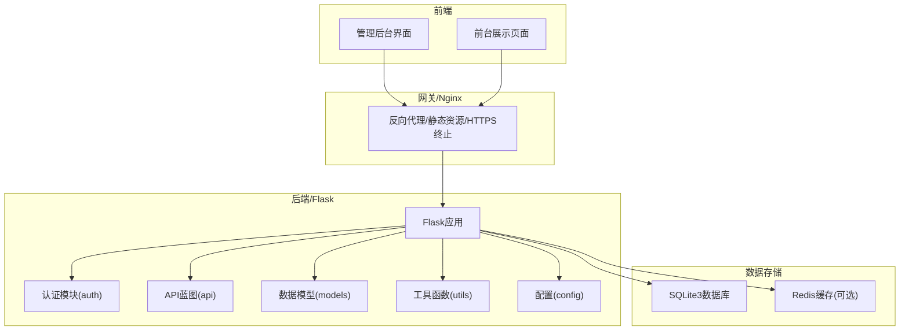
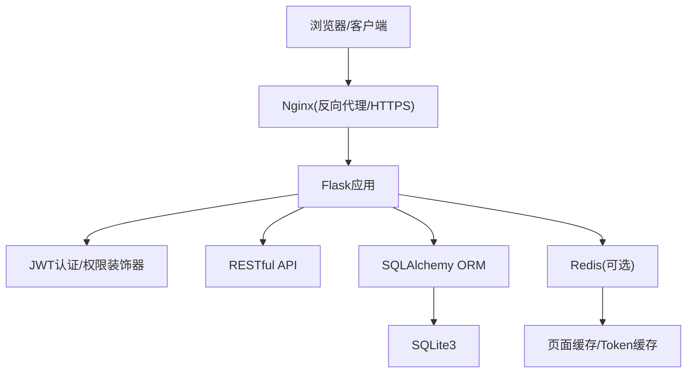
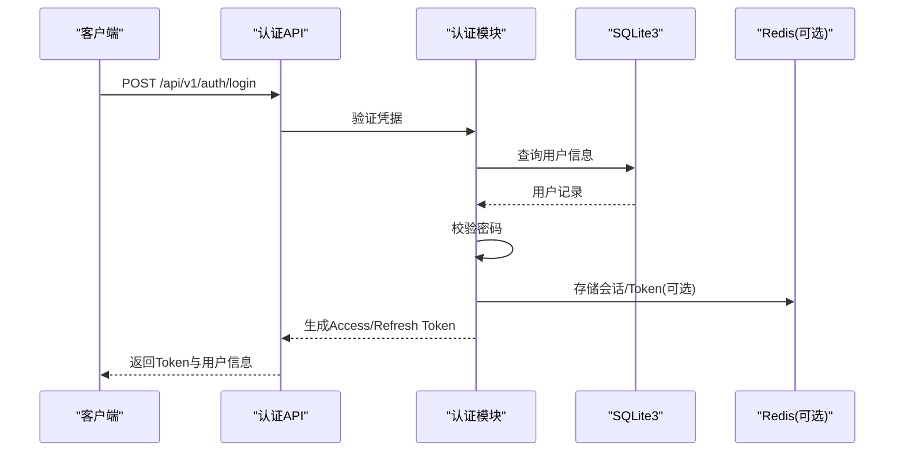
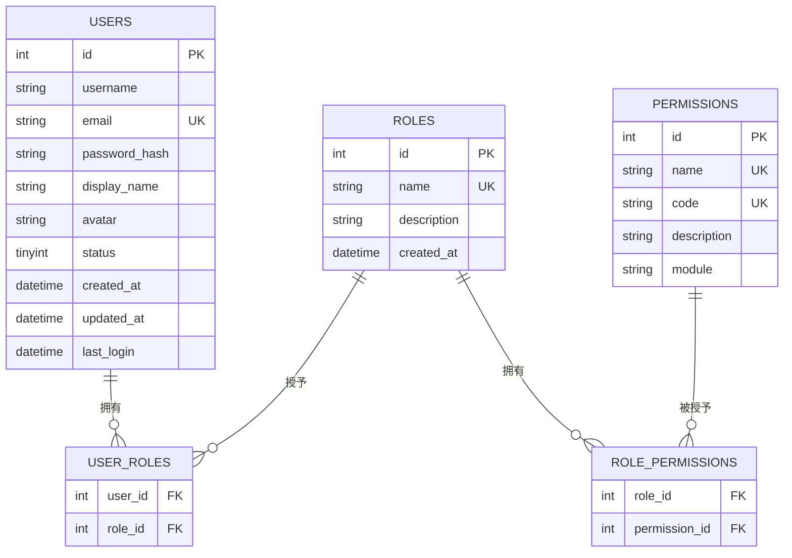
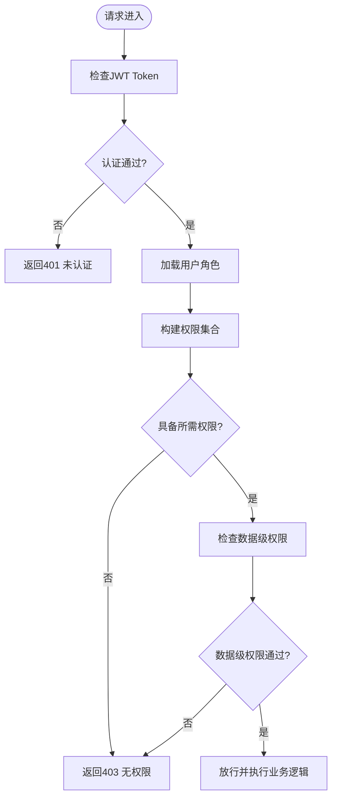
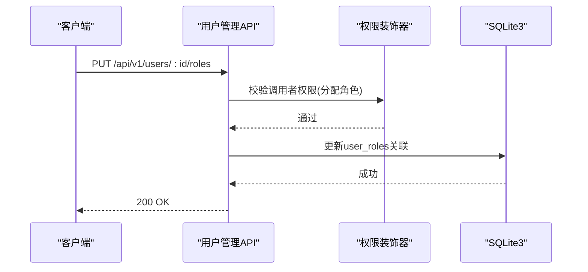
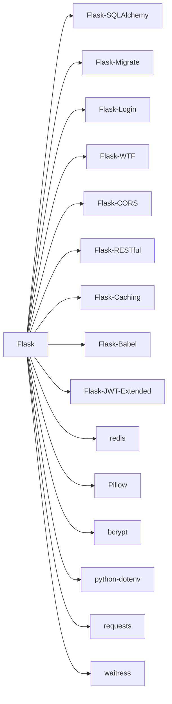

# 权限管理API

<cite>
**本文档引用的文件**
- [企业网站CMS系统开发需求文档.ini](file://企业网站CMS系统开发需求文档.ini)
- [企业网站CMS系统详细需求文档.md](file://企业网站CMS系统详细需求文档.md)
- [开发计划表_2月4日-2月12日.md](file://开发计划表_2月4日-2月12日.md)
</cite>

## 目录
1. [简介](#简介)
2. [项目结构](#项目结构)
3. [核心组件](#核心组件)
4. [架构总览](#架构总览)
5. [详细组件分析](#详细组件分析)
6. [依赖分析](#依赖分析)
7. [性能考量](#性能考量)
8. [故障排除指南](#故障排除指南)
9. [结论](#结论)
10. [附录](#附录)

## 简介
本文件面向企业网站CMS系统的权限管理API，聚焦RBAC（基于角色的访问控制）体系，覆盖用户管理、角色管理、权限分配、权限验证与数据级权限控制。结合项目需求文档与开发计划，系统采用Flask + SQLite3 + Nginx + Windows Server的技术栈，提供RESTful API与JWT认证，支持模块级、操作级与数据级权限控制，并规划了缓存与安全加固方案。

## 项目结构
- 后端采用Flask + Blueprint组织，核心模块包括认证(auth)、API路由(api)、数据模型(models)、工具(utils)与配置(config)。
- 前端可选React/Vue或纯HTML模板渲染，通过Nginx代理转发至Flask后端。
- 数据库使用SQLite3，配合Redis（可选）用于缓存与会话。

**章节来源**
- file://开发计划表_2月4日-2月12日.md#L92-L105
- file://企业网站CMS系统详细需求文档.md#L28-L57

## 核心组件
- 用户与角色权限表结构：users、roles、permissions、user_roles、role_permissions。
- 认证与授权：JWT Token（Access/Refresh）、@login_required装饰器、权限校验中间件。
- API接口：认证、用户管理、文章/页面/分类/标签、媒体库、系统配置等。
- 安全：XSS/CSRF防护、SQL注入防护、文件上传安全、HTTPS/HSTS、限流与审计日志。
- 缓存：Redis缓存（可选）、页面缓存、Token缓存。

**章节来源**
- file://企业网站CMS系统详细需求文档.md#L716-L768
- file://企业网站CMS系统详细需求文档.md#L1000-L1076
- file://企业网站CMS系统详细需求文档.md#L1078-L1140
- file://企业网站CMS系统详细需求文档.md#L1234-L1322

## 架构总览
系统采用前后端分离架构，Nginx统一接入，后端提供RESTful API与模板渲染能力，数据库为SQLite3，Redis用于缓存与会话（可选）。权限控制贯穿认证、授权与数据访问层。

**图表来源**
- [企业网站CMS系统详细需求文档.md](file://企业网站CMS系统详细需求文档.md#L28-L57)
- [企业网站CMS系统详细需求文档.md](file://企业网站CMS系统详细需求文档.md#L1145-L1230)

**章节来源**
- file://企业网站CMS系统详细需求文档.md#L28-L57
- file://企业网站CMS系统详细需求文档.md#L1145-L1230

## 详细组件分析

### 用户管理API
- 用户注册：邮箱/手机号验证、密码强度要求、加密存储。
- 用户登录：JWT Token生成与刷新、登录日志、多设备管理、账号锁定。
- 用户信息：当前用户信息获取、个人资料更新。
- 用户列表：分页、筛选、批量操作（删除、修改状态）。
- 用户CRUD：创建、更新、删除（受权限控制）。
- 角色分配：为用户分配角色（PUT /api/v1/users/:id/roles）。

**图表来源**
- [企业网站CMS系统详细需求文档.md](file://企业网站CMS系统详细需求文档.md#L1002-L1011)
- [企业网站CMS系统详细需求文档.md](file://企业网站CMS系统详细需求文档.md#L1013-L1021)

**章节来源**
- file://企业网站CMS系统详细需求文档.md#L1002-L1021
- file://企业网站CMS系统详细需求文档.md#L1078-L1140

### 角色与权限管理API
- 角色体系：超级管理员、管理员、编辑、作者、访客。
- 权限粒度：模块级、操作级、数据级（仅操作本人数据）。
- 角色管理：创建、更新、删除角色。
- 权限管理：创建、更新、删除权限。
- 角色-权限关联：role_permissions表。
- 用户-角色关联：user_roles表。

**图表来源**
- [企业网站CMS系统详细需求文档.md](file://企业网站CMS系统详细需求文档.md#L716-L768)

**章节来源**
- file://企业网站CMS系统详细需求文档.md#L239-L270
- file://企业网站CMS系统详细需求文档.md#L716-L768

### 权限验证与数据级控制
- 装饰器方式：@login_required、权限装饰器（基于角色与权限）。
- 动态权限检查：运行时根据用户角色与权限组合判断是否允许访问。
- 数据级权限：仅允许用户操作其自身创建的数据（例如文章作者限制）。
- 权限继承：角色继承关系通过role_permissions建立，权限传递遵循RBAC模型。

**图表来源**
- [企业网站CMS系统详细需求文档.md](file://企业网站CMS系统详细需求文档.md#L1078-L1140)

**章节来源**
- file://企业网站CMS系统详细需求文档.md#L239-L270
- file://企业网站CMS系统详细需求文档.md#L1078-L1140

### API接口规范与示例
- 基础规范：HTTPS、JSON、UTF-8、API前缀/api/v1、JWT认证。
- 请求/响应格式、HTTP状态码、分页格式。
- 核心接口列表：认证、用户管理、文章/页面/分类/标签、媒体库、系统配置。

**图表来源**
- [企业网站CMS系统详细需求文档.md](file://企业网站CMS系统详细需求文档.md#L1013-L1021)

**章节来源**
- file://企业网站CMS系统详细需求文档.md#L940-L998
- file://企业网站CMS系统详细需求文档.md#L1000-L1076

### 安全最佳实践
- 认证与授权：JWT Token（Access/Refresh）、会话管理、异常登录检测。
- 密码安全：bcrypt加密、密码强度要求、登录失败锁定。
- 数据安全：ORM参数化查询、输入验证、XSS输出转义、CSP头。
- API安全：Flask-Limiter限流、CSRF Token、SameSite Cookie、双重提交Cookie。
- 文件上传安全：类型白名单、大小限制、随机化文件名、存储路径限制。
- 数据传输安全：HTTPS强制跳转、HSTS头、敏感数据加密。

**章节来源**
- file://企业网站CMS系统详细需求文档.md#L1078-L1140

## 依赖分析
- 后端依赖：Flask生态（SQLAlchemy、Migrate、Login、WTF、CORS、RESTful、Caching、Babel、JWT-Extended）、Pillow、bcrypt、dotenv、requests、waitress。
- 前端依赖：React/Vue（可选）+ Ant Design/Element Plus + Axios + dnd-kit（可视化编辑器）。
- 部署依赖：Nginx、Windows服务（NSSM）、Redis（可选）。

**图表来源**
- [企业网站CMS系统详细需求文档.md](file://企业网站CMS系统详细需求文档.md#L1304-L1322)

**章节来源**
- file://企业网站CMS系统详细需求文档.md#L1304-L1322

## 性能考量
- 缓存策略：页面缓存（Redis）、数据缓存（查询结果/API响应）、静态资源缓存（浏览器/CDN）。
- 资源优化：图片懒加载、响应式图片、WebP、CSS/JS压缩、关键CSS内联。
- 数据库优化：索引优化、避免N+1查询、连接池配置、慢查询日志。
- CDN配置：静态资源CDN加速、缓存刷新。
- 并发与部署：Windows环境使用Waitress，高并发可引入Redis与负载均衡。

**章节来源**
- file://企业网站CMS系统详细需求文档.md#L512-L548
- file://企业网站CMS系统详细需求文档.md#L1324-L1356

## 故障排除指南
- 认证失败：检查Token是否过期、是否携带Bearer前缀、JWT密钥配置。
- 权限不足：确认用户角色与权限组合、数据级权限限制（仅本人数据）。
- 文件上传失败：检查文件类型白名单、大小限制、存储路径权限。
- API限流：检查Flask-Limiter配置、IP/用户维度限流策略。
- 部署问题：确认Nginx代理配置、Windows服务（NSSM）状态、端口占用。

**章节来源**
- file://企业网站CMS系统详细需求文档.md#L1128-L1140
- file://开发计划表_2月4日-2月12日.md#L441-L507

## 结论
本权限管理API以RBAC为核心，结合JWT认证、权限装饰器与数据级控制，形成从认证到授权再到数据访问的完整闭环。通过SQLite3与Redis的组合，兼顾易部署与性能优化；通过严格的输入验证、XSS/CSRF防护与限流策略，保障系统安全。建议在V2版本中进一步完善复杂权限控制与审计日志功能。

## 附录
- API接口清单与规范详见“核心接口列表”与“接口规范”章节。
- 配置文件与环境变量参考“Flask应用配置”与“.env示例”。

**章节来源**
- file://企业网站CMS系统详细需求文档.md#L940-L998
- file://企业网站CMS系统详细需求文档.md#L1234-L1302
- file://企业网站CMS系统详细需求文档.md#L1346-L1356