# 用户管理API

<cite>
**本文档引用的文件**
- [users.py](file://company_cms_project/backend/app/api/users.py)
- [user.py](file://company_cms_project/backend/app/models/user.py)
- [routes.py](file://company_cms_project/backend/app/auth/routes.py)
- [config.py](file://company_cms_project/backend/config.py)
- [__init__.py](file://company_cms_project/backend/app/api/__init__.py)
- [__init__.py](file://company_cms_project/backend/app/auth/__init__.py)
- [__init__.py](file://company_cms_project/backend/app/__init__.py)
- [run.py](file://company_cms_project/backend/run.py)
- [users.ts](file://company_cms_project/frontend/src/api/users.ts)
- [UserManager.tsx](file://company_cms_project/frontend/src/pages/UserManager.tsx)
- [request.ts](file://company_cms_project/frontend/src/utils/request.ts)
- [test_users_api.py](file://tests/test_users_api.py)
</cite>

## 更新摘要
**所做更改**
- 增强了前端API客户端的类型安全性，所有导出函数现在包含Promise<ApiResponse<any>>返回类型注解
- 更新了前端用户管理界面的类型定义和异步操作处理
- 完善了API响应的类型安全性和开发者体验

## 目录
1. [简介](#简介)
2. [项目结构](#项目结构)
3. [核心组件](#核心组件)
4. [架构概览](#架构概览)
5. [详细组件分析](#详细组件分析)
6. [API规范](#api规范)
7. [前端集成](#前端集成)
8. [安全机制](#安全机制)
9. [性能考虑](#性能考虑)
10. [故障排除指南](#故障排除指南)
11. [结论](#结论)

## 简介

用户管理API是企业内容管理系统(CMS)的核心功能模块，负责管理系统的用户账户、权限控制和身份验证。该API基于Flask框架构建，采用JWT令牌进行身份验证，提供完整的用户生命周期管理功能，包括用户创建、查询、更新、删除以及密码重置等操作。

系统采用前后端分离架构，后端提供RESTful API接口，前端使用React+Ant Design构建用户界面，实现了完整的用户管理功能。**更新后**，所有API调用都具备完整的类型安全性，增强了开发者的开发体验和代码的可靠性。

## 项目结构

项目采用模块化设计，主要分为以下层次：

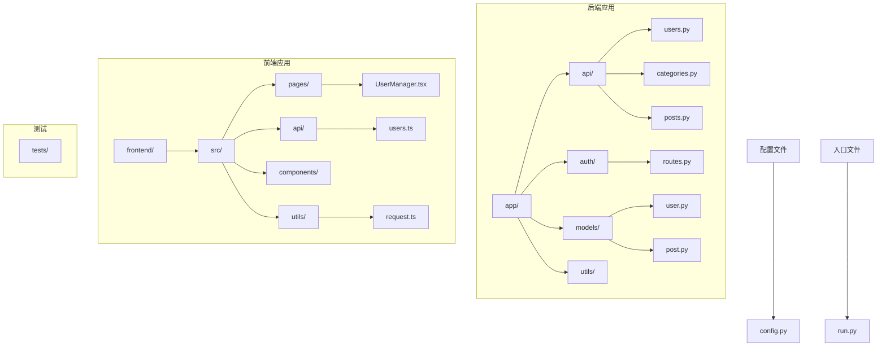

**图表来源**
- [__init__.py:1-6](file://company_cms_project/backend/app/api/__init__.py#L1-L6)
- [__init__.py:1-6](file://company_cms_project/backend/app/auth/__init__.py#L1-L6)
- [config.py:1-64](file://company_cms_project/backend/config.py#L1-L64)

**章节来源**
- [__init__.py:1-6](file://company_cms_project/backend/app/api/__init__.py#L1-L6)
- [__init__.py:1-6](file://company_cms_project/backend/app/auth/__init__.py#L1-L6)
- [config.py:1-64](file://company_cms_project/backend/config.py#L1-L64)

## 核心组件

### 用户模型(User Model)

用户模型是整个用户管理功能的基础，定义了用户的基本属性和行为：

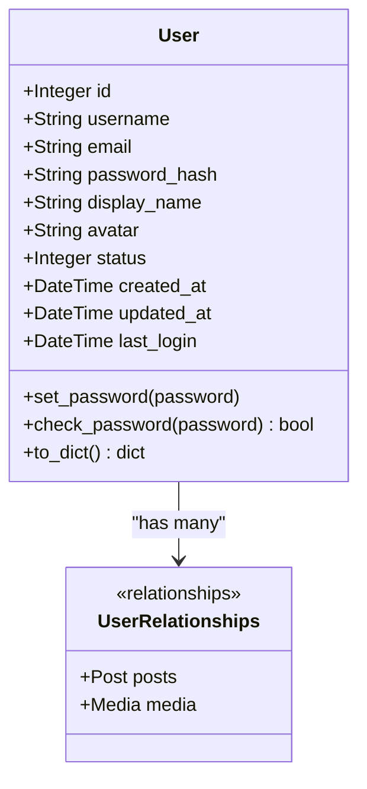

**图表来源**
- [user.py:5-47](file://company_cms_project/backend/app/models/user.py#L5-L47)

### API蓝图(Blueprint)

API采用Flask蓝图模式组织路由，提供清晰的模块化结构：

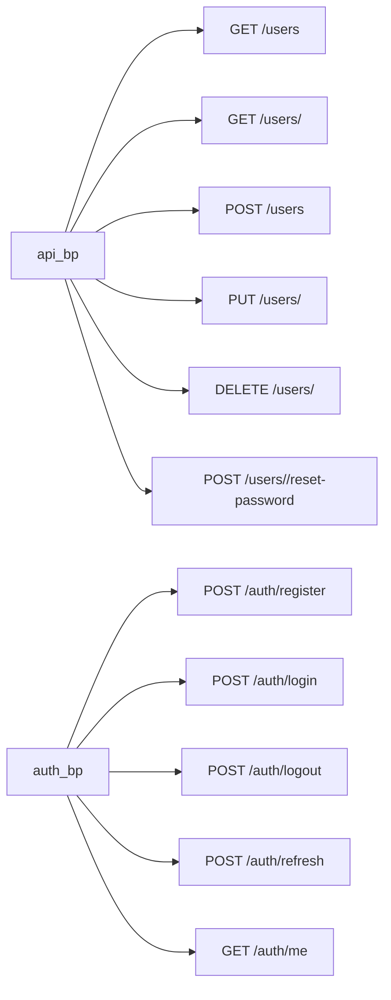

**图表来源**
- [users.py:24-326](file://company_cms_project/backend/app/api/users.py#L24-L326)
- [routes.py:25-225](file://company_cms_project/backend/app/auth/routes.py#L25-L225)

**章节来源**
- [user.py:1-47](file://company_cms_project/backend/app/models/user.py#L1-L47)
- [users.py:1-326](file://company_cms_project/backend/app/api/users.py#L1-L326)
- [routes.py:1-225](file://company_cms_project/backend/app/auth/routes.py#L1-L225)

## 架构概览

系统采用分层架构设计，确保关注点分离和代码可维护性：

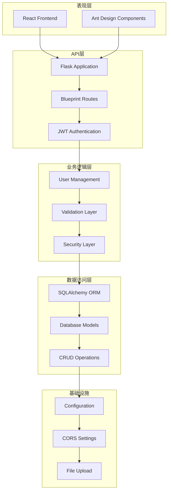

**图表来源**
- [__init__.py:15-84](file://company_cms_project/backend/app/__init__.py#L15-L84)
- [config.py:8-64](file://company_cms_project/backend/config.py#L8-L64)

## 详细组件分析

### 用户管理API实现

#### GET /api/v1/users - 获取用户列表

该接口支持分页、筛选和排序功能：

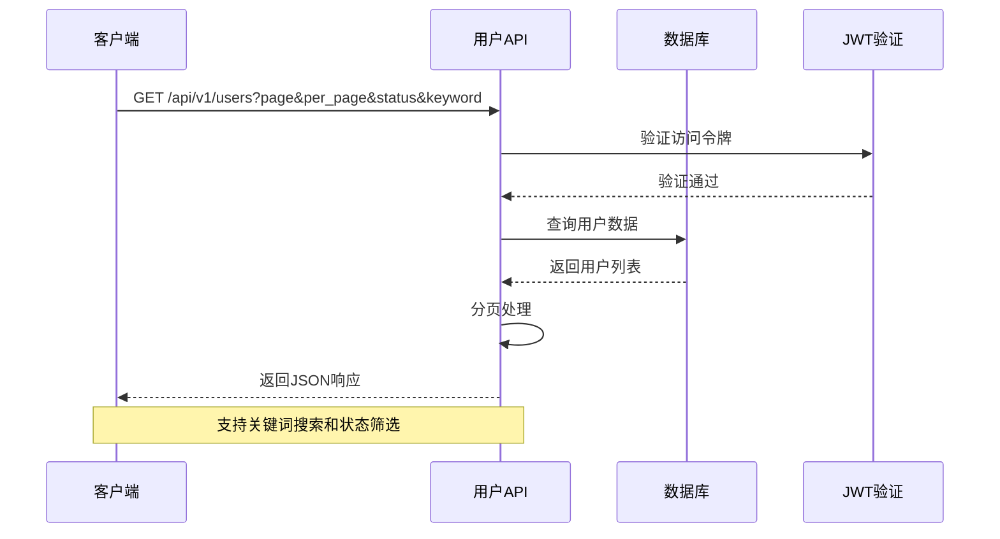

**图表来源**
- [users.py:24-74](file://company_cms_project/backend/app/api/users.py#L24-L74)

#### POST /api/v1/users - 创建用户

用户创建流程包含多重验证机制：

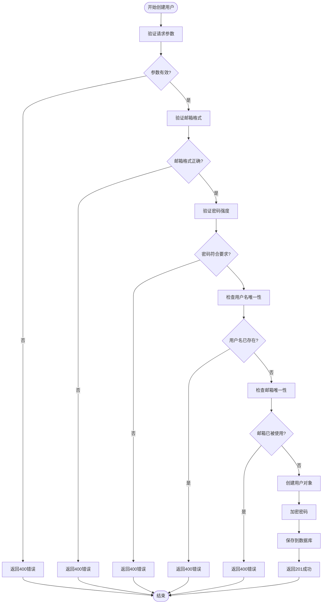

**图表来源**
- [users.py:104-180](file://company_cms_project/backend/app/api/users.py#L104-L180)

#### PUT /api/v1/users/<id> - 更新用户信息

用户更新功能支持部分字段更新：

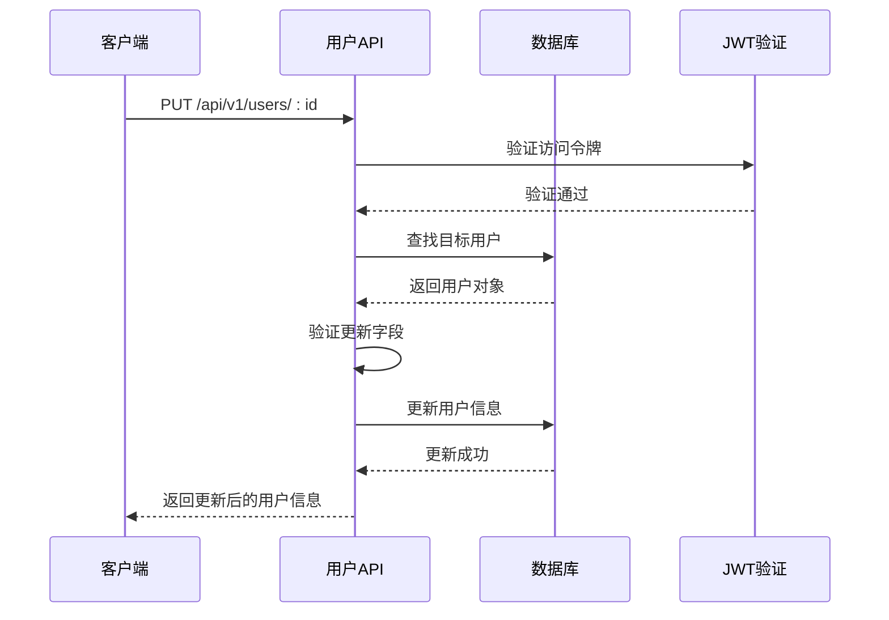

**图表来源**
- [users.py:182-242](file://company_cms_project/backend/app/api/users.py#L182-L242)

#### DELETE /api/v1/users/<id> - 删除用户

删除操作包含安全检查：

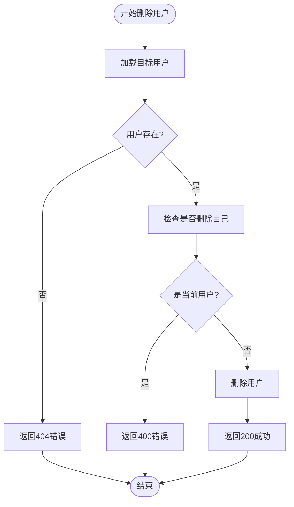

**图表来源**
- [users.py:244-279](file://company_cms_project/backend/app/api/users.py#L244-L279)

**章节来源**
- [users.py:24-326](file://company_cms_project/backend/app/api/users.py#L24-L326)

### 前端用户管理界面

前端使用React构建用户管理界面，集成了Ant Design组件库，并具备完整的类型安全性：

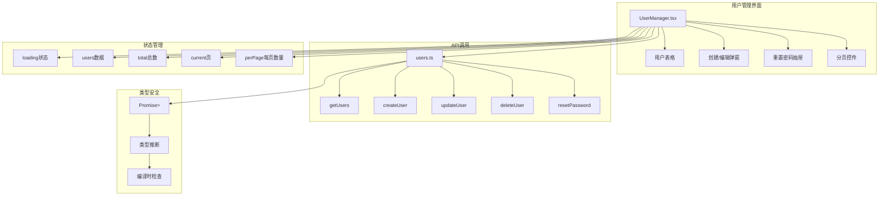

**图表来源**
- [UserManager.tsx:60-396](file://company_cms_project/frontend/src/pages/UserManager.tsx#L60-L396)
- [users.ts:1-91](file://company_cms_project/frontend/src/api/users.ts#L1-L91)
- [request.ts:5-9](file://company_cms_project/frontend/src/utils/request.ts#L5-L9)

**章节来源**
- [UserManager.tsx:1-396](file://company_cms_project/frontend/src/pages/UserManager.tsx#L1-L396)
- [users.ts:1-91](file://company_cms_project/frontend/src/api/users.ts#L1-L91)
- [request.ts:1-76](file://company_cms_project/frontend/src/utils/request.ts#L1-L76)

## API规范

### 认证机制

系统使用JWT（JSON Web Token）进行身份验证，所有用户管理API都需要有效的访问令牌：

| 配置项 | 默认值 | 说明 |
|--------|--------|------|
| JWT_SECRET_KEY | fallback-jwt-secret | JWT密钥 |
| JWT_ACCESS_TOKEN_EXPIRES | 7200秒 | 访问令牌过期时间 |
| JWT_REFRESH_TOKEN_EXPIRES | 2592000秒 | 刷新令牌过期时间 |

### 错误响应格式

所有API响应遵循统一的JSON格式：

```json
{
    "code": 200,
    "message": "操作成功",
    "data": {}
}
```

### 用户状态枚举

| 状态值 | 含义 | 说明 |
|--------|------|------|
| 1 | 正常 | 用户可以正常使用系统 |
| 0 | 禁用 | 用户被管理员禁用，无法登录 |

**章节来源**
- [config.py:19-22](file://company_cms_project/backend/config.py#L19-L22)
- [user.py:15-18](file://company_cms_project/backend/app/models/user.py#L15-L18)

## 前端集成

### API客户端封装

前端使用统一的请求封装，提供类型安全的API调用，所有导出函数现在都包含Promise<ApiResponse<any>>返回类型注解：

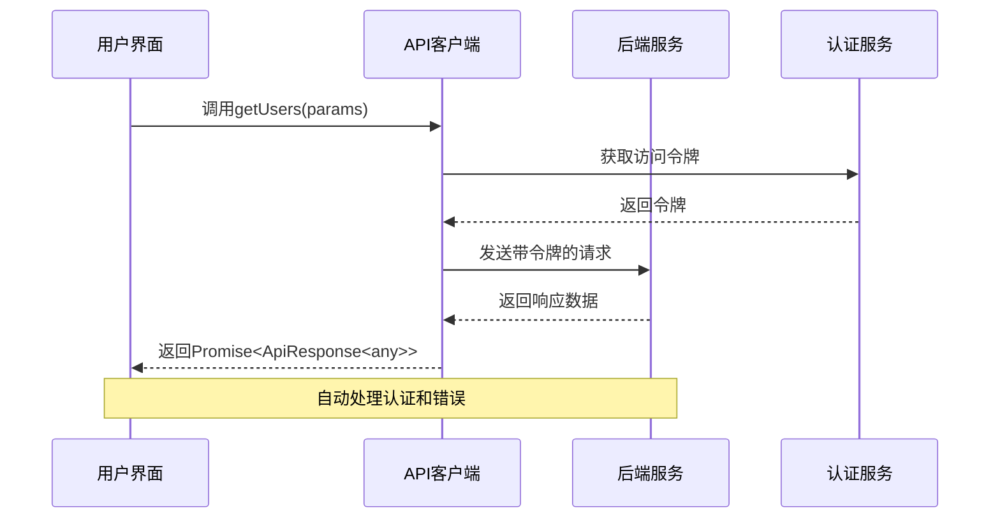

**更新** 所有API函数现在都具备完整的类型注解，提供更好的开发体验和编译时类型检查

**图表来源**
- [users.ts:6-18](file://company_cms_project/frontend/src/api/users.ts#L6-L18)
- [request.ts:47-70](file://company_cms_project/frontend/src/utils/request.ts#L47-L70)

### 类型安全增强

前端API客户端现在具备完整的类型安全性：

```typescript
// 获取用户列表 - 具备类型注解
export const getUsers = (params?: {
  page?: number;
  per_page?: number;
  status?: number;
  keyword?: string;
}): Promise<ApiResponse<any>> => {
  return request({
    url: '/users',
    method: 'get',
    params,
  });
};

// 创建用户 - 具备类型注解
export const createUser = (data: {
  username: string;
  email: string;
  password: string;
  display_name?: string;
  avatar?: string;
  status?: number;
}): Promise<ApiResponse<any>> => {
  return request({
    url: '/users',
    method: 'post',
    data,
  });
};
```

**章节来源**
- [users.ts:1-91](file://company_cms_project/frontend/src/api/users.ts#L1-L91)
- [UserManager.tsx:305-358](file://company_cms_project/frontend/src/pages/UserManager.tsx#L305-L358)

## 安全机制

### 密码安全

系统采用Werkzeug的安全哈希算法保护用户密码：

```mermaid
flowchart TD
Input[用户输入密码] --> Hash[generate_password_hash]
Hash --> Store[存储哈希值]
Store --> Verify[check_password_hash]
Verify --> Compare[验证密码]
Note over Hash,Verify: 使用SHA-256算法进行哈希
```

**图表来源**
- [user.py:27-33](file://company_cms_project/backend/app/models/user.py#L27-L33)

### 输入验证

系统实现了多层次的输入验证：

1. **前端验证**：使用Ant Design的表单验证
2. **后端验证**：Flask-WTF验证和自定义验证函数
3. **数据库约束**：唯一性约束和非空约束

### 访问控制

- 所有用户管理API都需要JWT认证
- 禁止删除当前登录用户
- 支持用户状态控制

**章节来源**
- [users.py:9-22](file://company_cms_project/backend/app/api/users.py#L9-L22)
- [routes.py:9-23](file://company_cms_project/backend/app/auth/routes.py#L9-L23)

## 性能考虑

### 数据库优化

- 用户名和邮箱字段建立索引以提高查询性能
- 使用分页查询避免大量数据传输
- 关联查询使用延迟加载策略

### 缓存策略

- JWT令牌存储在客户端本地存储中
- 媒体文件使用CDN加速
- 静态资源启用浏览器缓存

### 并发处理

- 使用Flask的线程安全特性
- 数据库连接池管理
- 异步任务处理耗时操作

## 故障排除指南

### 常见问题及解决方案

| 问题 | 可能原因 | 解决方案 |
|------|----------|----------|
| 用户名已存在 | 数据库唯一约束冲突 | 修改用户名或使用其他标识符 |
| 邮箱已被注册 | 邮箱重复使用 | 使用不同的邮箱地址 |
| 密码不符合要求 | 密码强度不足 | 确保密码包含字母和数字，至少8位 |
| 无法删除用户 | 试图删除当前用户 | 使用其他管理员账户执行操作 |
| 认证失败 | 令牌过期或无效 | 重新登录获取新的访问令牌 |

### 调试工具

系统提供了完整的测试套件：

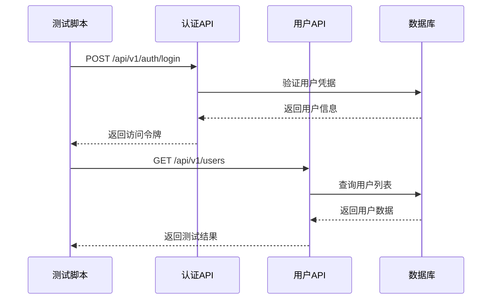

**图表来源**
- [test_users_api.py:11-99](file://tests/test_users_api.py#L11-L99)

**章节来源**
- [test_users_api.py:1-105](file://tests/test_users_api.py#L1-L105)

## 结论

用户管理API为CMS系统提供了完整、安全、易用的用户管理功能。通过采用现代的前后端分离架构、严格的认证授权机制和完善的错误处理策略，系统能够满足企业级应用的需求。

**更新后的主要改进**：
- **类型安全性**：所有API调用现在都具备完整的Promise<ApiResponse<any>>类型注解
- **开发体验**：提供更好的IDE支持和编译时类型检查
- **代码可靠性**：减少运行时类型错误，提高代码质量

主要特点包括：
- **安全性**：基于JWT的认证机制和多层输入验证
- **可扩展性**：模块化的蓝图设计便于功能扩展
- **易用性**：直观的前端界面和完整的API文档
- **可靠性**：完善的错误处理和测试覆盖
- **类型安全**：完整的类型注解和推断系统

未来可以考虑的功能增强包括：
- 用户角色和权限管理
- 用户活动日志记录
- 多因素认证支持
- 用户统计和分析功能