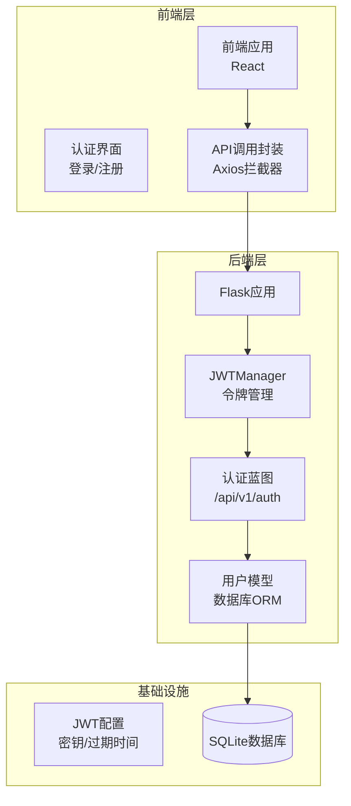
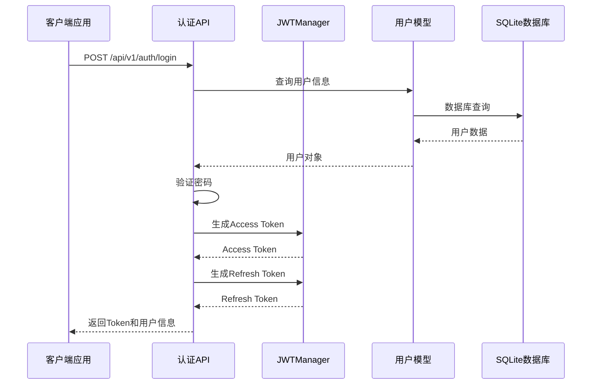
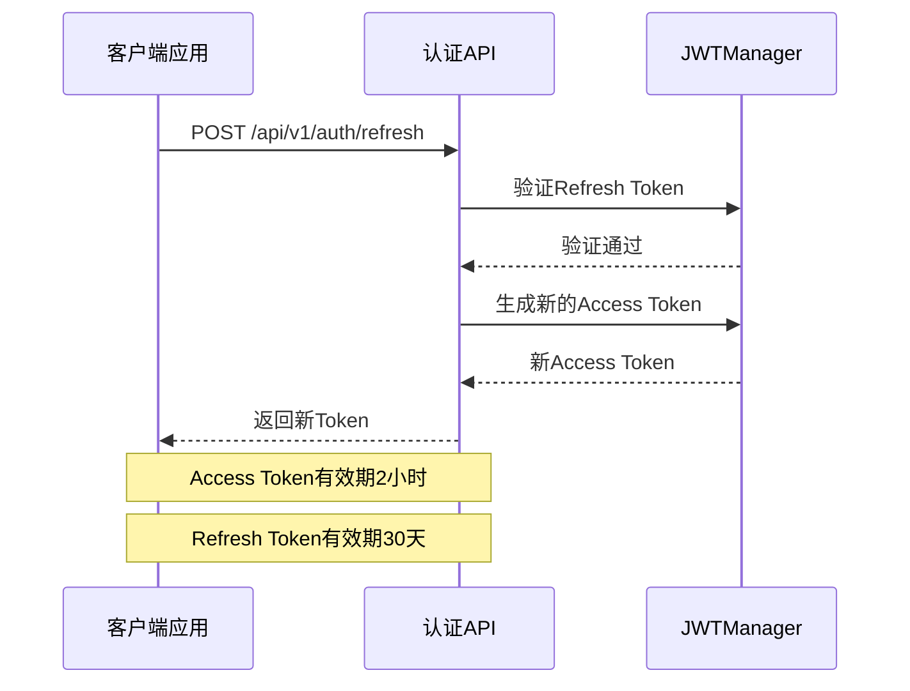
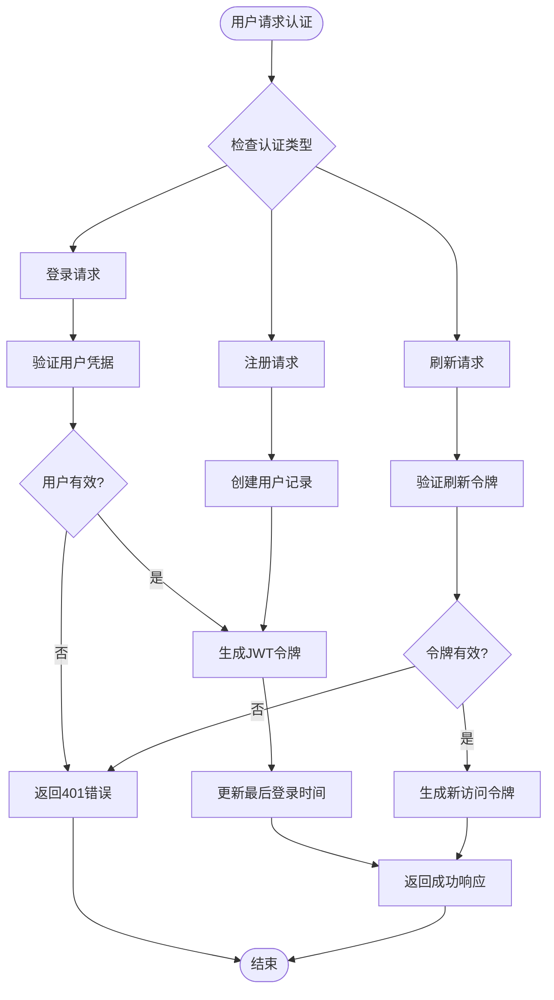
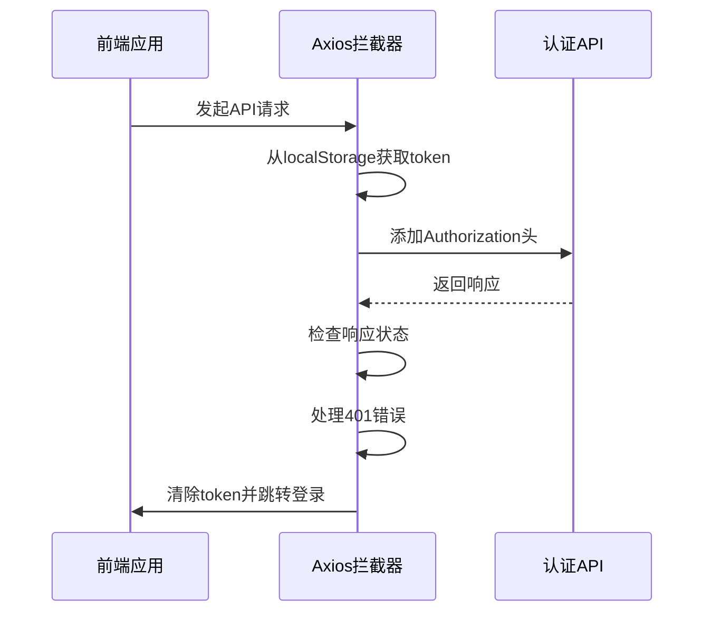
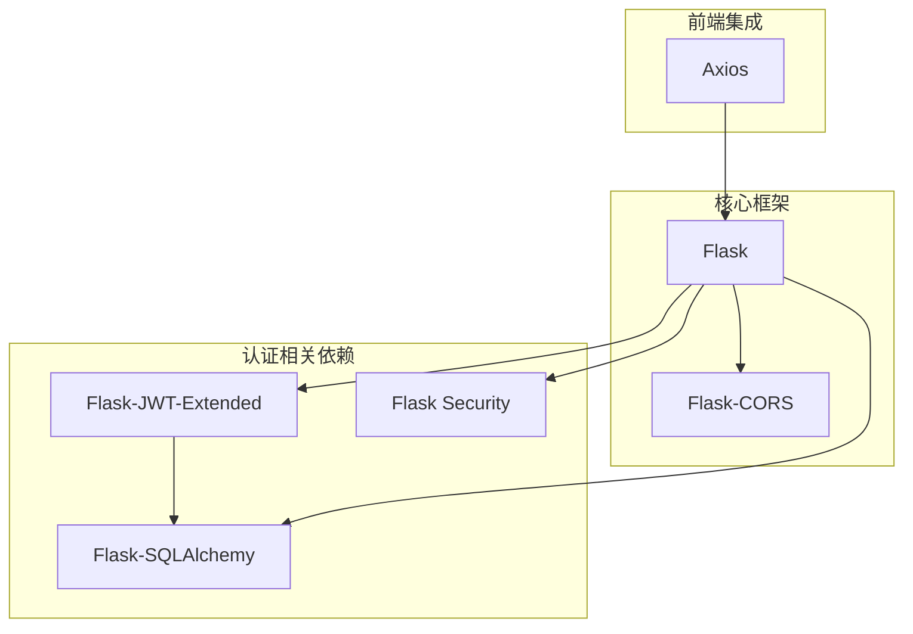
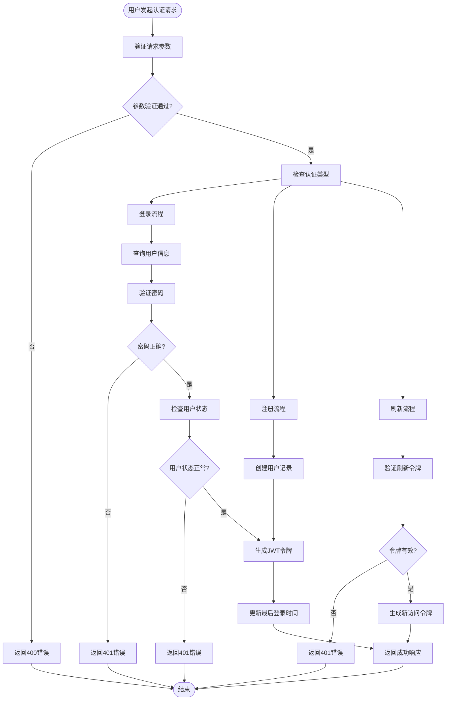

# 用户认证API

<cite>
**本文档引用的文件**
- [routes.py](file://company_cms_project/backend/app/auth/routes.py)
- [user.py](file://company_cms_project/backend/app/models/user.py)
- [__init__.py](file://company_cms_project/backend/app/__init__.py)
- [config.py](file://company_cms_project/backend/config.py)
- [auth.ts](file://company_cms_project/frontend/src/api/auth.ts)
- [request.ts](file://company_cms_project/frontend/src/utils/request.ts)
- [run.py](file://company_cms_project/backend/run.py)
- [企业网站CMS系统详细需求文档.md](file://docs/企业网站CMS系统详细需求文档.md)
</cite>

## 更新摘要
**变更内容**
- 更新了Flask-JWT-Extended的JWT认证机制实现
- 添加了完整的登录、注册、刷新、注销接口规范
- 更新了JWT Token生成和验证流程
- 添加了用户状态管理和账户禁用机制
- 更新了前端认证集成示例

## 目录
1. [简介](#简介)
2. [项目结构](#项目结构)
3. [核心组件](#核心组件)
4. [架构概览](#架构概览)
5. [详细组件分析](#详细组件分析)
6. [JWT认证机制](#jwt认证机制)
7. [依赖关系分析](#依赖关系分析)
8. [性能考虑](#性能考虑)
9. [故障排除指南](#故障排除指南)
10. [结论](#结论)
11. [附录](#附录)

## 简介

本文档详细描述了企业网站CMS系统的用户认证API，基于Flask-JWT-Extended实现的完整JWT认证机制。系统提供登录、注册、令牌刷新、用户信息获取等核心接口，支持用户状态管理和基本的权限控制。

系统采用Flask框架开发，使用Flask-JWT-Extended扩展实现JWT（JSON Web Token）技术，提供无状态的身份认证和授权管理。所有API接口都遵循RESTful设计原则，提供统一的响应格式和错误码规范。

## 项目结构

企业CMS系统采用前后端分离架构，后端使用Python Flask框架，前端使用React技术栈。认证系统作为核心模块，为整个系统提供安全的身份验证和授权服务。



**章节来源**
- [__init__.py](file://company_cms_project/backend/app/__init__.py#L15-L41)
- [config.py](file://company_cms_project/backend/config.py#L19-L22)

## 核心组件

### 认证接口总览

系统提供完整的用户认证解决方案，包含以下核心接口：

| 接口名称 | HTTP方法 | URL路径 | 功能描述 | 认证要求 |
|---------|---------|--------|---------|---------|
| 用户登录 | POST | `/api/v1/auth/login` | 用户身份验证，返回访问令牌和刷新令牌 | 无需认证 |
| 用户登出 | POST | `/api/v1/auth/logout` | 用户主动退出登录 | 需要Access Token |
| 用户注册 | POST | `/api/v1/auth/register` | 新用户注册账户 | 无需认证 |
| 刷新令牌 | POST | `/api/v1/auth/refresh` | 使用刷新令牌获取新的访问令牌 | 需要Refresh Token |
| 当前用户 | GET | `/api/v1/auth/me` | 获取当前登录用户的详细信息 | 需要Access Token |

**章节来源**
- [routes.py](file://company_cms_project/backend/app/auth/routes.py#L25-L225)

### JWT Token机制

系统采用Flask-JWT-Extended扩展实现JWT技术，支持访问令牌和刷新令牌的双重机制：

- **Access Token**: 有效期2小时（7200秒），用于API请求的身份验证
- **Refresh Token**: 有效期30天，用于获取新的访问令牌
- **Token生成**: 使用用户ID作为identity，确保令牌唯一性
- **Token存储**: 客户端通过LocalStorage存储令牌
- **自动刷新**: 前端通过Axios拦截器处理401错误并自动刷新

**章节来源**
- [config.py](file://company_cms_project/backend/config.py#L20-L22)
- [routes.py](file://company_cms_project/backend/app/auth/routes.py#L84-L85)

### 密码安全策略

系统实施多层次的密码安全保护机制：

- **密码加密**: 使用Werkzeug Security的generate_password_hash，成本因子为12
- **密码强度**: 至少8位字符，必须包含字母和数字
- **邮箱验证**: 使用正则表达式验证邮箱格式
- **账户状态**: 支持用户启用/禁用状态管理

**章节来源**
- [user.py](file://company_cms_project/backend/app/models/user.py#L27-L33)
- [routes.py](file://company_cms_project/backend/app/auth/routes.py#L14-L23)

## 架构概览

### 认证系统架构



**图表来源**
- [routes.py](file://company_cms_project/backend/app/auth/routes.py#L105-L159)
- [__init__.py](file://company_cms_project/backend/app/__init__.py#L27-L29)

### 令牌刷新流程



**图表来源**
- [routes.py](file://company_cms_project/backend/app/auth/routes.py#L174-L194)

## 详细组件分析

### 登录接口

#### 接口规范

**HTTP请求**
- 方法: POST
- 路径: `/api/v1/auth/login`
- 认证: 无需认证

**请求参数**

| 参数名 | 类型 | 必填 | 描述 |
|-------|------|------|------|
| username | string | 是 | 用户名或邮箱地址 |
| password | string | 是 | 用户密码 |

**响应格式**

成功响应：
```json
{
  "code": 200,
  "message": "登录成功",
  "data": {
    "user": {
      "id": 1,
      "username": "admin",
      "email": "admin@example.com",
      "display_name": "管理员",
      "avatar": null,
      "status": 1,
      "created_at": "2026-01-01T00:00:00Z",
      "last_login": "2026-01-15T10:30:00Z"
    },
    "access_token": "eyJhbGciOiJIUzI1NiIs...",
    "refresh_token": "eyJhbGciOiJIUzI1NiIs..."
  }
}
```

**HTTP状态码**
- 200: 登录成功
- 400: 请求参数错误或验证失败
- 401: 用户名或密码错误或账户被禁用
- 500: 服务器内部错误

**章节来源**
- [routes.py](file://company_cms_project/backend/app/auth/routes.py#L105-L159)

### 注册接口

#### 接口规范

**HTTP请求**
- 方法: POST
- 路径: `/api/v1/auth/register`
- 认证: 无需认证

**请求参数**

| 参数名 | 类型 | 必填 | 描述 |
|-------|------|------|------|
| username | string | 是 | 用户名，3-20字符 |
| email | string | 是 | 邮箱地址 |
| password | string | 是 | 密码，至少8位 |
| display_name | string | 否 | 显示名称，默认使用用户名 |

**响应格式**

成功响应：
```json
{
  "code": 201,
  "message": "注册成功",
  "data": {
    "user": {
      "id": 2,
      "username": "newuser",
      "email": "newuser@example.com",
      "display_name": "newuser",
      "avatar": null,
      "status": 1,
      "created_at": "2026-01-15T10:30:00Z",
      "last_login": null
    },
    "access_token": "eyJhbGciOiJIUzI1NiIs...",
    "refresh_token": "eyJhbGciOiJIUzI1NiIs..."
  }
}
```

**HTTP状态码**
- 201: 注册成功
- 400: 请求参数错误或验证失败
- 409: 用户名或邮箱已存在
- 500: 服务器内部错误

**章节来源**
- [routes.py](file://company_cms_project/backend/app/auth/routes.py#L25-L103)

### 登出接口

#### 接口规范

**HTTP请求**
- 方法: POST
- 路径: `/api/v1/auth/logout`
- 认证: 需要有效的Access Token

**请求参数**
- 无请求参数
- 认证信息通过Authorization头传递

**响应格式**
```json
{
  "code": 200,
  "message": "登出成功",
  "data": null
}
```

**HTTP状态码**
- 200: 登出成功
- 401: 未认证或令牌无效
- 500: 服务器内部错误

**章节来源**
- [routes.py](file://company_cms_project/backend/app/auth/routes.py#L162-L171)

### 刷新令牌接口

#### 接口规范

**HTTP请求**
- 方法: POST
- 路径: `/api/v1/auth/refresh`
- 认证: 需要有效的Refresh Token

**请求参数**
- 无请求参数
- 认证信息通过Authorization头传递

**响应格式**
```json
{
  "code": 200,
  "message": "Token刷新成功",
  "data": {
    "access_token": "eyJhbGciOiJIUzI1NiIs..."
  }
}
```

**HTTP状态码**
- 200: 刷新成功
- 401: 令牌无效或已过期
- 500: 服务器内部错误

**章节来源**
- [routes.py](file://company_cms_project/backend/app/auth/routes.py#L174-L194)

### 当前用户信息接口

#### 接口规范

**HTTP请求**
- 方法: GET
- 路径: `/api/v1/auth/me`
- 认证: 需要有效的Access Token

**请求参数**
- 无请求参数

**响应格式**
```json
{
  "code": 200,
  "message": "获取成功",
  "data": {
    "user": {
      "id": 1,
      "username": "admin",
      "email": "admin@example.com",
      "display_name": "管理员",
      "avatar": null,
      "status": 1,
      "created_at": "2026-01-01T00:00:00Z",
      "last_login": "2026-01-15T10:30:00Z"
    }
  }
}
```

**HTTP状态码**
- 200: 获取成功
- 401: 未认证或令牌无效
- 404: 用户不存在
- 500: 服务器内部错误

**章节来源**
- [routes.py](file://company_cms_project/backend/app/auth/routes.py#L197-L225)

## JWT认证机制

### JWT配置详解

系统使用Flask-JWT-Extended扩展实现JWT认证，配置如下：

- **JWT_SECRET_KEY**: 从环境变量JWT_SECRET_KEY获取，用于签名令牌
- **JWT_ACCESS_TOKEN_EXPIRES**: 7200秒（2小时），访问令牌有效期
- **JWT_REFRESH_TOKEN_EXPIRES**: 30天，刷新令牌有效期

### 令牌生成和验证流程



**图表来源**
- [routes.py](file://company_cms_project/backend/app/auth/routes.py#L105-L159)
- [config.py](file://company_cms_project/backend/config.py#L19-L22)

### 前端认证集成

前端使用Axios拦截器实现自动认证：



**图表来源**
- [request.ts](file://company_cms_project/frontend/src/utils/request.ts#L17-L53)

**章节来源**
- [config.py](file://company_cms_project/backend/config.py#L19-L22)
- [request.ts](file://company_cms_project/frontend/src/utils/request.ts#L17-L53)

## 依赖关系分析

### 技术栈依赖

系统采用现代化的技术栈，各组件之间的依赖关系如下：



**图表来源**
- [__init__.py](file://company_cms_project/backend/app/__init__.py#L1-L14)
- [user.py](file://company_cms_project/backend/app/models/user.py#L1-L4)

### 数据流分析



**图表来源**
- [routes.py](file://company_cms_project/backend/app/auth/routes.py#L105-L159)

**章节来源**
- [__init__.py](file://company_cms_project/backend/app/__init__.py#L1-L14)
- [routes.py](file://company_cms_project/backend/app/auth/routes.py#L105-L159)

## 性能考虑

### JWT Token性能优化

系统在JWT令牌处理方面采用了多项性能优化策略：

- **无状态设计**: JWT是无状态的，不需要服务器端存储令牌
- **快速验证**: 使用Flask-JWT-Extended的快速令牌验证机制
- **内存优化**: 令牌验证在内存中进行，无需数据库查询
- **连接池**: 数据库连接采用Flask-SQLAlchemy的连接池管理

### 并发处理

系统支持高并发场景下的认证处理：

- **无锁设计**: JWT验证是无锁的，支持高并发访问
- **异步处理**: 邮件发送等异步操作
- **负载均衡**: 支持多实例部署，JWT密钥一致即可

## 故障排除指南

### 常见认证问题

**问题1: 登录后立即401错误**
- 检查客户端是否正确存储Access Token
- 验证Token是否被正确添加到Authorization头
- 确认Token格式是否为Bearer Token
- 检查JWT_SECRET_KEY配置是否正确

**问题2: 刷新令牌失败**
- 检查Refresh Token是否仍在有效期内
- 验证JWT_REFRESH_TOKEN_EXPIRES配置
- 确认令牌格式是否正确

**问题3: 用户状态异常**
- 检查用户状态字段是否为1（正常）
- 验证用户是否被禁用
- 确认数据库连接是否正常

### 错误码对照表

| HTTP状态码 | 错误代码 | 错误描述 | 处理建议 |
|-----------|---------|---------|---------|
| 200 | SUCCESS | 操作成功 | 正常响应 |
| 201 | CREATED | 资源创建成功 | 注册成功 |
| 400 | INVALID_INPUT | 请求参数无效 | 检查请求参数格式 |
| 401 | UNAUTHORIZED | 未认证或令牌无效 | 重新登录获取新令牌 |
| 404 | NOT_FOUND | 资源不存在 | 检查URL路径 |
| 409 | CONFLICT | 资源冲突 | 解决数据冲突问题 |
| 500 | INTERNAL_ERROR | 服务器内部错误 | 检查服务器日志 |

**章节来源**
- [routes.py](file://company_cms_project/backend/app/auth/routes.py#L105-L159)

## 结论

企业CMS系统的用户认证API基于Flask-JWT-Extended实现了完整的JWT认证机制。系统提供了标准的认证接口，支持用户注册、登录、令牌刷新等功能，并具备良好的安全性设计。

通过Flask-JWT-Extended的无状态认证特性，系统能够轻松扩展到多实例部署场景。前端通过Axios拦截器实现了自动认证和错误处理，提升了用户体验。

## 附录

### API调用示例

#### 使用cURL调用认证接口

**登录示例**
```bash
curl -X POST http://127.0.0.1:5000/api/v1/auth/login \
  -H "Content-Type: application/json" \
  -d '{
    "username": "admin",
    "password": "your-password"
  }'
```

**获取用户信息示例**
```bash
curl -X GET http://127.0.0.1:5000/api/v1/auth/me \
  -H "Authorization: Bearer YOUR_ACCESS_TOKEN"
```

**刷新令牌示例**
```bash
curl -X POST http://127.0.0.1:5000/api/v1/auth/refresh \
  -H "Authorization: Bearer YOUR_REFRESH_TOKEN"
```

### 客户端集成指南

#### JavaScript客户端集成

**Axios配置示例**
```javascript
// 设置全局请求拦截器
axios.interceptors.request.use(
  config => {
    const token = localStorage.getItem('token');
    if (token) {
      config.headers.Authorization = `Bearer ${token}`;
    }
    return config;
  },
  error => Promise.reject(error)
);

// 响应拦截器处理401错误
axios.interceptors.response.use(
  response => response,
  error => {
    if (error.response.status === 401) {
      localStorage.removeItem('token');
      window.location.href = '/login';
    }
    return Promise.reject(error);
  }
);
```

#### React集成示例

**认证Context实现**
```javascript
const AuthContext = createContext();

export const AuthProvider = ({ children }) => {
  const [user, setUser] = useState(null);
  const [token, setToken] = useState(localStorage.getItem('token'));

  const login = async (credentials) => {
    const response = await axios.post('/api/v1/auth/login', credentials);
    const { access_token, refresh_token, user } = response.data.data;
    
    localStorage.setItem('token', access_token);
    setUser(user);
  };

  const logout = () => {
    localStorage.removeItem('token');
    setUser(null);
  };

  return (
    <AuthContext.Provider value={{ user, token, login, logout }}>
      {children}
    </AuthContext.Provider>
  );
};
```

**章节来源**
- [auth.ts](file://company_cms_project/frontend/src/api/auth.ts#L1-L18)
- [request.ts](file://company_cms_project/frontend/src/utils/request.ts#L1-L56)