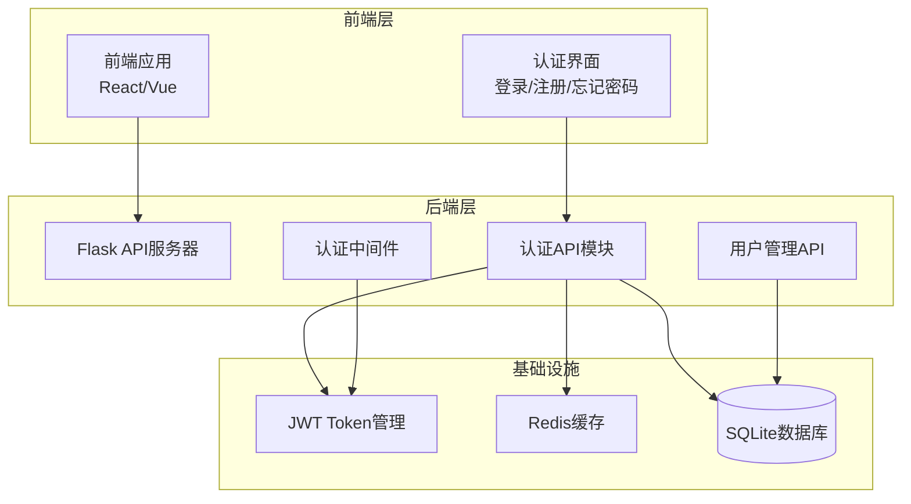
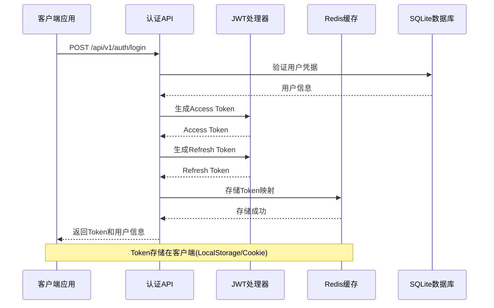
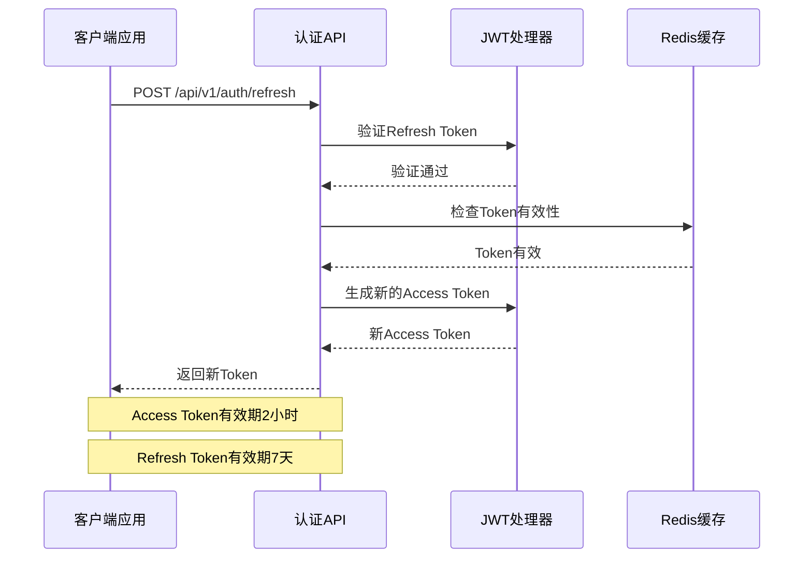
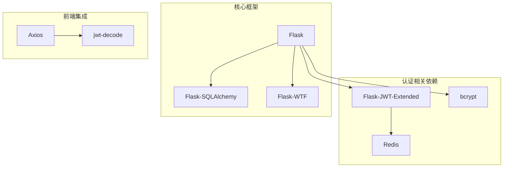
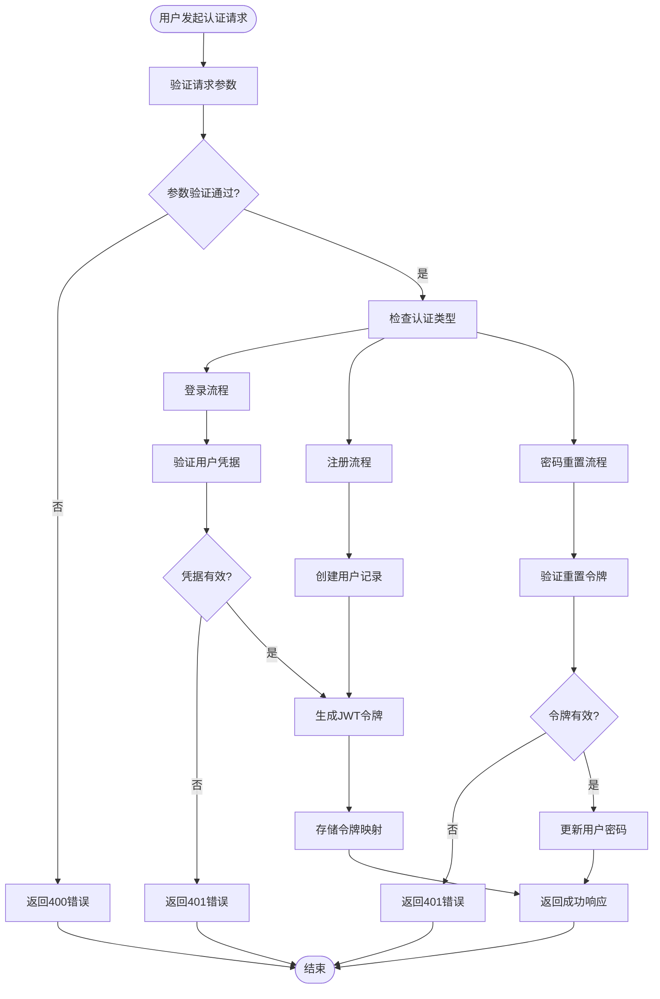

# 用户认证API

<cite>
**本文档引用的文件**
- [企业网站CMS系统详细需求文档.md](file://企业网站CMS系统详细需求文档.md)
- [开发计划表_2月4日-2月12日.md](file://开发计划表_2月4日-2月12日.md)
</cite>

## 目录
1. [简介](#简介)
2. [项目结构](#项目结构)
3. [核心组件](#核心组件)
4. [架构概览](#架构概览)
5. [详细组件分析](#详细组件分析)
6. [依赖关系分析](#依赖关系分析)
7. [性能考虑](#性能考虑)
8. [故障排除指南](#故障排除指南)
9. [结论](#结论)
10. [附录](#附录)

## 简介

本文档详细描述了企业网站CMS系统的用户认证API，包括登录、注册、密码重置、令牌刷新等核心接口规范。该系统基于Flask框架开发，采用JWT（JSON Web Token）技术实现用户身份认证和授权管理。

系统支持多种认证方式，包括传统的用户名密码认证、令牌刷新机制，以及完整的密码找回和重置流程。所有API接口都遵循RESTful设计原则，提供统一的响应格式和错误码规范。

## 项目结构

企业CMS系统采用前后端分离架构，后端使用Python Flask框架，前端使用React/Vue技术栈。认证系统作为核心模块，为整个系统提供安全的身份验证和授权服务。



**图表来源**
- [企业网站CMS系统详细需求文档.md](file://企业网站CMS系统详细需求文档.md#L22-L57)
- [开发计划表_2月4日-2月12日.md](file://开发计划表_2月4日-2月12日.md#L92-L105)

**章节来源**
- [企业网站CMS系统详细需求文档.md](file://企业网站CMS系统详细需求文档.md#L22-L57)
- [开发计划表_2月4日-2月12日.md](file://开发计划表_2月4日-2月12日.md#L92-L105)

## 核心组件

### 认证接口总览

系统提供完整的用户认证解决方案，包含以下核心接口：

| 接口名称 | HTTP方法 | URL路径 | 功能描述 |
|---------|---------|--------|---------|
| 用户登录 | POST | `/api/v1/auth/login` | 用户身份验证，返回访问令牌和刷新令牌 |
| 用户登出 | POST | `/api/v1/auth/logout` | 用户主动退出登录，使令牌失效 |
| 用户注册 | POST | `/api/v1/auth/register` | 新用户注册账户 |
| 刷新令牌 | POST | `/api/v1/auth/refresh` | 使用刷新令牌获取新的访问令牌 |
| 忘记密码 | POST | `/api/v1/auth/forgot-password` | 发送密码重置邮件 |
| 重置密码 | POST | `/api/v1/auth/reset-password` | 使用重置令牌重置用户密码 |
| 当前用户 | GET | `/api/v1/auth/me` | 获取当前登录用户的详细信息 |

**章节来源**
- [企业网站CMS系统详细需求文档.md](file://企业网站CMS系统详细需求文档.md#L1002-L1011)

### JWT Token机制

系统采用JWT（JSON Web Token）技术实现无状态认证，支持访问令牌和刷新令牌的双重机制：

- **Access Token**: 有效期2小时，用于API请求的身份验证
- **Refresh Token**: 有效期7天，用于获取新的访问令牌
- **Token存储**: 支持LocalStorage和Cookie两种存储方式
- **自动刷新**: 客户端可自动刷新即将过期的访问令牌

**章节来源**
- [企业网站CMS系统详细需求文档.md](file://企业网站CMS系统详细需求文档.md#L1082-L1086)

### 密码安全策略

系统实施多层次的密码安全保护机制：

- **密码加密**: 使用bcrypt算法，成本因子为12
- **密码强度**: 至少8位字符，包含字母和数字
- **密码历史**: 记录密码历史，防止重复使用相同密码
- **登录锁定**: 连续5次登录失败锁定30分钟

**章节来源**
- [企业网站CMS系统详细需求文档.md](file://企业网站CMS系统详细需求文档.md#L1088-L1092)

## 架构概览

### 认证系统架构



**图表来源**
- [企业网站CMS系统详细需求文档.md](file://企业网站CMS系统详细需求文档.md#L1082-L1086)
- [开发计划表_2月4日-2月12日.md](file://开发计划表_2月4日-2月12日.md#L142-L148)

### 令牌刷新流程



**图表来源**
- [企业网站CMS系统详细需求文档.md](file://企业网站CMS系统详细需求文档.md#L1082-L1086)

## 详细组件分析

### 登录接口

#### 接口规范

**HTTP请求**
- 方法: POST
- 路径: `/api/v1/auth/login`
- 认证: 无需认证

**请求参数**

| 参数名 | 类型 | 必填 | 描述 |
|-------|------|------|------|
| username | string | 是 | 用户名或邮箱地址 |
| password | string | 是 | 用户密码 |

**响应格式**

成功响应：
```json
{
  "code": 200,
  "message": "success",
  "data": {
    "access_token": "eyJhbGciOiJIUzI1NiIs...",
    "refresh_token": "eyJhbGciOiJIUzI1NiIs...",
    "user": {
      "id": 1,
      "username": "admin",
      "email": "admin@example.com",
      "display_name": "管理员",
      "avatar": null,
      "created_at": "2026-01-01T00:00:00Z"
    }
  },
  "meta": {
    "timestamp": 1700000000,
    "request_id": "unique-request-id"
  }
}
```

**HTTP状态码**
- 200: 登录成功
- 400: 请求参数错误
- 401: 用户名或密码错误
- 500: 服务器内部错误

**章节来源**
- [企业网站CMS系统详细需求文档.md](file://企业网站CMS系统详细需求文档.md#L1004)

### 注册接口

#### 接口规范

**HTTP请求**
- 方法: POST
- 路径: `/api/v1/auth/register`
- 认证: 无需认证

**请求参数**

| 参数名 | 类型 | 必填 | 描述 |
|-------|------|------|------|
| username | string | 是 | 用户名，3-20字符 |
| email | string | 是 | 邮箱地址 |
| password | string | 是 | 密码，至少8位 |
| confirm_password | string | 是 | 确认密码 |

**响应格式**

成功响应：
```json
{
  "code": 201,
  "message": "用户注册成功",
  "data": {
    "user_id": 2,
    "username": "newuser",
    "email": "newuser@example.com"
  },
  "meta": {
    "timestamp": 1700000000,
    "request_id": "unique-request-id"
  }
}
```

**HTTP状态码**
- 201: 注册成功
- 400: 请求参数错误或验证失败
- 409: 用户名或邮箱已存在
- 500: 服务器内部错误

**章节来源**
- [企业网站CMS系统详细需求文档.md](file://企业网站CMS系统详细需求文档.md#L1006)

### 密码重置接口

#### 忘记密码流程

**HTTP请求**
- 方法: POST
- 路径: `/api/v1/auth/forgot-password`
- 认证: 无需认证

**请求参数**

| 参数名 | 类型 | 必填 | 描述 |
|-------|------|------|------|
| email | string | 是 | 用户邮箱地址 |

**响应格式**
```json
{
  "code": 200,
  "message": "密码重置邮件已发送，请检查邮箱",
  "data": null,
  "meta": {
    "timestamp": 1700000000,
    "request_id": "unique-request-id"
  }
}
```

#### 重置密码流程

**HTTP请求**
- 方法: POST
- 路径: `/api/v1/auth/reset-password`
- 认证: 无需认证

**请求参数**

| 参数名 | 类型 | 必填 | 描述 |
|-------|------|------|------|
| token | string | 是 | 重置令牌 |
| new_password | string | 是 | 新密码，至少8位 |
| confirm_password | string | 是 | 确认新密码 |

**响应格式**
```json
{
  "code": 200,
  "message": "密码重置成功",
  "data": null,
  "meta": {
    "timestamp": 1700000000,
    "request_id": "unique-request-id"
  }
}
```

**章节来源**
- [企业网站CMS系统详细需求文档.md](file://企业网站CMS系统详细需求文档.md#L1008-L1009)

### 令牌刷新接口

#### 接口规范

**HTTP请求**
- 方法: POST
- 路径: `/api/v1/auth/refresh`
- 认证: 需要有效的Refresh Token

**请求参数**
- 无请求参数
- 认证信息通过Authorization头传递

**响应格式**
```json
{
  "code": 200,
  "message": "success",
  "data": {
    "access_token": "eyJhbGciOiJIUzI1NiIs..."
  },
  "meta": {
    "timestamp": 1700000000,
    "request_id": "unique-request-id"
  }
}
```

**HTTP状态码**
- 200: 刷新成功
- 401: 令牌无效或已过期
- 500: 服务器内部错误

**章节来源**
- [企业网站CMS系统详细需求文档.md](file://企业网站CMS系统详细需求文档.md#L1007)

### 当前用户信息接口

#### 接口规范

**HTTP请求**
- 方法: GET
- 路径: `/api/v1/auth/me`
- 认证: 需要有效的Access Token

**请求参数**
- 无请求参数

**响应格式**
```json
{
  "code": 200,
  "message": "success",
  "data": {
    "id": 1,
    "username": "admin",
    "email": "admin@example.com",
    "display_name": "管理员",
    "avatar": null,
    "status": 1,
    "created_at": "2026-01-01T00:00:00Z",
    "last_login": "2026-01-15T10:30:00Z"
  },
  "meta": {
    "timestamp": 1700000000,
    "request_id": "unique-request-id"
  }
}
```

**HTTP状态码**
- 200: 获取成功
- 401: 未认证或令牌无效
- 404: 用户不存在
- 500: 服务器内部错误

**章节来源**
- [企业网站CMS系统详细需求文档.md](file://企业网站CMS系统详细需求文档.md#L1010)

## 依赖关系分析

### 技术栈依赖

系统采用现代化的技术栈，各组件之间的依赖关系如下：



**图表来源**
- [企业网站CMS系统详细需求文档.md](file://企业网站CMS系统详细需求文档.md#L559-L593)

### 数据流分析



**图表来源**
- [企业网站CMS系统详细需求文档.md](file://企业网站CMS系统详细需求文档.md#L1082-L1092)

**章节来源**
- [企业网站CMS系统详细需求文档.md](file://企业网站CMS系统详细需求文档.md#L559-L593)

## 性能考虑

### JWT Token性能优化

系统在JWT令牌处理方面采用了多项性能优化策略：

- **令牌缓存**: 使用Redis缓存活跃令牌，减少数据库查询
- **令牌预生成**: 在用户登录时预生成短期访问令牌
- **批量验证**: 对于批量API请求，支持令牌批量验证
- **内存优化**: 令牌存储采用高效的键值对结构

### 并发处理

系统支持高并发场景下的认证处理：

- **Redis集群**: 支持Redis集群部署，提高令牌存储性能
- **连接池**: 数据库连接采用连接池管理
- **异步处理**: 邮件发送等异步操作
- **负载均衡**: 支持多实例部署

## 故障排除指南

### 常见认证问题

**问题1: 登录后立即401错误**
- 检查客户端是否正确存储Access Token
- 验证Token是否被正确添加到Authorization头
- 确认Token格式是否为Bearer Token

**问题2: 刷新令牌失败**
- 检查Refresh Token是否仍在有效期内
- 验证Redis服务是否正常运行
- 确认Token是否被意外注销

**问题3: 密码重置邮件未收到**
- 检查SMTP配置是否正确
- 验证邮箱地址格式
- 确认邮件服务器网络连通性

### 错误码对照表

| HTTP状态码 | 错误代码 | 错误描述 | 处理建议 |
|-----------|---------|---------|---------|
| 200 | SUCCESS | 操作成功 | 正常响应 |
| 400 | INVALID_INPUT | 请求参数无效 | 检查请求参数格式 |
| 401 | UNAUTHORIZED | 未认证或令牌无效 | 重新登录获取新令牌 |
| 403 | FORBIDDEN | 权限不足 | 检查用户角色权限 |
| 404 | NOT_FOUND | 资源不存在 | 检查URL路径 |
| 409 | CONFLICT | 资源冲突 | 解决数据冲突问题 |
| 500 | INTERNAL_ERROR | 服务器内部错误 | 检查服务器日志 |

**章节来源**
- [企业网站CMS系统详细需求文档.md](file://企业网站CMS系统详细需求文档.md#L974-L982)

## 结论

企业CMS系统的用户认证API提供了完整、安全、易用的身份验证解决方案。系统采用JWT技术实现了无状态认证，支持多种认证场景和安全机制。

通过标准化的API接口、完善的错误处理和安全策略，系统能够满足企业级应用对用户认证的各种需求。同时，系统的模块化设计和良好的扩展性为未来的功能增强奠定了坚实基础。

## 附录

### API调用示例

#### 使用cURL调用认证接口

**登录示例**
```bash
curl -X POST https://your-domain.com/api/v1/auth/login \
  -H "Content-Type: application/json" \
  -d '{
    "username": "admin",
    "password": "your-password"
  }'
```

**获取用户信息示例**
```bash
curl -X GET https://your-domain.com/api/v1/auth/me \
  -H "Authorization: Bearer YOUR_ACCESS_TOKEN"
```

**刷新令牌示例**
```bash
curl -X POST https://your-domain.com/api/v1/auth/refresh \
  -H "Authorization: Bearer YOUR_REFRESH_TOKEN"
```

### 客户端集成指南

#### JavaScript客户端集成

**Axios配置示例**
```javascript
// 设置全局请求拦截器
axios.interceptors.request.use(
  config => {
    const token = localStorage.getItem('access_token');
    if (token) {
      config.headers.Authorization = `Bearer ${token}`;
    }
    return config;
  },
  error => Promise.reject(error)
);

// 响应拦截器处理401错误
axios.interceptors.response.use(
  response => response,
  error => {
    if (error.response.status === 401) {
      // 自动刷新令牌
      refreshToken();
    }
    return Promise.reject(error);
  }
);
```

#### React集成示例

**认证Context实现**
```javascript
const AuthContext = createContext();

export const AuthProvider = ({ children }) => {
  const [user, setUser] = useState(null);
  const [token, setToken] = useState(localStorage.getItem('access_token'));

  const login = async (credentials) => {
    const response = await axios.post('/api/v1/auth/login', credentials);
    const { access_token, refresh_token, user } = response.data.data;
    
    localStorage.setItem('access_token', access_token);
    localStorage.setItem('refresh_token', refresh_token);
    setUser(user);
  };

  const logout = () => {
    localStorage.removeItem('access_token');
    localStorage.removeItem('refresh_token');
    setUser(null);
  };

  return (
    <AuthContext.Provider value={{ user, token, login, logout }}>
      {children}
    </AuthContext.Provider>
  );
};
```

**章节来源**
- [开发计划表_2月4日-2月12日.md](file://开发计划表_2月4日-2月12日.md#L292-L323)