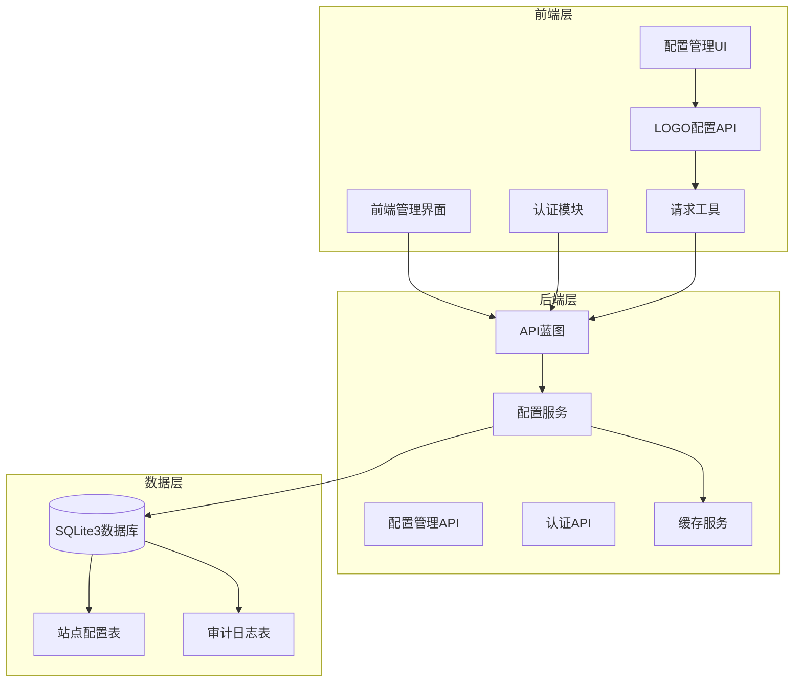
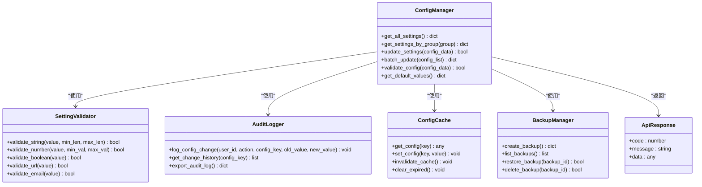
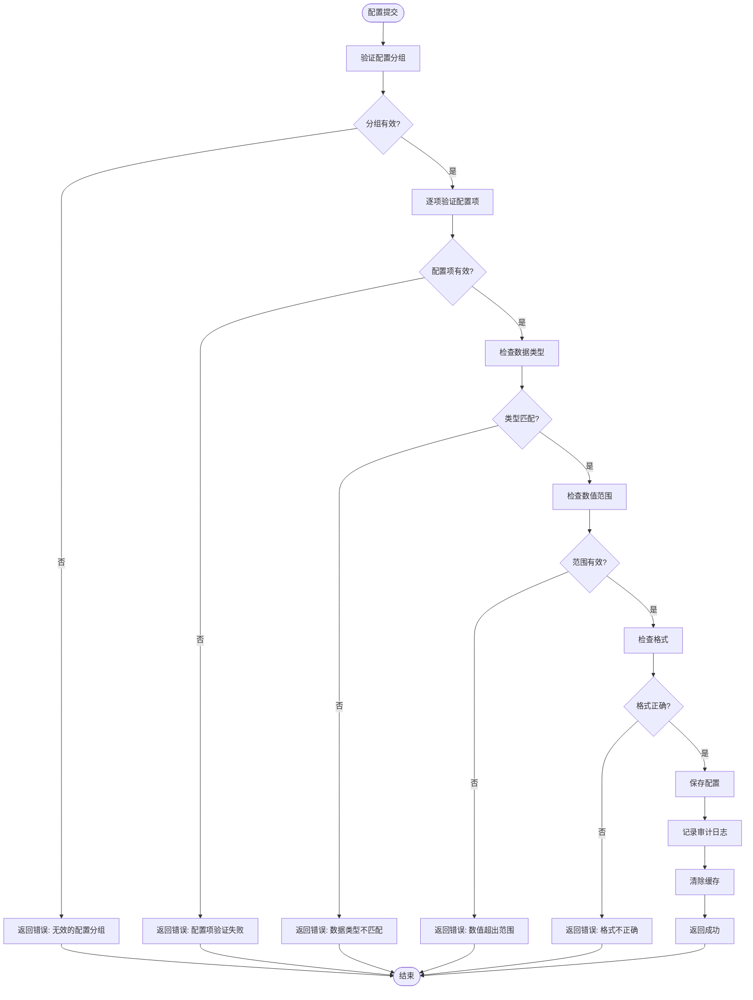
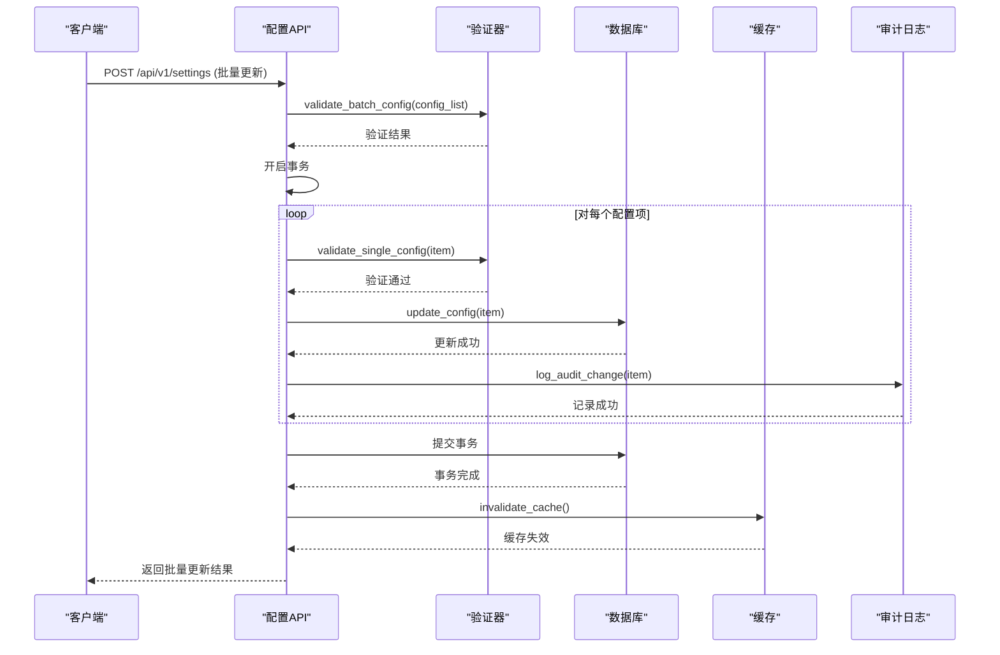
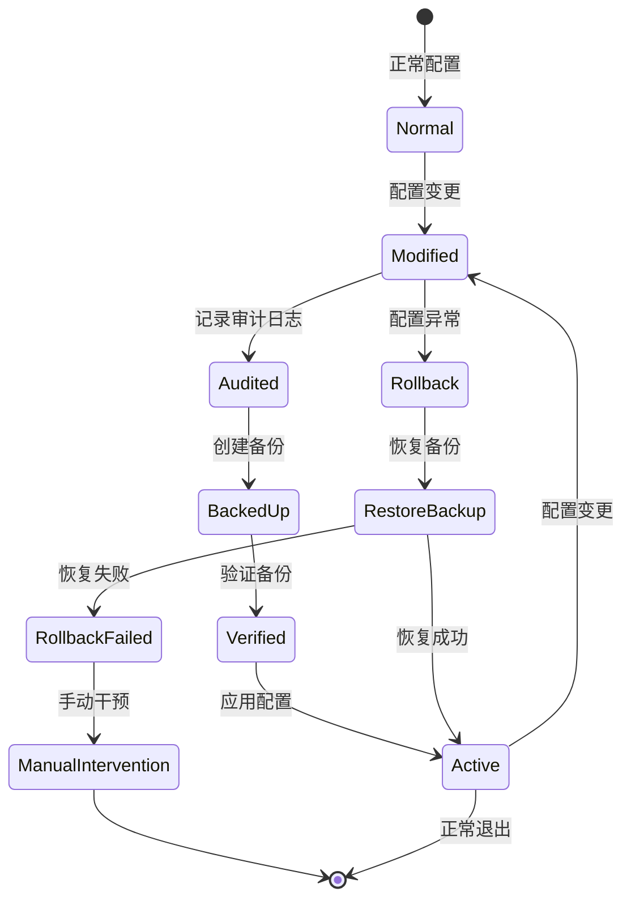
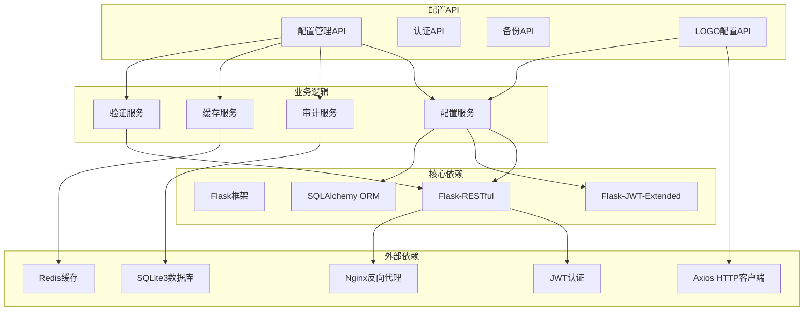

# 系统配置API

<cite>
**本文档引用的文件**
- [企业网站CMS系统开发需求文档.ini](file://企业网站CMS系统开发需求文档.ini)
- [企业网站CMS系统详细需求文档.md](file://企业网站CMS系统详细需求文档.md)
- [开发计划表_2月4日-2月12日.md](file://开发计划表_2月4日-2月12日.md)
- [settings.py](file://backend/app/api/settings.py)
- [logo.ts](file://frontend/src/api/logo.ts)
- [request.ts](file://frontend/src/utils/request.ts)
- [test_logo_api.py](file://tests/test_logo_api.py)
</cite>

## 更新摘要
**所做更改**
- 更新了LOGO配置API的类型安全性说明，反映了前端类型系统的改进
- 增强了API响应格式一致性的文档描述
- 补充了内部ApiResponse类型的使用说明

## 目录
1. [简介](#简介)
2. [项目结构](#项目结构)
3. [核心组件](#核心组件)
4. [架构概览](#架构概览)
5. [详细组件分析](#详细组件分析)
6. [依赖关系分析](#依赖关系分析)
7. [性能考虑](#性能考虑)
8. [故障排除指南](#故障排除指南)
9. [结论](#结论)

## 简介

系统配置API是企业网站CMS系统的核心管理接口，负责管理网站的各种配置参数。该API提供了完整的配置管理功能，包括网站设置、SEO配置、URL配置、邮件配置、安全设置、性能配置等模块，支持配置项的分类管理、批量更新和默认值处理机制。

系统配置API采用RESTful设计原则，基于JWT身份认证，支持JSON数据格式，为管理员提供了直观的配置管理界面和强大的功能扩展能力。

**更新** 改进了LOGO配置API的类型安全性，通过引入内部ApiResponse类型确保前后端响应格式的一致性和类型安全。

## 项目结构

CMS系统采用前后端分离架构，系统配置API作为后端服务的重要组成部分，位于Flask应用的API蓝图中。



**图表来源**
- [企业网站CMS系统详细需求文档.md:940-1076](file://企业网站CMS系统详细需求文档.md#L940-L1076)
- [开发计划表_2月4日-2月12日.md:92-105](file://开发计划表_2月4日-2月12日.md#L92-L105)

**章节来源**
- [企业网站CMS系统详细需求文档.md:22-57](file://企业网站CMS系统详细需求文档.md#L22-L57)
- [开发计划表_2月4日-2月12日.md:92-105](file://开发计划表_2月4日-2月12日.md#L92-L105)

## 核心组件

系统配置API主要包含以下核心组件：

### 配置管理服务
- **配置分类管理**：支持网站设置、SEO配置、URL配置、邮件配置、安全设置、性能配置等分类
- **配置项存储**：使用键值对形式存储配置项，支持多种数据类型
- **配置验证**：提供参数验证和数据类型检查
- **配置缓存**：支持Redis缓存提高配置读取性能

### 审计日志系统
- **操作记录**：记录所有配置变更操作
- **变更追踪**：跟踪配置项的修改历史
- **权限控制**：基于角色的配置访问控制
- **异常监控**：监控配置相关的异常操作

### 批量配置处理
- **批量更新**：支持一次性更新多个配置项
- **配置导入导出**：支持配置的批量导入和导出
- **配置模板**：提供预设的配置模板
- **配置验证**：批量操作前的数据验证

### 类型安全增强
- **内部ApiResponse类型**：统一前后端响应格式，确保类型安全
- **前端类型定义**：使用TypeScript接口定义API响应结构
- **响应拦截器**：自动解包响应数据，简化前端使用

**章节来源**
- [企业网站CMS系统详细需求文档.md:879-889](file://企业网站CMS系统详细需求文档.md#L879-L889)
- [开发计划表_2月4日-2月12日.md:226-233](file://开发计划表_2月4日-2月12日.md#L226-L233)

## 架构概览

系统配置API采用模块化的架构设计，支持配置项的分类管理和层次化组织。



**图表来源**
- [企业网站CMS系统详细需求文档.md:879-889](file://企业网站CMS系统详细需求文档.md#L879-L889)
- [企业网站CMS系统详细需求文档.md:1068-1076](file://企业网站CMS系统详细需求文档.md#L1068-L1076)

## 详细组件分析

### 配置API接口规范

系统配置API遵循RESTful设计原则，提供标准化的接口规范：

#### 基础接口规范

| 接口 | 方法 | 描述 |
|------|------|------|
| `/api/v1/settings` | GET | 获取所有配置项 |
| `/api/v1/settings/:group` | GET | 获取指定分组的配置项 |
| `/api/v1/settings` | PUT | 更新配置项 |
| `/api/v1/backup` | POST | 创建配置备份 |
| `/api/v1/backup` | GET | 获取备份列表 |
| `/api/v1/backup/:id/restore` | POST | 恢复配置备份 |

#### LOGO配置专用接口

**更新** LOGO配置API现在使用统一的响应格式，确保类型安全和一致性。

| 接口 | 方法 | 描述 |
|------|------|------|
| `/api/v1/settings/logo` | GET | 获取LOGO配置（公开接口） |
| `/api/v1/settings/logo` | PUT | 更新LOGO配置（需要登录） |

#### 请求响应格式

**更新** 所有API接口现在使用统一的响应格式，通过内部ApiResponse类型确保类型安全。

**请求格式**：
```json
{
  "data": {},
  "meta": {
    "request_id": "uuid"
  }
}
```

**响应格式**：
```typescript
interface ApiResponse<T = any> {
  code: number;
  message: string;
  data: T;
}
```

**章节来源**
- [企业网站CMS系统详细需求文档.md:942-998](file://企业网站CMS系统详细需求文档.md#L942-L998)
- [企业网站CMS系统详细需求文档.md:1068-1076](file://企业网站CMS系统详细需求文档.md#L1068-L1076)

### LOGO配置API详细规范

**更新** LOGO配置API现在具有完整的类型安全保证，使用内部ApiResponse类型确保前后端响应格式一致。

#### GET /settings/logo 接口

**功能**：获取网站LOGO配置信息

**请求示例**：
```typescript
// 前端调用
const response = await getLogoConfig();
// response: ApiResponse<LogoConfig>
```

**响应格式**：
```json
{
  "code": 200,
  "message": "success",
  "data": {
    "enabled": true,
    "displayMode": "textAndImage",
    "logoImage": "/media/2026/03/test.png",
    "logoImageWidth": 50,
    "logoImageHeight": 50,
    "logoText": "TEST",
    "logoSubText": "CMS",
    "textColor": "#ff0000",
    "subTextColor": "#001529",
    "fontSize": 24,
    "subFontSize": 24,
    "fontWeight": 800,
    "letterSpacing": 2,
    "imageGap": 15,
    "linkUrl": "/"
  }
}
```

#### PUT /settings/logo 接口

**功能**：更新LOGO配置信息

**请求示例**：
```typescript
// 前端调用
const config = {
  enabled: true,
  displayMode: 'textAndImage',
  logoImage: '/media/2026/03/test.png',
  logoImageWidth: 50,
  logoImageHeight: 50,
  logoText: 'TEST',
  logoSubText: 'CMS',
  textColor: '#ff0000',
  subTextColor: '#001529',
  fontSize: 24,
  subFontSize: 24,
  fontWeight: 800,
  letterSpacing: 2,
  imageGap: 15,
  linkUrl: '/'
};

const response = await updateLogoConfig(config);
// response: ApiResponse<LogoConfig>
```

**响应格式**：
```json
{
  "code": 200,
  "message": "LOGO 配置保存成功",
  "data": {
    "enabled": true,
    "displayMode": "textAndImage",
    "logoImage": "/media/2026/03/test.png",
    "logoImageWidth": 50,
    "logoImageHeight": 50,
    "logoText": "TEST",
    "logoSubText": "CMS",
    "textColor": "#ff0000",
    "subTextColor": "#001529",
    "fontSize": 24,
    "subFontSize": 24,
    "fontWeight": 800,
    "letterSpacing": 2,
    "imageGap": 15,
    "linkUrl": "/"
  }
}
```

**章节来源**
- [settings.py:175-263](file://backend/app/api/settings.py#L175-L263)
- [logo.ts:1-40](file://frontend/src/api/logo.ts#L1-L40)
- [request.ts:5-9](file://frontend/src/utils/request.ts#L5-L9)

### 配置分类管理

系统配置按照功能模块进行分类管理，每个分类包含特定的配置项：

#### 网站基本设置

| 配置项 | 类型 | 描述 | 默认值 |
|--------|------|------|--------|
| website_name | string | 网站名称 | 企业官网 |
| website_description | string | 网站描述 | 企业官方网站 |
| logo | string | 网站Logo路径 | /static/images/logo.png |
| favicon | string | 网站图标路径 | /static/images/favicon.ico |
| contact_phone | string | 联系电话 | 400-XXX-XXXX |
| contact_email | string | 联系邮箱 | info@company.com |
| address | string | 公司地址 | 北京市朝阳区XXX |
| icp_number | string | ICP备案号 | 京ICP备XXXXXXX号 |

#### SEO配置

| 配置项 | 类型 | 描述 | 默认值 |
|--------|------|------|--------|
| meta_title_template | string | 默认Meta标题模板 | "{title} - {site_name}" |
| meta_description | string | 默认Meta描述 | 企业官方网站，提供专业服务 |
| default_keywords | string | 默认关键词 | 企业,官网,服务 |
| google_analytics_id | string | Google Analytics ID | UA-XXXXXXXXX-X |
| baidu_tongji_code | string | 百度统计代码 | 代码片段 |
| custom_head_code | string | 自定义头部代码 | 空 |
| custom_footer_code | string | 自定义底部代码 | 空 |

#### URL配置

| 配置项 | 类型 | 描述 | 默认值 |
|--------|------|------|--------|
| permalink_format | string | 固定链接格式 | /post/{slug} |
| url_rewrite_rules | json | URL重写规则 | [] |
| pagination_format | string | 分页URL格式 | /page/{page} |
| canonical_url | string | 规范链接URL | 自动获取 |

#### 邮件配置

| 配置项 | 类型 | 描述 | 默认值 |
|--------|------|------|--------|
| smtp_server | string | SMTP服务器地址 | smtp.gmail.com |
| smtp_port | number | SMTP端口号 | 587 |
| smtp_username | string | SMTP用户名 | noreply@company.com |
| smtp_password | string | SMTP密码 | 加密存储 |
| sender_email | string | 发件人邮箱 | noreply@company.com |
| sender_name | string | 发件人名称 | 企业官网 |

#### 安全设置

| 配置项 | 类型 | 描述 | 默认值 |
|--------|------|------|--------|
| force_https | boolean | HTTPS强制跳转 | true |
| cors_origins | array | CORS允许的域名 | ["*"] |
| rate_limit_enabled | boolean | API访问频率限制 | true |
| ip_whitelist | array | IP白名单 | [] |
| ip_blacklist | array | IP黑名单 | [] |
| upload_security_enabled | boolean | 文件上传安全规则 | true |

#### 性能配置

| 配置项 | 类型 | 描述 | 默认值 |
|--------|------|------|--------|
| cache_enabled | boolean | 缓存开关 | true |
| cache_timeout | number | 缓存过期时间(秒) | 300 |
| cdn_domain | string | 静态资源CDN地址 | "" |
| image_quality | number | 图片压缩质量(1-100) | 85 |
| lazy_loading_enabled | boolean | 懒加载开关 | true |

**章节来源**
- [企业网站CMS系统详细需求文档.md:390-444](file://企业网站CMS系统详细需求文档.md#L390-L444)

### 配置验证规则

系统配置API实现了严格的配置验证机制，确保配置数据的完整性和有效性：



**图表来源**
- [企业网站CMS系统详细需求文档.md:1099-1127](file://企业网站CMS系统详细需求文档.md#L1099-L1127)

### 批量配置处理

系统支持批量配置更新操作，提供高效的配置管理能力：

#### 批量更新流程



**图表来源**
- [企业网站CMS系统详细需求文档.md:1068-1076](file://企业网站CMS系统详细需求文档.md#L1068-L1076)

### 审计日志和回滚机制

系统实现了完整的配置变更审计日志和回滚机制：

#### 审计日志表结构

| 字段名 | 类型 | 描述 |
|--------|------|------|
| id | integer | 主键 |
| user_id | integer | 操作用户ID |
| action | string | 操作类型(create/update/delete) |
| config_key | string | 配置键名 |
| old_value | text | 旧值 |
| new_value | text | 新值 |
| ip_address | string | IP地址 |
| user_agent | string | 用户代理 |
| created_at | datetime | 操作时间 |

#### 回滚机制



**图表来源**
- [企业网站CMS系统详细需求文档.md:1391-1395](file://企业网站CMS系统详细需求文档.md#L1391-L1395)

**章节来源**
- [企业网站CMS系统详细需求文档.md:879-889](file://企业网站CMS系统详细需求文档.md#L879-L889)
- [企业网站CMS系统详细需求文档.md:1391-1395](file://企业网站CMS系统详细需求文档.md#L1391-L1395)

## 依赖关系分析

系统配置API的依赖关系体现了清晰的分层架构：



**图表来源**
- [企业网站CMS系统详细需求文档.md:555-594](file://企业网站CMS系统详细需求文档.md#L555-L594)
- [企业网站CMS系统详细需求文档.md:1232-1322](file://企业网站CMS系统详细需求文档.md#L1232-L1322)

**章节来源**
- [企业网站CMS系统详细需求文档.md:555-594](file://企业网站CMS系统详细需求文档.md#L555-L594)
- [企业网站CMS系统详细需求文档.md:1232-1322](file://企业网站CMS系统详细需求文档.md#L1232-L1322)

## 性能考虑

系统配置API在设计时充分考虑了性能优化：

### 缓存策略
- **配置缓存**：使用Redis缓存配置数据，减少数据库查询
- **响应缓存**：对读取操作进行缓存，提高响应速度
- **缓存失效**：配置更新时自动清除相关缓存

### 数据库优化
- **索引优化**：为配置键名建立唯一索引
- **连接池**：使用SQLite连接池提高并发性能
- **查询优化**：针对配置查询进行专门优化

### 安全性能
- **JWT令牌缓存**：减少JWT验证开销
- **API限流**：防止配置API被滥用
- **批量操作优化**：支持批量配置更新减少网络往返

### 类型安全优化
- **编译时类型检查**：通过TypeScript确保类型安全
- **运行时类型验证**：后端API响应格式统一
- **响应拦截器**：自动解包响应数据，减少重复代码

## 故障排除指南

### 常见问题及解决方案

#### 配置验证失败
**问题**：配置更新时报验证错误
**原因**：配置项格式或类型不正确
**解决**：检查配置项的格式和类型，参考配置验证规则

#### 缓存问题
**问题**：配置更新后仍显示旧值
**原因**：缓存未及时更新
**解决**：调用缓存失效接口或等待缓存自动过期

#### 权限不足
**问题**：无法访问配置API
**原因**：用户权限不足
**解决**：确保用户具有相应的配置管理权限

#### 数据库连接问题
**问题**：配置API无法连接数据库
**原因**：数据库配置错误或连接池耗尽
**解决**：检查数据库连接配置和连接池设置

#### 类型安全问题
**问题**：前端类型错误或编译失败
**原因**：ApiResponse类型不匹配
**解决**：检查前端类型定义与后端响应格式是否一致

**章节来源**
- [企业网站CMS系统详细需求文档.md:1360-1460](file://企业网站CMS系统详细需求文档.md#L1360-L1460)

## 结论

系统配置API为企业网站CMS系统提供了完整的配置管理解决方案。通过模块化的架构设计、严格的配置验证机制、完善的审计日志系统和高效的性能优化，该API能够满足企业网站配置管理的各种需求。

**更新** 最新的类型安全改进进一步增强了系统的可靠性，通过统一的ApiResponse类型确保前后端响应格式的一致性，减少了类型相关的错误和调试复杂度。

系统的主要优势包括：
- **功能完整性**：涵盖网站设置、SEO配置、URL配置、邮件配置、安全设置、性能配置等所有配置模块
- **易用性**：提供直观的API接口和丰富的配置选项
- **安全性**：完善的权限控制和审计日志机制
- **类型安全**：通过内部ApiResponse类型确保前后端响应格式一致
- **可扩展性**：模块化设计便于功能扩展和定制
- **性能优化**：缓存机制和数据库优化确保高效运行

该系统配置API为企业的网站管理提供了强有力的技术支撑，有助于提升网站管理效率和用户体验。