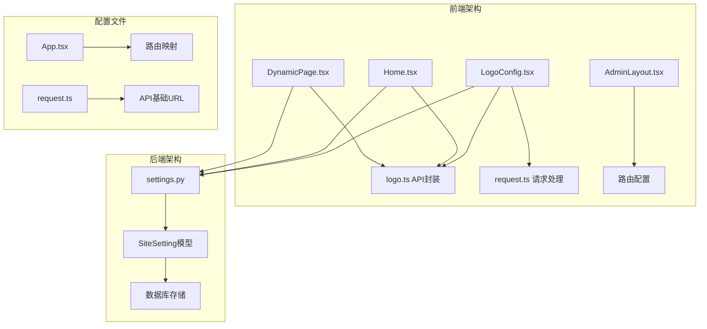
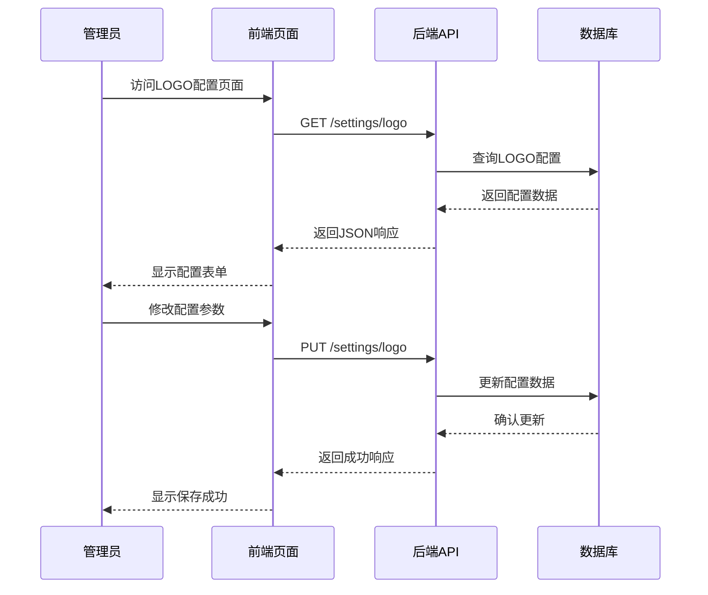
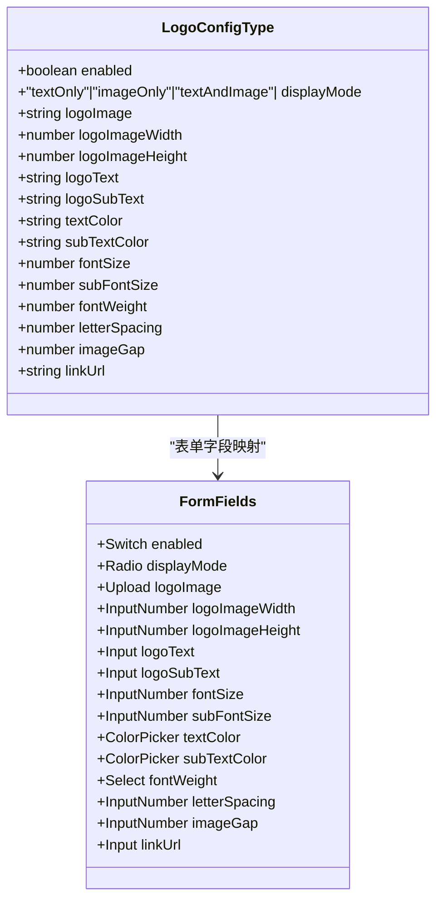
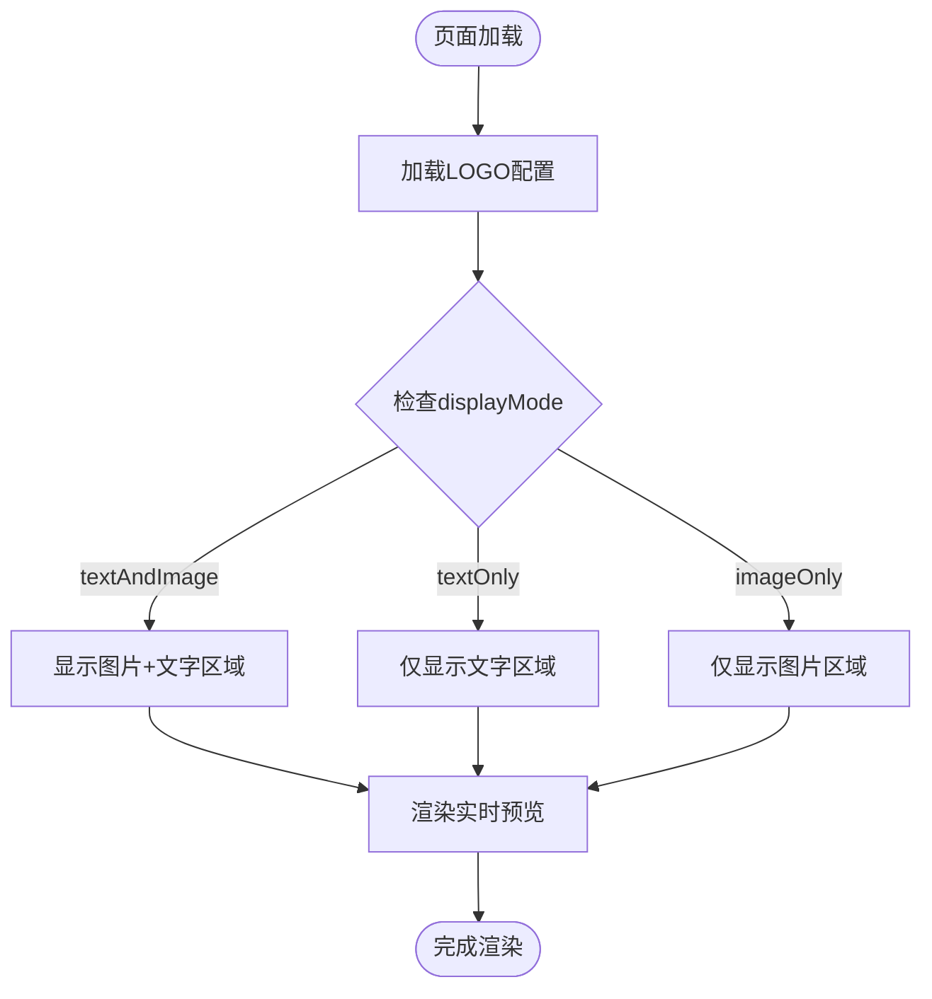
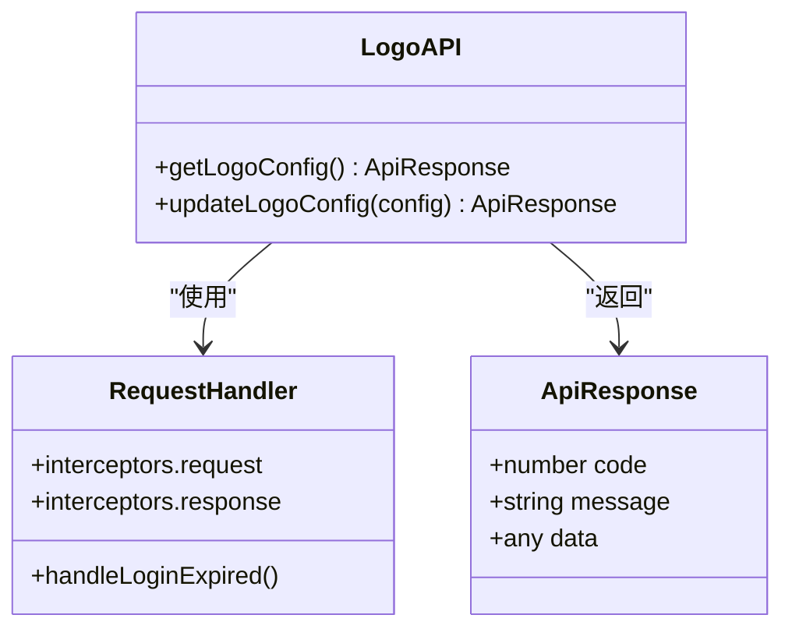
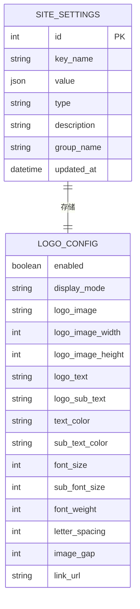
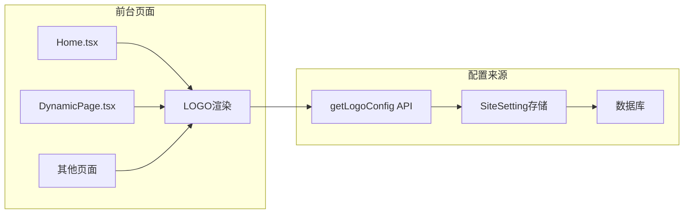
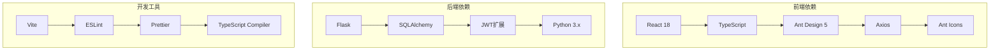
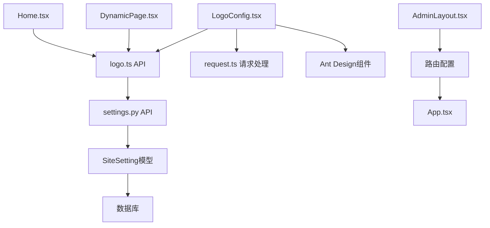

# LOGO配置页面

<cite>
**本文档引用的文件**
- [LogoConfig.tsx](file://company_cms_project/frontend/src/pages/LogoConfig.tsx)
- [logo.ts](file://company_cms_project/frontend/src/api/logo.ts)
- [settings.py](file://company_cms_project/backend/app/api/settings.py)
- [post.py](file://company_cms_project/backend/app/models/post.py)
- [request.ts](file://company_cms_project/frontend/src/utils/request.ts)
- [AdminLayout.tsx](file://company_cms_project/frontend/src/layout/AdminLayout.tsx)
- [App.tsx](file://company_cms_project/frontend/src/App.tsx)
- [Home.tsx](file://company_cms_project/frontend/src/pages/Home.tsx)
- [DynamicPage.tsx](file://company_cms_project/frontend/src/pages/DynamicPage.tsx)
- [test_logo_api.py](file://tests/test_logo_api.py)
- [迭代记录_2026-03-12_LOGO 配置功能.md](file://docs/迭代记录_2026-03-12_LOGO 配置功能.md)
</cite>

## 目录
1. [简介](#简介)
2. [项目结构](#项目结构)
3. [核心组件](#核心组件)
4. [架构概览](#架构概览)
5. [详细组件分析](#详细组件分析)
6. [依赖关系分析](#依赖关系分析)
7. [性能考虑](#性能考虑)
8. [故障排除指南](#故障排除指南)
9. [结论](#结论)

## 简介

LOGO配置页面是企业网站CMS系统的核心功能模块之一，允许管理员在后台管理系统中自定义网站左上角的LOGO展示。该功能支持三种显示模式：文字+图片组合、仅文字显示和仅图片显示，并提供丰富的样式定制选项，包括字体大小、颜色、粗细、间距等参数。

## 项目结构

LOGO配置功能涉及前后端多个文件的协作：

**图表来源**
- [LogoConfig.tsx:1-513](file://company_cms_project/frontend/src/pages/LogoConfig.tsx#L1-L513)
- [settings.py:175-263](file://company_cms_project/backend/app/api/settings.py#L175-L263)

**章节来源**
- [LogoConfig.tsx:1-513](file://company_cms_project/frontend/src/pages/LogoConfig.tsx#L1-L513)
- [settings.py:1-360](file://company_cms_project/backend/app/api/settings.py#L1-L360)

## 核心组件

### 前端组件

LOGO配置页面采用React + TypeScript构建，主要包含以下核心组件：

1. **LogoConfig组件** - 主要配置界面，提供完整的LOGO配置功能
2. **API封装** - 提供LOGO配置的获取和更新接口
3. **实时预览** - 实时展示配置效果的预览区域
4. **媒体库集成** - 支持从媒体库选择图片

### 后端服务

1. **LOGO配置API** - 提供LOGO配置的CRUD操作
2. **SiteSetting模型** - 数据库存储LOGO配置信息
3. **JWT认证** - 保护配置更新操作

**章节来源**
- [logo.ts:1-41](file://company_cms_project/frontend/src/api/logo.ts#L1-L41)
- [post.py:210-280](file://company_cms_project/backend/app/models/post.py#L210-L280)

## 架构概览

LOGO配置功能采用经典的前后端分离架构：

**图表来源**
- [LogoConfig.tsx:80-138](file://company_cms_project/frontend/src/pages/LogoConfig.tsx#L80-L138)
- [settings.py:213-257](file://company_cms_project/backend/app/api/settings.py#L213-L257)

## 详细组件分析

### LogoConfig页面组件

LogoConfig页面是整个LOGO配置功能的核心界面，采用Ant Design组件库构建：

#### 数据结构设计

**图表来源**
- [LogoConfig.tsx:24-40](file://company_cms_project/frontend/src/pages/LogoConfig.tsx#L24-L40)

#### 显示模式逻辑

页面支持三种显示模式，通过条件渲染实现：

**图表来源**
- [LogoConfig.tsx:238-415](file://company_cms_project/frontend/src/pages/LogoConfig.tsx#L238-L415)

#### 实时预览机制

预览区域使用内联样式动态计算，确保配置变更立即生效：

| 预览元素 | 动态属性 | 计算方式 |
|---------|---------|---------|
| LOGO图片 | 宽度、高度、边距 | 直接使用配置值 |
| 主文字 | 字体大小、颜色、粗细 | 直接使用配置值 |
| 副文字 | 字体大小、颜色 | 直接使用配置值 |
| 文字间距 | letter-spacing | 直接使用配置值 |

**章节来源**
- [LogoConfig.tsx:42-160](file://company_cms_project/frontend/src/pages/LogoConfig.tsx#L42-L160)

### API接口设计

#### 前端API封装

**图表来源**
- [logo.ts:7-40](file://company_cms_project/frontend/src/api/logo.ts#L7-L40)
- [request.ts:5-76](file://company_cms_project/frontend/src/utils/request.ts#L5-L76)

#### 后端API实现

后端提供两个核心接口：

1. **GET /settings/logo** - 获取LOGO配置（公开接口）
2. **PUT /settings/logo** - 更新LOGO配置（需要JWT认证）

**章节来源**
- [logo.ts:10-40](file://company_cms_project/frontend/src/api/logo.ts#L10-L40)
- [settings.py:175-257](file://company_cms_project/backend/app/api/settings.py#L175-L257)

### 数据存储模型

LOGO配置使用SiteSetting模型进行存储：

**图表来源**
- [post.py:210-280](file://company_cms_project/backend/app/models/post.py#L210-L280)

**章节来源**
- [post.py:233-280](file://company_cms_project/backend/app/models/post.py#L233-L280)

### 前台集成

LOGO配置在多个前台页面中集成使用：

**图表来源**
- [Home.tsx:107-152](file://company_cms_project/frontend/src/pages/Home.tsx#L107-L152)
- [DynamicPage.tsx:101-146](file://company_cms_project/frontend/src/pages/DynamicPage.tsx#L101-L146)

**章节来源**
- [Home.tsx:42-55](file://company_cms_project/frontend/src/pages/Home.tsx#L42-L55)
- [DynamicPage.tsx:45-58](file://company_cms_project/frontend/src/pages/DynamicPage.tsx#L45-L58)

## 依赖关系分析

### 技术栈依赖

### 组件耦合关系

**图表来源**
- [App.tsx:72-73](file://company_cms_project/frontend/src/App.tsx#L72-L73)
- [AdminLayout.tsx:72](file://company_cms_project/frontend/src/layout/AdminLayout.tsx#L72)

**章节来源**
- [App.tsx:18-74](file://company_cms_project/frontend/src/App.tsx#L18-L74)
- [AdminLayout.tsx:35-76](file://company_cms_project/frontend/src/layout/AdminLayout.tsx#L35-L76)

## 性能考虑

### 前端性能优化

1. **懒加载策略** - 媒体库图片采用懒加载，提升页面初始加载速度
2. **状态管理** - 使用React Hooks进行状态管理，避免不必要的重渲染
3. **内存优化** - 及时清理事件监听器和定时器

### 后端性能优化

1. **数据库查询优化** - 使用索引优化SiteSetting查询
2. **缓存策略** - 配置数据采用Redis缓存（建议实现）
3. **API响应优化** - 统一响应格式，减少数据传输

## 故障排除指南

### 常见问题及解决方案

#### 1. 登录过期问题

**症状**: 更新LOGO配置时报401错误
**解决方案**: 
- 检查本地存储中的token是否有效
- 重新登录获取新的token
- 确认JWT配置正确

#### 2. API响应格式错误

**症状**: TypeScript编译错误或运行时异常
**解决方案**:
- 确保使用正确的响应数据访问方式
- 检查响应拦截器配置
- 验证API端点URL

#### 3. 媒体库图片无法显示

**症状**: 选择的图片在预览中不显示
**解决方案**:
- 检查图片URL格式
- 确认图片权限设置
- 验证CDN配置

**章节来源**
- [request.ts:16-29](file://company_cms_project/frontend/src/utils/request.ts#L16-L29)
- [test_logo_api.py:10-21](file://tests/test_logo_api.py#L10-L21)

### 调试工具

1. **浏览器开发者工具** - 检查网络请求和响应
2. **后端日志** - 查看API调用日志
3. **数据库监控** - 监控SiteSetting表的读写操作

## 结论

LOGO配置页面是一个功能完整、架构清晰的企业级CMS功能模块。它通过前后端分离的设计模式，提供了灵活的LOGO定制能力，支持多种显示模式和丰富的样式配置选项。

### 主要优势

1. **用户体验优秀** - 实时预览功能让用户能够即时看到配置效果
2. **功能完整性** - 支持所有必要的LOGO配置参数
3. **代码质量高** - TypeScript类型安全，组件职责明确
4. **易于维护** - 清晰的架构设计和完善的错误处理

### 未来改进方向

1. **移动端适配** - 增强移动设备上的显示效果
2. **性能优化** - 实现配置数据缓存和图片懒加载
3. **功能扩展** - 支持更多LOGO样式和动画效果
4. **用户体验提升** - 增加配置模板和批量操作功能

该功能模块为企业的品牌展示提供了强大的技术支持，是CMS系统的重要组成部分。