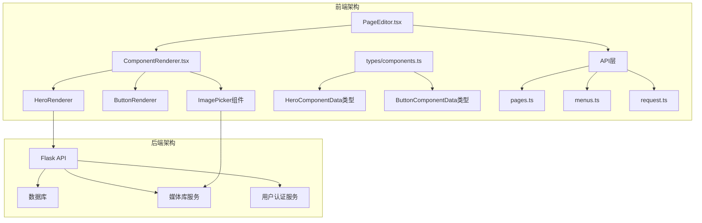
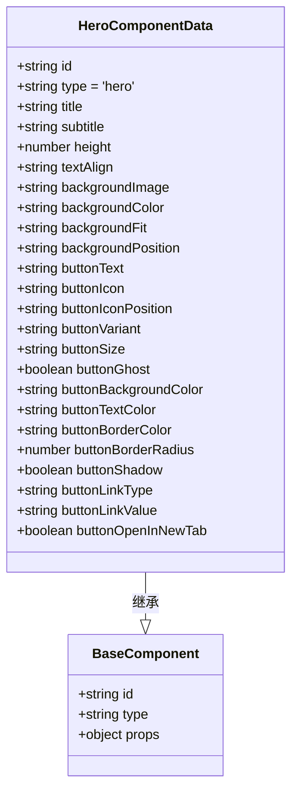
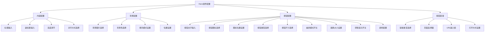
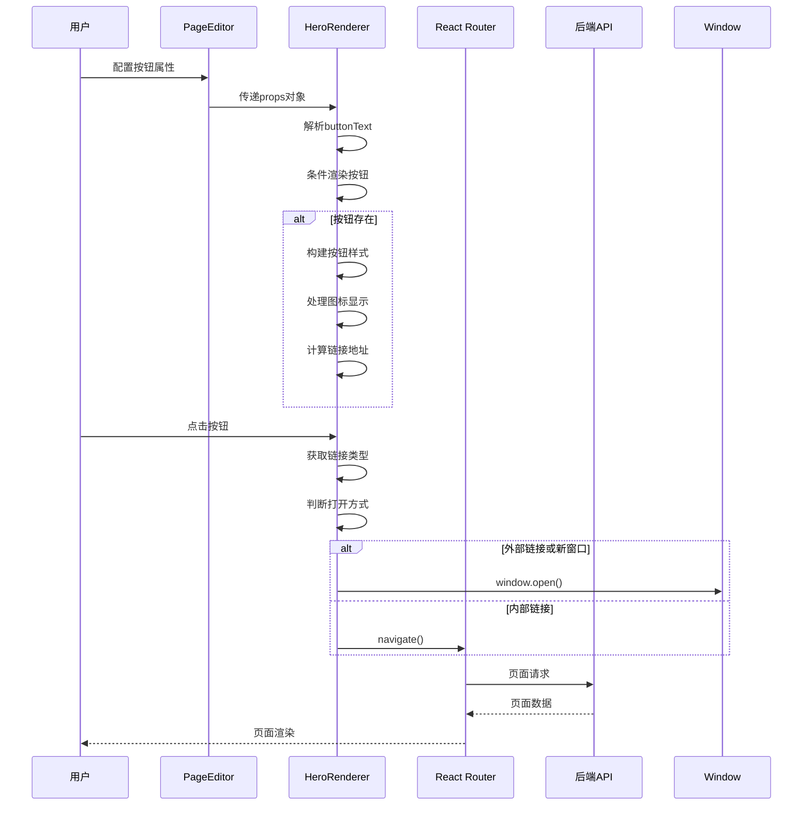
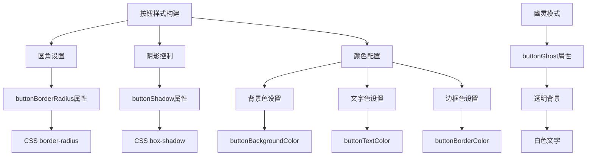
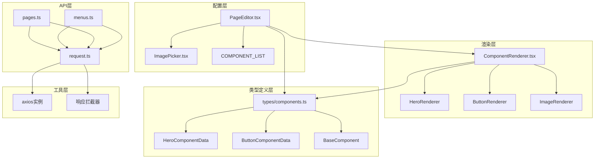
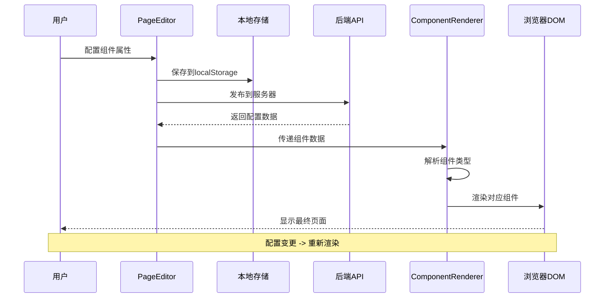

# v1.4.1_横幅大图按钮组件功能完善

<cite>
**本文档引用的文件**
- [v1.4.1_2026-03-16_横幅大图按钮组件功能完善.md](file://docs/v1.4.1_2026-03-16_横幅大图按钮组件功能完善.md)
- [v1.4.0_2026-03-16_按钮组件功能全面升级.md](file://docs/v1.4.0_2026-03-16_按钮组件功能全面升级.md)
- [components.ts](file://company_cms_project/frontend/src/types/components.ts)
- [PageEditor.tsx](file://company_cms_project/frontend/src/pages/PageEditor.tsx)
- [ComponentRenderer.tsx](file://company_cms_project/frontend/src/components/ComponentRenderer.tsx)
- [ImagePicker.tsx](file://company_cms_project/frontend/src/components/ImagePicker.tsx)
- [pages.ts](file://company_cms_project/frontend/src/api/pages.ts)
- [menus.ts](file://company_cms_project/frontend/src/api/menus.ts)
- [request.ts](file://company_cms_project/frontend/src/utils/request.ts)
</cite>

## 目录
1. [项目概述](#项目概述)
2. [架构概览](#架构概览)
3. [核心组件分析](#核心组件分析)
4. [详细组件实现](#详细组件实现)
5. [依赖关系分析](#依赖关系分析)
6. [性能考虑](#性能考虑)
7. [故障排除指南](#故障排除指南)
8. [总结](#总结)

## 项目概述

v1.4.1版本的横幅大图按钮组件功能完善是对企业CMS系统的重要升级，主要针对横幅大图组件中的按钮功能进行全面增强。该版本解决了原有按钮组件配置不完整、缺少链接功能和样式定制能力等问题，实现了与独立按钮组件功能的完全对齐。

### 主要改进内容

- **按钮配置完整性**：扩展了HeroComponentData类型定义，新增完整的按钮属性支持
- **链接功能增强**：支持首页、站内页面和外部链接等多种跳转方式
- **样式定制能力**：提供丰富的按钮样式配置选项，包括颜色、圆角、阴影等
- **用户体验优化**：重构配置面板，实现分组展示和条件显示功能

## 架构概览

企业CMS系统采用前后端分离架构，前端使用React + TypeScript开发，后端基于Python Flask框架。系统的核心架构围绕组件化设计展开，通过统一的组件类型定义和渲染器实现来支撑各种页面组件的动态配置和渲染。



**图表来源**
- [PageEditor.tsx:191-321](file://company_cms_project/frontend/src/pages/PageEditor.tsx#L191-L321)
- [ComponentRenderer.tsx:89-301](file://company_cms_project/frontend/src/components/ComponentRenderer.tsx#L89-L301)
- [components.ts:68-102](file://company_cms_project/frontend/src/types/components.ts#L68-L102)

## 核心组件分析

### Hero组件类型定义

Hero组件作为横幅大图的核心组件，其类型定义经过v1.4.1版本的重大扩展，新增了完整的按钮配置支持：



**图表来源**
- [components.ts:68-102](file://company_cms_project/frontend/src/types/components.ts#L68-L102)
- [components.ts:61-66](file://company_cms_project/frontend/src/types/components.ts#L61-L66)

### 按钮配置面板重构

v1.4.1版本对PageEditor.tsx中的配置面板进行了重大重构，实现了更加直观和用户友好的界面设计：



**图表来源**
- [PageEditor.tsx:776-1024](file://company_cms_project/frontend/src/pages/PageEditor.tsx#L776-L1024)

**章节来源**
- [components.ts:68-102](file://company_cms_project/frontend/src/types/components.ts#L68-L102)
- [PageEditor.tsx:776-1024](file://company_cms_project/frontend/src/pages/PageEditor.tsx#L776-L1024)

## 详细组件实现

### Hero渲染器实现

HeroRenderer组件负责渲染横幅大图组件，经过v1.4.1版本的升级，现在完全支持新增的按钮配置功能：



**图表来源**
- [ComponentRenderer.tsx:89-301](file://company_cms_project/frontend/src/components/ComponentRenderer.tsx#L89-L301)
- [ComponentRenderer.tsx:202-230](file://company_cms_project/frontend/src/components/ComponentRenderer.tsx#L202-L230)

### 按钮样式构建机制

HeroRenderer中的按钮样式构建函数提供了强大的样式定制能力：



**图表来源**
- [ComponentRenderer.tsx:154-183](file://company_cms_project/frontend/src/components/ComponentRenderer.tsx#L154-L183)

### 链接跳转处理

HeroRenderer实现了完整的链接跳转处理机制，支持多种链接类型：

```mermaid
flowchart TD
A[链接跳转处理] --> B[获取链接类型]
B --> C{链接类型判断}
C --> |none| D[无链接处理]
C --> |home| E[首页链接处理]
C --> |page| F[站内页面处理]
C --> |url| G[外部链接处理]
E --> H[返回根路径 '/' ]
F --> I[拼接页面路径 '/{pageKey}' ]
G --> J[直接使用URL]
D --> K[返回null]
H --> L[执行导航]
I --> L
J --> M{打开方式判断}
L --> N[React Router导航]
M --> |新窗口| O[window.open()打开]
M --> |当前页| P[window.open()当前页]
```

**图表来源**
- [ComponentRenderer.tsx:202-230](file://company_cms_project/frontend/src/components/ComponentRenderer.tsx#L202-L230)

**章节来源**
- [ComponentRenderer.tsx:89-301](file://company_cms_project/frontend/src/components/ComponentRenderer.tsx#L89-L301)
- [ComponentRenderer.tsx:154-288](file://company_cms_project/frontend/src/components/ComponentRenderer.tsx#L154-L288)

## 依赖关系分析

### 组件间依赖关系

企业CMS系统的组件间依赖关系体现了清晰的层次结构和职责分离：



**图表来源**
- [PageEditor.tsx:60-64](file://company_cms_project/frontend/src/pages/PageEditor.tsx#L60-L64)
- [ComponentRenderer.tsx:1-7](file://company_cms_project/frontend/src/components/ComponentRenderer.tsx#L1-L7)
- [components.ts:242-252](file://company_cms_project/frontend/src/types/components.ts#L242-L252)

### 数据流分析

系统中的数据流体现了从配置到渲染的完整生命周期：



**图表来源**
- [PageEditor.tsx:404-445](file://company_cms_project/frontend/src/pages/PageEditor.tsx#L404-L445)
- [ComponentRenderer.tsx:89-301](file://company_cms_project/frontend/src/components/ComponentRenderer.tsx#L89-L301)

**章节来源**
- [PageEditor.tsx:404-445](file://company_cms_project/frontend/src/pages/PageEditor.tsx#L404-L445)
- [ComponentRenderer.tsx:89-301](file://company_cms_project/frontend/src/components/ComponentRenderer.tsx#L89-L301)

## 性能考虑

### 渲染性能优化

v1.4.1版本在性能方面进行了多项优化，特别是在按钮渲染和样式计算方面：

- **条件渲染优化**：只有当buttonText存在时才渲染按钮，避免不必要的DOM节点创建
- **样式缓存机制**：按钮样式构建函数使用缓存策略，减少重复计算
- **懒加载实现**：图片资源采用懒加载方式，提升页面加载速度
- **内存管理**：及时清理事件监听器和定时器，防止内存泄漏

### 网络请求优化

系统采用了多种网络请求优化策略：

- **请求拦截器**：统一处理认证令牌和错误响应
- **响应缓存**：对静态资源请求进行缓存处理
- **并发控制**：限制同时进行的网络请求数量
- **超时处理**：设置合理的请求超时时间

## 故障排除指南

### 常见问题及解决方案

#### 按钮不显示问题

**问题描述**：配置了按钮属性但按钮不显示

**可能原因**：
1. buttonText属性为空字符串
2. 配置面板未正确保存
3. 组件渲染逻辑异常

**解决步骤**：
1. 检查buttonText属性是否为空
2. 确认配置面板已保存到localStorage
3. 查看浏览器控制台是否有错误信息

#### 链接跳转失败

**问题描述**：按钮点击后无法正确跳转

**可能原因**：
1. 链接类型配置错误
2. 页面路径配置不正确
3. React Router配置问题

**解决步骤**：
1. 检查buttonLinkType属性值
2. 验证buttonLinkValue格式
3. 确认目标页面是否存在

#### 样式不生效

**问题描述**：自定义的颜色、圆角等样式不生效

**可能原因**：
1. CSS优先级问题
2. 样式计算错误
3. 浏览器兼容性问题

**解决步骤**：
1. 检查CSS选择器优先级
2. 验证样式计算逻辑
3. 测试不同浏览器兼容性

**章节来源**
- [ComponentRenderer.tsx:154-183](file://company_cms_project/frontend/src/components/ComponentRenderer.tsx#L154-L183)
- [PageEditor.tsx:968-1022](file://company_cms_project/frontend/src/pages/PageEditor.tsx#L968-L1022)

## 总结

v1.4.1版本的横幅大图按钮组件功能完善代表了企业CMS系统在用户体验和功能完整性方面的重大进步。通过本次升级，系统实现了以下关键改进：

### 功能完整性提升

- **按钮配置完整化**：实现了与独立按钮组件完全一致的配置能力
- **链接功能增强**：支持首页、站内页面和外部链接的多样化跳转
- **样式定制丰富**：提供颜色、圆角、阴影等全方位的样式定制选项
- **用户体验优化**：重构配置面板，实现分组展示和条件显示

### 技术架构改进

- **类型安全增强**：通过TypeScript类型定义确保代码质量
- **组件复用优化**：复用BUTTON_ICON_MAP和样式构建逻辑
- **渲染性能提升**：优化按钮渲染逻辑，提升页面响应速度
- **错误处理完善**：增强错误处理和用户反馈机制

### 后续发展建议

基于v1.4.1版本的成功实践，建议在后续版本中进一步完善：

1. **多按钮支持**：考虑支持配置多个按钮的场景
2. **动画效果**：添加按钮悬停和点击动画效果
3. **样式预设**：提供常用按钮样式的预设模板
4. **图标扩展**：支持自定义图标上传和扩展

本次升级不仅提升了系统的功能性，更重要的是为未来的功能扩展奠定了坚实的技术基础，体现了企业CMS系统持续演进和优化的发展理念。