# v1.5.0_页面编辑器容器嵌套与尺寸统一功能

<cite>
**本文档引用的文件**
- [v1.5.0_2026-03-17_页面编辑器容器嵌套与尺寸统一功能.md](file://docs/v1.5.0_2026-03-17_页面编辑器容器嵌套与尺寸统一功能.md)
- [PageEditor.tsx](file://company_cms_project/frontend/src/pages/PageEditor.tsx)
- [ComponentRenderer.tsx](file://company_cms_project/frontend/src/components/ComponentRenderer.tsx)
- [components.ts](file://company_cms_project/frontend/src/types/components.ts)
- [pages.ts](file://company_cms_project/frontend/src/api/pages.ts)
- [ImagePicker.tsx](file://company_cms_project/frontend/src/components/ImagePicker.tsx)
</cite>

## 目录
1. [项目概述](#项目概述)
2. [核心功能特性](#核心功能特性)
3. [技术架构设计](#技术架构设计)
4. [容器嵌套功能详解](#容器嵌套功能详解)
5. [子组件尺寸统一机制](#子组件尺寸统一机制)
6. [图片宽高比控制系统](#图片宽高比控制系统)
7. [编辑器界面设计](#编辑器界面设计)
8. [数据流与状态管理](#数据流与状态管理)
9. [性能优化策略](#性能优化策略)
10. [故障排除指南](#故障排除指南)
11. [总结与展望](#总结与展望)

## 项目概述

v1.5.0版本为企业网站CMS系统的重大功能升级，重点解决了页面编辑器中的两个核心痛点：容器无法嵌套和子组件尺寸不统一的问题。本次更新显著提升了页面构建的灵活性和视觉一致性，为用户提供了更加专业的页面编辑体验。

### 主要改进内容

- **容器嵌套支持**：实现了最多2层的容器嵌套功能，允许创建复杂的页面布局结构
- **子组件尺寸统一**：提供统一的高度控制机制，确保容器内子组件的视觉一致性
- **图片宽高比控制**：新增多种预设宽高比选项，解决图片显示比例问题
- **智能嵌套深度检测**：自动识别容器嵌套层级，动态调整可用组件选项

## 核心功能特性

### 容器嵌套深度控制

系统采用严格的嵌套深度限制机制，确保页面结构的合理性和性能：

```mermaid
flowchart TD
A[用户选择容器] --> B{检查嵌套深度}
B --> |深度为0| C[允许添加嵌套容器]
B --> |深度为1| D[禁止添加嵌套容器]
B --> |深度为2| E[达到最大深度限制]
C --> F[添加第2层容器]
D --> G[仅允许基础组件]
E --> H[显示深度限制提示]
F --> I[嵌套容器编辑面板]
G --> J[基础组件配置]
H --> K[禁用容器选项]
```

**图表来源**
- [PageEditor.tsx:384-424](file://company_cms_project/frontend/src/pages/PageEditor.tsx#L384-L424)

### 子组件统一高度控制

容器级别的childHeight属性提供了灵活的高度统一机制：

- **支持范围**：80px 到 400px 的多档位选择
- **默认行为**：'auto' 值表示不强制统一高度
- **溢出处理**：统一高度时自动隐藏溢出内容

### 图片宽高比预设系统

系统内置了四种标准宽高比预设，满足不同场景需求：

| 预设比例 | 数值表示 | 适用场景 | CSS百分比 |
|---------|---------|---------|-----------|
| 自动适配 | auto | 原始图片比例 | 不适用 |
| 正方形 | 1:1 | 头像、图标、产品缩略图 | 100% |
| 标准比例 | 4:3 | 普通照片、宣传图 | 75% |
| 宽屏比例 | 16:9 | 横幅广告、视频截图 | 56.25% |
| 竖向比例 | 3:4 | 竖版海报、证件照 | 133.33% |

**章节来源**
- [v1.5.0_2026-03-17_页面编辑器容器嵌套与尺寸统一功能.md:16-43](file://docs/v1.5.0_2026-03-17_页面编辑器容器嵌套与尺寸统一功能.md#L16-L43)

## 技术架构设计

### 前端架构层次

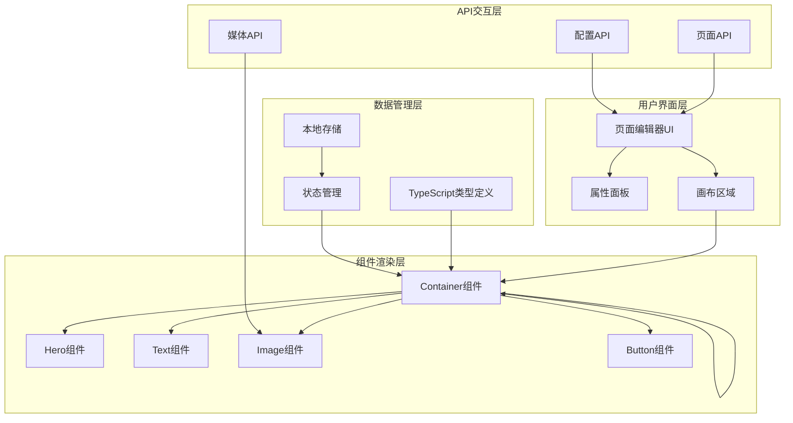

**图表来源**
- [PageEditor.tsx:192-2070](file://company_cms_project/frontend/src/pages/PageEditor.tsx#L192-L2070)
- [ComponentRenderer.tsx:1-988](file://company_cms_project/frontend/src/components/ComponentRenderer.tsx#L1-L988)

### 数据模型设计

系统采用统一的PageComponent联合类型定义，确保类型安全和扩展性：

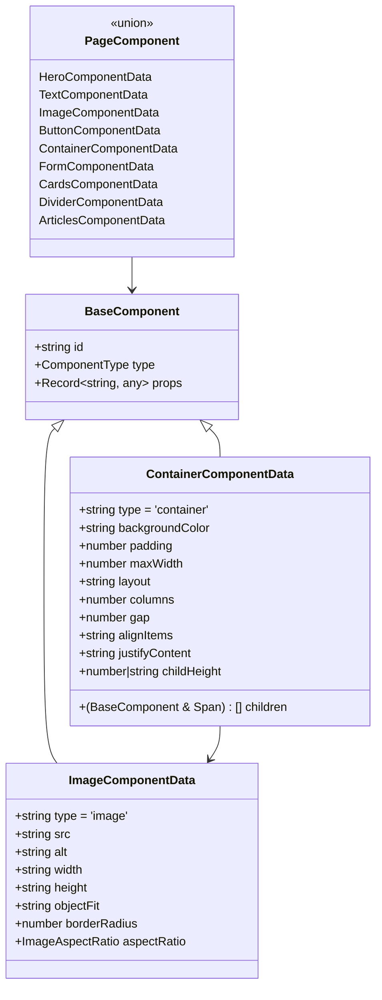

**图表来源**
- [components.ts:61-257](file://company_cms_project/frontend/src/types/components.ts#L61-L257)

**章节来源**
- [components.ts:1-416](file://company_cms_project/frontend/src/types/components.ts#L1-L416)

## 容器嵌套功能详解

### 嵌套深度检测算法

系统实现了智能的嵌套深度检测机制，能够准确识别组件在容器树中的层级位置：

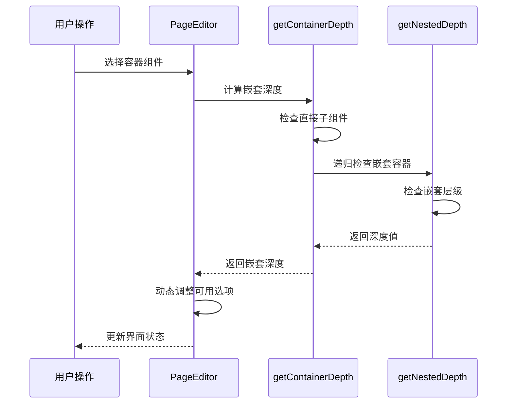

**图表来源**
- [PageEditor.tsx:384-424](file://company_cms_project/frontend/src/pages/PageEditor.tsx#L384-L424)

### 嵌套容器编辑体验

系统使用Ant Design Collapse组件提供直观的嵌套容器编辑界面：

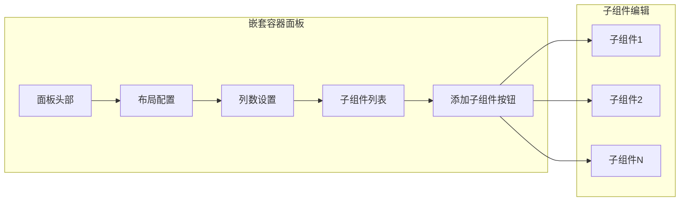

**图表来源**
- [PageEditor.tsx:1614-1770](file://company_cms_project/frontend/src/pages/PageEditor.tsx#L1614-L1770)

**章节来源**
- [PageEditor.tsx:1614-1815](file://company_cms_project/frontend/src/pages/PageEditor.tsx#L1614-L1815)

## 子组件尺寸统一机制

### 统一高度实现原理

容器级别的childHeight属性通过CSS样式应用实现子组件高度统一：

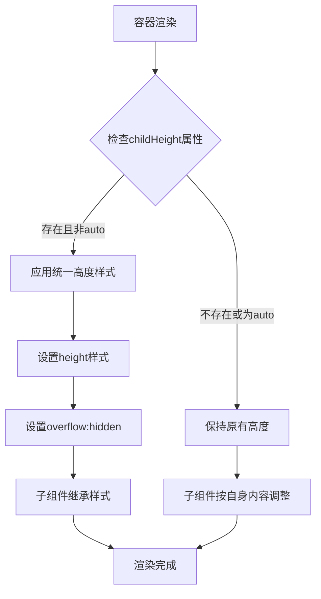

**图表来源**
- [ComponentRenderer.tsx:621-625](file://company_cms_project/frontend/src/components/ComponentRenderer.tsx#L621-L625)

### 高度控制选项配置

系统提供了丰富的高度控制选项，满足不同布局需求：

| 选项值 | 描述 | 适用场景 |
|-------|------|---------|
| auto | 自动适应内容 | 文本、按钮等自适应组件 |
| 80px | 超小高度 | 徽标、标签等装饰性组件 |
| 100px | 小高度 | 简单图标、小按钮 |
| 120px | 中等高度 | 标准按钮、小图片 |
| 150px | 中偏高 | 导航按钮、中等图片 |
| 180px | 高度适中 | 产品展示、服务卡片 |
| 200px | 高度较高 | 主要图片、横幅图 |
| 250px | 大高度 | 重要横幅、特色图片 |
| 300px | 超大高度 | 全屏横幅、大型图片 |
| 350px | 极大高度 | 专业展示、全屏背景 |
| 400px | 最大高度 | 特殊展示需求 |

**章节来源**
- [ComponentRenderer.tsx:621-625](file://company_cms_project/frontend/src/components/ComponentRenderer.tsx#L621-L625)

## 图片宽高比控制系统

### 宽高比实现技术

系统采用CSS的padding-top技巧实现精确的宽高比控制，避免图片变形：

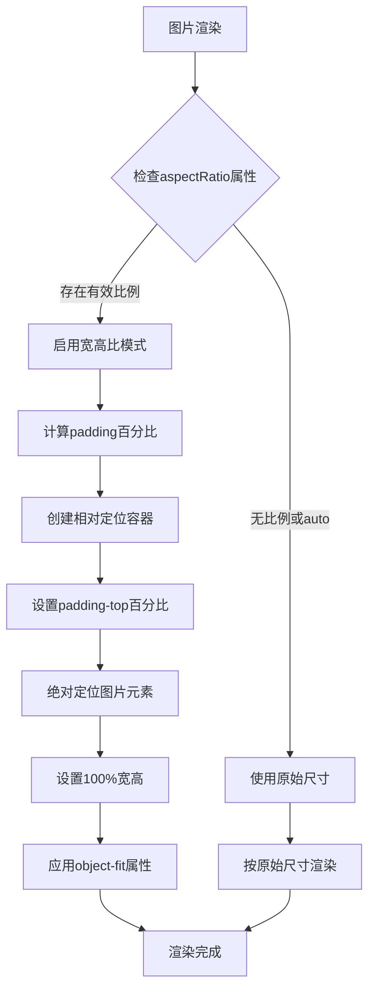

**图表来源**
- [ComponentRenderer.tsx:319-418](file://company_cms_project/frontend/src/components/ComponentRenderer.tsx#L319-L418)

### 宽高比计算公式

系统使用基于视口宽度的百分比计算方法：

| 宽高比 | 计算公式 | 百分比值 |
|--------|----------|----------|
| 1:1 | (1/1) × 100% | 100% |
| 4:3 | (3/4) × 100% | 75% |
| 16:9 | (9/16) × 100% | 56.25% |
| 3:4 | (4/3) × 100% | 133.33% |

### 图片渲染流程

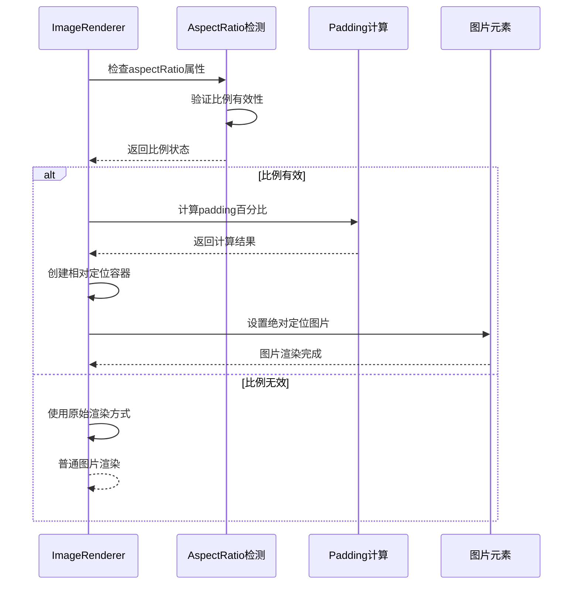

**图表来源**
- [ComponentRenderer.tsx:319-418](file://company_cms_project/frontend/src/components/ComponentRenderer.tsx#L319-L418)

**章节来源**
- [ComponentRenderer.tsx:319-418](file://company_cms_project/frontend/src/components/ComponentRenderer.tsx#L319-L418)

## 编辑器界面设计

### 三面板布局架构

页面编辑器采用经典的三面板设计，提供高效的编辑体验：

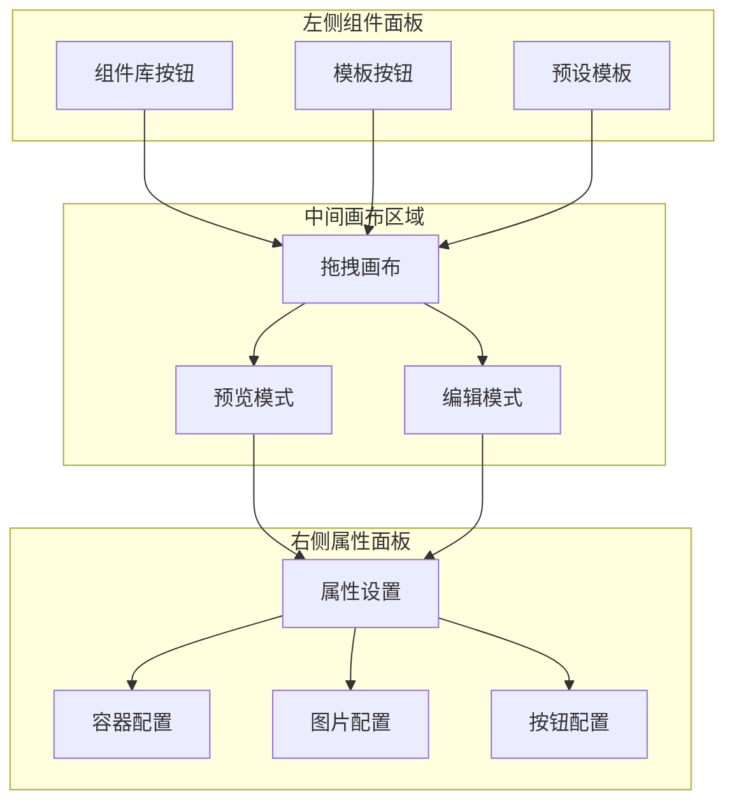

**图表来源**
- [PageEditor.tsx:1901-2067](file://company_cms_project/frontend/src/pages/PageEditor.tsx#L1901-L2067)

### 响应式布局设计

系统支持多种屏幕尺寸的自适应布局：

- **组件面板**：固定宽度200px，滚动区域
- **画布区域**：自适应剩余空间，支持垂直滚动
- **属性面板**：固定宽度280px，滚动区域
- **最小窗口**：支持1024×768分辨率

### 交互设计原则

1. **直观性**：所有操作都有明确的视觉反馈
2. **一致性**：相同功能在不同组件中保持一致的交互方式
3. **可预测性**：用户操作的结果符合预期
4. **可恢复性**：提供撤销和重做功能

**章节来源**
- [PageEditor.tsx:1901-2067](file://company_cms_project/frontend/src/pages/PageEditor.tsx#L1901-L2067)

## 数据流与状态管理

### 组件状态管理

系统采用React Hooks实现状态管理，确保数据流的清晰和可控：

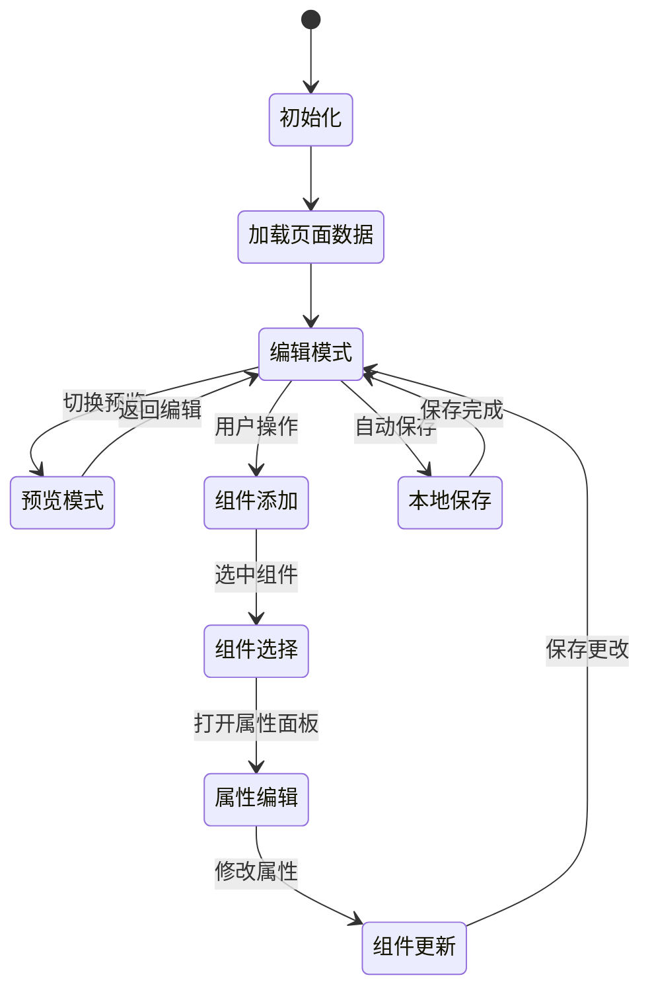

**图表来源**
- [PageEditor.tsx:192-325](file://company_cms_project/frontend/src/pages/PageEditor.tsx#L192-L325)

### 数据持久化策略

系统实现了多层次的数据持久化机制：

1. **本地存储**：使用localStorage保存草稿，防止意外关闭丢失
2. **服务器同步**：支持手动保存和自动保存到服务器
3. **版本控制**：记录最后更新时间，便于版本管理

### API交互流程

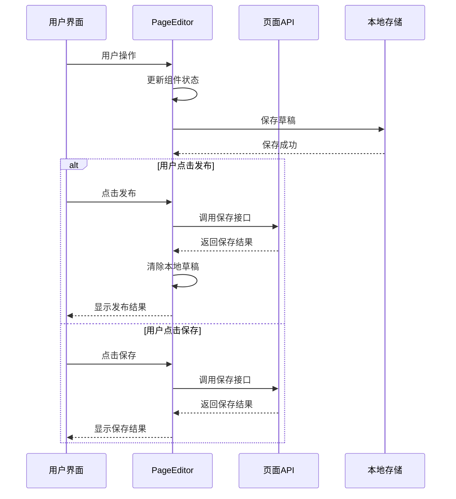

**图表来源**
- [PageEditor.tsx:426-469](file://company_cms_project/frontend/src/pages/PageEditor.tsx#L426-L469)
- [pages.ts:13-21](file://company_cms_project/frontend/src/api/pages.ts#L13-L21)

**章节来源**
- [pages.ts:1-32](file://company_cms_project/frontend/src/api/pages.ts#L1-L32)

## 性能优化策略

### 渲染性能优化

1. **虚拟滚动**：对于大量组件的场景，考虑实现虚拟滚动以提升渲染性能
2. **懒加载**：图片资源采用懒加载策略，减少初始加载时间
3. **防抖处理**：输入框的实时更新采用防抖机制，避免频繁重渲染

### 内存管理优化

1. **组件卸载清理**：确保组件卸载时清理定时器和事件监听器
2. **状态精简**：只存储必要的状态数据，避免内存泄漏
3. **缓存策略**：对计算结果进行缓存，避免重复计算

### 网络请求优化

1. **请求合并**：将多个小的API调用合并为批量请求
2. **缓存复用**：对静态数据建立缓存机制
3. **错误重试**：实现智能的错误重试机制

## 故障排除指南

### 常见问题诊断

#### 嵌套容器无法添加

**可能原因**：
1. 当前容器已达到最大嵌套深度（2层）
2. 选择了错误的组件类型
3. 状态更新异常

**解决方法**：
1. 检查当前容器的嵌套层级
2. 确认可用的组件选项
3. 刷新页面重新加载状态

#### 子组件高度不统一

**可能原因**：
1. childHeight属性设置错误
2. CSS样式冲突
3. 子组件自身的高度设置

**解决方法**：
1. 检查容器的childHeight属性值
2. 查看是否有其他CSS规则影响
3. 确认子组件的样式设置

#### 图片宽高比失效

**可能原因**：
1. aspectRatio属性值不在预设范围内
2. CSS计算错误
3. 图片加载失败

**解决方法**：
1. 确认aspectRatio属性值的有效性
2. 检查CSS计算逻辑
3. 验证图片URL的正确性

### 调试工具使用

1. **浏览器开发者工具**：检查DOM结构和CSS样式
2. **React DevTools**：监控组件状态和生命周期
3. **网络面板**：分析API请求和响应
4. **控制台日志**：查看错误信息和调试输出

**章节来源**
- [v1.5.0_2026-03-17_页面编辑器容器嵌套与尺寸统一功能.md:241-249](file://docs/v1.5.0_2026-03-17_页面编辑器容器嵌套与尺寸统一功能.md#L241-L249)

## 总结与展望

### 功能总结

v1.5.0版本成功解决了页面编辑器的两大核心问题：

1. **容器嵌套功能**：实现了最多2层的嵌套支持，为复杂页面布局提供了基础
2. **尺寸统一控制**：通过childHeight属性实现了子组件的高度统一
3. **宽高比控制**：提供了标准化的图片比例控制机制

### 技术成就

- **架构设计**：采用了清晰的分层架构，便于维护和扩展
- **用户体验**：提供了直观的拖拽式编辑体验
- **性能表现**：通过合理的优化策略保证了良好的性能
- **类型安全**：完整的TypeScript类型定义确保了代码质量

### 未来发展方向

基于本次功能的实践经验，建议后续版本重点改进：

1. **支持更深的嵌套层级**：根据实际需求考虑支持3-4层嵌套
2. **增强可视化编辑**：添加拖拽调整嵌套层级的功能
3. **扩展宽高比选项**：增加更多常用的宽高比预设
4. **性能监控**：建立完整的性能监控和分析体系
5. **移动端适配**：优化移动端的编辑体验

这次功能升级为企业网站CMS系统的页面编辑能力奠定了坚实的基础，为后续的功能扩展和性能优化提供了良好的起点。