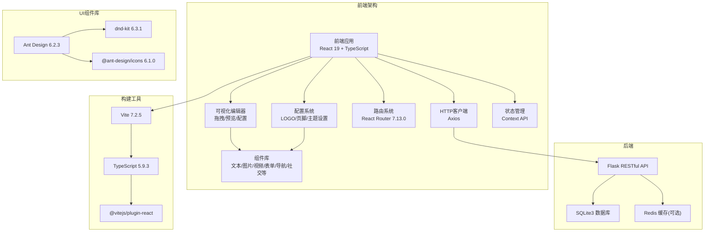
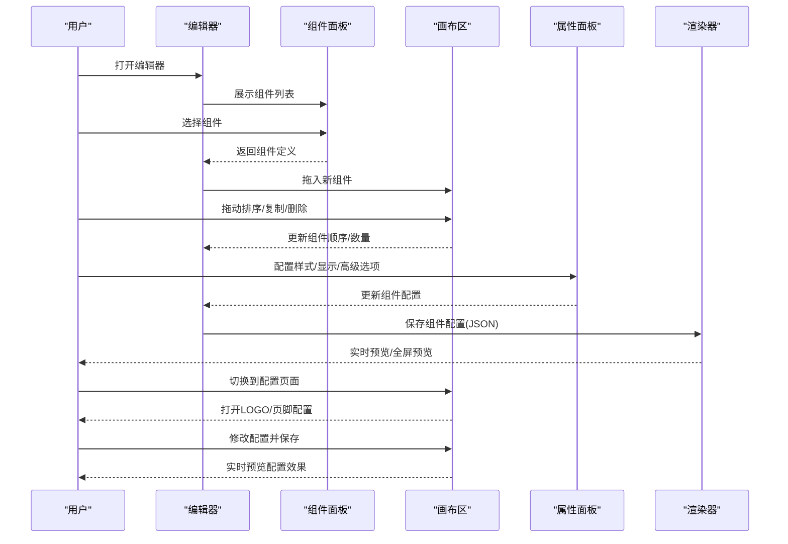
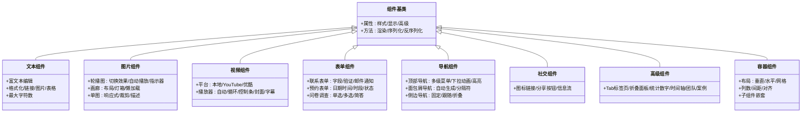
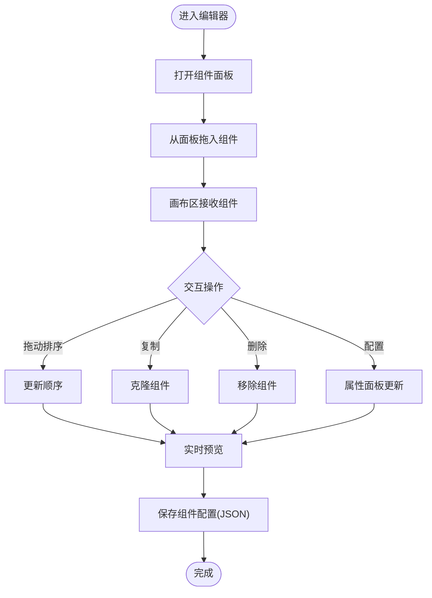
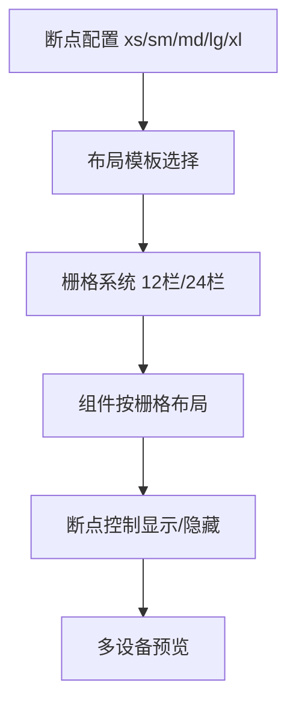
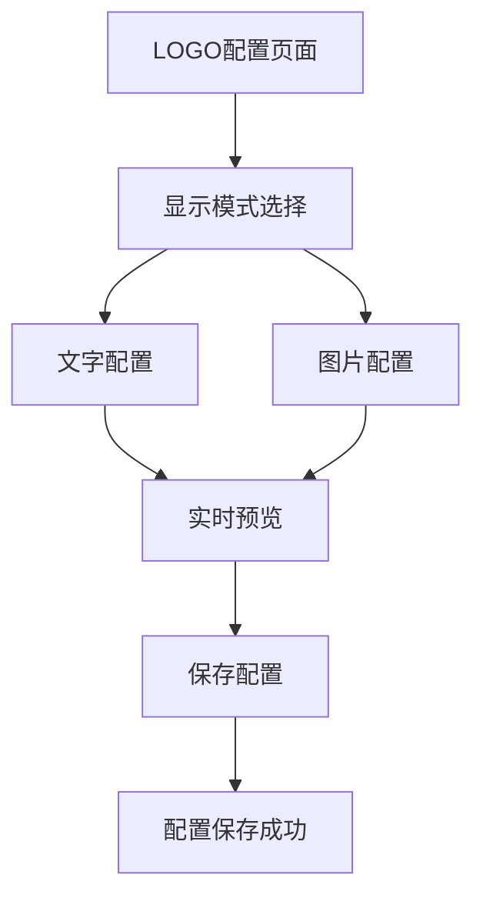
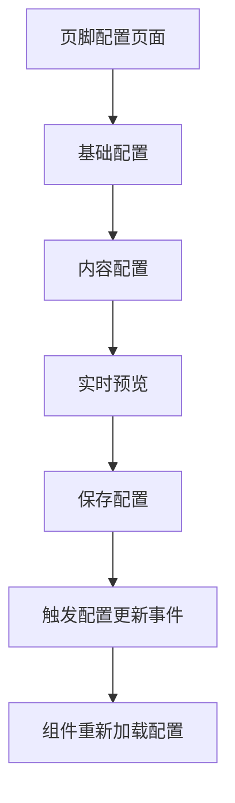
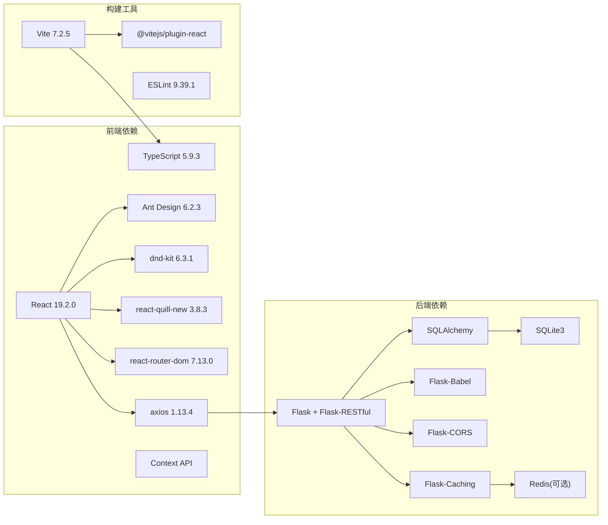

# 前端组件系统

<cite>
**本文引用的文件**
- [package.json](file://company_cms_project/frontend/package.json)
- [vite.config.ts](file://company_cms_project/frontend/vite.config.ts)
- [main.tsx](file://company_cms_project/frontend/src/main.tsx)
- [App.tsx](file://company_cms_project/frontend/src/App.tsx)
- [ComponentRenderer.tsx](file://company_cms_project/frontend/src/components/ComponentRenderer.tsx)
- [SiteFooter.tsx](file://company_cms_project/frontend/src/components/SiteFooter.tsx)
- [ThemeContext.tsx](file://company_cms_project/frontend/src/contexts/ThemeContext.tsx)
- [AdminLayout.tsx](file://company_cms_project/frontend/src/layout/AdminLayout.tsx)
- [Dashboard.tsx](file://company_cms_project/frontend/src/pages/Dashboard.tsx)
- [PageEditor.tsx](file://company_cms_project/frontend/src/pages/PageEditor.tsx)
- [LogoConfig.tsx](file://company_cms_project/frontend/src/pages/LogoConfig.tsx)
- [FooterConfig.tsx](file://company_cms_project/frontend/src/pages/FooterConfig.tsx)
- [components.ts](file://company_cms_project/frontend/src/types/components.ts)
- [menu.ts](file://company_cms_project/frontend/src/types/menu.ts)
- [templates.ts](file://company_cms_project/frontend/src/types/templates.ts)
- [theme.ts](file://company_cms_project/frontend/src/types/theme.ts)
- [request.ts](file://company_cms_project/frontend/src/utils/request.ts)
- [logo.ts](file://company_cms_project/frontend/src/api/logo.ts)
- [footer.ts](file://company_cms_project/frontend/src/api/footer.ts)
</cite>

## 更新摘要
**所做更改**
- 新增LOGO配置页面和页脚配置页面的完整前端实现
- 增强组件渲染器的动态组件渲染能力和事件通信机制
- 更新拖拽编辑器的组件配置系统，支持更丰富的配置选项
- 完善响应式布局机制和实时预览功能
- 新增媒体库集成和颜色选择器支持

## 目录
1. [简介](#简介)
2. [项目结构](#项目结构)
3. [核心组件](#核心组件)
4. [架构总览](#架构总览)
5. [组件详细分析](#组件详细分析)
6. [配置系统](#配置系统)
7. [依赖关系分析](#依赖关系分析)
8. [性能考量](#性能考量)
9. [故障排查指南](#故障排查指南)
10. [结论](#结论)
11. [附录](#附录)

## 简介
本文件面向企业网站CMS系统的前端组件系统，围绕"可视化拖拽编辑器""组件库组织结构""响应式布局机制""组件外观与交互""属性/事件/插槽/自定义选项""使用示例与演示""响应式设计与无障碍合规""状态管理与动画过渡""跨浏览器兼容与性能优化"等方面，提供系统化、可落地的文档说明。

**更新** 本版本完全重构为基于React 19 + TypeScript的全新架构，采用现代化的Vite构建工具链，集成Ant Design 6.2.3组件库，支持TypeScript严格类型检查，提供完整的TypeScript类型定义和类型安全的组件系统。新增LOGO配置和页脚配置功能，增强组件渲染器的动态渲染能力。

## 项目结构
- 前端采用React 19.2.0 + TypeScript技术栈，结合Ant Design 6.2.3、dnd-kit拖拽库、React Router 7.13.0、Axios等生态组件与工具。
- 后端采用Flask + SQLite3，提供认证、内容管理、媒体库、页面管理等API，编辑器将组件配置以JSON形式持久化，前台根据JSON渲染页面。
- 采用Vite 7.2.5作为构建工具，支持Rollup打包器，提供快速的开发体验和高效的生产构建。

**章节来源**
- [package.json:1-44](file://company_cms_project/frontend/package.json#L1-L44)
- [vite.config.ts:1-8](file://company_cms_project/frontend/vite.config.ts#L1-L8)

## 核心组件
- 页面布局组件库：单栏、双栏、三栏、网格、F型、卡片流等模板，支持12栏/24栏栅格与断点(xs/sm/md/lg/xl)。
- 组件拖拽系统：支持从面板拖入、页面内拖动排序、跨容器拖拽、复制/删除；提供可放置区域高亮、目标位置高亮、拖拽预览等反馈。
- 实时预览：编辑模式与预览模式无缝切换，支持多设备预览与全屏预览。
- 内容组件库：
  - 文本编辑器：富文本编辑、格式化、图片/视频插入、表格、超链接、代码块、最大字符数限制。
  - 图片组件：轮播图（淡入淡出、滑动、3D翻转、自动播放、指示器样式）、画廊（瀑布流/网格、灯箱、懒加载）、单图展示（响应式、裁剪/缩放、描述/水印）。
  - 视频组件：本地MP4/WebM、YouTube、优酷/腾讯视频嵌入；支持自动播放、循环播放、控制条样式、封面图、字幕。
  - 表单组件：联系表单（字段类型、验证、邮件通知、成功提示）、预约表单（日期时间选择、可用时段、状态管理）、问卷调查（单选/多选/简答、统计）。
  - 导航组件：顶部导航（横向/纵向、多级菜单、下拉动画、当前页高亮）、面包屑导航（自动生成路径、自定义分隔符）、侧边导航（固定/跟随滚动、折叠/展开）。
  - 社交媒体组件：社交图标链接、分享按钮、信息流嵌入。
  - 高级组件：Tab标签页、折叠面板、统计数字、时间轴、团队成员、客户案例/合作伙伴。
- 通用配置：样式（边距/背景/边框/阴影/动画）、显示（显示/隐藏/响应式/条件显示）、高级（自定义CSS类名/HTML属性/锚点ID）。
- **新增配置页面**：LOGO配置（文字+图片组合、颜色、尺寸、链接等）、页脚配置（高度、颜色、标题、描述、版权等）。

**章节来源**
- [ComponentRenderer.tsx](file://company_cms_project/frontend/src/components/ComponentRenderer.tsx)
- [LogoConfig.tsx](file://company_cms_project/frontend/src/pages/LogoConfig.tsx)
- [FooterConfig.tsx](file://company_cms_project/frontend/src/pages/FooterConfig.tsx)
- [components.ts](file://company_cms_project/frontend/src/types/components.ts)

## 架构总览
前端组件系统围绕"组件库 + 拖拽编辑器 + 预览渲染 + 配置系统"的闭环设计：
- 组件库：统一的组件定义与样式规范，支持通用配置与自定义扩展。
- 拖拽编辑器：左侧组件面板、中间画布区、右侧属性面板；通过dnd-kit实现组件的添加、排序、复制与删除；实时保存组件配置为JSON。
- 预览渲染：编辑器与前台共享同一套组件渲染逻辑，编辑器中的配置最终映射到前台页面。
- 配置系统：独立的配置页面，支持LOGO、页脚、主题等全局配置，实时预览和保存。

**章节来源**
- [PageEditor.tsx](file://company_cms_project/frontend/src/pages/PageEditor.tsx)
- [App.tsx:1-82](file://company_cms_project/frontend/src/App.tsx#L1-L82)

## 组件详细分析

### 组件库组织结构
- 基础组件：文本编辑器、图片组件、视频组件、表单组件、导航组件、社交媒体组件。
- 高级组件：Tab标签页、折叠面板、统计数字、时间轴、团队成员、客户案例/合作伙伴。
- 通用配置：样式配置、显示配置、高级配置，统一入口便于扩展与复用。
- **新增容器组件**：支持垂直、水平、网格布局，可配置列数、间距、对齐方式等。

**章节来源**
- [components.ts](file://company_cms_project/frontend/src/types/components.ts)
- [ComponentRenderer.tsx](file://company_cms_project/frontend/src/components/ComponentRenderer.tsx)

### 拖拽编辑器实现原理
- 组件面板：展示可拖拽组件列表，支持组件分类与搜索。
- 画布区：接收拖拽组件，支持组件排序、复制、删除、嵌套容器（简化版仅基础容器）。
- 属性面板：根据选中组件动态显示配置项（样式/显示/高级），支持即时预览。
- 拖拽反馈：可放置区域高亮、目标位置高亮、拖拽过程中的组件预览。
- 技术实现：使用dnd-kit/react-beautiful-dnd进行拖拽操作，支持多种拖拽交互模式。

**章节来源**
- [PageEditor.tsx](file://company_cms_project/frontend/src/pages/PageEditor.tsx)
- [package.json:14-26](file://company_cms_project/frontend/package.json#L14-L26)

### 响应式布局机制
- 断点设置：xs/sm/md/lg/xl，支持不同断点下的布局与组件显示/隐藏控制。
- 移动端优先：组件默认适配移动端，再逐步在更大屏幕下扩展。
- 栅格系统：支持12栏/24栏自定义栅格，组件可按栅格比例布局。
- 预览模式：支持桌面/平板/手机多设备预览，编辑时隐藏工具栏，预览时全屏。

**章节来源**
- [AdminLayout.tsx](file://company_cms_project/frontend/src/layout/AdminLayout.tsx)
- [ThemeContext.tsx](file://company_cms_project/frontend/src/contexts/ThemeContext.tsx)

### 组件外观、行为与交互
- 外观：统一的视觉风格，支持主题色、字体、间距、阴影、边框等样式配置。
- 行为：富文本编辑、图片懒加载、视频播放、表单校验、导航高亮、社交分享。
- 交互：拖拽排序、复制/删除、属性面板联动、实时预览、全屏预览。

**章节来源**
- [ComponentRenderer.tsx](file://company_cms_project/frontend/src/components/ComponentRenderer.tsx)
- [ThemeContext.tsx](file://company_cms_project/frontend/src/contexts/ThemeContext.tsx)

### 属性、事件、插槽与自定义选项
- 属性（Props/Options）：组件通用属性（样式/显示/高级）与各组件特有属性（如轮播图的切换效果、自动播放间隔、指示器样式；表单字段类型与验证规则；导航的菜单层级与高亮策略等）。
- 事件（Events）：组件生命周期事件（挂载/卸载/更新）、用户交互事件（点击/输入/拖拽）、配置变更事件（保存/撤销）。
- 插槽（Slots）：组件内容插槽（如Tab标签页的标题与内容）、占位插槽（如图片组件的占位图）。
- 自定义选项：自定义CSS类名、自定义HTML属性、锚点ID设置，便于深度定制。

**章节来源**
- [components.ts](file://company_cms_project/frontend/src/types/components.ts)
- [menu.ts](file://company_cms_project/frontend/src/types/menu.ts)

### 使用示例与实时演示
- 示例场景：首页布局（F型布局 + 轮播图 + 文本 + 导航 + 社交组件）、文章页布局（单栏 + 富文本 + 图片画廊 + 导航）、单页布局（三栏 + Tab + 折叠面板 + 统计数字）。
- 实时演示：编辑器中拖拽组件、配置属性、多设备预览，编辑完成后保存为页面配置，前台根据配置渲染页面。

**章节来源**
- [Dashboard.tsx](file://company_cms_project/frontend/src/pages/Dashboard.tsx)
- [PageEditor.tsx](file://company_cms_project/frontend/src/pages/PageEditor.tsx)

### 响应式设计指南与无障碍合规
- 响应式设计：移动端优先，断点控制组件显示/隐藏；栅格系统保证布局一致性；图片与视频自适应容器。
- 无障碍合规：语义化标签、键盘导航、焦点管理、高对比度色彩、屏幕阅读器友好（Alt文本、标题层级、可访问名称）。

**章节来源**
- [ThemeContext.tsx](file://company_cms_project/frontend/src/contexts/ThemeContext.tsx)
- [AdminLayout.tsx](file://company_cms_project/frontend/src/layout/AdminLayout.tsx)

### 状态管理、动画与过渡
- 状态管理：使用React Context API集中管理编辑器状态（组件配置、选中状态、预览模式、断点状态）。
- 动画与过渡：组件切换动画（淡入/滑入/缩放）、导航下拉动画、轮播图切换效果、折叠面板展开/收起动画。

**章节来源**
- [ThemeContext.tsx](file://company_cms_project/frontend/src/contexts/ThemeContext.tsx)
- [App.tsx:1-82](file://company_cms_project/frontend/src/App.tsx#L1-L82)

### 跨浏览器兼容性与性能优化
- 兼容性：Chrome/Firefox/Safari/Edge最新版本；移动端iOS/Android主流设备；分辨率支持1920×1080及以上。
- 性能优化：图片懒加载、响应式图片、WebP格式、CSS/JS压缩合并、关键CSS内联、异步加载非关键资源、页面缓存与静态资源缓存、CDN加速。

**章节来源**
- [package.json:12-42](file://company_cms_project/frontend/package.json#L12-L42)
- [vite.config.ts:1-8](file://company_cms_project/frontend/vite.config.ts#L1-L8)

## 配置系统

### LOGO配置系统
新增独立的LOGO配置页面，支持以下功能：
- **显示模式**：文字+图片、仅文字、仅图片三种模式切换
- **图片配置**：支持从媒体库选择图片、自定义宽高、图片间距
- **文字配置**：主文字和副标题、字体大小、颜色、粗细、字间距
- **链接配置**：点击LOGO跳转的目标页面路径
- **实时预览**：配置变化立即反映在预览区域
- **媒体库集成**：支持从媒体库选择图片，提供图片预览和选择功能

**章节来源**
- [LogoConfig.tsx](file://company_cms_project/frontend/src/pages/LogoConfig.tsx)
- [logo.ts](file://company_cms_project/frontend/src/api/logo.ts)

### 页脚配置系统
新增独立的页脚配置页面，支持以下功能：
- **基础配置**：启用/禁用、高度、背景色、文字颜色
- **内容配置**：标题、描述、版权信息
- **实时预览**：配置变化立即反映在预览区域
- **事件通信**：配置更新后通过CustomEvent通知所有组件重新加载配置

**章节来源**
- [FooterConfig.tsx](file://company_cms_project/frontend/src/pages/FooterConfig.tsx)
- [footer.ts](file://company_cms_project/frontend/src/api/footer.ts)
- [SiteFooter.tsx](file://company_cms_project/frontend/src/components/SiteFooter.tsx)

### 组件渲染器增强
组件渲染器增强了动态渲染能力和事件通信机制：
- **动态组件映射**：通过RENDERER_MAP实现组件类型到渲染器的动态映射
- **编辑模式支持**：在编辑模式下提供组件选择、删除、样式高亮等功能
- **事件通信**：支持组件间通过事件进行通信，如页脚配置更新事件
- **特殊组件处理**：对文章列表等特殊组件提供专门的处理逻辑

**章节来源**
- [ComponentRenderer.tsx](file://company_cms_project/frontend/src/components/ComponentRenderer.tsx)

## 依赖关系分析
- 前端技术栈：React 19.2.0 + TypeScript；UI库Ant Design 6.2.3；拖拽库dnd-kit 6.3.1；富文本Quill 3.8.3；状态管理Context API；路由React Router 7.13.0；HTTP客户端Axios。
- 构建工具：Vite 7.2.5 + Rollup打包器；TypeScript 5.9.3；ESLint代码质量检查。
- 后端技术栈：Flask + Flask-RESTful + SQLAlchemy + Flask-Babel + Flask-CORS + Flask-Caching；数据库SQLite3；可选Redis缓存；Nginx反向代理与静态资源服务。

**章节来源**
- [package.json:12-42](file://company_cms_project/frontend/package.json#L12-L42)
- [main.tsx:1-11](file://company_cms_project/frontend/src/main.tsx#L1-L11)

## 性能考量
- 页面加载：关键资源内联、异步加载非关键资源、CDN加速、浏览器缓存策略。
- 图片优化：懒加载、响应式srcset、WebP格式、自动压缩。
- 缓存策略：页面缓存（Redis）、数据缓存（查询结果/API响应）、静态资源缓存（Expires/Cache-Control）。
- 数据库优化：索引优化、避免N+1查询、连接池配置、慢查询日志。
- 并发与稳定性：Gunicorn/Waitress进程管理、Nginx负载均衡、错误追踪与日志记录。

**章节来源**
- [request.ts](file://company_cms_project/frontend/src/utils/request.ts)
- [package.json:12-42](file://company_cms_project/frontend/package.json#L12-L42)

## 故障排查指南
- 编辑器拖拽异常：检查dnd-kit版本与浏览器兼容性；确认组件面板与画布区的拖拽回调是否正确绑定。
- 组件渲染错误：核对组件配置JSON结构；检查渲染器对配置的解析与回退逻辑。
- 预览不一致：确认编辑器与前台共享的组件渲染逻辑；检查断点与样式覆盖。
- 配置页面问题：检查API请求是否正确返回数据；确认颜色选择器的格式转换；验证媒体库图片加载。
- 性能问题：启用图片懒加载与关键CSS内联；检查缓存配置与CDN；定位慢查询与阻塞资源。
- 部署问题：Windows环境使用Waitress；Nginx代理静态资源与API；确保SSL/TLS配置正确。

**章节来源**
- [PageEditor.tsx](file://company_cms_project/frontend/src/pages/PageEditor.tsx)
- [App.tsx:18-21](file://company_cms_project/frontend/src/App.tsx#L18-L21)

## 结论
本前端组件系统以"可视化拖拽编辑器"为核心，围绕组件库、响应式布局与实时预览构建了完整的页面配置与渲染闭环。通过统一的组件定义与通用配置，配合dnd-kit拖拽库与Context API状态管理，实现了易用、可扩展且性能友好的编辑体验。新增的LOGO配置和页脚配置功能进一步完善了系统的配置能力，支持更丰富的站点个性化需求。结合后端RESTful API与SQLite3/Redis，系统具备良好的部署与运维特性，适合中小企业的快速上线与迭代。

## 附录
- 开发计划与里程碑：按MVP策略推进，分阶段完成认证、管理后台、简化版编辑器与前台展示，最终测试部署与交付。
- 技术选型与兼容性：前端React 19.2.0 + TypeScript技术栈，后端Flask + SQLite3，Vite 7.2.5构建，支持主流浏览器与移动端设备。
- 后续优化建议：组件库扩展（轮播图、Tab、视频等）、多语言支持、高级SEO、Redis缓存、CDN配置、评论系统、搜索优化等。

**章节来源**
- [App.tsx:1-82](file://company_cms_project/frontend/src/App.tsx#L1-L82)
- [ThemeContext.tsx](file://company_cms_project/frontend/src/contexts/ThemeContext.tsx)