# 布局系统

<cite>
**本文档引用的文件**
- [企业网站CMS系统开发需求文档.ini](file://企业网站CMS系统开发需求文档.ini)
- [企业网站CMS系统详细需求文档.md](file://企业网站CMS系统详细需求文档.md)
- [开发计划表_2月4日-2月12日.md](file://开发计划表_2月4日-2月12日.md)
</cite>

## 目录
1. [简介](#简介)
2. [项目结构](#项目结构)
3. [核心组件](#核心组件)
4. [架构概览](#架构概览)
5. [详细组件分析](#详细组件分析)
6. [依赖关系分析](#依赖关系分析)
7. [性能考虑](#性能考虑)
8. [故障排除指南](#故障排除指南)
9. [结论](#结论)

## 简介

企业网站CMS系统采用轻量级架构，支持可视化拖拽配置，提供直观的布局编辑体验。系统的核心功能包括页面布局组件库、拖拽布局配置、实时预览功能和响应式布局支持。

该系统采用前后端分离架构，前端使用React/Vue技术栈，后端提供RESTful API，支持纯HTML模板渲染和SPA单页应用两种模式。

## 项目结构

基于开发计划表，项目采用模块化的文件组织结构：

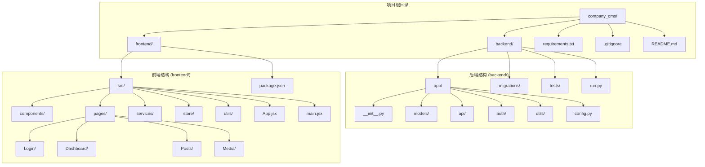

**图表来源**
- [开发计划表_2月4日-2月12日.md](file://开发计划表_2月4日-2月12日.md#L92-L105)
- [开发计划表_2月4日-2月12日.md](file://开发计划表_2月4日-2月12日.md#L263-L279)

**章节来源**
- [开发计划表_2月4日-2月12日.md](file://开发计划表_2月4日-2月12日.md#L75-L83)
- [开发计划表_2月4日-2月12日.md](file://开发计划表_2月4日-2月12日.md#L92-L105)

## 核心组件

### 布局系统架构

布局系统采用模块化设计，主要包含以下核心组件：

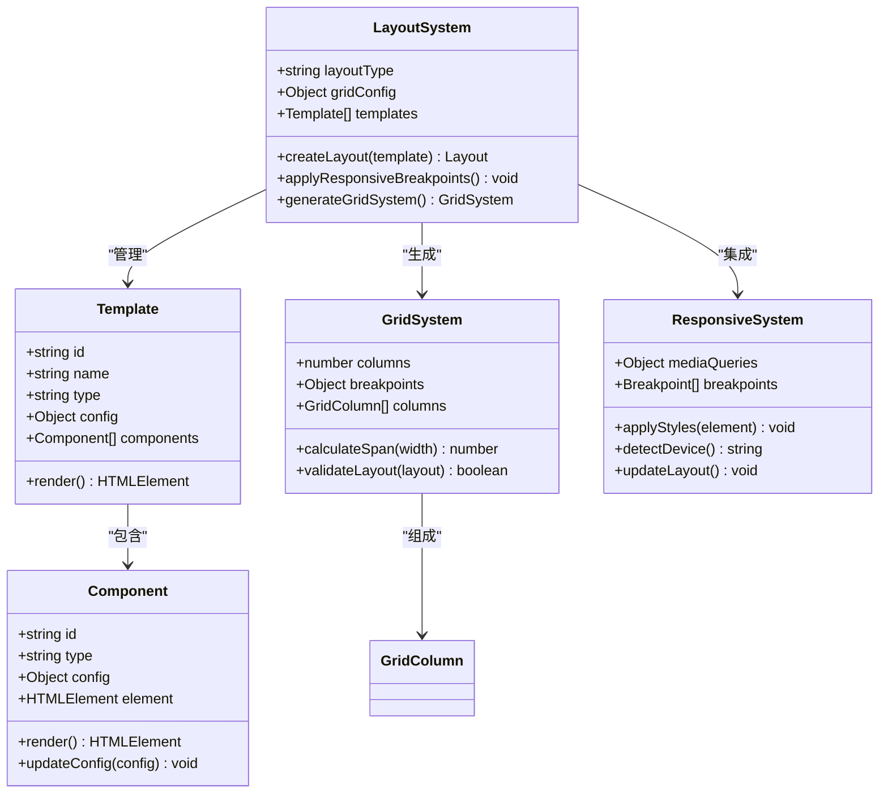

**图表来源**
- [企业网站CMS系统详细需求文档.md](file://企业网站CMS系统详细需求文档.md#L65-L103)

### 栅格系统设计

系统支持两种栅格系统配置：

#### 12栏栅格系统
- **基础列宽**: 1/12宽度
- **断点设置**: xs(≤576px), sm(≥576px), md(≥768px), lg(≥992px), xl(≥1200px)
- **间距计算**: 16px基础间距，支持0.25倍数递增
- **对齐方式**: 左对齐、居中、右对齐、两端对齐

#### 24栏栅格系统  
- **基础列宽**: 1/24宽度
- **断点设置**: 同12栏系统
- **间距计算**: 8px基础间距，支持0.5倍数递增
- **对齐方式**: 同上

**章节来源**
- [企业网站CMS系统详细需求文档.md](file://企业网站CMS系统详细需求文档.md#L68-L77)

## 架构概览

### 系统架构设计

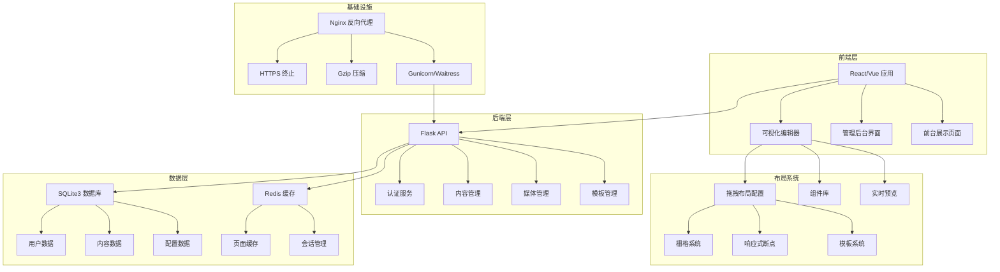

**图表来源**
- [企业网站CMS系统详细需求文档.md](file://企业网站CMS系统详细需求文档.md#L22-L57)
- [开发计划表_2月4日-2月12日.md](file://开发计划表_2月4日-2月12日.md#L440-L506)

### 响应式布局实现

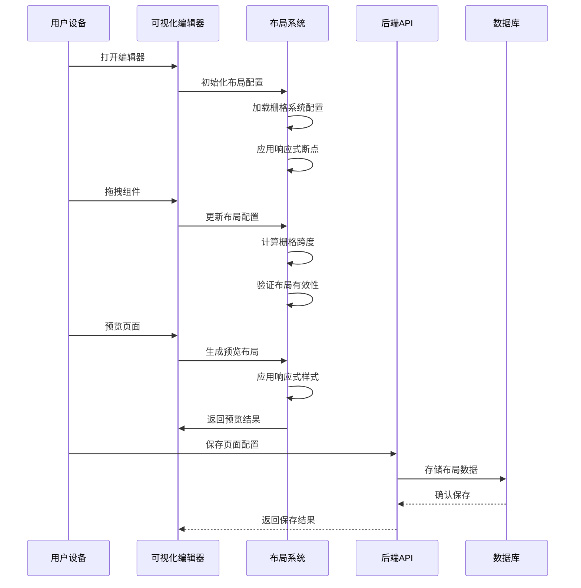

**图表来源**
- [企业网站CMS系统详细需求文档.md](file://企业网站CMS系统详细需求文档.md#L65-L103)
- [开发计划表_2月4日-2月12日.md](file://开发计划表_2月4日-2月12日.md#L371-L394)

## 详细组件分析

### 拖拽布局配置系统

#### 核心功能模块

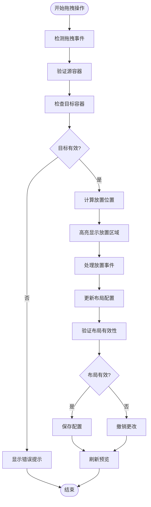

**图表来源**
- [企业网站CMS系统详细需求文档.md](file://企业网站CMS系统详细需求文档.md#L79-L92)

#### 组件拖拽系统实现

系统支持多种拖拽操作：
- **组件拖拽**: 在页面内拖动组件进行排序
- **跨容器拖拽**: 从组件面板拖入新组件
- **组件复制/删除**: 支持组件的复制和删除操作

**章节来源**
- [企业网站CMS系统详细需求文档.md](file://企业网站CMS系统详细需求文档.md#L79-L92)

### 栅格系统实现

#### 12栏栅格系统配置

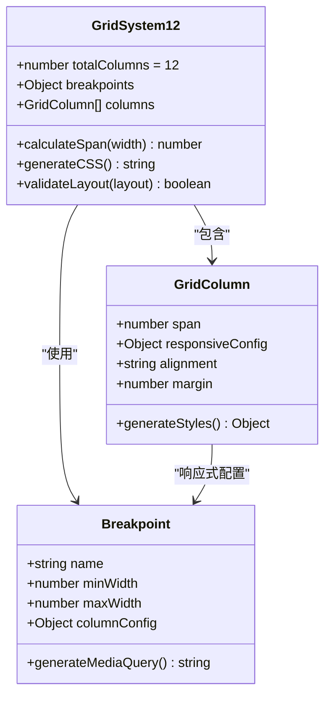

**图表来源**
- [企业网站CMS系统详细需求文档.md](file://企业网站CMS系统详细需求文档.md#L76-L77)

#### 24栏栅格系统配置

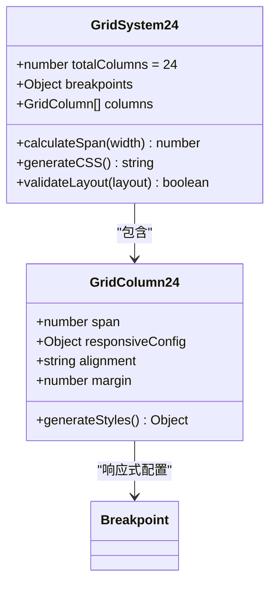

**图表来源**
- [企业网站CMS系统详细需求文档.md](file://企业网站CMS系统详细需求文档.md#L76-L77)

### 响应式断点系统

#### 断点配置

系统采用移动端优先的设计原则，断点设置如下：

| 断点名称 | 最小宽度 | 最大宽度 | 用途 |
|---------|---------|---------|------|
| xs | 0px | 575px | 超小屏幕(手机) |
| sm | 576px | 767px | 小屏幕(小平板) |
| md | 768px | 991px | 中等屏幕(大平板) |
| lg | 992px | 1199px | 大屏幕(桌面) |
| xl | 1200px | ∞ | 超大屏幕(大桌面) |

#### 媒体查询实现

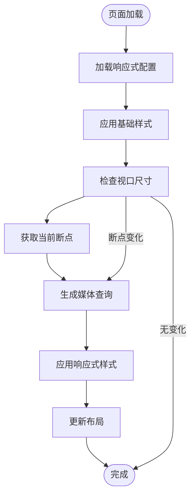

**图表来源**
- [企业网站CMS系统详细需求文档.md](file://企业网站CMS系统详细需求文档.md#L99-L103)

**章节来源**
- [企业网站CMS系统详细需求文档.md](file://企业网站CMS系统详细需求文档.md#L99-L103)

### 布局模板系统

#### 模板类型

系统提供多种预置布局模板：

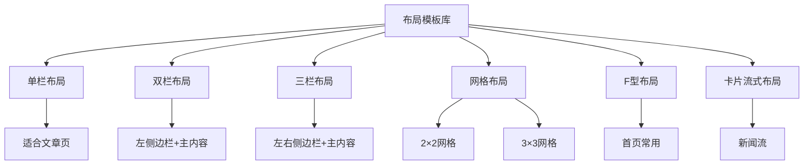

**图表来源**
- [企业网站CMS系统详细需求文档.md](file://企业网站CMS系统详细需求文档.md#L68-L76)

#### 模板配置方法

每个模板都有特定的配置选项：
- **单栏布局**: 适合文章页，内容居中显示
- **双栏布局**: 左侧边栏+主内容，适合导航较多的页面
- **三栏布局**: 左右侧边栏+主内容，适合复杂内容页面
- **网格布局**: 支持2×2到3×3的网格排列
- **F型布局**: 首页常用，符合用户阅读习惯
- **卡片流式布局**: 适合内容列表和产品展示

**章节来源**
- [企业网站CMS系统详细需求文档.md](file://企业网站CMS系统详细需求文档.md#L68-L76)

### 组件通用配置

#### 样式配置

系统提供全面的样式配置选项：

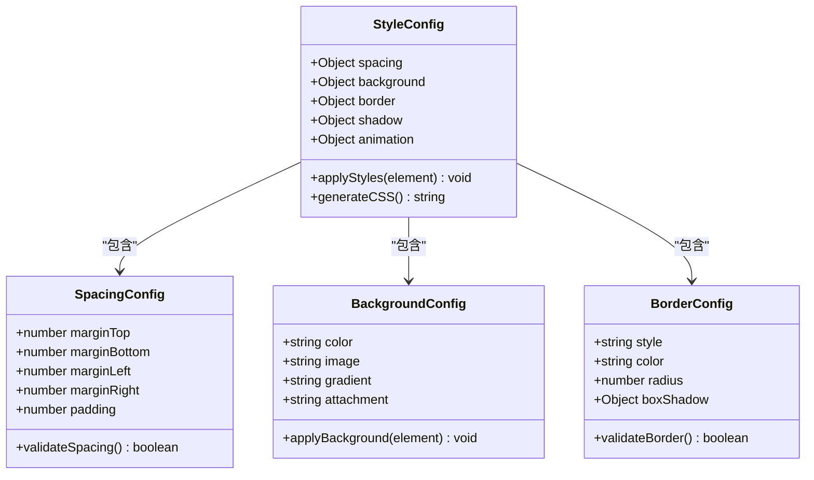

**图表来源**
- [企业网站CMS系统详细需求文档.md](file://企业网站CMS系统详细需求文档.md#L216-L232)

#### 显示配置

- **显示/隐藏**: 支持组件的显示和隐藏控制
- **响应式显示**: 基于断点的显示控制
- **条件显示**: 基于用户状态等条件的显示控制

**章节来源**
- [企业网站CMS系统详细需求文档.md](file://企业网站CMS系统详细需求文档.md#L216-L232)

## 依赖关系分析

### 技术栈依赖

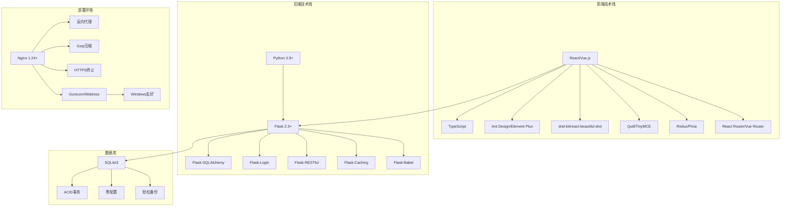

**图表来源**
- [企业网站CMS系统详细需求文档.md](file://企业网站CMS系统详细需求文档.md#L595-L628)
- [企业网站CMS系统详细需求文档.md](file://企业网站CMS系统详细需求文档.md#L555-L594)

### 组件间依赖关系

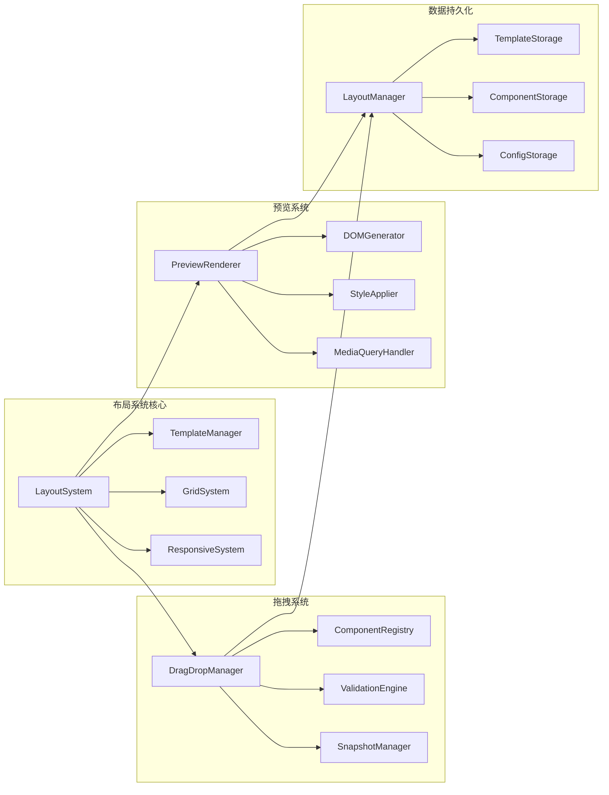

**图表来源**
- [开发计划表_2月4日-2月12日.md](file://开发计划表_2月4日-2月12日.md#L371-L394)

**章节来源**
- [开发计划表_2月4日-2月12日.md](file://开发计划表_2月4日-2月12日.md#L371-L394)

## 性能考虑

### 缓存策略

系统采用多层次缓存策略：

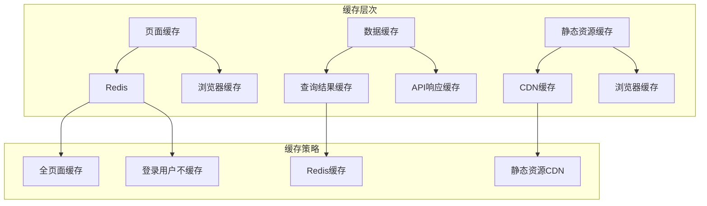

**图表来源**
- [企业网站CMS系统详细需求文档.md](file://企业网站CMS系统详细需求文档.md#L514-L548)

### 性能优化措施

1. **页面缓存**: 使用Redis实现全页面缓存，支持缓存预热和失效策略
2. **数据缓存**: 缓存数据库查询结果和API响应
3. **静态资源优化**: 支持CDN加速，使用Gzip压缩
4. **图片优化**: 支持WebP格式，实现响应式图片和懒加载
5. **关键CSS内联**: 提升首屏渲染性能

**章节来源**
- [企业网站CMS系统详细需求文档.md](file://企业网站CMS系统详细需求文档.md#L514-L548)

### 动态布局生成机制

系统支持动态布局生成，通过JSON配置实现：

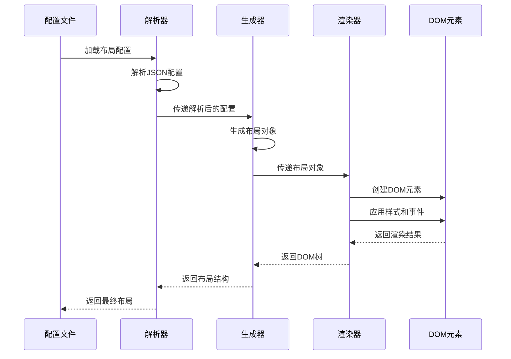

**图表来源**
- [开发计划表_2月4日-2月12日.md](file://开发计划表_2月4日-2月12日.md#L381-L394)

## 故障排除指南

### 常见问题及解决方案

#### 布局显示异常

**问题**: 组件在某些断点下显示异常
**解决方案**: 
1. 检查断点配置是否正确
2. 验证栅格跨度计算
3. 确认媒体查询应用顺序

#### 拖拽功能失效

**问题**: 组件拖拽功能无法使用
**解决方案**:
1. 检查拖拽库依赖是否正确安装
2. 验证拖拽事件监听器
3. 确认拖拽状态管理

#### 响应式样式冲突

**问题**: 响应式样式相互冲突
**解决方案**:
1. 检查CSS优先级
2. 验证媒体查询顺序
3. 确认断点边界值

**章节来源**
- [开发计划表_2月4日-2月12日.md](file://开发计划表_2月4日-2月12日.md#L589-L625)

### 性能问题诊断

#### 页面加载缓慢

**诊断步骤**:
1. 检查网络请求时间
2. 分析静态资源加载
3. 监控数据库查询性能

**优化建议**:
1. 启用缓存机制
2. 压缩静态资源
3. 实现图片懒加载

#### 内存泄漏问题

**诊断方法**:
1. 监控内存使用情况
2. 检查事件监听器清理
3. 验证组件生命周期管理

**预防措施**:
1. 正确清理DOM事件
2. 及时销毁定时器
3. 管理好组件状态

## 结论

企业网站CMS系统的布局系统是一个功能完整、架构清晰的可视化编辑解决方案。系统采用模块化设计，支持多种布局模板和响应式设计，能够满足企业官网的各种布局需求。

### 主要优势

1. **灵活性**: 支持12栏和24栏栅格系统，适应不同布局需求
2. **易用性**: 提供直观的拖拽式编辑体验
3. **响应式**: 完整的响应式断点支持，移动端优先设计
4. **性能**: 多层次缓存策略，优化页面加载性能
5. **可扩展**: 模块化架构，便于功能扩展和定制

### 技术特色

- **可视化编辑**: 基于成熟的拖拽库实现
- **模板系统**: 预置多种布局模板，支持自定义
- **响应式设计**: 移动端优先，支持多设备适配
- **性能优化**: 缓存策略、资源优化、CDN支持
- **安全可靠**: 基于Flask的安全架构，支持权限控制

该布局系统为企业网站的快速搭建和灵活配置提供了强有力的技术支撑，降低了技术门槛，提升了网站管理效率。