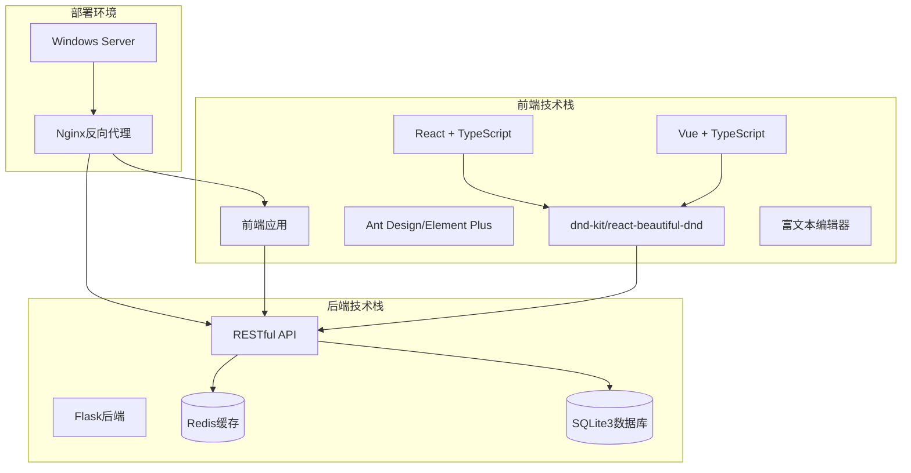
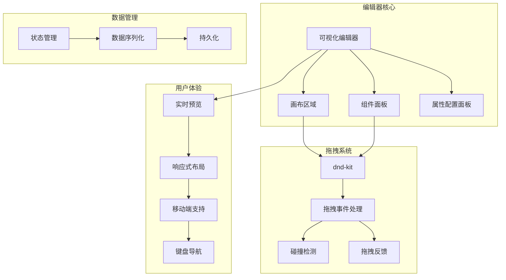
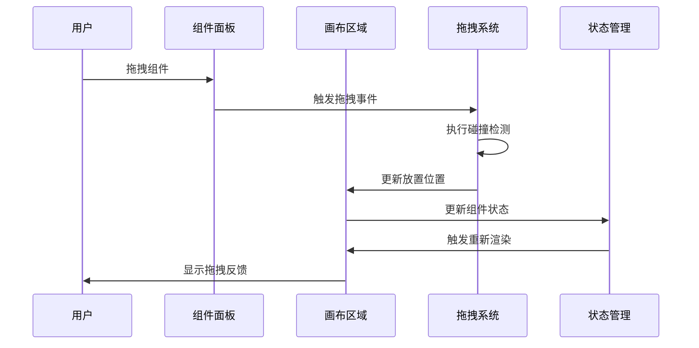
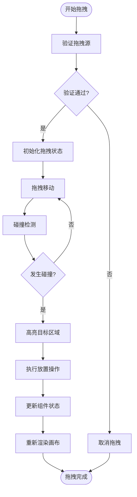
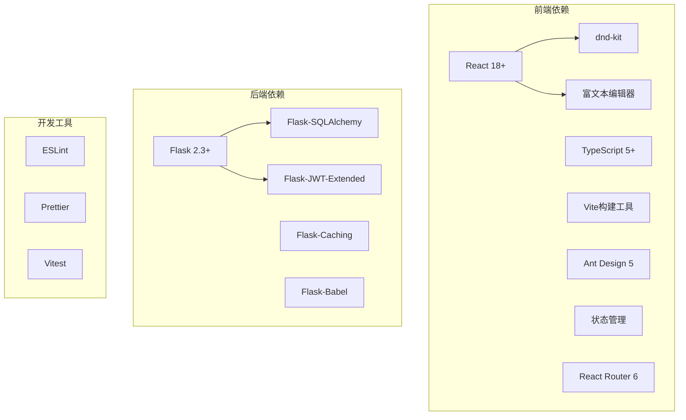
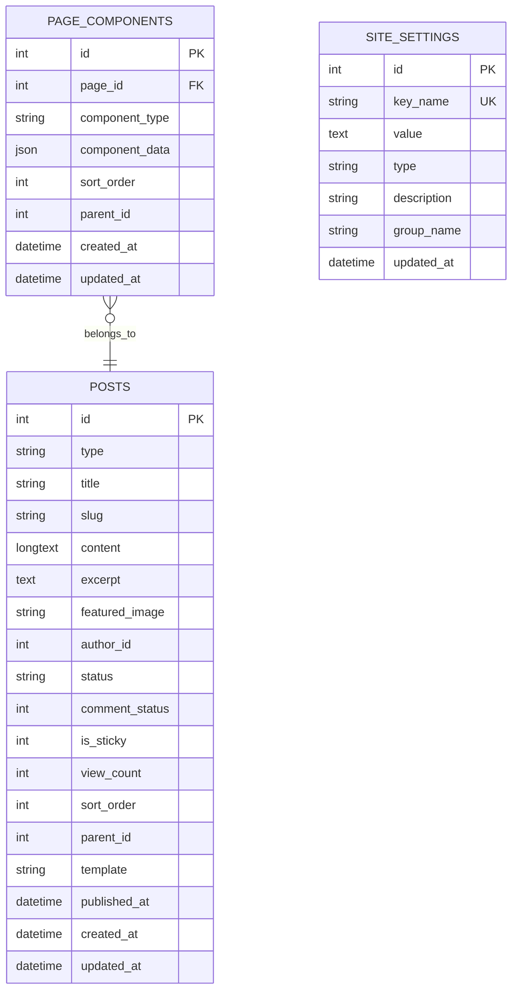

# 拖拽编辑器

<cite>
**本文档引用的文件**
- [企业网站CMS系统开发需求文档.ini](file://企业网站CMS系统开发需求文档.ini)
- [企业网站CMS系统详细需求文档.md](file://企业网站CMS系统详细需求文档.md)
</cite>

## 目录
1. [简介](#简介)
2. [项目结构](#项目结构)
3. [核心组件](#核心组件)
4. [架构总览](#架构总览)
5. [详细组件分析](#详细组件分析)
6. [依赖关系分析](#依赖关系分析)
7. [性能考虑](#性能考虑)
8. [故障排除指南](#故障排除指南)
9. [结论](#结论)
10. [附录](#附录)

## 简介
本项目旨在开发一套企业官网内容管理系统（CMS），其中可视化拖拽编辑器是核心功能模块之一。该编辑器支持组件拖拽布局配置、实时预览、响应式布局等功能，采用前后端分离架构，前端使用React/Vue技术栈，后端提供RESTful API。

## 项目结构
基于需求文档分析，项目采用前后端分离架构，主要分为以下几个部分：

**图表来源**
- [企业网站CMS系统详细需求文档.md](file://企业网站CMS系统详细需求文档.md#L22-L57)
- [企业网站CMS系统详细需求文档.md](file://企业网站CMS系统详细需求文档.md#L595-L622)

**章节来源**
- [企业网站CMS系统详细需求文档.md](file://企业网站CMS系统详细需求文档.md#L22-L57)
- [企业网站CMS系统详细需求文档.md](file://企业网站CMS系统详细需求文档.md#L595-L622)

## 核心组件
根据需求文档，拖拽编辑器包含以下核心组件：

### 拖拽布局配置系统
- **页面布局组件库**：预置10+种布局模板（单栏、双栏、三栏等）
- **组件拖拽系统**：支持组件自由拖拽、排序、删除
- **实时预览功能**：编辑时实时显示效果
- **响应式布局**：自动适配不同屏幕尺寸

### 内容组件库
- **文本编辑器组件**：富文本编辑，支持格式化、图片插入
- **图片组件**：支持轮播图、画廊、单图展示
- **视频组件**：嵌入视频播放器
- **表单组件**：联系表单、预约表单等
- **导航组件**：菜单导航、面包屑导航
- **社交媒体组件**：社交链接、分享按钮

**章节来源**
- [企业网站CMS系统详细需求文档.md](file://企业网站CMS系统详细需求文档.md#L65-L103)
- [企业网站CMS系统详细需求文档.md](file://企业网站CMS系统详细需求文档.md#L104-L232)

## 架构总览
拖拽编辑器采用模块化设计，各组件职责清晰：

**图表来源**
- [企业网站CMS系统详细需求文档.md](file://企业网站CMS系统详细需求文档.md#L65-L103)
- [企业网站CMS系统详细需求文档.md](file://企业网站CMS系统详细需求文档.md#L595-L622)

## 详细组件分析

### 拖拽系统实现

#### 拖拽库集成
项目支持多种拖拽库集成：
- **React**: dnd-kit / react-beautiful-dnd
- **Vue**: vue-draggable-plus

**图表来源**
- [企业网站CMS系统详细需求文档.md](file://企业网站CMS系统详细需求文档.md#L89-L91)

#### 拖拽事件处理流程
拖拽操作遵循完整的生命周期：

**图表来源**
- [企业网站CMS系统详细需求文档.md](file://企业网站CMS系统详细需求文档.md#L79-L88)

#### 拖拽容器配置
- **组件面板容器**：左侧固定宽度，支持垂直滚动
- **画布容器**：中间弹性宽度，支持自适应缩放
- **属性配置容器**：右侧固定宽度，支持折叠展开

#### 拖拽约束条件
- **跨容器拖拽**：支持从组件面板拖入画布
- **内部排序**：支持画布内组件重新排序
- **边界检测**：防止组件拖出可视区域
- **嵌套限制**：根据组件类型限制嵌套关系

**章节来源**
- [企业网站CMS系统详细需求文档.md](file://企业网站CMS系统详细需求文档.md#L79-L91)

### 组件交互机制

#### 组件面板系统
组件面板包含预置的10+种布局模板：
- 单栏布局（适合文章页）
- 双栏布局（左侧边栏+主内容）
- 三栏布局（左右侧边栏+主内容）
- 网格布局（2×2, 3×3等）
- F型布局（首页常用）
- 卡片流式布局

#### 画布区域设计
- **实时预览**：编辑模式与预览模式无缝切换
- **多设备预览**：桌面/平板/手机预览
- **全屏预览**：支持全屏编辑模式
- **响应式断点**：支持xs/sm/md/lg/xl断点

#### 属性配置面板
- **样式配置**：边距、背景、边框、阴影、动画
- **显示配置**：显示/隐藏、响应式控制、条件显示
- **高级配置**：自定义CSS类名、HTML属性、锚点ID

**章节来源**
- [企业网站CMS系统详细需求文档.md](file://企业网站CMS系统详细需求文档.md#L68-L102)

### 用户体验设计

#### 拖拽反馈系统
- **实时显示可放置区域**：拖拽过程中高亮显示目标位置
- **组件预览**：拖拽时显示组件预览效果
- **视觉反馈**：拖拽过程中的视觉引导和状态指示

#### 响应式布局支持
- **自定义栅格系统**：支持12栏/24栏栅格
- **断点设置**：xs/sm/md/lg/xl响应式断点
- **移动端优先**：移动端优先的设计理念

#### 键盘导航辅助
- **键盘快捷键**：支持键盘操作组件
- **焦点管理**：良好的键盘焦点导航
- **无障碍支持**：符合WCAG标准的无障碍设计

**章节来源**
- [企业网站CMS系统详细需求文档.md](file://企业网站CMS系统详细需求文档.md#L85-L102)

## 依赖关系分析

### 技术栈依赖

**图表来源**
- [企业网站CMS系统详细需求文档.md](file://企业网站CMS系统详细需求文档.md#L595-L622)
- [企业网站CMS系统详细需求文档.md](file://企业网站CMS系统详细需求文档.md#L555-L594)

### 数据流依赖

**图表来源**
- [企业网站CMS系统详细需求文档.md](file://企业网站CMS系统详细需求文档.md#L863-L889)

**章节来源**
- [企业网站CMS系统详细需求文档.md](file://企业网站CMS系统详细需求文档.md#L555-L594)
- [企业网站CMS系统详细需求文档.md](file://企业网站CMS系统详细需求文档.md#L863-L889)

## 性能考虑

### 拖拽性能优化策略
基于需求文档中的技术风险分析，项目制定了以下性能优化策略：

#### 虚拟滚动优化
- **长列表优化**：使用虚拟滚动技术优化大量组件的渲染性能
- **懒加载机制**：组件按需加载，减少初始渲染负担
- **组件数量限制**：限制单页组件数量，避免性能问题

#### 缓存策略
- **状态缓存**：使用Redis缓存编辑器状态
- **组件缓存**：缓存组件配置和样式
- **API响应缓存**：缓存常用的API响应数据

#### 性能监控
- **拖拽性能监控**：监控拖拽操作的响应时间
- **内存使用监控**：监控编辑器的内存使用情况
- **渲染性能分析**：分析组件渲染的性能瓶颈

**章节来源**
- [企业网站CMS系统详细需求文档.md](file://企业网站CMS系统详细需求文档.md#L1877-L1884)
- [企业网站CMS系统详细需求文档.md](file://企业网站CMS系统详细需求文档.md#L521-L548)

### 移动端触摸支持
- **触摸事件处理**：支持移动端触摸拖拽操作
- **手势识别**：识别常见的拖拽手势
- **响应式适配**：自动适配不同屏幕尺寸

### 键盘导航辅助
- **键盘快捷键**：支持键盘操作组件
- **焦点管理**：良好的键盘焦点导航
- **无障碍支持**：符合WCAG标准的无障碍设计

## 故障排除指南

### 常见拖拽问题
1. **拖拽不响应**
   - 检查拖拽库是否正确初始化
   - 验证组件是否具有正确的拖拽属性
   - 确认事件监听器是否正常工作

2. **碰撞检测异常**
   - 检查容器的边界设置
   - 验证组件的尺寸计算
   - 确认CSS样式是否影响定位

3. **性能问题**
   - 实施虚拟滚动优化
   - 减少不必要的重渲染
   - 使用防抖和节流技术

### 状态管理问题
- **状态同步**：确保编辑器状态与后端数据同步
- **数据一致性**：验证组件数据的完整性
- **回滚机制**：实现撤销/重做功能

**章节来源**
- [企业网站CMS系统详细需求文档.md](file://企业网站CMS系统详细需求文档.md#L1877-L1884)

## 结论
本拖拽编辑器项目基于成熟的技术栈和清晰的架构设计，实现了企业官网所需的可视化编辑功能。通过合理的性能优化策略和用户体验设计，能够满足中小企业的网站管理需求。项目采用MVP策略，在8天的开发周期内完成了核心功能的实现，为后续的功能扩展奠定了坚实的基础。

## 附录

### 开发里程碑
项目按照严格的里程碑计划推进：
- **阶段一**：需求分析和设计（2周）
- **阶段二**：核心功能开发（6周）
- **阶段三**：可视化编辑器开发（4周）
- **阶段四**：测试和优化（2周）
- **阶段五**：部署和培训（1周）

### 技术选型说明
- **前端框架**：React/Vue.js + TypeScript
- **UI库**：Ant Design/Element Plus
- **拖拽库**：dnd-kit/react-beautiful-dnd
- **富文本**：Quill.js/TinyMCE
- **状态管理**：Redux Toolkit/Pinia

### 部署环境
- **服务器**：Windows Server 2019/2022
- **Web服务器**：Nginx 1.24+
- **数据库**：SQLite3（可选Redis缓存）
- **进程管理**：NSSM服务管理器

**章节来源**
- [企业网站CMS系统详细需求文档.md](file://企业网站CMS系统详细需求文档.md#L153-L179)
- [企业网站CMS系统详细需求文档.md](file://企业网站CMS系统详细需求文档.md#L595-L622)
- [企业网站CMS系统开发需求文档.ini](file://企业网站CMS系统开发需求文档.ini#L70-L91)