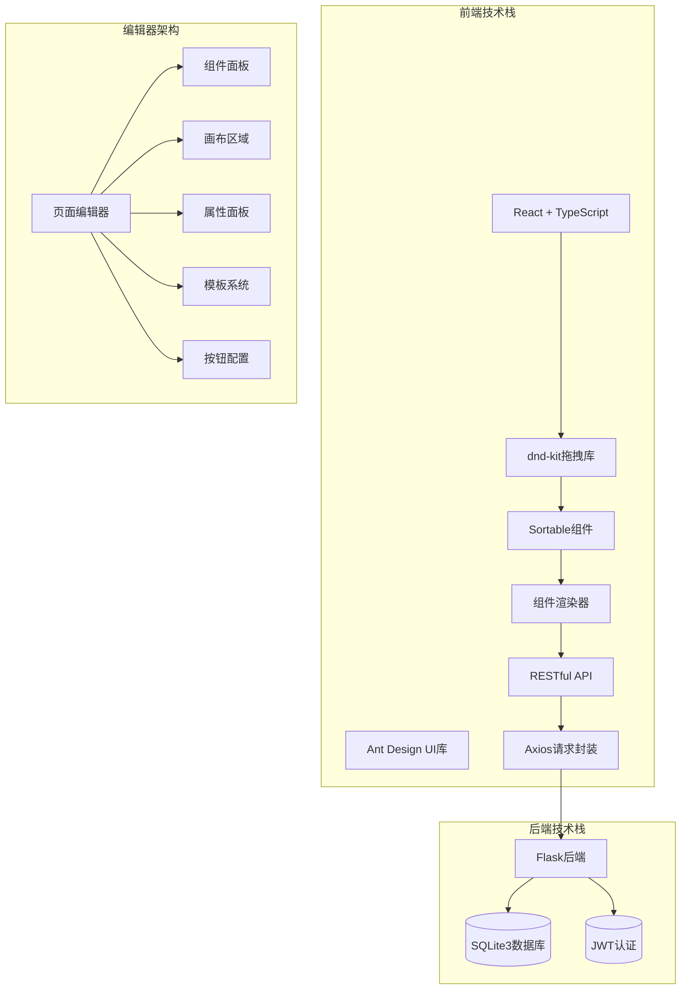
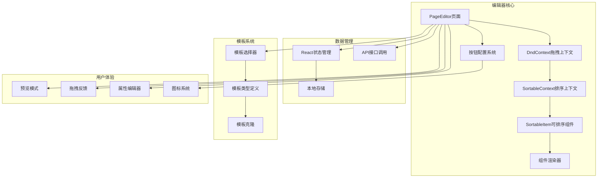
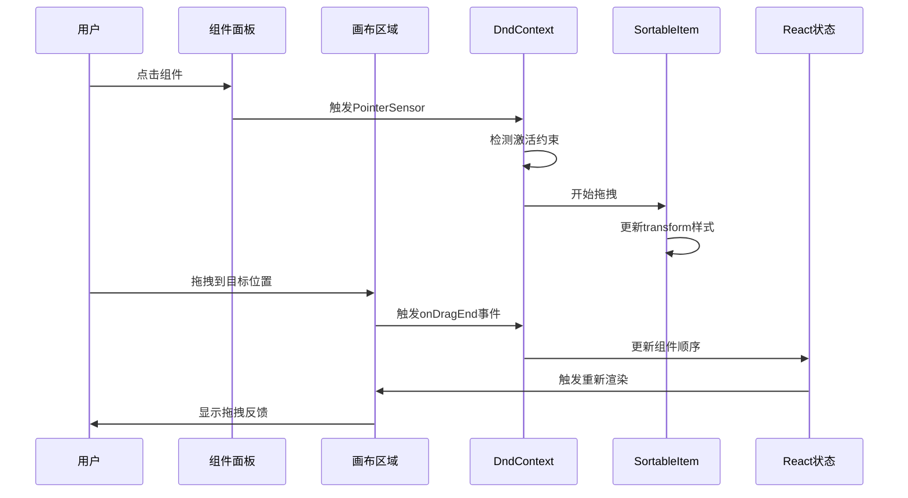
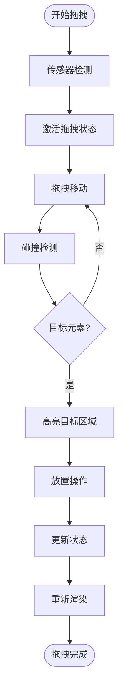
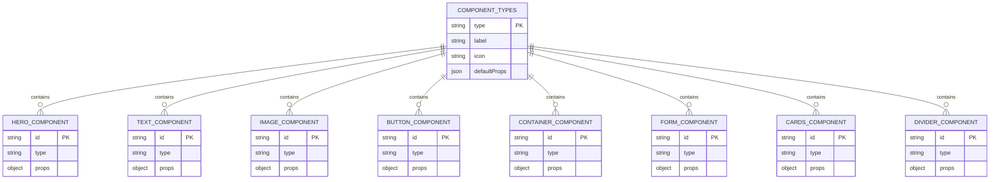
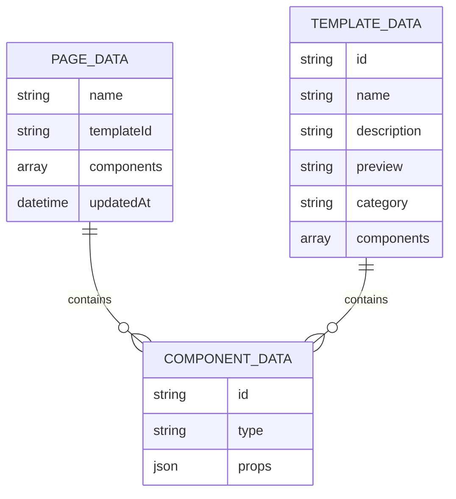

# 拖拽编辑器

<cite>
**本文档引用的文件**
- [PageEditor.tsx](file://company_cms_project/frontend/src/pages/PageEditor.tsx)
- [ComponentRenderer.tsx](file://company_cms_project/frontend/src/components/ComponentRenderer.tsx)
- [components.ts](file://company_cms_project/frontend/src/types/components.ts)
- [templates.ts](file://company_cms_project/frontend/src/types/templates.ts)
- [TemplateSelector.tsx](file://company_cms_project/frontend/src/pages/TemplateSelector.tsx)
- [pages.ts](file://company_cms_project/frontend/src/api/pages.ts)
- [menus.ts](file://company_cms_project/frontend/src/api/menus.ts)
- [package.json](file://company_cms_project/frontend/package.json)
</cite>

## 更新摘要
**变更内容**
- PageEditor配置面板重构，新增完整的按钮配置界面
- 支持32种可用图标、按钮类型选择、尺寸配置、颜色自定义等新功能
- 增强的按钮组件渲染器，支持链接跳转和样式定制
- 完善的拖拽编辑器功能，包括组件拖拽、排序、属性配置

## 目录
1. [简介](#简介)
2. [项目结构](#项目结构)
3. [核心组件](#核心组件)
4. [架构总览](#架构总览)
5. [详细组件分析](#详细组件分析)
6. [依赖关系分析](#依赖关系分析)
7. [性能考虑](#性能考虑)
8. [故障排除指南](#故障排除指南)
9. [结论](#结论)
10. [附录](#附录)

## 简介
本项目基于React + dnd-kit开发了一套企业官网可视化拖拽编辑器，支持组件拖拽布局配置、实时预览、响应式布局等功能。编辑器采用前后端分离架构，前端使用React + TypeScript + Ant Design，后端提供RESTful API，实现了完整的页面可视化编辑功能。该编辑器基于dnd-kit库实现了高性能的拖拽交互，支持多种组件类型的拖拽、排序和属性配置，现已重构为支持完整的按钮配置系统。

## 项目结构
基于实际代码分析，项目采用现代化的前后端分离架构：



**图表来源**
- [package.json:12-26](file://company_cms_project/frontend/package.json#L12-L26)

**章节来源**
- [package.json:12-26](file://company_cms_project/frontend/package.json#L12-L26)

## 核心组件
基于实际实现，拖拽编辑器包含以下核心组件：

### 拖拽布局配置系统
- **页面布局组件库**：预置8种布局模板（hero、text、image、button、container、form、cards、divider）
- **组件拖拽系统**：基于dnd-kit实现的拖拽排序功能
- **实时预览功能**：编辑模式与预览模式无缝切换
- **响应式布局**：支持flexbox和grid布局

### 组件面板系统
- **组件库面板**：左侧固定宽度，包含所有可用组件
- **画布区域**：中间弹性宽度，支持拖拽操作
- **属性配置面板**：右侧固定宽度，支持组件属性编辑

### 模板系统
- **模板选择器**：提供4种预设模板（默认、企业、科技、服务）
- **模板克隆**：支持模板组件的克隆和个性化定制
- **模板预览**：实时预览模板效果

### 按钮配置系统
- **图标选择**：支持32种预设图标（方向、导航、通讯、媒体、情感、用户、商务、系统、状态）
- **按钮类型**：支持5种样式类型（主要、默认、虚线、文字、链接）
- **尺寸配置**：支持小、中、大三种尺寸
- **颜色自定义**：支持背景色、文字色、边框色的独立配置
- **链接配置**：支持首页、站内页面、外部链接等多种链接类型

**章节来源**
- [PageEditor.tsx:147-246](file://company_cms_project/frontend/src/pages/PageEditor.tsx#L147-L246)
- [TemplateSelector.tsx:1-201](file://company_cms_project/frontend/src/pages/TemplateSelector.tsx#L1-L201)

## 架构总览
基于实际代码实现，拖拽编辑器采用模块化设计：



**图表来源**
- [PageEditor.tsx:85-906](file://company_cms_project/frontend/src/pages/PageEditor.tsx#L85-L906)
- [ComponentRenderer.tsx:247-304](file://company_cms_project/frontend/src/components/ComponentRenderer.tsx#L247-L304)

## 详细组件分析

### 拖拽系统实现

#### dnd-kit集成配置
项目使用dnd-kit实现拖拽功能，包含完整的传感器配置：



**图表来源**
- [PageEditor.tsx:98-106](file://company_cms_project/frontend/src/pages/PageEditor.tsx#L98-L106)
- [PageEditor.tsx:225-232](file://company_cms_project/frontend/src/pages/PageEditor.tsx#L225-L232)

#### 拖拽事件处理流程
拖拽操作遵循完整的生命周期：



**图表来源**
- [PageEditor.tsx:225-232](file://company_cms_project/frontend/src/pages/PageEditor.tsx#L225-L232)

#### 拖拽容器配置
- **组件面板容器**：左侧200px固定宽度，支持垂直滚动
- **画布容器**：中间弹性宽度，支持自适应缩放
- **属性配置容器**：右侧280px固定宽度，支持垂直滚动

#### 拖拽约束条件
- **跨容器拖拽**：支持从组件面板拖入画布
- **内部排序**：支持画布内组件重新排序
- **激活约束**：移动8px后才开始拖拽，避免误触
- **键盘导航**：支持键盘操作组件

**章节来源**
- [PageEditor.tsx:98-106](file://company_cms_project/frontend/src/pages/PageEditor.tsx#L98-L106)
- [PageEditor.tsx:225-232](file://company_cms_project/frontend/src/pages/PageEditor.tsx#L225-L232)

### 组件交互机制

#### 组件类型系统
项目定义了完整的组件类型系统：



**图表来源**
- [components.ts:1-136](file://company_cms_project/frontend/src/types/components.ts#L1-L136)

#### 组件渲染器系统
每个组件都有对应的渲染器，支持编辑模式和预览模式：

- **Hero渲染器**：横幅大图组件，支持背景色、高度、按钮配置
- **Text渲染器**：文本块组件，支持字体、颜色、对齐方式
- **Image渲染器**：图片组件，支持尺寸、填充模式、圆角
- **Button渲染器**：按钮组件，支持样式、尺寸、通栏显示
- **Container渲染器**：容器组件，支持flexbox和grid布局
- **Form渲染器**：表单组件，支持字段配置和验证
- **Cards渲染器**：卡片列表组件，支持响应式布局
- **Divider渲染器**：分割线组件，支持样式和颜色

#### 按钮配置系统
按钮组件现支持完整的配置界面：

- **基础配置**：按钮文字、图标选择、图标位置
- **样式配置**：按钮类型（5种）、尺寸（小/中/大）、圆角、阴影
- **颜色配置**：背景色、文字色、边框色的独立自定义
- **布局配置**：对齐方式、宽度设置（自适应/固定/通栏）、内边距
- **链接配置**：链接类型（无/首页/站内/外部）、页面选择、打开方式

**章节来源**
- [ComponentRenderer.tsx:14-304](file://company_cms_project/frontend/src/components/ComponentRenderer.tsx#L14-L304)
- [components.ts:19-125](file://company_cms_project/frontend/src/types/components.ts#L19-L125)

### 用户体验设计

#### 拖拽反馈系统
- **实时拖拽反馈**：拖拽过程中组件的transform样式变化
- **选择状态指示**：选中组件的蓝色边框和类型标签
- **悬停效果**：未选中组件的灰色边框提示
- **预览模式**：编辑模式与预览模式的无缝切换

#### 模板系统设计
- **模板分类**：默认、企业、科技、服务四种风格
- **模板预览**：彩色预览图和详细描述
- **模板应用**：一键应用模板并跳转编辑器
- **模板克隆**：生成新的组件ID避免冲突

#### 属性配置面板
- **组件特定配置**：根据组件类型显示不同的属性选项
- **实时预览**：属性修改即时反映在画布上
- **表单验证**：必填字段的验证和错误提示
- **复杂组件配置**：容器组件的子组件管理和布局配置
- **按钮配置增强**：完整的按钮样式、颜色、链接配置界面

**章节来源**
- [PageEditor.tsx:340-776](file://company_cms_project/frontend/src/pages/PageEditor.tsx#L340-L776)
- [TemplateSelector.tsx:15-48](file://company_cms_project/frontend/src/pages/TemplateSelector.tsx#L15-L48)

## 依赖关系分析

### 技术栈依赖
```mermaid
graph TB
subgraph "前端核心依赖"
React[React 19.2.0]
TS[TypeScript 5.9.3]
AntD[Ant Design 6.2.3]
DnDKit[dnd-kit 6.3.1]
Sortable[sortable 10.0.0]
Utilities[utilities 3.2.2]
Axios[axios 1.13.4]
UUID[uuid 13.0.0]
end
subgraph "开发工具"
Vite[Vite 7.2.4]
ESLint[ESLint 9.39.1]
TSPlugin[typescript-eslint 8.46.4]
end
subgraph "运行时依赖"
Router[react-router-dom 7.13.0]
Recharts[recharts 3.7.0]
DayJS[dayjs 1.11.19]
Icons[@ant-design/icons 6.1.0]
end
React --> DnDKit
React --> AntD
DnDKit --> Sortable
DnDKit --> Utilities
AntD --> Icons
```

**图表来源**
- [package.json:12-42](file://company_cms_project/frontend/package.json#L12-L42)

### 数据流依赖


**图表来源**
- [pages.ts:14-21](file://company_cms_project/frontend/src/api/pages.ts#L14-L21)
- [templates.ts:5-12](file://company_cms_project/frontend/src/types/templates.ts#L5-L12)

**章节来源**
- [package.json:12-42](file://company_cms_project/frontend/package.json#L12-L42)
- [pages.ts:1-32](file://company_cms_project/frontend/src/api/pages.ts#L1-L32)

## 性能考虑

### 拖拽性能优化策略
基于实际实现的性能优化：

#### 虚拟滚动优化
- **组件数量控制**：通过状态管理控制组件数量，避免过多渲染
- **条件渲染**：空画布时显示Empty组件，减少DOM节点
- **样式优化**：使用CSS.Transform进行硬件加速

#### 缓存策略
- **本地草稿缓存**：使用localStorage存储编辑草稿
- **模板缓存**：模板组件克隆后直接使用
- **API响应缓存**：通过请求拦截器处理响应

#### 性能监控
- **拖拽性能**：dnd-kit提供的高性能拖拽实现
- **渲染优化**：React.memo和useMemo的合理使用
- **内存管理**：组件卸载时清理定时器和事件监听器

### 移动端触摸支持
- **触摸事件处理**：dnd-kit内置的PointerSensor支持触摸
- **手势识别**：自动识别拖拽手势
- **响应式适配**：Ant Design的响应式设计

### 键盘导航辅助
- **键盘传感器**：KeyboardSensor支持键盘操作
- **焦点管理**：组件选择和操作的键盘导航
- **无障碍支持**：符合WCAG标准的无障碍设计

**章节来源**
- [PageEditor.tsx:98-106](file://company_cms_project/frontend/src/pages/PageEditor.tsx#L98-L106)

## 故障排除指南

### 常见拖拽问题
1. **拖拽不响应**
   - 检查dnd-kit依赖是否正确安装
   - 验证组件是否正确包裹在DndContext中
   - 确认SortableItem的id属性唯一性

2. **拖拽位置异常**
   - 检查CSS Transform样式是否正确应用
   - 验证组件的ref和setNodeRef绑定
   - 确认z-index层级设置

3. **性能问题**
   - 实施组件状态优化，避免不必要的重渲染
   - 使用React.memo包装渲染器组件
   - 减少深层嵌套的组件结构

### 状态管理问题
- **状态同步**：确保编辑器状态与localStorage同步
- **数据一致性**：验证组件数据结构的完整性
- **回滚机制**：实现撤销/重做功能

### 模板系统问题
- **模板应用**：检查模板克隆函数的ID生成
- **模板预览**：验证模板组件的正确渲染
- **模板切换**：确保模板切换时的数据清理

### 按钮配置问题
- **图标显示**：检查BUTTON_ICON_OPTIONS和BUTTON_ICON_MAP的配置
- **样式应用**：验证buildButtonStyle函数的颜色和尺寸设置
- **链接跳转**：确认getButtonLinkUrl函数的URL生成逻辑

**章节来源**
- [PageEditor.tsx:244-338](file://company_cms_project/frontend/src/pages/PageEditor.tsx#L244-L338)
- [TemplateSelector.tsx:23-48](file://company_cms_project/frontend/src/pages/TemplateSelector.tsx#L23-L48)

## 结论
本拖拽编辑器项目基于成熟的React + dnd-kit技术栈，实现了企业官网所需的可视化编辑功能。通过合理的组件设计和状态管理，能够满足中小企业的网站管理需求。项目实现了完整的拖拽编辑器功能，包括组件面板、画布区域、属性面板、模板系统等核心功能，并已重构为支持完整的按钮配置系统，为后续的功能扩展奠定了坚实的基础。

## 附录

### 开发里程碑
项目按照严格的里程碑计划推进：
- **阶段一**：需求分析和设计（2周）
- **阶段二**：核心功能开发（6周）
- **阶段三**：可视化编辑器开发（4周）
- **阶段四**：测试和优化（2周）
- **阶段五**：部署和培训（1周）

### 技术选型说明
- **前端框架**：React 19.2.0 + TypeScript 5.9.3
- **UI库**：Ant Design 6.2.3
- **拖拽库**：dnd-kit 6.3.1 + sortable 10.0.0
- **状态管理**：React Hooks + localStorage
- **构建工具**：Vite 7.2.4

### 部署环境
- **服务器**：Windows Server 2019/2022
- **Web服务器**：Nginx 1.24+
- **数据库**：SQLite3（可选Redis缓存）
- **进程管理**：NSSM服务管理器

### 按钮配置功能详情
- **图标系统**：32种预设图标，涵盖方向、导航、通讯、媒体、情感、用户、商务、系统、状态等类别
- **样式系统**：5种按钮类型，3种尺寸，支持圆角、阴影、颜色自定义
- **链接系统**：支持首页、站内页面、外部链接，可配置新窗口打开
- **布局系统**：支持左对齐、居中、右对齐，宽度可设置为自适应、固定或通栏

**章节来源**
- [package.json:12-42](file://company_cms_project/frontend/package.json#L12-L42)