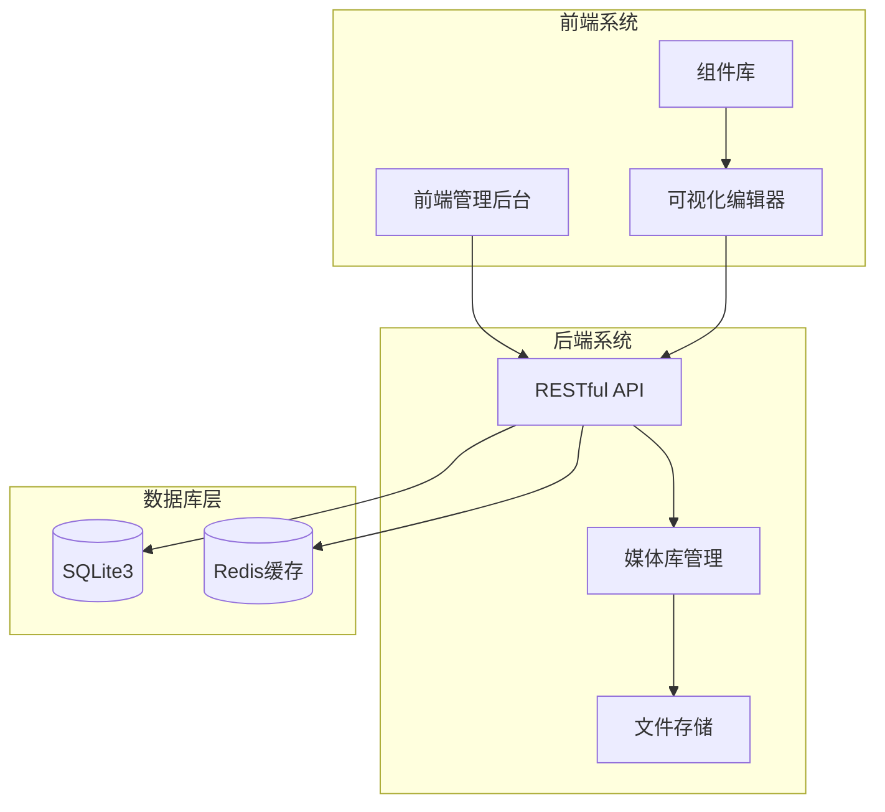
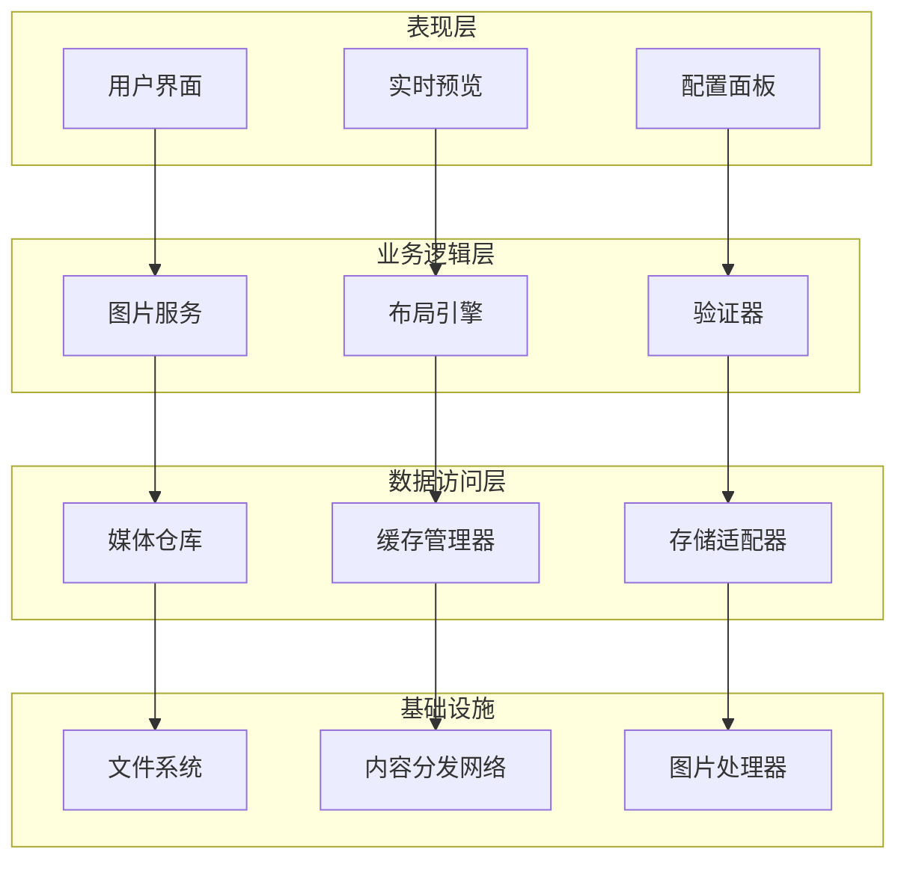
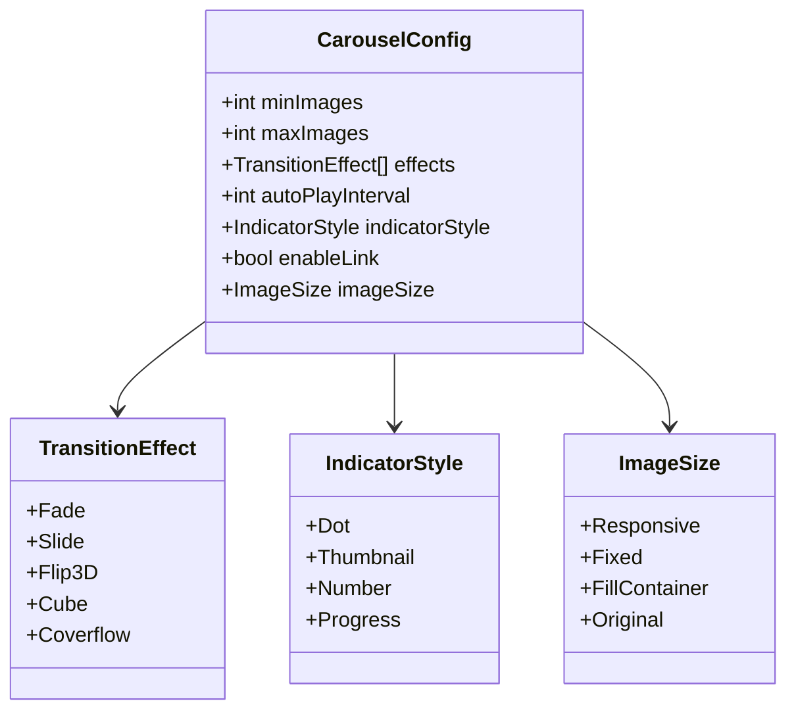
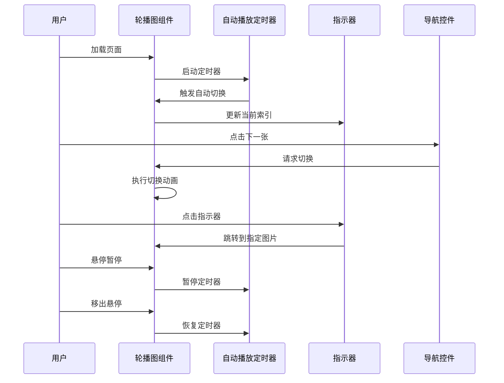
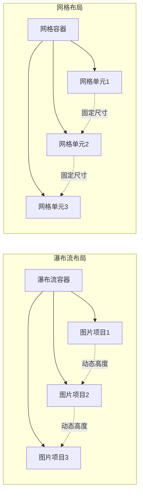
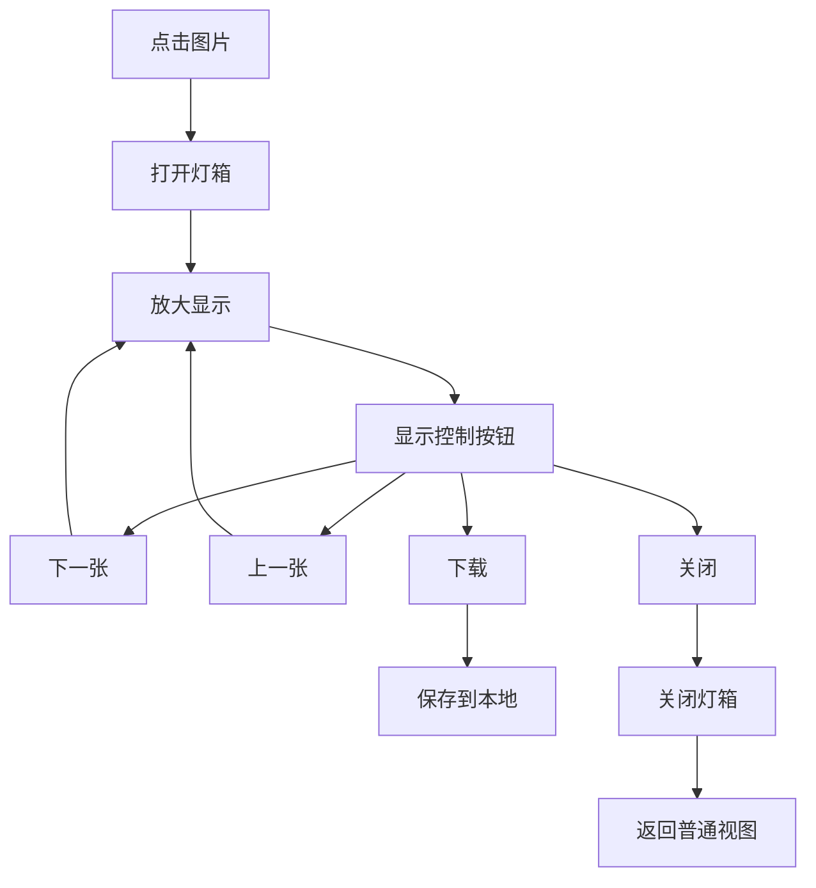
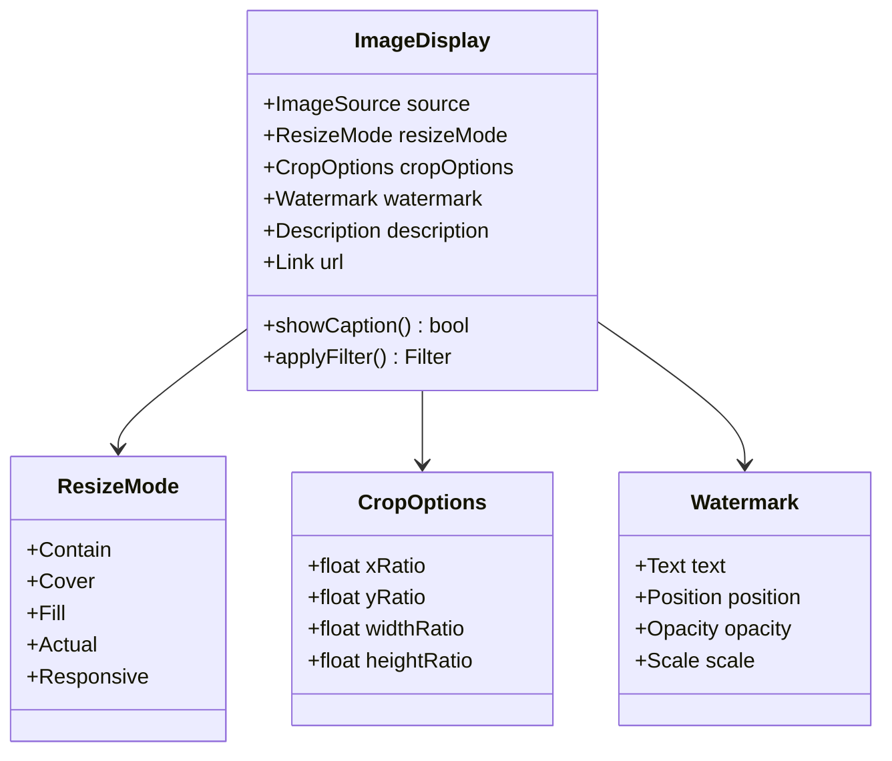
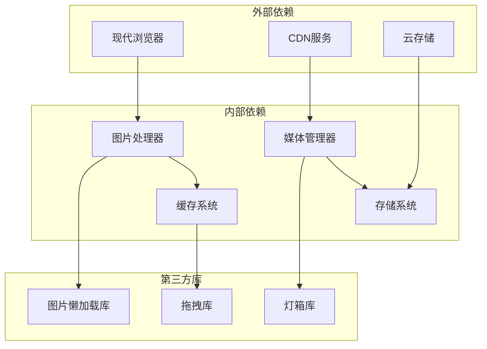
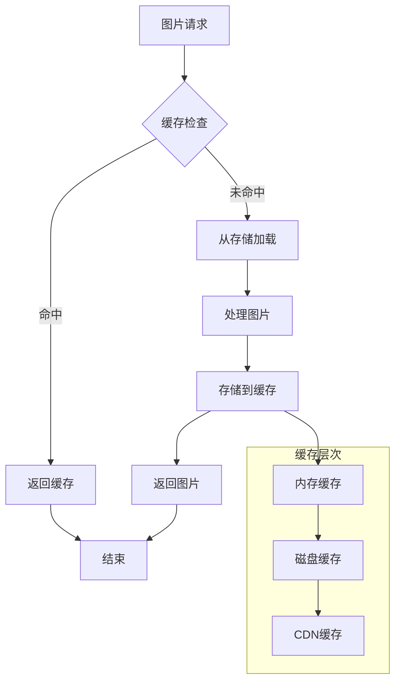

# 图片展示组件

<cite>
**本文档引用的文件**
- [企业网站CMS系统开发需求文档.ini](file://企业网站CMS系统开发需求文档.ini)
- [企业网站CMS系统详细需求文档.md](file://企业网站CMS系统详细需求文档.md)
- [开发计划表_2月4日-2月12日.md](file://开发计划表_2月4日-2月12日.md)
</cite>

## 目录
1. [简介](#简介)
2. [项目结构](#项目结构)
3. [核心组件](#核心组件)
4. [架构概览](#架构概览)
5. [详细组件分析](#详细组件分析)
6. [依赖关系分析](#依赖关系分析)
7. [性能考虑](#性能考虑)
8. [故障排除指南](#故障排除指南)
9. [结论](#结论)

## 简介

本文档详细介绍企业网站CMS系统中的图片展示组件，包括轮播图、画廊和单图展示等组件的设计理念和实现方式。该系统采用前后端分离架构，使用Python Flask作为后端，支持可视化拖拽配置，为用户提供直观的图片内容管理体验。

## 项目结构

企业CMS系统采用模块化的项目结构，图片组件作为核心内容组件之一，与其他组件共同构成完整的可视化编辑器系统。

**图表来源**
- [企业网站CMS系统详细需求文档.md](file://企业网站CMS系统详细需求文档.md#L22-L57)
- [开发计划表_2月4日-2月12日.md](file://开发计划表_2月4日-2月12日.md#L92-L105)

**章节来源**
- [企业网站CMS系统详细需求文档.md](file://企业网站CMS系统详细需求文档.md#L22-L57)
- [开发计划表_2月4日-2月12日.md](file://开发计划表_2月4日-2月12日.md#L92-L105)

## 核心组件

### 图片组件库概述

系统提供三种主要的图片展示组件，每种组件都有其独特的配置选项和交互行为：

#### 轮播图组件
- 支持3-10张图片轮播
- 多种切换效果：淡入淡出、滑动、3D翻转
- 自动播放间隔设置
- 多种指示器样式：圆点、缩略图、数字
- 支持图片链接跳转功能

#### 画廊组件
- 瀑布流布局模式
- 网格布局模式
- 灯箱效果展示
- 图片懒加载优化
- 响应式设计适配

#### 单图展示组件
- 响应式图片处理
- 多种图片裁剪/缩放模式
- 图片描述和水印功能
- 支持多种图片格式

**章节来源**
- [企业网站CMS系统详细需求文档.md](file://企业网站CMS系统详细需求文档.md#L122-L138)

## 架构概览

图片组件系统采用分层架构设计，确保组件的可维护性和扩展性。

**图表来源**
- [企业网站CMS系统详细需求文档.md](file://企业网站CMS系统详细需求文档.md#L551-L628)

## 详细组件分析

### 轮播图组件分析

轮播图组件是图片展示的核心组件之一，提供了丰富的配置选项和交互体验。

#### 配置选项详解

**图表来源**
- [企业网站CMS系统详细需求文档.md](file://企业网站CMS系统详细需求文档.md#L123-L128)

#### 交互行为流程

**图表来源**
- [企业网站CMS系统详细需求文档.md](file://企业网站CMS系统详细需求文档.md#L123-L128)

#### 性能优化策略

轮播图组件采用了多项性能优化策略：

- **图片预加载**：智能预加载下一张图片
- **内存管理**：自动释放不再使用的图片资源
- **动画优化**：使用硬件加速的CSS3变换
- **懒加载**：非可视区域的图片延迟加载

**章节来源**
- [企业网站CMS系统详细需求文档.md](file://企业网站CMS系统详细需求文档.md#L123-L128)

### 画廊组件分析

画廊组件提供了灵活的图片展示方式，支持多种布局模式和交互效果。

#### 布局模式对比

**图表来源**
- [企业网站CMS系统详细需求文档.md](file://企业网站CMS系统详细需求文档.md#L129-L133)

#### 灯箱效果实现

**图表来源**
- [企业网站CMS系统详细需求文档.md](file://企业网站CMS系统详细需求文档.md#L129-L133)

#### 响应式设计策略

画廊组件采用以下响应式设计策略：

- **断点适配**：针对不同屏幕尺寸设置不同的列数
- **图片尺寸自适应**：根据容器宽度自动调整图片尺寸
- **触摸手势支持**：移动端滑动切换图片
- **加载优化**：小尺寸图片优先加载，大图按需加载

**章节来源**
- [企业网站CMS系统详细需求文档.md](file://企业网站CMS系统详细需求文档.md#L129-L133)

### 单图展示组件分析

单图展示组件提供了简洁而强大的图片展示功能，支持多种显示模式和编辑选项。

#### 图片处理功能

**图表来源**
- [企业网站CMS系统详细需求文档.md](file://企业网站CMS系统详细需求文档.md#L134-L137)

#### 响应式图片处理

单图组件采用现代响应式图片技术：

- **srcset支持**：根据设备像素比提供不同分辨率的图片
- **sizes属性**：允许浏览器选择最合适的图片尺寸
- **格式检测**：自动检测浏览器支持的图片格式
- **渐进式加载**：先加载低质量图片，再替换为高质量图片

**章节来源**
- [企业网站CMS系统详细需求文档.md](file://企业网站CMS系统详细需求文档.md#L134-L137)

## 依赖关系分析

图片组件系统涉及多个层面的依赖关系，需要合理管理和优化。

**图表来源**
- [企业网站CMS系统详细需求文档.md](file://企业网站CMS系统详细需求文档.md#L588-L594)

**章节来源**
- [企业网站CMS系统详细需求文档.md](file://企业网站CMS系统详细需求文档.md#L588-L594)

## 性能考虑

### 图片格式支持

系统支持多种现代图片格式，以优化加载性能和质量：

- **WebP格式**：提供更好的压缩比和质量平衡
- **SVG矢量图**：支持无限缩放，适合图标和简单图形
- **JPEG格式**：支持有损压缩，适合照片类图片
- **PNG格式**：支持透明度，适合图标和简单图形

### 缓存机制

**图表来源**
- [企业网站CMS系统详细需求文档.md](file://企业网站CMS系统详细需求文档.md#L514-L548)

### 性能优化策略

系统采用了多层次的性能优化策略：

- **图片懒加载**：使用Intersection Observer API实现精准的懒加载
- **预加载策略**：智能预加载即将显示的图片
- **压缩优化**：自动压缩图片大小，保持视觉质量
- **CDN加速**：通过CDN分发静态资源，减少服务器压力
- **缓存策略**：多级缓存机制，提高图片加载速度

**章节来源**
- [企业网站CMS系统详细需求文档.md](file://企业网站CMS系统详细需求文档.md#L514-L548)

## 故障排除指南

### 常见问题及解决方案

#### 图片加载失败
- **症状**：图片显示为占位符或加载错误
- **原因**：文件路径错误、权限问题、存储服务异常
- **解决方案**：检查文件路径配置、验证存储权限、重启存储服务

#### 轮播图不自动播放
- **症状**：轮播图停止自动切换
- **原因**：定时器被暂停、页面失去焦点、配置错误
- **解决方案**：检查定时器配置、验证页面可见性、重新设置播放间隔

#### 画廊布局错乱
- **症状**：图片排列不整齐，布局异常
- **原因**：图片尺寸不一致、容器宽度计算错误、CSS样式冲突
- **解决方案**：统一图片尺寸、检查容器样式、解决CSS冲突

#### 响应式图片显示异常
- **症状**：图片在某些设备上显示模糊或变形
- **原因**：srcset配置错误、sizes属性设置不当、浏览器兼容性问题
- **解决方案**：检查srcset配置、验证sizes属性、添加浏览器前缀

**章节来源**
- [企业网站CMS系统详细需求文档.md](file://企业网站CMS系统详细需求文档.md#L514-L548)

## 结论

企业CMS系统的图片展示组件经过精心设计，提供了丰富而实用的图片管理功能。通过合理的架构设计和性能优化策略，系统能够满足企业网站对图片展示的各种需求。

主要特点包括：
- **组件化设计**：轮播图、画廊、单图展示三大组件各司其职
- **配置灵活**：丰富的配置选项满足不同场景需求
- **性能优化**：多级缓存、懒加载、CDN加速等优化策略
- **响应式适配**：完美适配各种设备和屏幕尺寸
- **易于扩展**：模块化设计便于功能扩展和维护

随着系统的发展，可以进一步增强图片组件的功能，如添加更多轮播效果、改进画廊布局算法、增加图片编辑功能等，以提供更加完善的图片展示解决方案。