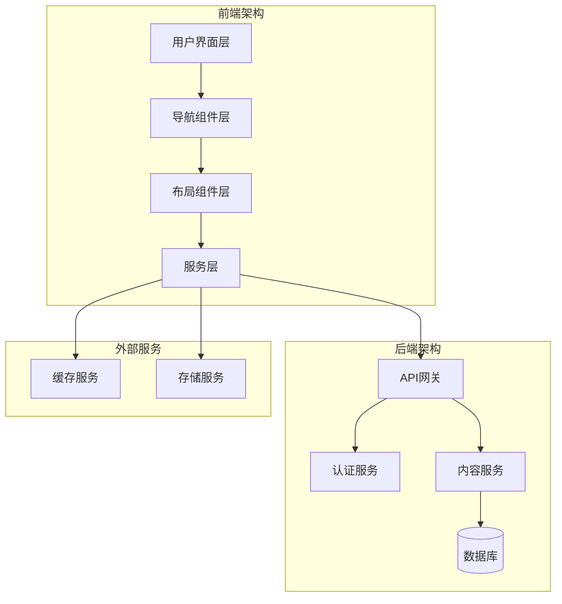
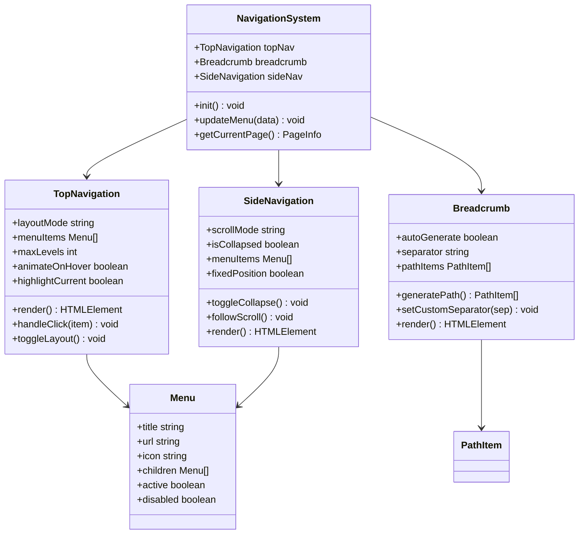
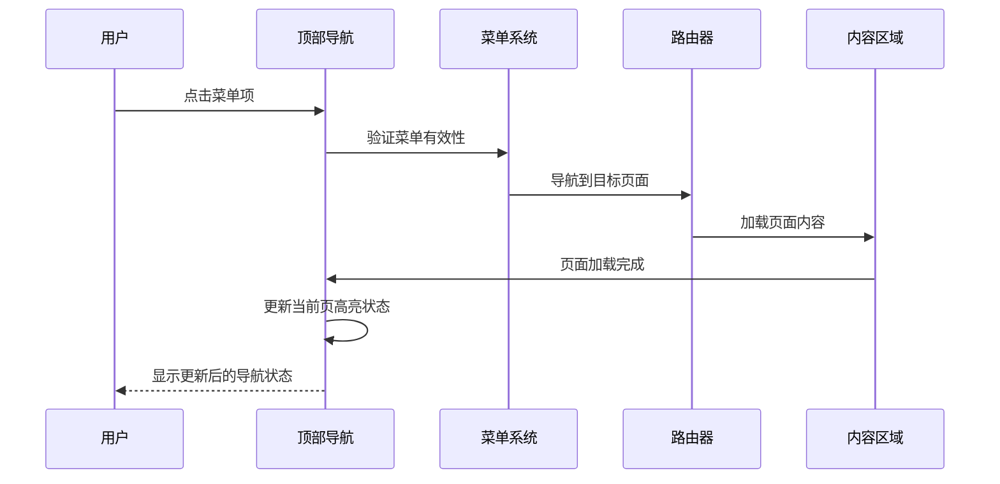
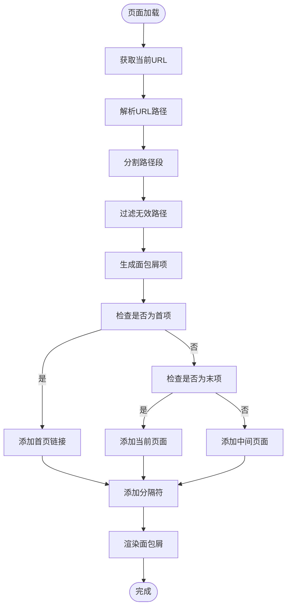
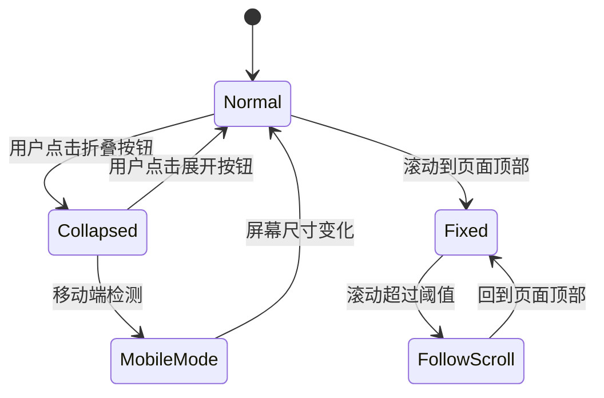
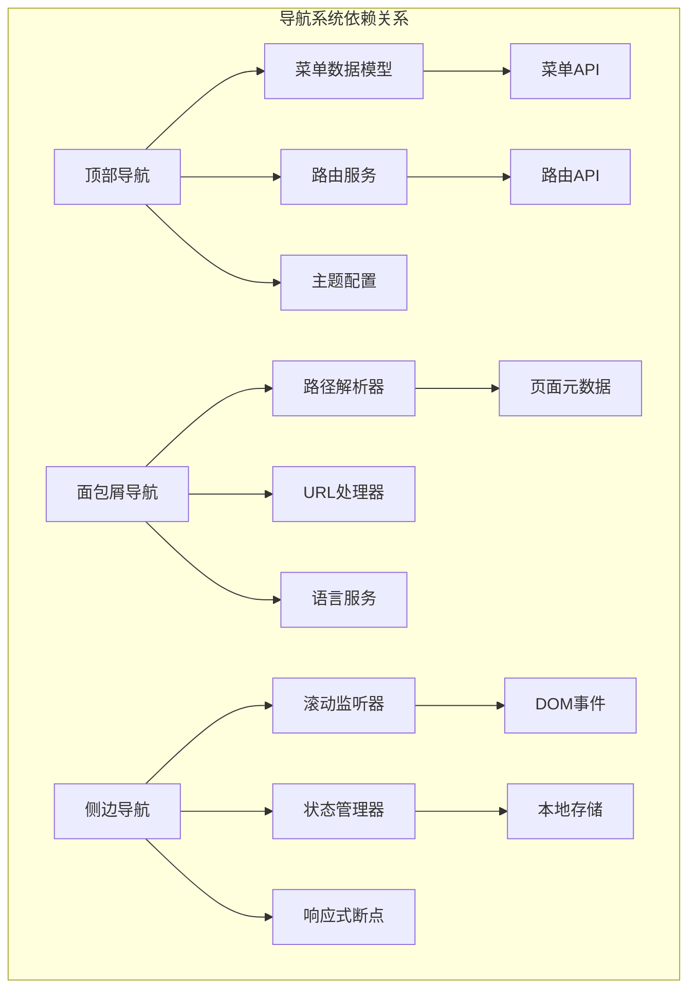

# 导航系统组件

<cite>
**本文档引用的文件**
- [企业网站CMS系统详细需求文档.md](file://企业网站CMS系统详细需求文档.md)
- [开发计划表_2月4日-2月12日.md](file://开发计划表_2月4日-2月12日.md)
</cite>

## 目录
1. [简介](#简介)
2. [项目结构](#项目结构)
3. [核心组件](#核心组件)
4. [架构概览](#架构概览)
5. [详细组件分析](#详细组件分析)
6. [依赖关系分析](#依赖关系分析)
7. [性能考虑](#性能考虑)
8. [故障排除指南](#故障排除指南)
9. [结论](#结论)

## 简介

导航系统组件是企业网站CMS系统的核心功能模块，为用户提供清晰的网站结构导航和页面定位能力。该系统包含三个主要导航组件：顶部导航、面包屑导航和侧边导航，每个组件都针对不同的使用场景和用户需求进行了专门设计。

本导航系统采用现代化的前端技术栈，支持响应式设计，能够在桌面端、平板端和移动端提供一致的用户体验。系统遵循无障碍设计原则，确保所有用户都能有效使用导航功能。

## 项目结构

导航系统组件位于企业网站CMS系统的前端部分，与后端API紧密集成。整体项目采用前后端分离架构，导航组件通过RESTful API获取动态内容。

**图表来源**
- [企业网站CMS系统详细需求文档.md](file://企业网站CMS系统详细需求文档.md#L28-L57)

**章节来源**
- [企业网站CMS系统详细需求文档.md](file://企业网站CMS系统详细需求文档.md#L28-L57)

## 核心组件

导航系统包含三大核心组件，每个组件都有其独特的功能特性和设计理念：

### 1. 顶部导航组件

顶部导航是网站的主要导航入口，提供全局页面访问能力。该组件支持多种布局模式和交互方式。

### 2. 面包屑导航组件

面包屑导航提供页面层级路径指示，帮助用户了解当前位置并快速返回上级页面。该组件支持自动生成路径和自定义分隔符。

### 3. 侧边导航组件

侧边导航主要用于内容丰富的网站，提供深度导航和内容分类浏览功能。该组件支持固定/跟随滚动模式和折叠/展开功能。

**章节来源**
- [企业网站CMS系统详细需求文档.md](file://企业网站CMS系统详细需求文档.md#L164-L176)

## 架构概览

导航系统采用模块化架构设计，各组件之间通过标准化接口进行通信。系统支持动态内容加载和响应式布局适配。

**图表来源**
- [企业网站CMS系统详细需求文档.md](file://企业网站CMS系统详细需求文档.md#L164-L176)

## 详细组件分析

### 顶部导航组件分析

顶部导航是用户访问网站的主要入口，具有以下核心特性：

#### 布局选项
- **横向布局**：适用于桌面端，菜单项水平排列，充分利用水平空间
- **纵向布局**：适用于移动端或窄屏设备，菜单项垂直排列，节省空间

#### 多级菜单支持
- 支持最多3级菜单结构
- 每级菜单支持子菜单嵌套
- 递归菜单渲染机制
- 动态菜单项加载

#### 下拉菜单动画
- 平滑的展开/收起动画
- 悬停触发机制
- CSS3过渡效果
- 响应式动画适配

#### 当前页高亮功能
- 自动识别当前页面
- 动态高亮显示
- 导航项状态管理
- 用户位置感知

**图表来源**
- [开发计划表_2月4日-2月12日.md](file://开发计划表_2月4日-2月12日.md#L1617)

**章节来源**
- [企业网站CMS系统详细需求文档.md](file://企业网站CMS系统详细需求文档.md#L165-L169)

### 面包屑导航组件分析

面包屑导航提供页面层级路径指示，帮助用户理解当前位置和快速返回上级页面。

#### 自动生成机制
- 基于URL路径自动解析
- 页面层级结构识别
- 动态路径生成算法
- 多语言路径支持

#### 自定义分隔符
- 支持多种分隔符样式
- 图标分隔符支持
- 自定义HTML分隔符
- 响应式分隔符适配

#### 路径显示逻辑
- 首页特殊处理
- 当前页面省略
- 中间页面截断
- 移动端路径优化

**图表来源**
- [企业网站CMS系统详细需求文档.md](file://企业网站CMS系统详细需求文档.md#L170-L172)

**章节来源**
- [企业网站CMS系统详细需求文档.md](file://企业网站CMS系统详细需求文档.md#L170-L172)

### 侧边导航组件分析

侧边导航主要用于内容丰富的网站，提供深度导航和内容分类浏览功能。

#### 固定/跟随滚动模式
- **固定模式**：导航始终可见，滚动时保持位置
- **跟随滚动模式**：导航随内容滚动，节省空间
- 智能切换机制
- 视口检测算法

#### 折叠/展开功能
- 一键折叠/展开
- 平滑动画过渡
- 状态持久化
- 响应式适配

#### 响应式适配
- 移动端自动折叠
- 平板端智能布局
- 桌面端完整显示
- 屏幕尺寸检测

**图表来源**
- [企业网站CMS系统详细需求文档.md](file://企业网站CMS系统详细需求文档.md#L173-L176)

**章节来源**
- [企业网站CMS系统详细需求文档.md](file://企业网站CMS系统详细需求文档.md#L173-L176)

## 依赖关系分析

导航系统组件之间的依赖关系体现了清晰的模块化设计：

**图表来源**
- [开发计划表_2月4日-2月12日.md](file://开发计划表_2月4日-2月12日.md#L1617)

**章节来源**
- [开发计划表_2月4日-2月12日.md](file://开发计划表_2月4日-2月12日.md#L1617)

## 性能考虑

导航系统在设计时充分考虑了性能优化，确保在各种设备和网络条件下都能提供流畅的用户体验。

### 性能优化策略

#### 1. 资源加载优化
- 菜单数据懒加载
- 图标资源按需加载
- CSS样式文件压缩
- JavaScript代码分割

#### 2. 渲染性能优化
- 虚拟滚动实现
- 菜单项渲染优化
- DOM节点复用
- 事件委托机制

#### 3. 缓存策略
- 菜单数据缓存
- 路由状态缓存
- 图标资源缓存
- 用户偏好缓存

#### 4. 响应式性能
- 移动端性能优化
- 触摸事件优化
- 屏幕尺寸检测节流
- 动画性能优化

## 故障排除指南

### 常见问题及解决方案

#### 1. 导航菜单不显示
**症状**：导航菜单完全不显示
**可能原因**：
- 菜单数据加载失败
- CSS样式冲突
- JavaScript执行错误

**解决方法**：
- 检查网络连接和API响应
- 查看浏览器控制台错误
- 验证CSS样式文件加载
- 检查JavaScript语法错误

#### 2. 面包屑路径错误
**症状**：面包屑显示错误的路径
**可能原因**：
- URL解析逻辑错误
- 路径映射配置问题
- 多语言路径处理异常

**解决方法**：
- 验证URL路径格式
- 检查路径映射配置
- 测试多语言路径解析
- 更新路径生成算法

#### 3. 侧边导航滚动异常
**症状**：侧边导航滚动行为异常
**可能原因**：
- 滚动监听器冲突
- CSS定位问题
- 响应式断点配置错误

**解决方法**：
- 检查滚动事件绑定
- 验证CSS定位属性
- 测试不同屏幕尺寸
- 调整响应式断点设置

#### 4. 导航高亮状态错误
**症状**：当前页面高亮状态不正确
**可能原因**：
- 路由匹配逻辑错误
- URL比较算法问题
- 状态更新时机不当

**解决方法**：
- 验证路由匹配规则
- 检查URL比较逻辑
- 调整状态更新时机
- 测试多页面导航场景

**章节来源**
- [开发计划表_2月4日-2月12日.md](file://开发计划表_2月4日-2月12日.md#L419-L432)

## 结论

导航系统组件为企业网站CMS提供了完整的导航解决方案，涵盖了现代网站所需的各种导航需求。系统采用模块化设计，支持灵活的配置和扩展，能够适应不同规模和类型的网站需求。

### 主要优势

1. **功能完整性**：包含顶部导航、面包屑导航和侧边导航三大核心组件
2. **响应式设计**：完美适配桌面端、平板端和移动端设备
3. **可访问性支持**：遵循WCAG标准，支持键盘导航和屏幕阅读器
4. **性能优化**：采用多种性能优化策略，确保流畅的用户体验
5. **易于维护**：模块化架构设计，便于功能扩展和bug修复

### 技术特色

- 支持最多3级菜单的复杂导航结构
- 自动化的内容生成和路径解析
- 智能的响应式布局适配
- 完善的错误处理和故障排除机制
- 符合现代Web标准的开发实践

导航系统组件为企业的网站管理提供了强大的技术支持，不仅提升了用户的浏览体验，也简化了网站内容的管理和维护工作。