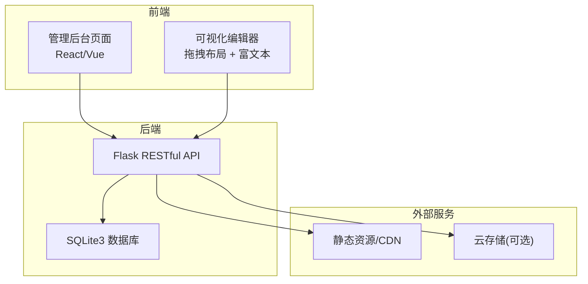
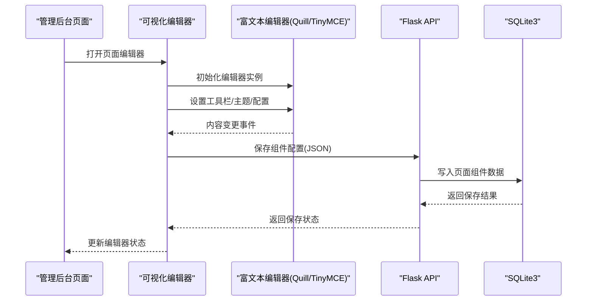
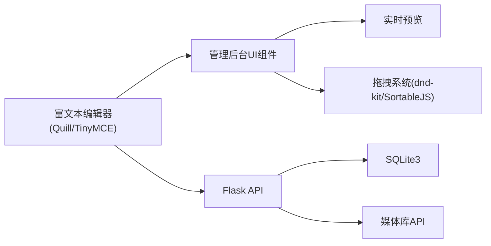

# 文本编辑组件

<cite>
**本文引用的文件**
- [企业网站CMS系统开发需求文档.ini](file://企业网站CMS系统开发需求文档.ini)
- [企业网站CMS系统详细需求文档.md](file://企业网站CMS系统详细需求文档.md)
- [开发计划表_2月4日-2月12日.md](file://开发计划表_2月4日-2月12日.md)
</cite>

## 目录
1. [简介](#简介)
2. [项目结构](#项目结构)
3. [核心组件](#核心组件)
4. [架构总览](#架构总览)
5. [详细组件分析](#详细组件分析)
6. [依赖分析](#依赖分析)
7. [性能考量](#性能考量)
8. [故障排查指南](#故障排查指南)
9. [结论](#结论)
10. [附录](#附录)

## 简介
本文件围绕“文本编辑组件”进行系统化技术文档整理，聚焦富文本编辑器在企业官网CMS中的设计与实现。依据项目需求文档与开发计划，富文本编辑器采用Quill.js或TinyMCE作为技术集成方案，覆盖文本格式化（粗体、斜体、下划线、颜色）、段落样式（标题、列表、引用）、图片/视频插入、代码块、表格编辑、超链接管理等核心能力，并提供配置项（字体大小、行高、对齐方式、文本颜色、背景色、最大字符数限制）、事件处理机制与数据绑定方式。此外，文档还涵盖可访问性支持、国际化适配与响应式设计的实现思路与落地建议。

## 项目结构
本项目采用前后端分离架构，前端采用React/Vue技术栈，后端采用Flask，富文本编辑器作为可视化编辑器与内容管理的重要组成部分，贯穿“管理后台页面”和“可视化编辑器”的开发阶段。

**章节来源**
- file://企业网站CMS系统开发需求文档.ini#L74-L85
- file://企业网站CMS系统详细需求文档.md#L595-L622
- file://开发计划表_2月4日-2月12日.md#L263-L279

## 核心组件
- 文本编辑器组件：支持富文本编辑，集成Quill.js或TinyMCE，提供格式化、插入、表格、链接等能力。
- 拖拽布局系统：基于react-dnd-kit或SortableJS，实现组件的拖拽、排序、删除与实时预览。
- 组件库：包含文本、图片、容器、按钮、表单等5个核心组件，满足MVP阶段的可视化编辑需求。
- 前台渲染：根据页面组件配置JSON渲染前台页面，支持响应式与SEO优化。

**章节来源**
- file://企业网站CMS系统详细需求文档.md#L108-L121
- file://开发计划表_2月4日-2月12日.md#L374-L389

## 架构总览
富文本编辑器在系统中的位置与交互如下：

**图表来源**
- [企业网站CMS系统详细需求文档.md](file://企业网站CMS系统详细需求文档.md#L108-L121)
- [开发计划表_2月4日-2月12日.md](file://开发计划表_2月4日-2月12日.md#L372-L389)

**章节来源**
- file://企业网站CMS系统详细需求文档.md#L108-L121
- file://开发计划表_2月4日-2月12日.md#L372-L389

## 详细组件分析

### 富文本编辑器技术集成
- 技术选型：Quill.js或TinyMCE，二者均可满足MVP阶段的富文本编辑需求。
- 工具栏配置：提供常用格式化按钮（粗体、斜体、下划线、颜色、对齐、标题、列表、引用、链接、代码块、表格）。
- 插件与扩展：可按需启用图片/视频插入、代码高亮、表格编辑等扩展。
- 主题与样式：支持浅色/深色主题切换，适配管理后台与前台展示风格。
- 数据绑定：编辑器内容以HTML或Delta（Quill）形式存储，便于前后端统一处理。

**章节来源**
- file://企业网站CMS系统详细需求文档.md#L108-L121
- file://开发计划表_2月4日-2月12日.md#L309

### 功能配置与使用方法
- 文本格式化：支持粗体、斜体、下划线、颜色、背景色、字体大小、行高、对齐方式。
- 段落样式：标题（H1-H6）、有序/无序列表、引用、代码块。
- 媒体插入：图片上传与嵌入、视频平台嵌入（YouTube、优酷/腾讯视频等）。
- 表格编辑：创建、编辑、删除表格，支持行列增删与单元格格式。
- 超链接管理：插入/编辑链接，支持外链与站内锚点。
- 最大字符数限制：可在编辑器配置中设置字符上限，结合后端校验保障内容合规。

**章节来源**
- file://企业网站CMS系统详细需求文档.md#L110-L121
- file://开发计划表_2月4日-2月12日.md#L309

### 配置选项与事件处理
- 配置项：
  - 字体大小、行高、对齐方式、文本颜色、背景色、最大字符数限制。
  - 工具栏自定义（显示/隐藏按钮、分组、快捷键）。
  - 主题与语言（国际化适配）。
- 事件处理：
  - 内容变更事件：监听编辑器内容变化，触发保存或预览更新。
  - 粘贴事件：过滤粘贴内容，保持格式一致性。
  - 图片/视频上传事件：拦截上传行为，调用媒体库API完成上传与插入。
- 数据绑定：
  - 前端：将编辑器内容绑定到组件状态，支持双向绑定与表单校验。
  - 后端：接收编辑器输出（HTML/Delta），持久化到页面组件配置JSON中。

**章节来源**
- file://企业网站CMS系统详细需求文档.md#L117-L121
- file://开发计划表_2月4日-2月12日.md#L309

### 可访问性支持
- 键盘导航：支持Tab切换、Enter确认、Esc取消等常用键盘操作。
- 屏幕阅读器：为工具栏按钮提供语义化标签与ARIA属性。
- 高对比度：提供深色主题，满足色觉障碍用户的使用需求。
- 错误提示：对无效输入与格式异常提供清晰的可读性提示。

**章节来源**
- file://企业网站CMS系统详细需求文档.md#L1424-L1441

### 国际化适配
- 语言包：编辑器工具栏与提示文案支持中英文切换。
- 日期/时间：在富文本中插入的时间信息按当前语言环境格式化。
- 多语言内容：页面内容支持多语言版本，富文本编辑器可配合翻译管理使用。

**章节来源**
- file://企业网站CMS系统详细需求文档.md#L450-L470

### 响应式设计实现
- 编辑器容器：在不同屏幕尺寸下自适应宽度与高度，工具栏可折叠。
- 内容展示：前台渲染时，富文本内容按响应式断点进行排版优化。
- 移动端体验：移动端提供触摸友好的工具栏与输入体验。

**章节来源**
- file://企业网站CMS系统详细需求文档.md#L99-L103
- file://开发计划表_2月4日-2月12日.md#L404-L408

## 依赖分析
富文本编辑器与系统其他模块的耦合关系如下：

**图表来源**
- [企业网站CMS系统详细需求文档.md](file://企业网站CMS系统详细需求文档.md#L108-L121)
- [开发计划表_2月4日-2月12日.md](file://开发计划表_2月4日-2月12日.md#L372-L389)

**章节来源**
- file://企业网站CMS系统详细需求文档.md#L108-L121
- file://开发计划表_2月4日-2月12日.md#L372-L389

## 性能考量
- 编辑器初始化：延迟加载富文本编辑器，减少首屏加载压力。
- 内容渲染：对长内容采用虚拟滚动或分页展示，避免DOM过大。
- 上传优化：图片/视频上传采用分片与进度条，结合CDN加速。
- 缓存策略：编辑器配置与媒体资源使用浏览器缓存与CDN缓存。
- 响应式：在小屏设备上精简工具栏按钮，提升交互效率。

[本节为通用性能指导，不直接分析特定文件]

## 故障排查指南
- 编辑器无法加载：
  - 检查CDN资源是否可用，必要时回退至本地资源。
  - 确认编辑器脚本与主题文件路径正确。
- 内容丢失或格式异常：
  - 校验编辑器输出格式（HTML/Delta），确保后端解析一致。
  - 对粘贴内容进行白名单过滤，避免恶意标签。
- 上传失败：
  - 检查文件类型与大小限制，确认后端接口返回的错误信息。
  - 确认跨域与鉴权配置正确。
- 预览不更新：
  - 检查实时预览的事件监听与状态同步逻辑。
  - 确认编辑器变更事件触发时机与防抖策略。

**章节来源**
- file://开发计划表_2月4日-2月12日.md#L420-L432

## 结论
本项目在8天MVP周期内，将富文本编辑器作为核心功能之一，结合可视化拖拽系统与组件库，实现了从内容创作到前台展示的闭环。通过Quill.js或TinyMCE的技术集成，满足了文本格式化、媒体插入、表格与链接管理等核心需求；同时，配置项、事件处理与数据绑定机制为后续扩展打下基础。建议在V2版本中进一步完善国际化、可访问性与高级组件支持，持续提升用户体验与系统稳定性。

[本节为总结性内容，不直接分析特定文件]

## 附录
- 开发计划关键节点：
  - 第5天：完成管理后台页面，集成富文本编辑器。
  - 第7天：完成简化版可视化编辑器（5个核心组件）。
  - 第11天：进行全面测试与部署。
- 技术选型建议：
  - Quill.js：轻量、可定制性强，适合Delta数据流。
  - TinyMCE：生态丰富、插件完备，适合快速集成。
- 风险与应对：
  - 可视化编辑器开发复杂：采用成熟拖拽库与组件化方案。
  - Windows环境部署：使用Waitress与NSSM，提前准备部署脚本。

**章节来源**
- file://开发计划表_2月4日-2月12日.md#L301-L312
- file://开发计划表_2月4日-2月12日.md#L395-L411
- file://开发计划表_2月4日-2月12日.md#L604-L615