# 社交媒体组件

<cite>
**本文档引用的文件**
- [企业网站CMS系统详细需求文档.md](file://企业网站CMS系统详细需求文档.md)
- [企业网站CMS系统开发需求文档.ini](file://企业网站CMS系统开发需求文档.ini)
- [开发计划表_2月4日-2月12日.md](file://开发计划表_2月4日-2月12日.md)
</cite>

## 目录
1. [简介](#简介)
2. [项目结构](#项目结构)
3. [核心组件](#核心组件)
4. [架构概览](#架构概览)
5. [详细组件分析](#详细组件分析)
6. [依赖关系分析](#依赖关系分析)
7. [性能考虑](#性能考虑)
8. [故障排除指南](#故障排除指南)
9. [结论](#结论)

## 简介

社交媒体组件是企业网站CMS系统中的重要功能模块，旨在为用户提供完整的社交媒体集成能力。该组件库包含社交图标链接、分享按钮和社交媒体信息流嵌入三大核心功能，支持多平台社交媒体平台的集成，为企业官网提供全方位的社交网络连接能力。

## 项目结构

基于需求文档分析，社交媒体组件属于CMS系统的前端可视化编辑模块，与核心组件库并列存在。整个项目采用前后端分离架构，社交媒体组件作为前端组件库的一部分进行开发和维护。

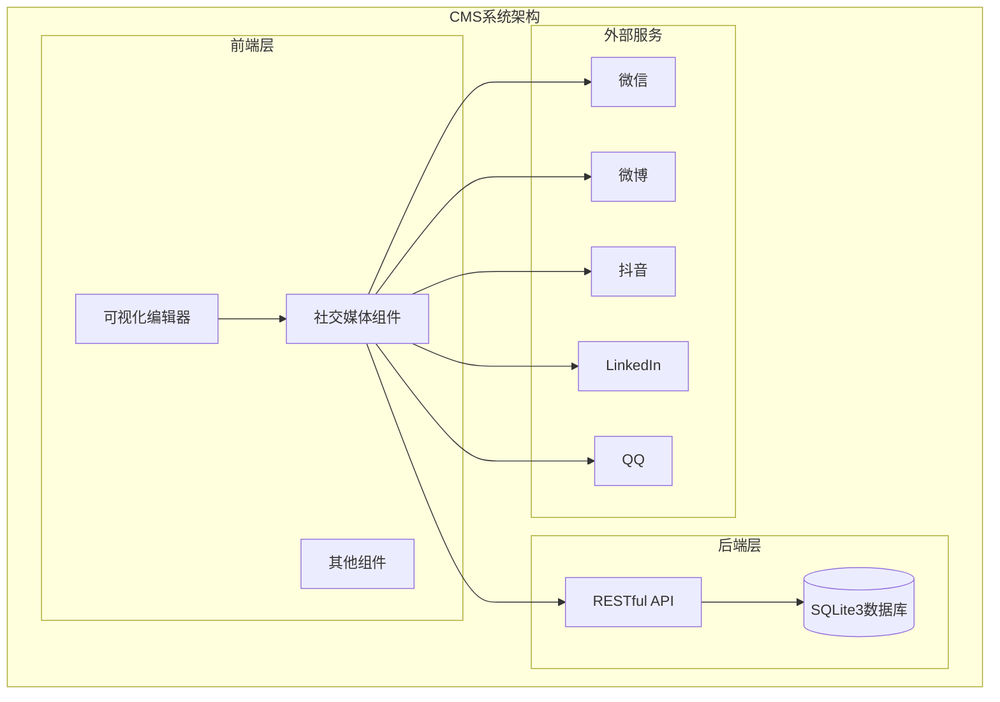

**图表来源**
- [企业网站CMS系统详细需求文档.md](file://企业网站CMS系统详细需求文档.md#L177-L180)
- [开发计划表_2月4日-2月12日.md](file://开发计划表_2月4日-2月12日.md#L374-L389)

**章节来源**
- [企业网站CMS系统详细需求文档.md](file://企业网站CMS系统详细需求文档.md#L177-L180)
- [开发计划表_2月4日-2月12日.md](file://开发计划表_2月4日-2月12日.md#L374-L389)

## 核心组件

根据需求文档，社交媒体组件包含以下三个核心功能模块：

### 1. 社交图标链接组件

支持多种主流社交媒体平台的图标链接，包括：
- **微信 (WeChat)**: 企业微信、个人微信二维码
- **微博 (Weibo)**: 新浪微博官方账号链接
- **抖音 (Douyin)**: 抖音短视频平台链接
- **LinkedIn**: 企业或个人LinkedIn专业档案
- **QQ**: QQ群链接或个人QQ号码

### 2. 分享按钮组件

提供一键分享功能，支持将内容分享到：
- **微信分享**: 支持朋友圈和聊天窗口分享
- **QQ分享**: 支持QQ好友和QQ空间分享
- **微博分享**: 支持新浪微博分享

### 3. 社交媒体信息流组件

允许在网页中嵌入社交媒体平台的内容流，包括：
- **微信公众号文章流**
- **微博话题流**
- **抖音视频流**
- **LinkedIn公司动态**

**章节来源**
- [企业网站CMS系统详细需求文档.md](file://企业网站CMS系统详细需求文档.md#L177-L180)

## 架构概览

社交媒体组件采用模块化设计，每个功能模块相对独立又相互协作，形成完整的社交网络集成解决方案。

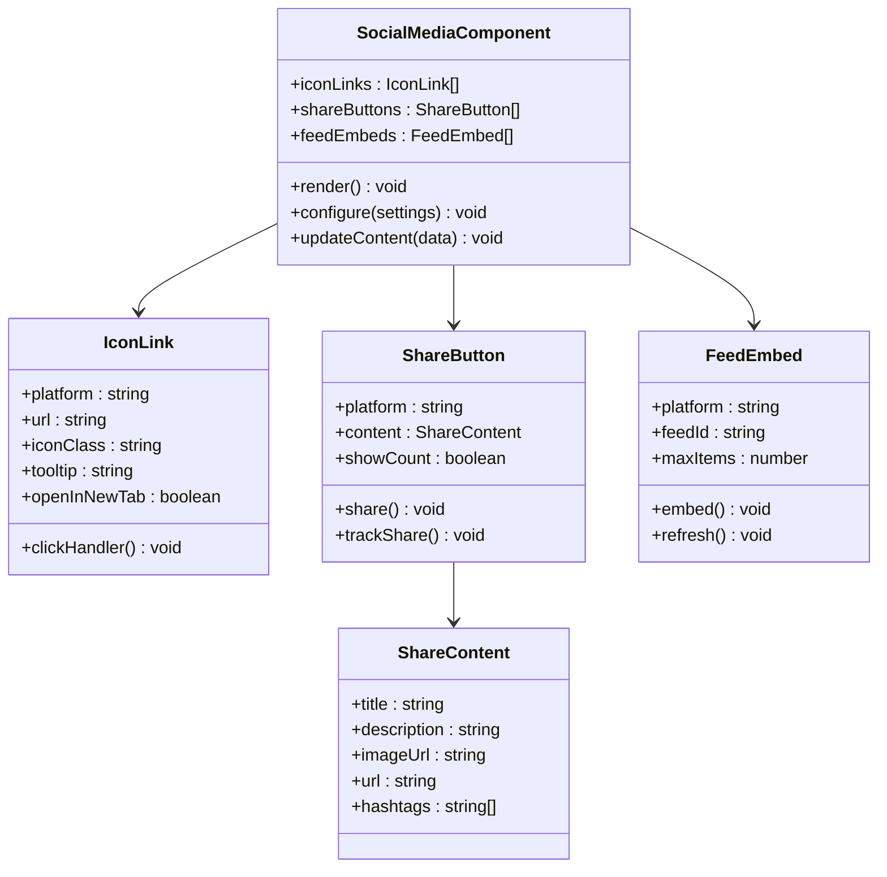

**图表来源**
- [企业网站CMS系统详细需求文档.md](file://企业网站CMS系统详细需求文档.md#L177-L180)

## 详细组件分析

### 社交图标链接组件

#### 平台支持矩阵

| 平台 | 图标样式 | 链接类型 | 目标窗口 |
|------|----------|----------|----------|
| 微信 | 微信绿色图标 | 二维码/公众号链接 | 新窗口 |
| 微博 | 微博橙色图标 | 官方账号主页 | 新窗口 |
| 抖音 | 抖音黑色图标 | 个人主页/官方账号 | 新窗口 |
| LinkedIn | LinkedIn蓝色图标 | 公司档案/个人档案 | 新窗口 |
| QQ | QQ蓝色图标 | QQ群链接/个人QQ | 新窗口 |

#### 图标样式配置

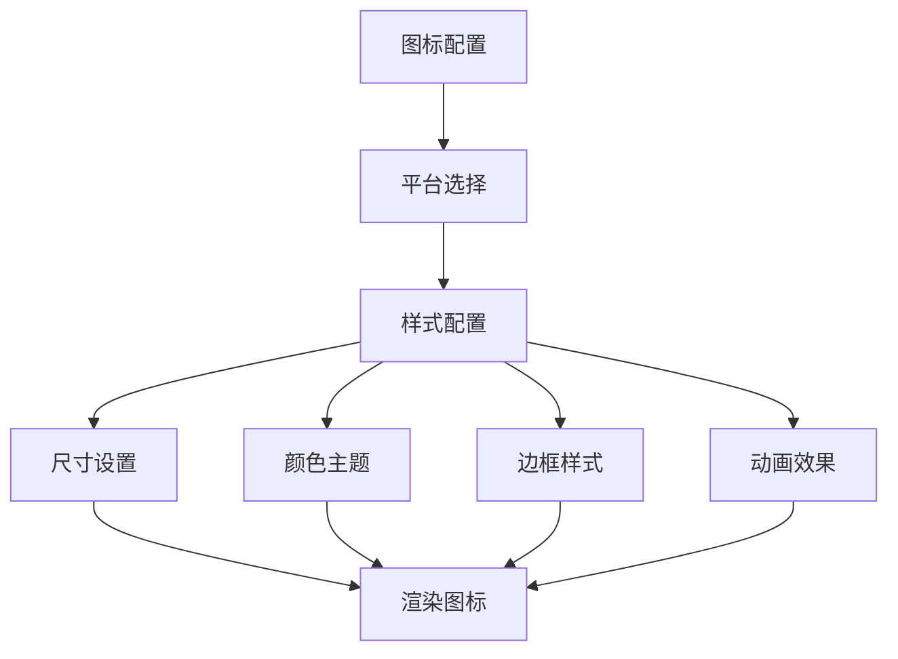

**图表来源**
- [企业网站CMS系统详细需求文档.md](file://企业网站CMS系统详细需求文档.md#L177-L179)

#### 链接跳转机制

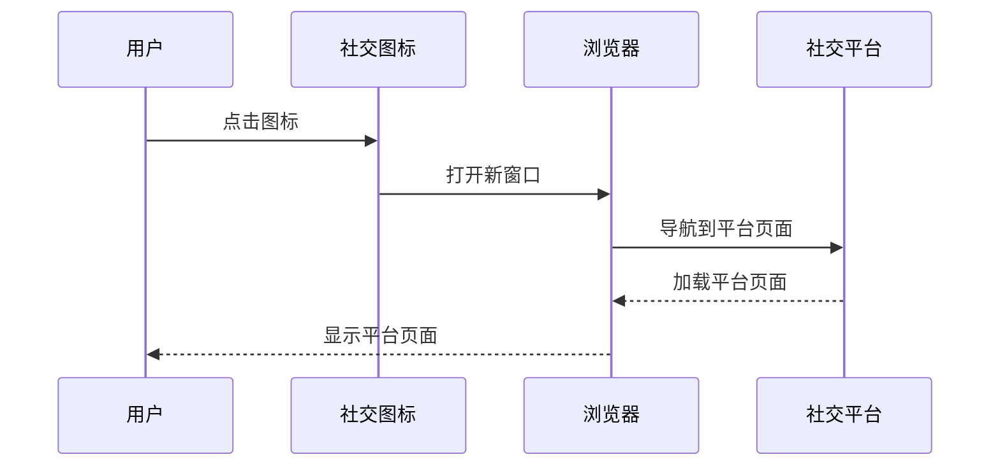

**图表来源**
- [企业网站CMS系统详细需求文档.md](file://企业网站CMS系统详细需求文档.md#L177-L179)

**章节来源**
- [企业网站CMS系统详细需求文档.md](file://企业网站CMS系统详细需求文档.md#L177-L179)

### 分享按钮组件

#### 分享功能实现

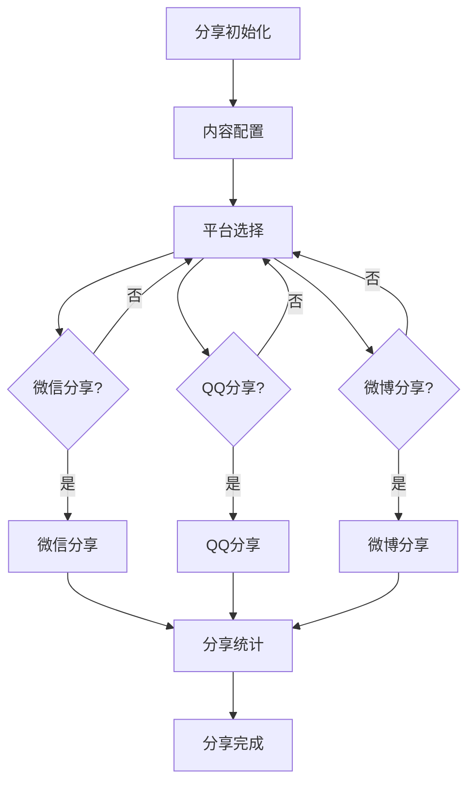

**图表来源**
- [企业网站CMS系统详细需求文档.md](file://企业网站CMS系统详细需求文档.md#L178-L179)

#### 分享内容配置

分享按钮支持以下内容配置：

| 配置项 | 描述 | 默认值 |
|--------|------|--------|
| 标题 | 分享内容的标题 | 当前页面标题 |
| 描述 | 分享内容的描述信息 | 当前页面摘要 |
| 图片 | 分享时显示的缩略图 | 当前页面特色图片 |
| 链接 | 分享的目标链接 | 当前页面URL |
| 话题标签 | 分享时添加的标签 | 空数组 |

#### 分享统计功能

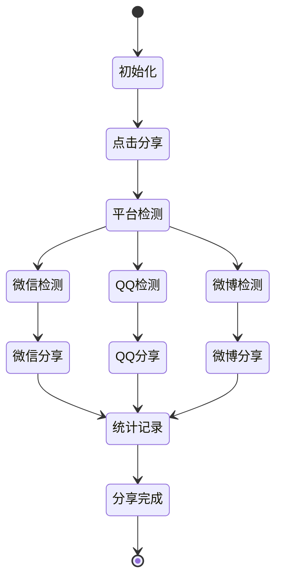

**图表来源**
- [企业网站CMS系统详细需求文档.md](file://企业网站CMS系统详细需求文档.md#L178-L179)

**章节来源**
- [企业网站CMS系统详细需求文档.md](file://企业网站CMS系统详细需求文档.md#L178-L179)

### 社交媒体信息流组件

#### 嵌入技术实现

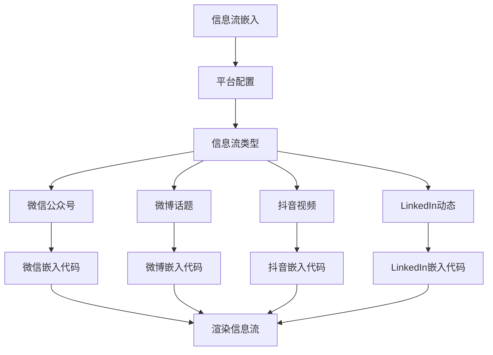

**图表来源**
- [企业网站CMS系统详细需求文档.md](file://企业网站CMS系统详细需求文档.md#L179-L180)

#### 内容获取和展示优化

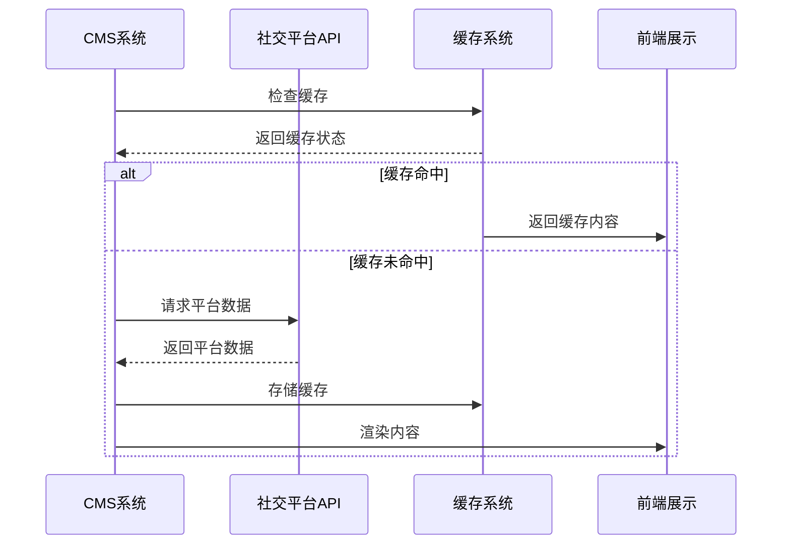

**图表来源**
- [企业网站CMS系统详细需求文档.md](file://企业网站CMS系统详细需求文档.md#L179-L180)

**章节来源**
- [企业网站CMS系统详细需求文档.md](file://企业网站CMS系统详细需求文档.md#L179-L180)

## 依赖关系分析

社交媒体组件与其他系统模块存在密切的依赖关系：

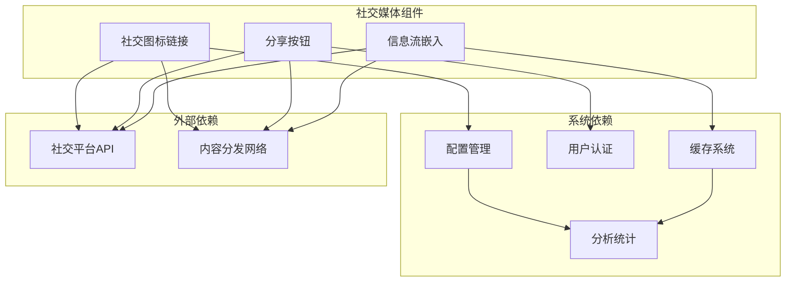

**图表来源**
- [企业网站CMS系统详细需求文档.md](file://企业网站CMS系统详细需求文档.md#L177-L180)

**章节来源**
- [企业网站CMS系统详细需求文档.md](file://企业网站CMS系统详细需求文档.md#L177-L180)

## 性能考虑

### 缓存策略

社交媒体组件采用多层次缓存策略以提升性能：

1. **静态资源缓存**: 图标资源使用CDN缓存
2. **API响应缓存**: 社交平台数据定期缓存
3. **组件状态缓存**: 用户配置和偏好设置本地缓存

### 加载优化

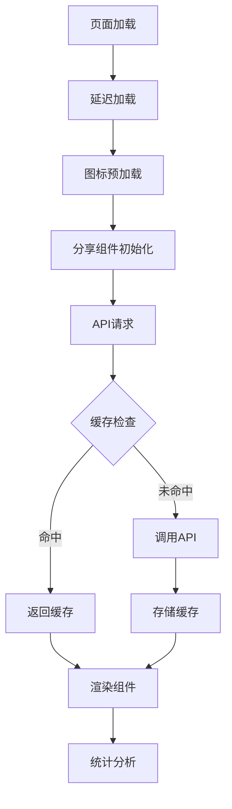

**图表来源**
- [企业网站CMS系统详细需求文档.md](file://企业网站CMS系统详细需求文档.md#L177-L180)

## 故障排除指南

### 常见问题及解决方案

| 问题类型 | 症状描述 | 解决方案 |
|----------|----------|----------|
| 图标不显示 | 社交图标缺失或空白 | 检查CDN连接和缓存状态 |
| 分享失败 | 点击分享无反应 | 验证社交平台API配置和权限 |
| 信息流加载慢 | 社交内容加载缓慢 | 检查缓存配置和网络连接 |
| 跳转异常 | 点击链接无法打开 | 验证链接格式和目标平台状态 |

### 调试工具

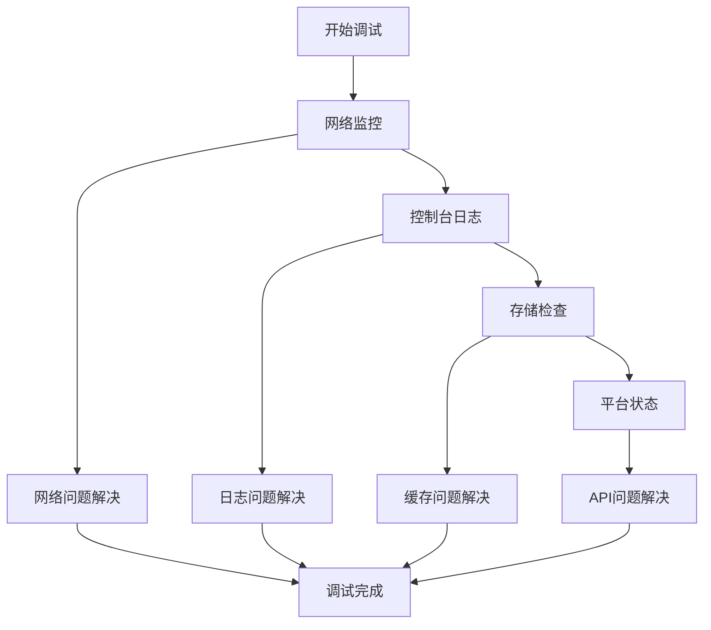

**图表来源**
- [企业网站CMS系统详细需求文档.md](file://企业网站CMS系统详细需求文档.md#L177-L180)

## 结论

社交媒体组件作为企业网站CMS系统的重要组成部分，提供了完整的社交网络集成功能。通过模块化的架构设计和丰富的配置选项，该组件能够满足不同类型企业的社交媒体需求。

### 主要优势

1. **多平台支持**: 支持主流社交媒体平台的集成
2. **灵活配置**: 提供丰富的样式和行为配置选项
3. **性能优化**: 采用缓存和懒加载等性能优化策略
4. **易于维护**: 模块化设计便于功能扩展和维护

### 发展方向

根据开发计划，社交媒体组件将在后续版本中得到进一步完善，包括：
- 增加更多社交媒体平台支持
- 优化用户体验和交互设计
- 加强数据分析和统计功能
- 提升移动端适配能力

该组件为企业的数字化转型提供了强有力的技术支撑，有助于提升品牌影响力和用户参与度。