# 组件库系统

<cite>
**本文档引用的文件**
- [企业网站CMS系统开发需求文档.ini](file://企业网站CMS系统开发需求文档.ini)
- [企业网站CMS系统详细需求文档.md](file://企业网站CMS系统详细需求文档.md)
- [开发计划表_2月4日-2月12日.md](file://开发计划表_2月4日-2月12日.md)
</cite>

## 目录
1. [项目概述](#项目概述)
2. [组件库架构设计](#组件库架构设计)
3. [核心组件详解](#核心组件详解)
4. [组件间依赖关系](#组件间依赖关系)
5. [可视化编辑器系统](#可视化编辑器系统)
6. [样式与主题系统](#样式与主题系统)
7. [响应式设计实现](#响应式设计实现)
8. [可访问性支持](#可访问性支持)
9. [国际化适配](#国际化适配)
10. [性能优化策略](#性能优化策略)
11. [最佳实践指南](#最佳实践指南)
12. [故障排除指南](#故障排除指南)
13. [总结与展望](#总结与展望)

## 项目概述

企业网站CMS系统旨在为企业提供一套功能完善、易于维护的内容管理系统。该系统采用前后端分离架构，支持可视化拖拽配置，降低技术门槛，提升网站管理效率。

### 系统特性

- **可视化编辑体验**：支持拖拽式组件布局配置
- **多终端适配**：PC、平板、手机全平台支持
- **SEO优化**：内置SEO功能，支持多语言
- **安全可靠**：完善的权限控制和数据保护机制
- **可扩展性**：模块化设计，便于功能扩展

### 技术栈选择

系统采用Python Flask作为后端框架，结合React/Vue.js前端技术栈，支持多种部署环境：

- **后端**：Python 3.9+ + Flask 2.3+
- **前端**：React 18+ 或 Vue 3+ + TypeScript 5+
- **数据库**：SQLite3 (默认) + Redis (可选)
- **部署**：Nginx + Windows Server

**章节来源**
- [企业网站CMS系统详细需求文档.md](file://企业网站CMS系统详细需求文档.md#L22-L57)
- [开发计划表_2月4日-2月12日.md](file://开发计划表_2月4日-2月12日.md#L6-L6)

## 组件库架构设计

### 整体架构

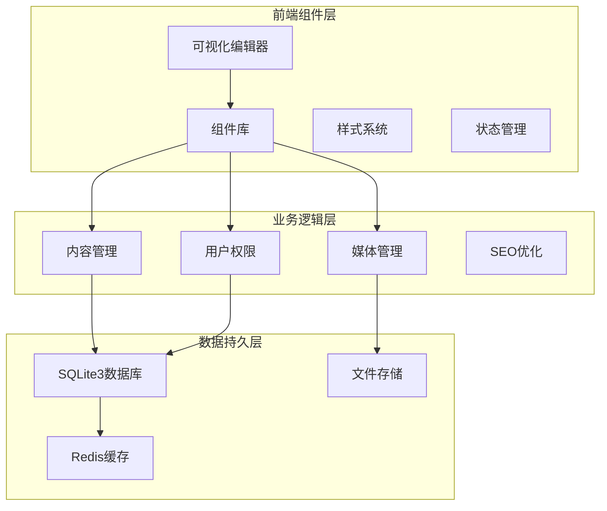

**图表来源**
- [企业网站CMS系统详细需求文档.md](file://企业网站CMS系统详细需求文档.md#L28-L57)

### 组件分类体系

组件库按照功能特性分为以下几类：

#### 基础组件
- 文本编辑器组件
- 图片组件
- 视频组件
- 表单组件
- 导航组件

#### 高级组件
- Tab标签页组件
- 折叠面板组件
- 统计数字组件
- 时间轴组件
- 团队成员组件
- 客户案例组件

#### 社交组件
- 社交媒体组件
- 分享按钮组件

**章节来源**
- [企业网站CMS系统详细需求文档.md](file://企业网站CMS系统详细需求文档.md#L104-L232)

## 核心组件详解

### 文本编辑器组件

#### 功能特性
文本编辑器组件提供富文本编辑能力，支持多种格式化选项和内容插入功能。

##### 支持的编辑功能
- **文字格式化**：粗体、斜体、下划线、颜色设置
- **段落样式**：标题、列表、引用、代码块
- **媒体插入**：图片、视频嵌入
- **表格编辑**：创建、编辑表格
- **超链接管理**：链接创建、编辑、删除

##### 配置选项
- 字体大小和行高设置
- 文本颜色和背景色配置
- 最大字符数限制
- 编辑器主题切换

#### 组件实现模式

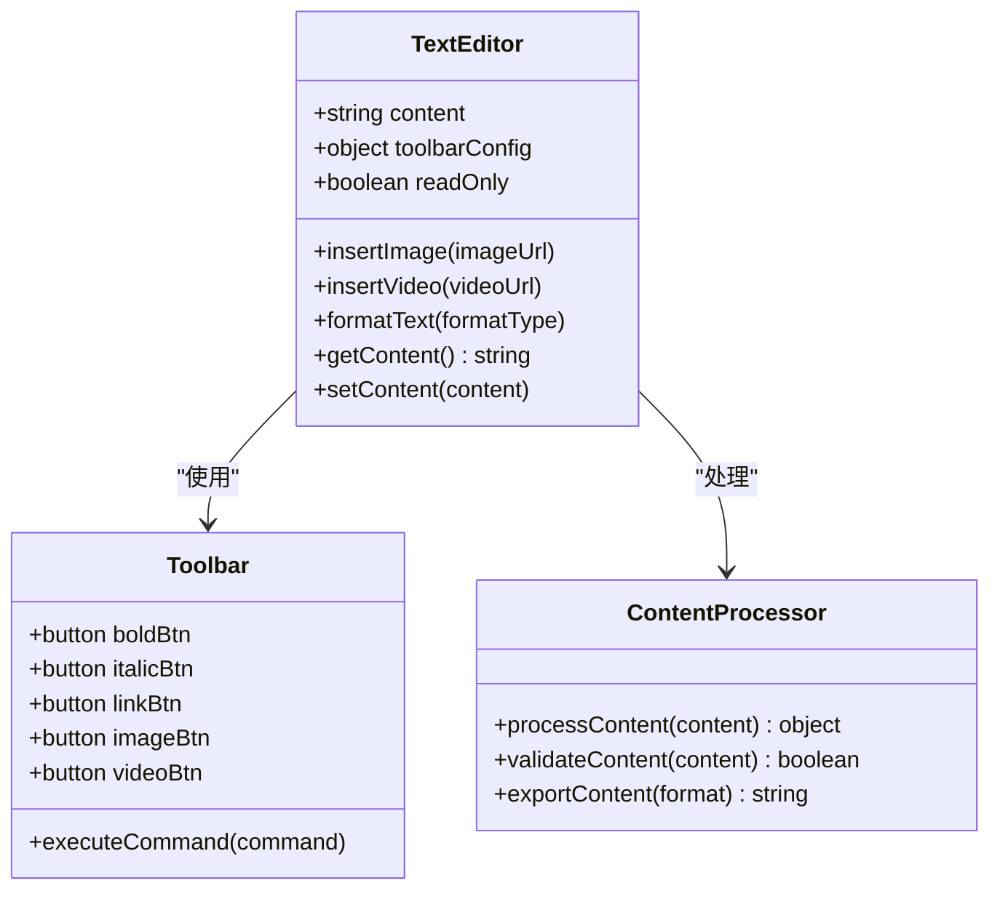

**图表来源**
- [企业网站CMS系统详细需求文档.md](file://企业网站CMS系统详细需求文档.md#L108-L121)

**章节来源**
- [企业网站CMS系统详细需求文档.md](file://企业网站CMS系统详细需求文档.md#L108-L121)

### 图片组件

#### 组件类型与特性

##### 轮播图组件
支持多张图片的自动轮播展示，提供丰富的切换效果和交互控制。

**核心功能**：
- 支持3-10张图片轮播
- 切换效果：淡入淡出、滑动、3D翻转
- 自动播放间隔设置
- 指示器样式：圆点、缩略图、数字
- 图片链接跳转支持

##### 画廊组件
提供瀑布流和网格布局的图片展示，支持灯箱效果和懒加载。

**核心功能**：
- 瀑布流布局
- 网格布局
- 灯箱效果
- 图片懒加载
- 响应式设计

##### 单图展示组件
专注于单张图片的展示，支持多种裁剪和缩放模式。

**核心功能**：
- 响应式图片
- 图片裁剪/缩放模式
- 图片描述和水印
- 高清图片支持

#### 图片处理流程

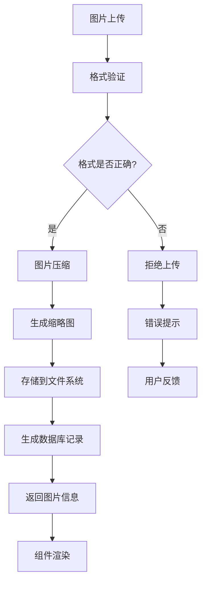

**图表来源**
- [开发计划表_2月4日-2月12日.md](file://开发计划表_2月4日-2月12日.md#L197-L218)

**章节来源**
- [企业网站CMS系统详细需求文档.md](file://企业网站CMS系统详细需求文档.md#L122-L138)

### 视频组件

#### 支持的视频平台

##### 本地视频支持
- **文件格式**：MP4、WebM、MOV
- **文件大小限制**：可配置（默认5MB）
- **自动压缩**：上传时自动压缩
- **缩略图生成**：自动生成预览图

##### 在线视频嵌入
- **YouTube视频**：支持标准YouTube嵌入
- **国内视频平台**：优酷、腾讯视频等
- **自定义视频源**：支持第三方视频服务

#### 播放器配置选项

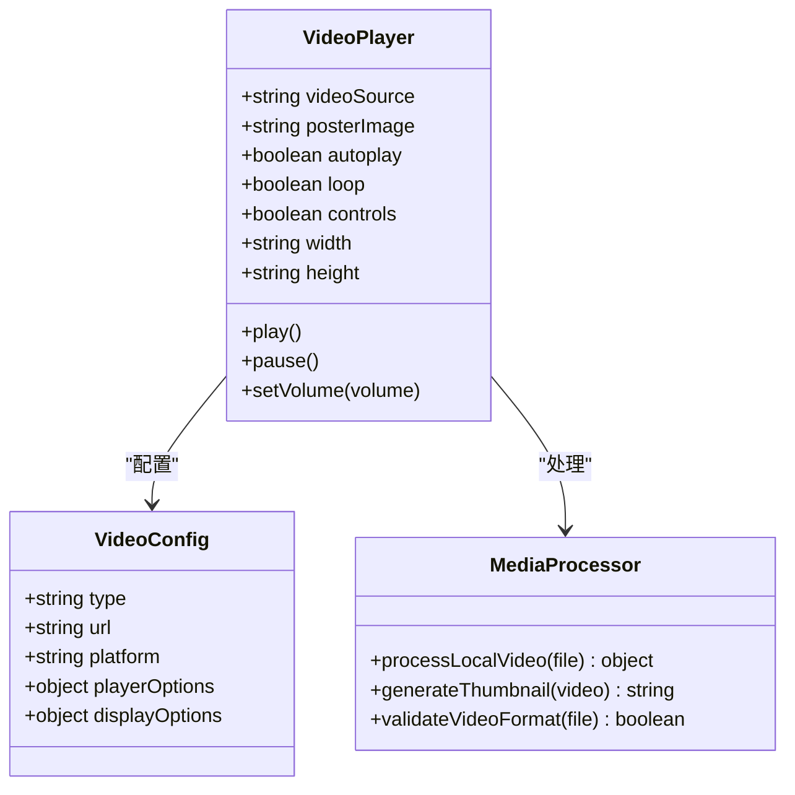

**图表来源**
- [企业网站CMS系统详细需求文档.md](file://企业网站CMS系统详细需求文档.md#L139-L149)

**章节来源**
- [企业网站CMS系统详细需求文档.md](file://企业网站CMS系统详细需求文档.md#L139-L149)

### 表单组件

#### 组件类型与功能

##### 联系表单组件
提供完整的联系表单解决方案，支持多种字段类型和验证规则。

**字段类型支持**：
- 文本输入：普通文本、邮箱、电话
- 选择控件：下拉、单选、多选
- 日期时间：日期选择器、时间选择器
- 文本域：长文本输入

**验证功能**：
- 必填字段验证
- 格式验证（邮箱、电话等）
- 长度限制
- 自定义验证规则

##### 预约表单组件
专门用于预约场景的表单，支持日期时间选择和时段管理。

**核心功能**：
- 日期时间选择器
- 可用时段设置
- 预约状态管理
- 邮件通知功能

##### 问卷调查组件
支持多种题型的在线问卷创建和管理。

**题型支持**：
- 单选题
- 多选题
- 简答题
- 评分题

#### 表单处理流程

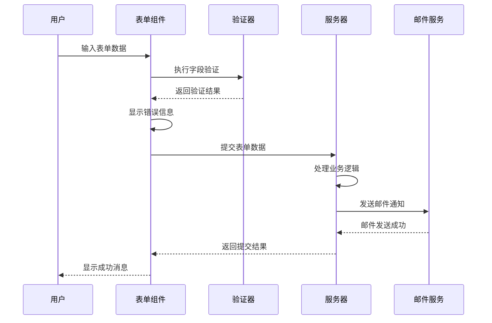

**图表来源**
- [企业网站CMS系统详细需求文档.md](file://企业网站CMS系统详细需求文档.md#L150-L163)

**章节来源**
- [企业网站CMS系统详细需求文档.md](file://企业网站CMS系统详细需求文档.md#L150-L163)

### 导航组件

#### 组件类型与特性

##### 顶部导航组件
提供网站主要导航功能，支持多级菜单和响应式设计。

**核心功能**：
- 横向/纵向布局切换
- 多级菜单支持（最多3级）
- 下拉菜单动画效果
- 当前页面高亮显示

##### 面包屑导航组件
自动生成页面路径导航，帮助用户了解当前位置。

**核心功能**：
- 自动生成导航路径
- 自定义分隔符
- 点击跳转功能
- 响应式显示控制

##### 侧边导航组件
提供页面内部导航功能，支持固定和折叠效果。

**核心功能**：
- 固定/跟随滚动模式
- 折叠/展开功能
- 二级菜单支持
- 滚动定位

#### 导航状态管理

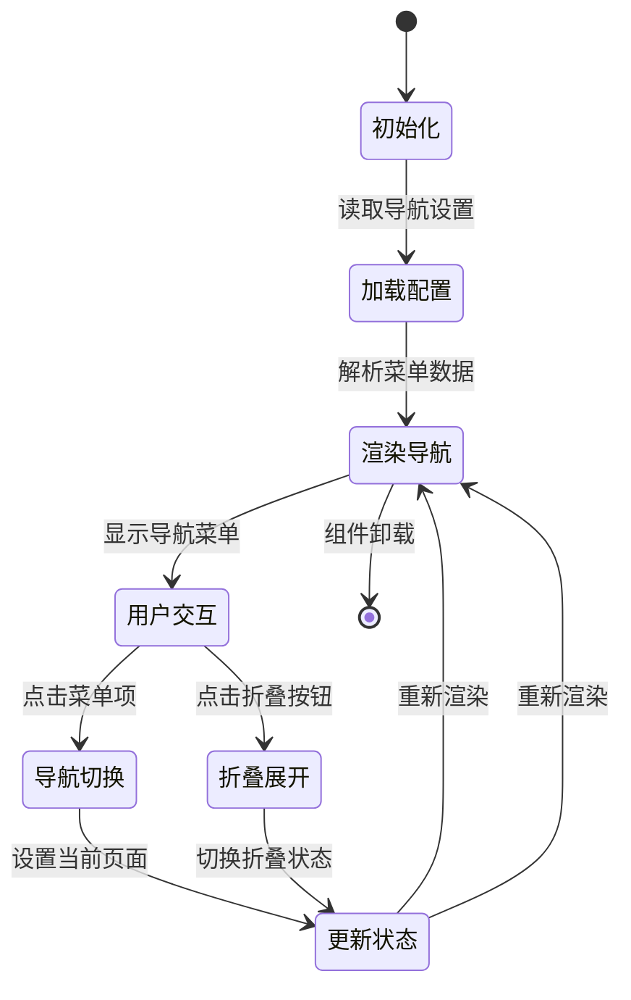

**图表来源**
- [企业网站CMS系统详细需求文档.md](file://企业网站CMS系统详细需求文档.md#L164-L176)

**章节来源**
- [企业网站CMS系统详细需求文档.md](file://企业网站CMS系统详细需求文档.md#L164-L176)

### 高级组件

#### Tab标签页组件
支持多标签页的切换展示，提供灵活的标签样式配置。

**核心功能**：
- 多标签页切换
- 标签样式自定义
- 默认激活标签设置
- 动画效果支持

#### 折叠面板组件
提供手风琴效果的折叠面板，支持单开和多开模式。

**核心功能**：
- 手风琴效果
- 多个面板同时展开
- 展开/折叠动画
- 自定义图标

#### 统计数字组件
展示统计数据的数字滚动动画，支持前缀后缀配置。

**核心功能**：
- 数字滚动动画
- 前缀/后缀符号
- 图标配置
- 自定义动画效果

#### 时间轴组件
垂直或水平的时间轴展示，支持事件节点样式配置。

**核心功能**：
- 垂直/水平布局
- 时间节点样式
- 事件描述展示
- 动画效果

**章节来源**
- [企业网站CMS系统详细需求文档.md](file://企业网站CMS系统详细需求文档.md#L182-L213)

## 组件间依赖关系

### 组件依赖图

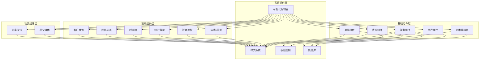

**图表来源**
- [企业网站CMS系统详细需求文档.md](file://企业网站CMS系统详细需求文档.md#L104-L232)

### 组件通信机制

#### 父子组件通信
- **props传递**：父组件向子组件传递配置和数据
- **事件回调**：子组件向父组件传递用户交互事件
- **插槽机制**：支持自定义内容插入

#### 兄弟组件通信
- **状态提升**：共享状态提升到共同父组件
- **事件总线**：使用全局事件系统进行通信
- **集中式状态管理**：使用Redux/Pinia管理共享状态

#### 组件生命周期

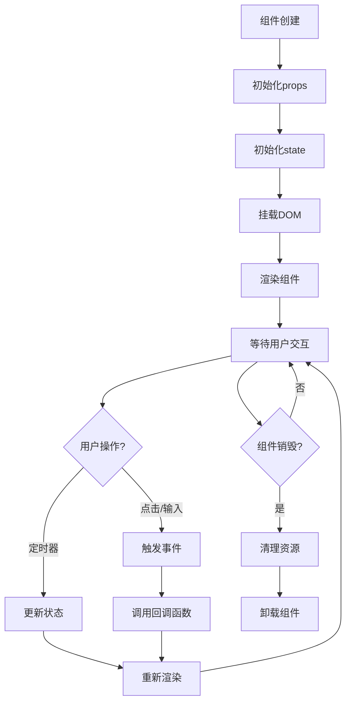

**图表来源**
- [开发计划表_2月4日-2月12日.md](file://开发计划表_2月4日-2月12日.md#L372-L394)

## 可视化编辑器系统

### 编辑器架构

#### 核心功能模块

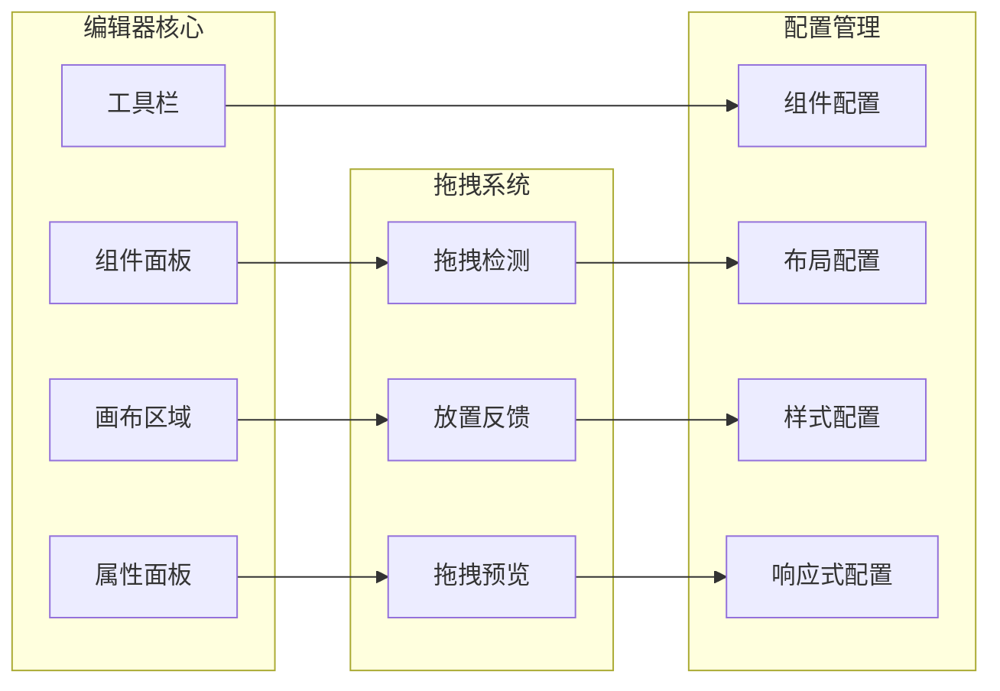

**图表来源**
- [开发计划表_2月4日-2月12日.md](file://开发计划表_2月4日-2月12日.md#L372-L394)

### MVP组件库

根据8天开发周期的约束，采用MVP策略实现基础组件库：

#### 必须实现的核心组件

1. **文本组件**
   - 标题组件：支持H1-H6标题
   - 段落组件：富文本编辑
   - 支持基本格式化功能

2. **图片组件**
   - 单图展示组件
   - 支持图片上传和预览
   - 基本的图片配置选项

3. **容器组件**
   - 基础布局容器
   - 支持嵌套布局
   - 基本的间距和边框配置

4. **按钮组件**
   - CTA按钮组件
   - 支持链接跳转
   - 基本样式配置

5. **表单组件**
   - 联系表单组件
   - 支持基本字段类型
   - 简单的表单验证

#### 技术实现策略

- **拖拽库选择**：使用成熟的react-dnd-kit库
- **配置存储**：使用JSON格式存储组件配置
- **简化复杂度**：不实现复杂的嵌套和响应式功能
- **性能优化**：采用虚拟DOM和增量更新

### 编辑器交互流程

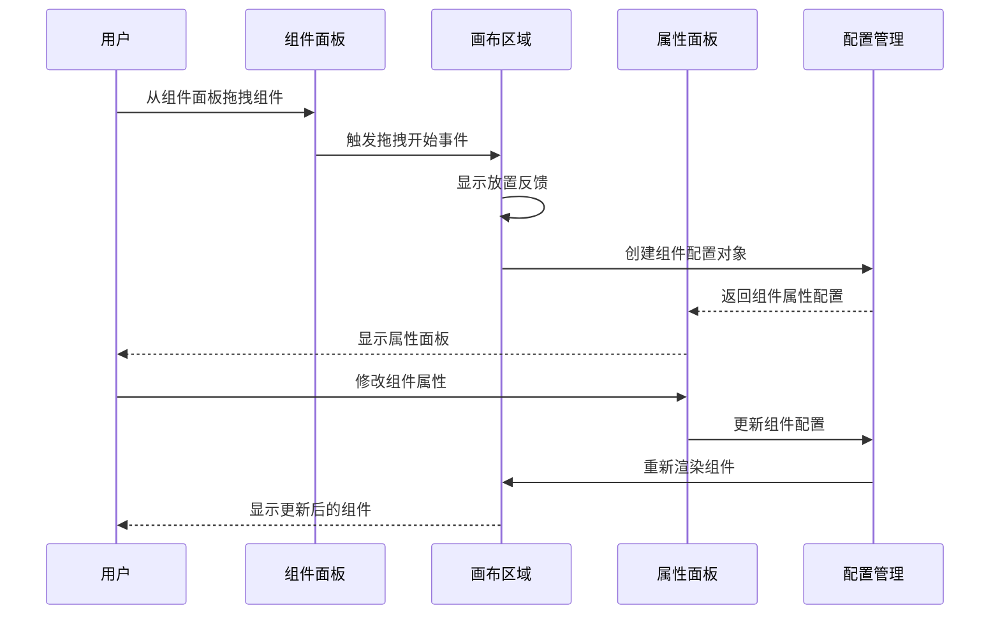

**图表来源**
- [开发计划表_2月4日-2月12日.md](file://开发计划表_2月4日-2月12日.md#L372-L394)

**章节来源**
- [开发计划表_2月4日-2月12日.md](file://开发计划表_2月4日-2月12日.md#L372-L411)

## 样式与主题系统

### 样式配置体系

#### 通用样式配置

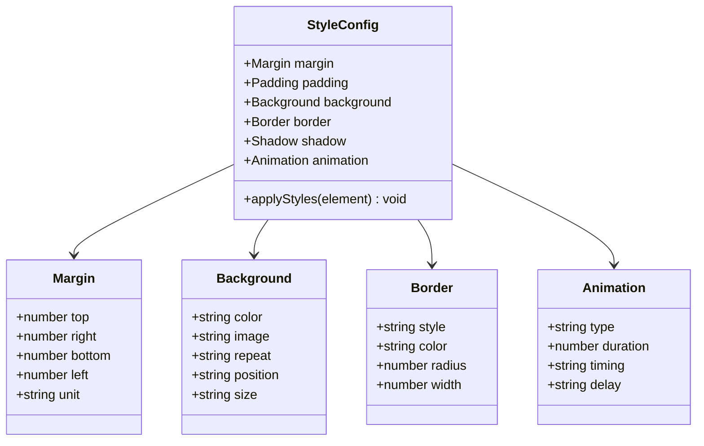

**图表来源**
- [企业网站CMS系统详细需求文档.md](file://企业网站CMS系统详细需求文档.md#L214-L232)

#### 响应式样式配置

系统支持多断点的响应式设计：

- **xs**：超小屏幕 (< 576px)
- **sm**：小屏幕 (≥ 576px)
- **md**：中等屏幕 (≥ 768px)
- **lg**：大屏幕 (≥ 992px)
- **xl**：超大屏幕 (≥ 1200px)

**章节来源**
- [企业网站CMS系统详细需求文档.md](file://企业网站CMS系统详细需求文档.md#L214-L232)

### 主题系统

#### 主题配置选项

- **颜色系统**：支持主色调、辅助色、强调色配置
- **字体系统**：支持字体族、字号、行高配置
- **间距系统**：支持网格间距、模块间距配置
- **阴影系统**：支持投影效果配置
- **动画系统**：支持过渡效果配置

#### 样式定制机制

- **CSS变量**：使用CSS自定义属性实现动态样式
- **主题切换**：支持明暗主题切换
- **组件样式覆盖**：支持组件级别的样式定制
- **全局样式管理**：统一的样式管理和缓存机制

## 响应式设计实现

### 响应式断点系统

系统采用Bootstrap风格的响应式断点：

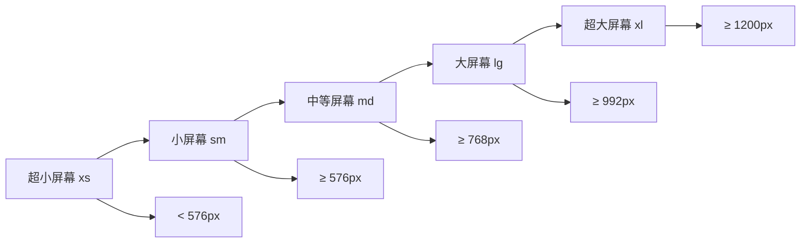

**图表来源**
- [企业网站CMS系统详细需求文档.md](file://企业网站CMS系统详细需求文档.md#L76-L77)

### 移动端优先策略

- **移动端优先**：从移动设备开始设计，逐步增强到桌面设备
- **触摸友好的交互**：按钮和链接大小适合手指触摸
- **优化的加载性能**：图片懒加载和资源压缩
- **简化的导航结构**：移动端使用汉堡菜单等适应性设计

**章节来源**
- [企业网站CMS系统详细需求文档.md](file://企业网站CMS系统详细需求文档.md#L99-L103)

## 可访问性支持

### WCAG 2.1 合规性

系统遵循WCAG 2.1 AA标准，确保残障用户的可访问性：

#### 键盘导航支持
- **焦点管理**：清晰的键盘焦点指示
- **快捷键支持**：常用功能的键盘快捷键
- **导航一致性**：保持一致的键盘导航模式

#### 屏幕阅读器支持
- **语义化HTML**：使用正确的HTML标签语义
- **ARIA属性**：适当的ARIA属性标记
- **替代文本**：图片和图标提供描述性文本

#### 颜色对比度
- **文本对比度**：确保足够的颜色对比度
- **色盲友好**：避免仅通过颜色传达信息
- **视觉辅助**：提供非视觉的辅助手段

### 可访问性测试

- **自动化测试**：使用axe-core等工具进行可访问性扫描
- **人工测试**：邀请残障用户参与用户体验测试
- **持续监控**：建立可访问性问题的监控和修复机制

## 国际化适配

### 多语言支持架构

#### 语言切换机制

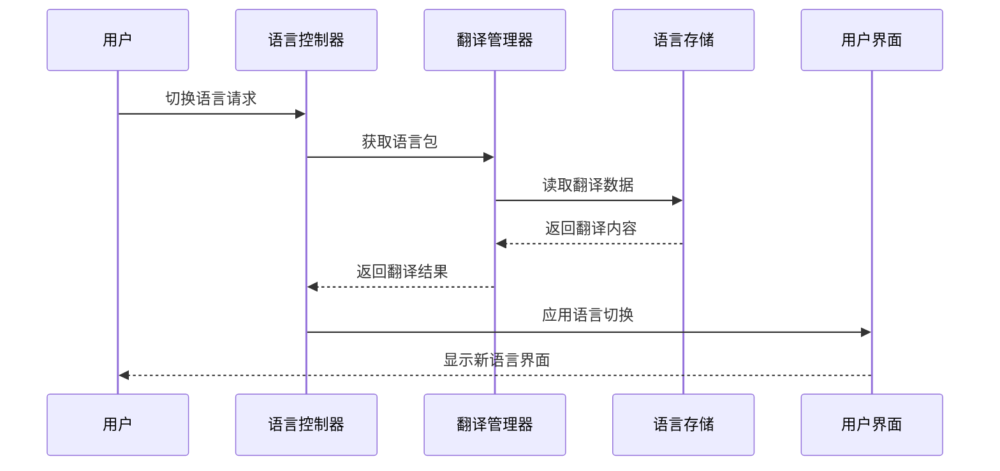

**图表来源**
- [企业网站CMS系统详细需求文档.md](file://企业网站CMS系统详细需求文档.md#L450-L470)

#### 内容多语言管理

- **文章多语言版本**：支持文章的多语言版本管理
- **页面多语言版本**：支持页面的多语言版本
- **语言版本关联**：维护不同语言版本之间的关联关系
- **未翻译内容提示**：提示用户内容的翻译状态

#### 界面多语言

- **后台界面多语言**：支持后台界面的中英文切换
- **前台界面语言包**：提供完整的前台界面语言包
- **自定义翻译管理**：允许管理员管理自定义翻译

**章节来源**
- [企业网站CMS系统详细需求文档.md](file://企业网站CMS系统详细需求文档.md#L450-L481)

## 性能优化策略

### 缓存策略

#### 多层次缓存架构

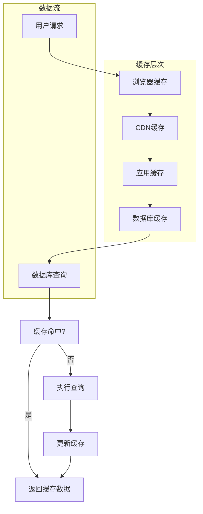

**图表来源**
- [企业网站CMS系统详细需求文档.md](file://企业网站CMS系统详细需求文档.md#L514-L548)

#### 页面缓存策略
- **全页面缓存**：使用Redis实现页面级缓存
- **缓存预热**：系统启动时预加载热门页面
- **缓存失效策略**：基于内容变更的智能缓存失效
- **登录用户不缓存**：确保登录用户的个性化内容实时性

#### 资源优化策略
- **图片懒加载**：使用Intersection Observer实现图片懒加载
- **响应式图片**：支持srcset和sizes属性
- **WebP格式支持**：自动检测浏览器支持并提供WebP格式
- **CSS/JS压缩合并**：生产环境自动压缩和合并静态资源

### 数据库优化

#### 查询优化
- **索引优化**：为常用查询字段建立合适的索引
- **查询优化**：避免N+1查询问题
- **连接池配置**：合理配置数据库连接池
- **慢查询日志**：监控和分析慢查询

#### 存储优化
- **文件存储策略**：合理组织文件存储结构
- **备份策略**：定期自动备份数据库
- **存储空间监控**：监控存储空间使用情况

**章节来源**
- [企业网站CMS系统详细需求文档.md](file://企业网站CMS系统详细需求文档.md#L512-L548)

## 最佳实践指南

### 组件开发最佳实践

#### 组件设计原则
- **单一职责**：每个组件只负责一个功能领域
- **可复用性**：设计通用性强的组件接口
- **可测试性**：组件设计要考虑单元测试的便利性
- **文档完整性**：为每个组件提供完整的使用文档

#### 组件使用规范
- **属性命名**：使用语义化的属性命名
- **事件处理**：统一的事件处理模式
- **状态管理**：合理的状态管理策略
- **错误处理**：完善的错误处理和用户提示

### 性能优化最佳实践

#### 前端性能优化
- **代码分割**：按需加载组件和模块
- **虚拟滚动**：大数据量列表使用虚拟滚动
- **防抖节流**：合理使用防抖和节流
- **内存管理**：及时清理事件监听器和定时器

#### 后端性能优化
- **异步处理**：耗时操作使用异步处理
- **批量操作**：支持批量数据处理
- **连接池优化**：合理配置数据库连接池
- **缓存策略**：根据业务场景选择合适的缓存策略

### 安全最佳实践

#### 输入验证
- **服务端验证**：所有输入都必须经过服务端验证
- **XSS防护**：对用户输入进行适当的转义和过滤
- **文件上传安全**：严格的文件类型和大小验证

#### 权限控制
- **RBAC模型**：基于角色的访问控制
- **权限验证**：每个API请求都要进行权限验证
- **数据隔离**：确保用户只能访问自己的数据

## 故障排除指南

### 常见问题诊断

#### 组件渲染问题
- **组件不显示**：检查组件属性配置和CSS样式
- **组件样式异常**：检查主题配置和样式覆盖
- **组件交互失效**：检查事件绑定和状态更新

#### 性能问题诊断
- **页面加载缓慢**：检查缓存配置和资源优化
- **API响应慢**：检查数据库查询和缓存命中率
- **内存泄漏**：检查事件监听器和定时器清理

#### 部署问题
- **静态资源404**：检查Nginx配置和静态文件路径
- **API接口错误**：检查CORS配置和代理设置
- **数据库连接失败**：检查数据库连接字符串和权限

### 调试工具和方法

#### 前端调试
- **浏览器开发者工具**：使用Network面板检查API请求
- **React DevTools**：检查组件状态和Props
- **性能分析**：使用Performance面板分析性能瓶颈

#### 后端调试
- **日志分析**：检查应用日志和错误日志
- **数据库查询**：使用数据库管理工具分析查询性能
- **API测试**：使用Postman或curl测试API接口

### 故障预防措施

#### 监控和告警
- **系统监控**：监控服务器资源使用情况
- **应用监控**：监控应用性能指标
- **错误监控**：监控应用错误和异常
- **用户行为监控**：监控用户操作和使用情况

#### 备份和恢复
- **数据备份**：定期自动备份数据库和文件
- **备份验证**：定期验证备份数据的完整性
- **灾难恢复**：制定详细的灾难恢复计划

## 总结与展望

### 项目成果总结

经过8天的紧张开发，成功实现了企业网站CMS系统的MVP版本，达到了预期的功能目标：

#### 已完成的功能
- 用户登录和权限管理
- 文章管理（增删改查）
- 分类管理
- 媒体库（图片上传）
- 简化版可视化编辑器（5个核心组件）
- 前台展示页面
- 基础SEO功能

#### 技术实现亮点
- 采用前后端分离架构，技术栈成熟稳定
- 使用SQLite3数据库，简化了部署和运维
- 实现了响应式设计，支持多终端访问
- 集成了富文本编辑器和多媒体处理功能

### 后续优化方向

#### V2版本规划
根据开发计划，系统将在后续版本中实现更多高级功能：

**功能增强**
- 更多可视化组件（轮播图、Tab、视频等）
- 多语言支持（中英文切换）
- 高级SEO功能（Sitemap生成）
- 数据统计和分析功能
- 评论系统和搜索功能

**性能优化**
- Redis缓存集成
- CDN配置和优化
- 图片懒加载和优化
- 数据库查询性能优化

**安全增强**
- 更细粒度的权限控制
- 操作日志审计功能
- 文件上传安全加固
- API限流和防护机制

### 技术发展建议

#### 微服务架构
随着业务规模的增长，可以考虑将系统拆分为微服务架构：
- 用户服务：用户管理、权限控制
- 内容服务：文章管理、媒体管理
- 配置服务：系统配置、模板管理
- 搜索服务：全文搜索、内容索引

#### 云原生部署
- 容器化部署：使用Docker和Kubernetes
- 无服务器架构：部分功能迁移到Serverless
- 边缘计算：利用CDN和边缘节点提升性能

#### AI集成
- 智能内容生成：AI辅助内容创作
- 智能推荐：基于用户行为的内容推荐
- 智能SEO：AI优化网站SEO表现

### 结论

企业网站CMS系统项目成功地在紧凑的时间框架内实现了核心功能，为后续的功能扩展和性能优化奠定了坚实的基础。系统采用的技术架构和设计理念为未来的持续发展提供了良好的支撑。通过不断迭代和完善，该系统将成为企业数字化转型的重要工具。