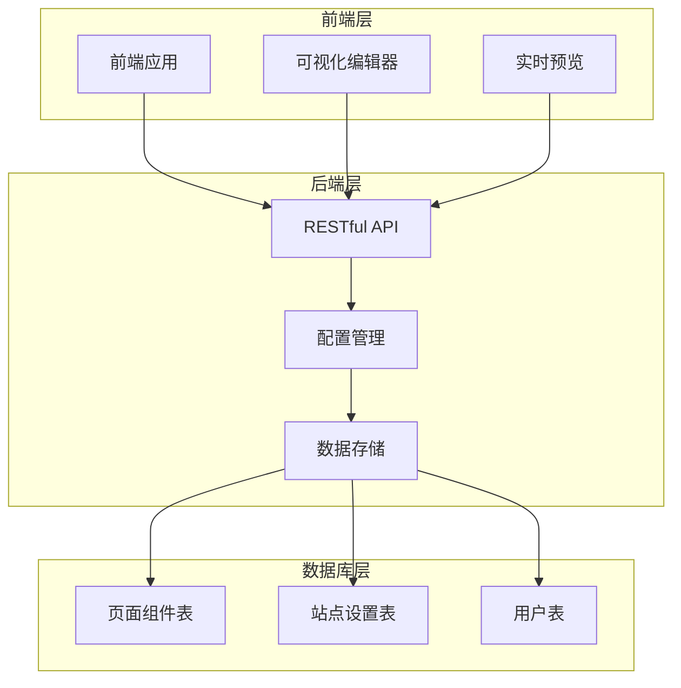
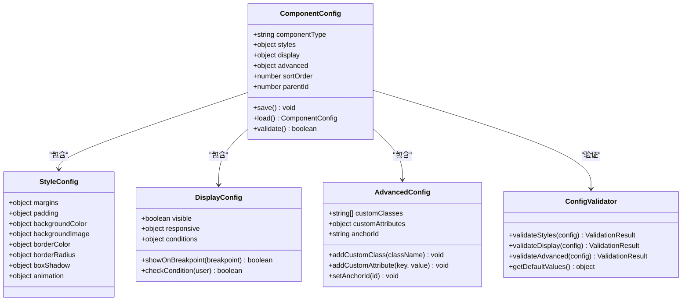
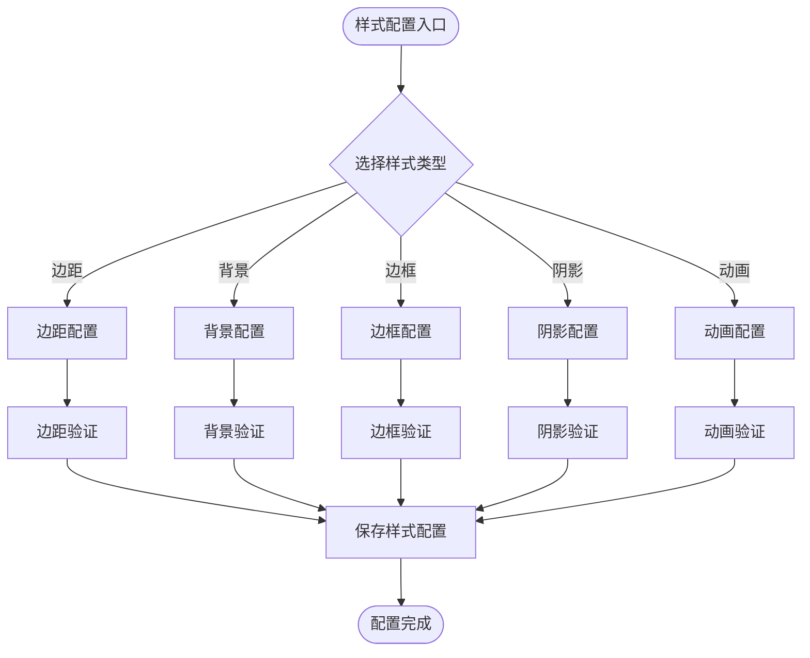
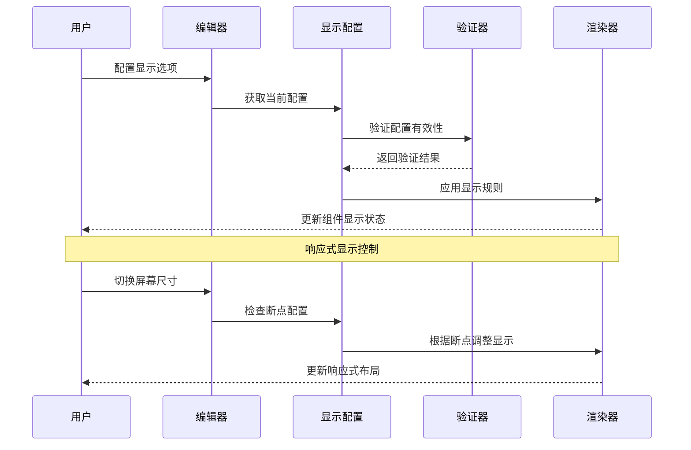
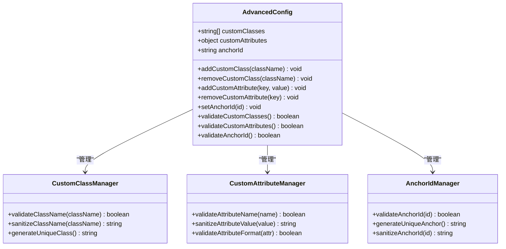
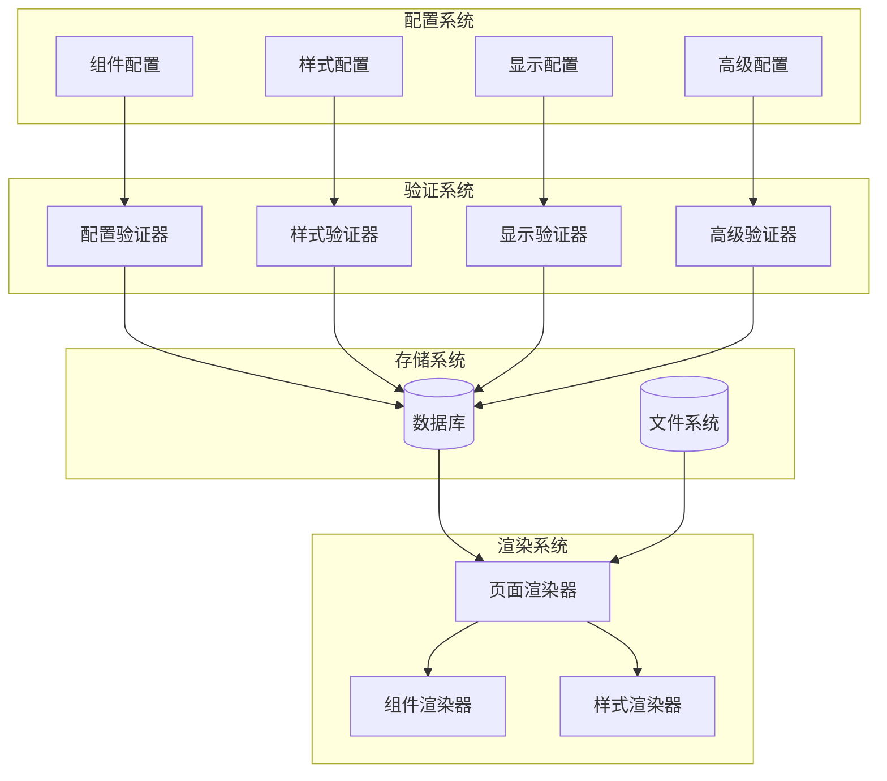
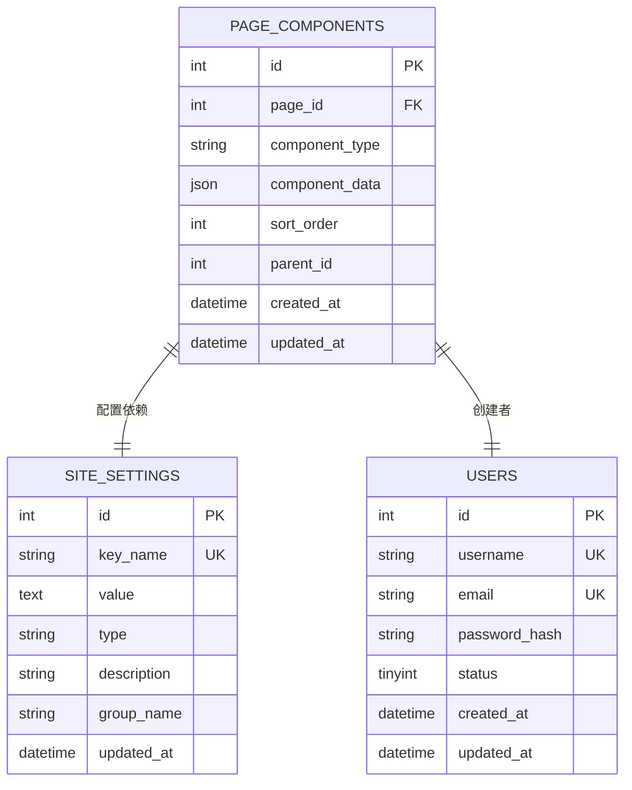

# 组件通用配置

<cite>
**本文档引用的文件**
- [企业网站CMS系统详细需求文档.md](file://企业网站CMS系统详细需求文档.md)
- [开发计划表_2月4日-2月12日.md](file://开发计划表_2月4日-2月12日.md)
</cite>

## 目录
1. [简介](#简介)
2. [项目结构](#项目结构)
3. [核心组件](#核心组件)
4. [架构概览](#架构概览)
5. [详细组件分析](#详细组件分析)
6. [依赖关系分析](#依赖关系分析)
7. [性能考虑](#性能考虑)
8. [故障排除指南](#故障排除指南)
9. [结论](#结论)

## 简介

组件通用配置是企业网站CMS系统的核心功能模块，为所有内容组件提供统一的样式配置、显示配置和高级配置选项。该系统支持可视化拖拽编辑，允许用户通过直观的界面配置组件的各种属性，包括样式设置、显示控制和高级定制功能。

系统采用前后端分离架构，后端使用Python Flask提供RESTful API，前端支持React/Vue或纯HTML模板渲染。组件配置采用JSON格式存储，便于持久化和版本管理。

## 项目结构

CMS系统采用模块化的项目结构，核心组件配置系统包含以下关键部分：

**图表来源**
- [企业网站CMS系统详细需求文档.md](file://企业网站CMS系统详细需求文档.md#L28-L57)
- [开发计划表_2月4日-2月12日.md](file://开发计划表_2月4日-2月12日.md#L92-L105)

**章节来源**
- [企业网站CMS系统详细需求文档.md](file://企业网站CMS系统详细需求文档.md#L28-L57)
- [开发计划表_2月4日-2月12日.md](file://开发计划表_2月4日-2月12日.md#L92-L105)

## 核心组件

组件通用配置系统包含三个主要配置类别：

### 样式配置

样式配置提供组件外观的全面控制，支持以下功能：

- **边距设置**: 支持margin和padding的独立配置，包括上、右、下、左四个方向
- **背景设置**: 支持颜色、图片、渐变等多种背景类型
- **边框设置**: 支持样式、颜色、圆角等边框属性配置
- **阴影效果**: 支持投影、内阴影等视觉效果
- **动画效果**: 支持淡入、滑入、缩放等过渡动画

### 显示配置

显示配置控制组件的可见性和行为：

- **显示/隐藏**: 基础的显示控制开关
- **响应式显示控制**: 针对不同屏幕尺寸的显示策略
- **条件显示**: 基于用户状态、时间等条件的动态显示

### 高级配置

高级配置提供深度定制能力：

- **自定义CSS类名**: 允许添加额外的CSS类进行样式扩展
- **自定义HTML属性**: 支持添加data-*等自定义属性
- **锚点ID设置**: 为组件设置唯一的标识符

**章节来源**
- [企业网站CMS系统详细需求文档.md](file://企业网站CMS系统详细需求文档.md#L214-L233)

## 架构概览

组件通用配置系统采用分层架构设计，确保配置的灵活性和可维护性：

**图表来源**
- [企业网站CMS系统详细需求文档.md](file://企业网站CMS系统详细需求文档.md#L214-L233)
- [开发计划表_2月4日-2月12日.md](file://开发计划表_2月4日-2月12日.md#L222-L224)

## 详细组件分析

### 样式配置系统

样式配置系统提供组件外观的全面控制，采用模块化设计：

**图表来源**
- [企业网站CMS系统详细需求文档.md](file://企业网站CMS系统详细需求文档.md#L216-L221)

#### 样式配置数据结构

样式配置采用JSON格式存储，支持以下数据结构：

| 配置项 | 数据类型 | 默认值 | 描述 |
|--------|----------|--------|------|
| margins | object | {top: 0, right: 0, bottom: 0, left: 0} | 组件外边距设置 |
| padding | object | {top: 0, right: 0, bottom: 0, left: 0} | 组件内边距设置 |
| backgroundColor | string | transparent | 背景色设置 |
| backgroundImage | object | null | 背景图片配置 |
| borderColor | object | {top: null, right: null, bottom: null, left: null} | 边框颜色配置 |
| borderRadius | object | {topLeft: 0, topRight: 0, bottomRight: 0, bottomLeft: 0} | 圆角半径设置 |
| boxShadow | object | null | 阴影效果配置 |
| animation | object | null | 动画效果配置 |

### 显示配置系统

显示配置系统控制组件的可见性和响应式行为：

**图表来源**
- [企业网站CMS系统详细需求文档.md](file://企业网站CMS系统详细需求文档.md#L223-L227)

#### 显示配置数据结构

显示配置支持以下数据结构：

| 配置项 | 数据类型 | 默认值 | 描述 |
|--------|----------|--------|------|
| visible | boolean | true | 组件可见性 |
| responsive | object | {xs: true, sm: true, md: true, lg: true, xl: true} | 响应式断点配置 |
| conditions | array | [] | 条件显示规则 |
| conditionType | string | "all" | 条件组合方式(all/any) |

### 高级配置系统

高级配置系统提供深度定制能力，支持组件的高级功能：

**图表来源**
- [企业网站CMS系统详细需求文档.md](file://企业网站CMS系统详细需求文档.md#L228-L232)

#### 高级配置数据结构

高级配置支持以下数据结构：

| 配置项 | 数据类型 | 默认值 | 描述 |
|--------|----------|--------|------|
| customClasses | array | [] | 自定义CSS类名数组 |
| customAttributes | object | {} | 自定义HTML属性对象 |
| anchorId | string | "" | 组件锚点ID |

**章节来源**
- [企业网站CMS系统详细需求文档.md](file://企业网站CMS系统详细需求文档.md#L214-L233)

## 依赖关系分析

组件通用配置系统与其他系统模块存在密切的依赖关系：

**图表来源**
- [开发计划表_2月4日-2月12日.md](file://开发计划表_2月4日-2月12日.md#L222-L224)
- [企业网站CMS系统详细需求文档.md](file://企业网站CMS系统详细需求文档.md#L863-L889)

### 数据持久化架构

组件配置采用JSON格式存储在数据库中，支持以下存储策略：

**图表来源**
- [企业网站CMS系统详细需求文档.md](file://企业网站CMS系统详细需求文档.md#L863-L889)

**章节来源**
- [开发计划表_2月4日-2月12日.md](file://开发计划表_2月4日-2月12日.md#L222-L224)
- [企业网站CMS系统详细需求文档.md](file://企业网站CMS系统详细需求文档.md#L863-L889)

## 性能考虑

组件通用配置系统在设计时充分考虑了性能优化：

### 配置验证性能

配置验证采用分层验证策略，减少不必要的验证开销：

- **即时验证**: 在用户输入时进行基本格式验证
- **延迟验证**: 在保存时进行完整验证
- **缓存机制**: 对常用配置进行缓存

### 渲染性能优化

- **虚拟DOM**: 使用虚拟DOM减少实际DOM操作
- **批量更新**: 批量应用配置更改
- **防抖机制**: 防止频繁的配置更新操作

### 存储性能优化

- **JSON存储**: 使用JSON格式存储，便于序列化和反序列化
- **索引优化**: 对常用查询字段建立索引
- **分页加载**: 大量配置时采用分页加载

## 故障排除指南

### 常见配置问题

| 问题类型 | 症状 | 解决方案 |
|----------|------|----------|
| 样式冲突 | 组件样式异常 | 检查自定义CSS类名冲突 |
| 显示异常 | 组件不可见或显示错误 | 验证响应式断点配置 |
| 配置丢失 | 保存后配置消失 | 检查数据库连接和权限 |
| 性能问题 | 页面加载缓慢 | 优化配置复杂度和验证逻辑 |

### 配置验证错误

系统提供详细的配置验证错误信息：

- **样式验证错误**: 包括颜色格式、单位验证等
- **显示验证错误**: 包括断点值范围、条件语法等
- **高级配置错误**: 包括类名格式、属性名称等

### 调试工具

- **配置检查器**: 实时显示配置状态和验证结果
- **性能监控**: 监控配置操作的性能指标
- **错误日志**: 记录配置相关的错误信息

**章节来源**
- [企业网站CMS系统详细需求文档.md](file://企业网站CMS系统详细需求文档.md#L1360-L1460)

## 结论

组件通用配置系统为企业网站CMS提供了强大而灵活的配置能力。通过模块化的架构设计，系统支持样式的全面控制、显示的精细管理以及高级的定制功能。

系统的主要优势包括：

1. **统一配置接口**: 所有组件共享相同的配置界面和数据结构
2. **可视化编辑**: 通过拖拽和直观的界面进行配置
3. **灵活存储**: 采用JSON格式存储，便于扩展和维护
4. **性能优化**: 通过多种优化策略确保系统性能
5. **安全保障**: 完善的验证和安全机制

该系统为企业的网站管理提供了强大的技术支持，降低了技术门槛，提升了网站管理效率。通过持续的优化和扩展，系统能够满足企业不断发展的需求。