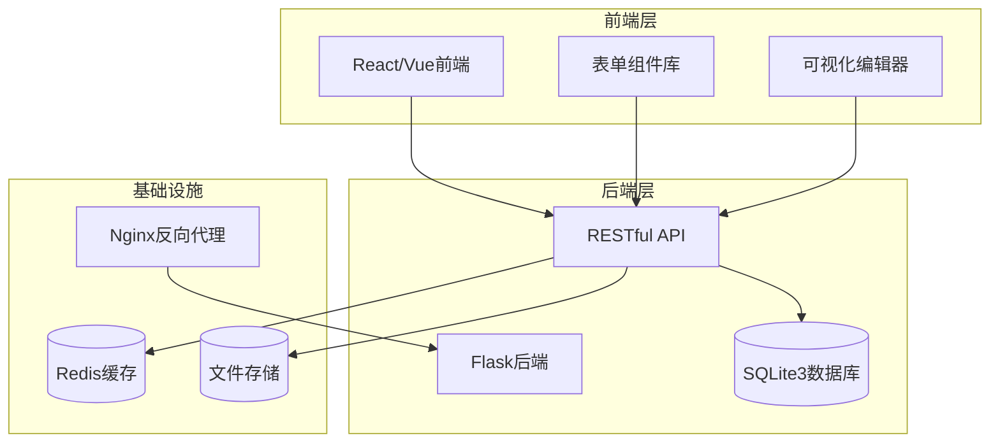
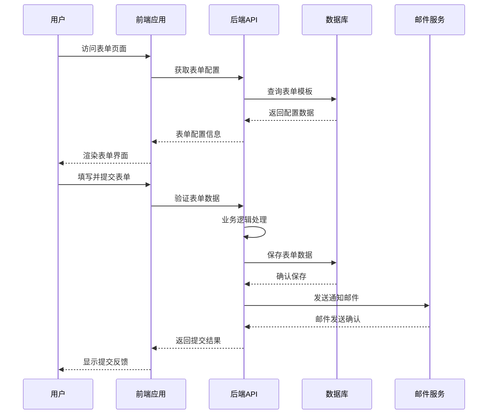
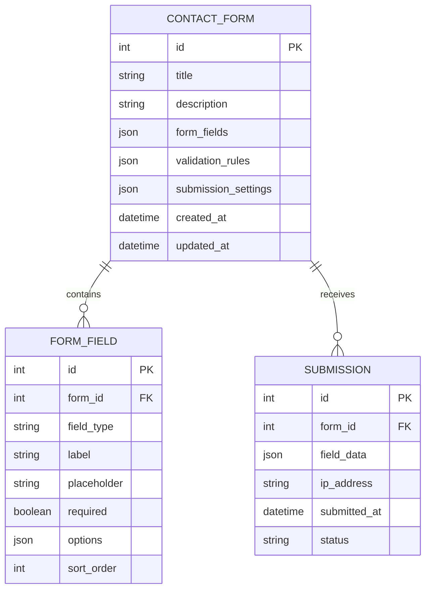
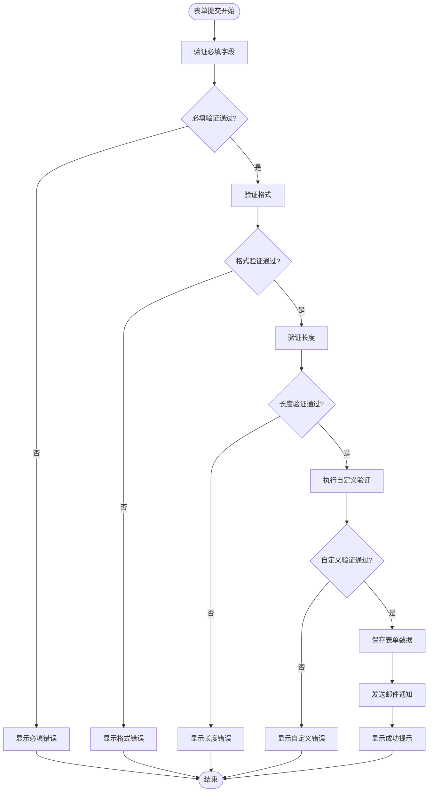
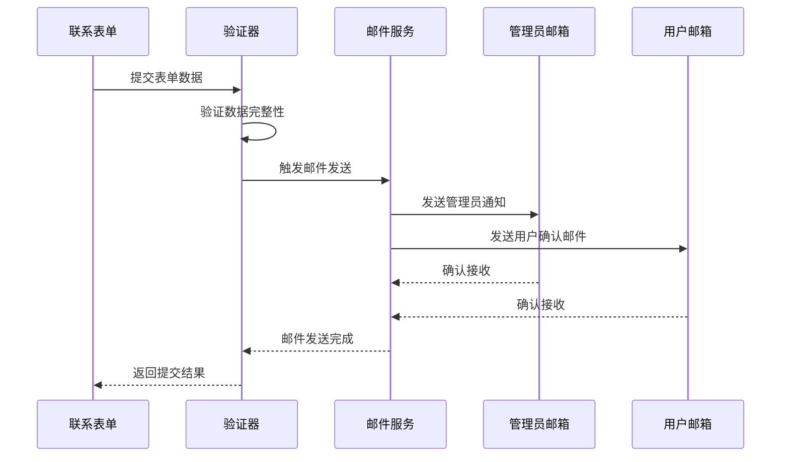
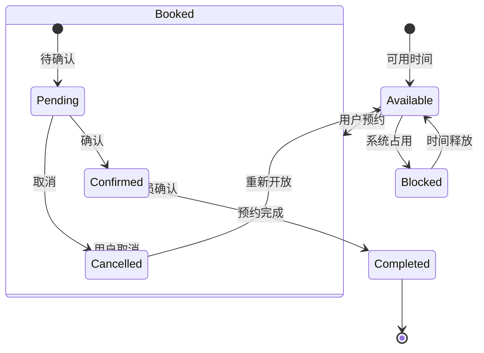
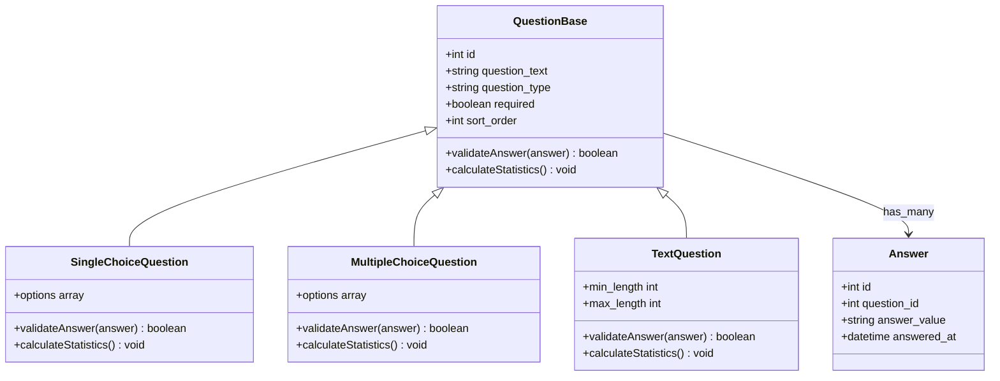
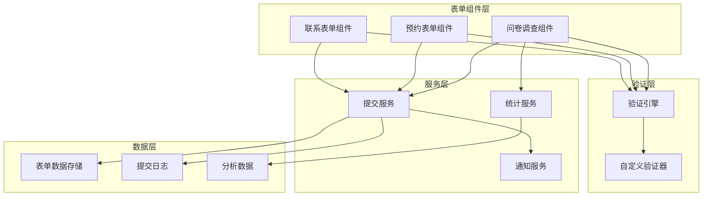

# 表单交互组件

<cite>
**本文档引用的文件**
- [企业网站CMS系统开发需求文档.ini](file://企业网站CMS系统开发需求文档.ini)
- [企业网站CMS系统详细需求文档.md](file://企业网站CMS系统详细需求文档.md)
- [开发计划表_2月4日-2月12日.md](file://开发计划表_2月4日-2月12日.md)
</cite>

## 目录
1. [简介](#简介)
2. [项目结构](#项目结构)
3. [核心组件](#核心组件)
4. [架构概览](#架构概览)
5. [详细组件分析](#详细组件分析)
6. [依赖关系分析](#依赖关系分析)
7. [性能考虑](#性能考虑)
8. [故障排除指南](#故障排除指南)
9. [结论](#结论)

## 简介

本文档详细介绍了企业网站CMS系统的表单交互组件，包括联系表单、预约表单和问卷调查等核心功能模块。该系统采用Python Flask + 前端React/Vue的技术栈，支持可视化拖拽配置，为用户提供直观的表单设计和管理体验。

系统的核心目标是为企业官网提供功能完善的表单解决方案，支持多种表单类型、丰富的验证规则、灵活的配置选项以及安全的数据传输机制。

## 项目结构

基于开发计划和需求文档，表单交互组件在整体项目中的位置和职责如下：

**图表来源**
- [开发计划表_2月4日-2月12日.md](file://开发计划表_2月4日-2月12日.md#L92-L105)
- [企业网站CMS系统详细需求文档.md](file://企业网站CMS系统详细需求文档.md#L28-L57)

**章节来源**
- [开发计划表_2月4日-2月12日.md](file://开发计划表_2月4日-2月12日.md#L58-L83)
- [企业网站CMS系统详细需求文档.md](file://企业网站CMS系统详细需求文档.md#L22-L57)

## 核心组件

### 联系表单组件

联系表单作为最基础的表单类型，提供了企业网站必备的客户沟通渠道。

**字段类型支持**：
- 文本字段：支持单行和多行文本输入
- 邮箱字段：专用邮箱格式验证
- 电话字段：电话号码格式验证
- 下拉选择：单选下拉菜单
- 多选字段：复选框组
- 日期字段：日期选择器

**表单验证规则**：
- 必填字段验证：确保关键信息完整
- 格式验证：邮箱、电话号码等特定格式
- 长度验证：字符数量限制
- 自定义验证：支持业务特定规则

**高级功能**：
- 自定义提交成功提示：可配置个性化反馈消息
- 邮件通知功能：自动发送邮件到指定邮箱
- 数据持久化：所有提交数据安全存储

### 预约表单组件

预约表单专为企业客户服务场景设计，提供专业的预约管理功能。

**核心特性**：
- 日期时间选择器：直观的日历和时间选择界面
- 可用时段设置：灵活配置可预约时间段
- 预约状态管理：支持待确认、已确认、已取消等状态
- 用户体验优化：智能防重复提交、实时可用性检查

**技术实现**：
- 前端交互优化：即时反馈和错误提示
- 后端数据验证：确保预约时间的有效性
- 状态流转控制：严格的预约状态管理

### 问卷调查组件

问卷调查功能支持多种题型，满足企业调研和反馈收集需求。

**题型支持**：
- 单选题：提供互斥的答案选项
- 多选题：允许多个答案选择
- 简答题：开放式文本回答

**统计功能**：
- 实时结果统计：动态显示投票结果
- 数据可视化：图表形式展示统计数据
- 结果导出：支持Excel等格式的数据导出

**章节来源**
- [企业网站CMS系统详细需求文档.md](file://企业网站CMS系统详细需求文档.md#L150-L163)

## 架构概览

表单交互组件采用前后端分离的架构设计，确保良好的用户体验和可维护性：

**图表来源**
- [企业网站CMS系统详细需求文档.md](file://企业网站CMS系统详细需求文档.md#L555-L594)
- [开发计划表_2月4日-2月12日.md](file://开发计划表_2月4日-2月12日.md#L150-L174)

## 详细组件分析

### 联系表单组件分析

#### 数据结构设计

联系表单的数据结构设计充分考虑了灵活性和扩展性：

**图表来源**
- [企业网站CMS系统详细需求文档.md](file://企业网站CMS系统详细需求文档.md#L714-L768)

#### 表单验证流程

联系表单的验证流程确保数据质量和用户体验：

**图表来源**
- [企业网站CMS系统详细需求文档.md](file://企业网站CMS系统详细需求文档.md#L151-L155)

#### 邮件通知机制

邮件通知功能确保重要表单数据能够及时传达给相关人员：

**图表来源**
- [开发计划表_2月4日-2月12日.md](file://开发计划表_2月4日-2月12日.md#L416-L421)

**章节来源**
- [企业网站CMS系统详细需求文档.md](file://企业网站CMS系统详细需求文档.md#L151-L155)
- [开发计划表_2月4日-2月12日.md](file://开发计划表_2月4日-2月12日.md#L416-L421)

### 预约表单组件分析

#### 时间管理机制

预约表单的时间管理是其核心功能之一，涉及复杂的时区处理和冲突检测：

**图表来源**
- [企业网站CMS系统详细需求文档.md](file://企业网站CMS系统详细需求文档.md#L156-L159)

#### 防重复提交机制

为了防止恶意刷单和重复提交，系统实现了多重防护机制：

**技术实现要点**：
- Token令牌机制：每个表单生成唯一标识
- 时间窗口限制：防止短时间内重复提交
- IP地址跟踪：监控异常提交行为
- 用户会话绑定：与用户登录状态关联

**章节来源**
- [企业网站CMS系统详细需求文档.md](file://企业网站CMS系统详细需求文档.md#L156-L159)

### 问卷调查组件分析

#### 题型支持架构

问卷调查组件支持多种题型，每种题型都有相应的数据处理和统计逻辑：

**图表来源**
- [企业网站CMS系统详细需求文档.md](file://企业网站CMS系统详细需求文档.md#L160-L162)

#### 数据统计与导出

问卷调查的结果统计和导出功能为企业决策提供数据支持：

**统计功能**：
- 实时统计：基于AJAX的动态数据更新
- 汇总报表：按题型和时间段的统计分析
- 数据可视化：柱状图、饼图等多种图表形式

**导出机制**：
- Excel格式：支持多工作表的数据导出
- CSV格式：便于第三方工具处理
- PDF报告：生成专业的统计报告

**章节来源**
- [企业网站CMS系统详细需求文档.md](file://企业网站CMS系统详细需求文档.md#L160-L162)

## 依赖关系分析

表单交互组件在整个系统中的依赖关系体现了清晰的分层架构：

**图表来源**
- [开发计划表_2月4日-2月12日.md](file://开发计划表_2月4日-2月12日.md#L92-L105)

**章节来源**
- [开发计划表_2月4日-2月12日.md](file://开发计划表_2月4日-2月12日.md#L92-L105)

## 性能考虑

### 前端性能优化

**表单渲染优化**：
- 虚拟滚动：大量选项时使用虚拟化技术
- 懒加载：按需加载表单组件
- 缓存策略：重复使用的表单配置缓存

**交互响应优化**：
- 防抖处理：输入验证的防抖机制
- 实时预览：即时反馈用户操作
- 错误边界：优雅处理表单错误

### 后端性能优化

**数据库优化**：
- 索引策略：针对常用查询字段建立索引
- 连接池：数据库连接复用
- 查询优化：避免N+1查询问题

**缓存策略**：
- 配置缓存：表单配置信息缓存
- 统计缓存：问卷统计结果缓存
- 响应缓存：静态表单页面缓存

## 故障排除指南

### 常见问题诊断

**表单提交失败**：
1. 检查网络连接和API可达性
2. 验证表单配置是否正确
3. 查看服务器日志获取详细错误信息

**验证规则不生效**：
1. 确认前端验证库正确加载
2. 检查自定义验证器的实现
3. 验证后端验证逻辑

**邮件通知失败**：
1. 检查SMTP服务器配置
2. 验证发件人邮箱设置
3. 查看邮件服务日志

### 性能问题排查

**表单加载缓慢**：
1. 分析前端Bundle大小
2. 检查API响应时间
3. 优化数据库查询

**高并发问题**：
1. 检查服务器资源使用情况
2. 评估数据库连接池配置
3. 考虑引入Redis缓存

**章节来源**
- [开发计划表_2月4日-2月12日.md](file://开发计划表_2月4日-2月12日.md#L589-L625)

## 结论

表单交互组件作为企业网站CMS系统的核心功能模块，展现了现代Web应用的完整架构设计。通过联系表单、预约表单和问卷调查三大组件的协同工作，系统为企业提供了全面的用户交互解决方案。

**主要优势**：
- **模块化设计**：清晰的组件分离和职责划分
- **可扩展性**：支持自定义字段类型和验证规则
- **安全性**：多重防护机制确保数据安全
- **用户体验**：直观的界面和流畅的交互体验

**技术特色**：
- 前后端分离架构，便于维护和扩展
- 可视化编辑器，降低技术门槛
- 完善的验证和错误处理机制
- 灵活的通知和统计功能

该系统为企业的数字化转型提供了坚实的技术基础，通过持续的功能迭代和性能优化，将为企业创造更大的价值。