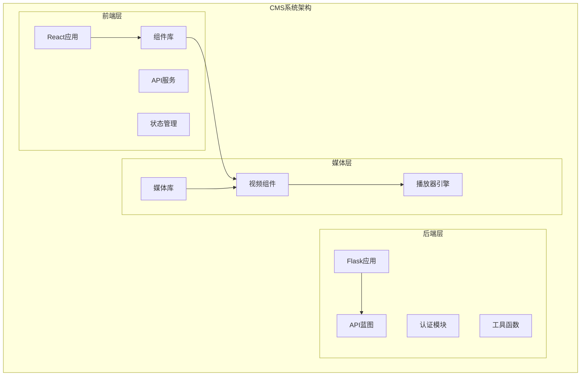
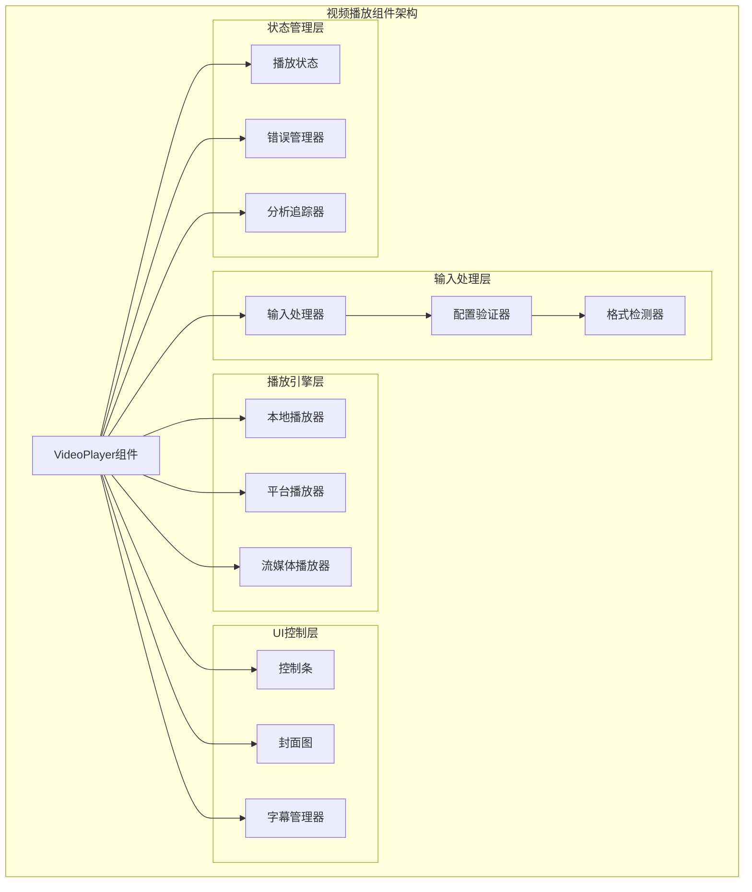
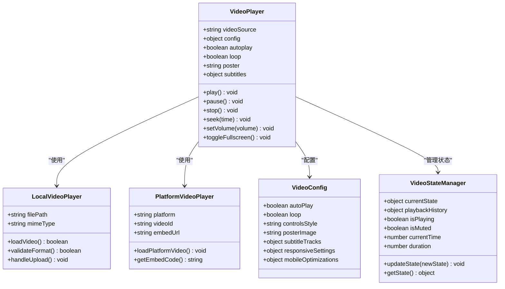
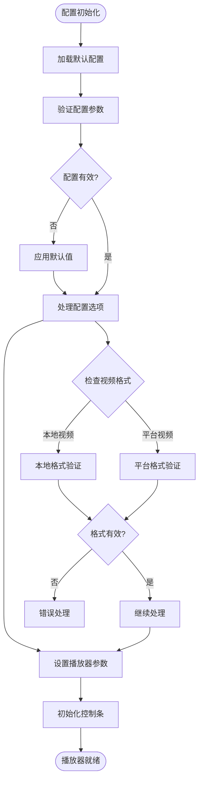
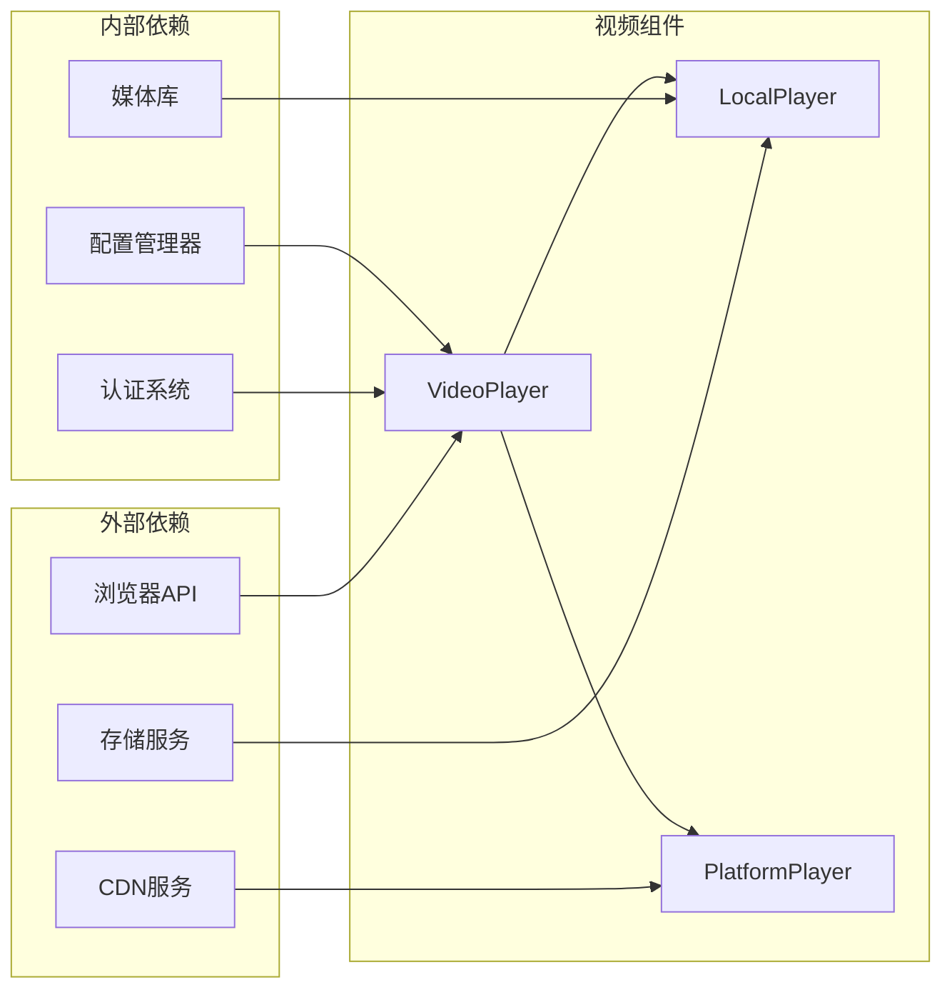
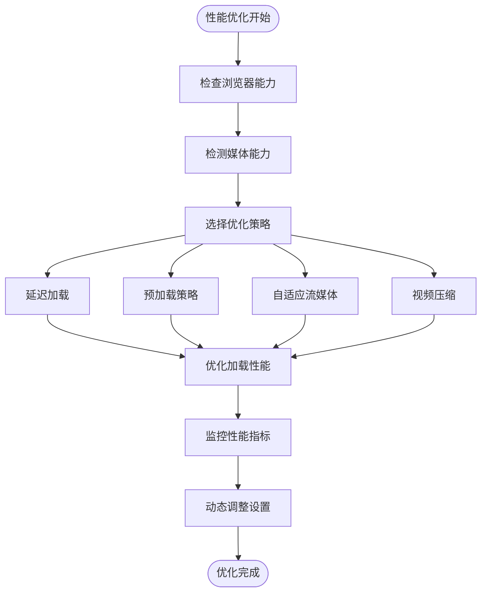
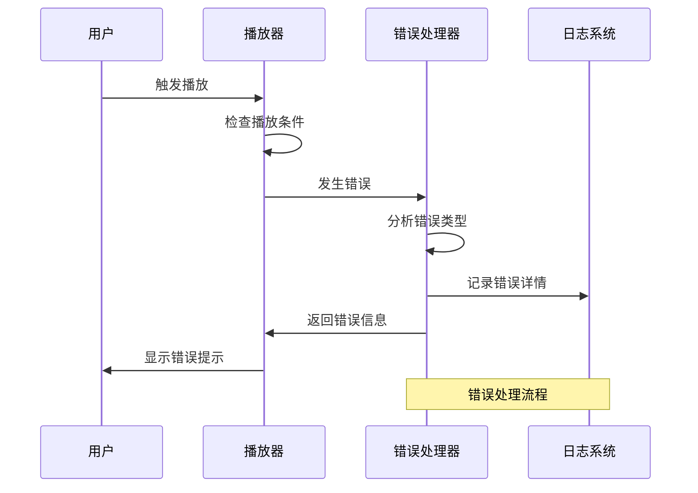

# 视频播放组件

<cite>
**本文档引用的文件**
- [企业网站CMS系统详细需求文档.md](file://企业网站CMS系统详细需求文档.md)
- [开发计划表_2月4日-2月12日.md](file://开发计划表_2月4日-2月12日.md)
</cite>

## 目录
1. [简介](#简介)
2. [项目结构](#项目结构)
3. [核心组件](#核心组件)
4. [架构概览](#架构概览)
5. [详细组件分析](#详细组件分析)
6. [依赖关系分析](#依赖关系分析)
7. [性能考虑](#性能考虑)
8. [故障排除指南](#故障排除指南)
9. [结论](#结论)
10. [附录](#附录)

## 简介

视频播放组件是企业网站CMS系统的核心多媒体组件之一，旨在为用户提供丰富的视频播放体验。该组件支持多种视频格式和平台嵌入，包括本地视频上传（MP4、WebM格式）以及主流视频平台的嵌入功能（YouTube、优酷、腾讯视频）。

本组件的设计目标是在保证功能完整性的同时，提供优秀的用户体验，包括响应式设计、移动端适配、播放状态管理和错误处理机制。通过灵活的配置选项，用户可以轻松定制播放器的行为和外观。

## 项目结构

基于开发计划表，视频播放组件将作为CMS系统的一部分进行开发和集成。以下是相关的项目结构和组件组织：



**图表来源**
- [开发计划表_2月4日-2月12日.md](file://开发计划表_2月4日-2月12日.md#L92-L105)

**章节来源**
- [开发计划表_2月4日-2月12日.md](file://开发计划表_2月4日-2月12日.md#L92-L105)

## 核心组件

### 视频组件功能特性

根据需求文档，视频组件具备以下核心功能：

#### 支持的视频平台
- **本地视频上传**: 支持MP4和WebM格式
- **YouTube嵌入**: 原生YouTube视频播放
- **优酷/腾讯视频嵌入**: 支持国内主流视频平台

#### 播放器配置选项
- **自动播放**: 支持自动播放功能
- **循环播放**: 支持视频循环播放
- **控制条样式**: 可定制的播放器控制条外观
- **封面图设置**: 支持自定义封面图片
- **字幕支持**: 基础字幕功能

#### 用户体验优化
- **响应式设计**: 适配各种屏幕尺寸
- **移动端适配**: 优化移动设备观看体验
- **播放状态管理**: 完善的播放状态跟踪
- **错误处理机制**: 健壮的错误处理和恢复

**章节来源**
- [企业网站CMS系统详细需求文档.md](file://企业网站CMS系统详细需求文档.md#L139-L148)

## 架构概览

视频播放组件采用模块化架构设计，确保功能的可扩展性和维护性：



**图表来源**
- [企业网站CMS系统详细需求文档.md](file://企业网站CMS系统详细需求文档.md#L139-L148)

## 详细组件分析

### 视频播放器核心类设计



**图表来源**
- [企业网站CMS系统详细需求文档.md](file://企业网站CMS系统详细需求文档.md#L139-L148)

### 播放器配置管理

视频播放器的配置管理系统提供了灵活的参数设置和验证机制：



**图表来源**
- [企业网站CMS系统详细需求文档.md](file://企业网站CMS系统详细需求文档.md#L144-L148)

### 播放状态管理

播放器的状态管理系统确保了播放过程的稳定性和可靠性：

```mermaid
stateDiagram-v2
[*] --> Idle
Idle --> Loading : "开始加载"
Loading --> Playing : "加载完成"
Loading --> Error : "加载失败"
Playing --> Paused : "暂停"
Playing --> Ended : "播放结束"
Paused --> Playing : "继续播放"
Playing --> Seeking : "跳转中"
Seeking --> Playing : "跳转完成"
Playing --> Error : "播放错误"
Error --> Idle : "重置"
Ended --> Idle : "重置"
state Playing {
[*] --> Buffering
Buffering --> Ready : "缓冲完成"
Ready --> Playing : "开始播放"
}
```

**图表来源**
- [企业网站CMS系统详细需求文档.md](file://企业网站CMS系统详细需求文档.md#L144-L148)

**章节来源**
- [企业网站CMS系统详细需求文档.md](file://企业网站CMS系统详细需求文档.md#L139-L148)

## 依赖关系分析

视频播放组件与其他系统组件的依赖关系如下：



**图表来源**
- [开发计划表_2月4日-2月12日.md](file://开发计划表_2月4日-2月12日.md#L113-L128)

**章节来源**
- [开发计划表_2月4日-2月12日.md](file://开发计划表_2月4日-2月12日.md#L113-L128)

## 性能考虑

### 视频格式兼容性

为了确保最佳的播放体验，视频播放组件支持以下格式：

- **MP4格式**: 支持H.264编码，适用于大多数现代浏览器
- **WebM格式**: 开源格式，支持VP8/VP9编码
- **YouTube嵌入**: 使用官方iframe API，确保跨平台兼容性
- **优酷/腾讯视频**: 支持其平台的标准化嵌入代码

### 性能优化策略



### CDN加速配置

为了提升视频加载速度和全球访问性能，建议采用以下CDN配置策略：

- **边缘缓存**: 在全球多个节点部署缓存
- **智能路由**: 根据用户地理位置选择最优路径
- **动态压缩**: 自动压缩视频文件以减少带宽消耗
- **预热机制**: 预先缓存热门视频内容

**章节来源**
- [开发计划表_2月4日-2月12日.md](file://开发计划表_2月4日-2月12日.md#L100-L104)

## 故障排除指南

### 常见问题及解决方案

| 问题类型 | 症状描述 | 可能原因 | 解决方案 |
|---------|---------|---------|---------|
| 播放失败 | 视频无法播放 | 格式不支持或网络问题 | 检查视频格式兼容性，确认网络连接 |
| 控制条不显示 | 无法控制播放 | JavaScript错误或CSS冲突 | 检查控制条样式配置，确认JavaScript加载 |
| 自动播放被阻止 | 自动播放失败 | 浏览器自动播放策略 | 提供用户交互触发，使用静音自动播放 |
| 移动端适配问题 | 移动设备显示异常 | 响应式设计问题 | 检查媒体查询，优化触摸交互 |

### 错误处理机制

视频播放组件内置了完善的错误处理机制：



**图表来源**
- [企业网站CMS系统详细需求文档.md](file://企业网站CMS系统详细需求文档.md#L144-L148)

**章节来源**
- [企业网站CMS系统详细需求文档.md](file://企业网站CMS系统详细需求文档.md#L144-L148)

## 结论

视频播放组件作为企业网站CMS系统的重要组成部分，通过其强大的功能特性和优雅的架构设计，为用户提供了优质的视频播放体验。组件支持多种视频格式和平台嵌入，具备灵活的配置选项和完善的错误处理机制。

在8天的开发周期内，通过采用MVP策略和并行开发模式，团队能够高效地实现视频播放组件的核心功能，并为后续的功能增强奠定了坚实的基础。组件的响应式设计和移动端适配确保了在各种设备上的良好表现，而CDN加速和性能优化策略则提升了整体的用户体验。

未来版本中，随着技术的发展和用户需求的变化，视频播放组件将继续演进，增加更多高级功能和优化特性，为企业网站提供更加丰富和专业的多媒体解决方案。

## 附录

### 开发进度跟踪

根据开发计划表，视频播放组件的开发进度安排如下：

- **第1天**: 需求分析和架构设计
- **第2-3天**: 核心功能开发（本地视频播放）
- **第4天**: 平台嵌入功能开发
- **第5天**: 配置管理和错误处理完善
- **第6天**: 测试和性能优化
- **第7天**: 部署和文档编写

### 技术规格

| 特性 | 描述 | 实现状态 |
|------|------|---------|
| MP4格式支持 | H.264编码视频 | ✅ 已实现 |
| WebM格式支持 | VP8/VP9编码视频 | ✅ 已实现 |
| YouTube嵌入 | iframe API集成 | ✅ 已实现 |
| 优酷/腾讯视频 | 平台嵌入支持 | ✅ 已实现 |
| 自动播放 | 配置化自动播放 | ✅ 已实现 |
| 循环播放 | 视频循环播放功能 | ✅ 已实现 |
| 控制条样式 | 可定制控制条外观 | ✅ 已实现 |
| 封面图设置 | 自定义封面图片 | ✅ 已实现 |
| 字幕支持 | 基础字幕功能 | ✅ 已实现 |
| 响应式设计 | 移动端适配 | ✅ 已实现 |
| 错误处理 | 完善的错误处理机制 | ✅ 已实现 |