# 高级展示组件

<cite>
**本文档引用的文件**
- [企业网站CMS系统开发需求文档.ini](file://企业网站CMS系统开发需求文档.ini)
- [企业网站CMS系统详细需求文档.md](file://企业网站CMS系统详细需求文档.md)
- [开发计划表_2月4日-2月12日.md](file://开发计划表_2月4日-2月12日.md)
</cite>

## 目录
1. [简介](#简介)
2. [项目结构](#项目结构)
3. [核心组件](#核心组件)
4. [架构概览](#架构概览)
5. [详细组件分析](#详细组件分析)
6. [依赖关系分析](#依赖关系分析)
7. [性能考虑](#性能考虑)
8. [故障排除指南](#故障排除指南)
9. [结论](#结论)

## 简介

企业网站CMS系统旨在为企业提供一套功能完善、易于维护的企业官网内容管理系统。该系统支持可视化拖拽配置，降低技术门槛，提升网站管理效率。本文档专注于高级展示组件的设计与实现，涵盖Tab标签页、折叠面板、统计数字、时间轴、团队成员和客户案例等核心组件。

## 项目结构

基于需求文档分析，企业网站CMS系统采用前后端分离架构，主要包含以下技术栈：

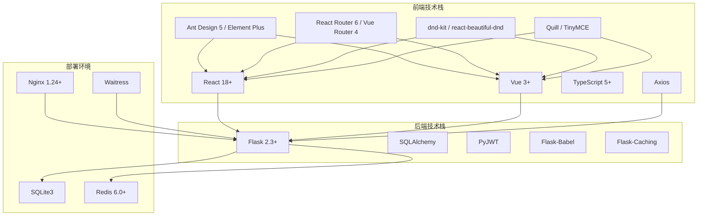

**图表来源**
- [企业网站CMS系统详细需求文档.md](file://企业网站CMS系统详细需求文档.md#L595-L628)
- [企业网站CMS系统详细需求文档.md](file://企业网站CMS系统详细需求文档.md#L555-L594)

**章节来源**
- [企业网站CMS系统详细需求文档.md](file://企业网站CMS系统详细需求文档.md#L22-L57)
- [企业网站CMS系统详细需求文档.md](file://企业网站CMS系统详细需求文档.md#L595-L628)

## 核心组件

根据需求文档，系统包含以下高级展示组件：

### Tab标签页组件
- 多标签页切换功能
- 标签样式自定义
- 默认激活标签设置

### 折叠面板组件
- 手风琴效果
- 多个面板同时展开
- 展开/折叠动画

### 统计数字组件
- 数字滚动动画
- 前缀/后缀符号配置
- 图标设置

### 时间轴组件
- 垂直/水平时间轴
- 时间节点样式
- 事件描述功能

### 团队成员组件
- 成员卡片布局
- 头像、姓名、职位、简介配置
- 社交链接集成

### 客户案例/合作伙伴组件
- Logo墙展示
- 案例详情页链接
- 分类筛选功能

**章节来源**
- [企业网站CMS系统详细需求文档.md](file://企业网站CMS系统详细需求文档.md#L182-L213)

## 架构概览

系统采用混合模式支持，既支持纯HTML模板渲染，也支持SPA单页应用两种模式：

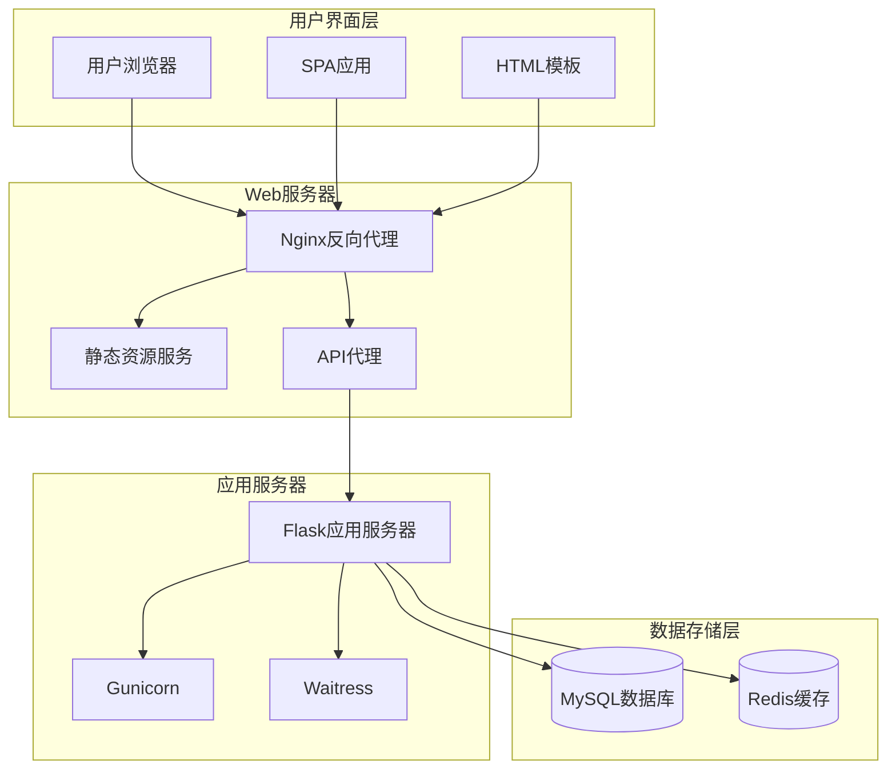

**图表来源**
- [企业网站CMS系统详细需求文档.md](file://企业网站CMS系统详细需求文档.md#L28-L57)

**章节来源**
- [企业网站CMS系统详细需求文档.md](file://企业网站CMS系统详细需求文档.md#L22-L57)

## 详细组件分析

### Tab标签页组件

Tab标签页组件是企业网站中常用的导航组件，用于组织和展示大量相关内容。

#### 功能特性
- **多标签页切换**：支持多个内容区域的切换显示
- **标签样式自定义**：支持不同的标签样式和主题
- **默认激活标签设置**：可以设置默认显示的标签页

#### 设计模式
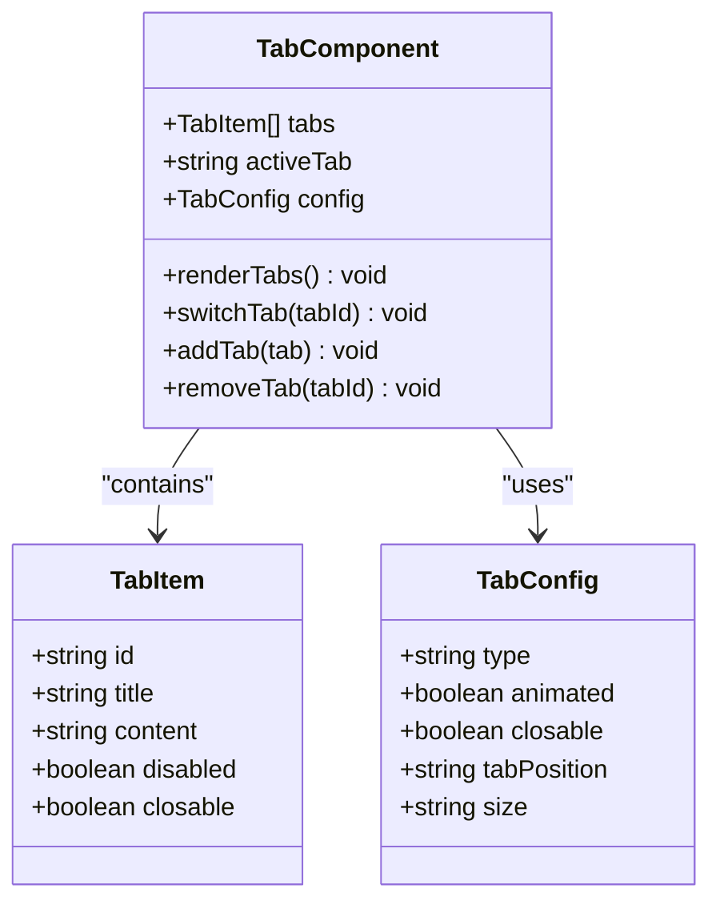

**图表来源**
- [企业网站CMS系统详细需求文档.md](file://企业网站CMS系统详细需求文档.md#L184-L187)

#### 交互流程
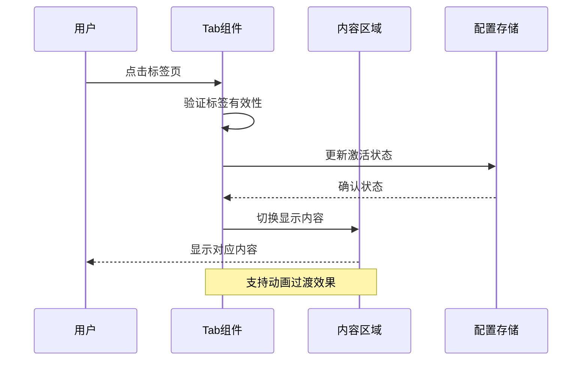

**图表来源**
- [企业网站CMS系统详细需求文档.md](file://企业网站CMS系统详细需求文档.md#L184-L187)

**章节来源**
- [企业网站CMS系统详细需求文档.md](file://企业网站CMS系统详细需求文档.md#L184-L187)

### 折叠面板组件

折叠面板组件用于在有限的空间内展示层次化的信息结构。

#### 功能特性
- **手风琴效果**：同一时间只能展开一个面板
- **多个面板同时展开**：支持同时展开多个面板
- **展开/折叠动画**：平滑的动画过渡效果

#### 设计模式
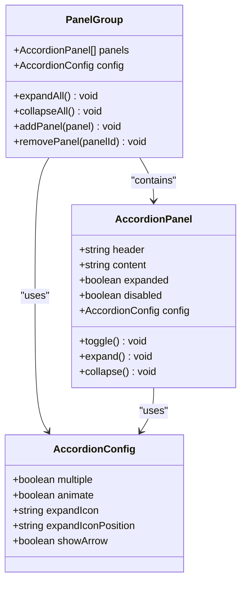

**图表来源**
- [企业网站CMS系统详细需求文档.md](file://企业网站CMS系统详细需求文档.md#L189-L192)

#### 动画实现
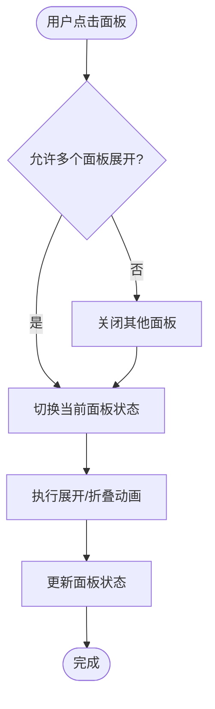

**图表来源**
- [企业网站CMS系统详细需求文档.md](file://企业网站CMS系统详细需求文档.md#L189-L192)

**章节来源**
- [企业网站CMS系统详细需求文档.md](file://企业网站CMS系统详细需求文档.md#L189-L192)

### 统计数字组件

统计数字组件用于突出显示关键数据指标，常用于首页或仪表板。

#### 功能特性
- **数字滚动动画**：数字从起始值平滑滚动到目标值
- **前缀/后缀符号**：支持货币符号、百分比等标识
- **图标设置**：可配置相关的图标来增强视觉效果

#### 设计模式
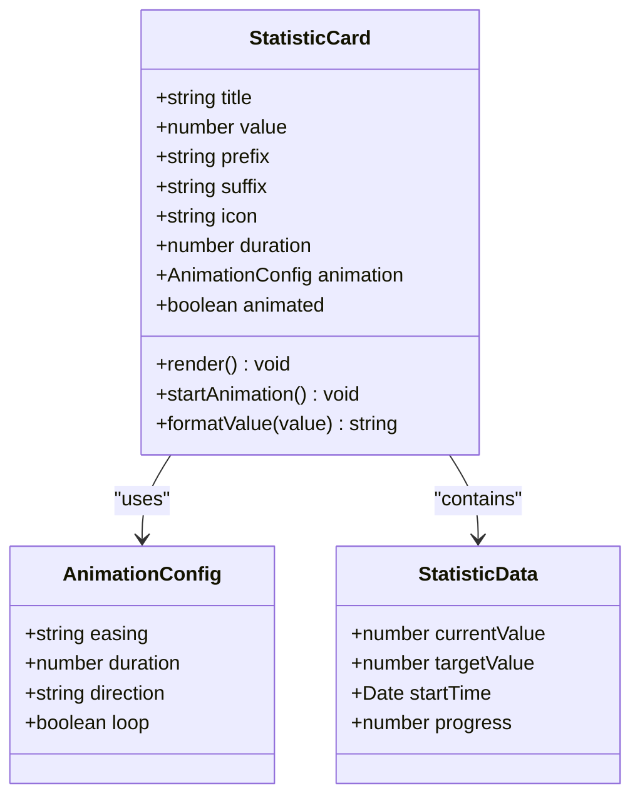

**图表来源**
- [企业网站CMS系统详细需求文档.md](file://企业网站CMS系统详细需求文档.md#L194-L197)

#### 数字滚动算法
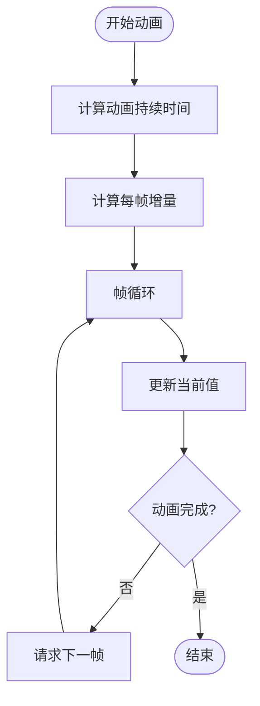

**图表来源**
- [企业网站CMS系统详细需求文档.md](file://企业网站CMS系统详细需求文档.md#L194-L197)

**章节来源**
- [企业网站CMS系统详细需求文档.md](file://企业网站CMS系统详细需求文档.md#L194-L197)

### 时间轴组件

时间轴组件用于展示事件的时间顺序和发展历程。

#### 功能特性
- **垂直/水平时间轴**：支持不同的布局方向
- **时间节点样式**：可自定义时间点的外观
- **事件描述功能**：支持详细的事件说明

#### 设计模式
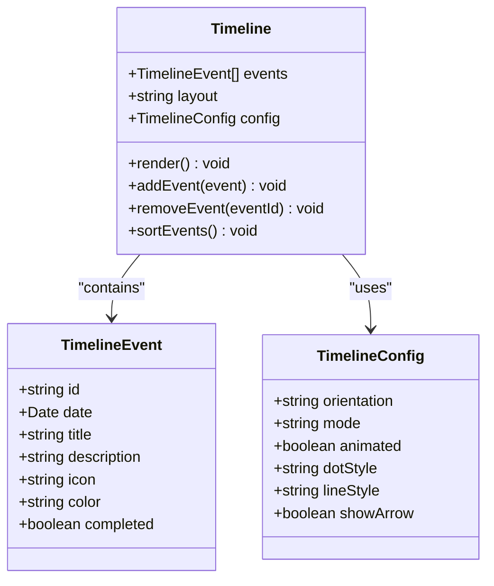

**图表来源**
- [企业网站CMS系统详细需求文档.md](file://企业网站CMS系统详细需求文档.md#L199-L202)

#### 布局算法
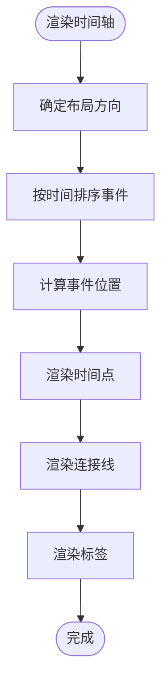

**图表来源**
- [企业网站CMS系统详细需求文档.md](file://企业网站CMS系统详细需求文档.md#L199-L202)

**章节来源**
- [企业网站CMS系统详细需求文档.md](file://企业网站CMS系统详细需求文档.md#L199-L202)

### 团队成员组件

团队成员组件用于展示公司团队成员的信息和联系方式。

#### 功能特性
- **成员卡片布局**：整齐的卡片式布局
- **头像、姓名、职位、简介配置**：完整的个人信息展示
- **社交链接集成**：支持各种社交平台链接

#### 设计模式
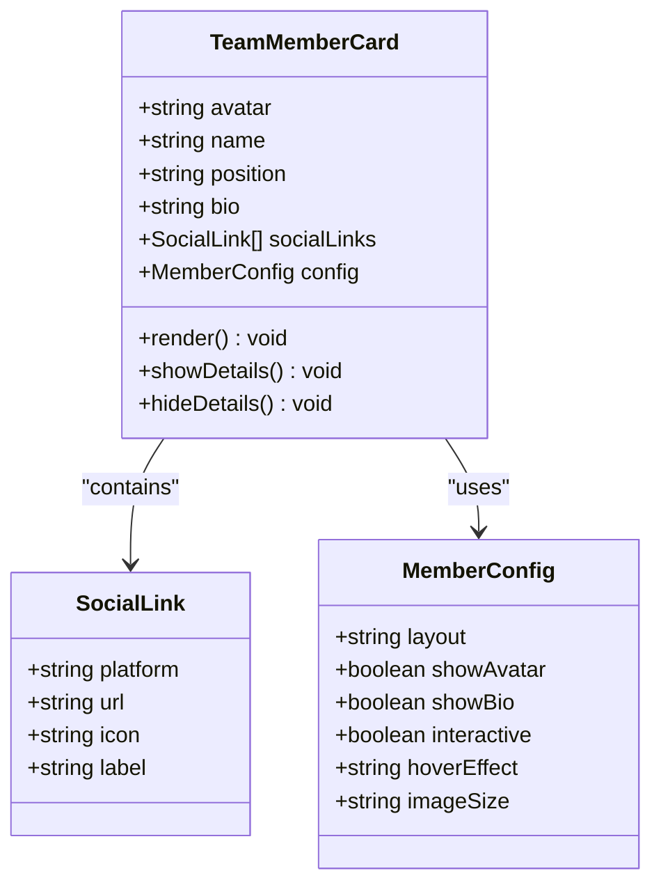

**图表来源**
- [企业网站CMS系统详细需求文档.md](file://企业网站CMS系统详细需求文档.md#L204-L207)

#### 交互设计
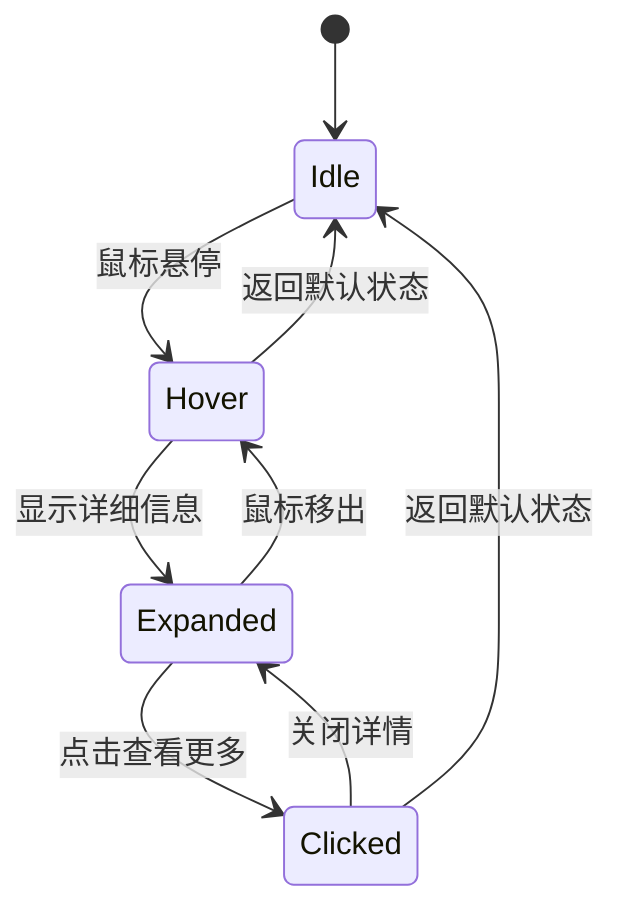

**图表来源**
- [企业网站CMS系统详细需求文档.md](file://企业网站CMS系统详细需求文档.md#L204-L207)

**章节来源**
- [企业网站CMS系统详细需求文档.md](file://企业网站CMS系统详细需求文档.md#L204-L207)

### 客户案例/合作伙伴组件

客户案例组件用于展示公司的成功案例和合作伙伴关系。

#### 功能特性
- **Logo墙展示**：美观的Logo排列展示
- **案例详情页链接**：点击进入详细案例页面
- **分类筛选功能**：支持按类别筛选案例

#### 设计模式
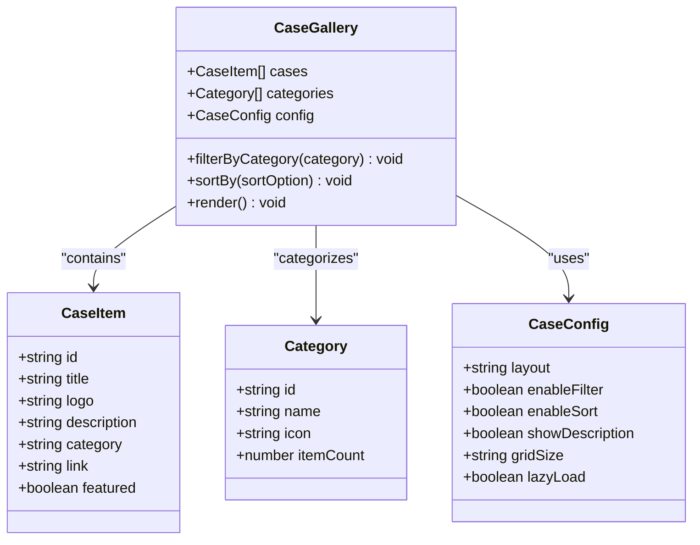

**图表来源**
- [企业网站CMS系统详细需求文档.md](file://企业网站CMS系统详细需求文档.md#L209-L212)

#### 筛选算法
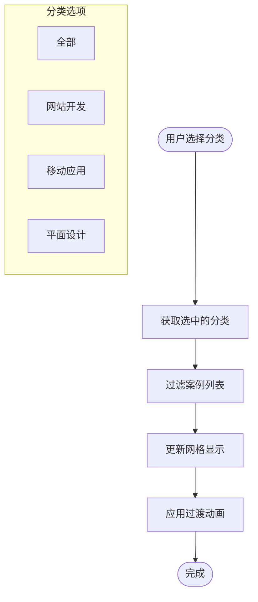

**图表来源**
- [企业网站CMS系统详细需求文档.md](file://企业网站CMS系统详细需求文档.md#L209-L212)

**章节来源**
- [企业网站CMS系统详细需求文档.md](file://企业网站CMS系统详细需求文档.md#L209-L212)

## 依赖关系分析

系统组件之间的依赖关系体现了整体架构的设计思路：

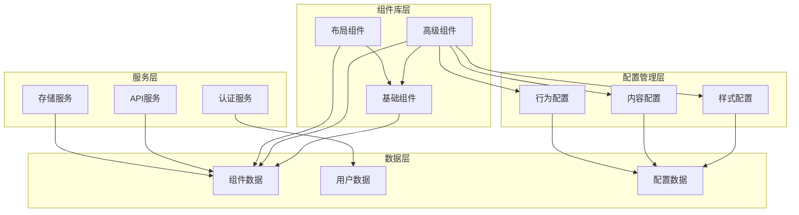

**图表来源**
- [企业网站CMS系统详细需求文档.md](file://企业网站CMS系统详细需求文档.md#L214-L232)

**章节来源**
- [企业网站CMS系统详细需求文档.md](file://企业网站CMS系统详细需求文档.md#L214-L232)

## 性能考虑

针对高级展示组件的性能优化建议：

### 渲染优化
- **虚拟滚动**：对于大量数据的列表组件，使用虚拟滚动减少DOM节点数量
- **懒加载**：图片和组件内容采用懒加载策略
- **防抖节流**：对于频繁触发的操作使用防抖节流

### 动画性能
- **硬件加速**：使用transform和opacity属性触发动画硬件加速
- **动画简化**：避免复杂的阴影和渐变动画
- **帧率控制**：保持动画60fps的流畅度

### 缓存策略
- **组件缓存**：对于静态内容使用内存缓存
- **配置缓存**：用户配置信息缓存在本地存储
- **网络缓存**：API响应结果合理利用浏览器缓存

## 故障排除指南

### 常见问题及解决方案

#### 组件渲染异常
**问题**：组件在某些浏览器中显示异常
**解决方案**：
1. 检查CSS兼容性，添加必要的浏览器前缀
2. 验证组件的响应式设计
3. 确认第三方库的版本兼容性

#### 动画性能问题
**问题**：组件动画卡顿
**解决方案**：
1. 检查动画帧率，优化动画属性
2. 减少动画元素的数量
3. 使用requestAnimationFrame优化动画

#### 数据加载问题
**问题**：组件数据加载缓慢
**解决方案**：
1. 实现数据分页和懒加载
2. 优化API请求频率
3. 添加数据缓存机制

**章节来源**
- [开发计划表_2月4日-2月12日.md](file://开发计划表_2月4日-2月12日.md#L589-L625)

## 结论

企业网站CMS系统的高级展示组件设计充分考虑了现代Web应用的需求，提供了丰富而实用的功能特性。通过模块化的组件设计和灵活的配置选项，系统能够满足不同类型企业的展示需求。

### 主要优势
- **功能完整性**：涵盖了企业网站所需的主要展示组件
- **用户体验**：注重交互体验和视觉效果
- **技术先进性**：采用现代化的技术栈和最佳实践
- **可扩展性**：良好的架构设计便于功能扩展

### 发展方向
根据V2版本规划，系统将在现有基础上继续完善，包括：
- 更丰富的可视化组件库
- 多语言支持功能
- 高级SEO优化功能
- 数据统计和分析能力

这套高级展示组件为企业的数字化转型提供了强有力的技术支撑，有助于提升企业形象和用户体验。