# 组件渲染器增强

<cite>
**本文档引用的文件**
- [ComponentRenderer.tsx](file://company_cms_project/frontend/src/components/ComponentRenderer.tsx)
- [components.ts](file://company_cms_project/frontend/src/types/components.ts)
- [DynamicPage.tsx](file://company_cms_project/frontend/src/pages/DynamicPage.tsx)
- [PageEditor.tsx](file://company_cms_project/frontend/src/pages/PageEditor.tsx)
- [posts.ts](file://company_cms_project/frontend/src/api/posts.ts)
- [posts.py](file://company_cms_project/backend/app/api/posts.py)
- [post.py](file://company_cms_project/backend/app/models/post.py)
- [templates.ts](file://company_cms_project/frontend/src/types/templates.ts)
- [App.tsx](file://company_cms_project/frontend/src/App.tsx)
- [DynamicPageWithRouter.tsx](file://company_cms_project/frontend/src/pages/DynamicPageWithRouter.tsx)
</cite>

## 更新摘要
**变更内容**
- 新增容器嵌套渲染功能，支持最多2层嵌套深度
- 增强图像组件宽高比计算，使用CSS padding-top技术保持固定宽高比
- 新增容器子组件统一高度控制功能
- 完善页面编辑器的嵌套容器配置面板
- 优化组件渲染器的整体架构和性能

## 目录
1. [项目概述](#项目概述)
2. [项目结构](#项目结构)
3. [核心组件](#核心组件)
4. [架构概览](#架构概览)
5. [详细组件分析](#详细组件分析)
6. [依赖关系分析](#依赖关系分析)
7. [性能考虑](#性能考虑)
8. [故障排除指南](#故障排除指南)
9. [结论](#结论)

## 项目概述

这是一个基于 React 和 Flask 的企业级 CMS 系统，重点实现了组件渲染器的增强功能。该系统允许用户通过可视化界面拖拽组件来构建页面，支持多种组件类型和丰富的自定义选项。

系统采用前后端分离架构，前端使用 React + Ant Design 构建，后端使用 Flask 提供 RESTful API。核心功能包括：

- **组件化页面构建**：支持 9 种不同类型的页面组件
- **可视化编辑器**：拖拽式页面设计工具
- **实时预览**：编辑模式与预览模式切换
- **模板系统**：提供多种预设页面模板
- **响应式设计**：支持多种布局模式
- **智能组件渲染**：新增HeroRenderer组件，专门处理Hero组件渲染
- **容器嵌套支持**：支持最多2层嵌套深度的容器结构
- **图像宽高比控制**：使用CSS padding-top技术保持固定宽高比

## 项目结构

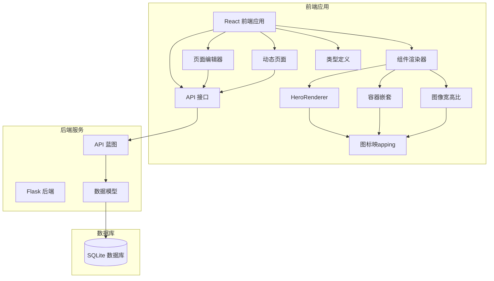

**图表来源**
- [ComponentRenderer.tsx:89-301](file://company_cms_project/frontend/src/components/ComponentRenderer.tsx#L89-L301)
- [ComponentRenderer.tsx:47-79](file://company_cms_project/frontend/src/components/ComponentRenderer.tsx#L47-L79)
- [posts.py:1-454](file://company_cms_project/backend/app/api/posts.py#L1-L454)

**章节来源**
- [App.tsx:1-82](file://company_cms_project/frontend/src/App.tsx#L1-L82)
- [DynamicPage.tsx:1-213](file://company_cms_project/frontend/src/pages/DynamicPage.tsx#L1-L213)

## 核心组件

### 组件渲染器架构

组件渲染器采用模块化设计，支持以下组件类型：

| 组件类型 | 功能描述 | 主要特性 |
|---------|----------|----------|
| Hero 横幅 | 页面头部横幅展示 | 背景图片/颜色、按钮配置、文本对齐、智能渲染 |
| 文本块 | 文本内容展示 | 字体、颜色、对齐方式、内边距 |
| 图片 | 图片展示 | 填充模式、圆角、描述文字、宽高比控制 |
| 按钮 | 交互式按钮 | 图标、链接、样式自定义 |
| 容器 | 布局容器 | 网格/弹性布局、嵌套支持、子组件统一高度 |
| 表单 | 留言表单 | 字段配置、验证规则 |
| 卡片列表 | 信息卡片展示 | 列数配置、项目数据 |
| 分割线 | 内容分隔 | 样式、颜色、间距 |
| 文章列表 | 动态文章展示 | 分页、筛选、显示模式 |

### 容器嵌套渲染

**新增** 容器组件现在支持嵌套结构，实现复杂的页面布局：

- **嵌套深度限制**：最大支持2层嵌套深度
- **第1层容器**：可以添加嵌套容器
- **第2层容器**：只能添加基础组件，不能再嵌套
- **统一高度控制**：支持设置子组件统一高度（80px-400px）

### 图像宽高比控制

**新增** 图片组件增强了宽高比控制功能：

- **宽高比映射**：使用CSS padding-top技术保持固定比例
- **支持比例**：1:1、4:3、16:9、3:4四种预设比例
- **自适应处理**：当设置宽高比时，使用绝对定位的img元素
- **无比例处理**：保持原有的宽度/高度设置方式

### HeroRenderer组件

**新增** HeroRenderer是专门为Hero组件设计的专用渲染器，提供以下功能：

- **智能按钮渲染**：根据配置动态渲染按钮
- **图标定位**：支持图标在文字左侧或右侧显示
- **样式定制**：支持自定义颜色、圆角、阴影等
- **链接处理**：智能处理内部链接和外部链接
- **对齐联动**：按钮随文本对齐方式自动调整位置

### 按钮图标映射系统

**新增** 系统引入了统一的按钮图标映射系统：

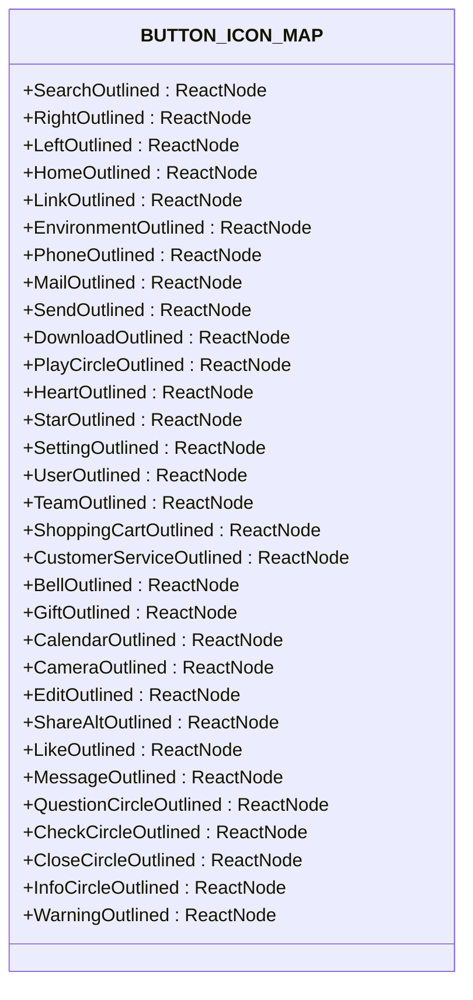

**图表来源**
- [ComponentRenderer.tsx:47-79](file://company_cms_project/frontend/src/components/ComponentRenderer.tsx#L47-L79)

**章节来源**
- [components.ts:1-416](file://company_cms_project/frontend/src/types/components.ts#L1-L416)

## 架构概览

### 前端架构

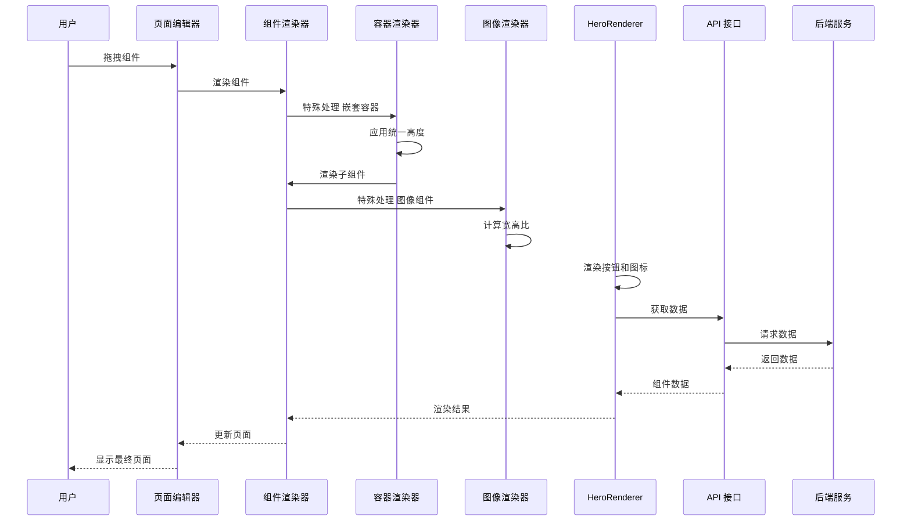

**图表来源**
- [PageEditor.tsx:191-321](file://company_cms_project/frontend/src/pages/PageEditor.tsx#L191-L321)
- [ComponentRenderer.tsx:818-914](file://company_cms_project/frontend/src/components/ComponentRenderer.tsx#L818-L914)

### 后端架构

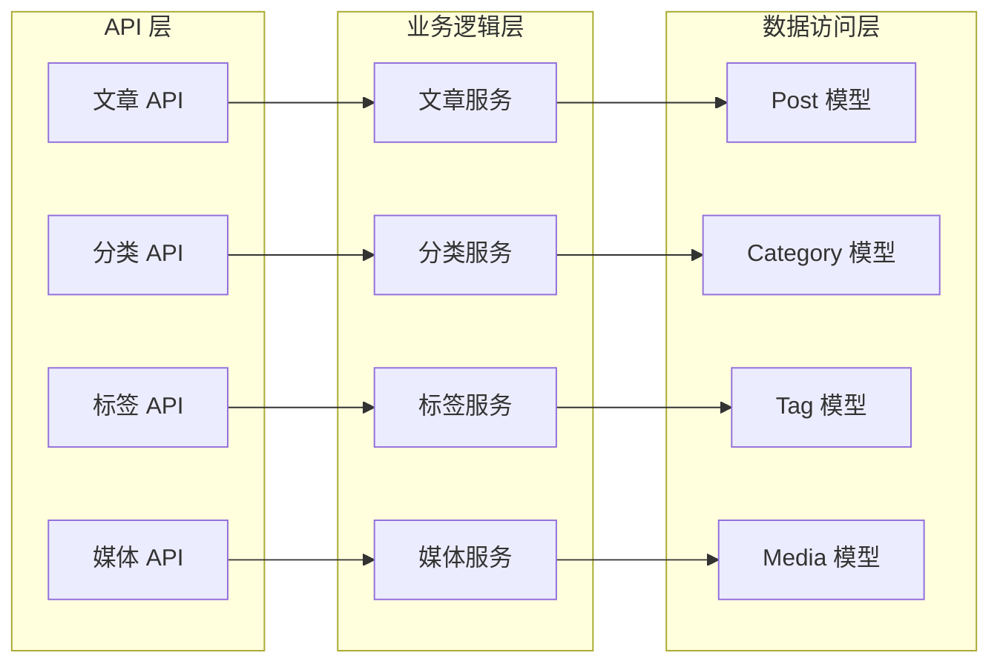

**图表来源**
- [posts.py:17-186](file://company_cms_project/backend/app/api/posts.py#L17-L186)
- [post.py:4-70](file://company_cms_project/backend/app/models/post.py#L4-L70)

**章节来源**
- [posts.py:1-454](file://company_cms_project/backend/app/api/posts.py#L1-L454)
- [post.py:1-280](file://company_cms_project/backend/app/models/post.py#L1-L280)

## 详细组件分析

### 组件渲染器实现

组件渲染器采用高阶组件模式，为每种组件类型提供专门的渲染逻辑：

#### 容器嵌套渲染

**新增** 容器组件现在支持嵌套结构，实现复杂的页面布局：

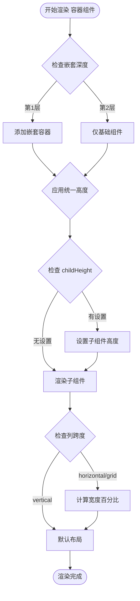

**图表来源**
- [ComponentRenderer.tsx:572-640](file://company_cms_project/frontend/src/components/ComponentRenderer.tsx#L572-L640)

#### 图像宽高比渲染

**新增** 图片组件使用CSS padding-top技术保持固定宽高比：

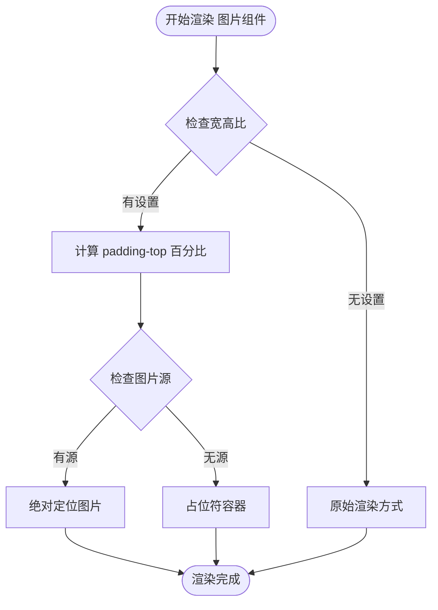

**图表来源**
- [ComponentRenderer.tsx:319-418](file://company_cms_project/frontend/src/components/ComponentRenderer.tsx#L319-L418)

#### HeroRenderer组件渲染

**新增** HeroRenderer是Hero组件的专用渲染器，提供完整的Hero组件渲染功能：

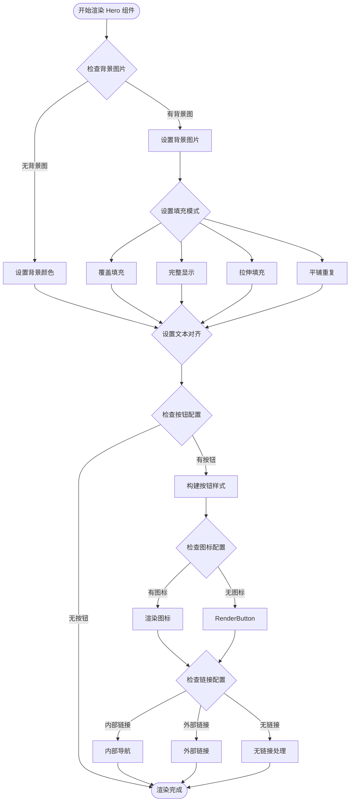

**图表来源**
- [ComponentRenderer.tsx:89-301](file://company_cms_project/frontend/src/components/ComponentRenderer.tsx#L89-L301)

#### 按钮渲染增强

**更新** 按钮渲染功能得到显著增强，支持更多配置选项：

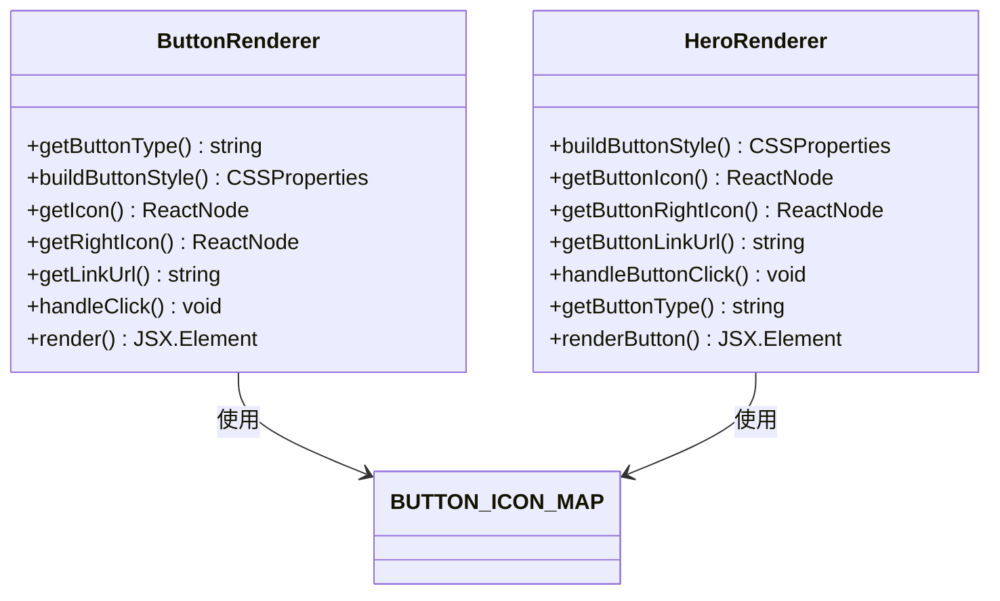

**图表来源**
- [ComponentRenderer.tsx:353-502](file://company_cms_project/frontend/src/components/ComponentRenderer.tsx#L353-L502)
- [ComponentRenderer.tsx:155-288](file://company_cms_project/frontend/src/components/ComponentRenderer.tsx#L155-L288)

#### 文章列表组件

文章列表组件集成了完整的文章展示功能：

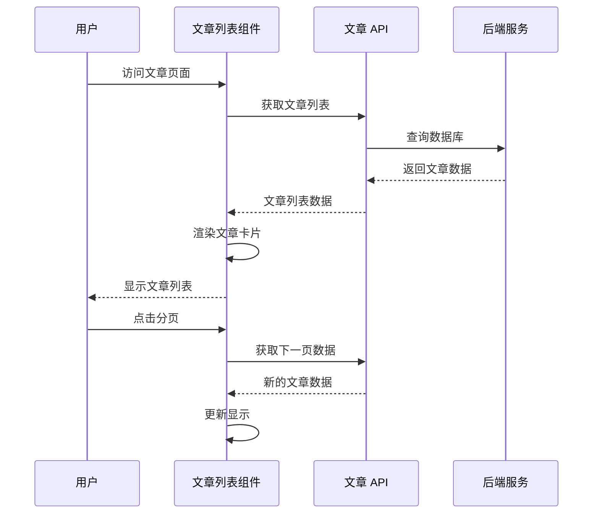

**图表来源**
- [ComponentRenderer.tsx:627-800](file://company_cms_project/frontend/src/components/ComponentRenderer.tsx#L627-L800)

**章节来源**
- [ComponentRenderer.tsx:1-988](file://company_cms_project/frontend/src/components/ComponentRenderer.tsx#L1-L988)

### 页面编辑器功能

页面编辑器提供了完整的可视化页面构建工具：

#### 容器嵌套配置面板

**更新** 容器配置面板新增了嵌套容器支持：

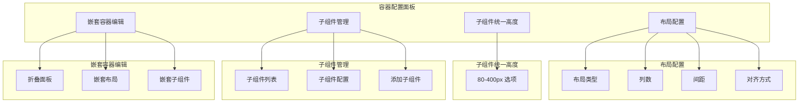

**图表来源**
- [PageEditor.tsx:1500-1700](file://company_cms_project/frontend/src/pages/PageEditor.tsx#L1500-L1700)

#### 图像宽高比配置面板

**新增** 图像组件配置面板新增了宽高比选项：

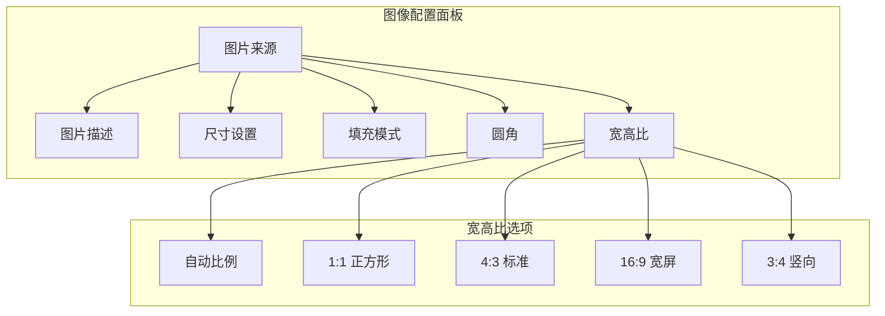

**图表来源**
- [PageEditor.tsx:1080-1122](file://company_cms_project/frontend/src/pages/PageEditor.tsx#L1080-L1122)

#### 嵌套深度计算

**新增** 页面编辑器实现了嵌套深度计算功能：

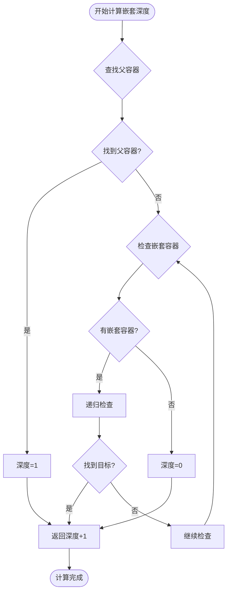

**图表来源**
- [PageEditor.tsx:384-424](file://company_cms_project/frontend/src/pages/PageEditor.tsx#L384-L424)

#### 模板系统

系统提供了四种预设模板：

| 模板类型 | 适用场景 | 特色功能 |
|---------|----------|----------|
| 默认模板 | 系统首页 | 简洁大气，包含横幅、优势介绍、文章展示 |
| 企业官网 | 传统企业 | 稳重大气，突出品牌实力 |
| 科技公司 | 互联网企业 | 现代简约，强调创新技术 |
| 服务机构 | 教育医疗 | 温馨专业，强调信任关怀 |

**章节来源**
- [PageEditor.tsx:1-2070](file://company_cms_project/frontend/src/pages/PageEditor.tsx#L1-L2070)
- [templates.ts:1-322](file://company_cms_project/frontend/src/types/templates.ts#L1-L322)

### 数据流架构

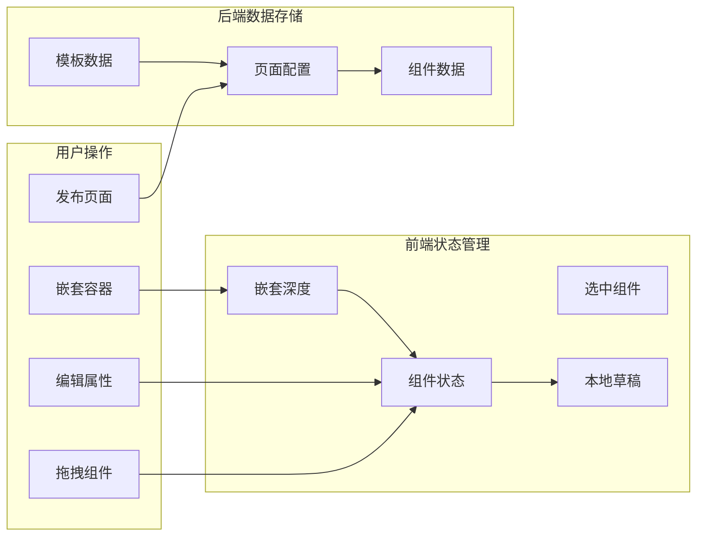

**图表来源**
- [PageEditor.tsx:404-445](file://company_cms_project/frontend/src/pages/PageEditor.tsx#L404-L445)
- [DynamicPage.tsx:60-80](file://company_cms_project/frontend/src/pages/DynamicPage.tsx#L60-L80)

**章节来源**
- [DynamicPage.tsx:1-213](file://company_cms_project/frontend/src/pages/DynamicPage.tsx#L1-L213)

## 依赖关系分析

### 前端依赖关系

```mermaid
graph TD
subgraph "核心依赖"
React[React 18.x]
AntD[Ant Design 5.x]
Router[React Router DOM]
DnDKit[@dnd-kit/core]
end
subgraph "组件依赖"
ComponentRenderer[ComponentRenderer]
HeroRenderer[HeroRenderer]
PageEditor[PageEditor]
DynamicPage[DynamicPage]
ImagePicker[ImagePicker]
end
subgraph "类型定义"
ComponentTypes[Component Types]
TemplateTypes[Template Types]
ApiTypes[API Types]
end
React --> ComponentRenderer
AntD --> ComponentRenderer
Router --> DynamicPage
DnDKit --> PageEditor
ComponentRenderer --> ComponentTypes
PageEditor --> ComponentTypes
DynamicPage --> ComponentTypes
PageEditor --> TemplateTypes
ComponentRenderer --> ApiTypes
HeroRenderer --> BUTTON_ICON_MAP
Container --> BUTTON_ICON_MAP
Image --> BUTTON_ICON_MAP
```

**图表来源**
- [ComponentRenderer.tsx:1-45](file://company_cms_project/frontend/src/components/ComponentRenderer.tsx#L1-L45)
- [PageEditor.tsx:1-65](file://company_cms_project/frontend/src/pages/PageEditor.tsx#L1-L65)

### 后端依赖关系

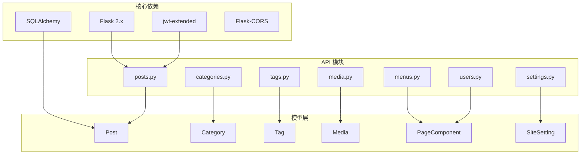

**图表来源**
- [posts.py:1-8](file://company_cms_project/backend/app/api/posts.py#L1-L8)
- [post.py:184-207](file://company_cms_project/backend/app/models/post.py#L184-L207)

**章节来源**
- [posts.py:1-454](file://company_cms_project/backend/app/api/posts.py#L1-L454)
- [post.py:1-280](file://company_cms_project/backend/app/models/post.py#L1-L280)

## 性能考虑

### 前端性能优化

1. **组件懒加载**：使用 React.lazy 实现组件按需加载
2. **虚拟滚动**：大量文章时使用虚拟滚动优化渲染性能
3. **状态优化**：使用 React.memo 和 useMemo 避免不必要的重渲染
4. **图片优化**：支持响应式图片和懒加载
5. **图标缓存**：按钮图标映射系统避免重复创建图标组件
6. **嵌套深度限制**：防止过深的嵌套导致性能问题
7. **CSS 技术优化**：使用 padding-top 技术避免图片重排

### 后端性能优化

1. **数据库索引**：为常用查询字段建立索引
2. **分页查询**：默认启用分页，限制单次查询数据量
3. **缓存策略**：静态内容使用缓存减少数据库压力
4. **连接池**：使用连接池管理数据库连接

## 故障排除指南

### 常见问题及解决方案

| 问题类型 | 症状 | 解决方案 |
|---------|------|----------|
| 容器嵌套异常 | 嵌套容器无法添加或编辑异常 | 检查嵌套深度计算函数，确认最大嵌套深度为2层 |
| 图片宽高比失效 | 图片变形或比例不正确 | 检查aspectRatioMap映射，确认宽高比值正确 |
| 子组件高度不统一 | 子组件高度不一致影响布局 | 检查childHeight配置，确认数值范围在80-400px之间 |
| Hero组件渲染异常 | 页面空白或Hero组件不显示 | 检查Hero组件props配置，确认HeroRenderer可用 |
| 按钮图标不显示 | 按钮图标缺失 | 检查BUTTON_ICON_MAP中图标是否存在，确认图标名称正确 |
| 按钮点击无反应 | 按钮无法跳转 | 检查按钮链接配置，确认链接类型和值有效 |
| 按钮样式异常 | 按钮样式不符合预期 | 检查按钮样式配置，确认颜色、圆角等参数范围正确 |
| 图标位置错误 | 图标显示在错误位置 | 检查buttonIconPosition配置，确认左右位置设置 |
| 链接处理异常 | 内部链接无法导航 | 检查React Router配置，确认navigate函数可用 |

### 调试工具

1. **浏览器开发者工具**：检查网络请求和控制台错误
2. **React DevTools**：分析组件树和状态变化
3. **后端日志**：查看 Flask 应用日志
4. **数据库查询**：使用 SQLite 浏览器检查数据完整性

**章节来源**
- [PageEditor.tsx:447-460](file://company_cms_project/frontend/src/pages/PageEditor.tsx#L447-L460)

## 结论

组件渲染器增强功能为 CMS 系统提供了强大的页面构建能力。通过模块化的组件设计、丰富的自定义选项和直观的可视化编辑器，用户可以轻松创建各种类型的页面。

**主要增强功能**：
1. **容器嵌套渲染**：支持最多2层嵌套深度，实现复杂的页面布局结构
2. **子组件统一高度**：提供80px-400px的统一高度控制，确保页面视觉一致性
3. **图像宽高比控制**：使用CSS padding-top技术保持固定宽高比，避免图片变形
4. **HeroRenderer组件**：专门处理Hero组件渲染，提供智能按钮渲染、图标定位、链接处理等功能
5. **按钮图标映射系统**：支持32种图标选择，提升用户体验
6. **完整的Hero组件按钮功能**：支持样式定制、链接配置、对齐联动等高级功能
7. **智能链接处理**：支持内部导航和外部链接，提供更好的用户体验

系统的主要优势包括：

1. **高度可定制**：支持丰富的样式和行为配置
2. **易于使用**：拖拽式编辑器降低使用门槛
3. **性能优秀**：优化的渲染机制确保流畅体验
4. **扩展性强**：模块化架构便于功能扩展
5. **布局灵活**：嵌套容器支持复杂的页面结构
6. **视觉一致**：统一高度和宽高比确保页面美观

未来可以考虑的功能增强：
- 更多组件类型支持
- 组件共享和复用机制
- 更丰富的动画效果
- 多语言支持
- SEO 优化工具
- Hero组件多按钮支持
- Hero组件标题和副标题样式配置
- 更多宽高比预设选项
- 嵌套容器的可视化指示器
- 支持更深层次的嵌套配置