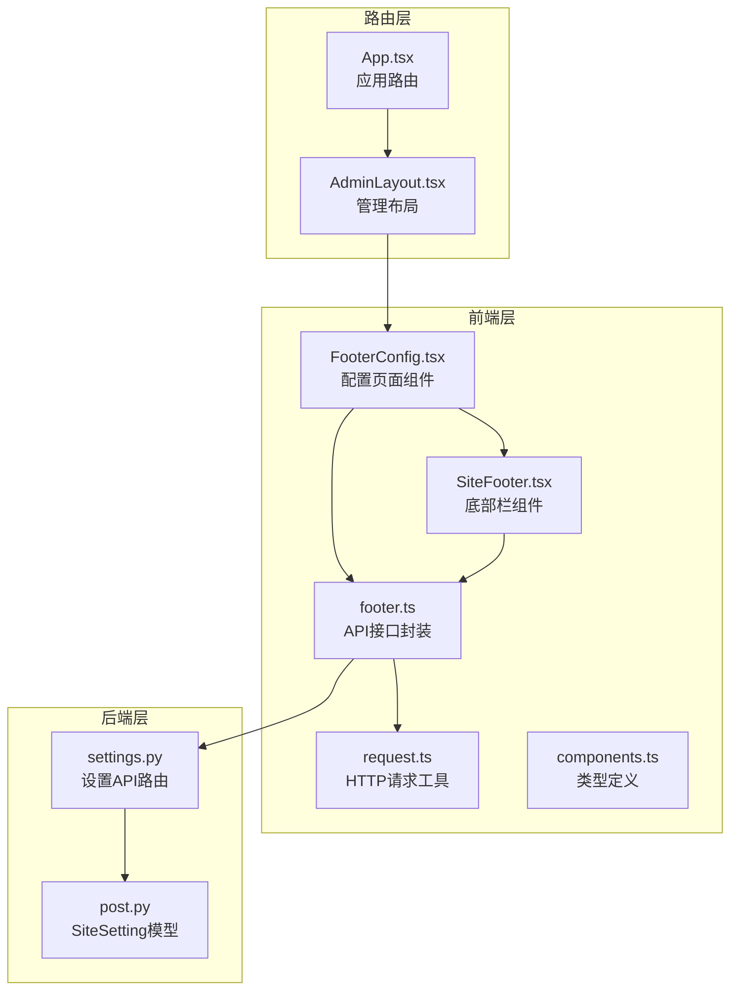
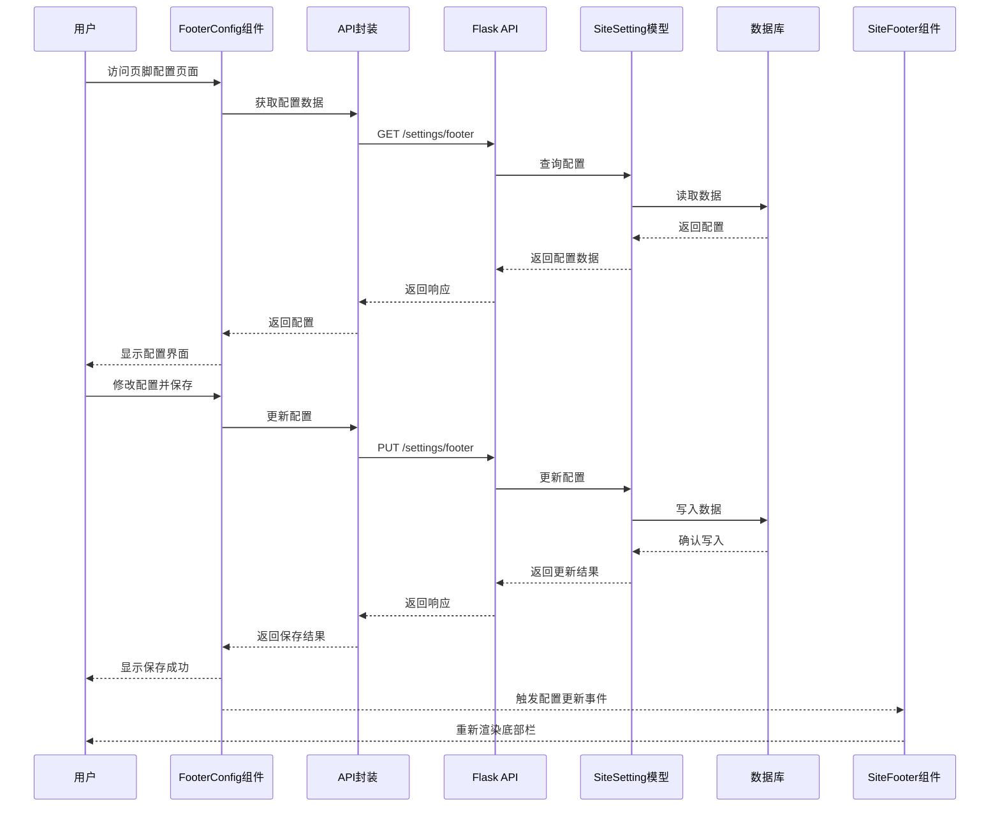
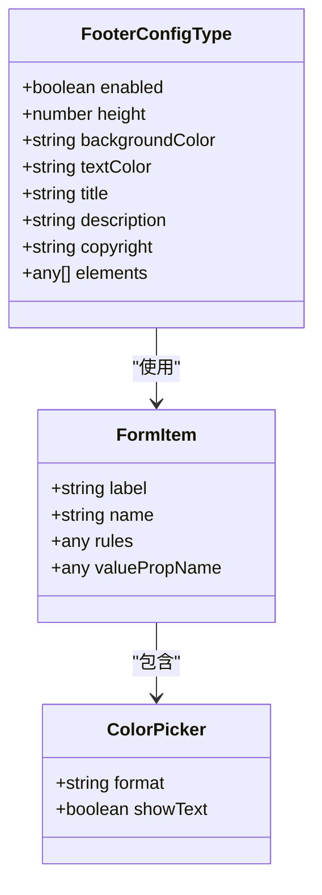
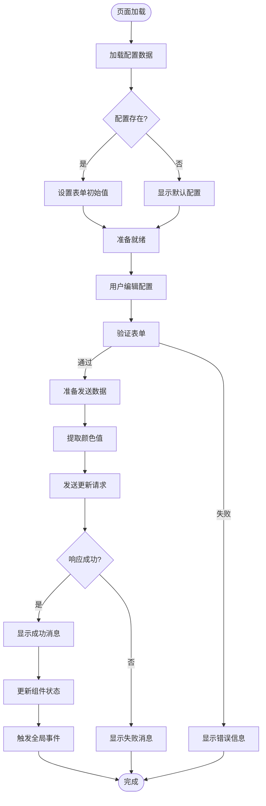
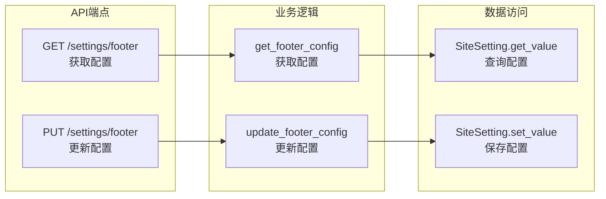
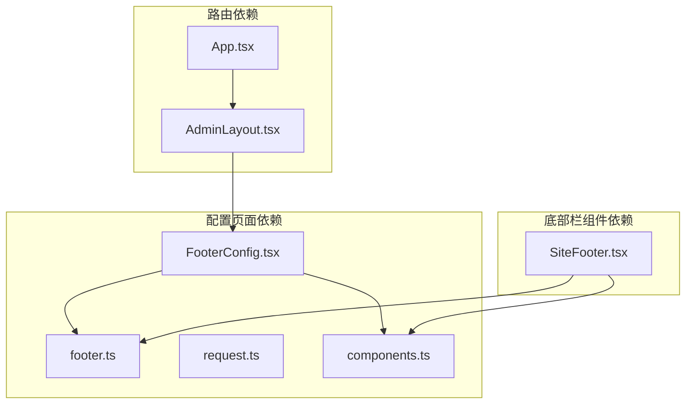
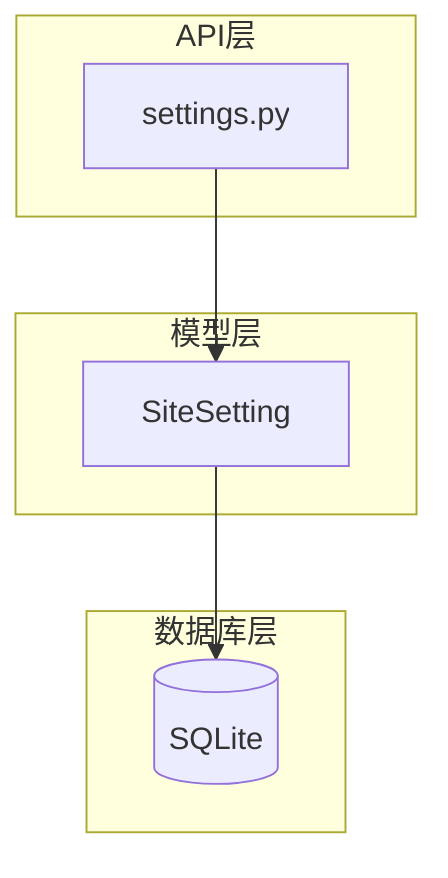

# 页脚配置页面

<cite>
**本文档引用的文件**
- [FooterConfig.tsx](file://company_cms_project/frontend/src/pages/FooterConfig.tsx)
- [footer.ts](file://company_cms_project/frontend/src/api/footer.ts)
- [settings.py](file://company_cms_project/backend/app/api/settings.py)
- [SiteFooter.tsx](file://company_cms_project/frontend/src/components/SiteFooter.tsx)
- [components.ts](file://company_cms_project/frontend/src/types/components.ts)
- [post.py](file://company_cms_project/backend/app/models/post.py)
- [request.ts](file://company_cms_project/frontend/src/utils/request.ts)
- [AdminLayout.tsx](file://company_cms_project/frontend/src/layout/AdminLayout.tsx)
- [App.tsx](file://company_cms_project/frontend/src/App.tsx)
- [test_footer_api.py](file://tests/test_footer_api.py)
- [check_footer_db.py](file://tests/check_footer_db.py)
</cite>

## 目录
1. [简介](#简介)
2. [项目结构](#项目结构)
3. [核心组件](#核心组件)
4. [架构概览](#架构概览)
5. [详细组件分析](#详细组件分析)
6. [依赖关系分析](#依赖关系分析)
7. [性能考虑](#性能考虑)
8. [故障排除指南](#故障排除指南)
9. [结论](#结论)

## 简介

页脚配置页面是企业内容管理系统(CORPCMS)中的一个重要功能模块，允许管理员配置网站底部栏的显示内容、样式和布局。该页面提供了直观的图形界面，支持实时预览功能，使管理员能够轻松地自定义网站的品牌展示效果。

该功能基于前后端分离的架构设计，前端使用React + TypeScript + Ant Design构建，后端采用Flask + SQLAlchemy实现，通过RESTful API进行数据交互。系统支持JWT认证，确保只有授权用户才能修改配置。

## 项目结构

页脚配置功能涉及多个层次的文件组织，形成了清晰的分层架构：



**图表来源**
- [FooterConfig.tsx:1-268](file://company_cms_project/frontend/src/pages/FooterConfig.tsx#L1-L268)
- [settings.py:1-360](file://company_cms_project/backend/app/api/settings.py#L1-L360)
- [post.py:210-280](file://company_cms_project/backend/app/models/post.py#L210-L280)

**章节来源**
- [FooterConfig.tsx:1-268](file://company_cms_project/frontend/src/pages/FooterConfig.tsx#L1-L268)
- [settings.py:1-360](file://company_cms_project/backend/app/api/settings.py#L1-L360)
- [post.py:210-280](file://company_cms_project/backend/app/models/post.py#L210-L280)

## 核心组件

### 配置页面组件 (FooterConfig)

配置页面组件是用户交互的主要界面，提供了完整的配置功能：

- **表单验证**: 支持必填字段验证和数据格式检查
- **实时预览**: 实时显示配置效果，提升用户体验
- **颜色选择器**: 支持HEX和RGB格式的颜色选择
- **响应式设计**: 适配不同屏幕尺寸的设备

### 底部栏组件 (SiteFooter)

底部栏组件负责在前台展示最终的配置结果：

- **动态加载**: 从API获取最新的配置数据
- **事件监听**: 监听配置更新事件，实现实时刷新
- **默认回退**: 当配置不可用时提供默认显示
- **样式应用**: 将配置的样式应用到DOM元素

### API接口封装 (footer.ts)

提供统一的API调用接口：

- **GET请求**: 获取当前的底栏配置
- **PUT请求**: 更新底栏配置
- **错误处理**: 统一的错误处理和消息提示

**章节来源**
- [FooterConfig.tsx:18-41](file://company_cms_project/frontend/src/pages/FooterConfig.tsx#L18-L41)
- [SiteFooter.tsx:9-12](file://company_cms_project/frontend/src/components/SiteFooter.tsx#L9-L12)
- [footer.ts:6-41](file://company_cms_project/frontend/src/api/footer.ts#L6-L41)

## 架构概览

页脚配置功能采用经典的MVC架构模式，实现了清晰的关注点分离：



**图表来源**
- [FooterConfig.tsx:44-103](file://company_cms_project/frontend/src/pages/FooterConfig.tsx#L44-L103)
- [settings.py:265-360](file://company_cms_project/backend/app/api/settings.py#L265-L360)
- [post.py:233-280](file://company_cms_project/backend/app/models/post.py#L233-L280)

## 详细组件分析

### 配置页面组件 (FooterConfig)

#### 数据结构设计

配置页面使用强类型的数据结构来确保数据完整性：



**图表来源**
- [FooterConfig.tsx:18-27](file://company_cms_project/frontend/src/pages/FooterConfig.tsx#L18-L27)
- [FooterConfig.tsx:154-224](file://company_cms_project/frontend/src/pages/FooterConfig.tsx#L154-L224)

#### 表单处理流程

配置页面实现了完整的表单处理流程：



**图表来源**
- [FooterConfig.tsx:44-103](file://company_cms_project/frontend/src/pages/FooterConfig.tsx#L44-L103)

#### 实时预览机制

页面提供了实时预览功能，通过CSS样式绑定实现动态更新：

- **高度控制**: `minHeight` 和 `padding` 动态计算
- **颜色应用**: 背景色和文字色实时更新
- **内容展示**: 标题、描述、版权信息的条件渲染

**章节来源**
- [FooterConfig.tsx:120-268](file://company_cms_project/frontend/src/pages/FooterConfig.tsx#L120-L268)

### 底部栏组件 (SiteFooter)

#### 组件生命周期管理

底部栏组件实现了完整的生命周期管理：

```mermaid
stateDiagram-v2
[*] --> Loading
Loading --> Loaded : 配置加载成功
Loading --> Default : 加载失败
Loaded --> Enabled : enabled=true
Loaded --> Disabled : enabled=false
Default --> Enabled : 使用默认配置
Default --> Disabled : 默认禁用
Enabled --> Rendering : 渲染配置内容
Disabled --> DefaultFooter : 显示默认底部栏
Rendering --> Updating : 监听配置更新
Updating --> Rendering : 配置变更
DefaultFooter --> [*]
```

**图表来源**
- [SiteFooter.tsx:14-63](file://company_cms_project/frontend/src/components/SiteFooter.tsx#L14-L63)

#### 配置更新事件系统

组件通过浏览器事件系统实现配置的实时更新：

- **事件监听**: 监听 `footerConfigUpdated` 事件
- **状态同步**: 接收事件数据并更新组件状态
- **内存清理**: 组件卸载时移除事件监听器

**章节来源**
- [SiteFooter.tsx:52-63](file://company_cms_project/frontend/src/components/SiteFooter.tsx#L52-L63)

### API接口设计

#### 后端API架构

后端API遵循RESTful设计原则，提供了完整的CRUD操作：



**图表来源**
- [settings.py:265-360](file://company_cms_project/backend/app/api/settings.py#L265-L360)
- [post.py:233-280](file://company_cms_project/backend/app/models/post.py#L233-L280)

#### 响应格式标准化

系统实现了统一的API响应格式：

| 字段名 | 类型 | 描述 |
|--------|------|------|
| code | number | 响应状态码 |
| message | string | 响应消息 |
| data | any | 实际数据内容 |

这种设计确保了前后端的一致性，简化了错误处理逻辑。

**章节来源**
- [settings.py:265-360](file://company_cms_project/backend/app/api/settings.py#L265-L360)
- [request.ts:5-9](file://company_cms_project/frontend/src/utils/request.ts#L5-L9)

## 依赖关系分析

### 前端依赖关系



**图表来源**
- [FooterConfig.tsx:12](file://company_cms_project/frontend/src/pages/FooterConfig.tsx#L12)
- [SiteFooter.tsx:3](file://company_cms_project/frontend/src/components/SiteFooter.tsx#L3)

### 后端依赖关系



**图表来源**
- [settings.py:1-6](file://company_cms_project/backend/app/api/settings.py#L1-L6)
- [post.py:210-231](file://company_cms_project/backend/app/models/post.py#L210-L231)

**章节来源**
- [FooterConfig.tsx:12](file://company_cms_project/frontend/src/pages/FooterConfig.tsx#L12)
- [SiteFooter.tsx:3](file://company_cms_project/frontend/src/components/SiteFooter.tsx#L3)

## 性能考虑

### 前端性能优化

1. **懒加载策略**: 配置页面按需加载，减少初始包体积
2. **事件防抖**: 颜色选择器的实时预览使用防抖处理
3. **状态管理**: 使用React Hooks优化状态更新
4. **内存管理**: 组件卸载时清理事件监听器和定时器

### 后端性能优化

1. **数据库索引**: `key_name` 字段建立唯一索引
2. **查询优化**: 使用 `filter_by` 进行高效查询
3. **事务管理**: 使用 `try-except-finally` 确保事务完整性
4. **连接池**: SQLAlchemy自动管理数据库连接

### 缓存策略

系统实现了多层缓存机制：

- **浏览器缓存**: 配置数据在本地存储中缓存
- **数据库缓存**: SQLite内置缓存机制
- **CDN缓存**: 静态资源通过CDN加速

## 故障排除指南

### 常见问题及解决方案

#### 配置无法保存

**问题症状**: 保存按钮无响应或显示保存失败

**可能原因**:
1. JWT令牌过期
2. 网络连接异常
3. 数据格式验证失败

**解决步骤**:
1. 检查浏览器控制台的网络请求
2. 验证JWT令牌的有效性
3. 确认表单数据格式正确

#### 配置不生效

**问题症状**: 修改配置后页面未更新

**可能原因**:
1. 事件监听器未正确触发
2. 组件状态未更新
3. 缓存问题

**解决步骤**:
1. 检查 `footerConfigUpdated` 事件是否触发
2. 验证组件状态更新逻辑
3. 清除浏览器缓存

#### API调用失败

**问题症状**: 控制台出现401或500错误

**解决步骤**:
1. 检查后端服务器状态
2. 验证数据库连接
3. 查看后端日志输出

**章节来源**
- [test_footer_api.py:1-53](file://tests/test_footer_api.py#L1-L53)
- [check_footer_db.py:1-11](file://tests/check_footer_db.py#L1-L11)

### 调试技巧

1. **前端调试**: 使用浏览器开发者工具检查网络请求和组件状态
2. **后端调试**: 查看控制台输出的日志信息
3. **数据库调试**: 使用 `check_footer_db.py` 脚本验证数据存储
4. **API测试**: 使用 `test_footer_api.py` 脚本测试接口功能

## 结论

页脚配置页面作为CORPCMS系统的重要组成部分，展现了现代Web应用开发的最佳实践。该功能通过清晰的架构设计、完善的错误处理机制和优秀的用户体验，为企业提供了灵活的底部栏定制能力。

### 主要优势

1. **用户体验优秀**: 提供实时预览和直观的配置界面
2. **技术架构先进**: 前后端分离，模块化设计
3. **数据安全可靠**: JWT认证和数据验证机制
4. **扩展性强**: 支持未来功能扩展和定制

### 技术亮点

- **响应式设计**: 适配各种设备和屏幕尺寸
- **类型安全**: TypeScript提供编译时类型检查
- **状态管理**: React Hooks实现高效的状态管理
- **API标准化**: 统一的响应格式和错误处理

该页脚配置功能不仅满足了当前的企业需求，也为系统的持续发展奠定了坚实的技术基础。通过模块化的架构设计和完善的测试覆盖，确保了系统的稳定性和可维护性。