# 预览模式

<cite>
**本文档引用的文件**
- [企业网站CMS系统开发需求文档.ini](file://企业网站CMS系统开发需求文档.ini)
- [企业网站CMS系统详细需求文档.md](file://企业网站CMS系统详细需求文档.md)
- [开发计划表_2月4日-2月12日.md](file://开发计划表_2月4日-2月12日.md)
</cite>

## 目录
1. [简介](#简介)
2. [项目结构](#项目结构)
3. [核心组件](#核心组件)
4. [架构总览](#架构总览)
5. [详细组件分析](#详细组件分析)
6. [依赖关系分析](#依赖关系分析)
7. [性能考虑](#性能考虑)
8. [故障排除指南](#故障排除指南)
9. [结论](#结论)

## 简介

预览模式是企业网站CMS系统中的核心功能模块，为用户提供实时的可视化编辑体验。该系统支持编辑模式与预览模式之间的无缝切换，实现了多设备预览、响应式布局适配和全屏预览等功能。

### 主要特性

- **实时预览**：编辑时即时显示效果变化
- **多设备支持**：桌面、平板、手机等多种设备预览
- **无缝切换**：编辑模式与预览模式间平滑转换
- **响应式适配**：自动适配不同屏幕尺寸
- **全屏预览**：支持全屏模式查看效果
- **状态同步**：编辑器状态与预览状态保持一致

## 项目结构

基于需求文档和开发计划，系统采用前后端分离架构，预览模式作为前端可视化编辑器的重要组成部分。

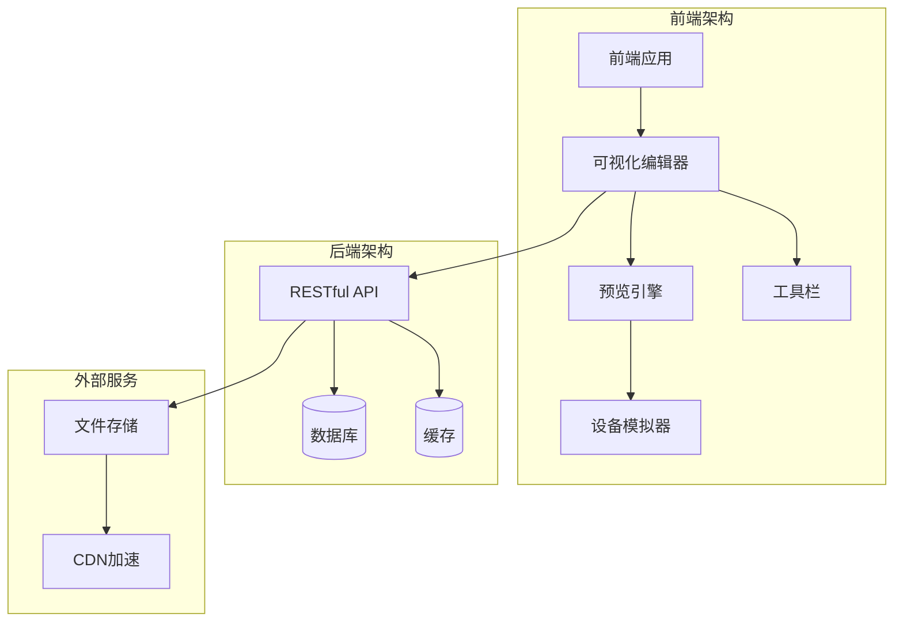
```mermaid
graph TB
subgraph "前端架构"
FE[前端应用]
Editor[可视化编辑器]
Preview[预览引擎]
Device[设备模拟器]
Toolbar[工具栏]
end
subgraph "后端架构"
API[RESTful API]
DB[(数据库)]
Cache[(缓存)]
end
subgraph "外部服务"
CDN[CDN加速]
Storage[文件存储]
end
FE --> Editor
Editor --> Preview
Preview --> Device
Editor --> Toolbar
Editor --> API
API --> DB
API --> Cache
API --> Storage
Storage --> CDN
```

**图表来源**
- [企业网站CMS系统详细需求文档.md](file://企业网站CMS系统详细需求文档.md#L22-L57)
- [开发计划表_2月4日-2月12日.md](file://开发计划表_2月4日-2月12日.md#L92-L105)

**章节来源**
- [企业网站CMS系统详细需求文档.md](file://企业网站CMS系统详细需求文档.md#L22-L57)
- [开发计划表_2月4日-2月12日.md](file://开发计划表_2月4日-2月12日.md#L92-L105)

## 核心组件

预览模式系统由多个核心组件构成，每个组件都有特定的功能和职责。

### 预览引擎组件

预览引擎是预览模式的核心，负责将编辑器中的组件配置转换为可视化的页面效果。

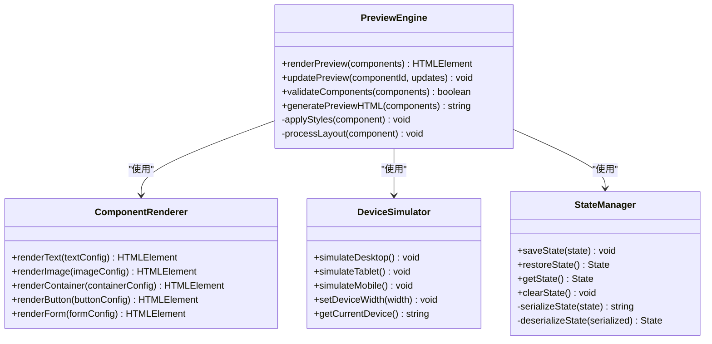
```mermaid
classDiagram
class PreviewEngine {
+renderPreview(components) HTMLElement
+updatePreview(componentId, updates) void
+validateComponents(components) boolean
+generatePreviewHTML(components) string
-applyStyles(component) void
-processLayout(component) void
}
class ComponentRenderer {
+renderText(textConfig) HTMLElement
+renderImage(imageConfig) HTMLElement
+renderContainer(containerConfig) HTMLElement
+renderButton(buttonConfig) HTMLElement
+renderForm(formConfig) HTMLElement
}
class DeviceSimulator {
+simulateDesktop() void
+simulateTablet() void
+simulateMobile() void
+setDeviceWidth(width) void
+getCurrentDevice() string
}
class StateManager {
+saveState(state) void
+restoreState() State
+getState() State
+clearState() void
-serializeState(state) string
-deserializeState(serialized) State
}
PreviewEngine --> ComponentRenderer : "使用"
PreviewEngine --> DeviceSimulator : "使用"
PreviewEngine --> StateManager : "使用"
```

**图表来源**
- [企业网站CMS系统详细需求文档.md](file://企业网站CMS系统详细需求文档.md#L372-L394)

### 编辑器-预览同步组件

编辑器与预览模式之间的状态同步是预览功能的关键技术挑战。

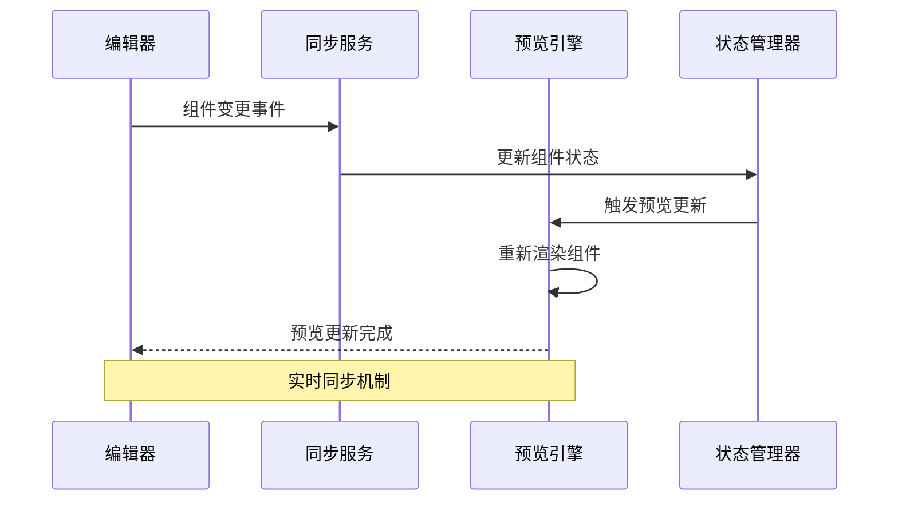
```mermaid
sequenceDiagram
participant Editor as 编辑器
participant Sync as 同步服务
participant Preview as 预览引擎
participant State as 状态管理器
Editor->>Sync : 组件变更事件
Sync->>State : 更新组件状态
State->>Preview : 触发预览更新
Preview->>Preview : 重新渲染组件
Preview-->>Editor : 预览更新完成
Note over Editor,Preview : 实时同步机制
```

**图表来源**
- [企业网站CMS系统详细需求文档.md](file://企业网站CMS系统详细需求文档.md#L381-L389)

**章节来源**
- [企业网站CMS系统详细需求文档.md](file://企业网站CMS系统详细需求文档.md#L372-L394)

## 架构总览

预览模式采用模块化架构设计，支持高度的可扩展性和维护性。

### 系统架构图

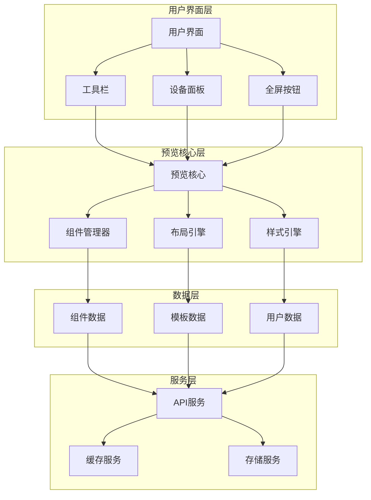
```mermaid
graph TB
subgraph "用户界面层"
UI[用户界面]
Toolbar[工具栏]
DevicePanel[设备面板]
FullscreenBtn[全屏按钮]
end
subgraph "预览核心层"
PreviewCore[预览核心]
ComponentManager[组件管理器]
LayoutEngine[布局引擎]
StyleEngine[样式引擎]
end
subgraph "数据层"
ComponentData[组件数据]
TemplateData[模板数据]
UserData[用户数据]
end
subgraph "服务层"
APIService[API服务]
CacheService[缓存服务]
StorageService[存储服务]
end
UI --> Toolbar
UI --> DevicePanel
UI --> FullscreenBtn
Toolbar --> PreviewCore
DevicePanel --> PreviewCore
FullscreenBtn --> PreviewCore
PreviewCore --> ComponentManager
PreviewCore --> LayoutEngine
PreviewCore --> StyleEngine
ComponentManager --> ComponentData
LayoutEngine --> TemplateData
StyleEngine --> UserData
ComponentData --> APIService
TemplateData --> APIService
UserData --> APIService
APIService --> CacheService
APIService --> StorageService
```

**图表来源**
- [企业网站CMS系统详细需求文档.md](file://企业网站CMS系统详细需求文档.md#L372-L408)

### 数据流架构

预览模式的数据流遵循单向数据流原则，确保状态的一致性和可预测性。

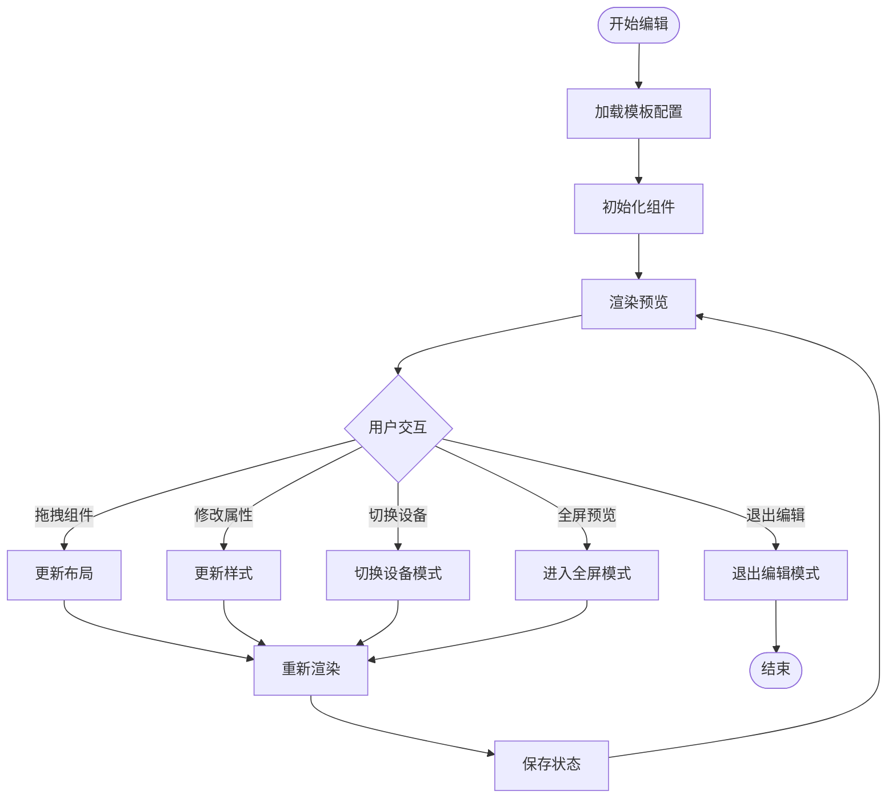
```mermaid
flowchart TD
Start([开始编辑]) --> LoadTemplate["加载模板配置"]
LoadTemplate --> InitComponents["初始化组件"]
InitComponents --> RenderPreview["渲染预览"]
RenderPreview --> UserInteraction{"用户交互"}
UserInteraction --> |拖拽组件| UpdateLayout["更新布局"]
UserInteraction --> |修改属性| UpdateStyle["更新样式"]
UserInteraction --> |切换设备| SwitchDevice["切换设备模式"]
UserInteraction --> |全屏预览| EnterFullscreen["进入全屏模式"]
UpdateLayout --> ReRender["重新渲染"]
UpdateStyle --> ReRender
SwitchDevice --> ReRender
EnterFullscreen --> ReRender
ReRender --> SaveState["保存状态"]
SaveState --> RenderPreview
UserInteraction --> |退出编辑| ExitEditMode["退出编辑模式"]
ExitEditMode --> End([结束])
```

**图表来源**
- [开发计划表_2月4日-2月12日.md](file://开发计划表_2月4日-2月12日.md#L372-L408)

**章节来源**
- [企业网站CMS系统详细需求文档.md](file://企业网站CMS系统详细需求文档.md#L372-L408)
- [开发计划表_2月4日-2月12日.md](file://开发计划表_2月4日-2月12日.md#L372-L408)

## 详细组件分析

### 预览引擎实现

预览引擎是预览模式的核心执行组件，负责将组件配置转换为可视化的HTML/CSS输出。

#### 组件渲染机制

预览引擎采用工厂模式设计，为不同类型的组件提供专门的渲染器。

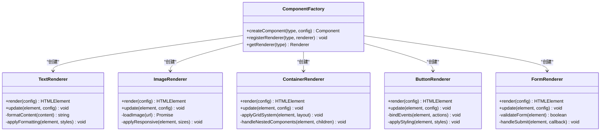
```mermaid
classDiagram
class ComponentFactory {
+createComponent(type, config) Component
+registerRenderer(type, renderer) void
+getRenderer(type) Renderer
}
class TextRenderer {
+render(config) HTMLElement
+update(element, config) void
-formatContent(content) string
-applyFormatting(element, styles) void
}
class ImageRenderer {
+render(config) HTMLElement
+update(element, config) void
-loadImage(url) Promise
-applyResponsive(element, sizes) void
}
class ContainerRenderer {
+render(config) HTMLElement
+update(element, config) void
-applyGridSystem(element, layout) void
-handleNestedComponents(element, children) void
}
class ButtonRenderer {
+render(config) HTMLElement
+update(element, config) void
-bindEvents(element, actions) void
-applyStyling(element, styles) void
}
class FormRenderer {
+render(config) HTMLElement
+update(element, config) void
-validateForm(element) boolean
-handleSubmit(element, callback) void
}
ComponentFactory --> TextRenderer : "创建"
ComponentFactory --> ImageRenderer : "创建"
ComponentFactory --> ContainerRenderer : "创建"
ComponentFactory --> ButtonRenderer : "创建"
ComponentFactory --> FormRenderer : "创建"
```

**图表来源**
- [企业网站CMS系统详细需求文档.md](file://企业网站CMS系统详细需求文档.md#L374-L379)

#### 布局引擎实现

布局引擎负责处理组件的定位、排列和响应式行为。

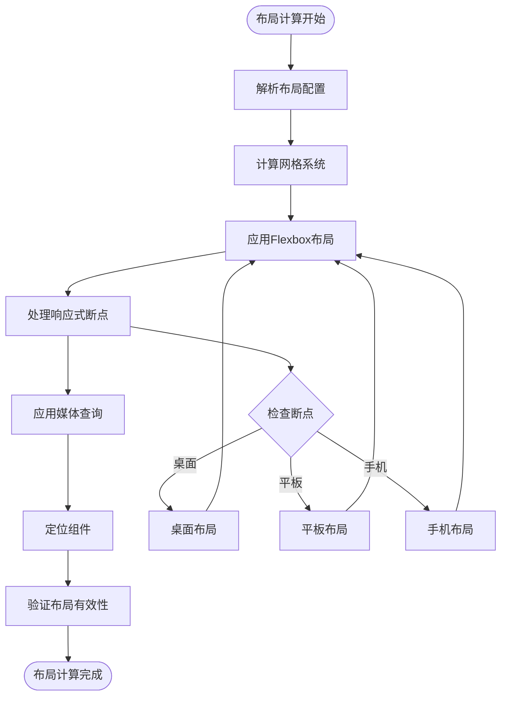
```mermaid
flowchart TD
LayoutStart([布局计算开始]) --> ParseConfig["解析布局配置"]
ParseConfig --> CalculateGrid["计算网格系统"]
CalculateGrid --> ApplyFlexbox["应用Flexbox布局"]
ApplyFlexbox --> HandleResponsive["处理响应式断点"]
HandleResponsive --> ApplyMediaQueries["应用媒体查询"]
ApplyMediaQueries --> PositionComponents["定位组件"]
PositionComponents --> ValidateLayout["验证布局有效性"]
ValidateLayout --> LayoutComplete([布局计算完成])
HandleResponsive --> CheckBreakpoints{"检查断点"}
CheckBreakpoints --> |桌面| DesktopLayout["桌面布局"]
CheckBreakpoints --> |平板| TabletLayout["平板布局"]
CheckBreakpoints --> |手机| MobileLayout["手机布局"]
DesktopLayout --> ApplyFlexbox
TabletLayout --> ApplyFlexbox
MobileLayout --> ApplyFlexbox
```

**图表来源**
- [企业网站CMS系统详细需求文档.md](file://企业网站CMS系统详细需求文档.md#L69-L77)

### 设备模拟器实现

设备模拟器支持多种设备的预览，包括桌面、平板和手机设备。

#### 设备配置管理

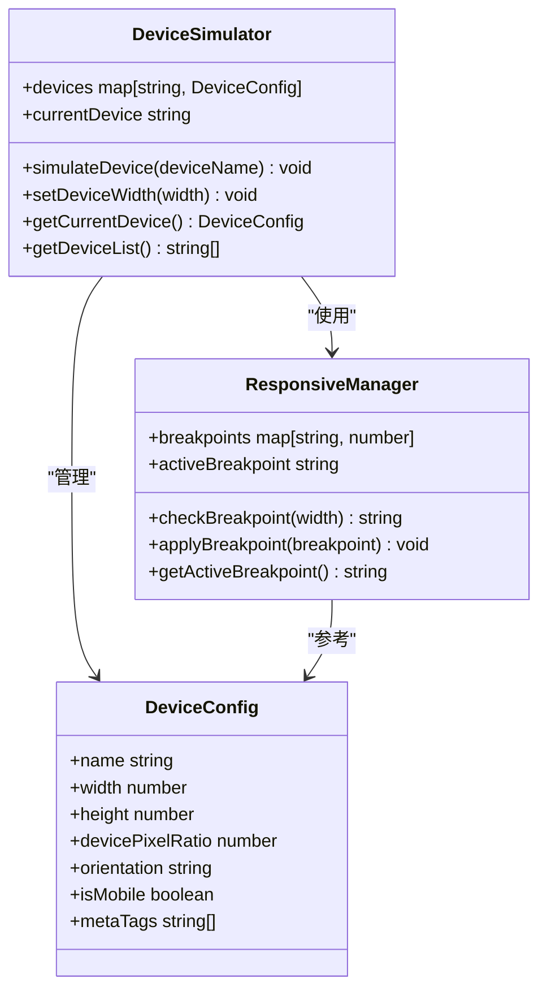
```mermaid
classDiagram
class DeviceSimulator {
+devices map[string, DeviceConfig]
+currentDevice string
+simulateDevice(deviceName) void
+setDeviceWidth(width) void
+getCurrentDevice() DeviceConfig
+getDeviceList() string[]
}
class DeviceConfig {
+name string
+width number
+height number
+devicePixelRatio number
+orientation string
+isMobile boolean
+metaTags string[]
}
class ResponsiveManager {
+breakpoints map[string, number]
+activeBreakpoint string
+checkBreakpoint(width) string
+applyBreakpoint(breakpoint) void
+getActiveBreakpoint() string
}
DeviceSimulator --> DeviceConfig : "管理"
DeviceSimulator --> ResponsiveManager : "使用"
ResponsiveManager --> DeviceConfig : "参考"
```

**图表来源**
- [企业网站CMS系统详细需求文档.md](file://企业网站CMS系统详细需求文档.md#L99-L102)

#### 屏幕尺寸检测机制

设备模拟器采用多种方法检测和适配不同的屏幕尺寸。

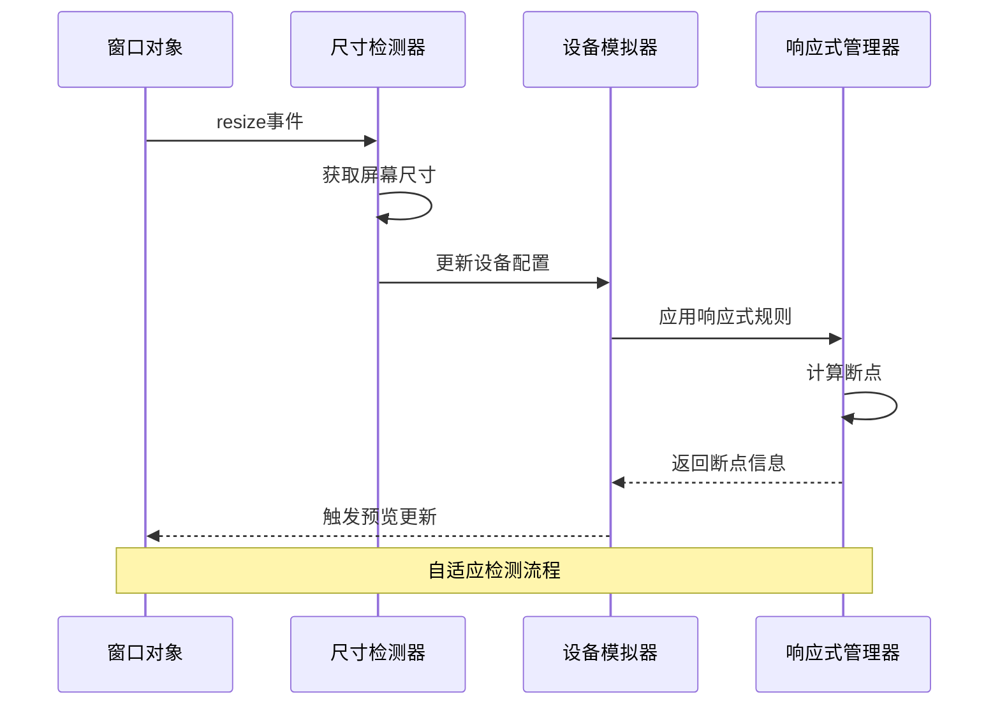
```mermaid
sequenceDiagram
participant Window as 窗口对象
participant Detector as 尺寸检测器
participant Simulator as 设备模拟器
participant Responsive as 响应式管理器
Window->>Detector : resize事件
Detector->>Detector : 获取屏幕尺寸
Detector->>Simulator : 更新设备配置
Simulator->>Responsive : 应用响应式规则
Responsive->>Responsive : 计算断点
Responsive-->>Simulator : 返回断点信息
Simulator-->>Window : 触发预览更新
Note over Window,Responsive : 自适应检测流程
```

**图表来源**
- [企业网站CMS系统详细需求文档.md](file://企业网站CMS系统详细需求文档.md#L99-L102)

**章节来源**
- [企业网站CMS系统详细需求文档.md](file://企业网站CMS系统详细需求文档.md#L69-L102)

### 状态管理系统

状态管理系统确保编辑器和预览模式之间的状态一致性。

#### 状态同步机制

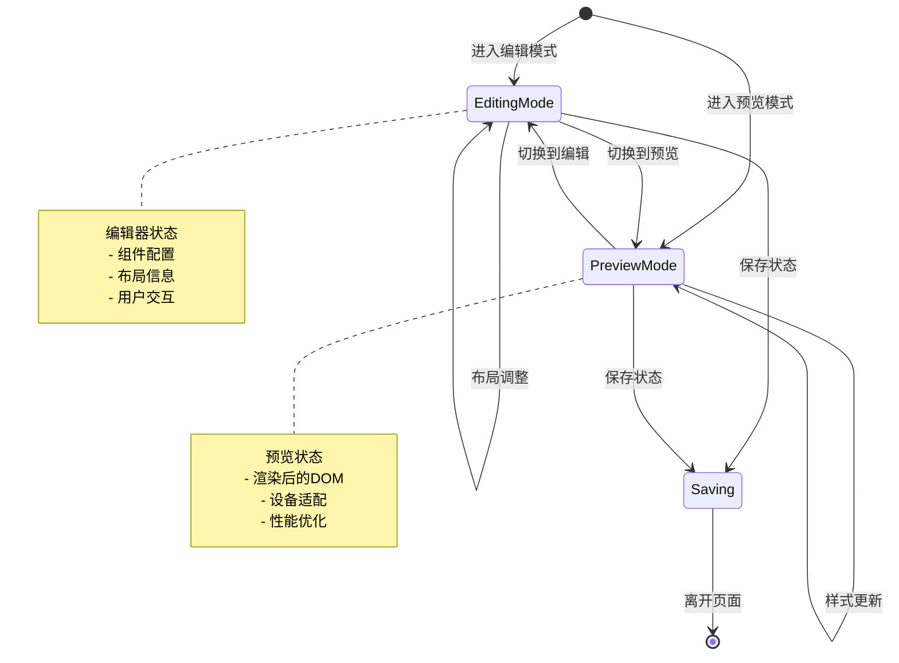
```mermaid
stateDiagram-v2
[*] --> EditingMode : 进入编辑模式
[*] --> PreviewMode : 进入预览模式
EditingMode --> PreviewMode : 切换到预览
PreviewMode --> EditingMode : 切换到编辑
EditingMode --> EditingMode : 组件添加/删除
EditingMode --> EditingMode : 属性修改
EditingMode --> EditingMode : 布局调整
PreviewMode --> PreviewMode : 设备切换
PreviewMode --> PreviewMode : 全屏切换
PreviewMode --> PreviewMode : 样式更新
EditingMode --> Saving : 保存状态
PreviewMode --> Saving : 保存状态
Saving --> [*] : 离开页面
note right of EditingMode
编辑器状态
- 组件配置
- 布局信息
- 用户交互
end note
note right of PreviewMode
预览状态
- 渲染后的DOM
- 设备适配
- 性能优化
end note
```

**图表来源**
- [开发计划表_2月4日-2月12日.md](file://开发计划表_2月4日-2月12日.md#L381-L389)

#### 数据持久化策略

状态管理系统采用多层次的数据持久化策略，确保数据的安全性和可靠性。

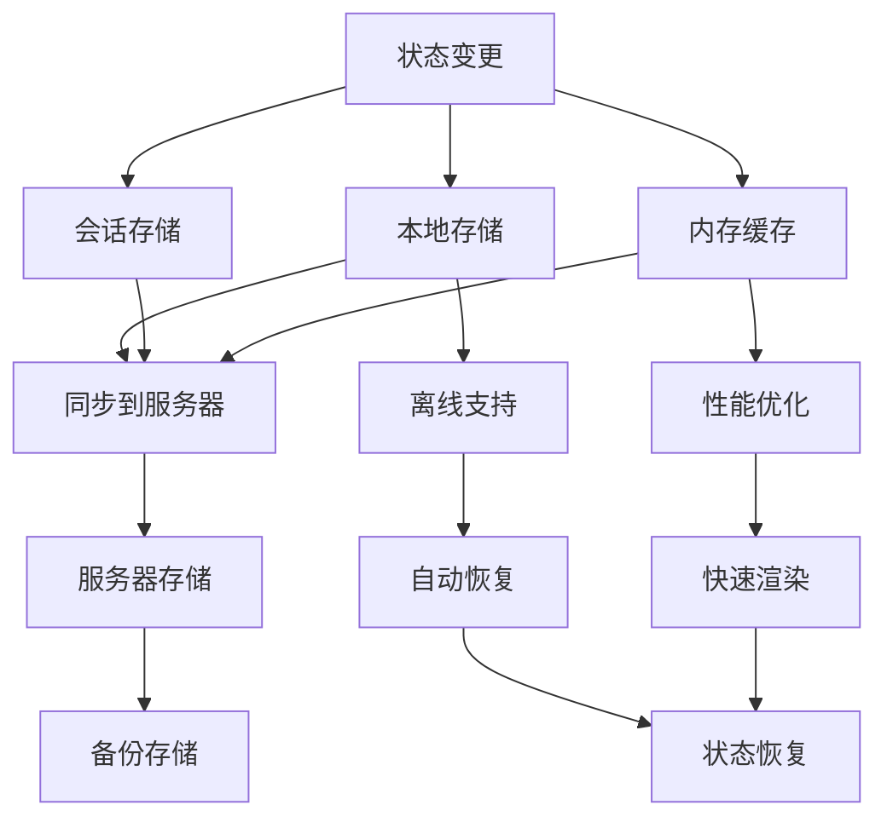
```mermaid
flowchart TD
StateChange[状态变更] --> LocalStorage["本地存储"]
StateChange --> SessionStorage["会话存储"]
StateChange --> MemoryCache["内存缓存"]
LocalStorage --> SyncToServer["同步到服务器"]
SessionStorage --> SyncToServer
MemoryCache --> SyncToServer
SyncToServer --> Server[服务器存储]
Server --> Backup[备份存储]
LocalStorage --> OfflineSupport["离线支持"]
MemoryCache --> PerformanceOptimization["性能优化"]
OfflineSupport --> AutoRecovery["自动恢复"]
AutoRecovery --> StateRestored[状态恢复]
PerformanceOptimization --> FastRendering["快速渲染"]
FastRendering --> StateRestored
```

**图表来源**
- [开发计划表_2月4日-2月12日.md](file://开发计划表_2月4日-2月12日.md#L381-L389)

**章节来源**
- [开发计划表_2月4日-2月12日.md](file://开发计划表_2月4日-2月12日.md#L381-L389)

### 全屏预览实现

全屏预览提供了沉浸式的预览体验，支持用户专注于内容创作。

#### 全屏模式切换机制

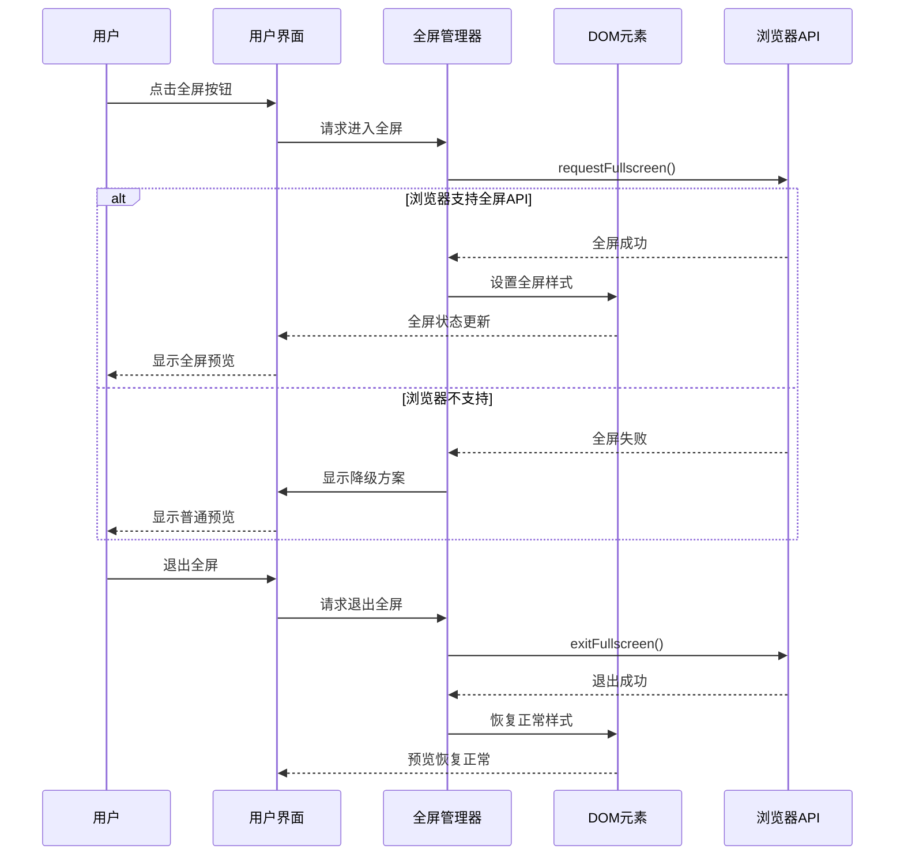
```mermaid
sequenceDiagram
participant User as 用户
participant UI as 用户界面
participant FullscreenManager as 全屏管理器
participant DOM as DOM元素
participant Browser as 浏览器API
User->>UI : 点击全屏按钮
UI->>FullscreenManager : 请求进入全屏
FullscreenManager->>Browser : requestFullscreen()
alt 浏览器支持全屏API
Browser-->>FullscreenManager : 全屏成功
FullscreenManager->>DOM : 设置全屏样式
DOM-->>UI : 全屏状态更新
UI-->>User : 显示全屏预览
else 浏览器不支持
Browser-->>FullscreenManager : 全屏失败
FullscreenManager->>UI : 显示降级方案
UI-->>User : 显示普通预览
end
User->>UI : 退出全屏
UI->>FullscreenManager : 请求退出全屏
FullscreenManager->>Browser : exitFullscreen()
Browser-->>FullscreenManager : 退出成功
FullscreenManager->>DOM : 恢复正常样式
DOM-->>UI : 预览恢复正常
```

**图表来源**
- [企业网站CMS系统详细需求文档.md](file://企业网站CMS系统详细需求文档.md#L97)

#### 全屏预览优化策略

全屏模式采用专门的优化策略，确保在全屏状态下提供最佳的用户体验。

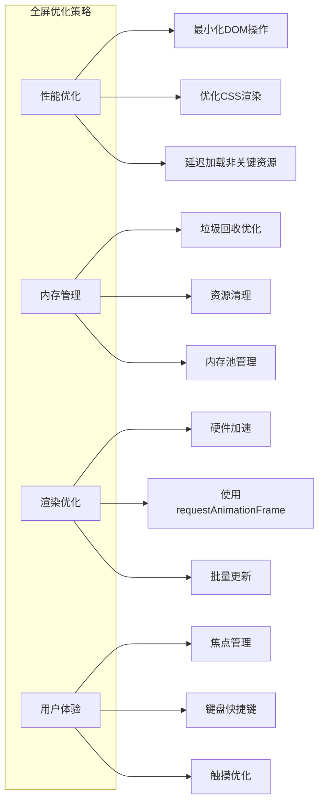
```mermaid
graph LR
subgraph "全屏优化策略"
Performance[性能优化]
Memory[内存管理]
Rendering[渲染优化]
UX[用户体验]
end
Performance --> MinimizeDOM["最小化DOM操作"]
Performance --> OptimizeCSS["优化CSS渲染"]
Performance --> LazyLoading["延迟加载非关键资源"]
Memory --> GarbageCollection["垃圾回收优化"]
Memory --> ResourceCleanup["资源清理"]
Memory --> MemoryPooling["内存池管理"]
Rendering --> HardwareAcceleration["硬件加速"]
Rendering --> RequestAnimationFrame["使用requestAnimationFrame"]
Rendering --> BatchUpdates["批量更新"]
UX --> FocusManagement["焦点管理"]
UX --> KeyboardShortcuts["键盘快捷键"]
UX --> TouchOptimization["触摸优化"]
```

**图表来源**
- [企业网站CMS系统详细需求文档.md](file://企业网站CMS系统详细需求文档.md#L97)

**章节来源**
- [企业网站CMS系统详细需求文档.md](file://企业网站CMS系统详细需求文档.md#L97)

## 依赖关系分析

预览模式系统的依赖关系相对简单，主要依赖于前端框架和第三方库。

### 核心依赖关系

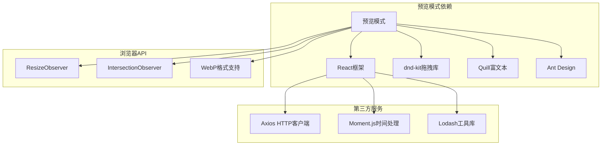
```mermaid
graph TB
subgraph "预览模式依赖"
PreviewMode[预览模式]
React[React框架]
DnDKit[dnd-kit拖拽库]
Quill[Quill富文本]
AntD[Ant Design]
end
subgraph "第三方服务"
Axios[Axios HTTP客户端]
Moment[Moment.js时间处理]
Lodash[Lodash工具库]
end
subgraph "浏览器API"
ResizeObserver[ResizeObserver]
IntersectionObserver[IntersectionObserver]
WebP[WebP格式支持]
end
PreviewMode --> React
PreviewMode --> DnDKit
PreviewMode --> Quill
PreviewMode --> AntD
React --> Axios
React --> Moment
React --> Lodash
PreviewMode --> ResizeObserver
PreviewMode --> IntersectionObserver
PreviewMode --> WebP
```

**图表来源**
- [开发计划表_2月4日-2月12日.md](file://开发计划表_2月4日-2月12日.md#L597-L622)

### 组件间通信机制

预览模式采用事件驱动的组件通信机制，确保各组件间的松耦合。

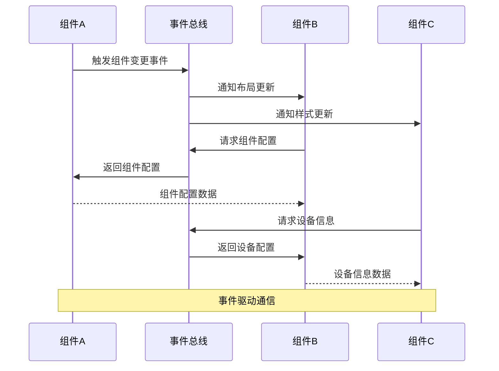
```mermaid
sequenceDiagram
participant ComponentA as 组件A
participant EventBus as 事件总线
participant ComponentB as 组件B
participant ComponentC as 组件C
ComponentA->>EventBus : 触发组件变更事件
EventBus->>ComponentB : 通知布局更新
EventBus->>ComponentC : 通知样式更新
ComponentB->>EventBus : 请求组件配置
EventBus->>ComponentA : 返回组件配置
ComponentA-->>ComponentB : 组件配置数据
ComponentC->>EventBus : 请求设备信息
EventBus->>ComponentB : 返回设备配置
ComponentB-->>ComponentC : 设备信息数据
Note over ComponentA,ComponentC : 事件驱动通信
```

**图表来源**
- [开发计划表_2月4日-2月12日.md](file://开发计划表_2月4日-2月12日.md#L381-L389)

**章节来源**
- [开发计划表_2月4日-2月12日.md](file://开发计划表_2月4日-2月12日.md#L597-L622)

## 性能考虑

预览模式在设计时充分考虑了性能优化，确保在各种设备和网络环境下都能提供流畅的用户体验。

### 性能优化策略

#### 渲染性能优化

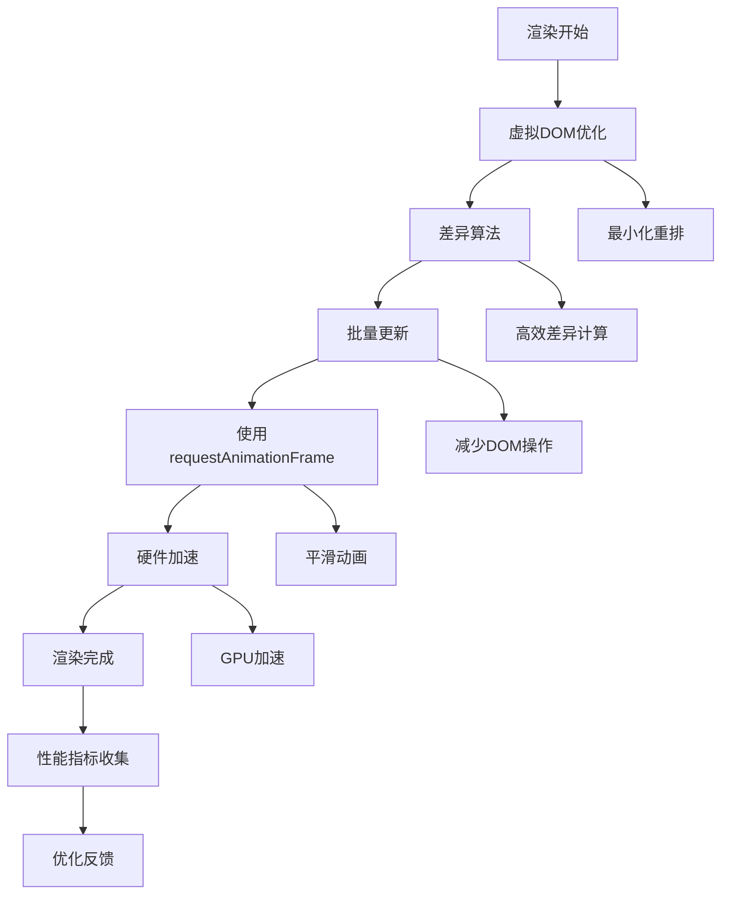
```mermaid
flowchart TD
RenderStart[渲染开始] --> VirtualDOM["虚拟DOM优化"]
VirtualDOM --> DiffAlgorithm["差异算法"]
DiffAlgorithm --> BatchUpdates["批量更新"]
BatchUpdates --> requestAnimationFrame["使用requestAnimationFrame"]
requestAnimationFrame --> HardwareAcceleration["硬件加速"]
HardwareAcceleration --> RenderComplete[渲染完成]
VirtualDOM --> MinimizeReflows["最小化重排"]
DiffAlgorithm --> EfficientDiff["高效差异计算"]
BatchUpdates --> ReduceDOMOps["减少DOM操作"]
requestAnimationFrame --> SmoothAnimation["平滑动画"]
HardwareAcceleration --> GPUAcceleration["GPU加速"]
RenderComplete --> PerformanceMetrics["性能指标收集"]
PerformanceMetrics --> OptimizationFeedback["优化反馈"]
```

#### 内存管理优化

预览模式采用智能的内存管理策略，防止内存泄漏和过度占用。

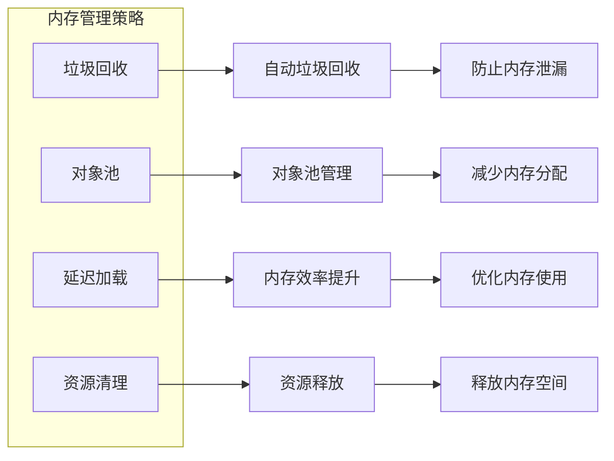
```mermaid
graph LR
subgraph "内存管理策略"
GC[垃圾回收]
Pool[对象池]
LazyLoad[延迟加载]
Cleanup[资源清理]
end
GC --> AutomaticGC["自动垃圾回收"]
Pool --> ObjectPooling["对象池管理"]
LazyLoad --> MemoryEfficiency["内存效率提升"]
Cleanup --> ResourceRelease["资源释放"]
AutomaticGC --> PreventMemoryLeak["防止内存泄漏"]
ObjectPooling --> ReduceAllocation["减少内存分配"]
MemoryEfficiency --> OptimizeMemoryUsage["优化内存使用"]
ResourceRelease --> FreeUpMemory["释放内存空间"]
```

#### 网络性能优化

预览模式采用多种网络优化技术，确保在弱网环境下也能正常工作。

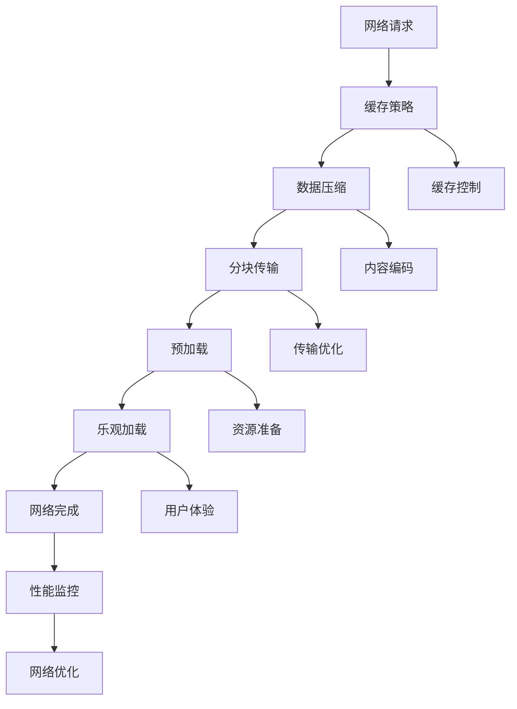
```mermaid
flowchart TD
NetworkStart[网络请求] --> Caching["缓存策略"]
Caching --> Compression["数据压缩"]
Compression --> Chunking["分块传输"]
Chunking --> Prefetching["预加载"]
Prefetching --> OptimisticLoading["乐观加载"]
OptimisticLoading --> NetworkComplete[网络完成]
Caching --> CacheControl["缓存控制"]
Compression --> ContentEncoding["内容编码"]
Chunking --> TransferOptimization["传输优化"]
Prefetching --> ResourcePreparation["资源准备"]
OptimisticLoading --> UserExperience["用户体验"]
NetworkComplete --> PerformanceMonitoring["性能监控"]
PerformanceMonitoring --> NetworkOptimization["网络优化"]
```

**章节来源**
- [企业网站CMS系统详细需求文档.md](file://企业网站CMS系统详细需求文档.md#L512-L548)

## 故障排除指南

预览模式可能遇到的各种问题及其解决方案。

### 常见问题及解决方案

#### 预览不更新问题

**问题描述**：编辑器中的更改没有反映在预览中。

**可能原因**：
1. 状态同步机制故障
2. 组件渲染器异常
3. 事件监听器丢失

**解决方案**：
1. 检查状态管理器是否正常工作
2. 验证组件渲染器的更新逻辑
3. 重新绑定事件监听器

#### 设备适配问题

**问题描述**：在某些设备上预览效果不正确。

**可能原因**：
1. 响应式断点配置错误
2. CSS媒体查询问题
3. 设备像素比计算错误

**解决方案**：
1. 检查设备断点配置
2. 验证CSS媒体查询语法
3. 重新计算设备像素比

#### 全屏模式问题

**问题描述**：全屏预览功能无法正常工作。

**可能原因**：
1. 浏览器不支持全屏API
2. 权限不足
3. 样式冲突

**解决方案**：
1. 检查浏览器兼容性
2. 验证全屏权限
3. 解决样式冲突问题

### 调试工具和技巧

#### 预览模式调试工具

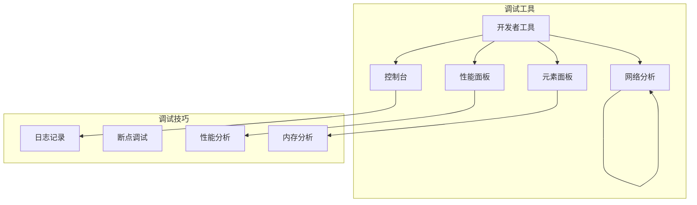
```mermaid
graph TB
subgraph "调试工具"
DevTools[开发者工具]
Console[控制台]
Network[网络面板]
Performance[性能面板]
Elements[元素面板]
end
subgraph "调试技巧"
Logging[日志记录]
Breakpoints[断点调试]
Profiling[性能分析]
Memory[内存分析]
Network[网络分析]
end
DevTools --> Console
DevTools --> Network
DevTools --> Performance
DevTools --> Elements
Console --> Logging
Network --> Network
Performance --> Profiling
Elements --> Memory
```

#### 错误处理和回退机制

预览模式采用多层次的错误处理机制，确保系统在出现问题时能够优雅地降级。

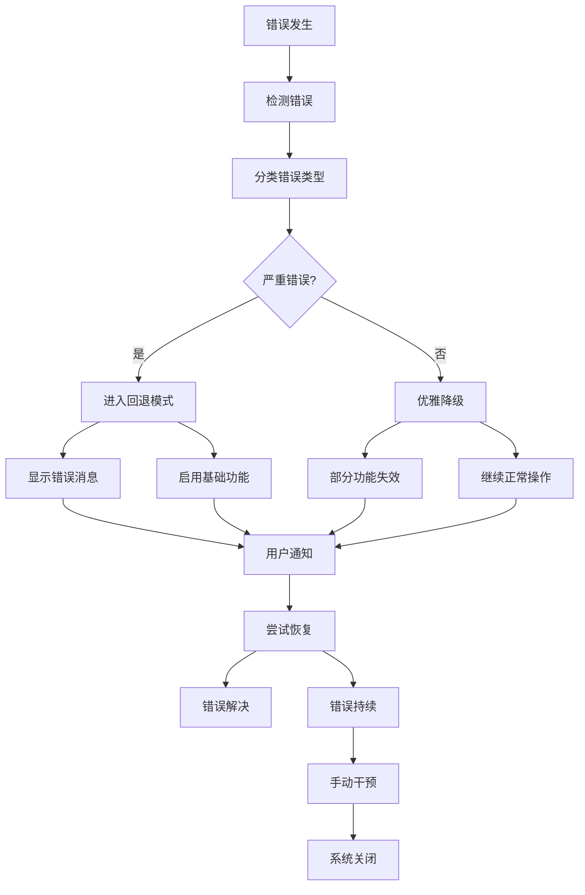
```mermaid
flowchart TD
ErrorOccur[错误发生] --> DetectError["检测错误"]
DetectError --> ClassifyError["分类错误类型"]
ClassifyError --> CriticalError{"严重错误?"}
CriticalError --> |是| FallbackMode["进入回退模式"]
CriticalError --> |否| GracefulDegradation["优雅降级"]
FallbackMode --> DisplayMessage["显示错误消息"]
FallbackMode --> EnableBasicFeatures["启用基础功能"]
GracefulDegradation --> PartialFailure["部分功能失效"]
GracefulDegradation --> ContinueOperation["继续正常操作"]
DisplayMessage --> UserNotification["用户通知"]
EnableBasicFeatures --> UserNotification
PartialFailure --> UserNotification
ContinueOperation --> UserNotification
UserNotification --> Recovery["尝试恢复"]
Recovery --> ErrorResolved["错误解决"]
Recovery --> ErrorPersist["错误持续"]
ErrorPersist --> ManualIntervention["手动干预"]
ManualIntervention --> SystemShutdown["系统关闭"]
```

**章节来源**
- [企业网站CMS系统详细需求文档.md](file://企业网站CMS系统详细需求文档.md#L512-L548)

## 结论

预览模式作为企业网站CMS系统的核心功能，通过精心设计的架构和实现策略，为用户提供了优秀的可视化编辑体验。系统采用了模块化设计、事件驱动架构和多层次的状态管理机制，确保了功能的完整性、性能的优化性和用户体验的流畅性。

### 技术亮点

1. **实时预览**：通过高效的组件渲染和状态同步机制，实现了毫秒级的预览更新
2. **多设备适配**：完善的响应式设计和设备模拟器，支持多种设备的预览
3. **性能优化**：采用虚拟DOM、批量更新和硬件加速等技术，确保流畅的用户体验
4. **错误处理**：多层次的错误处理和回退机制，提高了系统的稳定性
5. **扩展性**：模块化的架构设计，便于功能的扩展和维护

### 未来发展方向

基于当前的实现基础，预览模式还有很大的优化空间：

1. **AI辅助预览**：集成AI技术，提供智能的内容预览和优化建议
2. **云端协作**：支持多用户实时协作编辑和预览
3. **增强现实**：探索AR技术在预览模式中的应用
4. **语音交互**：集成语音控制功能，提升用户体验
5. **自动化测试**：建立完善的自动化测试体系，确保预览功能的稳定性

预览模式的成功实现为企业网站CMS系统奠定了坚实的技术基础，为后续的功能扩展和性能优化提供了良好的起点。