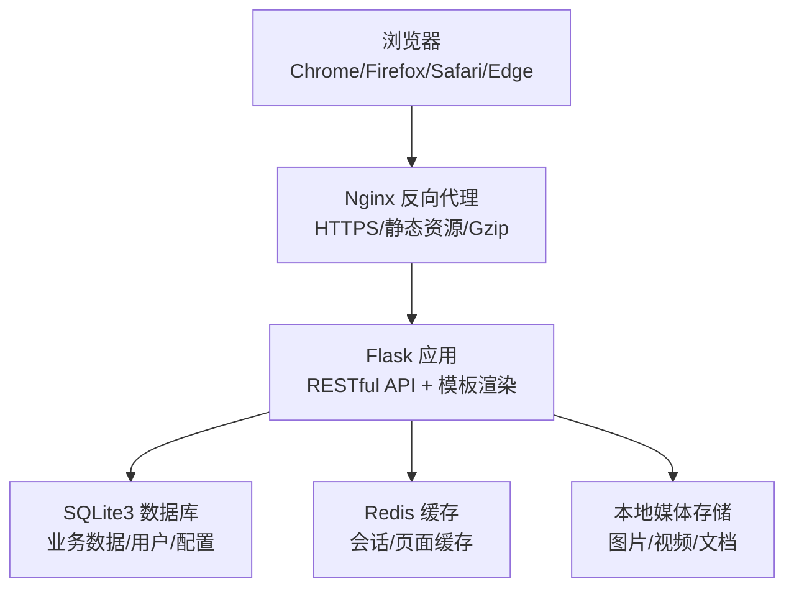
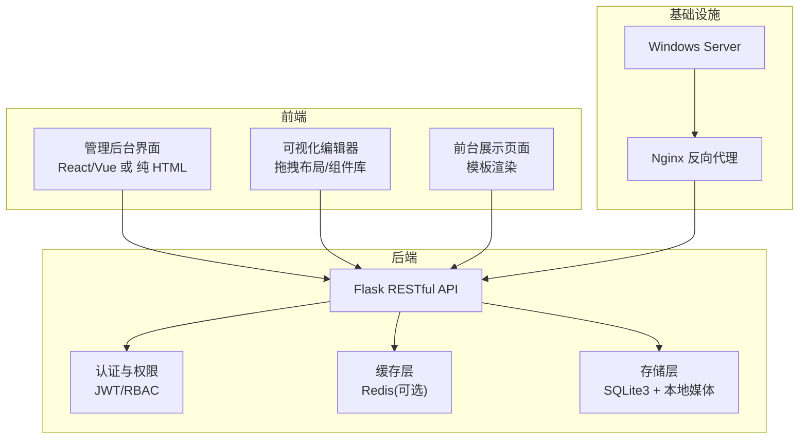
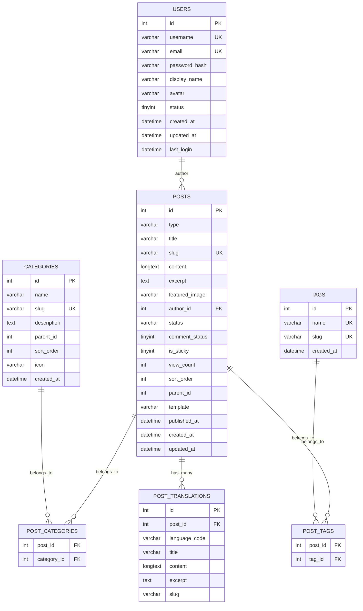
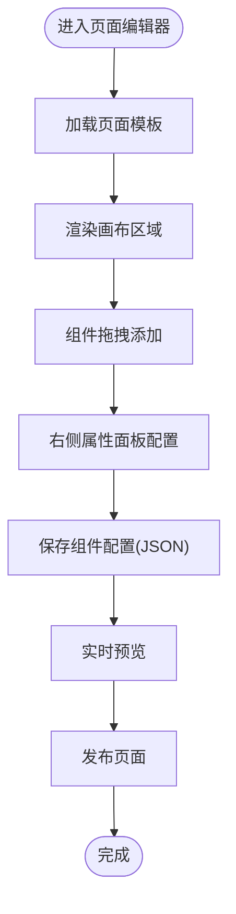
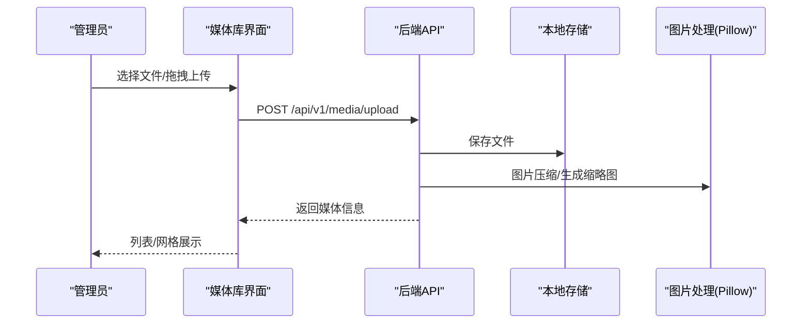
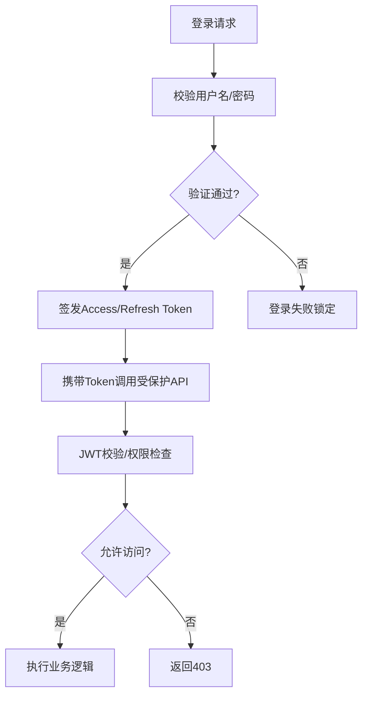
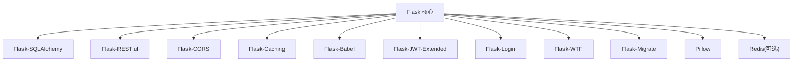

# 内容管理系统

<cite>
**本文引用的文件**
- [企业网站CMS系统开发需求文档.ini](file://企业网站CMS系统开发需求文档.ini)
- [企业网站CMS系统详细需求文档.md](file://企业网站CMS系统详细需求文档.md)
</cite>

## 目录
1. [简介](#简介)
2. [项目结构](#项目结构)
3. [核心组件](#核心组件)
4. [架构总览](#架构总览)
5. [详细组件分析](#详细组件分析)
6. [依赖分析](#依赖分析)
7. [性能考量](#性能考量)
8. [故障排查指南](#故障排查指南)
9. [结论](#结论)
10. [附录](#附录)

## 简介
本项目为企业官网内容管理系统（CMS）的需求与设计文档，目标是提供一套功能完善、易于维护、具备可视化编辑能力的企业官网管理平台。系统采用前后端分离架构，后端基于 Python Flask + SQLite3，前端可选 React/Vue 或纯 HTML 模板渲染，部署于 Windows Server + Nginx 环境。文档覆盖三大核心功能模块：文章管理、页面管理、媒体库管理，并对数据模型、业务规则、权限体系、SEO、性能优化与扩展性进行系统化说明。

## 项目结构
- 后端：Flask 应用，使用 SQLAlchemy 进行 ORM，RESTful API，JWT 认证，支持缓存与国际化。
- 前端：可选 React/Vue 或纯 HTML 模板（Jinja2），提供管理后台界面与可视化编辑器。
- 部署：Nginx 反向代理 + Gunicorn/Waitress，Windows 服务（NSSM）托管，支持 HTTPS、Gzip 压缩与静态资源缓存。
- 存储：SQLite3 作为主数据库，媒体文件本地存储；可选 Redis 缓存与云存储（OSS/COS/七牛）。

**图表来源**
- [企业网站CMS系统详细需求文档.md](file://企业网站CMS系统详细需求文档.md#L22-L57)
- [企业网站CMS系统详细需求文档.md](file://企业网站CMS系统详细需求文档.md#L1143-L1230)
- [企业网站CMS系统详细需求文档.md](file://企业网站CMS系统详细需求文档.md#L1232-L1302)

**章节来源**
- [企业网站CMS系统详细需求文档.md](file://企业网站CMS系统详细需求文档.md#L22-L57)
- [企业网站CMS系统详细需求文档.md](file://企业网站CMS系统详细需求文档.md#L1143-L1230)
- [企业网站CMS系统详细需求文档.md](file://企业网站CMS系统详细需求文档.md#L1232-L1302)

## 核心组件
- 用户与权限管理：基于角色的访问控制（RBAC），支持多角色（超级管理员、管理员、编辑、作者、访客），细粒度权限与数据级权限（仅操作自身数据）。
- 内容管理：
  - 文章管理：列表、编辑器、分类/标签、SEO 设置、定时发布、置顶、评论开关、版本历史。
  - 页面管理：页面树形结构、可视化拖拽编辑器、模板系统、页面设置（URL、父级、状态、访问权限）。
  - 媒体库管理：文件上传（拖拽/批量/粘贴）、文件类型与大小限制、图片压缩、图片编辑（裁剪/旋转/缩放/滤镜）、信息编辑（标题/描述/ALT）。
- 系统配置：网站设置、SEO 配置、URL 规则、邮件配置、安全设置、性能配置、备份管理。
- 多语言支持：基于 Flask-Babel 的多语言内容与界面管理。
- SEO 优化：友好 URL、Meta 标签、Sitemap、Canonical、Robots、面包屑导航等。
- 性能优化：页面缓存（Redis）、数据缓存、静态资源缓存、图片懒加载、响应式图片、CDN、Gzip 压缩。

**章节来源**
- [企业网站CMS系统详细需求文档.md](file://企业网站CMS系统详细需求文档.md#L294-L387)
- [企业网站CMS系统详细需求文档.md](file://企业网站CMS系统详细需求文档.md#L448-L548)
- [企业网站CMS系统详细需求文档.md](file://企业网站CMS系统详细需求文档.md#L551-L659)

## 架构总览
系统采用前后端分离架构，后端提供 RESTful API，前端可采用 SPA 或纯 HTML 模板渲染。Nginx 负责静态资源服务、HTTPS 终止、Gzip 压缩与反向代理。数据库使用 SQLite3，媒体文件本地存储，可选 Redis 缓存与云存储。

**图表来源**
- [企业网站CMS系统详细需求文档.md](file://企业网站CMS系统详细需求文档.md#L22-L57)
- [企业网站CMS系统详细需求文档.md](file://企业网站CMS系统详细需求文档.md#L551-L659)
- [企业网站CMS系统详细需求文档.md](file://企业网站CMS系统详细需求文档.md#L1143-L1230)

**章节来源**
- [企业网站CMS系统详细需求文档.md](file://企业网站CMS系统详细需求文档.md#L22-L57)
- [企业网站CMS系统详细需求文档.md](file://企业网站CMS系统详细需求文档.md#L551-L659)
- [企业网站CMS系统详细需求文档.md](file://企业网站CMS系统详细需求文档.md#L1143-L1230)

## 详细组件分析

### 文章管理模块
- 功能要点
  - 列表：支持列表/卡片视图、筛选（状态/分类/标签/作者/日期）、排序（发布时间/更新时间/浏览量）、搜索（标题/内容/作者）、批量操作（删除/修改状态/移动分类）。
  - 编辑器：标题、富文本编辑、特色图片、摘要、分类/标签、SEO 设置（URL 别名/Meta 描述/关键词）、发布设置（草稿/待审核/已发布/定时发布/置顶/允许评论）、自定义字段、版本历史/恢复。
  - 分类/标签：树形分类结构、分类排序、别名（slug）、描述、图标/图片；标签云、标签合并、使用统计。
- 数据模型
  - posts 表：文章/页面统一表，区分 type，包含标题、slug、内容、摘要、作者、状态、评论开关、置顶、排序、模板、发布时间等。
  - categories 与 post_categories：分类与文章的多对多关系。
  - tags 与 post_tags：标签与文章的多对多关系。
  - post_translations：多语言翻译表。
- 全文搜索：使用 SQLite FTS5 虚拟表与触发器保持同步，支持关键词检索。
- API：文章列表/详情/创建/更新/删除、批量删除、修改状态、分类/标签 CRUD。

**图表来源**
- [企业网站CMS系统详细需求文档.md](file://企业网站CMS系统详细需求文档.md#L716-L904)
- [企业网站CMS系统详细需求文档.md](file://企业网站CMS系统详细需求文档.md#L906-L938)

**章节来源**
- [企业网站CMS系统详细需求文档.md](file://企业网站CMS系统详细需求文档.md#L296-L330)
- [企业网站CMS系统详细需求文档.md](file://企业网站CMS系统详细需求文档.md#L716-L904)
- [企业网站CMS系统详细需求文档.md](file://企业网站CMS系统详细需求文档.md#L906-L938)

### 页面管理模块
- 功能要点
  - 页面列表：树形结构、拖拽排序、快速编辑、页面预览。
  - 页面编辑器：可视化拖拽编辑器、页面模板选择、页面设置（URL 路径、父级页面、状态、访问权限）、SEO 设置。
  - 模板系统：首页模板、文章列表模板、文章详情模板、单页模板、自定义模板。
- 数据模型
  - posts 表中的 type='page' 对应页面；parent_id 支持树形结构；template 指定页面模板。
  - page_components：页面组件配置（JSON 存储），支持组件类型、数据、排序、父子关系。
- API：页面 CRUD、获取/更新组件配置。

**图表来源**
- [企业网站CMS系统详细需求文档.md](file://企业网站CMS系统详细需求文档.md#L331-L354)
- [企业网站CMS系统详细需求文档.md](file://企业网站CMS系统详细需求文档.md#L863-L877)

**章节来源**
- [企业网站CMS系统详细需求文档.md](file://企业网站CMS系统详细需求文档.md#L331-L354)
- [企业网站CMS系统详细需求文档.md](file://企业网站CMS系统详细需求文档.md#L863-L877)

### 媒体库管理模块
- 功能要点
  - 文件上传：支持图片（JPG/PNG/GIF/SVG/WebP）、视频（MP4/WebM/MOV）、文档（PDF/DOC/DOCX/XLS/XLSX）；拖拽/批量/粘贴上传；文件大小限制；图片自动压缩。
  - 媒体管理：列表/网格视图、文件夹组织、类型/日期/尺寸筛选、搜索、图片编辑（裁剪/旋转/缩放/滤镜）、文件信息编辑（标题/描述/ALT）。
  - 存储管理：本地存储、云存储（OSS/COS/七牛）、存储空间统计、未使用文件清理。
- 数据模型
  - media 表：文件名、原始名、路径、URL、MIME 类型、大小、宽高、标题/ALT/描述、所属文件夹、上传者、创建时间。
- API：媒体列表/详情、上传（单/批量）、更新信息、删除。

**图表来源**
- [企业网站CMS系统详细需求文档.md](file://企业网站CMS系统详细需求文档.md#L355-L387)
- [企业网站CMS系统详细需求文档.md](file://企业网站CMS系统详细需求文档.md#L839-L861)
- [企业网站CMS系统详细需求文档.md](file://企业网站CMS系统详细需求文档.md#L1058-L1066)

**章节来源**
- [企业网站CMS系统详细需求文档.md](file://企业网站CMS系统详细需求文档.md#L355-L387)
- [企业网站CMS系统详细需求文档.md](file://企业网站CMS系统详细需求文档.md#L839-L861)
- [企业网站CMS系统详细需求文档.md](file://企业网站CMS系统详细需求文档.md#L1058-L1066)

### 权限与认证
- 角色体系：超级管理员、管理员、编辑、作者、访客；RBAC 模型；装饰器权限验证。
- 认证：JWT Token（Access/Refresh），支持刷新；密码加密（bcrypt）；登录失败锁定；会话管理（Redis）。
- API 安全：限流（Flask-Limiter）、CSRF 防护、XSS/SQL 注入防护、文件上传安全规则、HTTPS 强制跳转。

**图表来源**
- [企业网站CMS系统详细需求文档.md](file://企业网站CMS系统详细需求文档.md#L271-L293)
- [企业网站CMS系统详细需求文档.md](file://企业网站CMS系统详细需求文档.md#L1078-L1140)

**章节来源**
- [企业网站CMS系统详细需求文档.md](file://企业网站CMS系统详细需求文档.md#L271-L293)
- [企业网站CMS系统详细需求文档.md](file://企业网站CMS系统详细需求文档.md#L1078-L1140)

### SEO 与多语言
- SEO：友好 URL、Meta 标签（Title/Description/Keywords/Open Graph/Twitter Card）、Sitemap、Robots、Canonical、面包屑、图片 ALT 自动填充。
- 多语言：基于 Flask-Babel 的内容与界面多语言，支持语言切换、内容多语言版本、翻译表设计。

**章节来源**
- [企业网站CMS系统详细需求文档.md](file://企业网站CMS系统详细需求文档.md#L482-L511)
- [企业网站CMS系统详细需求文档.md](file://企业网站CMS系统详细需求文档.md#L450-L481)

### 性能与扩展性
- 缓存：页面缓存（Redis）、数据缓存、静态资源缓存；缓存预热与失效策略。
- 资源优化：图片懒加载、响应式图片、WebP、CSS/JS 压缩合并、关键 CSS 内联、异步加载非关键资源。
- 数据库优化：索引优化、避免 N+1 查询、连接池配置、慢查询日志。
- CDN：静态资源 CDN 加速、CDN 域名配置、缓存刷新。
- 扩展性：模块化设计、插件化思想（模板/组件/插件管理）、API 版本控制、数据库迁移（Flask-Migrate）。

**章节来源**
- [企业网站CMS系统详细需求文档.md](file://企业网站CMS系统详细需求文档.md#L512-L548)
- [企业网站CMS系统详细需求文档.md](file://企业网站CMS系统详细需求文档.md#L551-L659)

## 依赖分析
- 后端依赖：Flask 生态（SQLAlchemy、RESTful、CORS、Caching、Babel、JWT、Login、WTF、Migrate），Pillow（图片处理），bcrypt（密码加密），requests（HTTP 客户端），可选 Redis。
- 前端依赖：React/Vue（可选），Ant Design/Element Plus，dnd-kit/react-beautiful-dnd（拖拽），Quill/TinyMCE（富文本），Axios（HTTP），Pinia/Redux（状态管理）。
- 部署依赖：Nginx、Windows 服务（NSSM/Waitress）、SSL 证书、CDN（可选）。

**图表来源**
- [企业网站CMS系统详细需求文档.md](file://企业网站CMS系统详细需求文档.md#L555-L594)

**章节来源**
- [企业网站CMS系统详细需求文档.md](file://企业网站CMS系统详细需求文档.md#L555-L594)

## 性能考量
- 响应时间：首页加载 < 2 秒，内页 < 3 秒，API < 500ms，数据库查询 < 100ms。
- 并发性能：支持 1000+ 并发用户，QPS 500+，数据库连接池 50。
- 资源占用：内存 < 2GB，CPU < 70%，磁盘 IO < 80%。
- 优化手段：页面缓存、数据缓存、静态资源缓存、图片懒加载、响应式图片、CDN、Gzip 压缩、索引优化、避免 N+1 查询。

**章节来源**
- [企业网站CMS系统详细需求文档.md](file://企业网站CMS系统详细需求文档.md#L1362-L1380)

## 故障排查指南
- 登录与权限
  - 确认 JWT Token 是否正确携带（Authorization: Bearer <token>）。
  - 检查角色与权限是否匹配，确认权限装饰器生效。
  - 查看登录失败锁定策略与账号状态。
- 文件上传
  - 检查文件类型白名单与大小限制，确认上传路径与权限。
  - 图片压缩与缩略图生成是否异常，查看 Pillow 依赖。
- 数据库
  - SQLite 文件权限与路径，FTS5 触发器是否正确创建与同步。
  - 索引缺失导致查询缓慢，检查索引与查询日志。
- 缓存与性能
  - Redis 连接与键空间，页面缓存命中率，静态资源缓存策略。
- 安全
  - HTTPS 强制跳转、CSP 头、CSRF Token、XSS 过滤是否启用。
  - API 限流配置与异常登录检测。

**章节来源**
- [企业网站CMS系统详细需求文档.md](file://企业网站CMS系统详细需求文档.md#L1078-L1140)
- [企业网站CMS系统详细需求文档.md](file://企业网站CMS系统详细需求文档.md#L1362-L1380)

## 结论
本需求文档明确了企业 CMS 的功能边界、技术栈与部署方案，围绕文章管理、页面管理与媒体库管理三大核心模块，给出了清晰的数据模型、业务规则与安全策略。通过 SQLite3 的轻量与易维护特性，结合 Redis 缓存与 Nginx 优化，系统能够在中小规模场景下实现高性能与可扩展性。建议在后续版本中逐步引入多语言、复杂权限、高级 SEO 与数据统计等功能，持续迭代完善。

## 附录
- API 接口概览（节选）
  - 认证：登录、登出、注册、刷新、忘记/重置密码、当前用户信息。
  - 用户：列表、详情、创建、更新、删除、分配角色。
  - 文章：列表、详情、创建、更新、删除、批量删除、修改状态。
  - 页面：列表、详情、创建、更新、删除、获取/更新组件配置。
  - 分类/标签：列表、创建、更新、删除。
  - 媒体：列表、详情、上传（单/批量）、更新信息、删除。
  - 系统配置：获取/更新配置、备份管理。

**章节来源**
- [企业网站CMS系统详细需求文档.md](file://企业网站CMS系统详细需求文档.md#L940-L1076)