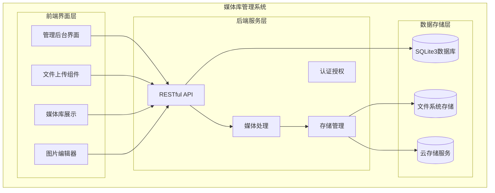
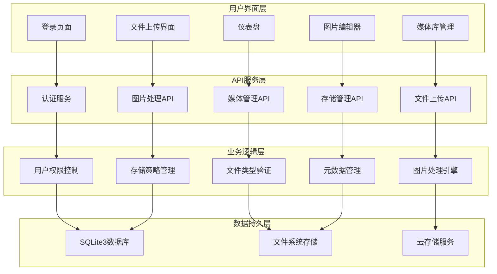
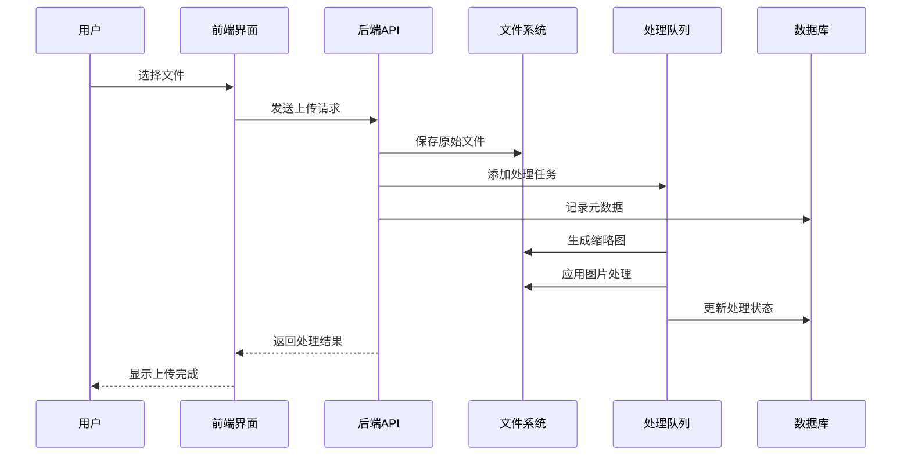
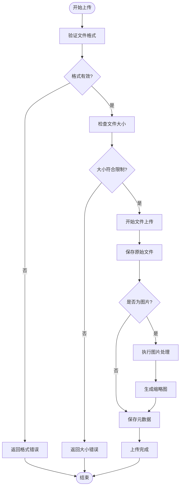
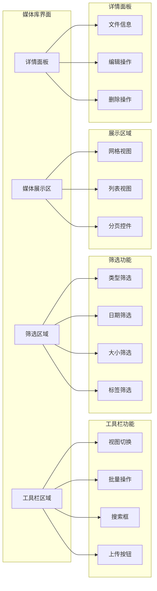
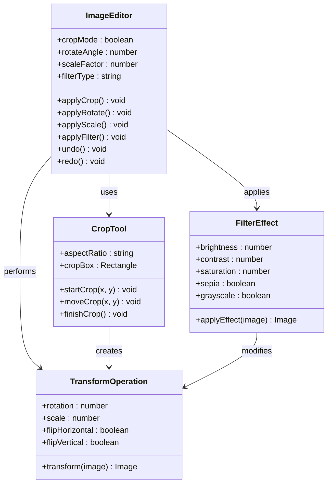
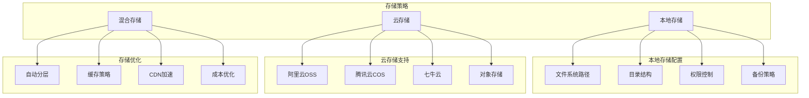
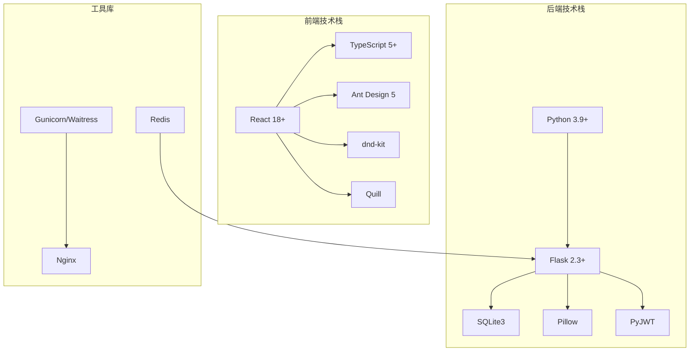

# 媒体库管理

<cite>
**本文档引用的文件**
- [企业网站CMS系统详细需求文档.md](file://企业网站CMS系统详细需求文档.md)
- [企业网站CMS系统开发需求文档.ini](file://企业网站CMS系统开发需求文档.ini)
- [开发计划表_2月4日-2月12日.md](file://开发计划表_2月4日-2月12日.md)
</cite>

## 目录
1. [简介](#简介)
2. [项目结构](#项目结构)
3. [核心组件](#核心组件)
4. [架构概览](#架构概览)
5. [详细组件分析](#详细组件分析)
6. [依赖关系分析](#依赖关系分析)
7. [性能考虑](#性能考虑)
8. [故障排除指南](#故障排除指南)
9. [结论](#结论)
10. [附录](#附录)

## 简介

媒体库管理是企业网站CMS系统的核心功能模块之一，负责管理网站中的所有媒体资源，包括图片、视频和文档文件。该系统提供了完整的文件上传机制、存储管理和图片编辑功能，支持多种文件格式和丰富的管理特性。

本系统采用前后端分离架构，后端基于Python Flask框架，前端使用React/Vue技术栈，支持现代化的用户体验和高效的媒体资源管理。

## 项目结构

媒体库管理系统遵循模块化设计原则，主要分为以下几个核心模块：

**图表来源**
- [开发计划表_2月4日-2月12日.md](file://开发计划表_2月4日-2月12日.md#L92-L105)
- [企业网站CMS系统详细需求文档.md](file://企业网站CMS系统详细需求文档.md#L22-L57)

**章节来源**
- [开发计划表_2月4日-2月12日.md](file://开发计划表_2月4日-2月12日.md#L92-L105)
- [企业网站CMS系统详细需求文档.md](file://企业网站CMS系统详细需求文档.md#L22-L57)

## 核心组件

### 文件上传机制

媒体库系统提供了多种文件上传方式，确保用户能够便捷地管理媒体资源：

#### 支持的文件格式
系统支持广泛的媒体文件格式，满足不同类型内容的需求：

**图片格式支持：**
- JPG/JPEG: 标准照片格式，支持压缩
- PNG: 支持透明背景的高质量图像
- GIF: 支持简单动画效果
- SVG: 矢量图形，无损缩放
- WebP: 现代压缩格式，体积更小

**视频格式支持：**
- MP4: 最广泛支持的视频格式
- WebM: 开源视频格式
- MOV: Apple QuickTime格式

**文档格式支持：**
- PDF: 便携文档格式
- DOC/DOCX: Microsoft Word文档
- XLS/XLSX: Excel电子表格
- PPT/PPTX: PowerPoint演示文稿

#### 上传特性
- **拖拽上传**: 直观的拖拽操作，提升用户体验
- **批量上传**: 支持多文件同时上传
- **粘贴上传**: 支持截图粘贴上传功能
- **文件大小限制**: 可配置的文件大小限制
- **自动压缩**: 图片自动压缩优化存储空间

### 媒体管理功能

#### 列表视图与网格视图
系统提供灵活的媒体资源展示方式：
- **列表视图**: 详细信息展示，适合管理大量文件
- **网格视图**: 卡片式展示，适合快速浏览

#### 文件夹组织
支持层次化的文件夹结构，便于媒体资源的分类管理：
- 树形目录结构
- 拖拽式文件夹管理
- 快速创建和重命名文件夹

#### 文件筛选与搜索
强大的文件管理功能：
- **类型筛选**: 按文件类型快速过滤
- **日期筛选**: 按上传时间筛选
- **尺寸筛选**: 按文件大小筛选
- **智能搜索**: 支持关键词搜索

### 图片编辑功能

#### 基础编辑操作
系统提供完整的图片编辑工具：
- **裁剪功能**: 支持矩形裁剪和自定义形状
- **旋转功能**: 90度倍数旋转
- **缩放功能**: 支持放大缩小
- **滤镜效果**: 内置多种滤镜效果

#### 高级编辑特性
- **锐化处理**: 提升图片清晰度
- **亮度调节**: 调整图片明暗程度
- **对比度调整**: 改善视觉效果
- **色彩平衡**: 调整色调和饱和度

### 文件信息管理

#### 元数据编辑
每个媒体文件都支持详细的元数据管理：
- **标题编辑**: 设置文件显示名称
- **描述编辑**: 添加文件详细描述
- **ALT文本**: 为图片设置替代文本
- **标签管理**: 为文件添加关键词标签

**章节来源**
- [企业网站CMS系统详细需求文档.md](file://企业网站CMS系统详细需求文档.md#L355-L387)
- [开发计划表_2月4日-2月12日.md](file://开发计划表_2月4日-2月12日.md#L196-L212)

## 架构概览

媒体库管理系统采用现代化的分层架构设计，确保系统的可扩展性和维护性：

**图表来源**
- [开发计划表_2月4日-2月12日.md](file://开发计划表_2月4日-2月12日.md#L255-L279)
- [企业网站CMS系统详细需求文档.md](file://企业网站CMS系统详细需求文档.md#L551-L628)

### 数据流处理

系统采用异步处理机制，确保上传和处理过程的流畅性：

**图表来源**
- [开发计划表_2月4日-2月12日.md](file://开发计划表_2月4日-2月12日.md#L196-L212)

## 详细组件分析

### 文件上传组件

#### 上传流程设计

**图表来源**
- [开发计划表_2月4日-2月12日.md](file://开发计划表_2月4日-2月12日.md#L196-L212)

#### 上传特性实现

| 特性 | 实现方式 | 配置参数 |
|------|----------|----------|
| 拖拽上传 | HTML5拖拽API | 支持多文件拖拽 |
| 批量上传 | 文件选择器 | 支持Ctrl/Cmd多选 |
| 粘贴上传 | Clipboard API | 截图自动识别 |
| 文件大小限制 | 后端验证 | 默认5MB可配置 |
| 图片压缩 | Canvas API | JPEG质量85% |

### 媒体管理界面

#### 界面布局设计

**图表来源**
- [开发计划表_2月4日-2月12日.md](file://开发计划表_2月4日-2月12日.md#L331-L343)

#### 用户交互流程

系统提供直观的用户交互体验：

1. **文件上传流程**
   - 点击上传按钮或拖拽文件到指定区域
   - 系统自动验证文件格式和大小
   - 显示上传进度条
   - 上传完成后自动刷新媒体库

2. **文件管理流程**
   - 网格视图下点击文件卡片查看详情
   - 支持批量选择和批量操作
   - 右键菜单提供快捷操作

3. **图片编辑流程**
   - 在媒体库中选择图片进入编辑模式
   - 使用工具栏进行各种编辑操作
   - 支持撤销/重做功能

**章节来源**
- [开发计划表_2月4日-2月12日.md](file://开发计划表_2月4日-2月12日.md#L331-L343)

### 图片编辑器

#### 编辑功能模块

**图表来源**
- [企业网站CMS系统详细需求文档.md](file://企业网站CMS系统详细需求文档.md#L372-L377)

#### 编辑操作实现

| 编辑功能 | 实现原理 | 性能考虑 |
|----------|----------|----------|
| 裁剪操作 | Canvas绘制裁剪区域 | 实时预览，即时应用 |
| 旋转操作 | 2D变换矩阵 | 支持任意角度旋转 |
| 缩放操作 | 图像重采样算法 | 高质量缩放算法 |
| 滤镜效果 | 像素级颜色变换 | GPU加速处理 |

### 存储管理策略

#### 存储架构设计

**图表来源**
- [企业网站CMS系统详细需求文档.md](file://企业网站CMS系统详细需求文档.md#L379-L386)

#### 存储配置选项

| 存储类型 | 优点 | 适用场景 | 配置要点 |
|----------|------|----------|----------|
| 本地存储 | 成本低，访问快 | 小型企业，数据量小 | 路径配置，权限设置 |
| 阿里云OSS | 稳定性强，带宽充足 | 中型企业，流量大 | Access Key配置 |
| 腾讯云COS | 与国内服务集成好 | 国内用户为主 | 地域选择，备份策略 |
| 七牛云 | 对象存储专业 | 多媒体内容丰富 | CDN加速配置 |

**章节来源**
- [企业网站CMS系统详细需求文档.md](file://企业网站CMS系统详细需求文档.md#L379-L386)

## 依赖关系分析

### 技术栈依赖

媒体库管理系统采用现代化的技术栈，确保系统的稳定性和可扩展性：

**图表来源**
- [企业网站CMS系统详细需求文档.md](file://企业网站CMS系统详细需求文档.md#L555-L594)

### 外部依赖管理

系统对外部依赖进行了精心管理，确保版本兼容性和安全性：

| 依赖库 | 版本要求 | 用途 | 安全考虑 |
|--------|----------|------|----------|
| Flask | 2.3+ | Web框架 | 定期安全更新 |
| Pillow | 最新版 | 图片处理 | 图片格式漏洞防护 |
| React | 18+ | 前端框架 | 组件安全审计 |
| Ant Design | 5+ | UI组件库 | 样式安全检查 |
| dnd-kit | 最新版 | 拖拽功能 | 事件安全处理 |

**章节来源**
- [企业网站CMS系统详细需求文档.md](file://企业网站CMS系统详细需求文档.md#L555-L594)

## 性能考虑

### 性能优化策略

媒体库管理系统在设计时充分考虑了性能优化，确保在高负载情况下仍能保持良好的响应速度：

#### 图片处理优化
- **异步处理**: 图片压缩和转换在后台队列中处理
- **缓存机制**: 生成的缩略图和处理后的图片进行缓存
- **渐进式加载**: 支持图片懒加载，减少首屏加载时间

#### 存储性能优化
- **CDN加速**: 静态资源通过CDN分发
- **分层存储**: 热数据存储在高速存储中
- **智能缓存**: 根据访问频率自动调整缓存策略

#### 数据库性能优化
- **索引优化**: 为常用查询字段建立索引
- **查询优化**: 避免N+1查询问题
- **连接池**: 使用连接池管理数据库连接

### 性能监控指标

系统建立了完善的性能监控体系：

| 监控指标 | 目标值 | 监控方法 |
|----------|--------|----------|
| 页面加载时间 | < 3秒 | 前端性能监控 |
| API响应时间 | < 500ms | 后端性能监控 |
| 图片上传速度 | < 5秒/5MB | 上传性能监控 |
| 并发用户支持 | > 1000 | 压力测试 |
| 数据库查询响应 | < 100ms | SQL性能分析 |

## 故障排除指南

### 常见问题及解决方案

#### 文件上传问题
**问题**: 文件上传失败或进度卡住
**可能原因**:
- 文件格式不被支持
- 文件大小超出限制
- 网络连接不稳定
- 服务器磁盘空间不足

**解决步骤**:
1. 检查文件格式是否在支持列表中
2. 验证文件大小是否符合限制
3. 确认网络连接稳定性
4. 检查服务器磁盘空间

#### 图片处理问题
**问题**: 图片编辑功能异常或处理失败
**可能原因**:
- 浏览器兼容性问题
- 图片格式不支持
- 内存不足
- 处理超时

**解决步骤**:
1. 更新到最新版本的浏览器
2. 尝试不同的图片格式
3. 关闭其他占用内存的应用程序
4. 重新尝试处理操作

#### 存储访问问题
**问题**: 无法访问存储的文件
**可能原因**:
- 权限配置错误
- 存储服务连接失败
- 路径配置错误
- 网络连接问题

**解决步骤**:
1. 检查存储权限配置
2. 验证存储服务连接状态
3. 确认文件路径配置正确
4. 检查网络连接状况

### 系统诊断工具

#### 前端调试工具
- **浏览器开发者工具**: 检查网络请求和JavaScript错误
- **控制台日志**: 查看详细的错误信息
- **性能面板**: 分析页面加载性能

#### 后端诊断工具
- **日志分析**: 查看系统日志和错误日志
- **数据库监控**: 监控数据库查询性能
- **API测试**: 使用Postman测试API接口

**章节来源**
- [开发计划表_2月4日-2月12日.md](file://开发计划表_2月4日-2月12日.md#L419-L432)

## 结论

媒体库管理系统是一个功能完整、架构合理的企业级媒体资源管理解决方案。系统不仅满足了基本的文件上传和管理需求，还提供了丰富的图片编辑功能和灵活的存储策略。

通过采用现代化的技术栈和优化的设计理念，系统在保证功能完整性的同时，也确保了良好的性能表现和用户体验。无论是小型企业还是大型组织，都可以通过这个系统高效地管理网站媒体资源。

未来版本中，系统还将继续完善更多高级功能，如更丰富的图片编辑工具、更智能的文件分类和搜索功能，以及更完善的权限管理体系。

## 附录

### API接口规范

#### 媒体库相关API

| 接口 | 方法 | 描述 | 请求参数 | 响应数据 |
|------|------|------|----------|----------|
| `/api/v1/media/upload` | POST | 上传文件 | multipart/form-data | 文件信息 |
| `/api/v1/media` | GET | 获取媒体列表 | page, limit, filter | 媒体列表 |
| `/api/v1/media/:id` | GET | 获取媒体详情 | - | 媒体信息 |
| `/api/v1/media/:id` | PUT | 更新媒体信息 | - | 更新结果 |
| `/api/v1/media/:id` | DELETE | 删除媒体文件 | - | 删除结果 |

### 配置选项参考

#### 系统配置参数

| 配置项 | 默认值 | 说明 | 类型 |
|--------|--------|------|------|
| 文件上传大小限制 | 5MB | 单个文件最大大小 | 数值 |
| 支持的文件格式 | JPG,PNG,GIF,MP4,PDF | 允许上传的文件类型 | 字符串数组 |
| 图片压缩质量 | 85% | 图片压缩质量百分比 | 数值 |
| 缩略图尺寸 | 300x300px | 生成缩略图的标准尺寸 | 字符串 |
| 存储路径 | D:/cms/media/ | 媒体文件存储根目录 | 字符串 |

### 最佳实践建议

#### 文件管理最佳实践
1. **文件命名规范**: 使用有意义的文件名，避免特殊字符
2. **分类管理**: 建立清晰的文件夹结构
3. **定期清理**: 定期清理不再使用的文件
4. **备份策略**: 建立定期备份机制

#### 性能优化最佳实践
1. **图片优化**: 上传前进行适当的图片优化
2. **缓存利用**: 合理利用浏览器和服务器缓存
3. **CDN使用**: 对静态资源使用CDN加速
4. **数据库优化**: 定期维护数据库性能

#### 安全管理最佳实践
1. **权限控制**: 严格控制文件访问权限
2. **文件验证**: 上传前进行严格的文件类型验证
3. **病毒扫描**: 对上传文件进行病毒扫描
4. **日志记录**: 完整记录文件访问和操作日志