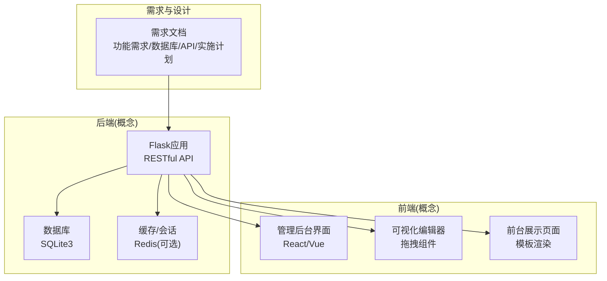
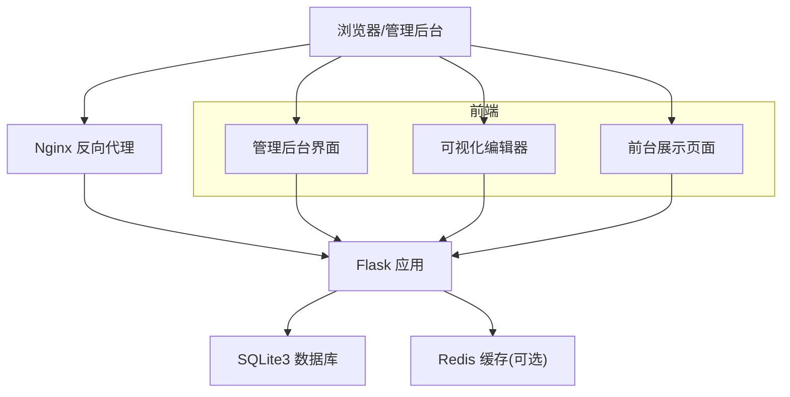
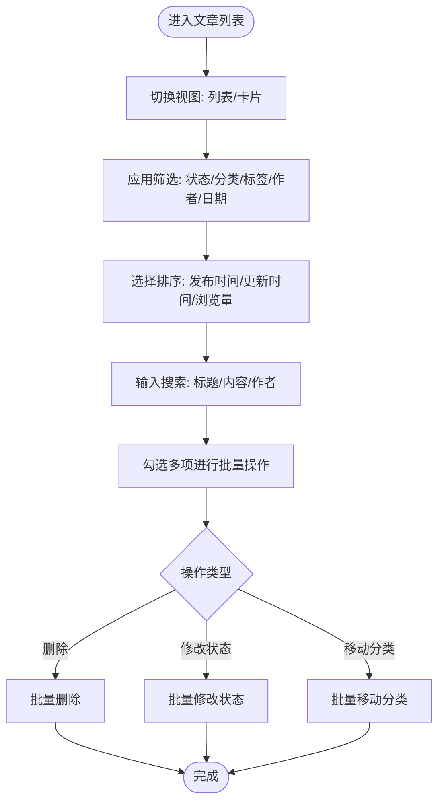
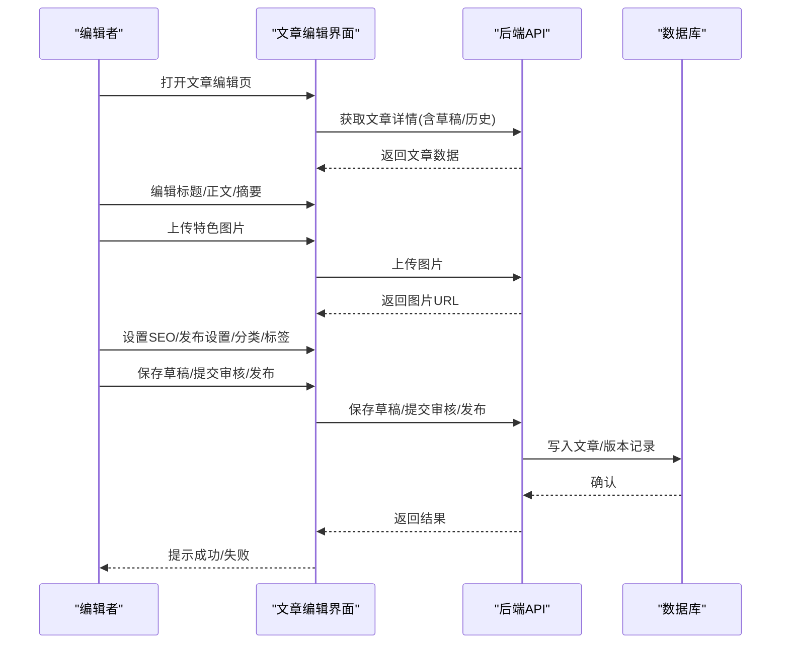
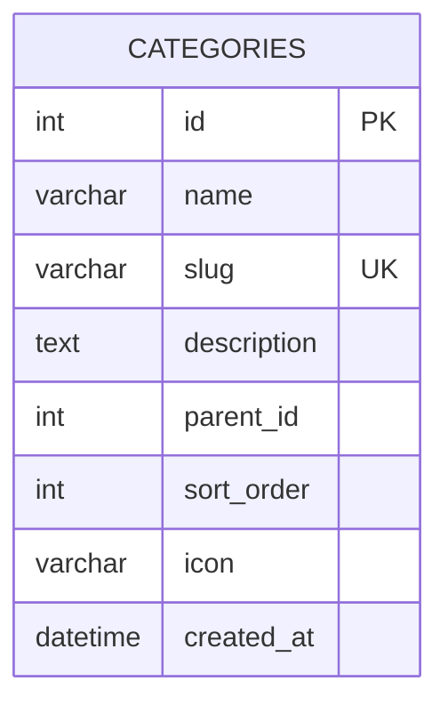
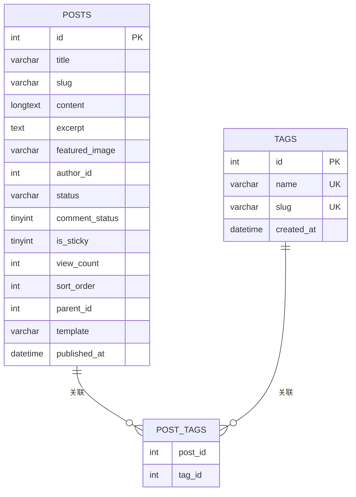
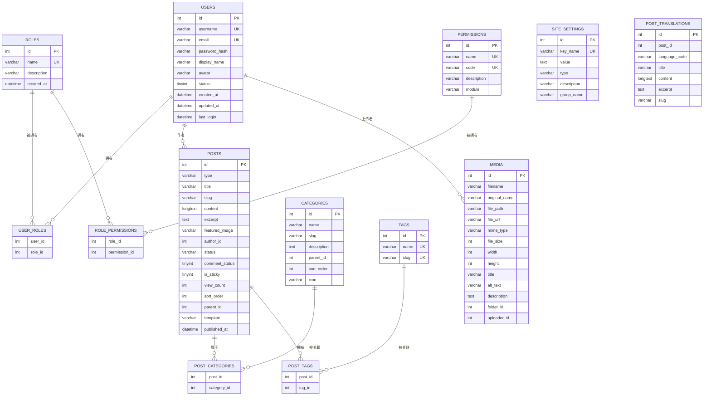
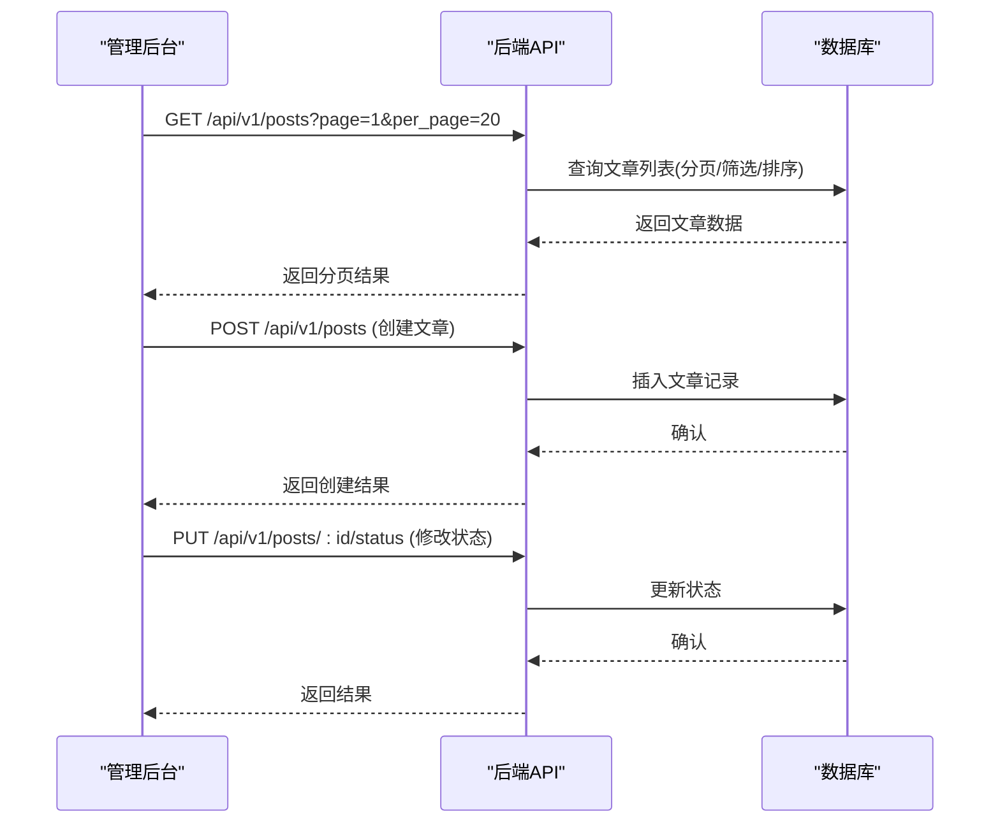
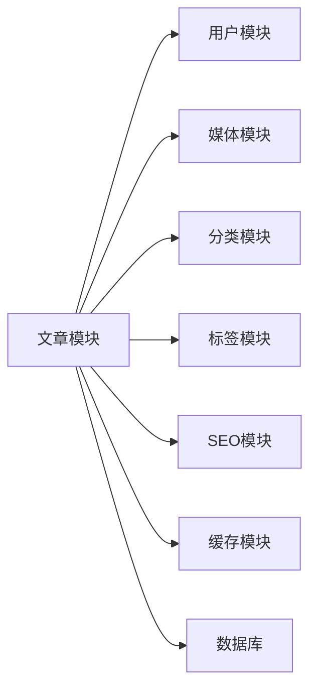

# 文章管理

<cite>
**本文引用的文件**
- [企业网站CMS系统详细需求文档.md](file://企业网站CMS系统详细需求文档.md)
</cite>

## 目录
1. [简介](#简介)
2. [项目结构](#项目结构)
3. [核心组件](#核心组件)
4. [架构总览](#架构总览)
5. [详细组件分析](#详细组件分析)
6. [依赖分析](#依赖分析)
7. [性能考量](#性能考量)
8. [故障排查指南](#故障排查指南)
9. [结论](#结论)
10. [附录](#附录)

## 简介
本文件围绕“文章管理”主题，基于仓库中的需求文档，系统化梳理文章列表、文章编辑器、分类管理、标签管理、数据模型与业务规则，并结合前后端分离架构给出可落地的操作界面说明与流程图示。目标是帮助非技术读者理解系统能力边界与使用方法，同时为开发者提供清晰的实现参考。

## 项目结构
- 本仓库以需求文档为核心，未包含具体后端/前端源代码文件。因此本文所有实现细节均来自需求文档的“功能需求”“数据库设计”“API接口设计”“实施计划”等章节。
- 文档将按照“功能—模型—接口—界面”的顺序组织，先给出高层能力说明，再逐步细化到数据模型与接口契约，最后落到界面交互与流程。

[本图为概念性结构示意，不对应具体源文件，故无“图示来源”]

## 核心组件
- 文章列表：支持列表/卡片视图切换、筛选（状态、分类、标签、作者、日期）、排序（发布时间、更新时间、浏览量）、搜索（标题、内容、作者）、批量操作（删除、修改状态、移动分类）。
- 文章编辑器：标题输入、富文本编辑器、特色图片上传、摘要生成、分类/标签选择、SEO设置（URL别名、Meta描述、关键词）、发布设置（草稿/待审核/已发布、定时发布、置顶、允许评论）、自定义字段扩展、版本历史/恢复。
- 分类管理：树形结构（无限层级）、排序、别名（slug）、描述、图标/图片。
- 标签管理：标签云展示、标签合并、使用统计。
- 数据模型与业务规则：基于posts、categories、tags、post_categories、post_tags、media、site_settings、post_translations等表及索引/触发器设计；API覆盖文章、分类、标签、媒体、设置等模块；实施计划给出MVP范围与交付节点。

**章节来源**
- file://企业网站CMS系统详细需求文档.md#L294-L330
- file://企业网站CMS系统详细需求文档.md#L714-L904
- file://企业网站CMS系统详细需求文档.md#L1023-L1076
- file://企业网站CMS系统详细需求文档.md#L1481-L1771

## 架构总览
- 前后端分离：前端使用React/Vue或纯HTML模板，后端提供RESTful API。
- 部署：Nginx反向代理，Flask应用（Gunicorn/Waitress），SQLite3数据库，Redis可选。
- 权限：RBAC模型，JWT认证，接口限流与安全头配置。

**图示来源**
- [企业网站CMS系统详细需求文档.md](file://企业网站CMS系统详细需求文档.md#L22-L57)
- [企业网站CMS系统详细需求文档.md](file://企业网站CMS系统详细需求文档.md#L1143-L1230)
- [企业网站CMS系统详细需求文档.md](file://企业网站CMS系统详细需求文档.md#L1232-L1302)

## 详细组件分析

### 文章列表功能
- 视图切换：列表视图/卡片视图，便于不同场景下的浏览与操作。
- 筛选条件：
  - 状态：草稿、待审核、已发布、私有等。
  - 分类：按树形分类筛选。
  - 标签：按标签筛选。
  - 作者：按作者筛选。
  - 日期：区间筛选。
- 排序选项：发布时间、更新时间、浏览量。
- 搜索：标题、内容、作者。
- 批量操作：删除、修改状态、移动分类。

**图示来源**
- [企业网站CMS系统详细需求文档.md](file://企业网站CMS系统详细需求文档.md#L296-L302)

**章节来源**
- file://企业网站CMS系统详细需求文档.md#L296-L302
- file://企业网站CMS系统详细需求文档.md#L1023-L1032

### 文章编辑器核心功能
- 标题输入：必填校验与长度限制。
- 富文本编辑器：Quill.js/TinyMCE，支持文字格式、段落样式、图片/视频、代码块、表格、超链接等。
- 特色图片上传：支持拖拽/粘贴上传，自动压缩与缩略图生成。
- 文章摘要：自动生成或手动编辑。
- 分类/标签选择：多选，支持搜索与新增。
- SEO设置：URL别名（slug）、Meta描述、关键词。
- 发布设置：草稿/待审核/已发布；定时发布；置顶；允许评论开关。
- 自定义字段：扩展字段，便于业务定制。
- 版本历史/恢复：记录版本，支持回滚。

**图示来源**
- [企业网站CMS系统详细需求文档.md](file://企业网站CMS系统详细需求文档.md#L304-L317)
- [企业网站CMS系统详细需求文档.md](file://企业网站CMS系统详细需求文档.md#L1023-L1032)

**章节来源**
- file://企业网站CMS系统详细需求文档.md#L304-L317
- file://企业网站CMS系统详细需求文档.md#L1023-L1032

### 分类管理
- 树形结构：支持无限层级，父子关系通过parent_id维护。
- 分类排序：sort_order字段控制顺序。
- 分类别名（slug）：唯一标识，用于URL友好化。
- 分类描述：简要说明。
- 分类图标/图片：增强识别度。

**图示来源**
- [企业网站CMS系统详细需求文档.md](file://企业网站CMS系统详细需求文档.md#L800-L810)

**章节来源**
- file://企业网站CMS系统详细需求文档.md#L319-L324
- file://企业网站CMS系统详细需求文档.md#L800-L810

### 标签管理
- 标签云展示：按使用频率展示标签。
- 标签合并：解决重复/近似标签。
- 标签使用统计：统计每个标签的文章数量，辅助内容治理。

**图示来源**
- [企业网站CMS系统详细需求文档.md](file://企业网站CMS系统详细需求文档.md#L821-L836)

**章节来源**
- file://企业网站CMS系统详细需求文档.md#L326-L329
- file://企业网站CMS系统详细需求文档.md#L821-L836

### 数据模型与业务规则
- 核心表：
  - posts：文章/页面主表，含类型、标题、slug、内容、摘要、特色图、作者、状态、评论开关、置顶、浏览量、排序、父级、模板、发布时间等。
  - categories：分类表，含名称、slug、描述、父级、排序、图标。
  - tags：标签表，含名称、slug。
  - post_categories/post_tags：文章与分类/标签的多对多关联。
  - media：媒体资源表，含文件名、路径、URL、MIME、尺寸、标题、描述、上传者等。
  - site_settings：站点配置表，含键名、值、类型、分组等。
  - post_translations：文章多语言翻译表。
- 全文搜索：使用FTS5虚拟表与触发器同步，支持标题/内容检索。
- 索引与约束：为type/status、slug、published_at、parent_id、mime_type、folder_id等建立索引，保证查询性能与数据一致性。

**图示来源**
- [企业网站CMS系统详细需求文档.md](file://企业网站CMS系统详细需求文档.md#L716-L904)

**章节来源**
- file://企业网站CMS系统详细需求文档.md#L716-L904
- file://企业网站CMS系统详细需求文档.md#L906-L938

### API接口与业务流程
- 文章管理接口：列表、详情、创建、更新、删除、批量删除、修改状态。
- 分类标签接口：树形分类列表、创建/更新/删除分类；标签列表、创建/更新/删除标签。
- 媒体库接口：列表、详情、上传、批量上传、更新信息、删除。
- 系统配置接口：获取/分组配置、更新配置、备份/恢复。
- 全文搜索：通过FTS5虚拟表与触发器实现，查询时JOIN主表返回结果。

**图示来源**
- [企业网站CMS系统详细需求文档.md](file://企业网站CMS系统详细需求文档.md#L1023-L1076)
- [企业网站CMS系统详细需求文档.md](file://企业网站CMS系统详细需求文档.md#L906-L938)

**章节来源**
- file://企业网站CMS系统详细需求文档.md#L1023-L1076
- file://企业网站CMS系统详细需求文档.md#L906-L938

### 操作界面说明
- 文章列表页：表格/卡片视图切换、筛选器、排序器、搜索框、分页控件、批量操作按钮、快速编辑入口。
- 文章编辑页：标题输入、富文本编辑器、特色图片上传、摘要生成、分类/标签选择、SEO设置表单、发布设置开关、自定义字段区域、版本历史面板、保存/发布按钮。
- 分类列表页：树形展示、拖拽排序、添加/编辑分类弹窗、批量删除。
- 标签管理页：标签云展示、合并对话框、统计图表、批量删除。
- 媒体库：网格视图、拖拽上传、文件夹组织、筛选/搜索、图片编辑（裁剪/旋转/缩放/滤镜）、信息编辑（标题/描述/ALT）。
- 系统配置：分组设置（网站基本设置、SEO配置、URL配置、邮件配置、安全设置、性能配置、备份管理）。

**章节来源**
- file://企业网站CMS系统详细需求文档.md#L1611-L1650
- file://企业网站CMS系统详细需求文档.md#L1656-L1694

## 依赖分析
- 外部依赖：Flask生态（SQLAlchemy、RESTful、CORS、Caching、Babel、JWT等），Pillow（图片处理），Redis（可选缓存/会话），Nginx（反向代理与静态资源），Waitress/NSSM（Windows部署）。
- 组件耦合：文章模块依赖用户模块（作者）、媒体模块（特色图）、分类/标签模块（多对多关联）、SEO模块（URL别名/Meta）。
- 循环依赖：需求文档未体现循环依赖，但实际实现中需注意API层与业务层解耦，避免模型间相互引用导致的循环导入。

[本图为概念性依赖示意，不对应具体源文件，故无“图示来源”]

**章节来源**
- file://企业网站CMS系统详细需求文档.md#L555-L622
- file://企业网站CMS系统详细需求文档.md#L1232-L1322

## 性能考量
- 数据库层面：为高频查询字段建立索引（type/status、slug、published_at、parent_id、mime_type、folder_id），使用FTS5虚拟表进行全文检索，避免N+1查询。
- 缓存策略：Redis缓存热点数据（分类树、热门文章、配置），页面缓存与数据缓存结合，登录用户不缓存。
- 静态资源：CDN加速、Gzip压缩、浏览器缓存策略。
- 文件上传：图片压缩与缩略图生成，限制文件大小与类型，避免慢查询与磁盘压力。
- 并发与限流：接口限流（Flask-Limiter），避免恶意刷量。

[本节为通用性能建议，不直接分析具体文件，故无“章节来源”]

## 故障排查指南
- 登录/权限问题：检查JWT Token是否正确携带与刷新，确认角色权限与数据级权限（仅能操作自己的数据）。
- 文件上传失败：检查ALLOWED_EXTENSIONS、MAX_CONTENT_LENGTH、上传路径权限、病毒扫描（可选）。
- 全文搜索无结果：确认FTS5触发器是否生效，重建虚拟表与触发器。
- API 404/403：核对路由前缀与权限装饰器，确保接口暴露与鉴权配置正确。
- 性能异常：检查索引缺失、慢查询日志、缓存命中率、Redis连接池配置。

**章节来源**
- file://企业网站CMS系统详细需求文档.md#L1078-L1140
- file://企业网站CMS系统详细需求文档.md#L906-L938

## 结论
本文基于需求文档对“文章管理”进行了全面梳理，覆盖了列表功能、编辑器能力、分类/标签管理、数据模型与API设计、界面交互与性能安全建议。由于当前仓库未包含具体源代码，实现细节以需求为准；在实际开发中，应遵循需求文档的接口规范与数据模型，结合前后端分离架构与部署方案，逐步完成MVP功能并持续迭代。

[本节为总结性内容，不直接分析具体文件，故无“章节来源”]

## 附录
- 项目时间线与MVP范围：8天开发周期，完成认证、文章管理、分类管理、媒体库、简化可视化编辑器、前台展示与基础SEO。
- 风险与应对：Windows环境兼容性、拖拽编辑器性能、数据库性能瓶颈等，均有对应缓解措施。
- 成本预算：第一年总成本约¥15,600，相较MySQL方案节省约¥6,000。

**章节来源**
- file://企业网站CMS系统详细需求文档.md#L1463-L1500
- file://企业网站CMS系统详细需求文档.md#L1865-L1957