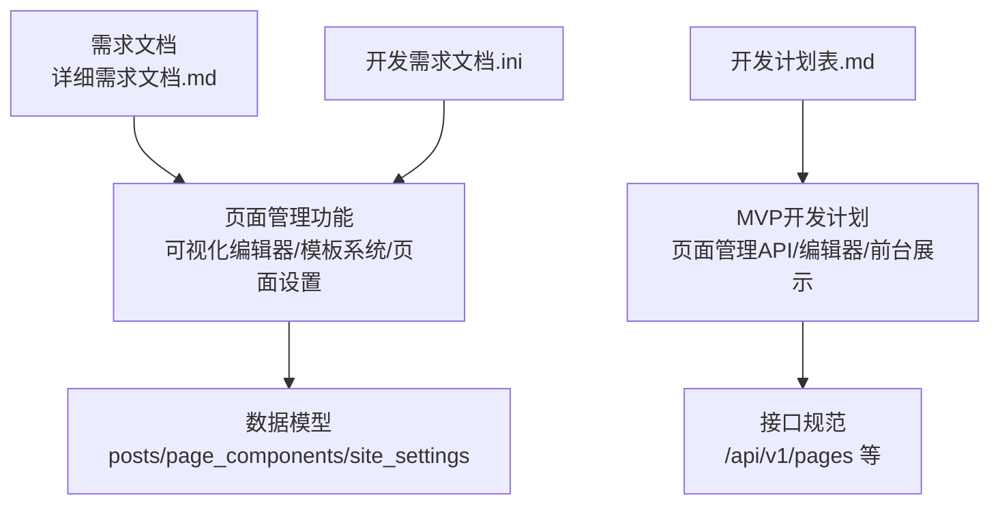
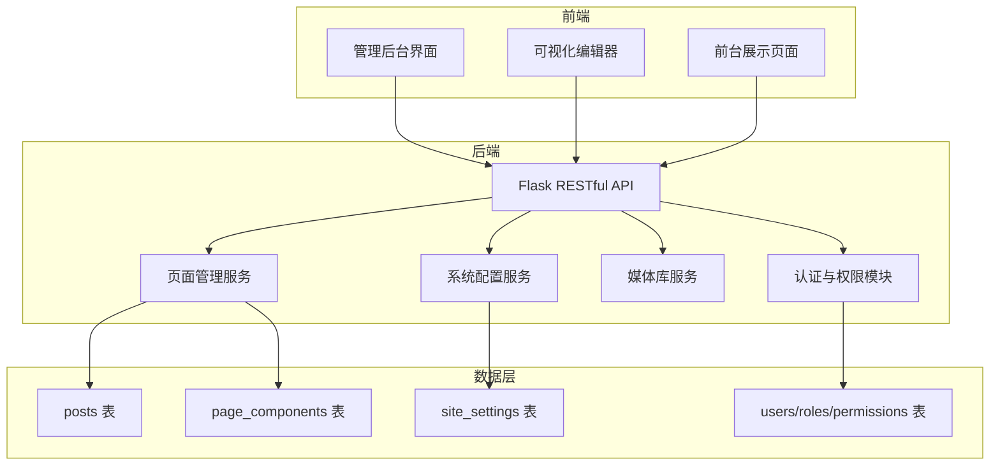
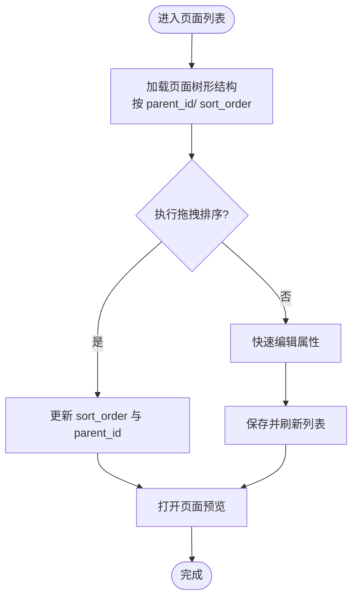
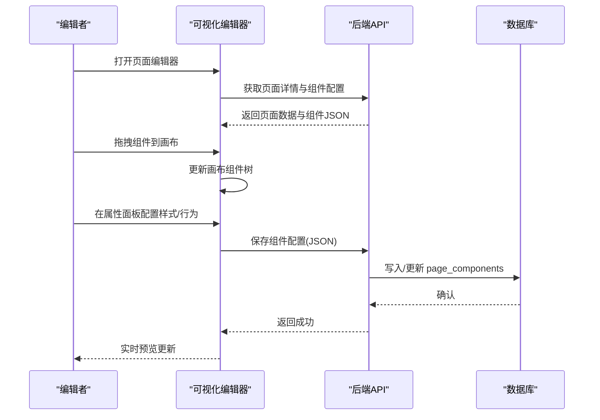
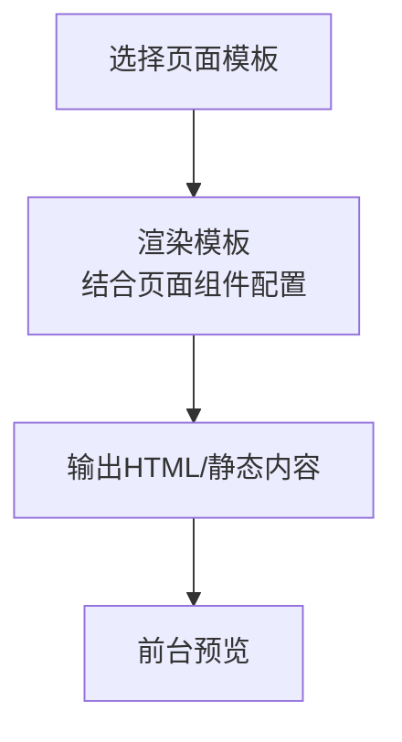
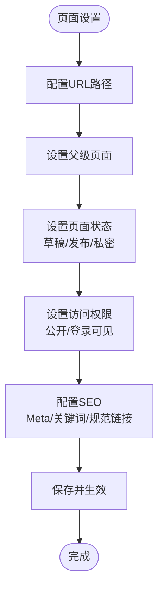
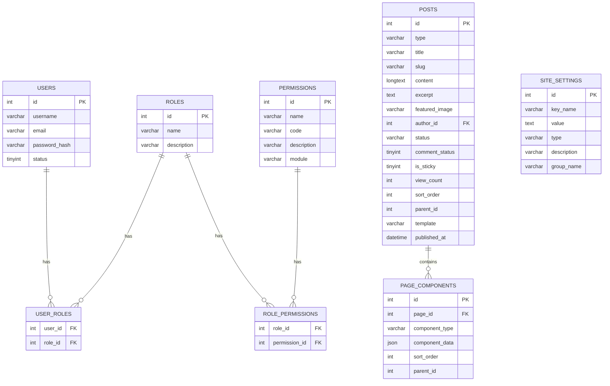
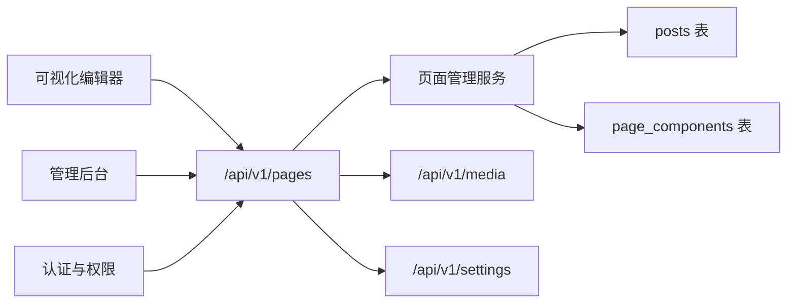

# 页面管理

<cite>
**本文引用的文件**
- [企业网站CMS系统详细需求文档.md](file://企业网站CMS系统详细需求文档.md)
- [企业网站CMS系统开发需求文档.ini](file://企业网站CMS系统开发需求文档.ini)
- [开发计划表_2月4日-2月12日.md](file://开发计划表_2月4日-2月12日.md)
</cite>

## 目录
1. [简介](#简介)
2. [项目结构](#项目结构)
3. [核心组件](#核心组件)
4. [架构总览](#架构总览)
5. [详细组件分析](#详细组件分析)
6. [依赖关系分析](#依赖关系分析)
7. [性能考量](#性能考量)
8. [故障排查指南](#故障排查指南)
9. [结论](#结论)
10. [附录](#附录)

## 简介
本文件面向“页面管理”子系统，围绕可视化编辑器、模板系统与页面树形结构管理进行系统化说明。依据项目需求文档与开发计划，页面管理涵盖：
- 页面列表：树形结构、拖拽排序、快速编辑、页面预览
- 可视化编辑器：组件拖拽系统、实时预览、响应式布局配置、组件通用配置
- 模板系统：首页模板、文章列表模板、文章详情模板、单页模板、自定义模板
- 页面设置：URL路径配置、父级页面关联、页面状态管理（草稿/发布/私密）、访问权限控制（公开/登录可见）、页面SEO设置
- 权限控制、数据模型设计与扩展性考虑
- 最佳实践与常见问题解决方案

## 项目结构
本仓库当前主要包含三类文档：
- 详细需求文档：定义了页面管理的功能边界、可视化编辑器能力、模板系统与页面设置等
- 开发需求文档.ini：概述了页面管理与可视化编辑模块的核心要点
- 开发计划表：明确了页面管理API、可视化编辑器与前台展示的开发节奏与MVP范围

**章节来源**
- file://企业网站CMS系统详细需求文档.md#L331-L354
- file://企业网站CMS系统开发需求文档.ini#L39-L43
- file://开发计划表_2月4日-2月12日.md#L34-L53

## 核心组件
- 页面列表与树形结构
  - 支持页面树形结构展示、拖拽排序、快速编辑、页面预览
- 可视化编辑器
  - 组件拖拽系统、实时预览、响应式布局配置、组件通用配置
- 模板系统
  - 首页模板、文章列表模板、文章详情模板、单页模板、自定义模板
- 页面设置
  - URL路径、父级页面、页面状态、访问权限、SEO设置
- 权限控制与数据模型
  - 基于角色的访问控制、页面状态与权限字段、页面组件配置存储

**章节来源**
- file://企业网站CMS系统详细需求文档.md#L331-L354
- file://企业网站CMS系统详细需求文档.md#L63-L232
- file://企业网站CMS系统详细需求文档.md#L863-L889

## 架构总览
页面管理在整体系统中的定位与交互如下：

**图示来源**
- [企业网站CMS系统详细需求文档.md](file://企业网站CMS系统详细需求文档.md#L22-L57)
- [开发计划表_2月4日-2月12日.md](file://开发计划表_2月4日-2月12日.md#L92-L105)

## 详细组件分析

### 页面列表与树形结构管理
- 功能要点
  - 页面树形结构：支持父子关系与层级展示
  - 拖拽排序：通过拖拽改变页面顺序与父子关系
  - 快速编辑：在列表中直接修改页面属性（如标题、状态）
  - 页面预览：可直接打开页面预览链接
- 数据模型支撑
  - posts 表包含 parent_id 字段，用于表示页面层级关系
  - posts.sort_order 用于页面排序
- 接口参考
  - 页面列表、详情、创建、更新、删除
  - 页面组件配置读取与更新

**章节来源**
- file://企业网站CMS系统详细需求文档.md#L331-L337
- file://企业网站CMS系统详细需求文档.md#L770-L797
- file://开发计划表_2月4日-2月12日.md#L221-L225

### 可视化编辑器
- 组件库与拖拽系统
  - 组件面板、画布区域、属性面板
  - 支持组件拖拽、复制、删除、排序
  - 实时预览与多设备预览
- 响应式布局与通用配置
  - 响应式断点设置、组件显示/隐藏控制
  - 通用样式配置（边距、背景、边框、阴影、动画）
  - 显示配置（显示/隐藏、条件显示）
  - 高级配置（自定义CSS类名、自定义HTML属性、锚点ID）
- 组件类型（MVP阶段）
  - 文本组件（标题、段落）
  - 图片组件（单图展示）
  - 容器组件（基础布局容器）
  - 按钮组件（CTA按钮）
  - 表单组件（联系表单）

**图示来源**
- [开发计划表_2月4日-2月12日.md](file://开发计划表_2月4日-2月12日.md#L372-L394)
- [企业网站CMS系统详细需求文档.md](file://企业网站CMS系统详细需求文档.md#L63-L232)

**章节来源**
- file://企业网站CMS系统详细需求文档.md#L63-L232
- file://开发计划表_2月4日-2月12日.md#L372-L394

### 模板系统
- 模板类型
  - 首页模板
  - 文章列表模板
  - 文章详情模板
  - 单页模板
  - 自定义模板
- 设计思路
  - 页面与模板解耦：页面通过 template 字段指定模板
  - 前台渲染：根据模板与页面组件配置生成最终页面
  - 可扩展：支持自定义模板文件与组件组合

**章节来源**
- file://企业网站CMS系统详细需求文档.md#L348-L354
- file://企业网站CMS系统详细需求文档.md#L770-L797

### 页面设置
- URL路径配置：支持 slug 与自定义路径
- 父级页面关联：通过 parent_id 建立层级关系
- 页面状态管理：草稿、发布、私密
- 访问权限控制：公开、登录可见
- SEO设置：Meta标题、描述、关键词、规范链接等

**章节来源**
- file://企业网站CMS系统详细需求文档.md#L341-L346
- file://企业网站CMS系统详细需求文档.md#L399-L406
- file://企业网站CMS系统详细需求文档.md#L770-L797

### 权限控制与数据模型
- 权限控制
  - 基于角色的访问控制（RBAC）
  - 模块级、操作级、数据级权限
  - 用户、角色、权限表及关联表
- 数据模型
  - posts 表：type、title、slug、content、excerpt、featured_image、author_id、status、comment_status、is_sticky、view_count、sort_order、parent_id、template、published_at
  - page_components 表：page_id、component_type、component_data(JSON)、sort_order、parent_id
  - site_settings 表：key_name、value、type、description、group_name

**图示来源**
- [企业网站CMS系统详细需求文档.md](file://企业网站CMS系统详细需求文档.md#L716-L889)

**章节来源**
- file://企业网站CMS系统详细需求文档.md#L237-L282
- file://企业网站CMS系统详细需求文档.md#L716-L889

## 依赖关系分析
- 组件耦合
  - 页面管理服务依赖认证与权限模块、媒体库服务、系统配置服务
  - 可视化编辑器依赖页面管理API与媒体库API
  - 前台展示依赖页面组件配置与模板系统
- 外部依赖
  - 前端拖拽库（dnd-kit/SortableJS）、富文本编辑器（Quill/TinyMCE）
  - 后端Flask生态（Flask-RESTful、Flask-CORS、Flask-JWT-Extended等）
- 接口契约
  - /api/v1/pages 列表、详情、创建、更新、删除
  - /api/v1/pages/:id/components 读取与更新组件配置
  - /api/v1/media 上传、列表、详情、更新、删除

**图示来源**
- [企业网站CMS系统详细需求文档.md](file://企业网站CMS系统详细需求文档.md#L1034-L1076)
- [开发计划表_2月4日-2月12日.md](file://开发计划表_2月4日-2月12日.md#L221-L225)

**章节来源**
- file://企业网站CMS系统详细需求文档.md#L1034-L1076
- file://开发计划表_2月4日-2月12日.md#L221-L225

## 性能考量
- 页面加载与渲染
  - 使用 page_components 的 JSON 结构减少复杂 JOIN 查询
  - 前台按需渲染，避免一次性加载过多组件
- 缓存策略
  - 页面缓存（Redis）与静态资源缓存（CDN）
  - 配置项集中存储于 site_settings，便于缓存命中
- 响应式与预览
  - 编辑器实时预览尽量使用轻量级组件，避免阻塞主线程
- 数据库优化
  - posts 表建立索引（type, status, slug, published_at）
  - page_components 表按 page_id 索引，提高组件查询性能

[本节为通用性能建议，不直接分析具体文件]

## 故障排查指南
- 页面列表异常
  - 检查 parent_id 与 sort_order 是否正确更新
  - 确认 /api/v1/pages 接口返回的数据结构
- 可视化编辑器无法保存
  - 检查 /api/v1/pages/:id/components 接口是否返回成功
  - 确认 component_data JSON 结构合法
- 预览空白或样式丢失
  - 检查模板文件是否存在且可被前台访问
  - 确认静态资源路径与 Nginx 配置
- 权限相关问题
  - 检查用户角色与权限映射
  - 确认 JWT Token 是否有效与过期

**章节来源**
- file://企业网站CMS系统详细需求文档.md#L1078-L1141
- file://开发计划表_2月4日-2月12日.md#L440-L507

## 结论
页面管理模块以“可视化编辑器 + 模板系统 + 页面树形结构”为核心，配合完善的权限控制与数据模型，形成可扩展、易维护的内容管理体系。MVP阶段聚焦基础拖拽编辑与模板渲染，后续可逐步引入高级组件、多语言与高级SEO功能，持续提升用户体验与运营效率。

[本节为总结性内容，不直接分析具体文件]

## 附录

### 最佳实践
- 编辑器开发
  - 使用成熟的拖拽库，简化嵌套与排序逻辑
  - 组件配置统一以 JSON 存储，便于序列化与版本管理
- 模板设计
  - 模板与组件解耦，支持自定义模板与组件组合
  - 前台渲染时注意安全输出与SEO标签注入
- 权限与安全
  - 严格区分模块级、操作级、数据级权限
  - 对敏感字段（如密码）进行加密存储，传输使用 HTTPS
- 数据模型
  - 明确字段语义与约束，合理建立索引
  - 通过 site_settings 集中管理可配置项，便于缓存与运维

[本节为通用最佳实践，不直接分析具体文件]