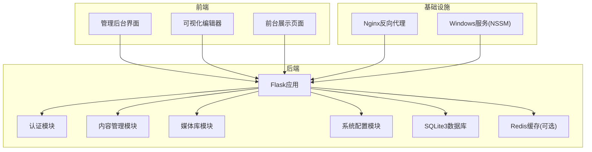
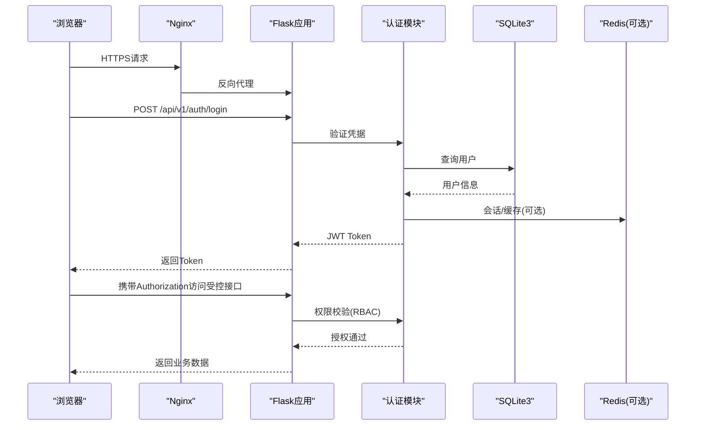
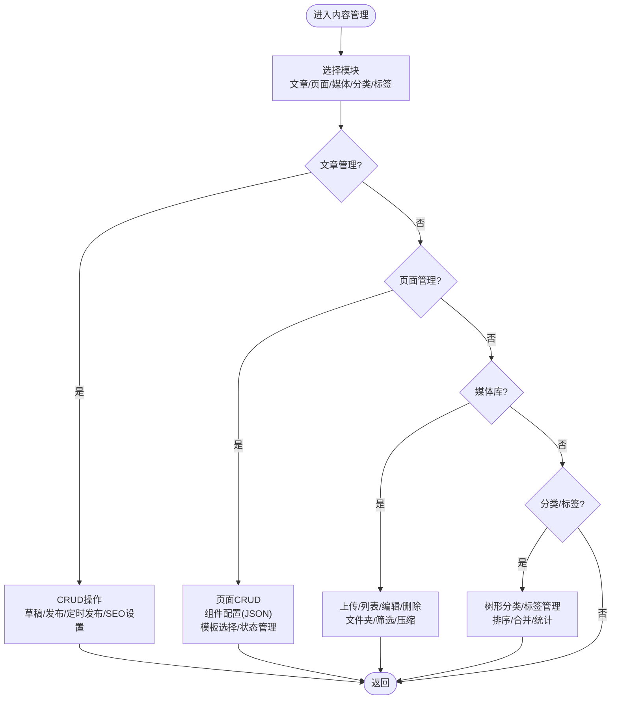
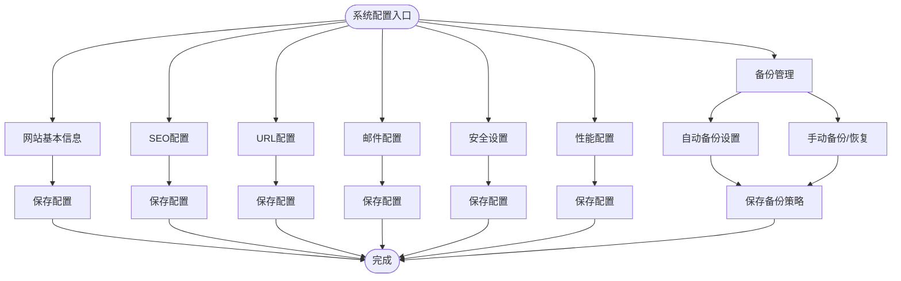
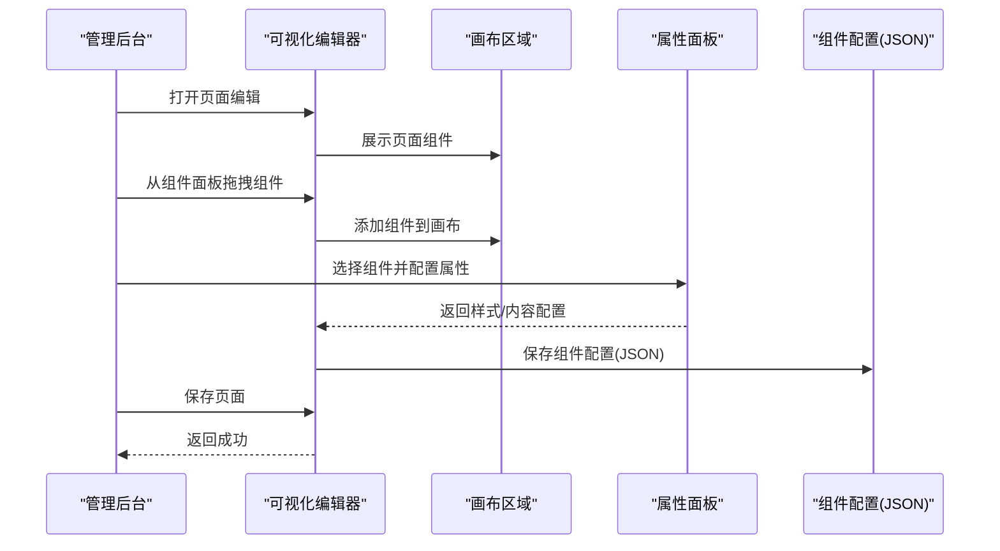
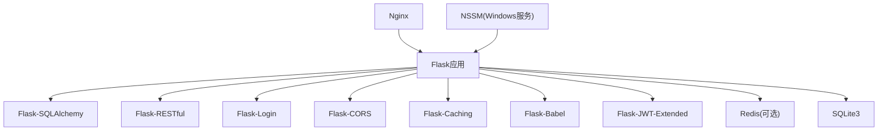

# 后台管理系统

<cite>
**本文档引用的文件**
- [企业网站CMS系统开发需求文档.ini](file://企业网站CMS系统开发需求文档.ini)
- [企业网站CMS系统详细需求文档.md](file://企业网站CMS系统详细需求文档.md)
- [开发计划表_2月4日-2月12日.md](file://开发计划表_2月4日-2月12日.md)
</cite>

## 目录
1. [简介](#简介)
2. [项目结构](#项目结构)
3. [核心组件](#核心组件)
4. [架构总览](#架构总览)
5. [详细组件分析](#详细组件分析)
6. [依赖关系分析](#依赖关系分析)
7. [性能考量](#性能考量)
8. [故障排除指南](#故障排除指南)
9. [结论](#结论)
10. [附录](#附录)

## 简介
本项目为企业官网内容管理系统（CMS），旨在提供一套功能完善、易于维护的后台管理与可视化编辑能力，支持多终端适配与SEO优化。系统采用前后端分离架构，后端基于Python Flask + SQLite3，前端可选React/Vue或纯HTML模板渲染，部署于Windows Server + Nginx环境。项目周期为8天，采用MVP策略，聚焦用户权限管理、内容管理与系统配置等核心功能。

## 项目结构
- 后端（Flask）：蓝图化模块划分，包含认证、内容管理、媒体库、系统配置等子模块；数据库采用SQLite3，支持Redis可选缓存。
- 前端（可选React/Vue或纯HTML）：管理后台界面、可视化编辑器、前台展示页面。
- 部署：Nginx反向代理、Waitress/Gunicorn WSGI服务器、Windows服务（NSSM）托管。



**图表来源**
- [企业网站CMS系统详细需求文档.md](file://企业网站CMS系统详细需求文档.md#L22-L57)
- [开发计划表_2月4日-2月12日.md](file://开发计划表_2月4日-2月12日.md#L92-L105)

**章节来源**
- [企业网站CMS系统详细需求文档.md](file://企业网站CMS系统详细需求文档.md#L22-L57)
- [开发计划表_2月4日-2月12日.md](file://开发计划表_2月4日-2月12日.md#L92-L105)

## 核心组件
- 用户权限管理：基于RBAC模型的角色与权限控制，支持JWT认证、会话管理与登录失败锁定。
- 内容管理：文章与页面的CRUD、分类/标签管理、页面组件配置（JSON存储）、富文本编辑与SEO设置。
- 系统配置：网站基本信息、SEO配置、URL规则、邮件配置、安全设置、性能配置与备份管理。
- 可视化编辑器：简化版拖拽编辑器（MVP阶段仅5个核心组件），支持组件添加/删除与样式配置。
- 前台展示：根据页面组件配置渲染的响应式页面，支持SEO友好与移动端适配。

**章节来源**
- [企业网站CMS系统详细需求文档.md](file://企业网站CMS系统详细需求文档.md#L237-L282)
- [企业网站CMS系统详细需求文档.md](file://企业网站CMS系统详细需求文档.md#L294-L387)
- [企业网站CMS系统详细需求文档.md](file://企业网站CMS系统详细需求文档.md#L388-L446)
- [开发计划表_2月4日-2月12日.md](file://开发计划表_2月4日-2月12日.md#L372-L411)

## 架构总览
系统采用前后端分离架构，后端提供RESTful API，前端通过Axios调用接口；Nginx统一对外提供HTTPS服务，反向代理至Flask应用。认证采用JWT，权限控制基于RBAC模型，数据库使用SQLite3，高并发场景可引入Redis缓存。



**图表来源**
- [企业网站CMS系统详细需求文档.md](file://企业网站CMS系统详细需求文档.md#L1080-L1140)
- [企业网站CMS系统详细需求文档.md](file://企业网站CMS系统详细需求文档.md#L1232-L1302)

**章节来源**
- [企业网站CMS系统详细需求文档.md](file://企业网站CMS系统详细需求文档.md#L1080-L1140)
- [企业网站CMS系统详细需求文档.md](file://企业网站CMS系统详细需求文档.md#L1232-L1302)

## 详细组件分析

### 用户权限管理（RBAC）
- 角色体系：超级管理员、管理员、编辑、作者、访客，覆盖模块级、操作级与数据级权限。
- 技术实现：Flask-Security/Flask-Principal风格的RBAC模型，装饰器式权限验证，数据库表结构包含用户、角色、权限及关联表。
- 认证与会话：JWT Token（Access/Refresh），bcrypt密码加密，登录失败锁定，会话存储可选Redis。
- 审计与安全：登录日志、操作审计、XSS/CSRF/SQL注入防护、HTTPS强制跳转。

```mermaid
classDiagram
class 用户 {
+id
+用户名
+邮箱
+密码哈希
+状态
+创建时间
+最后登录
}
class 角色 {
+id
+名称
+描述
+创建时间
}
class 权限 {
+id
+名称
+编码
+描述
+模块
}
class 用户角色 {
+用户id
+角色id
}
class 角色权限 {
+角色id
+权限id
}
用户 "多对多" 角色 : "用户角色"
角色 "多对多" 权限 : "角色权限"
```

**图表来源**
- [企业网站CMS系统详细需求文档.md](file://企业网站CMS系统详细需求文档.md#L716-L768)

**章节来源**
- [企业网站CMS系统详细需求文档.md](file://企业网站CMS系统详细需求文档.md#L237-L282)
- [企业网站CMS系统详细需求文档.md](file://企业网站CMS系统详细需求文档.md#L1080-L1140)

### 内容管理
- 文章管理：列表/详情/创建/更新/删除，支持草稿、待审核、已发布状态，定时发布、置顶、允许评论、SEO设置、版本历史。
- 页面管理：树形页面结构、拖拽排序、页面模板选择、页面设置（URL、父级、状态、访问权限）、SEO设置。
- 分类/标签：树形分类、分类排序、别名、描述、图标；标签云、合并与使用统计。
- 媒体库：支持图片/视频/文档上传，拖拽/批量上传，粘贴上传，文件大小限制，图片自动压缩，文件夹组织，信息编辑，存储管理（本地/云存储）。
- 页面组件：组件类型与配置以JSON存储，支持容器、文本、图片、按钮、表单等核心组件。



**图表来源**
- [企业网站CMS系统详细需求文档.md](file://企业网站CMS系统详细需求文档.md#L296-L387)

**章节来源**
- [企业网站CMS系统详细需求文档.md](file://企业网站CMS系统详细需求文档.md#L294-L387)
- [开发计划表_2月4日-2月12日.md](file://开发计划表_2月4日-2月12日.md#L372-L411)

### 系统配置
- 网站设置：网站名称、Logo/Favicon、描述、联系方式、社交媒体链接、版权信息、ICP备案号。
- SEO配置：默认Meta模板、关键词、Google Analytics/Baidu统计代码、自定义头部/底部代码。
- URL配置：URL重写规则、固定链接格式（/post/{id}、/{year}/{month}/{slug}等）、分页URL格式。
- 邮件配置：SMTP服务器、发件人邮箱、邮件模板管理、测试发送。
- 安全设置：HTTPS强制跳转、CORS配置、API访问频率限制、IP黑白名单、文件上传安全规则。
- 性能配置：缓存开关/过期时间、静态资源CDN、图片压缩质量、懒加载开关。
- 备份管理：自动备份（频率/时间/保留数）、手动备份/下载/恢复、备份到云存储。



**图表来源**
- [企业网站CMS系统详细需求文档.md](file://企业网站CMS系统详细需求文档.md#L388-L446)

**章节来源**
- [企业网站CMS系统详细需求文档.md](file://企业网站CMS系统详细需求文档.md#L388-L446)

### 可视化编辑器（MVP简化版）
- 组件库（MVP阶段5个核心组件）：文本（标题/段落）、图片（单图展示）、容器（基础布局）、按钮（CTA）、表单（联系表单）。
- 拖拽系统：使用成熟拖拽库，支持组件面板、画布区域、属性面板，组件添加/删除、样式配置（边距/颜色）、保存为JSON。
- 技术简化：不实现复杂嵌套与响应式，仅做基础拖拽与样式配置。



**图表来源**
- [开发计划表_2月4日-2月12日.md](file://开发计划表_2月4日-2月12日.md#L372-L394)

**章节来源**
- [开发计划表_2月4日-2月12日.md](file://开发计划表_2月4日-2月12日.md#L372-L411)

### 前台展示页面
- 模板：首页模板、文章列表模板、文章详情模板、单页模板。
- 渲染：根据页面组件配置（JSON）渲染，支持响应式设计与SEO友好（Meta标签、面包屑导航）。
- 优化：移动端适配、图片懒加载、CDN加速（可选）。

**章节来源**
- [企业网站CMS系统详细需求文档.md](file://企业网站CMS系统详细需求文档.md#L348-L354)
- [开发计划表_2月4日-2月12日.md](file://开发计划表_2月4日-2月12日.md#L395-L408)

## 依赖关系分析
- 技术栈：后端Python Flask + SQLite3 + Redis（可选），前端React/Vue或纯HTML模板，Nginx + Windows服务（NSSM）。
- 数据库：SQLite3单文件数据库，零配置、ACID事务、简化部署与备份；高并发场景可引入Redis。
- 安全：JWT认证、bcrypt密码加密、CSRF/XSS防护、SQL注入防护、HTTPS强制跳转、API限流。
- 部署：Nginx反向代理、静态资源服务、Gzip压缩、负载均衡（可选）；Windows服务托管Flask应用。



**图表来源**
- [企业网站CMS系统详细需求文档.md](file://企业网站CMS系统详细需求文档.md#L555-L594)
- [企业网站CMS系统详细需求文档.md](file://企业网站CMS系统详细需求文档.md#L1304-L1322)

**章节来源**
- [企业网站CMS系统详细需求文档.md](file://企业网站CMS系统详细需求文档.md#L555-L594)
- [企业网站CMS系统详细需求文档.md](file://企业网站CMS系统详细需求文档.md#L1304-L1322)

## 性能考量
- 页面加载：首页<2秒，内页<3秒，API响应<500ms，数据库查询<100ms。
- 并发与资源：支持1000+并发用户，内存<2GB，CPU<70%，磁盘IO<80%。
- 缓存策略：页面缓存（Redis）、数据缓存、静态资源缓存（浏览器/CDN）。
- 资源优化：图片懒加载、响应式图片、WebP格式、CSS/JS压缩合并、关键CSS内联。
- 数据库优化：索引优化、避免N+1查询、连接池配置、慢查询日志。
- CDN配置：静态资源CDN加速、CDN域名配置、缓存刷新。

**章节来源**
- [企业网站CMS系统详细需求文档.md](file://企业网站CMS系统详细需求文档.md#L512-L548)
- [企业网站CMS系统详细需求文档.md](file://企业网站CMS系统详细需求文档.md#L1360-L1380)

## 故障排除指南
- 认证与权限
  - 登录失败锁定：检查登录失败次数阈值与锁定时间配置。
  - Token刷新：确认Access/Refresh Token有效期与刷新流程。
  - 权限不足：核对用户角色与权限分配，确认RBAC装饰器是否正确应用。
- 数据库与缓存
  - SQLite写入性能：启用WAL模式，优化写入策略；避免高并发写入场景。
  - Redis连接：检查Redis连接URL与超时配置，确认缓存键命名规范。
- 安全与审计
  - XSS/CSRF防护：确认CSRF Token与SameSite Cookie配置。
  - SQL注入防护：使用ORM参数化查询，避免动态SQL。
  - 审计日志：检查登录日志、操作审计、错误日志与安全事件日志。
- 部署与兼容
  - Windows环境：使用Waitress替代Gunicorn，NSSM注册服务。
  - Nginx配置：确认HTTPS、静态资源、代理与Gzip压缩配置。
  - 浏览器兼容：验证Chrome/Firefox/Safari/Edge与移动端响应式适配。

**章节来源**
- [企业网站CMS系统详细需求文档.md](file://企业网站CMS系统详细需求文档.md#L1078-L1140)
- [开发计划表_2月4日-2月12日.md](file://开发计划表_2月4日-2月12日.md#L439-L507)

## 结论
本项目在8天MVP周期内，聚焦用户权限管理、内容管理与系统配置三大核心模块，采用Flask + SQLite3 + Nginx + Windows Server的轻量级架构，结合JWT认证与RBAC权限模型，提供了可运行的后台管理系统与简化版可视化编辑器。通过严格的开发计划、风险控制与质量保障，确保在紧凑时间内高质量交付，并为后续V2版本的功能增强与性能优化奠定基础。

## 附录
- 交付清单：源代码、API文档、数据库设计、部署运维文档、用户操作手册、培训记录。
- 后续优化：高级组件、多语言支持、复杂权限控制、数据统计图表、高级SEO功能、Redis缓存集成、CDN配置、文件上传安全加固、API限流优化。

**章节来源**
- [开发计划表_2月4日-2月12日.md](file://开发计划表_2月4日-2月12日.md#L665-L701)
- [企业网站CMS系统详细需求文档.md](file://企业网站CMS系统详细需求文档.md#L731-L752)