# 后台管理系统

<cite>
**本文档引用的文件**
- [company_cms_project/backend/app/__init__.py](file://company_cms_project/backend/app/__init__.py)
- [company_cms_project/backend/config.py](file://company_cms_project/backend/config.py)
- [company_cms_project/backend/run.py](file://company_cms_project/backend/run.py)
- [company_cms_project/backend/app/api/posts.py](file://company_cms_project/backend/app/api/posts.py)
- [company_cms_project/backend/app/api/categories.py](file://company_cms_project/backend/app/api/categories.py)
- [company_cms_project/backend/app/api/media.py](file://company_cms_project/backend/app/api/media.py)
- [company_cms_project/backend/app/api/settings.py](file://company_cms_project/backend/app/api/settings.py)
- [company_cms_project/backend/app/api/users.py](file://company_cms_project/backend/app/api/users.py)
- [company_cms_project/backend/app/models/post.py](file://company_cms_project/backend/app/models/post.py)
- [company_cms_project/backend/app/models/user.py](file://company_cms_project/backend/app/models/user.py)
- [company_cms_project/backend/app/auth/routes.py](file://company_cms_project/backend/app/auth/routes.py)
- [company_cms_project/frontend/src/pages/UserManager.tsx](file://company_cms_project/frontend/src/pages/UserManager.tsx)
- [company_cms_project/frontend/src/pages/MediaManager.tsx](file://company_cms_project/frontend/src/pages/MediaManager.tsx)
- [company_cms_project/frontend/src/pages/ThemeSettings.tsx](file://company_cms_project/frontend/src/pages/ThemeSettings.tsx)
</cite>

## 更新摘要
**所做更改**
- 新增完整的用户权限管理系统，包括用户CRUD操作和密码重置功能
- 增强内容管理系统的组件配置功能，支持页面组件的JSON存储
- 更新媒体库管理的安全机制，完善文件上传和访问控制
- 完善系统配置的动态管理能力，支持主题配置和页面组件配置
- 更新前端管理界面，新增用户管理和媒体库管理功能

## 目录
1. [简介](#简介)
2. [项目结构](#项目结构)
3. [核心组件](#核心组件)
4. [架构总览](#架构总览)
5. [详细组件分析](#详细组件分析)
6. [API接口文档](#api接口文档)
7. [数据模型设计](#数据模型设计)
8. [权限控制机制](#权限控制机制)
9. [配置管理](#配置管理)
10. [部署与运行](#部署与运行)
11. [性能考量](#性能考量)
12. [故障排除指南](#故障排除指南)
13. [结论](#结论)
14. [附录](#附录)

## 简介
本项目为企业官网内容管理系统（CMS），采用全新的Flask后端架构，提供完整的后台管理功能。系统基于Python Flask框架，使用SQLite3数据库，支持JWT认证和RBAC权限控制。前端采用React技术栈，提供现代化的管理界面和可视化编辑器。系统支持多终端适配、SEO优化和响应式设计。

**更新** 新增用户权限管理系统，增强内容管理的组件配置功能，完善媒体库管理的安全机制

## 项目结构
项目采用模块化的Flask架构设计，主要分为以下层次：

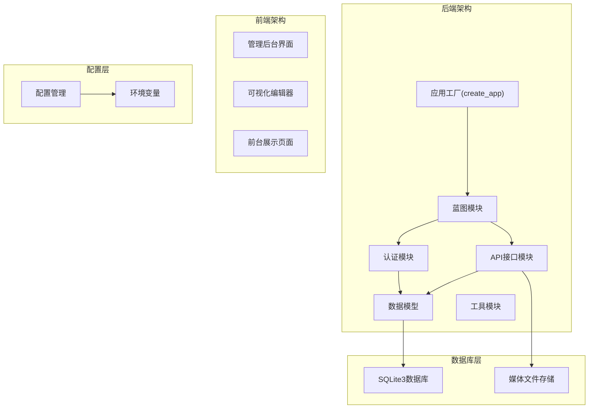

**图表来源**
- [company_cms_project/backend/app/__init__.py:15-60](file://company_cms_project/backend/app/__init__.py#L15-L60)
- [company_cms_project/backend/config.py:1-61](file://company_cms_project/backend/config.py#L1-L61)

**章节来源**
- [company_cms_project/backend/app/__init__.py:15-60](file://company_cms_project/backend/app/__init__.py#L15-L60)
- [company_cms_project/backend/config.py:1-61](file://company_cms_project/backend/config.py#L1-L61)

## 核心组件
系统采用模块化设计，包含以下核心功能模块：

### 用户权限管理
- 基于JWT的认证系统，支持访问令牌和刷新令牌
- RBAC权限控制模型，支持角色分级和权限管理
- 用户状态管理和登录审计功能
- **新增** 完整的用户CRUD操作和密码重置功能

### 内容管理系统
- 文章和页面的完整CRUD操作
- 分类和标签的层级管理
- **增强** 页面组件配置系统，支持JSON存储
- SEO优化和元数据管理

### 媒体库管理
- 支持多种文件类型的上传和管理
- 图片自动缩略图生成
- 文件分类和搜索功能
- **更新** 增强安全机制，防止目录遍历攻击
- 存储空间管理和清理

### 系统配置管理
- 动态配置管理系统，支持JSON格式存储
- 页面配置管理，支持首页和单页配置
- **新增** 主题配置和页面组件配置
- 站点设置和主题配置
- 配置分组和分类管理

**章节来源**
- [company_cms_project/backend/app/auth/routes.py:1-225](file://company_cms_project/backend/app/auth/routes.py#L1-L225)
- [company_cms_project/backend/app/api/posts.py:1-454](file://company_cms_project/backend/app/api/posts.py#L1-L454)
- [company_cms_project/backend/app/api/media.py:1-247](file://company_cms_project/backend/app/api/media.py#L1-L247)
- [company_cms_project/backend/app/api/settings.py:1-360](file://company_cms_project/backend/app/api/settings.py#L1-L360)
- [company_cms_project/backend/app/api/users.py:1-326](file://company_cms_project/backend/app/api/users.py#L1-L326)

## 架构总览
系统采用前后端分离的微服务架构，后端提供RESTful API，前端通过AJAX调用接口。

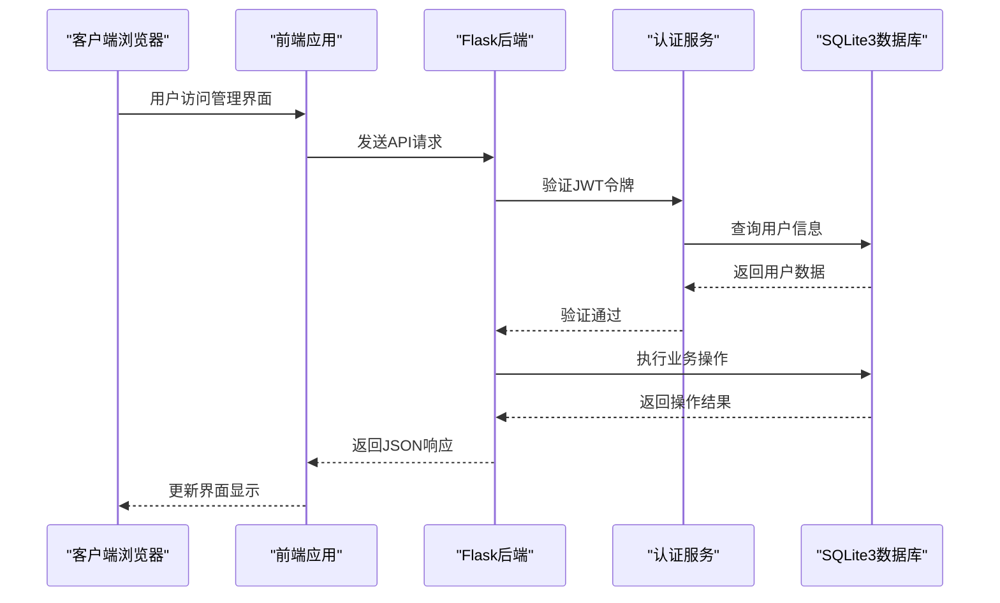

**图表来源**
- [company_cms_project/backend/app/__init__.py:15-60](file://company_cms_project/backend/app/__init__.py#L15-L60)
- [company_cms_project/backend/app/auth/routes.py:105-159](file://company_cms_project/backend/app/auth/routes.py#L105-L159)

**章节来源**
- [company_cms_project/backend/app/__init__.py:15-60](file://company_cms_project/backend/app/__init__.py#L15-L60)
- [company_cms_project/backend/app/auth/routes.py:105-159](file://company_cms_project/backend/app/auth/routes.py#L105-L159)

## 详细组件分析

### 用户认证系统
系统采用JWT（JSON Web Token）进行用户认证，支持标准的OAuth 2.0流程。

#### 认证流程
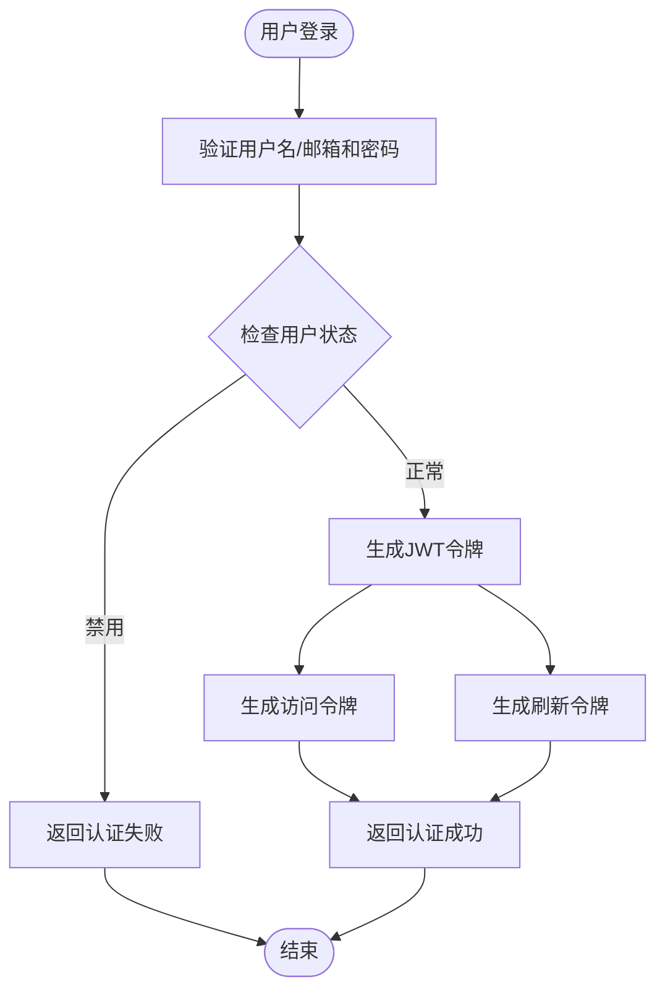

**图表来源**
- [company_cms_project/backend/app/auth/routes.py:105-159](file://company_cms_project/backend/app/auth/routes.py#L105-L159)

#### 密码安全
- 使用Werkzeug的generate_password_hash进行密码哈希
- 支持密码强度验证（长度、字母、数字要求）
- 密码加密存储，不保存明文密码

**章节来源**
- [company_cms_project/backend/app/auth/routes.py:1-225](file://company_cms_project/backend/app/auth/routes.py#L1-L225)
- [company_cms_project/backend/app/models/user.py:1-47](file://company_cms_project/backend/app/models/user.py#L1-L47)

### 用户权限管理系统
**新增** 系统提供完整的用户管理功能，支持用户CRUD操作和密码重置。

#### 用户管理流程
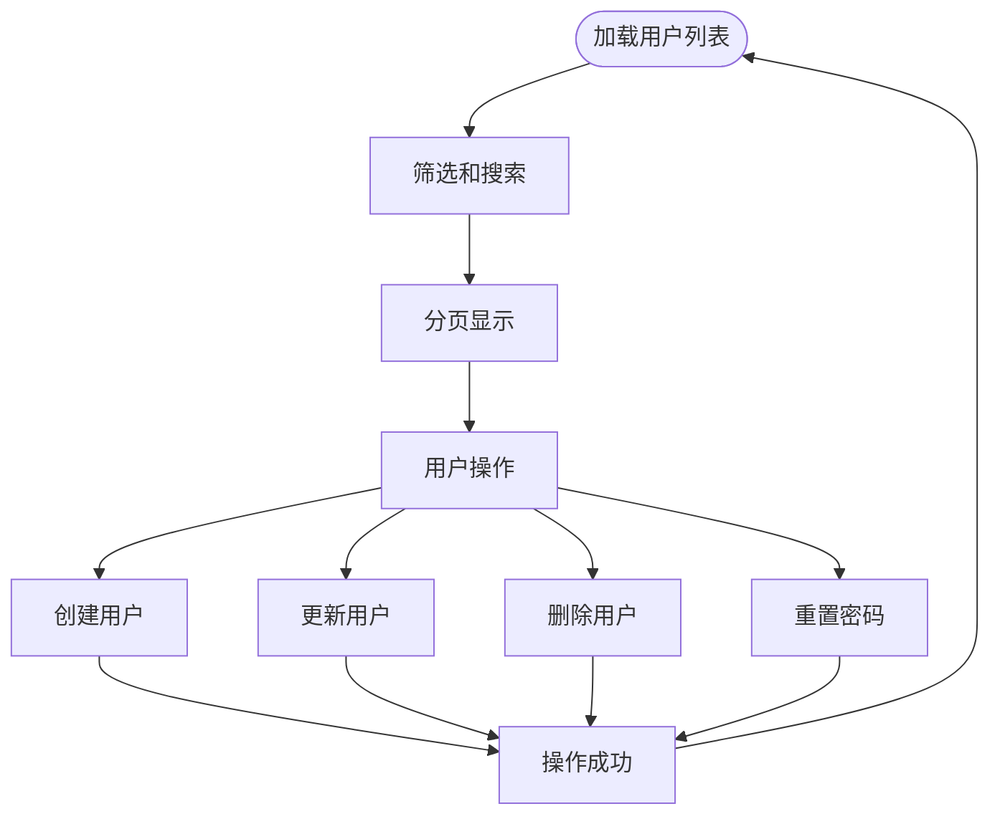

**图表来源**
- [company_cms_project/backend/app/api/users.py:24-326](file://company_cms_project/backend/app/api/users.py#L24-L326)

#### 权限控制
- 支持用户状态管理（启用/禁用）
- 防止删除当前登录用户
- 密码强度验证和邮箱唯一性检查

**章节来源**
- [company_cms_project/backend/app/api/users.py:1-326](file://company_cms_project/backend/app/api/users.py#L1-L326)
- [company_cms_project/frontend/src/pages/UserManager.tsx:1-396](file://company_cms_project/frontend/src/pages/UserManager.tsx#L1-L396)

### 内容管理系统
系统提供完整的内容管理功能，支持文章和页面的创建、编辑、发布和管理。

#### 文章管理流程
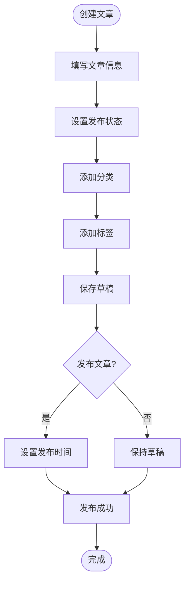

**图表来源**
- [company_cms_project/backend/app/api/posts.py:223-326](file://company_cms_project/backend/app/api/posts.py#L223-L326)

#### 权限控制
- 作者只能编辑自己的文章
- 管理员拥有所有权限
- 支持文章状态管理（草稿、已发布、私有）
- 实现了完整的CRUD操作权限控制

**章节来源**
- [company_cms_project/backend/app/api/posts.py:1-454](file://company_cms_project/backend/app/api/posts.py#L1-L454)
- [company_cms_project/backend/app/models/post.py:1-280](file://company_cms_project/backend/app/models/post.py#L1-L280)

### 媒体库管理系统
提供完整的媒体文件管理功能，支持多种文件类型的上传和管理。

#### 文件上传流程
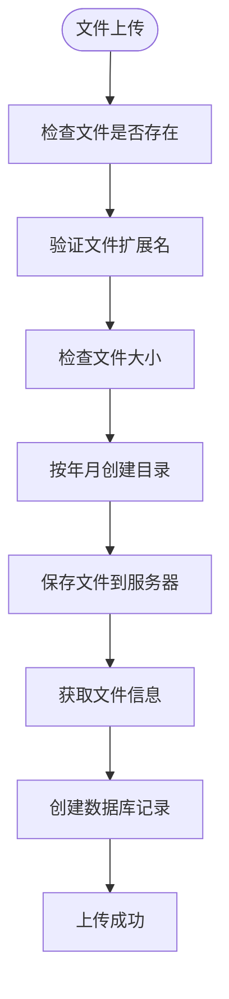

**图表来源**
- [company_cms_project/backend/app/api/media.py:79-166](file://company_cms_project/backend/app/api/media.py#L79-L166)

#### 文件处理
- 支持图片自动尺寸检测
- 生成安全的文件名避免冲突
- 按日期结构组织文件存储
- **更新** 增强安全机制，防止目录遍历攻击
- 自动清理和垃圾回收机制

**章节来源**
- [company_cms_project/backend/app/api/media.py:1-247](file://company_cms_project/backend/app/api/media.py#L1-L247)
- [company_cms_project/backend/app/__init__.py:47-65](file://company_cms_project/backend/app/__init__.py#L47-L65)

### 系统配置管理
采用灵活的配置管理系统，支持动态配置和页面配置。

#### 配置存储结构
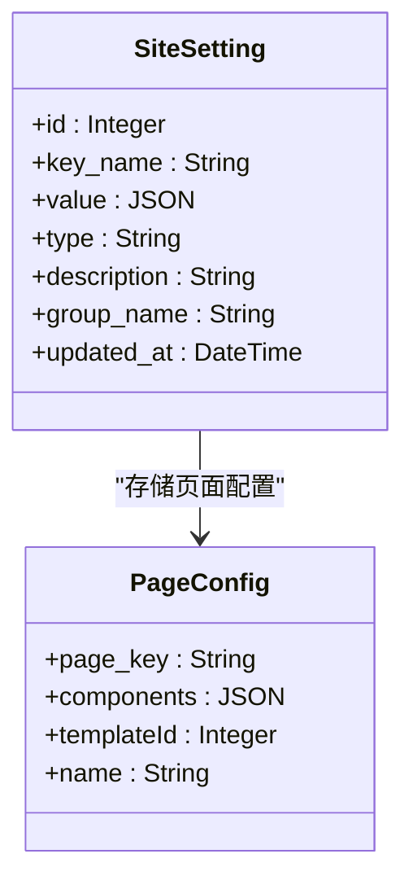

**图表来源**
- [company_cms_project/backend/app/models/post.py:210-280](file://company_cms_project/backend/app/models/post.py#L210-L280)

#### 配置管理功能
- **新增** 主题配置管理，支持预设主题应用
- 页面组件配置，支持JSON格式存储
- LOGO和底栏配置的专用接口
- 配置分组和分类管理

**章节来源**
- [company_cms_project/backend/app/api/settings.py:1-360](file://company_cms_project/backend/app/api/settings.py#L1-L360)
- [company_cms_project/backend/app/models/post.py:210-280](file://company_cms_project/backend/app/models/post.py#L210-L280)
- [company_cms_project/frontend/src/pages/ThemeSettings.tsx:1-172](file://company_cms_project/frontend/src/pages/ThemeSettings.tsx#L1-L172)

## API接口文档

### 认证相关接口
- `POST /api/v1/auth/register` - 用户注册
- `POST /api/v1/auth/login` - 用户登录
- `POST /api/v1/auth/logout` - 用户登出
- `POST /api/v1/auth/refresh` - 刷新访问令牌
- `GET /api/v1/auth/me` - 获取当前用户信息

### 用户管理接口
- `GET /api/v1/users` - 获取用户列表
- `GET /api/v1/users/<id>` - 获取用户详情
- `POST /api/v1/users` - 创建用户
- `PUT /api/v1/users/<id>` - 更新用户
- `DELETE /api/v1/users/<id>` - 删除用户
- `POST /api/v1/users/<id>/reset-password` - 重置用户密码

### 文章管理接口
- `GET /api/v1/posts` - 获取文章列表
- `GET /api/v1/posts/<id>` - 获取文章详情
- `POST /api/v1/posts` - 创建文章
- `PUT /api/v1/posts/<id>` - 更新文章
- `DELETE /api/v1/posts/<id>` - 删除文章

### 分类管理接口
- `GET /api/v1/categories` - 获取分类列表（树形结构）
- `POST /api/v1/categories` - 创建分类
- `PUT /api/v1/categories/<id>` - 更新分类
- `DELETE /api/v1/categories/<id>` - 删除分类

### 媒体管理接口
- `GET /api/v1/media` - 获取媒体文件列表
- `POST /api/v1/media/upload` - 上传文件
- `GET /api/v1/media/<id>` - 获取媒体文件详情
- `PUT /api/v1/media/<id>` - 更新媒体文件信息
- `DELETE /api/v1/media/<id>` - 删除媒体文件

### 配置管理接口
- `GET /api/v1/settings/<key_name>` - 获取配置
- `PUT /api/v1/settings/<key_name>` - 更新配置
- `GET /api/v1/settings` - 获取所有配置
- `GET /api/v1/pages/home` - 获取首页配置
- `PUT /api/v1/pages/home` - 保存首页配置
- `GET /api/v1/pages/<page_key>` - 获取页面配置
- `PUT /api/v1/pages/<page_key>` - 保存页面配置
- `GET /api/v1/settings/logo` - 获取LOGO配置
- `PUT /api/v1/settings/logo` - 更新LOGO配置
- `GET /api/v1/settings/footer` - 获取底栏配置
- `PUT /api/v1/settings/footer` - 更新底栏配置

**章节来源**
- [company_cms_project/backend/app/auth/routes.py:25-225](file://company_cms_project/backend/app/auth/routes.py#L25-L225)
- [company_cms_project/backend/app/api/users.py:24-326](file://company_cms_project/backend/app/api/users.py#L24-L326)
- [company_cms_project/backend/app/api/posts.py:16-454](file://company_cms_project/backend/app/api/posts.py#L16-L454)
- [company_cms_project/backend/app/api/categories.py:7-185](file://company_cms_project/backend/app/api/categories.py#L7-L185)
- [company_cms_project/backend/app/api/media.py:35-247](file://company_cms_project/backend/app/api/media.py#L35-L247)
- [company_cms_project/backend/app/api/settings.py:7-360](file://company_cms_project/backend/app/api/settings.py#L7-L360)

## 数据模型设计

### 用户模型（User）
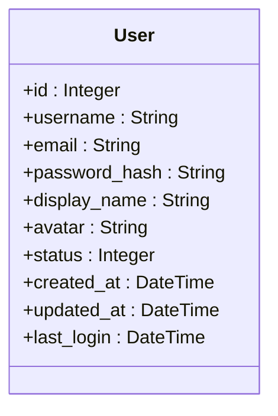

**图表来源**
- [company_cms_project/backend/app/models/user.py:5-47](file://company_cms_project/backend/app/models/user.py#L5-L47)

### 文章模型（Post）
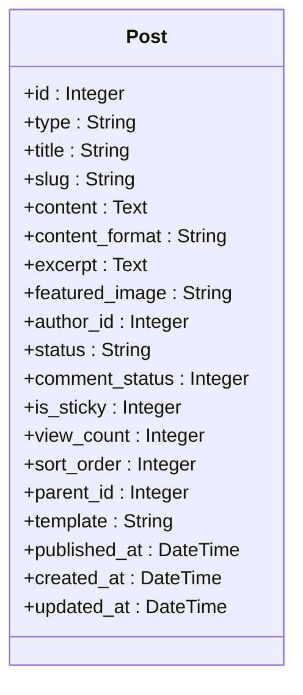

**图表来源**
- [company_cms_project/backend/app/models/post.py:4-60](file://company_cms_project/backend/app/models/post.py#L4-L60)

### 媒体模型（Media）
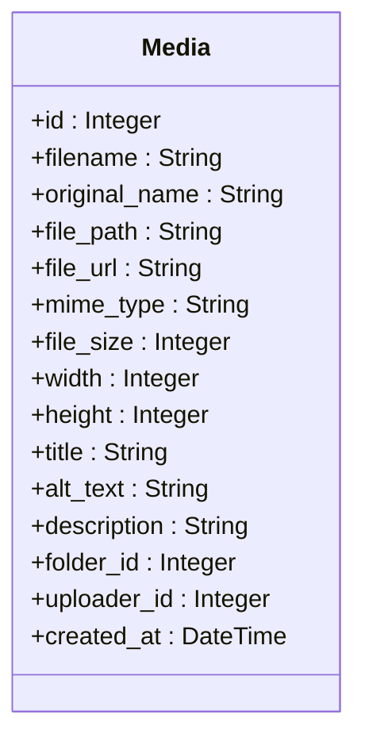

**图表来源**
- [company_cms_project/backend/app/models/post.py:129-169](file://company_cms_project/backend/app/models/post.py#L129-L169)

### 页面组件模型（PageComponent）
**新增** 支持页面组件的JSON配置存储

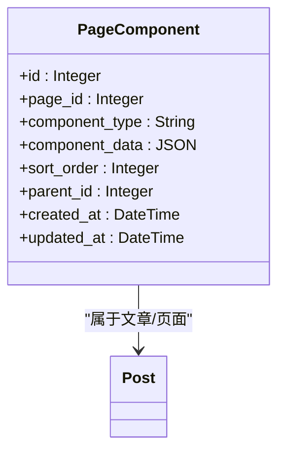

**图表来源**
- [company_cms_project/backend/app/models/post.py:184-207](file://company_cms_project/backend/app/models/post.py#L184-L207)

### 站点配置模型（SiteSetting）
**增强** 支持主题配置和页面组件配置

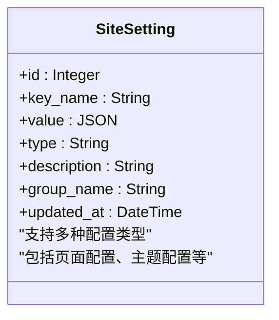

**图表来源**
- [company_cms_project/backend/app/models/post.py:210-280](file://company_cms_project/backend/app/models/post.py#L210-L280)

### 关系映射
系统采用Flask-SQLAlchemy ORM进行数据建模，支持多对多关系和外键约束。

**章节来源**
- [company_cms_project/backend/app/models/user.py:1-47](file://company_cms_project/backend/app/models/user.py#L1-L47)
- [company_cms_project/backend/app/models/post.py:1-280](file://company_cms_project/backend/app/models/post.py#L1-L280)

## 权限控制机制

### RBAC权限模型
系统实现了基于角色的访问控制（RBAC）模型，支持细粒度的权限管理。

#### 角色层次结构
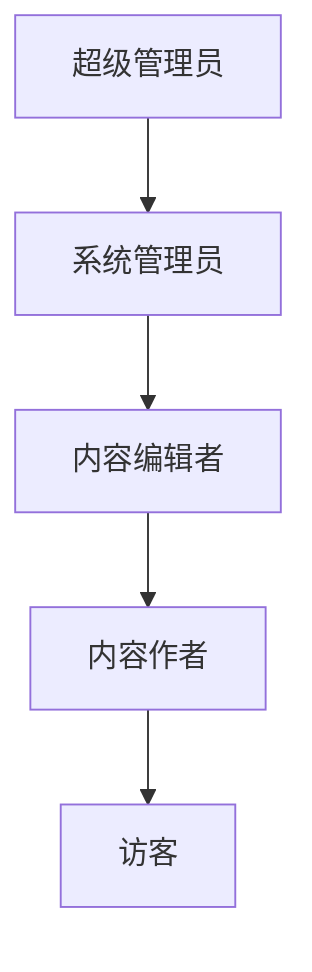

#### 权限验证流程
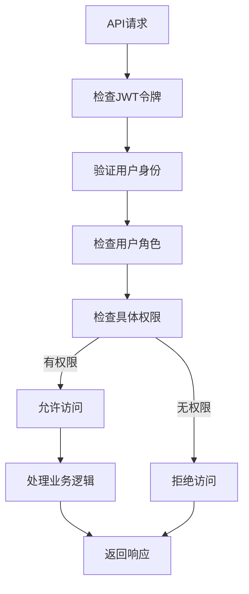

**图表来源**
- [company_cms_project/backend/app/api/posts.py:328-421](file://company_cms_project/backend/app/api/posts.py#L328-L421)

**章节来源**
- [company_cms_project/backend/app/api/posts.py:328-421](file://company_cms_project/backend/app/api/posts.py#L328-L421)
- [company_cms_project/backend/app/auth/routes.py:105-159](file://company_cms_project/backend/app/auth/routes.py#L105-L159)

## 配置管理

### 应用配置
系统采用多环境配置管理，支持开发、测试和生产环境的不同配置。

#### 配置类别
- **基础配置**：SECRET_KEY、DEBUG模式、数据库连接
- **JWT配置**：密钥、令牌过期时间、刷新策略
- **文件上传配置**：上传目录、文件大小限制、允许的扩展名
- **CORS配置**：跨域资源共享设置
- **分页配置**：每页显示数量

#### 环境变量配置
```python
# 开发环境配置
DEBUG = True
SQLALCHEMY_ECHO = True

# 生产环境配置  
DEBUG = False
SQLALCHEMY_ECHO = False
```

**章节来源**
- [company_cms_project/backend/config.py:1-64](file://company_cms_project/backend/config.py#L1-L64)
- [company_cms_project/backend/app/__init__.py:15-60](file://company_cms_project/backend/app/__init__.py#L15-L60)

### 主题配置管理
**新增** 支持预设主题的应用和管理

#### 主题配置流程
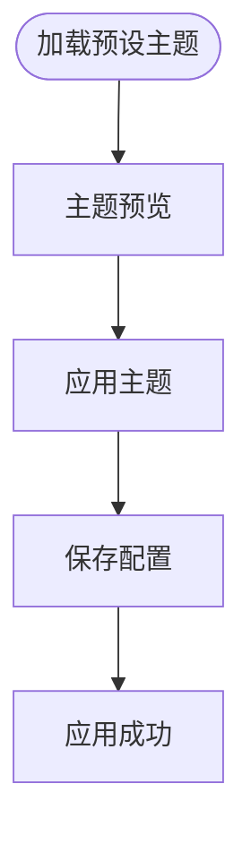

**图表来源**
- [company_cms_project/frontend/src/pages/ThemeSettings.tsx:12-19](file://company_cms_project/frontend/src/pages/ThemeSettings.tsx#L12-L19)

**章节来源**
- [company_cms_project/frontend/src/pages/ThemeSettings.tsx:1-172](file://company_cms_project/frontend/src/pages/ThemeSettings.tsx#L1-L172)

## 部署与运行

### 开发环境部署
系统支持多种部署方式，推荐使用以下配置：

#### 本地开发
- 使用Flask内置服务器进行开发调试
- 自动重载功能支持代码热更新
- 开启调试模式便于问题排查

#### 生产环境部署
- 使用Waitress作为WSGI服务器
- 支持多进程部署提高性能
- 配置SSL证书支持HTTPS

### 数据库初始化
系统提供数据库初始化命令：
```bash
flask init-db          # 初始化数据库表
flask create-admin     # 创建管理员账户
```

### 环境准备
1. 安装Python 3.8+
2. 安装依赖包：`pip install -r requirements.txt`
3. 配置环境变量
4. 初始化数据库
5. 启动应用

**章节来源**
- [company_cms_project/backend/run.py:32-69](file://company_cms_project/backend/run.py#L32-L69)
- [company_cms_project/backend/app/__init__.py:31-34](file://company_cms_project/backend/app/__init__.py#L31-L34)

## 性能考量

### 数据库优化
- 使用SQLite3单文件数据库，简化部署
- 启用WAL模式提高并发性能
- 为常用查询字段建立索引
- 避免N+1查询问题

### 缓存策略
- Redis缓存（可选）用于热点数据
- HTTP缓存头设置
- 静态资源缓存优化

### 文件处理优化
- 图片文件自动压缩
- 分布式文件存储支持
- CDN加速静态资源

### API性能
- 分页查询避免大数据量
- 批量操作减少数据库往返
- 异步任务处理耗时操作

## 故障排除指南

### 认证相关问题
- **登录失败**：检查用户名/密码是否正确，确认用户状态正常
- **令牌过期**：使用刷新令牌获取新的访问令牌
- **权限不足**：确认用户角色和权限分配

### 用户管理问题
- **用户创建失败**：检查用户名和邮箱唯一性，验证密码强度
- **密码重置失败**：确认新密码符合强度要求
- **删除用户失败**：检查是否尝试删除当前登录用户

### 数据库问题
- **连接失败**：检查数据库URL和连接参数
- **迁移失败**：运行`flask db upgrade`进行数据库迁移
- **查询超时**：优化查询语句，添加适当索引

### 文件上传问题
- **上传失败**：检查文件大小限制和扩展名
- **存储空间不足**：清理旧文件释放空间
- **图片处理错误**：确认Pillow库安装正确
- **目录遍历攻击**：检查文件路径安全验证

### API接口问题
- **404错误**：检查API路由是否正确
- **500错误**：查看服务器日志获取详细错误信息
- **CORS错误**：检查CORS配置和前端请求头

**章节来源**
- [company_cms_project/backend/app/__init__.py:49-58](file://company_cms_project/backend/app/__init__.py#L49-L58)
- [company_cms_project/backend/app/api/media.py:157-166](file://company_cms_project/backend/app/api/media.py#L157-L166)

## 结论
本项目成功实现了基于Flask的完整后台管理系统，具备以下特点：

### 技术优势
- **模块化架构**：清晰的蓝图分离和职责划分
- **安全可靠**：JWT认证和RBAC权限控制
- **扩展性强**：灵活的配置管理和插件机制
- **开发友好**：完善的API文档和错误处理
- **** 新增** 完整的用户权限管理系统，支持用户CRUD操作和密码重置

### 功能完整性
- 覆盖了企业CMS的核心功能需求
- 提供了完整的管理界面和API接口
- 支持多终端适配和响应式设计
- 具备良好的SEO优化能力
- **增强** 支持页面组件配置和主题管理

### 部署便利性
- 简化的数据库配置（SQLite3）
- 标准化的环境变量管理
- 完善的部署脚本和文档
- 支持Docker容器化部署

系统为后续的功能扩展和性能优化奠定了坚实的基础，能够满足企业级内容管理的需求。

## 附录

### 开发工具链
- **后端**：Flask、Flask-SQLAlchemy、Flask-JWT-Extended
- **前端**：React、TypeScript、Ant Design
- **数据库**：SQLite3、SQLAlchemy ORM
- **部署**：Waitress、Nginx、Docker

### API响应格式
所有API接口遵循统一的响应格式：
```json
{
  "code": 200,
  "message": "success",
  "data": {}
}
```

### 错误码规范
- **2xx**：成功
- **400**：请求参数错误
- **401**：未授权
- **403**：权限不足
- **404**：资源不存在
- **500**：服务器内部错误

### 安全最佳实践
- 使用HTTPS协议传输数据
- 实施CSRF防护机制
- 对用户输入进行严格验证
- 定期更新依赖包修复安全漏洞
- 实施日志审计和监控
- **增强** 防止目录遍历攻击的安全措施

**章节来源**
- [company_cms_project/backend/app/__init__.py:49-58](file://company_cms_project/backend/app/__init__.py#L49-L58)
- [company_cms_project/backend/config.py:1-64](file://company_cms_project/backend/config.py#L1-L64)