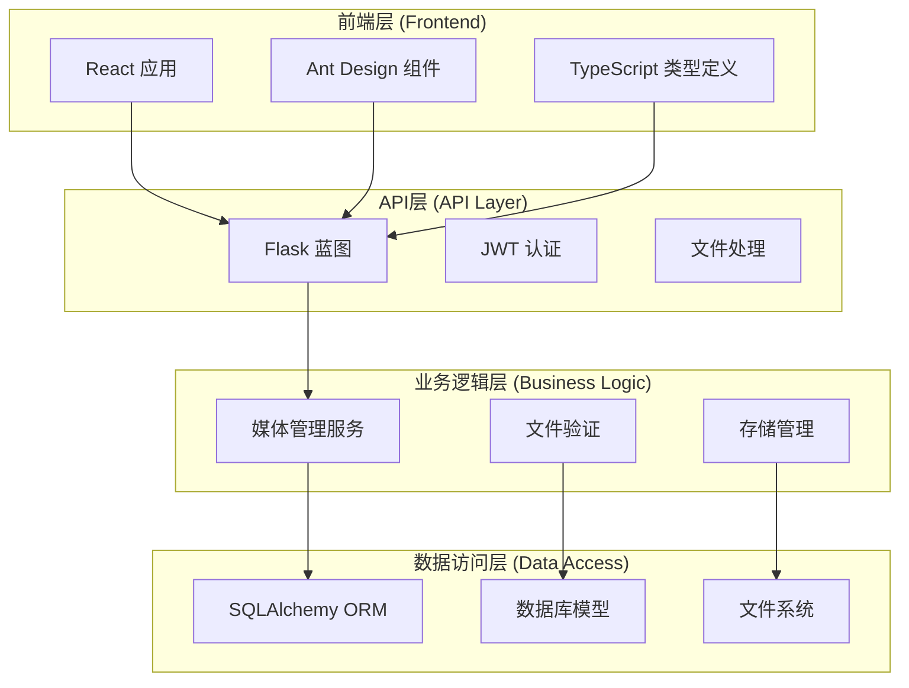
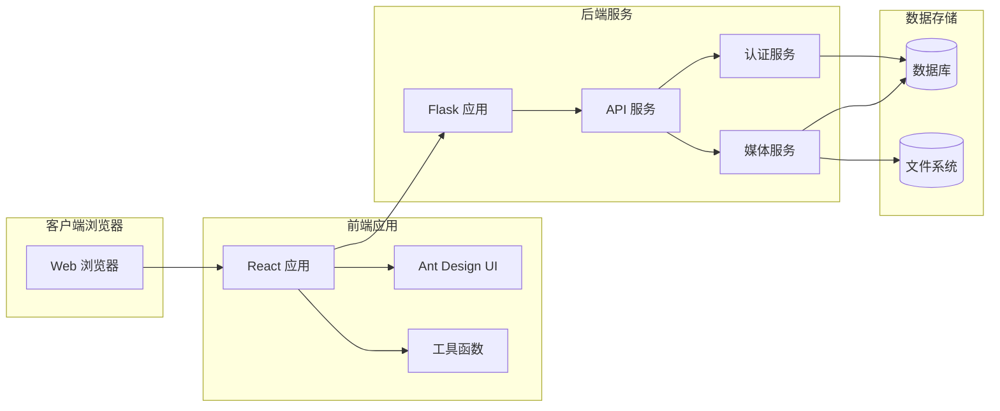
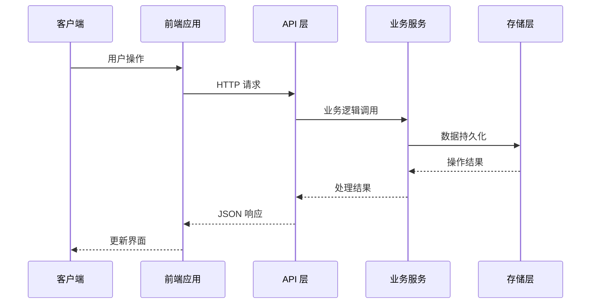
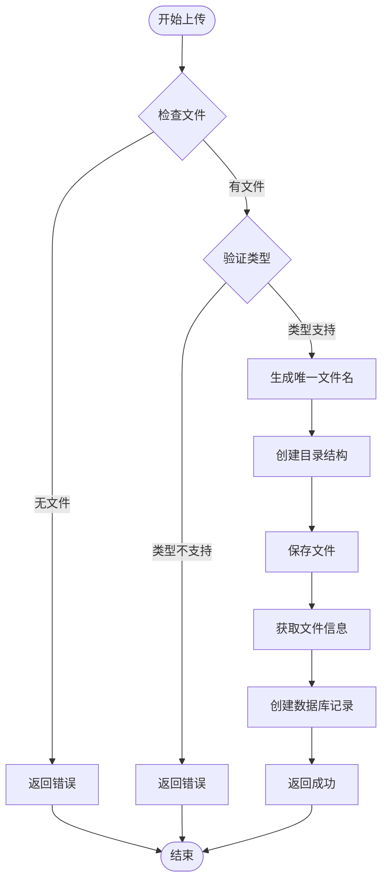
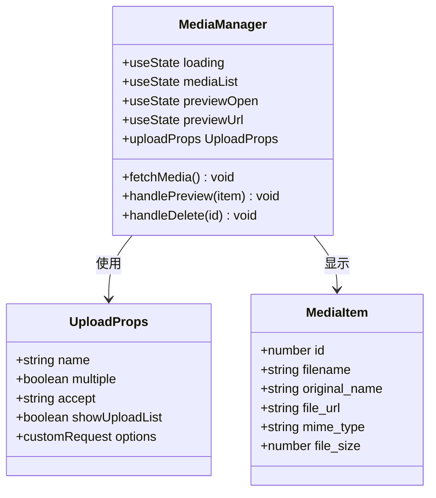
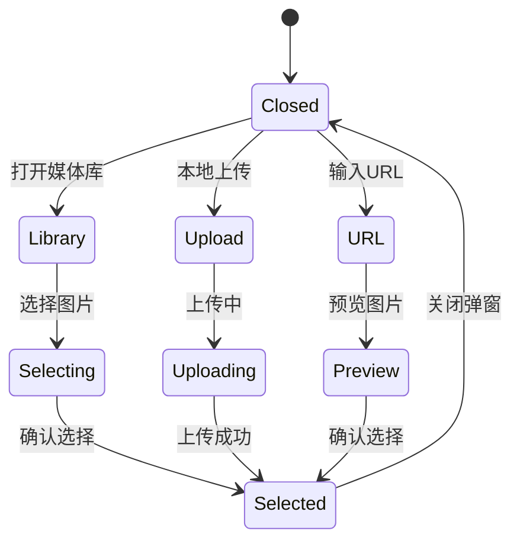
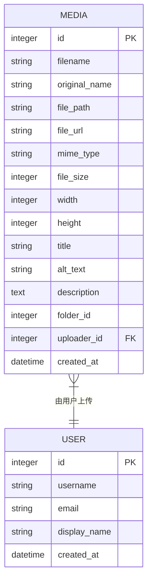
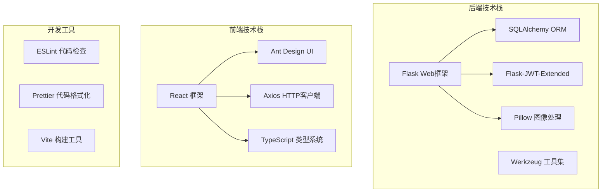
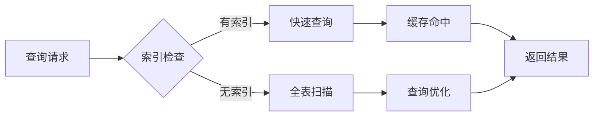

# 增强的媒体管理

<cite>
**本文档引用的文件**
- [media.py](file://company_cms_project/backend/app/api/media.py)
- [MediaManager.tsx](file://company_cms_project/frontend/src/pages/MediaManager.tsx)
- [media.ts](file://company_cms_project/frontend/src/api/media.ts)
- [config.py](file://company_cms_project/backend/config.py)
- [post.py](file://company_cms_project/backend/app/models/post.py)
- [__init__.py](file://company_cms_project/backend/app/__init__.py)
- [request.ts](file://company_cms_project/frontend/src/utils/request.ts)
- [run.py](file://company_cms_project/backend/run.py)
- [ImagePicker.tsx](file://company_cms_project/frontend/src/components/ImagePicker.tsx)
</cite>

## 目录
1. [简介](#简介)
2. [项目结构](#项目结构)
3. [核心组件](#核心组件)
4. [架构概览](#架构概览)
5. [详细组件分析](#详细组件分析)
6. [依赖关系分析](#依赖关系分析)
7. [性能考虑](#性能考虑)
8. [故障排除指南](#故障排除指南)
9. [结论](#结论)

## 简介

增强的媒体管理系统是一个基于Flask和React技术栈的企业级内容管理系统(CMS)的核心功能模块。该系统提供了完整的媒体文件管理解决方案，包括文件上传、存储、检索、预览和删除等功能。系统支持多种文件类型（图片、视频、PDF文档），具备JWT认证机制、文件类型验证、安全的文件存储策略以及现代化的用户界面。

该媒体管理系统采用前后端分离架构，后端使用Python Flask框架提供RESTful API服务，前端使用React TypeScript构建用户界面，实现了高效、安全、可扩展的媒体资产管理功能。

## 项目结构

整个媒体管理系统采用清晰的分层架构设计，主要分为以下层次：

**图表来源**
- [media.py:1-247](file://company_cms_project/backend/app/api/media.py#L1-L247)
- [MediaManager.tsx:1-186](file://company_cms_project/frontend/src/pages/MediaManager.tsx#L1-L186)
- [post.py:129-169](file://company_cms_project/backend/app/models/post.py#L129-L169)

**章节来源**
- [media.py:1-247](file://company_cms_project/backend/app/api/media.py#L1-L247)
- [config.py:1-64](file://company_cms_project/backend/config.py#L1-L64)
- [post.py:129-169](file://company_cms_project/backend/app/models/post.py#L129-L169)

## 核心组件

### 后端核心组件

#### 媒体API控制器
媒体API控制器是系统的核心组件，负责处理所有媒体相关的HTTP请求。它提供了完整的CRUD操作，包括文件上传、下载、删除和元数据管理。

#### 数据模型
系统使用SQLAlchemy ORM定义了完整的数据模型，其中媒体模型包含了文件的基本信息、元数据和关联关系。

#### 配置管理
配置类提供了灵活的环境配置选项，包括数据库连接、JWT令牌设置、文件上传限制和CORS跨域设置。

### 前端核心组件

#### 媒体管理器页面
媒体管理器页面提供了直观的媒体文件管理界面，支持网格视图、文件预览、批量操作和搜索功能。

#### 图片选择器组件
图片选择器组件是一个可复用的UI组件，支持从媒体库选择图片、本地上传和URL输入三种方式。

#### 请求封装工具
请求封装工具提供了统一的API调用接口，包含JWT令牌管理和错误处理机制。

**章节来源**
- [media.py:35-247](file://company_cms_project/backend/app/api/media.py#L35-L247)
- [post.py:129-169](file://company_cms_project/backend/app/models/post.py#L129-L169)
- [MediaManager.tsx:11-186](file://company_cms_project/frontend/src/pages/MediaManager.tsx#L11-L186)

## 架构概览

系统采用现代的微服务架构模式，实现了前后端完全分离的设计理念：

**图表来源**
- [__init__.py:15-84](file://company_cms_project/backend/app/__init__.py#L15-L84)
- [run.py:19-69](file://company_cms_project/backend/run.py#L19-L69)

### 数据流架构

系统的数据流遵循标准的MVC模式，实现了清晰的职责分离：

**图表来源**
- [media.py:79-167](file://company_cms_project/backend/app/api/media.py#L79-L167)
- [request.ts:11-76](file://company_cms_project/frontend/src/utils/request.ts#L11-L76)

## 详细组件分析

### 媒体API服务

#### 文件上传流程

**图表来源**
- [media.py:79-167](file://company_cms_project/backend/app/api/media.py#L79-L167)

#### 文件类型验证机制

系统实现了严格的文件类型验证机制，确保只接受安全的文件类型：

| 支持的文件类型 | 扩展名列表 |
|---------------|-----------|
| 图片 | png, jpg, jpeg, jfif, gif, webp, bmp, ico, svg |
| 视频 | mp4, webm |
| 文档 | pdf |

#### 安全防护措施

系统采用了多层安全防护机制：

1. **JWT认证**：所有受保护的API都需要有效的JWT令牌
2. **文件类型验证**：严格限制允许的文件扩展名
3. **路径遍历防护**：防止恶意路径访问
4. **文件大小限制**：默认50MB限制
5. **目录结构组织**：按年月自动创建存储目录

**章节来源**
- [media.py:11-14](file://company_cms_project/backend/app/api/media.py#L11-L14)
- [media.py:82-167](file://company_cms_project/backend/app/api/media.py#L82-L167)
- [config.py:24-30](file://company_cms_project/backend/config.py#L24-L30)

### 前端媒体管理界面

#### 媒体管理器组件

媒体管理器组件提供了完整的媒体文件管理功能：

**图表来源**
- [MediaManager.tsx:11-186](file://company_cms_project/frontend/src/pages/MediaManager.tsx#L11-L186)

#### 图片选择器组件

图片选择器组件是一个高度可复用的UI组件，支持多种图片选择方式：

**图表来源**
- [ImagePicker.tsx:25-346](file://company_cms_project/frontend/src/components/ImagePicker.tsx#L25-L346)

#### 响应式布局设计

系统采用了响应式设计原则，支持不同屏幕尺寸的设备：

| 设备类型 | 列数 | 卡片尺寸 |
|---------|------|----------|
| 移动设备 | 1列 | 100%宽度 |
| 平板设备 | 2-4列 | 适应性调整 |
| 桌面设备 | 4-8列 | 固定尺寸 |

**章节来源**
- [MediaManager.tsx:125-167](file://company_cms_project/frontend/src/pages/MediaManager.tsx#L125-L167)
- [ImagePicker.tsx:172-346](file://company_cms_project/frontend/src/components/ImagePicker.tsx#L172-L346)

### 数据模型设计

#### 媒体模型结构

媒体模型定义了完整的文件元数据结构：

**图表来源**
- [post.py:129-169](file://company_cms_project/backend/app/models/post.py#L129-L169)

#### 数据库关系设计

系统通过外键关系建立了媒体文件与用户的关联：

| 字段名 | 类型 | 约束 | 描述 |
|-------|------|------|------|
| id | Integer | 主键 | 媒体文件唯一标识符 |
| filename | String(255) | 非空 | 服务器端存储的文件名 |
| original_name | String(255) | 可空 | 用户原始文件名 |
| file_path | String(500) | 非空 | 相对于上传目录的路径 |
| file_url | String(500) | 可空 | 访问URL路径 |
| mime_type | String(100) | 可空 | MIME类型 |
| file_size | Integer | 可空 | 文件大小（字节） |
| width | Integer | 可空 | 图片宽度（像素） |
| height | Integer | 可空 | 图片高度（像素） |
| uploader_id | Integer | 外键 | 上传者用户ID |

**章节来源**
- [post.py:129-169](file://company_cms_project/backend/app/models/post.py#L129-L169)

## 依赖关系分析

### 技术栈依赖

系统采用了成熟稳定的技术栈组合：

### 外部依赖管理

系统通过requirements.txt文件管理Python后端依赖，package.json文件管理Node.js前端依赖。主要依赖包括：

#### 后端依赖
- Flask: Web应用框架
- Flask-SQLAlchemy: ORM数据库操作
- Flask-JWT-Extended: JWT认证
- Pillow: 图像处理
- python-dotenv: 环境变量管理

#### 前端依赖
- react: 核心框架
- antd: UI组件库
- axios: HTTP客户端
- typescript: 类型系统

**章节来源**
- [config.py:1-64](file://company_cms_project/backend/config.py#L1-L64)
- [run.py:1-69](file://company_cms_project/backend/run.py#L1-L69)

## 性能考虑

### 文件存储优化

系统采用了智能的文件存储策略来优化性能：

1. **分层目录结构**：按年月组织文件，避免单个目录文件过多
2. **缓存机制**：利用CDN缓存静态媒体文件
3. **压缩处理**：支持WebP等现代图像格式
4. **懒加载**：媒体库采用虚拟滚动提升大数据量性能

### 数据库性能优化

系统通过以下方式优化数据库性能：
- 为常用查询字段建立索引
- 实现分页查询避免大数据量传输
- 使用连接池管理数据库连接
- 缓存热点数据减少数据库压力

### 前端性能优化

前端应用采用了多项性能优化技术：
- 懒加载组件减少初始包大小
- 图片懒加载提升页面加载速度
- 防抖和节流处理高频事件
- 内存泄漏防护机制

## 故障排除指南

### 常见问题及解决方案

#### 文件上传失败

**问题症状**：上传过程中出现错误提示

**可能原因**：
1. 文件类型不被允许
2. 文件大小超过限制
3. 服务器磁盘空间不足
4. 权限配置错误

**解决步骤**：
1. 检查文件扩展名是否在允许列表中
2. 验证文件大小是否超过50MB限制
3. 确认上传目录权限设置正确
4. 查看服务器磁盘空间情况

#### 媒体文件无法访问

**问题症状**：点击预览或下载链接返回404错误

**可能原因**：
1. 文件路径配置错误
2. 目录权限问题
3. CDN缓存未更新

**解决步骤**：
1. 验证文件在服务器上的实际路径
2. 检查文件权限设置
3. 清除浏览器缓存
4. 重新部署应用

#### JWT认证失败

**问题症状**：API请求返回401未授权错误

**可能原因**：
1. 令牌过期
2. 令牌格式错误
3. 服务器密钥不匹配

**解决步骤**：
1. 重新登录获取新令牌
2. 检查令牌格式和有效期
3. 验证JWT_SECRET_KEY配置
4. 检查前后端版本兼容性

### 调试工具和方法

#### 后端调试

系统提供了完善的调试工具：
- Flask内置开发服务器
- SQLAlchemy查询日志
- 错误追踪和异常报告
- 健康检查接口

#### 前端调试

前端应用支持：
- React DevTools调试工具
- 浏览器开发者工具
- 网络请求监控
- 控制台错误日志

**章节来源**
- [media.py:72-76](file://company_cms_project/backend/app/api/media.py#L72-L76)
- [request.ts:16-29](file://company_cms_project/frontend/src/utils/request.ts#L16-L29)

## 结论

增强的媒体管理系统是一个功能完整、架构清晰、性能优秀的现代化内容管理解决方案。系统通过前后端分离的设计理念，实现了高效的媒体文件管理功能，支持多种文件类型的上传、存储和访问。

### 主要优势

1. **安全性**：完善的文件类型验证、JWT认证和路径遍历防护
2. **可扩展性**：模块化的架构设计支持功能扩展
3. **用户体验**：现代化的UI界面和响应式设计
4. **性能优化**：智能的存储策略和缓存机制
5. **开发友好**：清晰的代码结构和完善的文档

### 技术亮点

- 基于Flask的轻量级后端服务
- React TypeScript的现代化前端架构
- 完整的JWT认证体系
- 智能的文件存储和管理机制
- 响应式用户界面设计

该系统为企业内容管理提供了坚实的技术基础，可以根据具体需求进行进一步的功能扩展和定制开发。