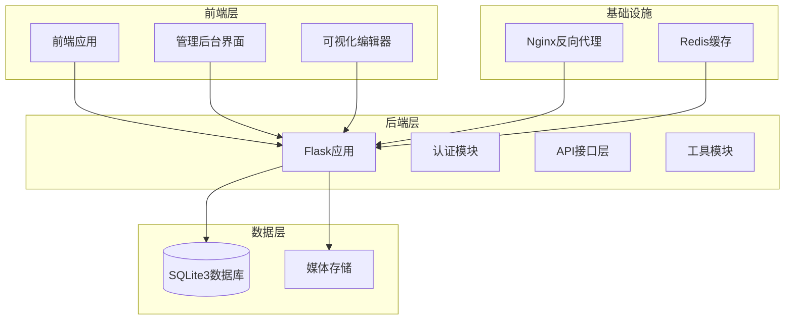
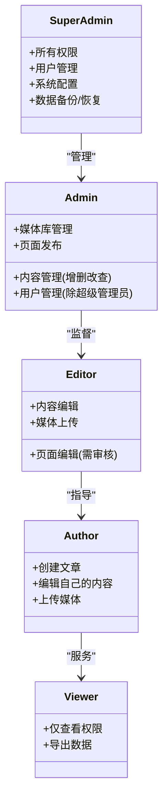
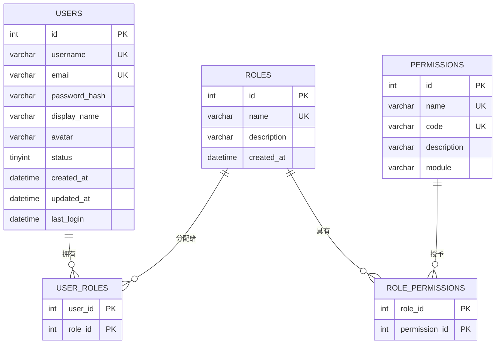
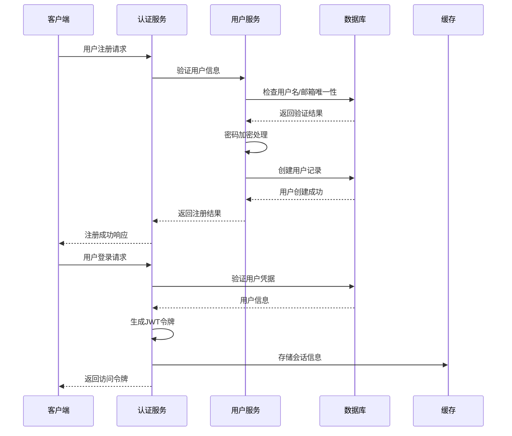
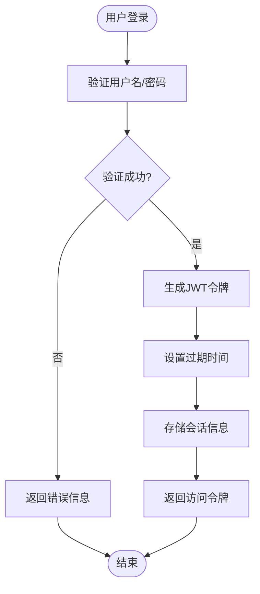
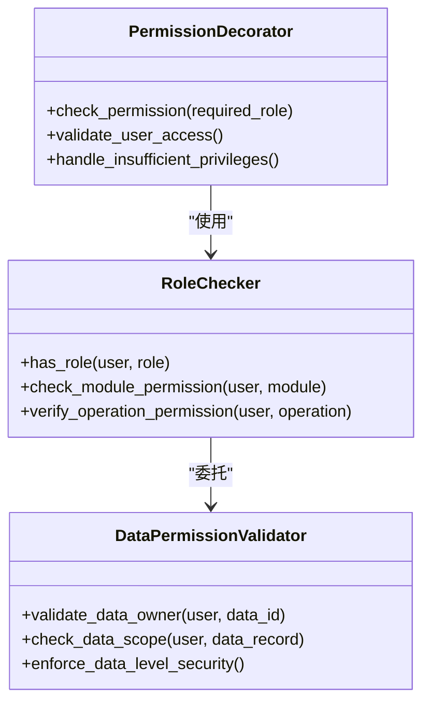
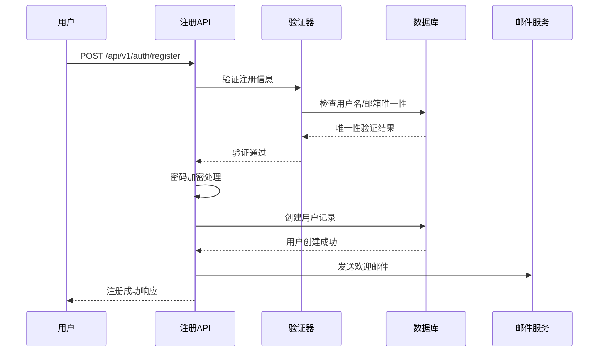
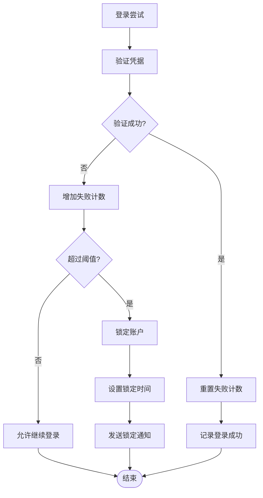
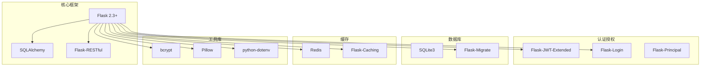
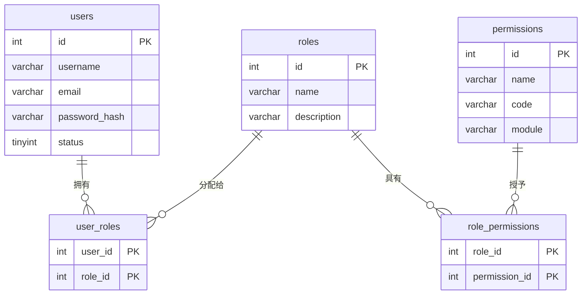

# 用户权限管理

<cite>
**本文档引用的文件**
- [企业网站CMS系统详细需求文档.md](file://企业网站CMS系统详细需求文档.md)
- [开发计划表_2月4日-2月12日.md](file://开发计划表_2月4日-2月12日.md)
</cite>

## 目录
1. [简介](#简介)
2. [项目结构](#项目结构)
3. [核心组件](#核心组件)
4. [架构总览](#架构总览)
5. [详细组件分析](#详细组件分析)
6. [依赖关系分析](#依赖关系分析)
7. [性能考虑](#性能考虑)
8. [故障排除指南](#故障排除指南)
9. [结论](#结论)

## 简介

本项目为企业网站CMS系统，采用基于Flask的前后端分离架构。系统实现了完整的RBAC（基于角色的访问控制）权限管理体系，支持五种用户角色和三级权限粒度控制。该权限管理方案旨在为企业提供安全、灵活、可扩展的内容管理能力。

## 项目结构

CMS系统采用模块化的项目结构，后端使用Flask框架，前端采用React/Vue技术栈，数据库使用SQLite3，部署于Windows Server环境。

**图表来源**
- [开发计划表_2月4日-2月12日.md](file://开发计划表_2月4日-2月12日.md#L92-L105)

**章节来源**
- [开发计划表_2月4日-2月12日.md](file://开发计划表_2月4日-2月12日.md#L75-L105)

## 核心组件

### 角色体系架构

系统实现了标准的五级角色权限体系，每个角色都有明确的职责边界和权限范围。

**图表来源**
- [企业网站CMS系统详细需求文档.md](file://企业网站CMS系统详细需求文档.md#L239-L265)

### 权限粒度层次

系统采用三级权限控制机制，从宏观到微观逐层细化：

1. **模块级权限**：控制对整个功能模块的访问
2. **操作级权限**：控制具体CRUD操作的执行
3. **数据级权限**：控制对特定数据记录的操作范围

**章节来源**
- [企业网站CMS系统详细需求文档.md](file://企业网站CMS系统详细需求文档.md#L266-L269)

## 架构总览

### RBAC模型实现

系统采用经典的RBAC三层模型，通过用户-角色-权限的关联实现灵活的权限控制。

**图表来源**
- [企业网站CMS系统详细需求文档.md](file://企业网站CMS系统详细需求文档.md#L717-L768)

### 用户管理功能架构

**图表来源**
- [企业网站CMS系统详细需求文档.md](file://企业网站CMS系统详细需求文档.md#L1002-L1011)

**章节来源**
- [企业网站CMS系统详细需求文档.md](file://企业网站CMS系统详细需求文档.md#L284-L293)

## 详细组件分析

### 用户认证与授权

#### JWT Token机制

系统采用JWT（JSON Web Token）作为认证令牌，实现无状态的用户身份验证。

**图表来源**
- [企业网站CMS系统详细需求文档.md](file://企业网站CMS系统详细需求文档.md#L1082-L1087)

#### 密码安全管理

系统采用bcrypt算法进行密码加密，确保用户凭据的安全存储。

**章节来源**
- [企业网站CMS系统详细需求文档.md](file://企业网站CMS系统详细需求文档.md#L1088-L1092)

### 权限验证机制

#### 装饰器权限检查

系统使用Flask装饰器实现权限验证，提供声明式的权限控制方式。

**图表来源**
- [企业网站CMS系统详细需求文档.md](file://企业网站CMS系统详细需求文档.md#L274-L275)

#### 权限继承关系

系统支持角色间的继承关系，实现权限的层次化管理。

**章节来源**
- [企业网站CMS系统详细需求文档.md](file://企业网站CMS系统详细需求文档.md#L271-L282)

### 用户管理功能实现

#### 用户注册流程

**图表来源**
- [企业网站CMS系统详细需求文档.md](file://企业网站CMS系统详细需求文档.md#L1006-L1011)

#### 登录验证机制

系统实现多层登录保护机制，包括密码验证、账户状态检查和安全锁定。

**章节来源**
- [企业网站CMS系统详细需求文档.md](file://企业网站CMS系统详细需求文档.md#L1002-L1011)

### 权限系统安全特性

#### 账号锁定机制

系统实现智能的账号锁定机制，防止暴力破解攻击。

**图表来源**
- [企业网站CMS系统详细需求文档.md](file://企业网站CMS系统详细需求文档.md#L1092-L1092)

**章节来源**
- [企业网站CMS系统详细需求文档.md](file://企业网站CMS系统详细需求文档.md#L1088-L1092)

## 依赖关系分析

### 技术栈依赖

系统采用现代化的Python技术栈，各组件间依赖关系清晰。

**图表来源**
- [企业网站CMS系统详细需求文档.md](file://企业网站CMS系统详细需求文档.md#L557-L594)

### 数据库表关系

**图表来源**
- [企业网站CMS系统详细需求文档.md](file://企业网站CMS系统详细需求文档.md#L717-L768)

**章节来源**
- [企业网站CMS系统详细需求文档.md](file://企业网站CMS系统详细需求文档.md#L557-L594)

## 性能考虑

### 缓存策略

系统采用多层缓存机制，提升权限验证和用户数据的访问性能。

- **Redis缓存**：用户会话、权限数据、热点查询结果
- **数据库查询缓存**：常用查询结果缓存
- **静态资源缓存**：前端资源、媒体文件缓存

### 性能优化建议

1. **索引优化**：为常用查询字段建立合适的索引
2. **连接池配置**：合理配置数据库连接池大小
3. **异步处理**：敏感操作采用异步处理机制
4. **CDN加速**：静态资源通过CDN分发

## 故障排除指南

### 常见权限问题

| 问题类型 | 症状 | 解决方案 |
|---------|------|----------|
| 权限不足 | 403 Forbidden错误 | 检查用户角色配置，确认权限继承关系 |
| 会话过期 | 401 Unauthorized错误 | 实施Token刷新机制，检查JWT配置 |
| 账户锁定 | 账户被锁定 | 检查登录失败阈值，等待锁定时间结束 |
| 数据访问限制 | 无法访问特定数据 | 验证数据级权限配置 |

### 安全审计

系统提供完整的审计日志记录功能：

- **登录日志**：记录用户登录时间、IP地址、设备信息
- **操作日志**：记录重要业务操作的执行者和结果
- **错误日志**：记录系统错误和异常情况
- **安全事件**：记录可疑行为和安全威胁

**章节来源**
- [企业网站CMS系统详细需求文档.md](file://企业网站CMS系统详细需求文档.md#L1391-L1396)

## 结论

本CMS系统的用户权限管理方案基于成熟的RBAC模型，通过五级角色体系和三级权限粒度实现了精细化的权限控制。系统采用JWT认证机制，结合bcrypt密码加密和智能账号锁定，提供了全面的安全保障。

通过模块化的架构设计和清晰的组件划分，系统具备良好的可维护性和扩展性。MVP版本实现了核心权限功能，为后续的功能增强和性能优化奠定了坚实基础。

该权限管理体系不仅满足当前的企业网站管理需求，也为未来的功能扩展和安全加固提供了灵活的架构支撑。