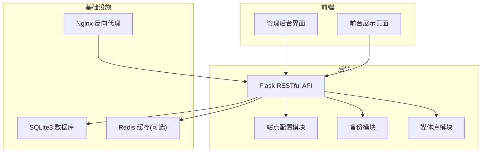
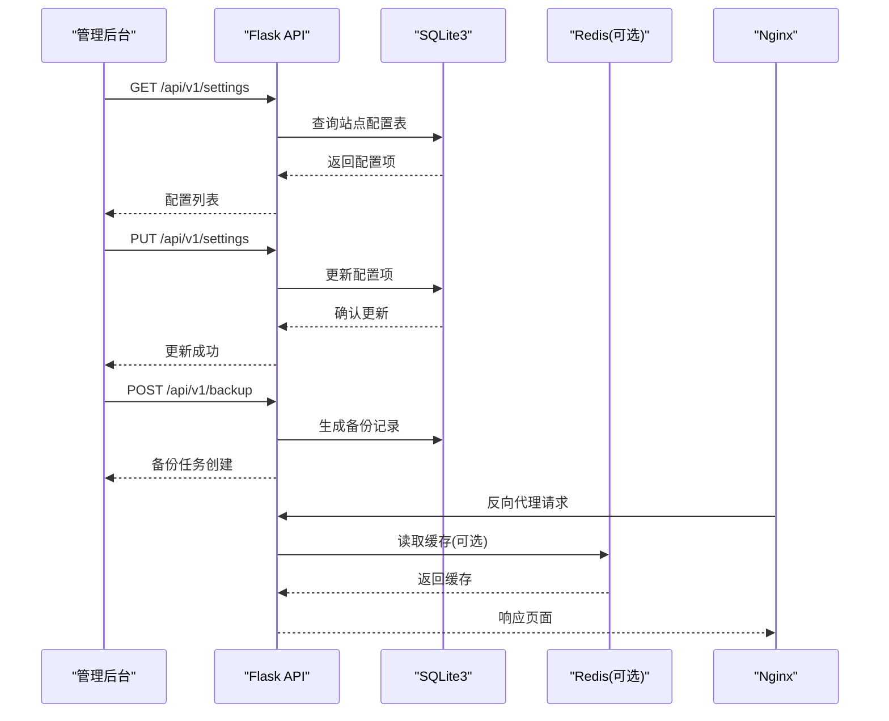
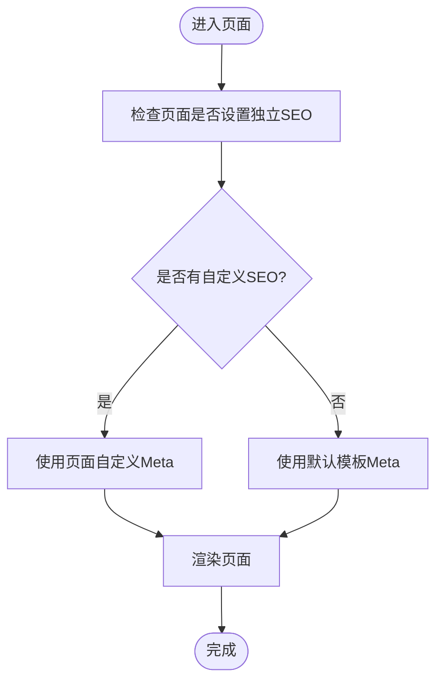
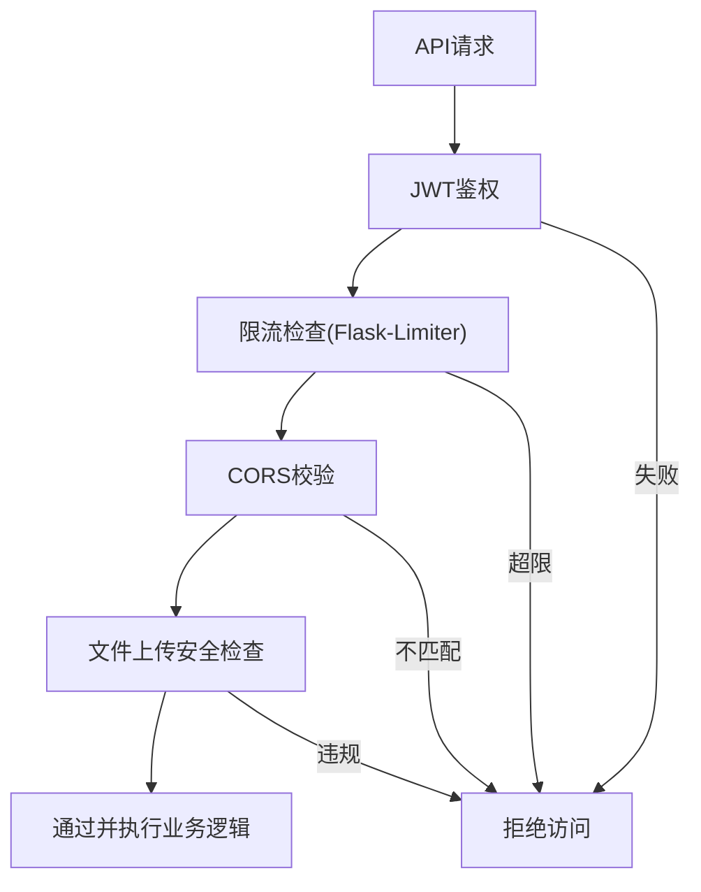
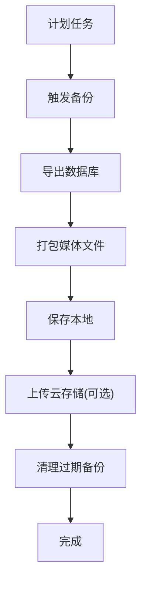
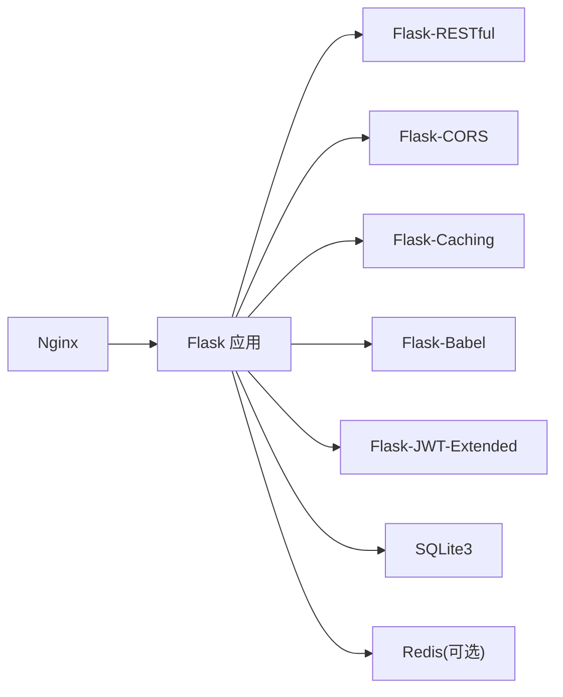

# 系统配置管理

<cite>
**本文引用的文件**
- [企业网站CMS系统开发需求文档.ini](file://企业网站CMS系统开发需求文档.ini)
- [企业网站CMS系统详细需求文档.md](file://企业网站CMS系统详细需求文档.md)
- [开发计划表_2月4日-2月12日.md](file://开发计划表_2月4日-2月12日.md)
</cite>

## 目录
1. [简介](#简介)
2. [项目结构](#项目结构)
3. [核心组件](#核心组件)
4. [架构总览](#架构总览)
5. [详细组件分析](#详细组件分析)
6. [依赖分析](#依赖分析)
7. [性能考量](#性能考量)
8. [故障排查指南](#故障排查指南)
9. [结论](#结论)
10. [附录](#附录)

## 简介
本文件面向企业网站CMS系统的“系统配置管理”主题，围绕网站基本设置、SEO配置、URL配置、邮件配置、安全设置、性能配置以及备份管理等核心模块，结合项目需求文档与开发计划，系统梳理各模块的作用、参数设置与最佳实践，并提供可视化架构图与流程图帮助理解与落地实施。

## 项目结构
- 本项目采用前后端分离架构，后端基于Python Flask，前端可选React/Vue或纯HTML模板渲染；部署于Windows Server + Nginx + SQLite3（可选Redis）。
- 系统配置主要通过统一的“站点配置表”集中管理，便于后台统一维护与API调用。

**图表来源**
- [企业网站CMS系统详细需求文档.md](file://企业网站CMS系统详细需求文档.md#L22-L57)
- [企业网站CMS系统详细需求文档.md](file://企业网站CMS系统详细需求文档.md#L1143-L1230)
- [企业网站CMS系统详细需求文档.md](file://企业网站CMS系统详细需求文档.md#L1234-L1302)

**章节来源**
- [企业网站CMS系统详细需求文档.md](file://企业网站CMS系统详细需求文档.md#L22-L57)
- [开发计划表_2月4日-2月12日.md](file://开发计划表_2月4日-2月12日.md#L58-L134)

## 核心组件
- 站点配置模块：统一管理网站基本信息、SEO配置、URL规则、邮件配置、安全策略、性能参数与备份策略。
- 备份模块：提供自动/手动备份、备份列表、恢复与云存储集成能力。
- 媒体库模块：与配置联动，支持图片压缩、懒加载、CDN等性能优化参数生效。
- 安全模块：基于JWT、CORS、API限流、文件上传安全规则等实现安全策略。
- 性能模块：页面缓存、静态资源缓存、CDN、图片压缩质量、懒加载等参数。

**章节来源**
- [企业网站CMS系统详细需求文档.md](file://企业网站CMS系统详细需求文档.md#L388-L445)
- [企业网站CMS系统详细需求文档.md](file://企业网站CMS系统详细需求文档.md#L1068-L1076)

## 架构总览
系统配置管理贯穿前后端与基础设施，通过统一的配置表与API实现集中治理：

**图表来源**
- [企业网站CMS系统详细需求文档.md](file://企业网站CMS系统详细需求文档.md#L1068-L1076)
- [企业网站CMS系统详细需求文档.md](file://企业网站CMS系统详细需求文档.md#L1143-L1230)
- [企业网站CMS系统详细需求文档.md](file://企业网站CMS系统详细需求文档.md#L1234-L1302)

## 详细组件分析

### 网站基本设置
- 管理范围：网站名称、Logo/Favicon、网站描述、联系方式（电话/邮箱/地址）、社交媒体链接、版权信息、ICP备案号等。
- 配置入口：系统设置页面，支持表单化维护与即时生效。
- 最佳实践：
  - Logo与Favicon尺寸建议遵循主流浏览器与移动端适配规范。
  - 联系方式与社交媒体链接保持一致性，避免信息漂移。
  - 版权信息与ICP信息需符合当地法规要求。

**章节来源**
- [企业网站CMS系统详细需求文档.md](file://企业网站CMS系统详细需求文档.md#L390-L397)
- [开发计划表_2月4日-2月12日.md](file://开发计划表_2月4日-2月12日.md#L350-L353)

### SEO配置
- 管理范围：默认Meta标题模板、默认Meta描述模板、默认关键词、Google Analytics ID、百度统计代码、自定义头部/底部代码。
- 实现原理：
  - 每页可独立设置Title/Description/Keywords，若未设置则回退至默认模板。
  - 自动生成Meta标签（基于内容），支持Open Graph与Twitter Card。
  - URL友好化（去除?id=、自动生成slug、规范链接Canonical）。
- 最佳实践：
  - 为不同页面类型设定差异化Meta模板，提升搜索引擎收录质量。
  - 定期检查robots.txt与sitemap生成情况，确保搜索引擎抓取顺畅。

**图表来源**
- [企业网站CMS系统详细需求文档.md](file://企业网站CMS系统详细需求文档.md#L482-L511)

**章节来源**
- [企业网站CMS系统详细需求文档.md](file://企业网站CMS系统详细需求文档.md#L399-L406)
- [企业网站CMS系统详细需求文档.md](file://企业网站CMS系统详细需求文档.md#L482-L511)

### URL配置
- 管理范围：URL重写规则、固定链接格式（如/post/{id}、/post/{slug}、/{year}/{month}/{slug}）、分页URL格式。
- 实现原理：基于友好URL结构，去除查询参数，提升SEO与用户体验。
- 最佳实践：
  - 固定链接格式应与内容类型匹配（文章/页面/分类）。
  - 保持URL稳定性，避免频繁变更导致SEO回退。

**章节来源**
- [企业网站CMS系统详细需求文档.md](file://企业网站CMS系统详细需求文档.md#L408-L415)

### 邮件配置
- 管理范围：SMTP服务器设置、发件人邮箱、邮件模板管理、测试邮件发送。
- 实现原理：通过SMTP协议发送系统通知、用户验证、订阅提醒等邮件。
- 最佳实践：
  - 使用TLS/SSL加密通道，避免明文传输。
  - 为不同场景配置独立模板，确保信息准确与合规。

**章节来源**
- [企业网站CMS系统详细需求文档.md](file://企业网站CMS系统详细需求文档.md#L416-L421)
- [企业网站CMS系统详细需求文档.md](file://企业网站CMS系统详细需求文档.md#L1277-L1283)

### 安全设置
- 管理范围：HTTPS强制跳转、CORS配置、API访问频率限制、IP黑名单/白名单、文件上传安全规则。
- 实现原理：
  - HTTPS强制跳转与HSTS头保障传输安全。
  - Flask-CORS配置允许域白名单，减少跨域风险。
  - Flask-Limiter实现基于IP/用户的限流策略。
  - 文件上传白名单、大小限制、随机化存储路径等。
- 最佳实践：
  - 严格限制CORS来源，避免任意域访问。
  - 对高频接口设置更严格的限流阈值。
  - 定期轮换JWT密钥与环境变量中的敏感配置。

**图表来源**
- [企业网站CMS系统详细需求文档.md](file://企业网站CMS系统详细需求文档.md#L1128-L1140)
- [企业网站CMS系统详细需求文档.md](file://企业网站CMS系统详细需求文档.md#L1287-L1289)

**章节来源**
- [企业网站CMS系统详细需求文档.md](file://企业网站CMS系统详细需求文档.md#L422-L428)
- [企业网站CMS系统详细需求文档.md](file://企业网站CMS系统详细需求文档.md#L1078-L1140)

### 性能配置
- 管理范围：缓存开关/过期时间、静态资源CDN地址、图片压缩质量、懒加载开关。
- 实现原理：
  - 页面缓存（Redis）与静态资源缓存（浏览器/CDN）协同。
  - 图片懒加载与响应式图片srcset提升首屏性能。
  - CDN加速与Gzip压缩减少带宽与延迟。
- 最佳实践：
  - 针对登录用户不缓存页面，兼顾个性化与性能。
  - 图片压缩质量与格式（WebP）平衡清晰度与体积。
  - CDN缓存刷新策略与版本号/哈希更新策略配合使用。

**章节来源**
- [企业网站CMS系统详细需求文档.md](file://企业网站CMS系统详细需求文档.md#L429-L435)
- [企业网站CMS系统详细需求文档.md](file://企业网站CMS系统详细需求文档.md#L512-L548)
- [企业网站CMS系统详细需求文档.md](file://企业网站CMS系统详细需求文档.md#L1143-L1230)

### 备份管理
- 管理范围：自动备份设置（频率/时间/保留数）、手动备份、备份下载、备份恢复、备份到云存储。
- 实现原理：定期生成数据库与媒体文件备份，支持云端归档与快速恢复。
- 最佳实践：
  - 每日全量备份+增量备份策略，保留30天。
  - 异地备份（云存储）与本地备份并行，确保灾难恢复。
  - 定期演练恢复流程，验证备份完整性与时效性。

**图表来源**
- [企业网站CMS系统详细需求文档.md](file://企业网站CMS系统详细需求文档.md#L436-L444)
- [企业网站CMS系统详细需求文档.md](file://企业网站CMS系统详细需求文档.md#L1406-L1415)

**章节来源**
- [企业网站CMS系统详细需求文档.md](file://企业网站CMS系统详细需求文档.md#L436-L444)
- [开发计划表_2月4日-2月12日.md](file://开发计划表_2月4日-2月12日.md#L10-L21)

## 依赖分析
- 技术栈依赖：Flask生态（Flask-RESTful、Flask-CORS、Flask-Caching、Flask-Babel、Flask-JWT-Extended等）支撑配置管理与安全、缓存、国际化等能力。
- 基础设施依赖：Nginx负责反向代理、HTTPS终止、Gzip压缩；SQLite3存储业务与配置数据；Redis可选用于缓存与会话。
- 部署依赖：Windows Server + NSSM/Waitress + .env环境变量管理。

**图表来源**
- [企业网站CMS系统详细需求文档.md](file://企业网站CMS系统详细需求文档.md#L555-L594)
- [企业网站CMS系统详细需求文档.md](file://企业网站CMS系统详细需求文档.md#L1234-L1302)

**章节来源**
- [企业网站CMS系统详细需求文档.md](file://企业网站CMS系统详细需求文档.md#L555-L594)
- [企业网站CMS系统详细需求文档.md](file://企业网站CMS系统详细需求文档.md#L1234-L1302)

## 性能考量
- 响应时间目标：首页加载<2秒，内页<3秒，API<500ms，数据库查询<100ms。
- 并发与资源占用：支持1000+并发用户，内存<2GB，CPU<70%，磁盘IO<80%。
- 优化手段：页面缓存、静态资源缓存、CDN、图片懒加载、Gzip压缩、索引优化、连接池配置。

**章节来源**
- [企业网站CMS系统详细需求文档.md](file://企业网站CMS系统详细需求文档.md#L1362-L1380)
- [企业网站CMS系统详细需求文档.md](file://企业网站CMS系统详细需求文档.md#L512-L548)
- [企业网站CMS系统详细需求文档.md](file://企业网站CMS系统详细需求文档.md#L1143-L1230)

## 故障排查指南
- 配置不生效：
  - 检查配置表字段与类型是否正确，确认更新成功。
  - 核对Nginx与Flask配置，确保HTTPS与CORS策略一致。
- 备份失败：
  - 检查数据库文件权限与磁盘空间，确认备份目录可写。
  - 校验云存储凭证与网络连通性。
- 性能异常：
  - 检查Redis连接与缓存命中率，确认页面缓存策略。
  - 分析慢查询日志，优化索引与查询语句。
- 安全告警：
  - 检查JWT密钥与环境变量，确认限流阈值合理。
  - 审核CORS白名单与文件上传规则，避免越权访问。

**章节来源**
- [企业网站CMS系统详细需求文档.md](file://企业网站CMS系统详细需求文档.md#L1381-L1423)
- [企业网站CMS系统详细需求文档.md](file://企业网站CMS系统详细需求文档.md#L1143-L1230)

## 结论
系统配置管理是CMS稳定运行与持续演进的关键。通过统一的配置表与API、完善的安全部署策略、合理的性能优化参数与自动化备份方案，可在8天MVP周期内快速交付可用系统，并为后续V2版本的高级功能与深度优化奠定基础。

## 附录
- 配置表结构（站点配置表）：key_name唯一标识、value存储配置值、type定义类型、group_name分组、updated_at记录更新时间。
- API接口：获取/更新配置、创建备份、备份列表、恢复备份等。
- 部署要点：Nginx反向代理、HTTPS、Gzip、静态资源缓存、Windows服务注册与SSL证书配置。

**章节来源**
- [企业网站CMS系统详细需求文档.md](file://企业网站CMS系统详细需求文档.md#L879-L889)
- [企业网站CMS系统详细需求文档.md](file://企业网站CMS系统详细需求文档.md#L1068-L1076)
- [企业网站CMS系统详细需求文档.md](file://企业网站CMS系统详细需求文档.md#L1143-L1230)
- [开发计划表_2月4日-2月12日.md](file://开发计划表_2月4日-2月12日.md#L440-L507)