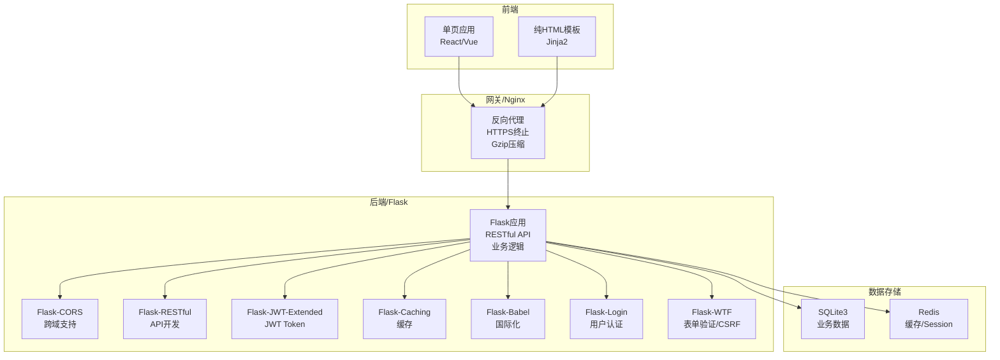
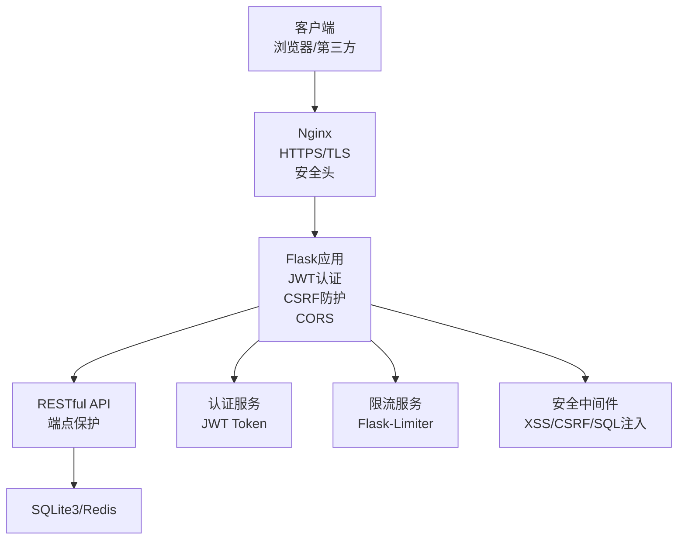
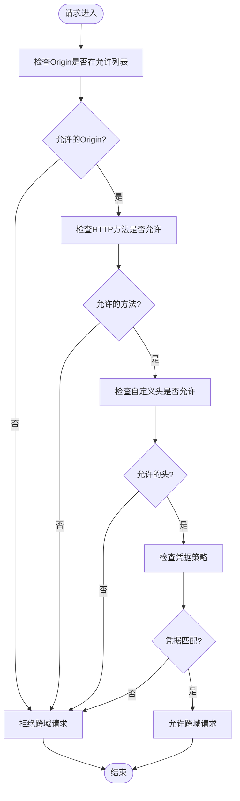
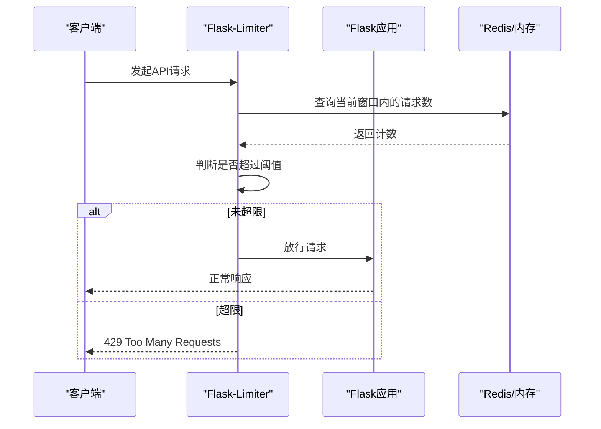
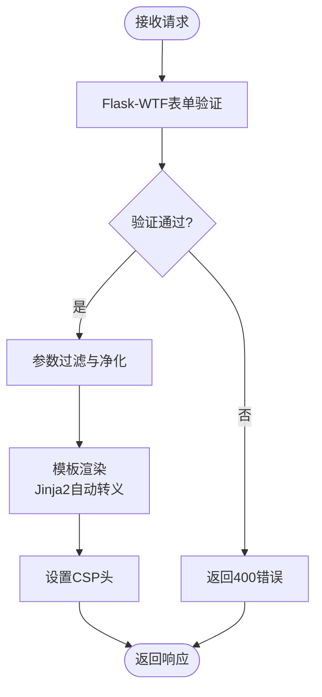
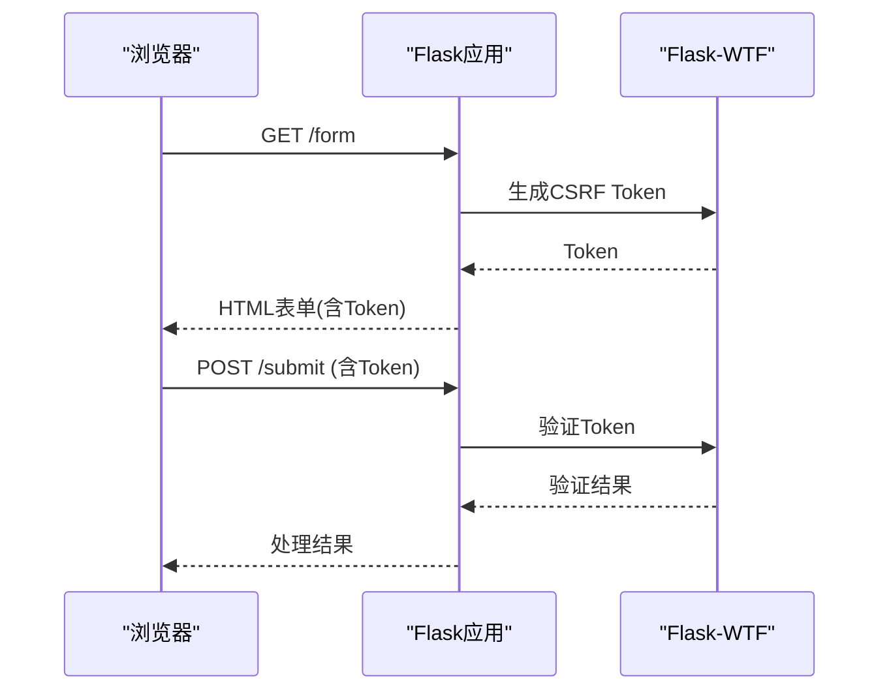
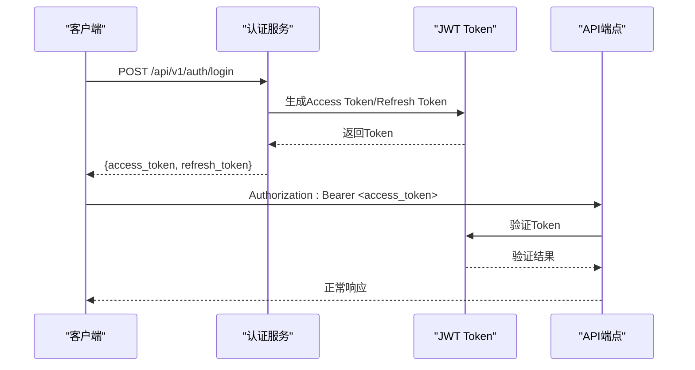
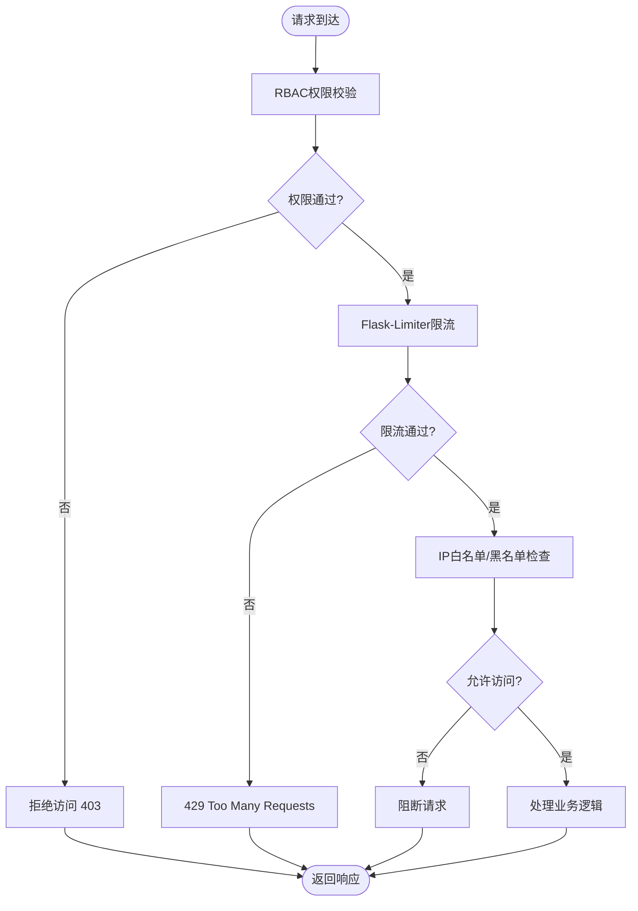
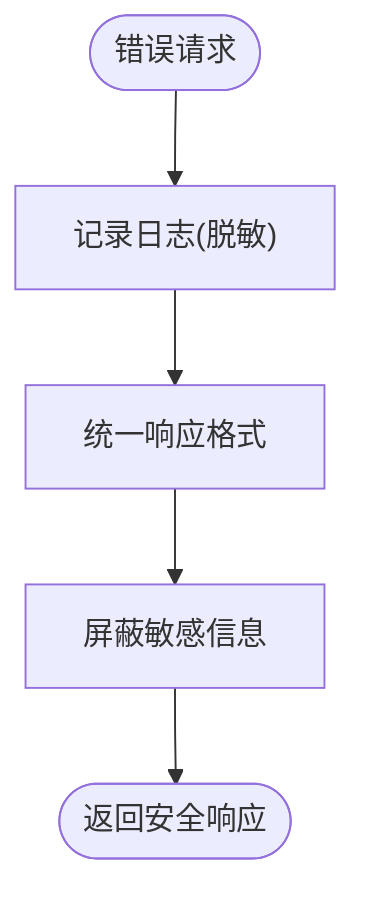
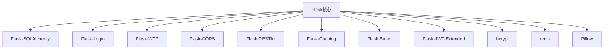

# API安全

<cite>
**本文档引用的文件**
- [企业网站CMS系统开发需求文档.ini](file://企业网站CMS系统开发需求文档.ini)
- [企业网站CMS系统详细需求文档.md](file://企业网站CMS系统详细需求文档.md)
</cite>

## 目录
1. [简介](#简介)
2. [项目结构](#项目结构)
3. [核心组件](#核心组件)
4. [架构总览](#架构总览)
5. [详细组件分析](#详细组件分析)
6. [依赖分析](#依赖分析)
7. [性能考量](#性能考量)
8. [故障排除指南](#故障排除指南)
9. [结论](#结论)
10. [附录](#附录)

## 简介
本文件面向企业网站CMS系统的RESTful API安全实现，结合项目需求文档中的技术栈与安全要求，系统阐述CORS配置、跨域请求安全、API访问频率限制、输入验证与输出编码、CSRF防护、Token验证、请求签名验证、端点访问控制、速率限制与IP黑白名单、错误信息处理与敏感数据防护、API版本控制安全策略，并提供安全测试方法、漏洞扫描与渗透测试建议。文档旨在帮助开发者与运维人员建立完善的API安全体系，确保系统在部署与运行过程中的安全性与稳定性。

## 项目结构
本项目采用前后端分离架构，后端基于Flask提供RESTful API，前端可选React/Vue或纯HTML模板渲染，Nginx作为反向代理与静态资源服务，数据库采用SQLite3，高并发场景可选Redis缓存与Session存储。

**图表来源**
- [企业网站CMS系统详细需求文档.md](file://企业网站CMS系统详细需求文档.md#L22-L57)
- [企业网站CMS系统详细需求文档.md](file://企业网站CMS系统详细需求文档.md#L555-L594)

**章节来源**
- [企业网站CMS系统详细需求文档.md](file://企业网站CMS系统详细需求文档.md#L22-L57)
- [企业网站CMS系统详细需求文档.md](file://企业网站CMS系统详细需求文档.md#L555-L594)

## 核心组件
- CORS与跨域：使用Flask-CORS实现跨域资源共享，配置允许的来源、方法、头与凭据。
- 认证与授权：基于JWT Token的无状态认证，配合Flask-Login与Flask-RESTful实现端点保护与权限控制。
- 输入验证与输出编码：通过Flask-WTF进行表单验证与CSRF防护；模板渲染使用Jinja2自动转义防止XSS。
- API限流：使用Flask-Limiter实现基于IP与用户的访问频率限制。
- 文件上传安全：白名单校验、大小限制、随机化文件名、存储路径限制。
- 传输安全：HTTPS强制跳转、HSTS头、敏感数据加密。
- 错误处理与日志：统一响应格式、错误日志记录与审计日志。

**章节来源**
- [企业网站CMS系统详细需求文档.md](file://企业网站CMS系统详细需求文档.md#L1078-L1140)
- [企业网站CMS系统详细需求文档.md](file://企业网站CMS系统详细需求文档.md#L1232-L1322)

## 架构总览
下图展示了API安全在整体架构中的位置与交互关系，包括认证、授权、CORS、限流、CSRF防护与传输安全的关键节点。

**图表来源**
- [企业网站CMS系统详细需求文档.md](file://企业网站CMS系统详细需求文档.md#L1141-L1230)
- [企业网站CMS系统详细需求文档.md](file://企业网站CMS系统详细需求文档.md#L1232-L1322)

## 详细组件分析

### CORS配置与跨域请求安全
- 配置来源与方法：通过Flask-CORS启用并配置允许的来源、方法、头与凭据，避免使用通配符，优先指定可信域名。
- 安全要点：
  - 仅允许受信来源，避免使用“*”。
  - 对于携带凭据的请求，Origin不可为通配符。
  - 限制允许的方法与头，减少攻击面。
  - 结合Nginx安全头增强防护。

**图表来源**
- [企业网站CMS系统详细需求文档.md](file://企业网站CMS系统详细需求文档.md#L1287-L1289)

**章节来源**
- [企业网站CMS系统详细需求文档.md](file://企业网站CMS系统详细需求文档.md#L1287-L1289)

### API访问频率限制机制
- 限流策略：基于Flask-Limiter实现，支持按IP与用户维度限流，不同端点设置差异化阈值。
- 实施建议：
  - 匿名用户与登录用户区分限流阈值。
  - 对认证接口、搜索接口、文件上传接口设置更高阈值或更严格策略。
  - 使用Redis作为限流存储，支持多实例部署。

**图表来源**
- [企业网站CMS系统详细需求文档.md](file://企业网站CMS系统详细需求文档.md#L1130-L1135)

**章节来源**
- [企业网站CMS系统详细需求文档.md](file://企业网站CMS系统详细需求文档.md#L1130-L1135)

### 输入验证策略、参数过滤与输出编码防止XSS
- 输入验证：使用Flask-WTF进行表单验证，结合字段类型、长度、格式与必填约束。
- 参数过滤：对查询参数与请求体进行白名单过滤，避免危险字符与结构。
- 输出编码与XSS防护：Jinja2模板默认自动转义，确保渲染内容安全；必要时手动转义或使用CSP头。

**图表来源**
- [企业网站CMS系统详细需求文档.md](file://企业网站CMS系统详细需求文档.md#L1106-L1110)
- [企业网站CMS系统详细需求文档.md](file://企业网站CMS系统详细需求文档.md#L1111-L1115)

**章节来源**
- [企业网站CMS系统详细需求文档.md](file://企业网站CMS系统详细需求文档.md#L1106-L1115)

### CSRF防护机制
- CSRF Token：使用Flask-WTF生成与验证CSRF Token，确保同源请求的合法性。
- Cookie策略：SameSite Cookie设置，减少跨站请求风险。
- 双重提交Cookie：结合CSRF Token与Cookie双重校验，提升防护强度。

**图表来源**
- [企业网站CMS系统详细需求文档.md](file://企业网站CMS系统详细需求文档.md#L1111-L1115)

**章节来源**
- [企业网站CMS系统详细需求文档.md](file://企业网站CMS系统详细需求文档.md#L1111-L1115)

### Token验证与请求签名验证
- JWT Token：Access Token与Refresh Token分离，分别设置有效期；Token存储于LocalStorage/Cookie，遵循安全策略。
- 请求签名：对关键API可引入请求签名机制（如HMAC），结合时间戳与随机数，防止重放与篡改。
- 会话管理：Redis存储Session，支持单点/多点登录配置与异常登录检测。

**图表来源**
- [企业网站CMS系统详细需求文档.md](file://企业网站CMS系统详细需求文档.md#L1082-L1087)
- [企业网站CMS系统详细需求文档.md](file://企业网站CMS系统详细需求文档.md#L1094-L1098)

**章节来源**
- [企业网站CMS系统详细需求文档.md](file://企业网站CMS系统详细需求文档.md#L1082-L1087)
- [企业网站CMS系统详细需求文档.md](file://企业网站CMS系统详细需求文档.md#L1094-L1098)

### API端点访问控制、速率限制与IP黑白名单管理
- 端点访问控制：基于RBAC模型，使用装饰器实现模块级与操作级权限控制。
- 速率限制：结合Flask-Limiter与Redis，实现IP与用户维度的精细化限流。
- IP黑白名单：在Nginx或应用层实现IP白名单/黑名单，阻断恶意来源。

**图表来源**
- [企业网站CMS系统详细需求文档.md](file://企业网站CMS系统详细需求文档.md#L1130-L1135)
- [企业网站CMS系统详细需求文档.md](file://企业网站CMS系统详细需求文档.md#L1078-L1098)

**章节来源**
- [企业网站CMS系统详细需求文档.md](file://企业网站CMS系统详细需求文档.md#L1078-L1098)
- [企业网站CMS系统详细需求文档.md](file://企业网站CMS系统详细需求文档.md#L1130-L1135)

### 错误信息处理、敏感数据暴露防护与API版本控制安全策略
- 错误信息处理：统一响应格式，避免泄露内部错误细节；敏感信息在日志中脱敏。
- 敏感数据防护：密码使用bcrypt加密存储；传输层强制HTTPS；对数据库连接与Redis连接进行加密。
- API版本控制：通过URL前缀与Accept头实现版本隔离，确保向后兼容与安全升级。

**图表来源**
- [企业网站CMS系统详细需求文档.md](file://企业网站CMS系统详细需求文档.md#L942-L983)
- [企业网站CMS系统详细需求文档.md](file://企业网站CMS系统详细需求文档.md#L1123-L1127)

**章节来源**
- [企业网站CMS系统详细需求文档.md](file://企业网站CMS系统详细需求文档.md#L942-L983)
- [企业网站CMS系统详细需求文档.md](file://企业网站CMS系统详细需求文档.md#L1123-L1127)

## 依赖分析
- Flask生态：Flask-SQLAlchemy、Flask-Migrate、Flask-Login、Flask-WTF、Flask-CORS、Flask-RESTful、Flask-Caching、Flask-Babel、Flask-JWT-Extended。
- 安全与性能：bcrypt、Pillow、python-dotenv、requests、redis（可选）。
- 部署与监控：Nginx、Gunicorn/Waitress、日志与监控工具。

**图表来源**
- [企业网站CMS系统详细需求文档.md](file://企业网站CMS系统详细需求文档.md#L555-L594)
- [企业网站CMS系统详细需求文档.md](file://企业网站CMS系统详细需求文档.md#L1304-L1322)

**章节来源**
- [企业网站CMS系统详细需求文档.md](file://企业网站CMS系统详细需求文档.md#L555-L594)
- [企业网站CMS系统详细需求文档.md](file://企业网站CMS系统详细需求文档.md#L1304-L1322)

## 性能考量
- 缓存策略：Redis缓存页面与查询结果，避免热点数据重复计算。
- 压缩与CDN：Nginx启用Gzip压缩与静态资源CDN，降低带宽与延迟。
- 数据库优化：合理索引、避免N+1查询、连接池配置与慢查询日志。
- 限流与降级：在高并发场景启用限流与优雅降级，保障核心功能可用。

[本节为通用指导，无需特定文件引用]

## 故障排除指南
- CORS错误：检查Flask-CORS配置，确保Origin、Methods、Headers与Credentials正确设置。
- JWT认证失败：核对Token有效期、签名算法与密钥一致性；检查刷新Token流程。
- CSRF校验失败：确认表单中CSRF Token存在且未过期；SameSite Cookie设置是否正确。
- 限流误伤：调整阈值与窗口大小，区分匿名与登录用户；检查Redis存储状态。
- 文件上传失败：检查文件类型白名单、大小限制与存储路径权限。

**章节来源**
- [企业网站CMS系统详细需求文档.md](file://企业网站CMS系统详细需求文档.md#L1232-L1322)
- [企业网站CMS系统详细需求文档.md](file://企业网站CMS系统详细需求文档.md#L1130-L1135)

## 结论
本API安全文档基于Flask生态与项目需求，系统化梳理了CORS、跨域安全、限流、输入验证、XSS防护、CSRF、JWT认证、请求签名、访问控制、IP黑白名单、错误处理与敏感数据防护、API版本控制等关键环节。建议在开发与运维实践中严格执行上述策略，并结合持续的安全测试与渗透评估，确保系统在上线与长期运行中的安全性与稳定性。

[本节为总结性内容，无需特定文件引用]

## 附录
- 安全测试方法：单元测试覆盖关键函数；集成测试验证端到端流程；压力测试评估限流与缓存效果；渗透测试模拟真实攻击场景。
- 漏洞扫描：定期使用静态分析工具（如bandit、semgrep）与动态扫描工具（如OWASP ZAP）识别潜在漏洞。
- 漏洞修复与应急响应：建立漏洞分级与修复时限；制定应急响应预案与回滚策略；持续监控与告警。

[本节为通用指导，无需特定文件引用]