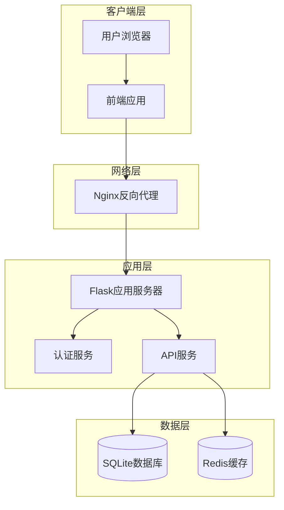
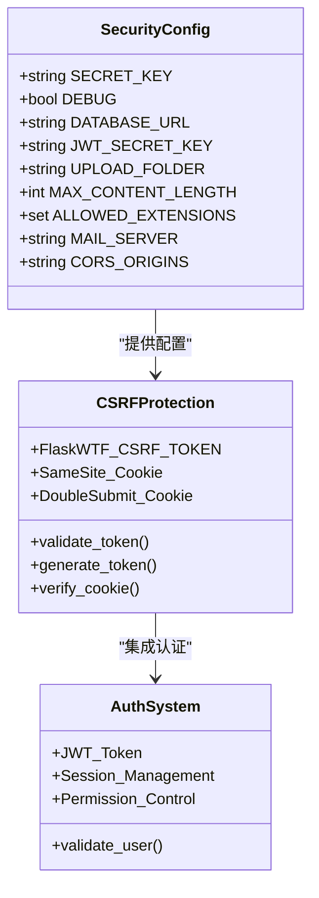
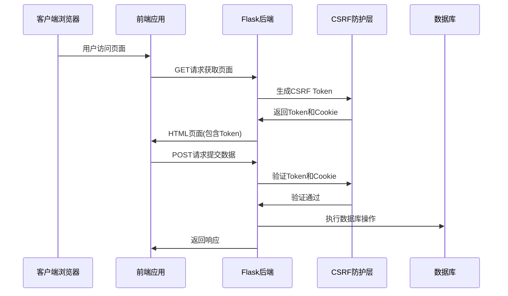
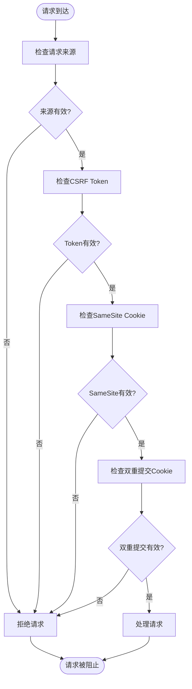
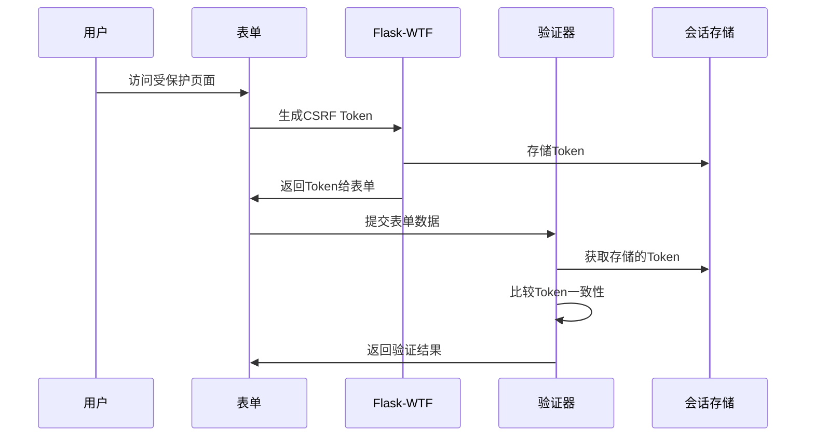
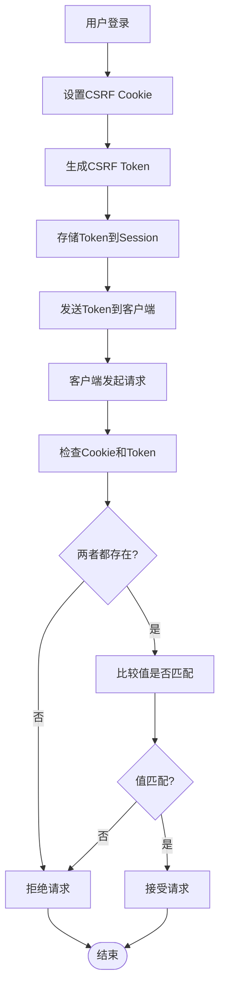
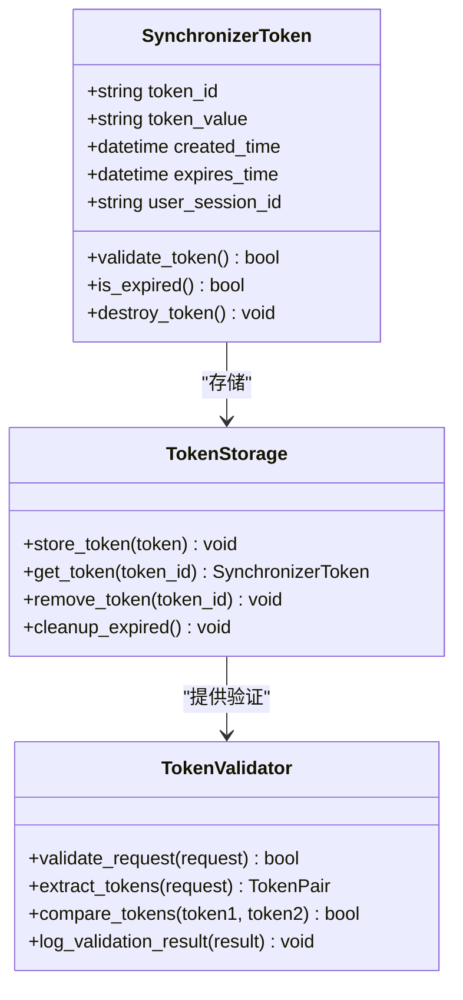
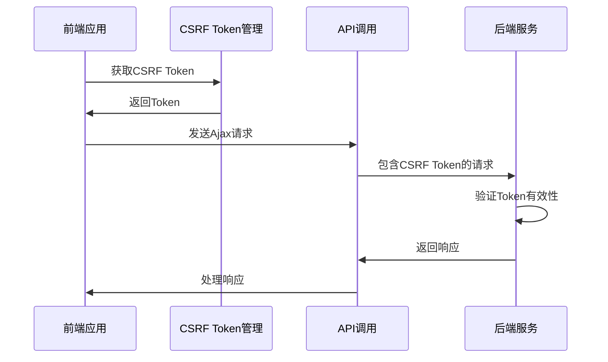
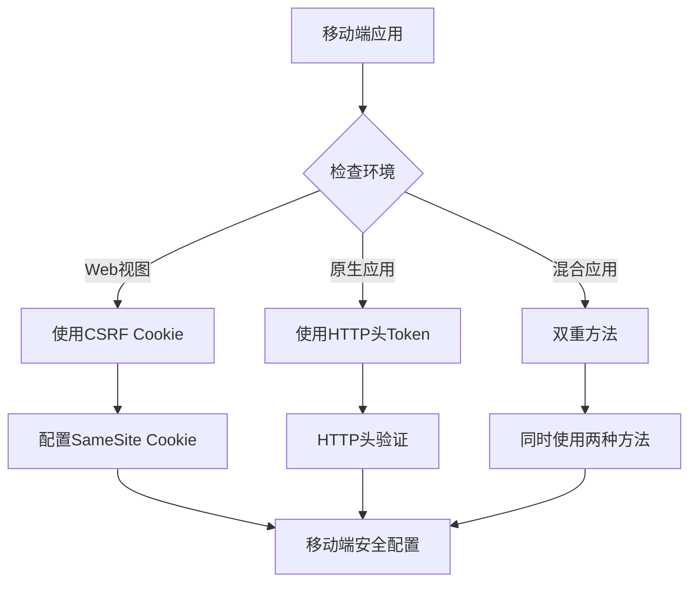
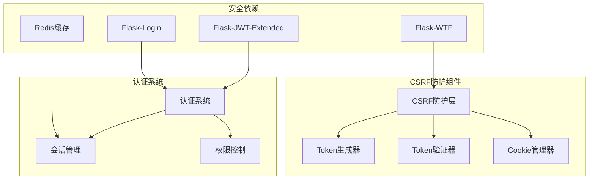

# CSRF跨站请求伪造防护

<cite>
**本文档引用的文件**
- [企业网站CMS系统开发需求文档.ini](file://企业网站CMS系统开发需求文档.ini)
- [企业网站CMS系统详细需求文档.md](file://企业网站CMS系统详细需求文档.md)
- [开发计划表_2月4日-2月12日.md](file://开发计划表_2月4日-2月12日.md)
</cite>

## 目录
1. [简介](#简介)
2. [项目结构](#项目结构)
3. [核心组件](#核心组件)
4. [架构概览](#架构概览)
5. [详细组件分析](#详细组件分析)
6. [依赖关系分析](#依赖关系分析)
7. [性能考虑](#性能考虑)
8. [故障排除指南](#故障排除指南)
9. [结论](#结论)

## 简介

CSRF（跨站请求伪造）是一种常见的Web安全漏洞，攻击者通过诱使已通过身份验证的用户执行非预期的操作。本文档基于企业CMS系统的安全需求，详细阐述了CSRF防护的实现策略，包括双重提交Cookie策略和同步令牌模式的完整实现方案。

## 项目结构

基于项目文档分析，企业CMS系统采用前后端分离架构，后端使用Python Flask框架，前端使用React/Vue技术栈。系统整体架构如下：

**图表来源**
- [企业网站CMS系统详细需求文档.md](file://企业网站CMS系统详细需求文档.md#L28-L57)

**章节来源**
- [企业网站CMS系统详细需求文档.md](file://企业网站CMS系统详细需求文档.md#L22-L57)
- [开发计划表_2月4日-2月12日.md](file://开发计划表_2月4日-2月12日.md#L92-L105)

## 核心组件

### CSRF防护策略

根据项目需求文档，系统采用多重CSRF防护策略：

1. **Flask-WTF CSRF Token**
2. **SameSite Cookie**
3. **双重提交Cookie策略**

### 安全配置

系统配置文件中包含了相关的安全配置项：

**图表来源**
- [企业网站CMS系统详细需求文档.md](file://企业网站CMS系统详细需求文档.md#L1234-L1301)

**章节来源**
- [企业网站CMS系统详细需求文档.md](file://企业网站CMS系统详细需求文档.md#L1111-L1114)
- [企业网站CMS系统详细需求文档.md](file://企业网站CMS系统详细需求文档.md#L1234-L1301)

## 架构概览

### CSRF防护架构

**图表来源**
- [企业网站CMS系统详细需求文档.md](file://企业网站CMS系统详细需求文档.md#L1111-L1114)

### 多重防护机制

**图表来源**
- [企业网站CMS系统详细需求文档.md](file://企业网站CMS系统详细需求文档.md#L1111-L1114)

## 详细组件分析

### Flask-WTF CSRF Token实现

#### Token生成机制

Flask-WTF提供了自动化的CSRF保护机制，系统将采用以下实现策略：

1. **Token生成**: 在用户会话建立时生成唯一CSRF Token
2. **Token存储**: Token存储在用户的Session中
3. **Token传输**: Token通过隐藏表单字段或HTTP头传输
4. **Token验证**: 服务器端验证Token的有效性和匹配性

#### Token验证流程

**图表来源**
- [企业网站CMS系统详细需求文档.md](file://企业网站CMS系统详细需求文档.md#L1111-L1114)

### 双重提交Cookie策略

#### Cookie设置机制

双重提交Cookie策略通过以下步骤实现：

1. **Cookie设置**: 服务器在用户登录时设置CSRF Cookie
2. **Token生成**: 服务器生成CSRF Token并与Cookie关联
3. **客户端存储**: 客户端存储CSRF Cookie和Token
4. **请求验证**: 客户端在请求中同时包含Cookie和Token

#### 验证流程

**图表来源**
- [企业网站CMS系统详细需求文档.md](file://企业网站CMS系统详细需求文档.md#L1111-L1114)

### 同步令牌模式(Synchronizer Token Pattern)

#### Token生命周期管理

同步令牌模式包含以下关键组件：

1. **Token生成**: 基于随机数和时间戳生成唯一Token
2. **Token存储**: Token存储在服务器端Session中
3. **Token传播**: Token通过表单隐藏字段传播
4. **Token验证**: 服务器端验证Token的完整性和时效性

#### 安全特性

**图表来源**
- [企业网站CMS系统详细需求文档.md](file://企业网站CMS系统详细需求文档.md#L1111-L1114)

**章节来源**
- [企业网站CMS系统详细需求文档.md](file://企业网站CMS系统详细需求文档.md#L1111-L1114)

### HTTP方法安全处理

#### GET请求处理

对于GET请求，系统采用以下安全策略：
- GET请求通常不修改状态，但仍需CSRF保护
- 通过SameSite Cookie防止跨站请求
- 对敏感GET操作实施额外验证

#### POST请求处理

POST请求是最常见的CSRF攻击目标：
- 必须包含有效的CSRF Token
- 验证请求来源和Referer头
- 实施速率限制防止暴力攻击

#### PUT/DELETE请求处理

PUT和DELETE请求同样需要CSRF保护：
- 使用双重提交Cookie策略
- 验证Token与Cookie的一致性
- 实施严格的权限验证

### Ajax请求CSRF防护

#### 前端实现策略

**图表来源**
- [企业网站CMS系统详细需求文档.md](file://企业网站CMS系统详细需求文档.md#L1111-L1114)

#### 后端实现策略

后端需要：
- 自动提取Ajax请求中的CSRF Token
- 支持自定义HTTP头传递Token
- 实施统一的CSRF验证中间件

### 移动端应用安全配置

#### 移动端特殊考虑

移动端应用面临独特的CSRF挑战：
- 移动应用可能缺少Cookie支持
- 移动浏览器的SameSite Cookie行为不同
- 移动应用可能使用不同的认证机制

#### 解决方案

**图表来源**
- [企业网站CMS系统详细需求文档.md](file://企业网站CMS系统详细需求文档.md#L1111-L1114)

## 依赖关系分析

### 安全组件依赖

**图表来源**
- [企业网站CMS系统详细需求文档.md](file://企业网站CMS系统详细需求文档.md#L557-L567)
- [企业网站CMS系统详细需求文档.md](file://企业网站CMS系统详细需求文档.md#L1111-L1114)

**章节来源**
- [企业网站CMS系统详细需求文档.md](file://企业网站CMS系统详细需求文档.md#L557-L567)
- [企业网站CMS系统详细需求文档.md](file://企业网站CMS系统详细需求文档.md#L1111-L1114)

## 性能考虑

### CSRF验证性能影响

CSRF防护对系统性能的影响相对较小，主要体现在：

1. **Token生成开销**: 微秒级别的随机数生成
2. **Token验证开销**: 基本的字符串比较操作
3. **内存使用**: Token存储在Session中，内存占用有限

### 优化策略

- 使用Redis缓存CSRF Token
- 实施Token过期机制减少内存占用
- 对高频请求实施Token复用策略

## 故障排除指南

### 常见CSRF问题

#### Token验证失败

**症状**: 用户提交表单时收到CSRF验证错误

**解决方案**:
1. 检查Token是否正确传递到服务器
2. 验证Token是否在有效期内
3. 确认用户会话状态正常

#### Cookie问题

**症状**: SameSite Cookie导致的跨站请求被阻止

**解决方案**:
1. 检查浏览器对SameSite Cookie的支持
2. 验证Cookie的Domain和Path设置
3. 确认HTTPS环境下的Cookie安全标志

#### Ajax请求失败

**症状**: Ajax请求被CSRF防护阻止

**解决方案**:
1. 确保CSRF Token正确附加到请求头
2. 检查CORS配置是否允许CSRF Token传递
3. 验证请求头名称是否符合预期

**章节来源**
- [企业网站CMS系统详细需求文档.md](file://企业网站CMS系统详细需求文档.md#L1111-L1114)

## 结论

企业CMS系统的CSRF防护采用了多层次的安全策略，包括Flask-WTF CSRF Token、SameSite Cookie和双重提交Cookie机制。这种综合性的防护方案能够有效抵御各种类型的CSRF攻击，同时保持系统的可用性和性能。

通过实施这些安全措施，系统能够在保证用户体验的同时，提供强大的安全保护，满足企业级应用的安全需求。建议在实际部署中定期审查和更新安全配置，以应对不断演进的网络安全威胁。