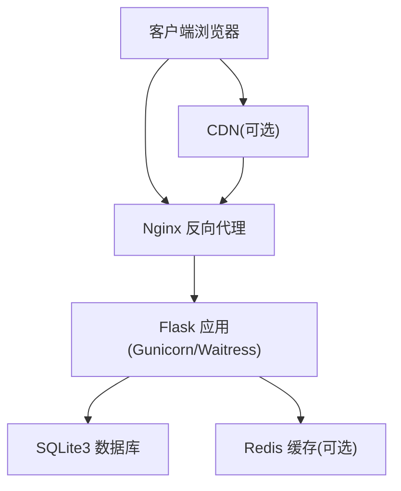
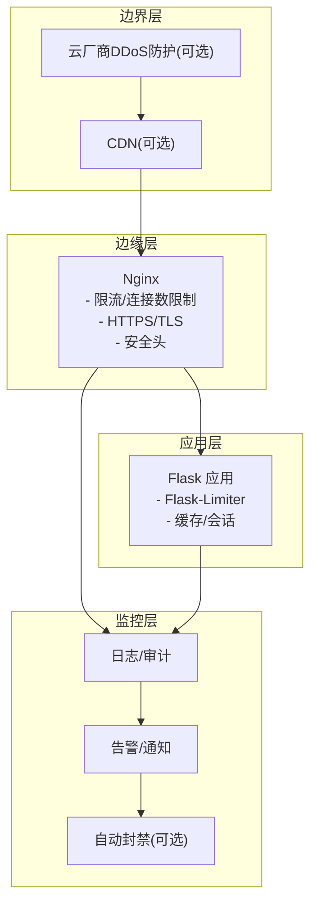
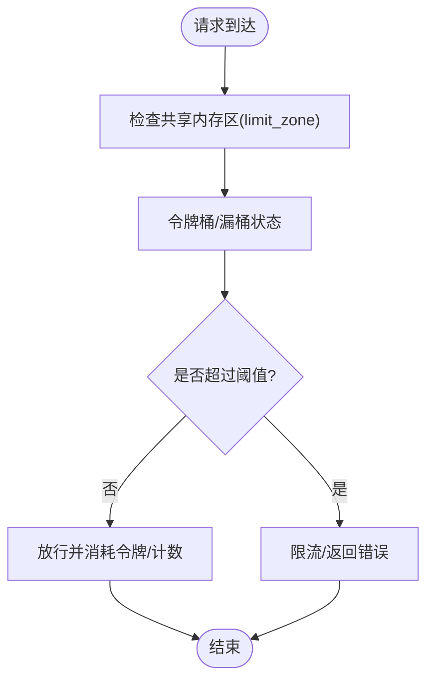
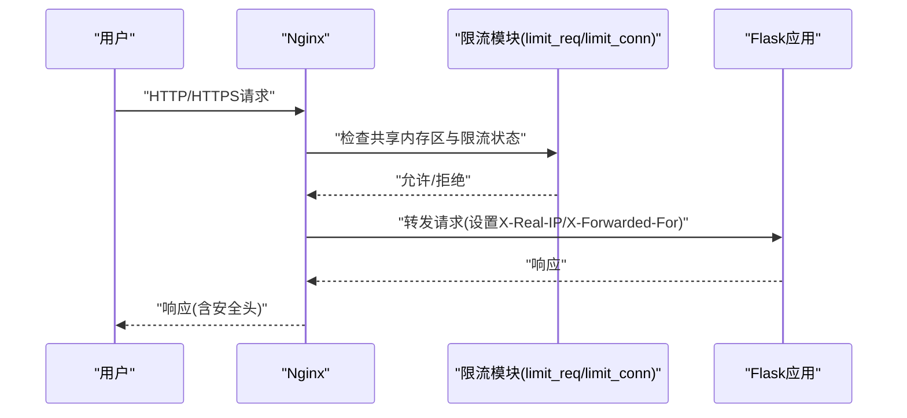
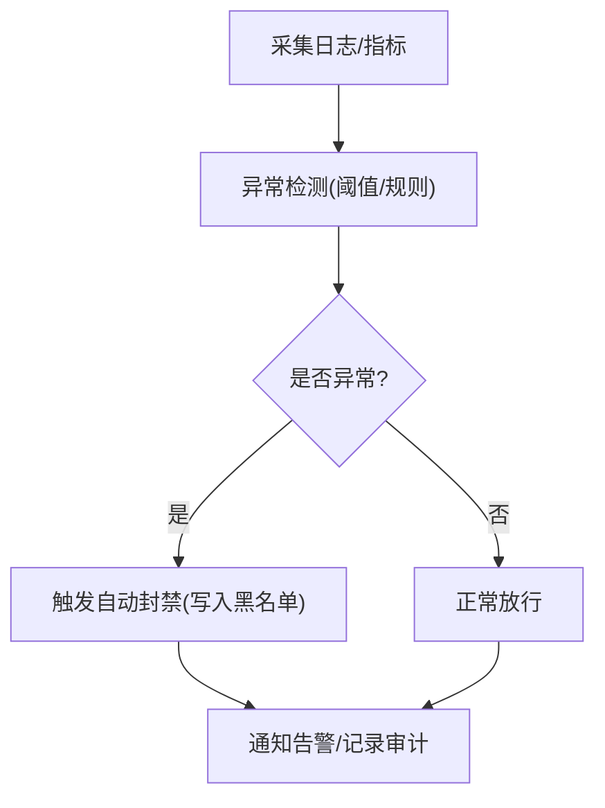
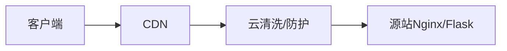
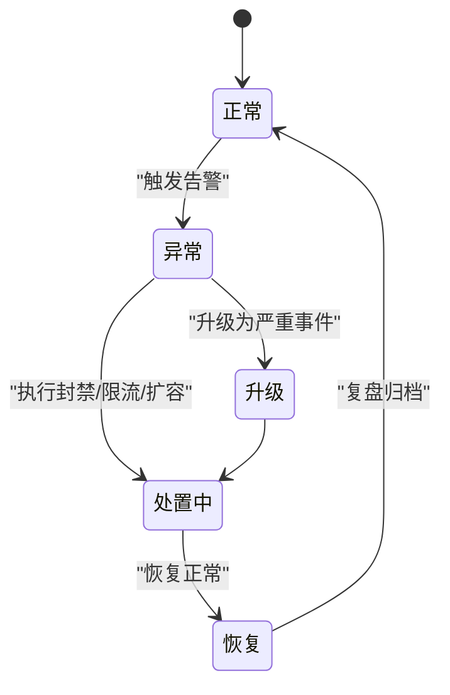
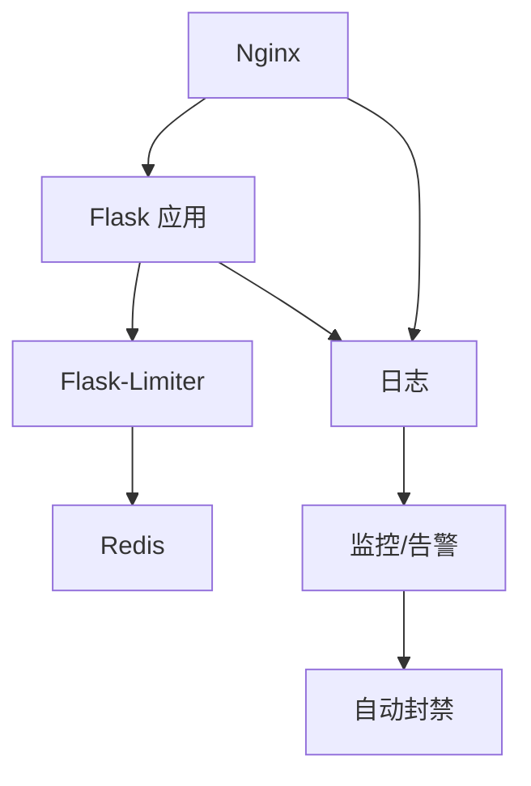

# DDoS分布式拒绝服务攻击防护

<cite>
**本文引用的文件**
- [企业网站CMS系统开发需求文档.ini](file://企业网站CMS系统开发需求文档.ini)
- [企业网站CMS系统详细需求文档.md](file://企业网站CMS系统详细需求文档.md)
</cite>

## 目录
1. [简介](#简介)
2. [项目结构](#项目结构)
3. [核心组件](#核心组件)
4. [架构总览](#架构总览)
5. [详细组件分析](#详细组件分析)
6. [依赖分析](#依赖分析)
7. [性能考量](#性能考量)
8. [故障排查指南](#故障排查指南)
9. [结论](#结论)
10. [附录](#附录)

## 简介
本文件面向企业网站CMS系统的DDoS防护主题，结合现有项目文档中的技术栈与部署架构，系统化梳理DDoS攻击类型与特点、请求频率限制实现方案、负载均衡与反向代理配置要点、异常流量检测与自动封禁机制、CDN与云厂商防护集成思路，以及监控告警与应急响应流程。文档旨在帮助非专业读者理解DDoS防护的关键环节，并为后续工程落地提供可执行的参考路径。

## 项目结构
- 技术栈与部署环境
  - 后端：Python Flask + WSGI服务器（Gunicorn/Waitress）
  - 反向代理：Nginx
  - 操作系统：Windows Server
  - 数据库：SQLite3（默认），Redis可选
- 架构示意（概念性）
  - 客户端浏览器通过Nginx反向代理访问Flask应用；静态资源与媒体文件由Nginx提供；CDN可前置于Nginx以减轻源站压力。

**章节来源**
- file://企业网站CMS系统详细需求文档.md#L22-L57
- file://企业网站CMS系统详细需求文档.md#L629-L659

## 核心组件
- 反向代理与负载均衡（Nginx）
  - 提供HTTPS终止、静态资源服务、Gzip压缩、安全头设置、上游Flask应用代理、可选负载均衡。
- API访问频率限制（Flask-Limiter）
  - 基于IP与用户维度的限流，支持不同接口差异化限流策略。
- CDN与静态资源加速
  - 静态资源与媒体文件通过CDN分发，降低源站带宽与CPU压力。
- 安全基线
  - HTTPS强制跳转、CSP、X-Frame-Options、X-Content-Type-Options、X-XSS-Protection等安全头。
- 监控与告警
  - Nginx访问/错误日志、Flask日志、可选Sentry错误追踪、外部监控平台。

**章节来源**
- file://企业网站CMS系统详细需求文档.md#L1143-L1230
- file://企业网站CMS系统详细需求文档.md#L1128-L1140
- file://企业网站CMS系统详细需求文档.md#L1381-L1423

## 架构总览
- DDoS防护分层
  - 边界层：CDN/云厂商DDoS清洗与黑洞路由
  - 边缘层：Nginx限流、速率限制、连接数限制、安全头
  - 应用层：Flask-Limiter限流、Redis缓存、慢查询优化
  - 监控层：日志聚合、阈值告警、自动化封禁联动

**图表来源**
- [企业网站CMS系统详细需求文档.md](file://企业网站CMS系统详细需求文档.md#L1143-L1230)
- [企业网站CMS系统详细需求文档.md](file://企业网站CMS系统详细需求文档.md#L1128-L1140)

## 详细组件分析

### DDoS攻击类型与特点
- SYN Flood
  - 特点：大量半连接请求耗尽服务器半连接队列与内存，导致合法连接无法建立。
  - 防护要点：网络层限速、SYN Cookie、缩短半连接超时、云厂商黑洞路由。
- UDP Flood
  - 特点：高频UDP报文（DNS反射、NTP放大、SNMP等）消耗带宽与处理能力。
  - 防护要点：UDP端口限速、ACL过滤、CDN/云清洗、黑洞路由。
- HTTP Flood
  - 特点：针对HTTP协议的请求洪泛，模拟真实用户行为，难以与正常流量区分。
  - 防护要点：基于IP/会话的速率限制、验证码/挑战、WAF/云防护、CDN缓存静态资源。

[本节为概念性说明，不直接分析具体文件]

### 请求频率限制实现方案
- 基于IP的限流算法
  - 滑动窗口计数：以固定时间窗口统计请求次数，超过阈值则限流。
  - 漏桶算法：固定出水速率，突发请求进入桶中，溢出则丢弃或排队。
  - 令牌桶算法：以固定速率向桶中投放令牌，请求消耗令牌，令牌不足则限流。
- 在Flask中的实践
  - 使用Flask-Limiter实现基于IP与用户维度的限流，支持不同接口差异化配置。
  - 结合Redis作为限流状态存储，实现跨进程/跨实例一致性。
- 在Nginx中的实践
  - limit_req：基于共享内存的漏桶/令牌桶模型，支持突发与平滑。
  - limit_conn：限制同一客户端的并发连接数，缓解资源耗尽。
  - limit_zone：定义共享内存区，配合limit_req/limit_conn使用。

**图表来源**
- [企业网站CMS系统详细需求文档.md](file://企业网站CMS系统详细需求文档.md#L1128-L1140)
- [企业网站CMS系统详细需求文档.md](file://企业网站CMS系统详细需求文档.md#L1143-L1230)

**章节来源**
- file://企业网站CMS系统详细需求文档.md#L1128-L1140
- file://企业网站CMS系统详细需求文档.md#L1143-L1230

### 负载均衡与反向代理的DDoS防护配置
- Nginx配置要点
  - HTTPS终止与TLS版本/套件配置，启用HSTS（可选）。
  - 安全头：X-Frame-Options、X-Content-Type-Options、X-XSS-Protection。
  - 限流与连接数限制：limit_req与limit_conn，结合limit_zone。
  - 静态资源与媒体文件的缓存与压缩，减少后端压力。
  - 上游Flask应用代理，设置必要的转发头。
- 负载均衡
  - upstream块配置多个后端实例，Nginx轮询或加权轮询。
  - 结合健康检查（可由外部服务提供），实现故障隔离与自动摘除。

**图表来源**
- [企业网站CMS系统详细需求文档.md](file://企业网站CMS系统详细需求文档.md#L1143-L1230)

**章节来源**
- file://企业网站CMS系统详细需求文档.md#L1143-L1230

### 异常流量检测与自动封禁机制
- 异常检测
  - 基于Nginx访问日志与错误日志的统计分析（QPS、错误率、IP分布、UA异常）。
  - 结合Flask应用日志与Redis缓存命中率异常。
- 自动封禁
  - 基于IP黑名单：Nginx geo/geoip模块或外部防火墙/云WAF。
  - 动态阻断策略：当某IP短时间请求量超过阈值或错误率异常升高，触发临时封禁（如加入iptables/云WAF规则）。
  - 与监控告警联动：阈值触发后自动调用封禁脚本或API。
- 黑名单管理
  - 集中式存储：Redis Hash或数据库表，记录封禁原因、时间、策略。
  - 生命周期管理：到期自动解封或手动解封。

**图表来源**
- [企业网站CMS系统详细需求文档.md](file://企业网站CMS系统详细需求文档.md#L1381-L1423)

**章节来源**
- file://企业网站CMS系统详细需求文档.md#L1381-L1423

### CDN服务的DDoS防护配置与云厂商防护集成
- CDN防护
  - 静态资源与媒体文件走CDN，减少源站暴露面与带宽消耗。
  - CDN缓存热点资源，降低后端压力。
  - CDN回源鉴权与访问控制，防止恶意爬取。
- 云厂商防护
  - 云WAF/DDoS防护：启用DDoS清洗、黑洞路由、弹性带宽扩容。
  - 与CDN联动：CDN作为第一道防线，云清洗作为第二道防线。
  - API密钥与轮换：第三方服务API Key加密存储与定期轮换。

**图表来源**
- [企业网站CMS系统详细需求文档.md](file://企业网站CMS系统详细需求文档.md#L1143-L1230)
- [企业网站CMS系统详细需求文档.md](file://企业网站CMS系统详细需求文档.md#L1136-L1140)

**章节来源**
- file://企业网站CMS系统详细需求文档.md#L1143-L1230
- file://企业网站CMS系统详细需求文档.md#L1136-L1140

### 监控告警系统与应急响应流程
- 监控指标
  - 服务状态、QPS、错误率、响应时间、连接数、带宽、磁盘空间、CPU/内存。
  - 日志采集：Nginx访问/错误日志、Flask应用日志、系统日志。
- 告警策略
  - 阈值告警：QPS突增、错误率异常、连接数上限、磁盘空间不足。
  - 通知渠道：邮件、短信、IM机器人。
- 应急响应
  - 预案分级：轻微、一般、严重、重大。
  - 处置步骤：限流/封禁、扩容、回滚、降级、上报。
  - 记录与复盘：事件记录、根因分析、改进措施。

**图表来源**
- [企业网站CMS系统详细需求文档.md](file://企业网站CMS系统详细需求文档.md#L1417-L1423)

**章节来源**
- file://企业网站CMS系统详细需求文档.md#L1417-L1423

## 依赖分析
- 组件耦合
  - Nginx与Flask：通过反向代理连接，Nginx承担限流与安全头，Flask专注业务。
  - Flask-Limiter与Redis：限流状态共享，支持多实例部署。
  - 日志与监控：统一采集与分析，支撑自动封禁与告警。
- 外部依赖
  - CDN/云厂商防护：作为边界层防护，降低源站压力。
  - WAF：可选，与Nginx限流互补。

**图表来源**
- [企业网站CMS系统详细需求文档.md](file://企业网站CMS系统详细需求文档.md#L1143-L1230)
- [企业网站CMS系统详细需求文档.md](file://企业网站CMS系统详细需求文档.md#L1128-L1140)

**章节来源**
- file://企业网站CMS系统详细需求文档.md#L1143-L1230
- file://企业网站CMS系统详细需求文档.md#L1128-L1140

## 性能考量
- 限流与缓存
  - 限流策略需兼顾用户体验与系统稳定性，避免过度限流导致误伤。
  - Redis缓存与页面缓存可显著降低数据库与CPU压力。
- 资源与容量规划
  - 根据并发用户与QPS目标评估带宽、实例数量与缓存容量。
  - CDN与云清洗可有效削峰填谷，降低峰值对源站的影响。

[本节提供一般性指导，不直接分析具体文件]

## 故障排查指南
- 常见问题定位
  - Nginx：检查访问/错误日志、限流命中率、上游健康状态。
  - Flask：检查应用日志、数据库连接、缓存命中率、限流状态。
  - Redis：检查连接数、内存使用、键空间。
- 快速处置
  - 临时提高限流阈值或临时放行白名单IP。
  - 启用CDN缓存静态资源，降低后端压力。
  - 触发自动封禁，阻断异常来源IP。
- 审计与溯源
  - 保留日志与告警记录，进行事件复盘与策略优化。

**章节来源**
- file://企业网站CMS系统详细需求文档.md#L1381-L1423

## 结论
本项目采用“边界层（CDN/云防护）+边缘层（Nginx限流/安全头）+应用层（Flask-Limiter/缓存）+监控层（日志/告警）”的多层防护体系，结合IP黑名单与动态阻断策略，可有效应对SYN Flood、UDP Flood与HTTP Flood等常见DDoS攻击。建议在生产环境中逐步启用各层防护，并持续优化限流阈值与告警策略，确保系统在高并发与异常流量下的稳定运行。

## 附录
- 相关配置参考路径
  - Nginx配置示例：[nginx.conf](file://企业网站CMS系统详细需求文档.md#L1143-L1230)
  - Flask-Limiter与限流策略：[API安全-访问频率限制](file://企业网站CMS系统详细需求文档.md#L1128-L1140)
  - 安全头与HTTPS：[Nginx配置示例](file://企业网站CMS系统详细需求文档.md#L1143-L1230)
  - 监控与告警：[安全要求-监控告警](file://企业网站CMS系统详细需求文档.md#L1417-L1423)