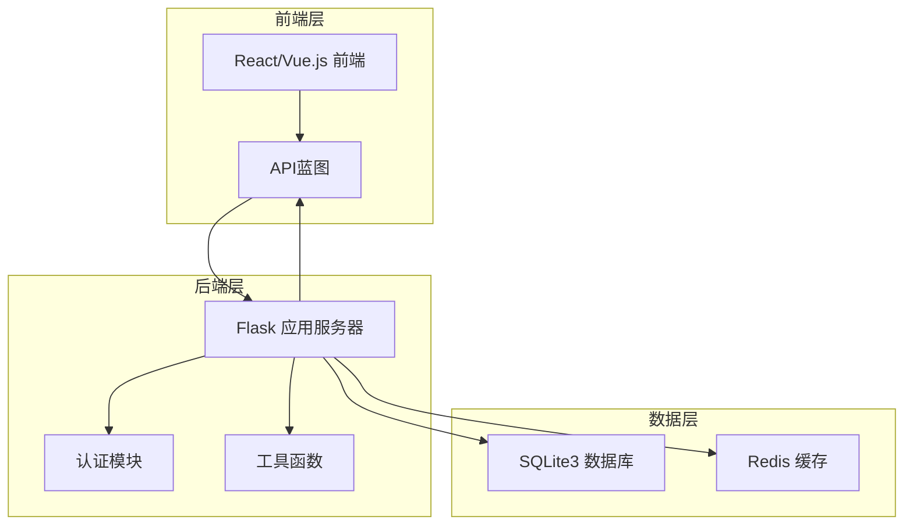
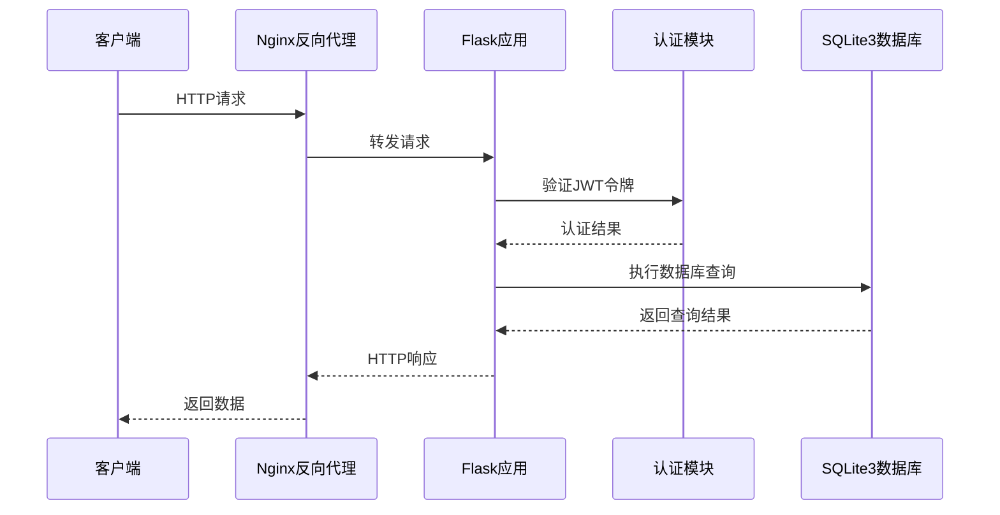
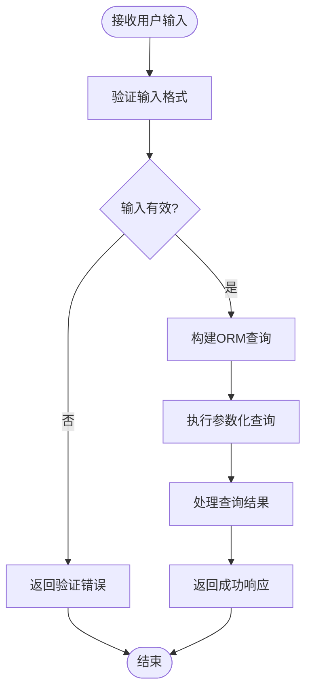
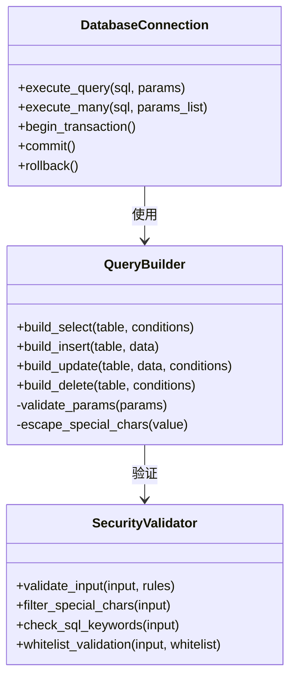
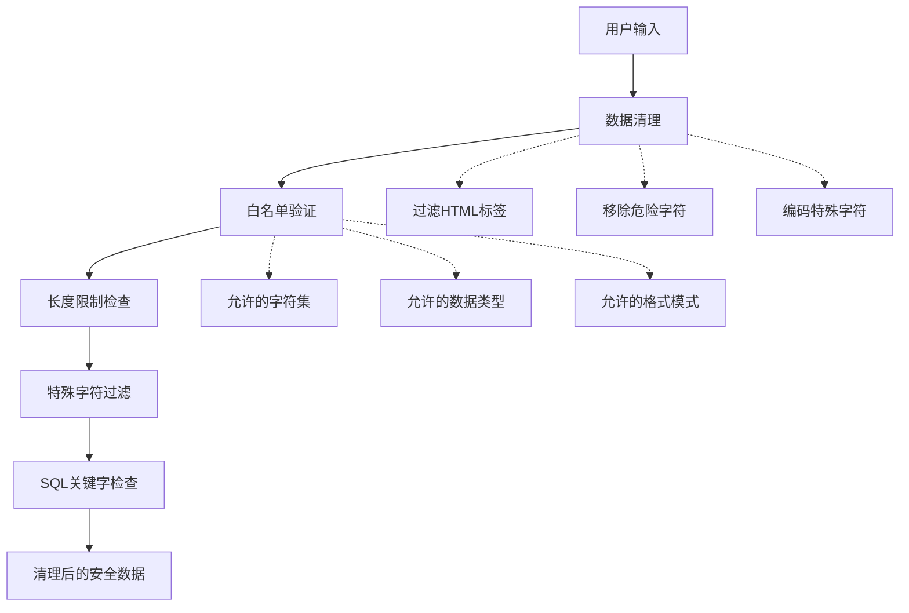
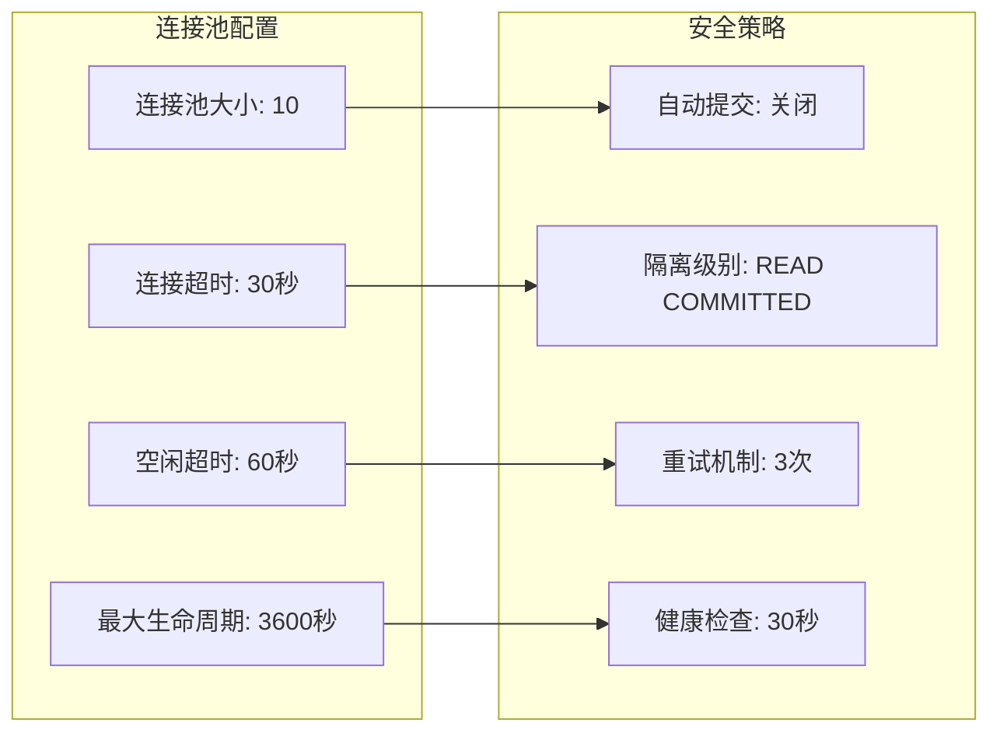
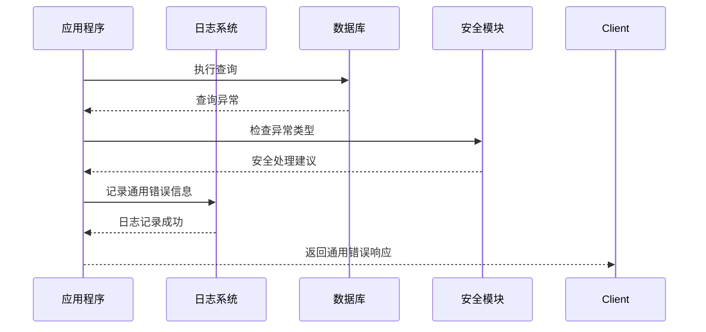
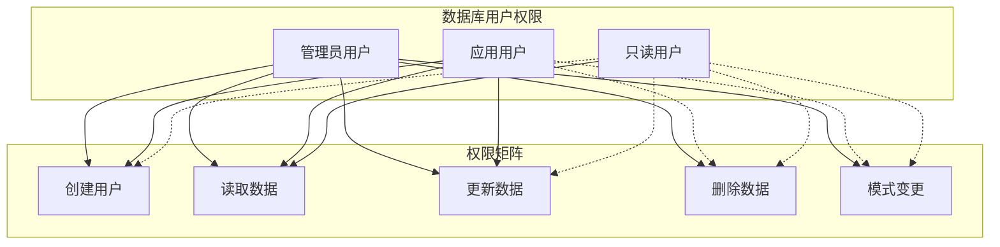
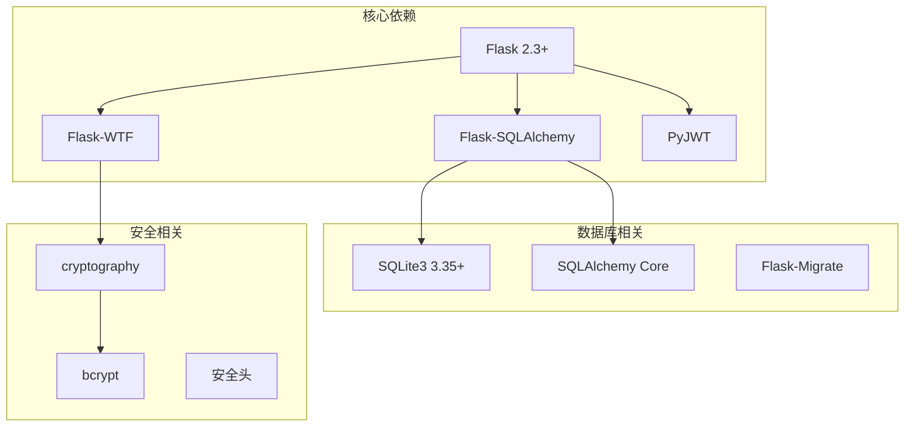

# SQL注入防护

<cite>
**本文档引用的文件**
- [企业网站CMS系统开发需求文档.ini](file://企业网站CMS系统开发需求文档.ini)
- [企业网站CMS系统详细需求文档.md](file://企业网站CMS系统详细需求文档.md)
- [开发计划表_2月4日-2月12日.md](file://开发计划表_2月4日-2月12日.md)
</cite>

## 目录
1. [简介](#简介)
2. [项目结构](#项目结构)
3. [核心组件](#核心组件)
4. [架构概览](#架构概览)
5. [详细组件分析](#详细组件分析)
6. [依赖关系分析](#依赖关系分析)
7. [性能考虑](#性能考虑)
8. [故障排除指南](#故障排除指南)
9. [结论](#结论)

## 简介

SQL注入是一种常见的网络安全漏洞，攻击者通过在应用程序的输入字段中插入恶意SQL代码来操纵数据库查询。这种攻击可能导致数据泄露、数据篡改、权限提升甚至完全控制系统。

本项目采用Python Flask + SQLite3技术栈，基于MVP（最小可行产品）理念，在8天紧凑开发周期内构建企业官网内容管理系统。由于项目规模相对较小且采用SQLite3作为数据库，SQL注入防护显得尤为重要。

## 项目结构

基于需求文档分析，本项目采用前后端分离架构：

**图表来源**
- [企业网站CMS系统详细需求文档.md](file://企业网站CMS系统详细需求文档.md#L22-L57)
- [开发计划表_2月4日-2月12日.md](file://开发计划表_2月4日-2月12日.md#L92-L105)

**章节来源**
- [企业网站CMS系统详细需求文档.md](file://企业网站CMS系统详细需求文档.md#L22-L57)
- [开发计划表_2月4日-2月12日.md](file://开发计划表_2月4日-2月12日.md#L92-L105)

## 核心组件

### 数据库连接与配置

项目采用SQLite3作为主要数据库，具有以下特点：
- 零配置部署，单文件数据库
- 支持ACID事务特性
- 适合中小规模应用场景
- 简化的备份和维护流程

### 认证与权限系统

系统实现基于角色的访问控制（RBAC）模型：
- 超级管理员：拥有所有权限
- 管理员：内容管理和用户管理
- 编辑：内容编辑权限
- 作者：创建和编辑自己的内容
- 访客：仅查看权限

### API架构

采用RESTful API设计，支持：
- JWT令牌认证
- 统一的请求响应格式
- 版本控制机制
- 错误处理和状态码标准化

**章节来源**
- [企业网站CMS系统详细需求文档.md](file://企业网站CMS系统详细需求文档.md#L555-L594)
- [开发计划表_2月4日-2月12日.md](file://开发计划表_2月4日-2月12日.md#L150-L174)

## 架构概览

**图表来源**
- [企业网站CMS系统详细需求文档.md](file://企业网站CMS系统详细需求文档.md#L44-L48)
- [开发计划表_2月4日-2月12日.md](file://开发计划表_2月4日-2月12日.md#L142-L157)

## 详细组件分析

### SQL注入攻击原理与防护策略

#### 攻击向量分析

SQL注入攻击主要通过以下途径发生：
1. **表单输入**：用户名、密码、搜索框
2. **URL参数**：ID、分类、页面参数
3. **Cookie数据**：会话信息、偏好设置
4. **HTTP头**：User-Agent、Referer等

#### 参数化查询实现

##### Flask-SQLAlchemy ORM查询

使用Flask-SQLAlchemy提供的ORM查询接口，自动实现参数化绑定：

**图表来源**
- [开发计划表_2月4日-2月12日.md](file://开发计划表_2月4日-2月12日.md#L160-L174)

##### 原生SQL安全写法

对于复杂查询，使用参数化查询防止注入：

**图表来源**
- [企业网站CMS系统详细需求文档.md](file://企业网站CMS系统详细需求文档.md#L714-L768)

#### 输入验证与数据清理

##### 白名单验证策略

实现严格的输入验证机制：

**图表来源**
- [开发计划表_2月4日-2月12日.md](file://开发计划表_2月4日-2月12日.md#L197-L212)

##### 长度限制与特殊字符过滤

- **用户名长度**：3-64字符
- **密码长度**：8-128字符
- **文章标题**：1-255字符
- **URL别名**：1-255字符
- **特殊字符过滤**：移除或转义潜在危险字符

#### 数据库连接池安全配置

##### 连接超时设置

**图表来源**
- [企业网站CMS系统详细需求文档.md](file://企业网站CMS系统详细需求文档.md#L538-L542)

##### 最大连接数限制

- **并发连接数**：10个活跃连接
- **最大池大小**：20个连接
- **超时重试**：3次尝试
- **连接回收**：定期清理无效连接

#### 错误处理安全配置

##### 敏感信息保护

**图表来源**
- [开发计划表_2月4日-2月12日.md](file://开发计划表_2月4日-2月12日.md#L441-L500)

##### 错误信息脱敏

- **数据库错误**：不暴露表结构和列名
- **系统错误**：统一的错误码和消息
- **日志记录**：仅记录必要的调试信息
- **用户反馈**：友好的错误提示

#### 数据库权限最小化原则

##### 权限分离策略

**图表来源**
- [企业网站CMS系统详细需求文档.md](file://企业网站CMS系统详细需求文档.md#L716-L768)

##### 审计日志配置

- **操作审计**：记录所有数据库操作
- **权限变更**：跟踪用户权限变化
- **敏感操作**：监控删除和修改操作
- **日志保留**：90天历史记录

**章节来源**
- [企业网站CMS系统开发需求文档.ini](file://企业网站CMS系统开发需求文档.ini#L105-L109)
- [企业网站CMS系统详细需求文档.md](file://企业网站CMS系统详细需求文档.md#L538-L542)
- [开发计划表_2月4日-2月12日.md](file://开发计划表_2月4日-2月12日.md#L441-L500)

## 依赖关系分析

**图表来源**
- [企业网站CMS系统详细需求文档.md](file://企业网站CMS系统详细需求文档.md#L555-L594)

**章节来源**
- [企业网站CMS系统详细需求文档.md](file://企业网站CMS系统详细需求文档.md#L555-L594)

## 性能考虑

### 查询优化策略

1. **索引优化**：为常用查询字段建立索引
2. **查询缓存**：使用Redis缓存热点数据
3. **批量操作**：减少数据库往返次数
4. **连接池优化**：合理配置连接池参数

### 安全性能平衡

- **参数化查询**：虽然增加少量CPU开销，但显著提升安全性
- **输入验证**：在应用层进行验证，减少数据库压力
- **缓存策略**：合理使用缓存，避免过度缓存导致的安全风险

## 故障排除指南

### 常见SQL注入检测

1. **手动测试**：使用标准注入载荷测试
2. **自动化扫描**：使用OWASP ZAP等工具
3. **代码审计**：定期进行安全代码审查
4. **日志监控**：监控异常查询模式

### 安全配置检查清单

- [ ] 所有用户输入都经过验证
- [ ] 使用参数化查询或ORM
- [ ] 数据库用户权限最小化
- [ ] 错误信息不泄露敏感信息
- [ ] 审计日志完整启用
- [ ] 连接池配置合理
- [ ] 输入过滤和转义机制完善

**章节来源**
- [企业网站CMS系统开发需求文档.ini](file://企业网站CMS系统开发需求文档.ini#L105-L109)

## 结论

本SQL注入防护方案基于Flask + SQLite3的技术栈，结合了参数化查询、输入验证、权限控制和审计日志等多种安全措施。通过实施这些防护策略，可以有效防止SQL注入攻击，保护系统的数据安全。

对于MVP版本，重点实现了：
- 参数化查询的ORM使用
- 基本的输入验证和清理
- JWT认证和权限控制
- 基础的错误处理和日志记录

后续版本可以进一步增强：
- 更细粒度的权限控制
- 高级审计功能
- API限流和防护
- 更完善的输入验证规则

通过持续的安全实践和定期的安全评估，可以确保系统在长期运行中的安全性。