# XSS跨站脚本攻击防护

<cite>
**本文档引用的文件**
- [企业网站CMS系统开发需求文档.ini](file://企业网站CMS系统开发需求文档.ini)
- [企业网站CMS系统详细需求文档.md](file://企业网站CMS系统详细需求文档.md)
- [开发计划表_2月4日-2月12日.md](file://开发计划表_2月4日-2月12日.md)
</cite>

## 目录
1. [简介](#简介)
2. [项目结构](#项目结构)
3. [核心组件](#核心组件)
4. [架构总览](#架构总览)
5. [详细组件分析](#详细组件分析)
6. [依赖关系分析](#依赖关系分析)
7. [性能考虑](#性能考虑)
8. [故障排除指南](#故障排除指南)
9. [结论](#结论)

## 简介

XSS（跨站脚本）攻击是Web应用程序中最常见的安全漏洞之一，攻击者通过在网页中注入恶意脚本代码，窃取用户敏感信息或执行恶意操作。本文件针对企业网站CMS系统的XSS防护进行全面分析，涵盖攻击原理、防护策略和最佳实践。

## 项目结构

基于项目需求文档，该CMS系统采用前后端分离架构，主要技术栈包括：

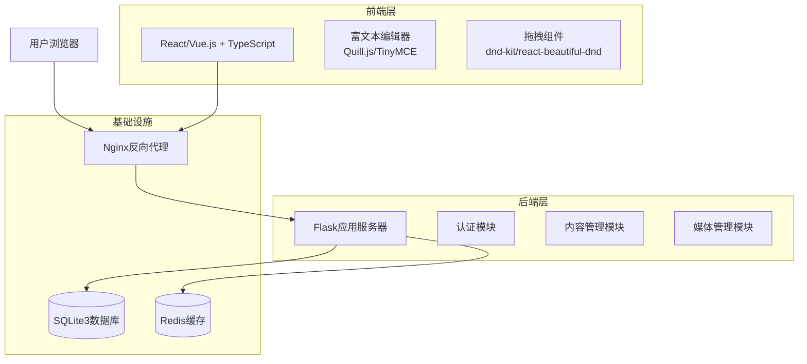

**图表来源**
- [企业网站CMS系统详细需求文档.md](file://企业网站CMS系统详细需求文档.md#L22-L57)

**章节来源**
- [企业网站CMS系统详细需求文档.md](file://企业网站CMS系统详细需求文档.md#L22-L57)

## 核心组件

### XSS防护组件架构

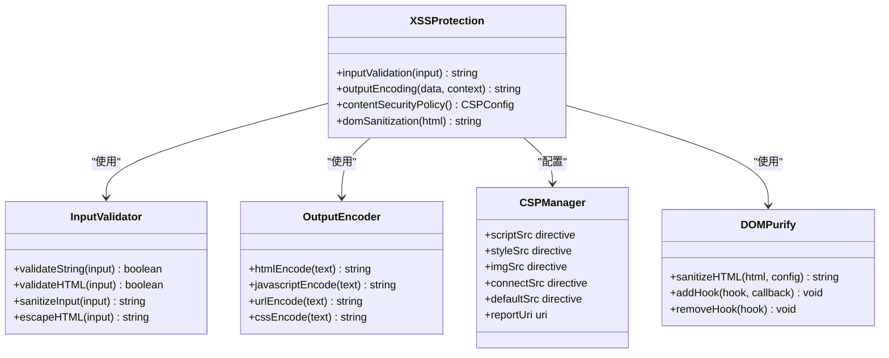

**图表来源**
- [企业网站CMS系统详细需求文档.md](file://企业网站CMS系统详细需求文档.md#L108-L121)
- [企业网站CMS系统详细需求文档.md](file://企业网站CMS系统详细需求文档.md#L422-L428)

**章节来源**
- [企业网站CMS系统详细需求文档.md](file://企业网站CMS系统详细需求文档.md#L108-L121)
- [企业网站CMS系统详细需求文档.md](file://企业网站CMS系统详细需求文档.md#L422-L428)

## 架构总览

### XSS防护架构设计

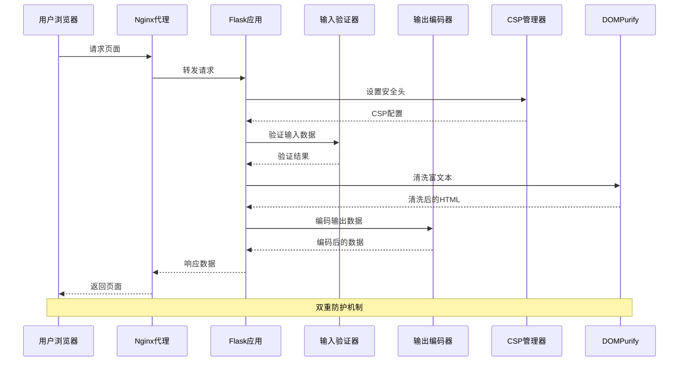

**图表来源**
- [开发计划表_2月4日-2月12日.md](file://开发计划表_2月4日-2月12日.md#L465-L487)
- [企业网站CMS系统详细需求文档.md](file://企业网站CMS系统详细需求文档.md#L108-L121)

## 详细组件分析

### XSS攻击类型分析

#### 1. 反射型XSS（Reflected XSS）

反射型XSS是最常见的XSS攻击类型，攻击者通过诱使用户点击恶意链接来实施攻击。

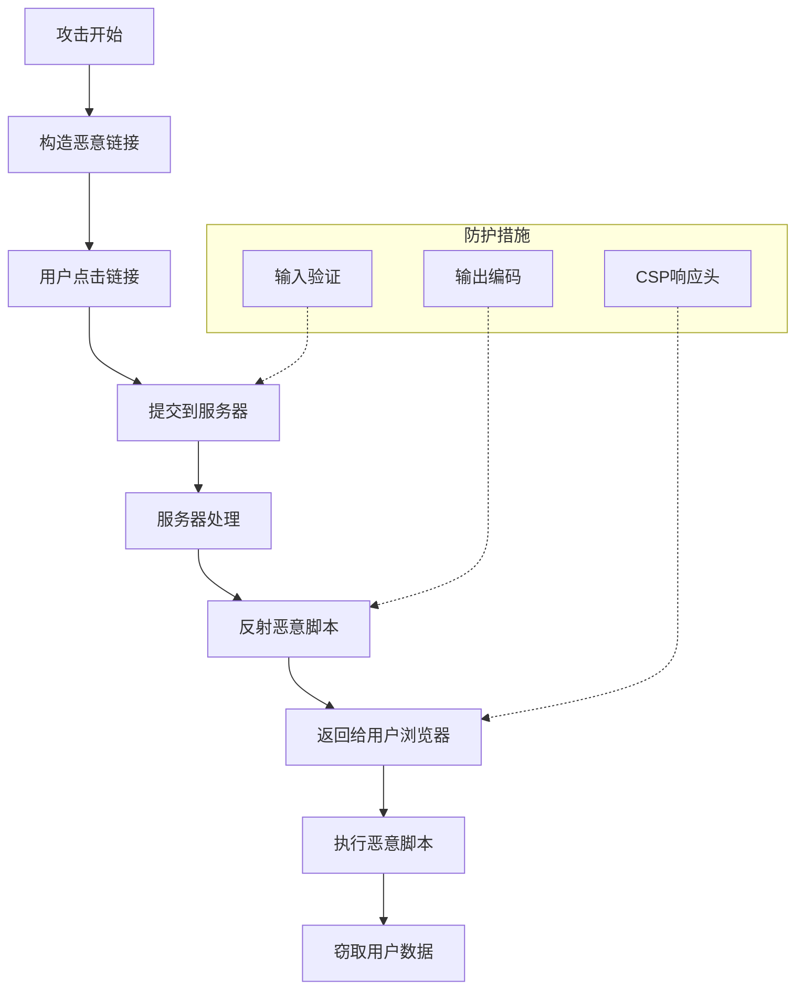

**图表来源**
- [企业网站CMS系统开发需求文档.ini](file://企业网站CMS系统开发需求文档.ini#L105-L109)

#### 2. 存储型XSS（Stored XSS）

存储型XSS是最危险的XSS类型，恶意代码被永久存储在服务器数据库中。

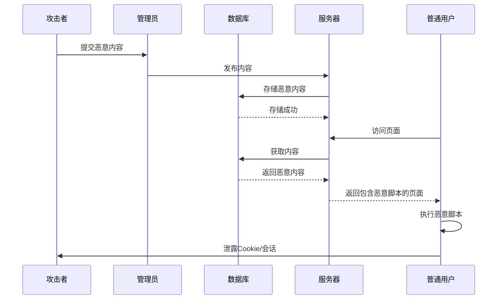

**图表来源**
- [企业网站CMS系统详细需求文档.md](file://企业网站CMS系统详细需求文档.md#L296-L330)

#### 3. DOM型XSS（DOM-based XSS）

DOM型XSS通过修改页面DOM结构来执行恶意脚本，不需要服务器参与。

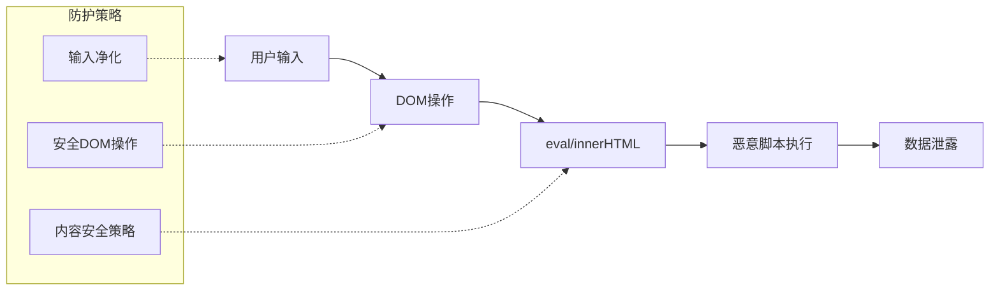

**图表来源**
- [企业网站CMS系统详细需求文档.md](file://企业网站CMS系统详细需求文档.md#L108-L121)

### 内容安全策略（CSP）配置

#### CSP指令详解

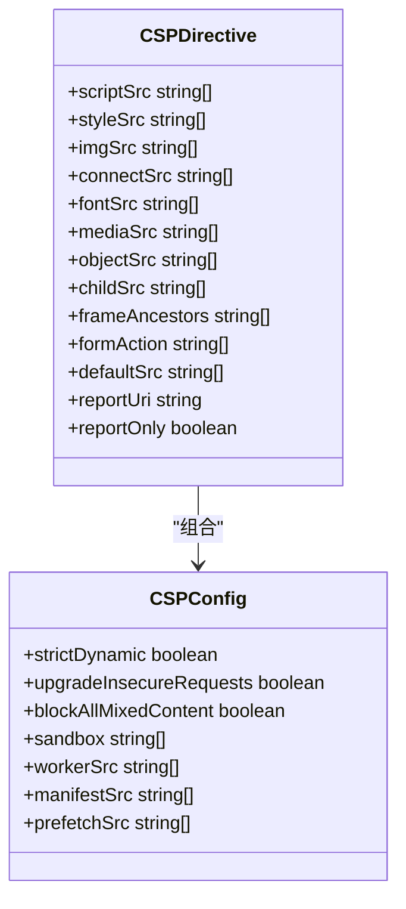

**图表来源**
- [企业网站CMS系统详细需求文档.md](file://企业网站CMS系统详细需求文档.md#L422-L428)

#### CSP配置最佳实践

| 指令 | 默认值 | 安全配置 | 用途 |
|------|--------|----------|------|
| script-src | self | 'self' 'unsafe-inline' 'unsafe-eval' | 控制脚本加载来源 |
| style-src | self | 'self' 'unsafe-inline' | 控制样式表加载来源 |
| img-src | self | 'self' data: https: | 控制图片加载来源 |
| connect-src | self | 'self' | 控制XHR/Fetch请求来源 |
| font-src | self | 'self' data: | 控制字体文件来源 |
| media-src | self | 'self' | 控制音频视频来源 |
| object-src | none | none | 控制插件内容来源 |

**章节来源**
- [企业网站CMS系统详细需求文档.md](file://企业网站CMS系统详细需求文档.md#L422-L428)

### 输入验证和输出编码

#### 输入验证策略

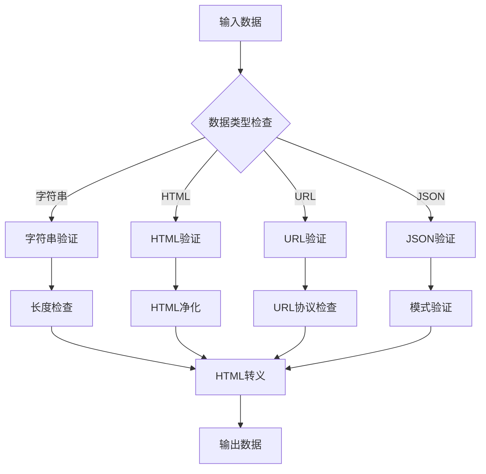

**图表来源**
- [开发计划表_2月4日-2月12日.md](file://开发计划表_2月4日-2月12日.md#L142-L157)

#### 输出编码技术

| 编码类型 | 适用场景 | 编码规则 | 示例 |
|----------|----------|----------|------|
| HTML实体编码 | HTML内容输出 | `<` → `&lt;` | `Hello <script>` → `Hello &lt;script` |
| JavaScript编码 | JavaScript上下文 | `\` → `\\`, `"` → `\"` | `"alert('xss')"` → `\"alert(\\'xss\\')\"` |
| URL编码 | URL参数输出 | 空格→%20, `&`→%26 | `?param=<script>` → `?param=%3Cscript` |
| CSS编码 | CSS属性输出 | `url()`中的特殊字符 | `background: url(javascript:...)` → `background: url(javascript:...)` |

**章节来源**
- [开发计划表_2月4日-2月12日.md](file://开发计划表_2月4日-2月12日.md#L142-L157)

### 富文本内容安全过滤

#### DOMPurify使用方案

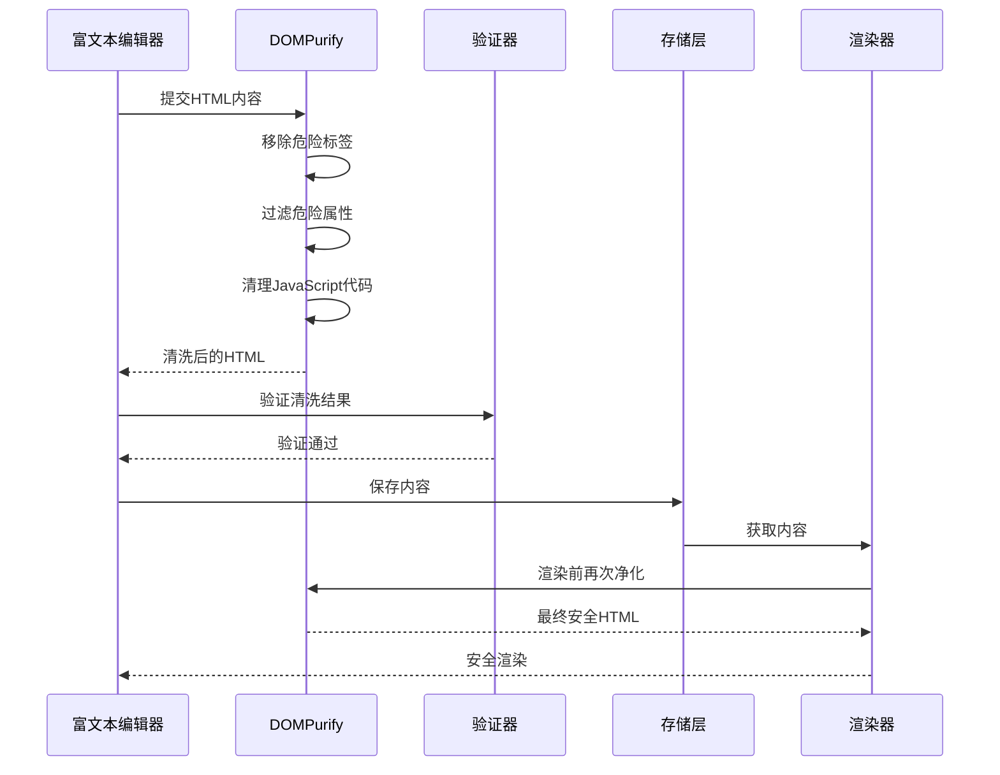

**图表来源**
- [企业网站CMS系统详细需求文档.md](file://企业网站CMS系统详细需求文档.md#L108-L121)

#### 富文本安全配置

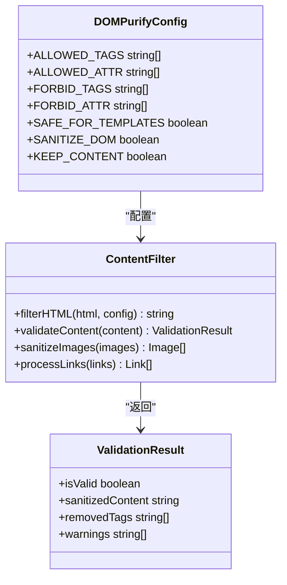

**图表来源**
- [企业网站CMS系统详细需求文档.md](file://企业网站CMS系统详细需求文档.md#L108-L121)

**章节来源**
- [企业网站CMS系统详细需求文档.md](file://企业网站CMS系统详细需求文档.md#L108-L121)

### 前后端双重防护策略

#### 前端防护层

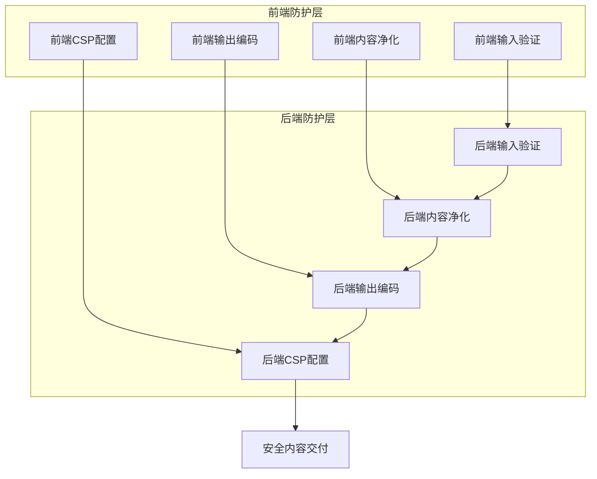

**图表来源**
- [开发计划表_2月4日-2月12日.md](file://开发计划表_2月4日-2月12日.md#L465-L487)

#### 双重防护实现

| 防护层次 | 防护措施 | 实现方式 | 验证方法 |
|----------|----------|----------|----------|
| 前端第一层 | 输入验证 | React Hook Form + Zod | 前端错误提示 |
| 前端第二层 | 内容净化 | DOMPurify + HTML5 Shiv | DOM结构验证 |
| 前端第三层 | 输出编码 | Template Literal + DOMPurify | 浏览器开发者工具 |
| 后端第一层 | 输入验证 | Flask-WTF + Marshmallow | API响应验证 |
| 后端第二层 | 内容净化 | BeautifulSoup + Bleach | 数据库内容检查 |
| 后端第三层 | 输出编码 | Jinja2 + MarkupSafe | HTTP响应头检查 |
| 后端第四层 | CSP配置 | Nginx + Flask | CSP报告分析 |

**章节来源**
- [开发计划表_2月4日-2月12日.md](file://开发计划表_2月4日-2月12日.md#L465-L487)

### Content Security Policy响应头配置

#### CSP配置示例

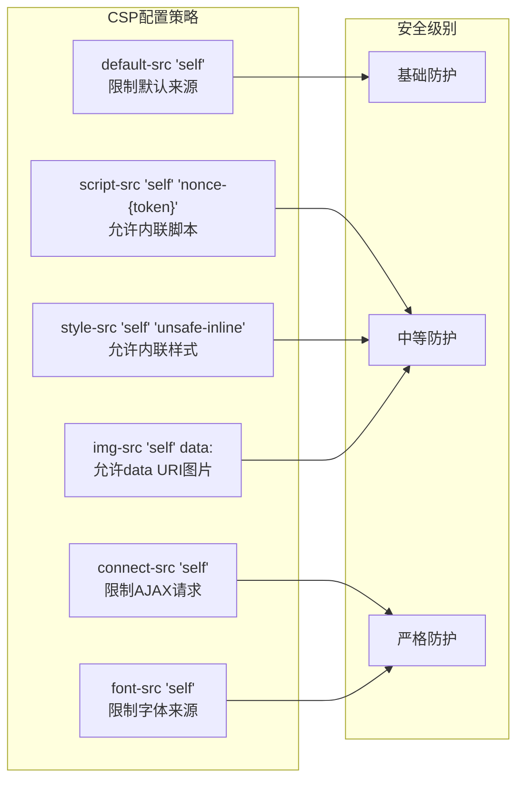

**图表来源**
- [企业网站CMS系统详细需求文档.md](file://企业网站CMS系统详细需求文档.md#L422-L428)

#### CSP配置最佳实践

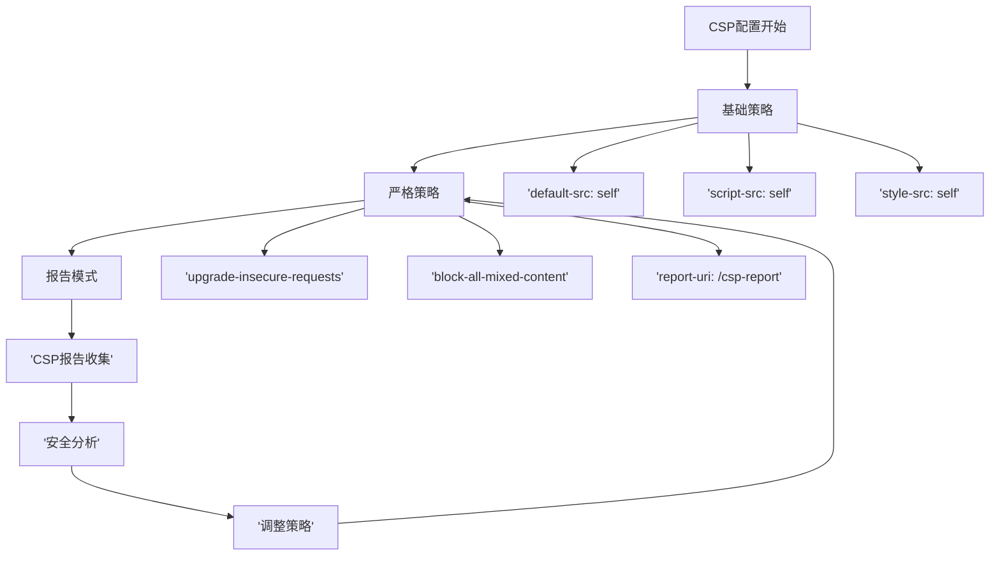

**图表来源**
- [企业网站CMS系统详细需求文档.md](file://企业网站CMS系统详细需求文档.md#L422-L428)

**章节来源**
- [企业网站CMS系统详细需求文档.md](file://企业网站CMS系统详细需求文档.md#L422-L428)

## 依赖关系分析

### XSS防护依赖关系

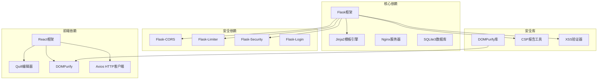

**图表来源**
- [企业网站CMS系统详细需求文档.md](file://企业网站CMS系统详细需求文档.md#L555-L594)

**章节来源**
- [企业网站CMS系统详细需求文档.md](file://企业网站CMS系统详细需求文档.md#L555-L594)

## 性能考虑

### XSS防护性能影响

| 防护措施 | 性能影响 | 优化策略 | 实施成本 |
|----------|----------|----------|----------|
| 输入验证 | 中等 | 缓存验证结果 | 低 |
| 输出编码 | 低 | 批量处理 | 低 |
| DOM净化 | 高 | 异步处理 | 中 |
| CSP检查 | 低 | 预编译策略 | 低 |
| 双重验证 | 中等 | 条件验证 | 低 |

### 性能优化建议

1. **缓存策略**：对验证结果进行缓存，减少重复计算
2. **异步处理**：将耗时的净化操作放到后台任务中
3. **条件验证**：根据用户权限决定验证强度
4. **批量处理**：对大量数据进行批处理优化
5. **CDN加速**：将静态资源通过CDN分发

## 故障排除指南

### 常见XSS防护问题

#### 1. 富文本内容被过度净化

**问题现象**：
- 富文本格式丢失
- 链接被移除
- 图片无法显示

**解决方案**：
- 配置DOMPurify允许特定标签
- 使用白名单机制
- 实施渐进式净化策略

#### 2. CSP配置导致功能异常

**问题现象**：
- 脚本无法加载
- 样式表失效
- 图片显示异常

**解决方案**：
- 使用CSP报告模式调试
- 逐步放宽策略
- 实施分阶段部署

#### 3. 前后端验证不一致

**问题现象**：
- 前端验证通过但后端拒绝
- 后端验证通过但前端报错

**解决方案**：
- 统一验证规则
- 实施前后端一致性检查
- 建立验证规则同步机制

**章节来源**
- [开发计划表_2月4日-2月12日.md](file://开发计划表_2月4日-2月12日.md#L589-L625)

## 结论

XSS防护是一个多层次、全方位的安全策略，需要从前端、后端到基础设施的协同配合。基于企业CMS系统的特性，建议采用以下综合防护方案：

1. **建立双重防护体系**：前端和后端各实施一层防护，形成纵深防御
2. **实施内容安全策略**：合理配置CSP，限制恶意脚本执行
3. **强化输入验证**：对所有用户输入进行严格验证和净化
4. **实施输出编码**：根据不同上下文进行相应的输出编码
5. **定期安全测试**：建立持续的安全测试和监控机制

通过以上措施的综合实施，可以有效防范各种类型的XSS攻击，保障企业CMS系统的安全稳定运行。