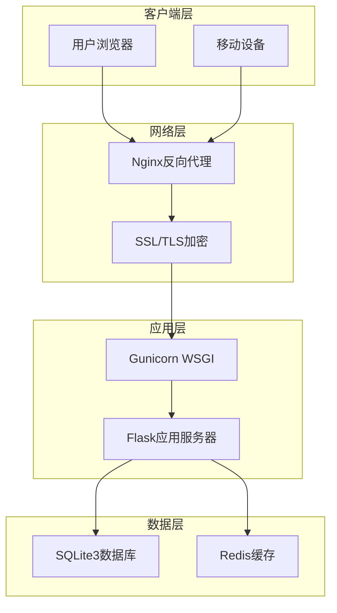
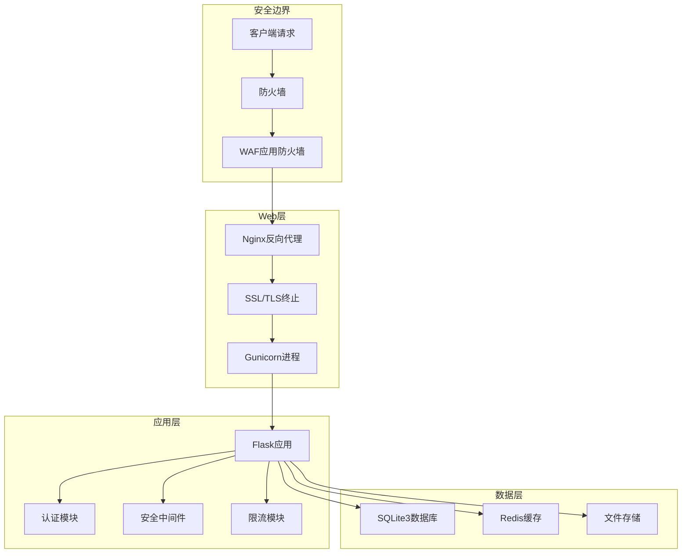
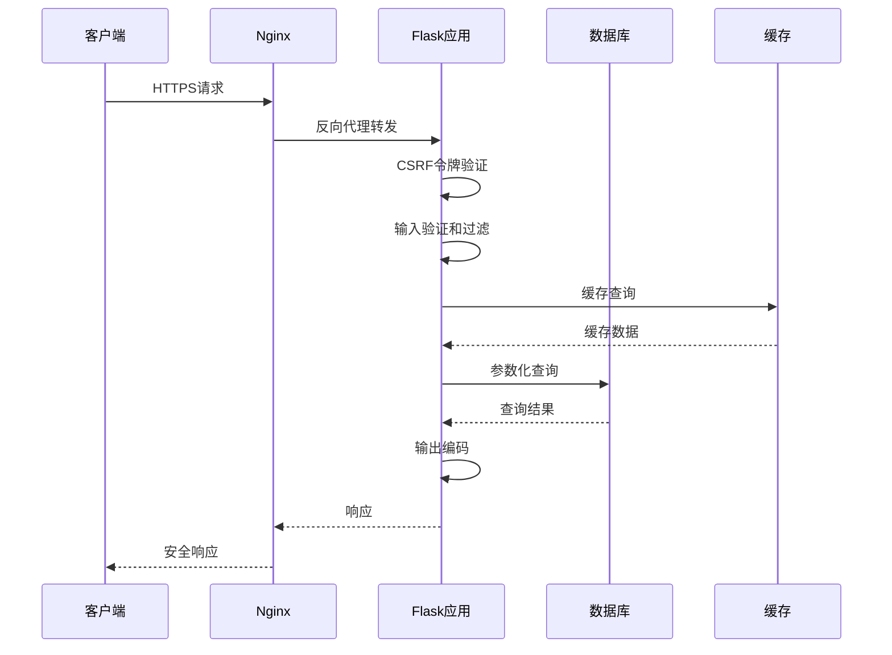
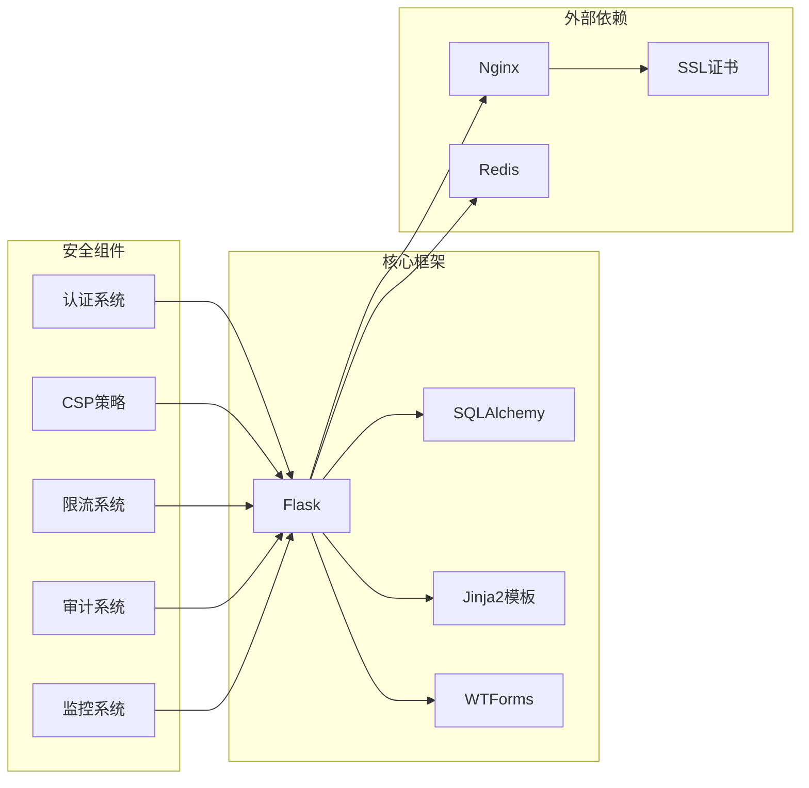

# 威胁防护

<cite>
**本文档引用的文件**
- [企业网站CMS系统开发需求文档.ini](file://企业网站CMS系统开发需求文档.ini)
- [企业网站CMS系统详细需求文档.md](file://企业网站CMS系统详细需求文档.md)
- [开发计划表_2月4日-2月12日.md](file://开发计划表_2月4日-2月12日.md)
</cite>

## 目录
1. [简介](#简介)
2. [项目结构](#项目结构)
3. [核心威胁与防护策略](#核心威胁与防护策略)
4. [架构概览](#架构概览)
5. [详细威胁防护组件分析](#详细威胁防护组件分析)
6. [依赖关系分析](#依赖关系分析)
7. [性能与安全平衡](#性能与安全平衡)
8. [故障排除指南](#故障排除指南)
9. [结论](#结论)

## 简介

本威胁防护文档针对企业网站CMS系统进行全面的安全加固方案设计。该系统采用Python Flask + SQLite3 + Nginx + Windows Server架构，服务于中小企业的官方网站内容管理需求。文档涵盖了从基础设施到应用层的全方位安全防护策略，包括常见的Web攻击防护、安全配置最佳实践以及持续监控方案。

## 项目结构

CMS系统采用前后端分离架构，主要组件包括：



**图表来源**
- [企业网站CMS系统详细需求文档.md](file://企业网站CMS系统详细需求文档.md#L22-L57)

**章节来源**
- [企业网站CMS系统详细需求文档.md](file://企业网站CMS系统详细需求文档.md#L22-L57)

## 核心威胁与防护策略

### XSS(跨站脚本)防护

#### 防护机制设计

**输入验证与过滤**
- 对所有用户输入进行严格的白名单验证
- 使用HTML实体编码防止脚本执行
- 实施内容安全策略(CSP)限制脚本来源

**输出编码策略**
- Jinja2模板渲染时自动进行HTML转义
- 富文本内容使用专门的Sanitizer库
- API响应中的动态内容进行严格编码

**CSP实施**
```
Content-Security-Policy: 
    default-src 'self';
    script-src 'self' 'unsafe-inline' 'unsafe-eval';
    style-src 'self' 'unsafe-inline';
    img-src 'self' data:;
    font-src 'self' data:;
    connect-src 'self';
    frame-ancestors 'none';
    base-uri 'self';
```

### SQL注入防护

#### 防护策略

**参数化查询**
- 使用Flask-SQLAlchemy ORM进行数据库操作
- 所有用户输入通过参数绑定处理
- 避免动态拼接SQL语句

**数据库访问控制**
- 最小权限原则配置数据库用户
- 实施连接池管理和超时控制
- 启用WAL模式提升SQLite并发性能

**输入验证**
- 对所有数据库查询参数进行类型检查
- 实施长度和格式验证
- 使用白名单过滤特殊字符

### CSRF(跨站请求伪造)防护

#### 多层次防护

**双重提交Cookie**
```python
# CSRF Token生成
def generate_csrf_token():
    return secrets.token_urlsafe(32)

# Token验证中间件
@app.before_request
def csrf_protect():
    if request.method in ['POST', 'PUT', 'DELETE']:
        token = request.headers.get('X-CSRF-Token') or request.form.get('csrf_token')
        if not verify_csrf_token(token):
            abort(403)
```

**同步令牌验证**
- 每个表单生成唯一令牌
- 令牌与用户Session绑定
- 实施令牌过期机制

**SameSite Cookie**
```
Set-Cookie: sessionid=...; SameSite=Strict; HttpOnly; Secure
```

### 点击劫持防护

#### 防护措施

**X-Frame-Options头部**
```
X-Frame-Options: DENY
```

**Content-Security-Policy帧限制**
```
Content-Security-Policy: frame-ancestors 'none';
```

**Frame-Busting JavaScript**
```javascript
// 防止iframe嵌入
if (top !== self) {
    top.location = self.location;
}
```

### HTTP头部安全配置

#### 安全响应头

**核心安全头部**
```
Strict-Transport-Security: max-age=31536000; includeSubDomains
X-Content-Type-Options: nosniff
X-Frame-Options: DENY
Referrer-Policy: strict-origin-when-cross-origin
Permissions-Policy: geolocation=(), microphone=(), camera=()
```

**CSP配置**
```
Content-Security-Policy: 
    default-src 'self';
    script-src 'self' 'unsafe-inline';
    style-src 'self' 'unsafe-inline';
    img-src 'self' data: https:;
    font-src 'self' data:;
    connect-src 'self';
    frame-ancestors 'none';
    base-uri 'self';
    form-action 'self';
```

### DDoS攻击防护

#### 多层防护策略

**请求限制**
- 基于IP的请求频率限制
- 用户会话级别的并发控制
- API端点差异化限流

**异常流量检测**
- 实时监控异常访问模式
- 自动识别恶意爬虫行为
- 智能封禁机制

**负载均衡**
- Nginx反向代理集群
- 应用服务器水平扩展
- CDN边缘缓存

### 安全监控与审计

#### 日志审计系统

**访问日志**
- 记录所有HTTP请求详情
- 包含User-Agent和IP信息
- 异常访问标记

**操作审计**
- 用户敏感操作记录
- 管理员权限变更跟踪
- 数据修改审计日志

**入侵检测**
- 实时威胁检测
- 异常行为告警
- 自动响应机制

**章节来源**
- [企业网站CMS系统开发需求文档.ini](file://企业网站CMS系统开发需求文档.ini#L105-L110)
- [企业网站CMS系统详细需求文档.md](file://企业网站CMS系统详细需求文档.md#L422-L428)

## 架构概览

### 安全架构设计



**图表来源**
- [企业网站CMS系统详细需求文档.md](file://企业网站CMS系统详细需求文档.md#L34-L56)

### 数据流安全



**图表来源**
- [开发计划表_2月4日-2月12日.md](file://开发计划表_2月4日-2月12日.md#L441-L506)

## 详细威胁防护组件分析

### 认证与授权安全

#### JWT Token安全

**Token生成与验证**
- 使用强随机数生成JWT令牌
- 实施短有效期和自动刷新机制
- Token存储在HttpOnly Cookie中

**权限控制**
- 基于角色的访问控制(RBAC)
- 细粒度操作权限管理
- 数据级权限隔离

**章节来源**
- [开发计划表_2月4日-2月12日.md](file://开发计划表_2月4日-2月12日.md#L142-L157)

### 文件上传安全

#### 上传防护策略

**文件类型验证**
- MIME类型检测
- 文件签名验证
- 扩展名白名单

**文件内容扫描**
- 恶意文件特征检测
- 宏病毒扫描
- 多重安全检查

**存储安全**
- 随机文件名生成
- 上传目录权限限制
- 文件访问控制

### API安全防护

#### 接口安全

**请求验证**
- 请求体大小限制
- JSON解析安全检查
- 参数类型验证

**响应安全**
- 敏感信息过滤
- 错误信息脱敏
- 响应头安全配置

**章节来源**
- [开发计划表_2月4日-2月12日.md](file://开发计划表_2月4日-2月12日.md#L150-L174)

### 缓存安全

#### 缓存防护

**缓存污染防护**
- 用户特定内容不缓存
- 敏感数据缓存隔离
- 缓存键命名规范

**缓存更新策略**
- 缓存失效机制
- 并发更新处理
- 缓存一致性保证

### 数据库安全

#### 数据保护

**连接安全**
- TLS加密连接
- 最小权限数据库用户
- 连接池安全配置

**数据加密**
- 敏感字段加密存储
- 密钥安全管理
- 数据传输加密

**章节来源**
- [企业网站CMS系统详细需求文档.md](file://企业网站CMS系统详细需求文档.md#L662-L712)

## 依赖关系分析

### 安全组件依赖



**图表来源**
- [企业网站CMS系统详细需求文档.md](file://企业网站CMS系统详细需求文档.md#L555-L594)

### 安全配置依赖

**章节来源**
- [企业网站CMS系统详细需求文档.md](file://企业网站CMS系统详细需求文档.md#L555-L594)

## 性能与安全平衡

### 性能优化策略

**缓存策略**
- 多级缓存架构
- 智能缓存失效
- 缓存预热机制

**数据库优化**
- 连接池配置
- 查询优化
- 索引策略

**静态资源优化**
- CDN加速
- 压缩传输
- 懒加载

### 安全开销控制

**渐进式安全**
- 优先级安全策略
- 性能影响评估
- 安全与性能权衡

**监控与调优**
- 性能基准测试
- 安全事件监控
- 自动化调优

## 故障排除指南

### 常见安全问题

**XSS防护失效**
- 检查HTML转义配置
- 验证CSP策略
- 审核富文本处理

**CSRF攻击**
- 验证Token生成机制
- 检查SameSite配置
- 审核请求头处理

**SQL注入风险**
- 检查参数化查询
- 验证输入过滤
- 审核数据库权限

**章节来源**
- [开发计划表_2月4日-2月12日.md](file://开发计划表_2月4日-2月12日.md#L589-L625)

### 安全监控配置

**日志配置**
- 日志级别设置
- 敏感信息脱敏
- 日志轮转策略

**告警机制**
- 实时告警配置
- 告警聚合策略
- 告警通知渠道

**性能监控**
- 关键指标监控
- 性能基线设定
- 异常检测规则

## 结论

本威胁防护方案为企业CMS系统提供了全面的安全保障，涵盖了从基础设施到应用层的各个层面。通过实施多层次的防护策略，包括XSS防护、SQL注入防护、CSRF防护、点击劫持防护以及DDoS防护，系统能够在保证功能完整性的同时，有效抵御各种常见的Web攻击。

关键防护要点：
- 采用参数化查询和输入验证防止SQL注入
- 实施CSP和输出编码防护XSS攻击
- 通过双重提交Cookie和同步令牌防护CSRF
- 配置安全HTTP头部和CSP策略
- 建立完善的日志审计和监控体系
- 实施请求限制和异常流量检测

建议在系统部署后定期进行安全评估和渗透测试，持续优化安全策略，确保系统在不断变化的威胁环境中保持安全稳定运行。