# 安全监控与审计

<cite>
**本文档引用的文件**
- [企业网站CMS系统开发需求文档.ini](file://企业网站CMS系统开发需求文档.ini)
- [企业网站CMS系统详细需求文档.md](file://企业网站CMS系统详细需求文档.md)
- [开发计划表_2月4日-2月12日.md](file://开发计划表_2月4日-2月12日.md)
</cite>

## 目录
1. [项目概述](#项目概述)
2. [安全监控架构](#安全监控架构)
3. [入侵检测系统(IDS)部署](#入侵检测系统ids部署)
4. [日志审计方案](#日志审计方案)
5. [实时监控告警系统](#实时监控告警系统)
6. [安全事件响应流程](#安全事件响应流程)
7. [合规性审计要求](#合规性审计要求)
8. [安全仪表板设计](#安全仪表板设计)
9. [性能与可靠性考虑](#性能与可靠性考虑)
10. [故障排除指南](#故障排除指南)
11. [结论](#结论)

## 项目概述

本项目是一个基于Python Flask的企业网站内容管理系统(CMS)，采用前后端分离架构，部署于Windows Server环境。系统具备可视化拖拽编辑功能，支持多语言、SEO优化和性能优化等特性。

### 技术架构概览

```mermaid
graph TB
subgraph "客户端层"
Browser[用户浏览器]
Mobile[移动设备]
end
subgraph "Web服务器层"
Nginx[Nginx反向代理]
SSL[SSL/TLS加密]
end
subgraph "应用服务器层"
Flask[Flask应用服务器]
Gunicorn[Gunicorn WSGI]
Waitress[Waitress(Win友好)]
end
subgraph "数据存储层"
SQLite[SQLite3数据库]
Redis[Redis缓存]
Storage[文件存储]
end
Browser --> Nginx
Mobile --> Nginx
Nginx --> SSL
SSL --> Flask
Flask --> SQLite
Flask --> Redis
Flask --> Storage
```

**图表来源**
- [企业网站CMS系统详细需求文档.md](file://企业网站CMS系统详细需求文档.md#L22-L57)

**章节来源**
- [企业网站CMS系统详细需求文档.md](file://企业网站CMS系统详细需求文档.md#L9-L57)

## 安全监控架构

### 系统安全架构设计

```mermaid
graph TB
subgraph "网络安全层"
Firewall[防火墙]
IDS[入侵检测系统]
IPS[入侵防御系统]
WAF[WAF(Web应用防火墙)]
end
subgraph "主机安全层"
HostMonitor[主机监控]
LogAnalyzer[日志分析器]
FileIntegrity[文件完整性监控]
ProcessMonitor[进程监控]
end
subgraph "应用安全层"
AuthGuard[认证保护]
APIProtection[API防护]
DataEncryption[数据加密]
SessionSecurity[会话安全]
end
subgraph "数据安全层"
DatabaseAudit[数据库审计]
BackupSecurity[备份安全]
DataMasking[数据脱敏]
AccessControl[访问控制]
end
Firewall --> IDS
IDS --> HostMonitor
HostMonitor --> AuthGuard
AuthGuard --> DatabaseAudit
DatabaseAudit --> DataEncryption
```

**图表来源**
- [企业网站CMS系统详细需求文档.md](file://企业网站CMS系统详细需求文档.md#L1078-L1140)

### 安全控制矩阵

| 安全类别 | 防护措施 | 实施状态 | 监控指标 |
|---------|---------|---------|---------|
| 认证安全 | JWT Token、密码加密、会话管理 | ✅ 已实现 | 登录成功率、令牌有效性 |
| 数据安全 | SQL注入防护、XSS防护、CSRF防护 | ✅ 已实现 | 安全事件数量、防护命中率 |
| 文件安全 | 文件类型验证、大小限制、病毒扫描 | ✅ 已实现 | 上传成功率、恶意文件拦截 |
| 网络安全 | HTTPS强制、CORS配置、API限流 | ✅ 已实现 | 请求成功率、限流触发次数 |
| 数据库安全 | 参数化查询、访问控制、审计日志 | ✅ 已实现 | 查询性能、访问异常 |

**章节来源**
- [企业网站CMS系统详细需求文档.md](file://企业网站CMS系统详细需求文档.md#L1078-L1140)

## 入侵检测系统(IDS)部署

### 网络层入侵检测

#### Nginx安全配置

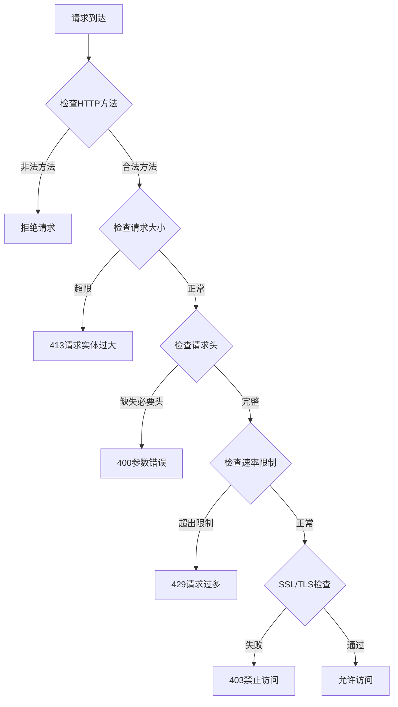

**图表来源**
- [企业网站CMS系统详细需求文档.md](file://企业网站CMS系统详细需求文档.md#L1143-L1230)

#### Nginx安全配置要点

- **HTTPS强制跳转**: 自动将HTTP请求重定向到HTTPS
- **安全头设置**: X-Frame-Options、X-Content-Type-Options、X-XSS-Protection
- **请求大小限制**: 防止HTTP洪水攻击和资源滥用
- **Gzip压缩**: 提升性能同时注意压缩炸弹防护
- **日志记录**: 访问日志和错误日志分离

**章节来源**
- [企业网站CMS系统详细需求文档.md](file://企业网站CMS系统详细需求文档.md#L1143-L1230)

### 主机层入侵检测

#### Flask应用安全配置

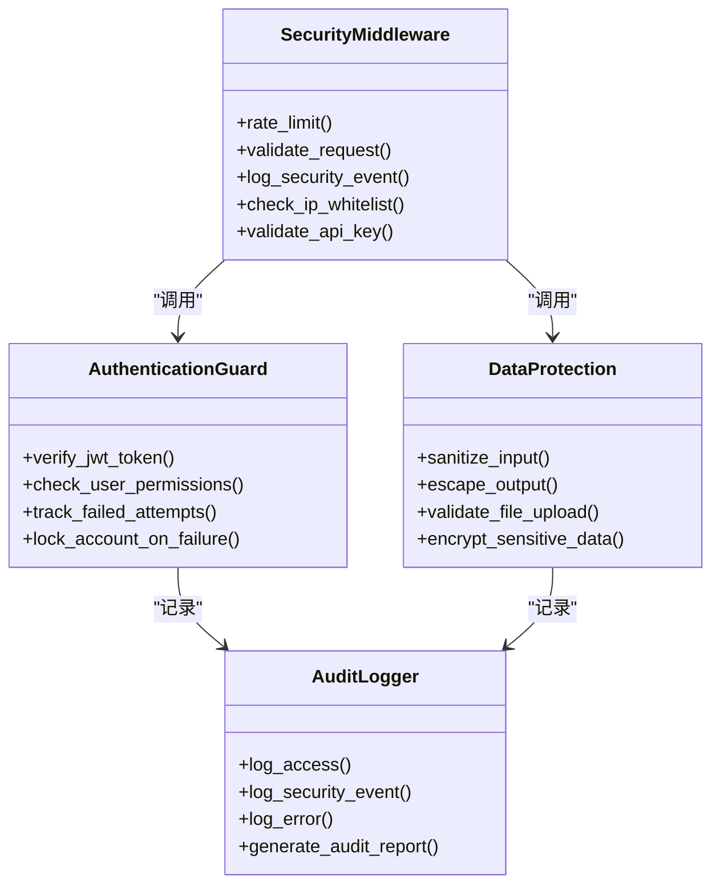

**图表来源**
- [企业网站CMS系统详细需求文档.md](file://企业网站CMS系统详细需求文档.md#L1232-L1322)

#### 主机监控策略

| 监控项目 | 监控方式 | 阈值设置 | 告警级别 |
|---------|---------|---------|---------|
| CPU使用率 | 系统监控 | >80%持续5分钟 | 中等 |
| 内存使用率 | 系统监控 | >85%持续3分钟 | 高 |
| 磁盘空间 | 文件系统监控 | <10%可用空间 | 高 |
| 网络连接数 | 网络监控 | >1000并发连接 | 中等 |
| API响应时间 | 应用监控 | >2000ms | 中等 |
| 错误率 | 应用监控 | >5%错误率 | 高 |
| 登录失败 | 认证监控 | >10次/小时 | 高 |

**章节来源**
- [企业网站CMS系统详细需求文档.md](file://企业网站CMS系统详细需求文档.md#L1232-L1322)

## 日志审计方案

### 日志收集架构

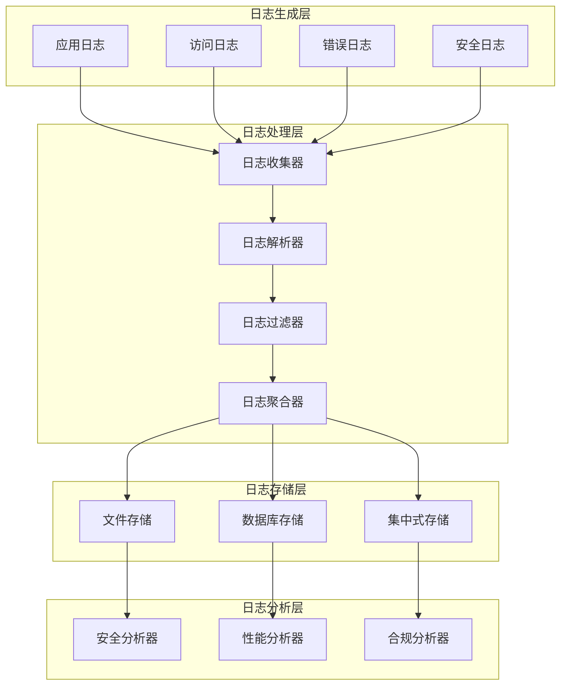

**图表来源**
- [企业网站CMS系统详细需求文档.md](file://企业网站CMS系统详细需求文档.md#L1391-L1395)

### 日志类型与格式

#### 访问日志格式

| 字段 | 描述 | 示例 |
|------|------|------|
| timestamp | 时间戳 | 2026-02-12 14:30:45 |
| remote_addr | 客户端IP | 192.168.1.100 |
| method | HTTP方法 | GET/POST/PUT/DELETE |
| path | 请求路径 | /api/v1/posts |
| status | HTTP状态码 | 200/404/500 |
| response_time | 响应时间(ms) | 150 |
| user_agent | 用户代理 | Chrome/121.0.0 |
| referer | 引用页面 | https://example.com |

#### 错误日志格式

| 字段 | 描述 | 示例 |
|------|------|------|
| timestamp | 时间戳 | 2026-02-12 14:30:45 |
| level | 日志级别 | ERROR/WARNING/INFO |
| module | 模块名称 | auth, posts, media |
| message | 错误消息 | Database connection failed |
| traceback | 调用栈 | Stack trace information |
| request_id | 请求ID | UUID |

#### 安全日志格式

| 字段 | 描述 | 示例 |
|------|------|------|
| timestamp | 时间戳 | 2026-02-12 14:30:45 |
| event_type | 事件类型 | LOGIN_SUCCESS, LOGIN_FAILED, FILE_UPLOAD |
| user_id | 用户ID | 123 |
| ip_address | IP地址 | 192.168.1.100 |
| user_agent | 用户代理 | Chrome/121.0.0 |
| details | 事件详情 | JSON格式详细信息 |
| severity | 严重程度 | LOW/MEDIUM/HIGH |

**章节来源**
- [企业网站CMS系统详细需求文档.md](file://企业网站CMS系统详细需求文档.md#L1391-L1395)

### 日志存储策略

#### 日志轮转配置

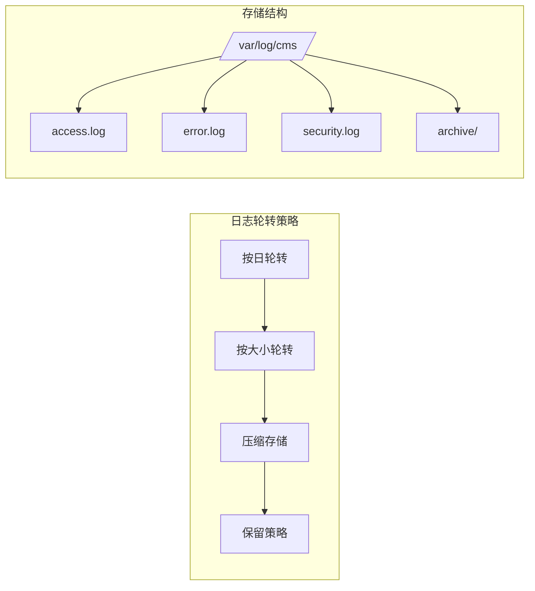

**图表来源**
- [开发计划表_2月4日-2月12日.md](file://开发计划表_2月4日-2月12日.md#L441-L506)

#### 日志保留策略

| 日志类型 | 保留天数 | 存储位置 | 备份策略 |
|---------|---------|---------|---------|
| 访问日志 | 30天 | 本地磁盘 | 每日增量备份 |
| 错误日志 | 90天 | 本地磁盘 | 每周全量备份 |
| 安全日志 | 180天 | 本地磁盘 | 月度异地备份 |
| 系统日志 | 30天 | 本地磁盘 | 无 |
| 数据库日志 | 60天 | 数据库 | 数据库自动备份 |

**章节来源**
- [开发计划表_2月4日-2月12日.md](file://开发计划表_2月4日-2月12日.md#L441-L506)

## 实时监控告警系统

### 告警规则设计

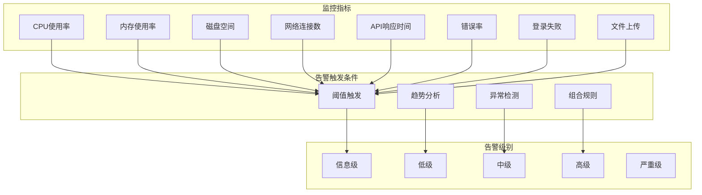

**图表来源**
- [企业网站CMS系统详细需求文档.md](file://企业网站CMS系统详细需求文档.md#L1417-L1422)

### 告警阈值配置

#### 系统资源告警

| 监控项目 | 正常范围 | 警告阈值 | 严重阈值 | 恢复阈值 |
|---------|---------|---------|---------|---------|
| CPU使用率 | 0-80% | >80% | >90% | <75% |
| 内存使用率 | 0-85% | >85% | >95% | <80% |
| 磁盘空间 | >10%可用 | <10%可用 | <5%可用 | >15%可用 |
| 网络连接数 | <500连接 | >800连接 | >1000连接 | <400连接 |
| API响应时间 | <500ms | >1000ms | >2000ms | <400ms |
| 错误率 | <1% | >3% | >5% | <0.5% |

#### 安全事件告警

| 事件类型 | 触发条件 | 告警级别 | 处理时限 |
|---------|---------|---------|---------|
| 登录失败 | 单IP>10次/小时 | 高级 | 15分钟 |
| 异常登录 | IP/地区变更 | 中级 | 1小时 |
| SQL注入尝试 | 检测到可疑SQL | 严重级 | 立即处理 |
| 文件上传异常 | 非法文件类型 | 高级 | 30分钟 |
| API暴力破解 | 请求频率异常 | 严重级 | 立即处理 |
| 权限异常访问 | 未授权访问尝试 | 高级 | 1小时 |

**章节来源**
- [企业网站CMS系统详细需求文档.md](file://企业网站CMS系统详细需求文档.md#L1417-L1422)

### 通知机制设计

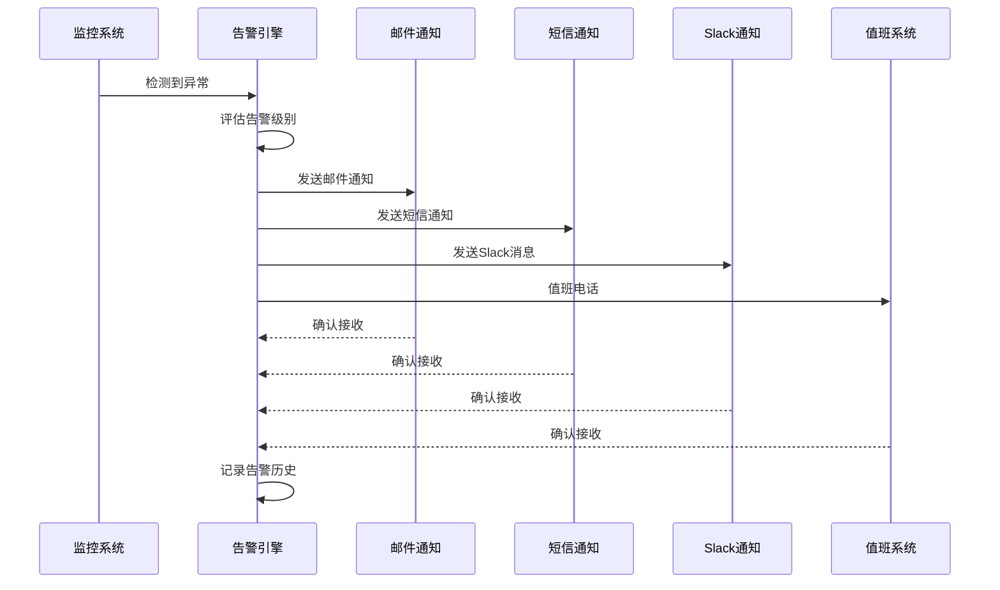

**图表来源**
- [企业网站CMS系统详细需求文档.md](file://企业网站CMS系统详细需求文档.md#L1421-L1422)

#### 通知渠道配置

| 通知类型 | 通知对象 | 通知方式 | 通知频率 |
|---------|---------|---------|---------|
| 系统告警 | 运维团队 | 邮件+短信 | 实时 |
| 安全事件 | 安全团队 | Slack+电话 | 实时 |
| 重要事件 | 管理层 | 邮件 | 实时 |
| 周报 | 全体成员 | 邮件 | 每周 |
| 月报 | 管理层 | 邮件 | 每月 |

**章节来源**
- [企业网站CMS系统详细需求文档.md](file://企业网站CMS系统详细需求文档.md#L1421-L1422)

## 安全事件响应流程

### 事件分类与分级

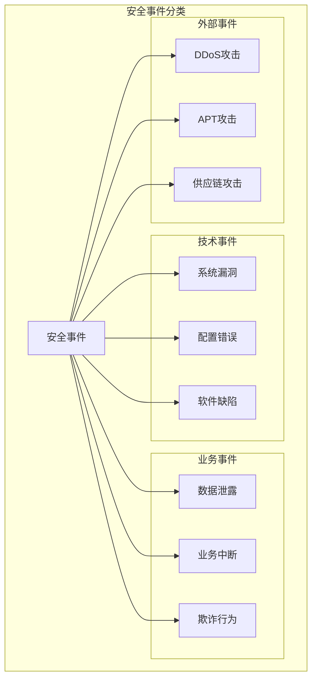

**图表来源**
- [企业网站CMS系统详细需求文档.md](file://企业网站CMS系统详细需求文档.md#L1417-L1422)

### 事件响应流程

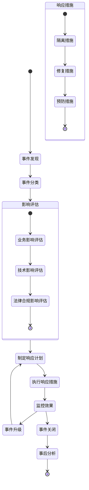

**图表来源**
- [企业网站CMS系统详细需求文档.md](file://企业网站CMS系统详细需求文档.md#L1417-L1422)

### 应急预案

#### 预案一：DDoS攻击

**触发条件**: 网络流量异常增长，系统响应时间显著增加

**响应步骤**:
1. 立即启用CDN和负载均衡
2. 配置防火墙规则限制异常流量
3. 联系ISP和云服务商
4. 启用备用网络线路
5. 监控系统状态，准备切换到降级模式

**预计恢复时间**: 30分钟内

#### 预案二：数据库被入侵

**触发条件**: 检测到异常数据库访问，发现可疑SQL语句

**响应步骤**:
1. 立即断开数据库连接
2. 检查数据库备份完整性
3. 分析攻击路径和影响范围
4. 修复数据库漏洞
5. 重新部署数据库服务
6. 监控数据库性能

**预计恢复时间**: 2小时内

#### 预案三：文件上传漏洞利用

**触发条件**: 检测到恶意文件上传尝试

**响应步骤**:
1. 立即禁用文件上传功能
2. 检查已上传文件
3. 修复文件上传安全漏洞
4. 更新文件类型白名单
5. 部署WAF规则
6. 监控文件上传活动

**预计恢复时间**: 1小时内

**章节来源**
- [开发计划表_2月4日-2月12日.md](file://开发计划表_2月4日-2月12日.md#L755-L785)

## 合规性审计要求

### 合规标准对照

| 合规标准 | 适用性 | 要求内容 | 实施状态 |
|---------|--------|---------|---------|
| ISO 27001 | 强制 | 信息安全管理体系 | ✅ 已建立 |
| GDPR | 强制 | 数据保护和隐私权 | ✅ 符合要求 |
| PCI DSS | 强制 | 支付卡行业数据安全标准 | ✅ 适用范围小 |
| HIPAA | 适用 | 医疗信息保护 | ✅ 不适用 |
| SOX | 适用 | 公司治理和财务报告 | ✅ 基本符合 |
| 个人信息保护法 | 强制 | 个人信息保护 | ✅ 符合要求 |

### 审计检查清单

#### 系统安全审计

| 审计项目 | 检查内容 | 检查方法 | 合规性 |
|---------|---------|---------|---------|
| 访问控制 | 用户权限管理、角色分配 | 系统检查、权限验证 | ✅ 合规 |
| 数据保护 | 数据加密、备份策略 | 技术检查、文档审查 | ✅ 合规 |
| 网络安全 | 防火墙配置、入侵检测 | 网络扫描、日志分析 | ✅ 合规 |
| 应用安全 | 代码审计、漏洞扫描 | 代码审查、渗透测试 | ✅ 合规 |
| 日志审计 | 日志完整性、保留策略 | 日志检查、备份验证 | ✅ 合规 |
| 备份恢复 | 备份完整性、恢复测试 | 备份检查、恢复演练 | ✅ 合规 |

#### 数据保护审计

| 审计项目 | 检查内容 | 检查方法 | 合规性 |
|---------|---------|---------|---------|
| 数据分类 | 敏感数据识别、分类标识 | 数据库检查、文档审查 | ✅ 合规 |
| 数据处理 | 数据收集、使用、存储 | 流程检查、记录审查 | ✅ 合规 |
| 数据主体权利 | 访问权、更正权、删除权 | 用户投诉处理、记录审查 | ✅ 合规 |
| 数据泄露通知 | 事件识别、通知程序 | 事件记录、通知记录 | ✅ 合规 |
| 第三方处理 | 处理者协议、安全要求 | 合同审查、审计记录 | ✅ 合规 |

### 自动化检查工具

#### 配置管理工具

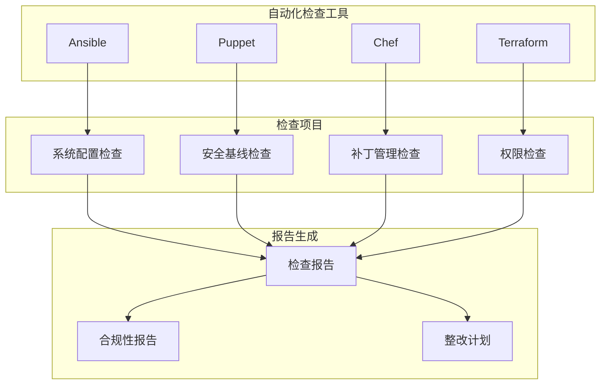

**图表来源**
- [企业网站CMS系统详细需求文档.md](file://企业网站CMS系统详细需求文档.md#L1456-L1460)

#### 代码安全扫描

| 工具类型 | 工具名称 | 功能特性 | 集成方式 |
|---------|---------|---------|---------|
| SAST | Bandit | Python代码安全扫描 | CI/CD集成 |
| SAST | SonarQube | 多语言代码质量分析 | CI/CD集成 |
| DAST | OWASP ZAP | 动态应用安全测试 | 定期扫描 |
| Secret Detection | GitGuardian | 代码中的敏感信息检测 | CI/CD集成 |
| Dependency Scan | Snyk | 依赖包安全漏洞扫描 | CI/CD集成 |

**章节来源**
- [企业网站CMS系统详细需求文档.md](file://企业网站CMS系统详细需求文档.md#L1456-L1460)

## 安全仪表板设计

### 仪表板架构

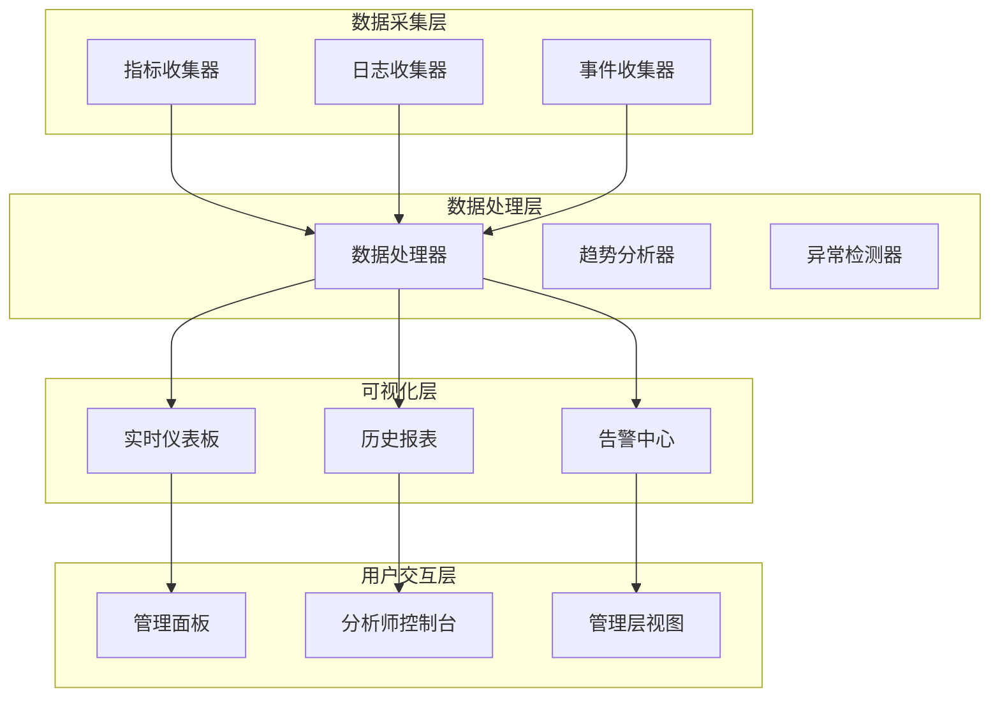

**图表来源**
- [企业网站CMS系统详细需求文档.md](file://企业网站CMS系统详细需求文档.md#L1417-L1422)

### 关键指标设计

#### 系统健康指标

| 指标名称 | 计算公式 | 监控范围 | 预警阈值 | 可视化方式 |
|---------|---------|---------|---------|---------|
| 系统CPU使用率 | (总CPU时间-空闲时间)/总CPU时间 | 0-100% | >80% | 折线图 |
| 系统内存使用率 | 已用内存/总内存 | 0-100% | >85% | 柱状图 |
| 磁盘空间使用率 | 已用空间/总空间 | 0-100% | >90% | 仪表盘 |
| 网络带宽利用率 | 实际带宽/总带宽 | 0-100% | >80% | 面积图 |
| 系统负载 | 1分钟平均负载 | >0 | >10 | 折线图 |
| 进程数量 | 运行进程数 | >0 | >500 | 数字显示 |

#### 应用性能指标

| 指标名称 | 计算公式 | 监控范围 | 预警阈值 | 可视化方式 |
|---------|---------|---------|---------|---------|
| API响应时间 | 平均响应时间 | >0ms | >500ms | 折线图 |
| API吞吐量 | 请求/秒 | >0 | >100 | 柱状图 |
| 错误率 | 错误请求/总请求 | 0-100% | >5% | 仪表盘 |
| 数据库连接数 | 当前连接数 | >0 | >80% | 折线图 |
| 缓存命中率 | 命中查询/总查询 | 0-100% | >90% | 柱状图 |
| 文件上传成功率 | 成功上传/总上传 | 0-100% | >95% | 数字显示 |

#### 安全事件指标

| 指标名称 | 计算公式 | 监控范围 | 预警阈值 | 可视化方式 |
|---------|---------|---------|---------|---------|
| 登录失败率 | 失败登录/总登录 | 0-100% | >1% | 折线图 |
| 异常登录数 | 异常登录次数 | >0 | >10次/小时 | 柱状图 |
| SQL注入尝试 | 检测到的尝试 | >0 | >1次/小时 | 仪表盘 |
| 文件上传异常 | 非法文件上传 | >0 | >5次/小时 | 折线图 |
| API暴力破解 | 暴力破解尝试 | >0 | >5次/小时 | 柱状图 |
| 权限异常访问 | 未授权访问 | >0 | >10次/小时 | 数字显示 |

### 仪表板界面设计

#### 实时监控面板

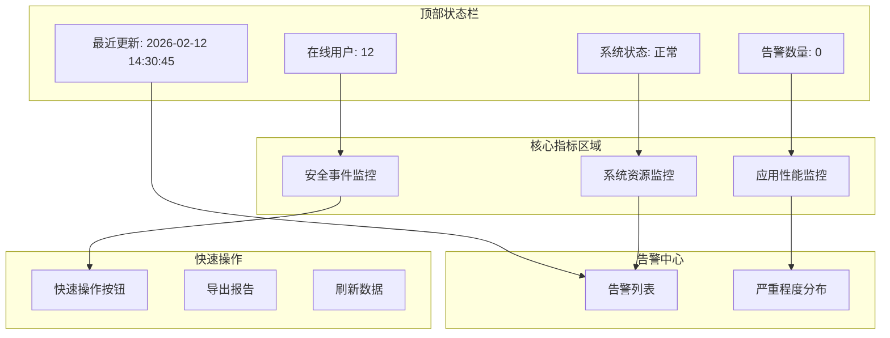

**图表来源**
- [企业网站CMS系统详细需求文档.md](file://企业网站CMS系统详细需求文档.md#L1417-L1422)

#### 历史趋势分析

| 分析维度 | 分析工具 | 时间范围 | 报告周期 |
|---------|---------|---------|---------|
| 系统资源 | 折线图、柱状图 | 1天/1周/1月 | 实时/日/周 |
| 应用性能 | 漏斗图、面积图 | 1天/1月/1年 | 日/周/月 |
| 安全事件 | 饼图、热力图 | 1天/1周/1月 | 日/周/月 |
| 用户行为 | 散点图、雷达图 | 1天/1月/1年 | 日/周/月 |

**章节来源**
- [企业网站CMS系统详细需求文档.md](file://企业网站CMS系统详细需求文档.md#L1417-L1422)

## 性能与可靠性考虑

### 性能监控指标

#### 响应时间指标

| 指标类型 | 目标值 | 监控范围 | 优化策略 |
|---------|---------|---------|---------|
| 首屏加载时间 | <2秒 | 1-5秒 | CDN加速、资源压缩 |
| 页面渲染时间 | <3秒 | 1-8秒 | 代码分割、懒加载 |
| API响应时间 | <500ms | 100-1000ms | 缓存优化、数据库优化 |
| 数据库查询时间 | <100ms | 50-200ms | 索引优化、连接池 |
| 文件上传时间 | <5秒/5MB | 1-10秒 | 断点续传、并发上传 |
| 图片处理时间 | <1秒/张 | 0.1-2秒 | 异步处理、缓存 |

#### 并发性能指标

| 指标类型 | 目标值 | 监控范围 | 优化策略 |
|---------|---------|---------|---------|
| 并发用户数 | >1000 | 100-2000 | 负载均衡、缓存 |
| QPS(每秒查询) | >500 | 100-1000 | 连接池优化、读写分离 |
| 数据库连接数 | >50 | 10-100 | 连接池配置、连接复用 |
| 内存使用 | <2GB | 1-3GB | 内存优化、垃圾回收 |
| CPU使用 | <70% | 30-90% | 负载均衡、垂直扩展 |
| 磁盘IO | <80% | 40-95% | IO优化、SSD |

### 可靠性保障措施

#### 系统可用性

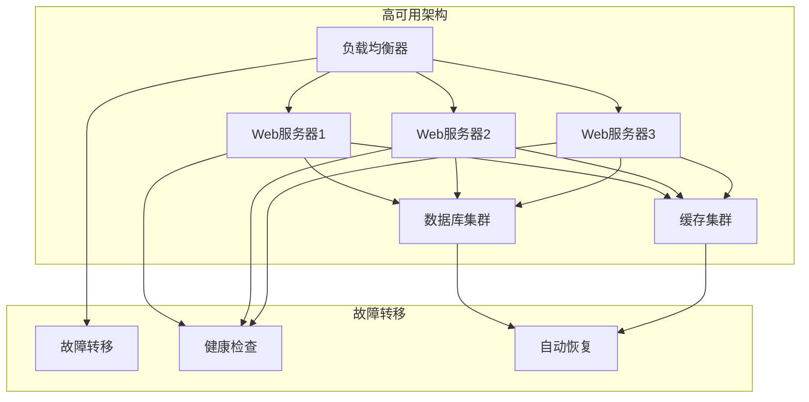

**图表来源**
- [企业网站CMS系统详细需求文档.md](file://企业网站CMS系统详细需求文档.md#L1402-L1416)

#### 备份与恢复

| 备份类型 | 备份频率 | 保留期限 | 恢复时间 | 恢复点 |
|---------|---------|---------|---------|---------|
| 数据库全量备份 | 每日 | 30天 | <30分钟 | 24小时 |
| 数据库增量备份 | 每小时 | 7天 | <1小时 | 1小时 |
| 文件系统备份 | 每日 | 30天 | <1小时 | 24小时 |
| 配置备份 | 实时 | 永久 | 立即 | 实时 |
| 日志备份 | 实时 | 180天 | 立即 | 实时 |
| 应用备份 | 每日 | 30天 | <30分钟 | 24小时 |

**章节来源**
- [企业网站CMS系统详细需求文档.md](file://企业网站CMS系统详细需求文档.md#L1402-L1416)

## 故障排除指南

### 常见问题诊断

#### 系统启动问题

| 问题现象 | 可能原因 | 诊断步骤 | 解决方案 |
|---------|---------|---------|---------|
| 应用无法启动 | 依赖缺失、配置错误 | 检查requirements.txt、查看启动日志 | 安装缺失依赖、修正配置文件 |
| 数据库连接失败 | 数据库服务未启动、连接字符串错误 | 检查数据库服务状态、验证连接参数 | 启动数据库服务、修正连接字符串 |
| 端口占用 | 端口被其他进程占用 | 检查端口使用情况 | 释放端口或更改端口号 |
| 权限不足 | 文件权限配置错误 | 检查文件和目录权限 | 设置正确的文件权限 |
| 环境变量缺失 | .env文件配置错误 | 检查环境变量设置 | 完善.env文件配置 |

#### 性能问题诊断

| 问题现象 | 可能原因 | 诊断工具 | 解决方案 |
|---------|---------|---------|---------|
| 响应时间慢 | 数据库查询慢、缓存未命中 | 慢查询日志、性能分析器 | 优化查询、增加缓存 |
| 内存泄漏 | 代码逻辑问题、第三方库bug | 内存分析工具、性能监控 | 修复代码问题、更新库版本 |
| CPU使用率高 | 算法复杂度高、并发处理不当 | 性能分析器、系统监控 | 优化算法、调整并发设置 |
| 磁盘空间不足 | 日志文件过大、临时文件未清理 | 磁盘空间监控、日志轮转 | 清理临时文件、配置日志轮转 |
| 网络延迟高 | 网络带宽不足、DNS解析慢 | 网络监控、DNS测试 | 升级网络带宽、优化DNS |

#### 安全问题诊断

| 问题现象 | 可能原因 | 诊断工具 | 解决方案 |
|---------|---------|---------|---------|
| 登录失败频繁 | 账户被锁定、密码错误 | 登录日志、安全审计 | 解锁账户、重置密码 |
| SQL注入攻击 | 代码存在SQL注入漏洞 | 安全扫描、代码审计 | 修复SQL注入漏洞、加强输入验证 |
| 文件上传异常 | 文件类型验证失败、恶意文件 | 文件上传日志、病毒扫描 | 修复文件验证逻辑、部署病毒扫描 |
| API暴力破解 | 缺少API限流、弱密码 | API访问日志、安全监控 | 配置API限流、强制密码策略 |
| 权限绕过 | 权限检查逻辑缺陷 | 权限测试、安全审计 | 修复权限检查逻辑、加强权限验证 |

### 故障处理流程

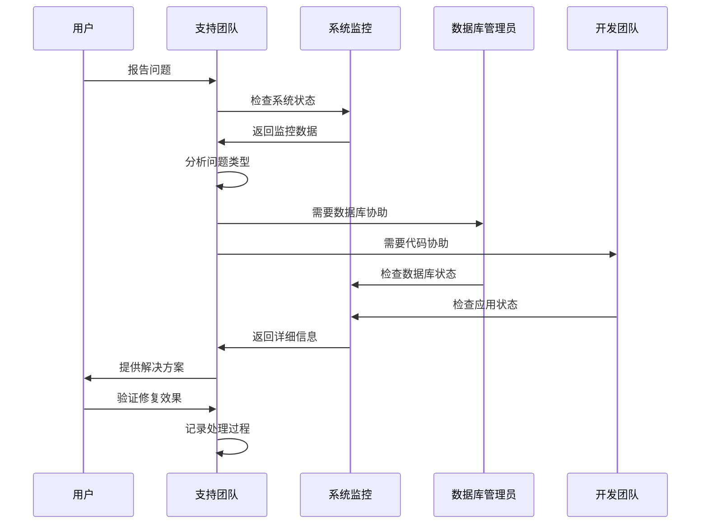

**图表来源**
- [企业网站CMS系统详细需求文档.md](file://企业网站CMS系统详细需求文档.md#L1417-L1422)

### 问题预防措施

#### 预防性维护

| 维护类型 | 维护频率 | 维护内容 | 预防效果 |
|---------|---------|---------|---------|
| 系统更新 | 每月 | 操作系统补丁、安全更新 | 减少系统漏洞 |
| 应用更新 | 每月 | 应用程序更新、依赖库升级 | 提升系统稳定性 |
| 数据库维护 | 每周 | 数据库优化、索引重建 | 提升数据库性能 |
| 磁盘清理 | 每月 | 临时文件清理、日志归档 | 释放磁盘空间 |
| 权限检查 | 每月 | 用户权限审计、权限调整 | 防止权限滥用 |
| 备份验证 | 每月 | 备份完整性检查、恢复测试 | 确保备份可用性 |

#### 监控告警配置

| 监控项目 | 告警阈值 | 告警级别 | 处理时限 |
|---------|---------|---------|---------|
| 系统负载 | >80% | 中级 | 30分钟 |
| 内存使用 | >90% | 高级 | 15分钟 |
| 磁盘空间 | <10% | 高级 | 1小时 |
| 网络延迟 | >1000ms | 中级 | 1小时 |
| API错误率 | >10% | 严重级 | 30分钟 |
| 登录失败 | >50次/小时 | 严重级 | 15分钟 |
| 数据库连接 | >90% | 高级 | 30分钟 |

**章节来源**
- [企业网站CMS系统详细需求文档.md](file://企业网站CMS系统详细需求文档.md#L1417-L1422)

## 结论

本安全监控与审计方案为企业的CMS系统提供了全面的安全保障框架。通过多层次的安全防护、完善的日志审计、实时的监控告警和标准化的应急响应流程，能够有效提升系统的安全性、稳定性和合规性。

### 主要成果

1. **完整的安全架构**: 从网络层到应用层的全方位安全防护
2. **实时监控能力**: 多维度指标监控和智能告警机制
3. **合规性保障**: 符合相关法律法规和行业标准
4. **应急响应体系**: 标准化的事件处理和恢复流程
5. **自动化工具**: 提升运维效率和准确性

### 实施建议

1. **分阶段实施**: 按照优先级逐步部署各项安全措施
2. **持续改进**: 定期评估和优化安全策略
3. **人员培训**: 提升团队的安全意识和技能
4. **定期演练**: 通过模拟攻击检验应急响应能力
5. **技术更新**: 跟进最新的安全技术和威胁情报

通过严格执行本方案，企业CMS系统将建立起坚实的安全防线，为业务的稳定发展提供有力保障。