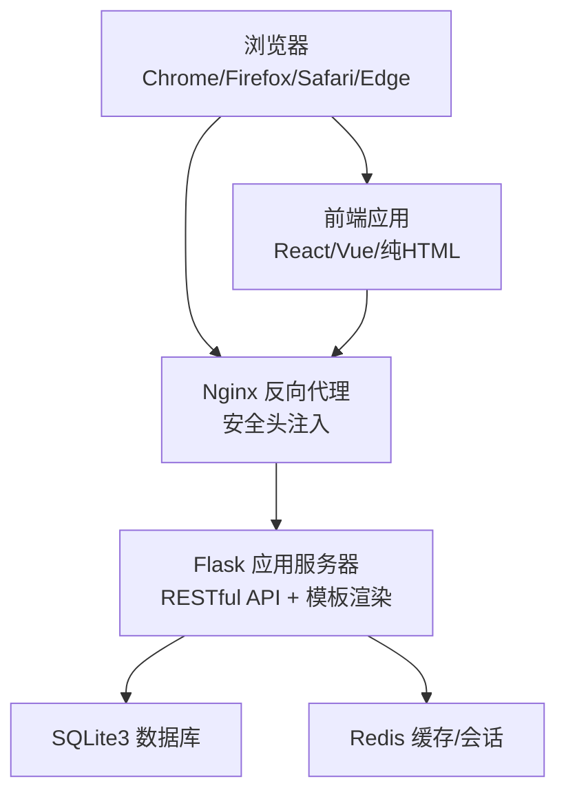
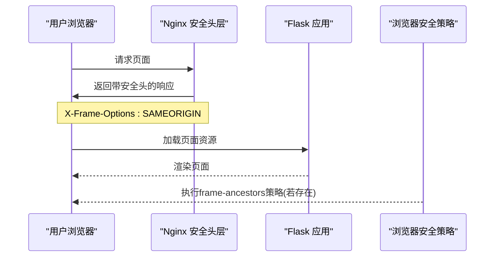
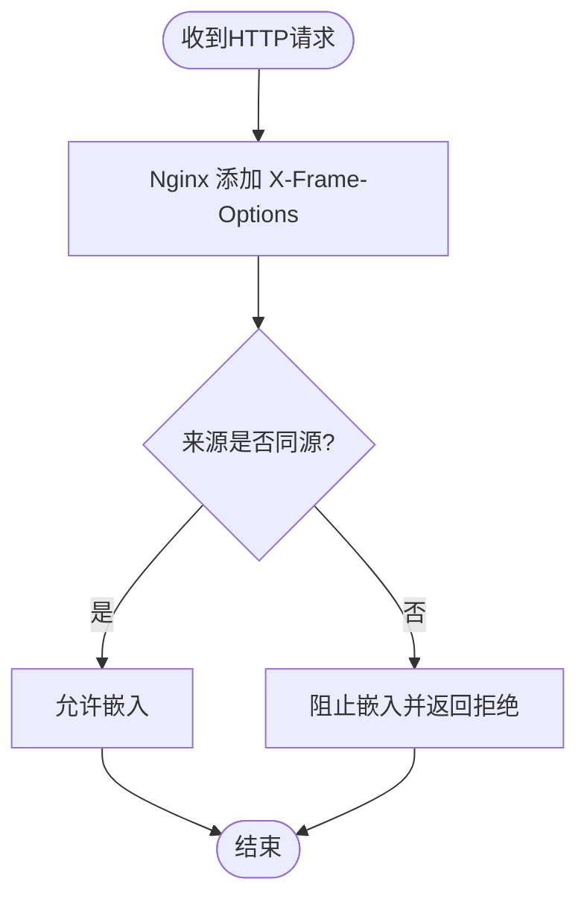
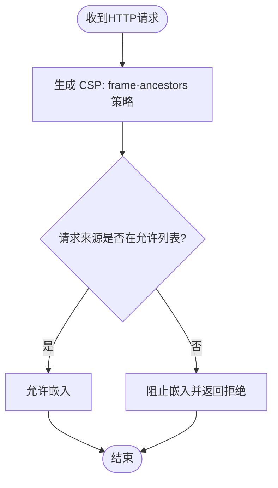
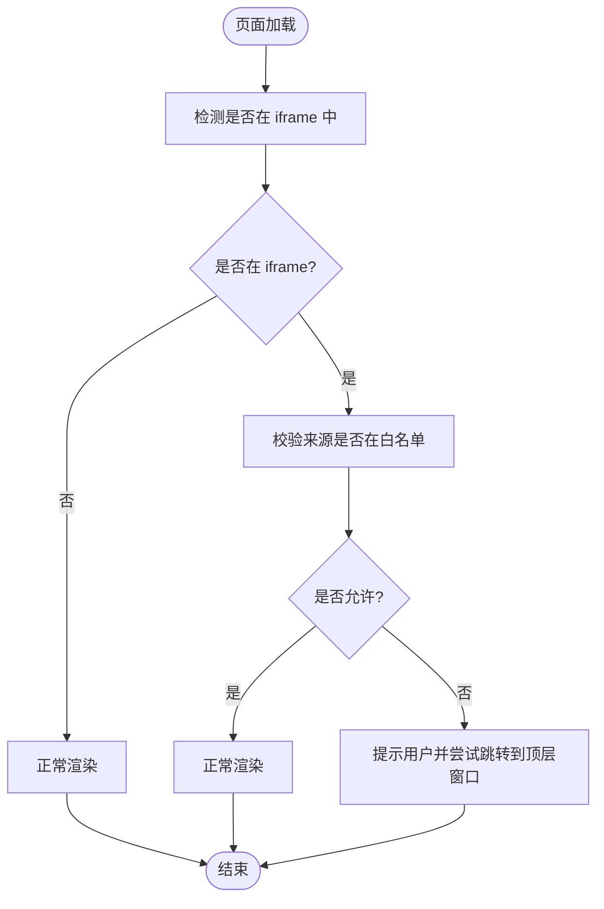
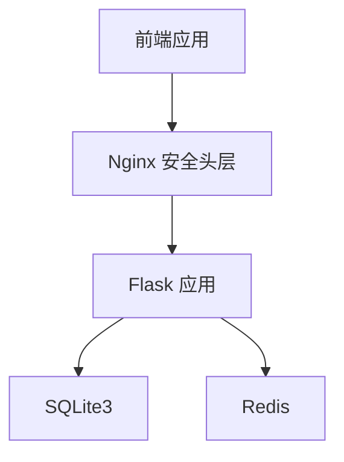

# 点击劫持防护

<cite>
**本文引用的文件**
- [企业网站CMS系统开发需求文档.ini](file://企业网站CMS系统开发需求文档.ini)
- [企业网站CMS系统详细需求文档.md](file://企业网站CMS系统详细需求文档.md)
</cite>

## 目录
1. [简介](#简介)
2. [项目结构](#项目结构)
3. [核心组件](#核心组件)
4. [架构总览](#架构总览)
5. [详细组件分析](#详细组件分析)
6. [依赖分析](#依赖分析)
7. [性能考量](#性能考量)
8. [故障排查指南](#故障排查指南)
9. [结论](#结论)
10. [附录](#附录)

## 简介
点击劫持（Clickjacking）是一种常见的Web安全攻击，攻击者通过在透明层或iframe中隐藏真实交互元素，诱使用户在不知情的情况下执行恶意操作。本文件围绕点击劫持的原理与危害、X-Frame-Options与Content Security Policy中的frame-ancestors策略、现代浏览器的替代方案与最佳实践，以及在本CMS系统中的部署与配置差异进行系统化说明，并结合本项目的实际技术栈与部署架构给出落地建议。

## 项目结构
本项目采用前后端分离架构，前端可选React/Vue或纯HTML模板渲染，后端基于Flask提供RESTful API，Nginx作为反向代理与安全头注入层，部署于Windows Server环境。该架构为点击劫持防护提供了清晰的分层边界：Nginx负责统一的安全响应头下发，Flask负责业务逻辑与API，前端负责用户体验与交互。

**图表来源**
- [企业网站CMS系统详细需求文档.md](file://企业网站CMS系统详细需求文档.md#L28-L57)

**章节来源**
- [企业网站CMS系统详细需求文档.md](file://企业网站CMS系统详细需求文档.md#L28-L57)

## 核心组件
- Nginx安全头层：统一注入X-Frame-Options、X-Content-Type-Options、X-XSS-Protection等安全头，作为第一道防线。
- Flask后端：提供API与模板渲染，配合CORS、CSRF、JWT等安全机制。
- 前端应用：负责用户交互与组件渲染，需遵循CSP策略并避免不安全的iframe使用。
- 数据库与缓存：SQLite3与Redis，保障数据与会话安全。

**章节来源**
- [企业网站CMS系统详细需求文档.md](file://企业网站CMS系统详细需求文档.md#L1143-L1230)
- [企业网站CMS系统详细需求文档.md](file://企业网站CMS系统详细需求文档.md#L1232-L1322)

## 架构总览
点击劫持防护在本项目中的整体流程如下：
- Nginx在HTTP响应中添加X-Frame-Options，阻止页面被嵌入到不受信任的iframe中。
- 若需要更严格的策略，可在Nginx或Flask中增加Content Security Policy的frame-ancestors指令，限定允许嵌入的来源。
- 前端在需要嵌入第三方内容时，应遵循CSP策略，避免使用不受信任的外部iframe。
- 对于需要与第三方集成的场景，应通过allow-from策略或严格白名单控制，避免滥用frame-ancestors导致的安全隐患。

**图表来源**
- [企业网站CMS系统详细需求文档.md](file://企业网站CMS系统详细需求文档.md#L1172-L1175)

**章节来源**
- [企业网站CMS系统详细需求文档.md](file://企业网站CMS系统详细需求文档.md#L1143-L1230)

## 详细组件分析

### X-Frame-Options 响应头配置
- 作用：控制页面是否可以被嵌入到<iframe>中，有效抵御点击劫持。
- 在本项目中，Nginx已默认注入X-Frame-Options为SAMEORIGIN，仅允许同源页面嵌入自身，这是最常见且兼容性良好的做法。
- 兼容性：X-Frame-Options在主流浏览器中广泛支持；现代浏览器更推荐使用Content Security Policy的frame-ancestors指令。

**图表来源**
- [企业网站CMS系统详细需求文档.md](file://企业网站CMS系统详细需求文档.md#L1172-L1175)

**章节来源**
- [企业网站CMS系统详细需求文档.md](file://企业网站CMS系统详细需求文档.md#L1143-L1230)

### Content Security Policy 的 frame-ancestors 指令
- 作用：通过CSP精确控制哪些来源可以将页面嵌入到iframe中，提供比X-Frame-Options更强的策略表达能力。
- allow-from：允许指定来源的页面嵌入当前页面，但已被现代浏览器逐步弃用，建议使用frame-ancestors替代。
- deny-all：完全禁止任何来源嵌入，适用于高度敏感页面。
- 替代方案：现代浏览器推荐使用frame-ancestors，支持allow-from与deny-all等策略组合，且具备更好的可维护性与灵活性。

**图表来源**
- [企业网站CMS系统详细需求文档.md](file://企业网站CMS系统详细需求文档.md#L1172-L1175)

**章节来源**
- [企业网站CMS系统详细需求文档.md](file://企业网站CMS系统详细需求文档.md#L1143-L1230)

### 现代浏览器的 frame-ancestors 替代方案与最佳实践
- 替代方案：使用Content Security Policy的frame-ancestors指令替代X-Frame-Options，支持更细粒度的来源控制。
- 最佳实践：
  - 对于内部管理后台与敏感页面，使用deny-all或严格白名单。
  - 对于对外展示页面，使用allow-from或仅允许特定可信域名。
  - 结合HSTS、X-Content-Type-Options、X-XSS-Protection等安全头，形成纵深防御。
  - 在开发与测试环境中启用report-only模式，收集策略执行报告，逐步收紧策略。

**章节来源**
- [企业网站CMS系统详细需求文档.md](file://企业网站CMS系统详细需求文档.md#L1143-L1230)

### JavaScript 检测与防御（概念性说明）
- 检测思路：通过JavaScript检测页面是否处于iframe中，若处于iframe且来源不在白名单，则采取保护措施（例如提示用户、跳转至顶层窗口或显示安全警告）。
- 防御思路：在页面中加入防点击劫持的JavaScript代码，例如通过CSS层叠与z-index控制、事件拦截、或主动跳转到顶层窗口等方式降低被点击劫持的风险。
- 注意事项：JavaScript检测与防御并非万能，仍需配合服务端安全头与CSP策略，形成多层防护。

**图表来源**
- [企业网站CMS系统详细需求文档.md](file://企业网站CMS系统详细需求文档.md#L1143-L1230)

**章节来源**
- [企业网站CMS系统详细需求文档.md](file://企业网站CMS系统详细需求文档.md#L1143-L1230)

### 点击劫持防护在不同应用场景下的配置差异
- 内部管理后台：建议使用deny-all或严格白名单，确保只有内部可信域名可嵌入。
- 对外展示页面：可使用allow-from或仅允许特定可信域名，避免第三方恶意嵌入。
- 嵌入式内容（如第三方组件）：应在CSP中明确allow-from策略，仅允许必要的第三方域名；同时在前端组件中避免使用不受信任的iframe。
- 第三方集成：通过allow-from策略限定来源，定期审查与审计第三方集成的安全性；必要时采用沙箱iframe与最小权限原则。

**章节来源**
- [企业网站CMS系统详细需求文档.md](file://企业网站CMS系统详细需求文档.md#L1143-L1230)

## 依赖分析
- Nginx与Flask之间的耦合：Nginx负责安全头注入，Flask负责业务逻辑，二者通过反向代理协作，降低直接暴露后端的风险。
- 前端与后端的耦合：前端通过API与后端交互，需遵循CSP策略，避免引入不受信任的第三方资源。
- 数据与缓存：SQLite3与Redis分别承担数据持久化与会话/缓存，需确保访问控制与传输加密。

**图表来源**
- [企业网站CMS系统详细需求文档.md](file://企业网站CMS系统详细需求文档.md#L28-L57)

**章节来源**
- [企业网站CMS系统详细需求文档.md](file://企业网站CMS系统详细需求文档.md#L28-L57)

## 性能考量
- 安全头的注入不会显著影响性能，但应避免过度复杂的CSP策略导致解析与执行开销。
- 对于高并发场景，建议在Nginx层面集中处理安全头与CSP策略，减少后端负担。
- 在开发与测试环境中启用CSP report-only模式，收集策略执行报告，逐步收紧策略，避免因策略过于严格影响用户体验。

[本节为一般性指导，不直接分析具体文件]

## 故障排查指南
- 页面无法在iframe中嵌入：检查X-Frame-Options与CSP的frame-ancestors策略，确认来源是否在允许列表。
- 第三方组件无法加载：检查CSP策略是否允许第三方域名，必要时调整allow-from策略。
- 安全头未生效：确认Nginx配置正确，且未被后端覆盖；检查浏览器开发者工具Network面板中的响应头。
- 管理后台被嵌入：确认使用了deny-all或严格白名单策略，避免任何第三方嵌入。

**章节来源**
- [企业网站CMS系统详细需求文档.md](file://企业网站CMS系统详细需求文档.md#L1143-L1230)

## 结论
点击劫持防护应采用“服务端安全头 + CSP策略 + 前端最小权限”的综合方案。在本项目中，Nginx已提供X-Frame-Options的基础防护，建议在此基础上引入CSP的frame-ancestors指令，结合deny-all与allow-from策略，针对不同应用场景制定差异化配置，并通过report-only模式持续优化策略，最终形成稳定、可维护、可审计的点击劫持防护体系。

[本节为总结性内容，不直接分析具体文件]

## 附录
- 相关技术术语：X-Frame-Options、Content Security Policy、frame-ancestors、allow-from、deny-all、CSP report-only。
- 参考资料：Flask、Nginx、React/Vue等官方文档与安全最佳实践。

**章节来源**
- [企业网站CMS系统详细需求文档.md](file://企业网站CMS系统详细需求文档.md#L1978-L1992)