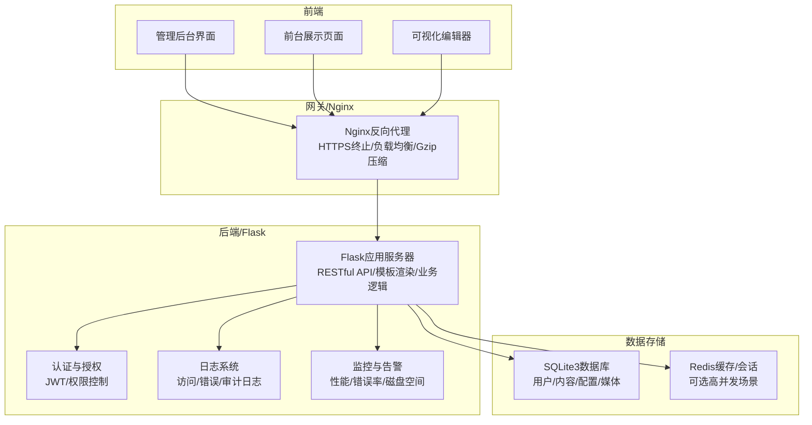
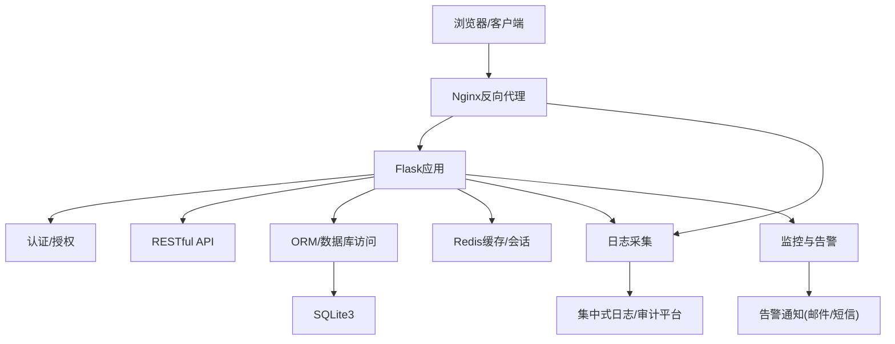
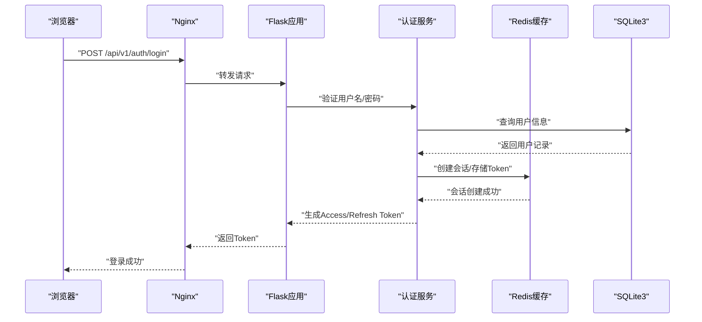
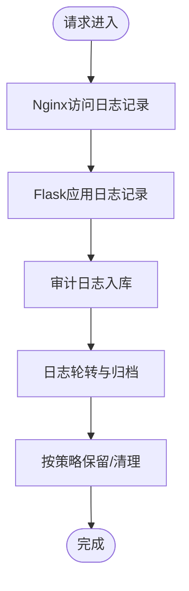
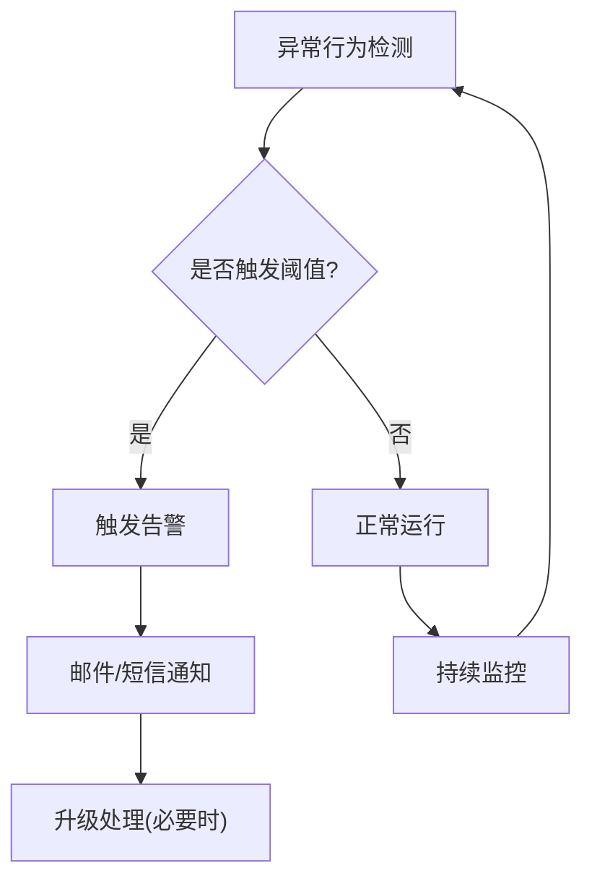
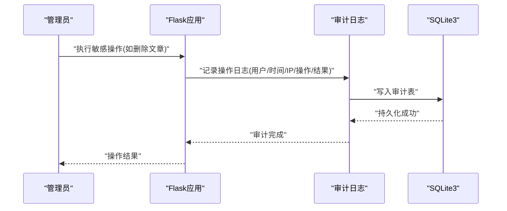
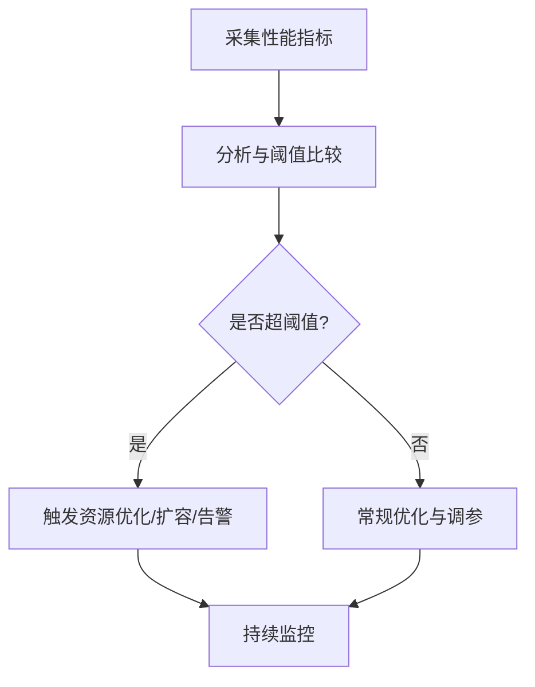
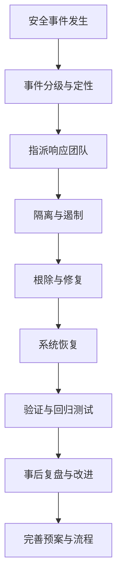
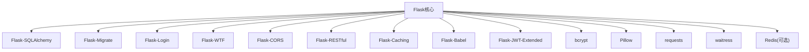

# 安全监控

<cite>
**本文引用的文件**
- [企业网站CMS系统开发需求文档.ini](file://企业网站CMS系统开发需求文档.ini)
- [企业网站CMS系统详细需求文档.md](file://企业网站CMS系统详细需求文档.md)
</cite>

## 目录
1. [引言](#引言)
2. [项目结构](#项目结构)
3. [核心组件](#核心组件)
4. [架构总览](#架构总览)
5. [详细组件分析](#详细组件分析)
6. [依赖分析](#依赖分析)
7. [性能考虑](#性能考虑)
8. [故障排除指南](#故障排除指南)
9. [结论](#结论)
10. [附录](#附录)

## 引言
本文件面向企业网站CMS系统的安全监控与审计，围绕访问日志记录、异常行为检测、安全事件告警、用户行为审计、操作日志追踪、敏感操作监控、系统性能监控、资源使用异常检测、安全基线检查、安全漏洞扫描工具集成、定期安全评估与补丁管理流程、应急响应预案、事件处理流程与恢复策略、合规性检查、安全培训与安全意识提升方案等方面进行全面阐述。文档基于现有需求文档中的技术栈与安全要求，结合实际工程实践，提供可落地的实施方案与最佳实践。

## 项目结构
CMS系统采用前后端分离架构，后端基于Python Flask + Nginx + Windows Server，前端可采用React/Vue或纯HTML模板渲染。系统包含用户权限管理、内容管理、媒体库管理、系统配置、多语言支持、SEO优化、性能优化等模块。安全方面强调XSS/CSRF防护、SQL注入防护、文件上传安全验证、HTTPS传输加密等基础要求，并在非功能性需求中明确了审计日志、数据加密、备份策略、监控告警等安全运维能力。

**图表来源**
- [企业网站CMS系统详细需求文档.md](file://企业网站CMS系统详细需求文档.md#L28-L57)
- [企业网站CMS系统详细需求文档.md](file://企业网站CMS系统详细需求文档.md#L1143-L1230)
- [企业网站CMS系统详细需求文档.md](file://企业网站CMS系统详细需求文档.md#L1232-L1302)

**章节来源**
- [企业网站CMS系统详细需求文档.md](file://企业网站CMS系统详细需求文档.md#L22-L57)
- [企业网站CMS系统详细需求文档.md](file://企业网站CMS系统详细需求文档.md#L1143-L1230)
- [企业网站CMS系统详细需求文档.md](file://企业网站CMS系统详细需求文档.md#L1232-L1302)

## 核心组件
- 认证与授权：基于JWT的Token机制，支持Access Token与Refresh Token，配合Flask-Login与Flask-JWT-Extended实现用户认证与权限控制。
- 日志系统：使用Python logging模块与RotatingFileHandler，结合Nginx访问日志与错误日志，形成统一的日志采集与归档。
- 安全防护：XSS/CSRF防护、SQL注入防护、文件上传安全验证、HTTPS强制跳转、CSP头、HSTS头等。
- 监控与告警：服务状态监控、性能指标监控、错误率监控、磁盘空间监控，支持邮件/短信告警。
- 备份与恢复：数据库每日全量备份、文件每日增量备份、异地备份至云存储，RTO/RPO目标明确。
- 部署与运维：Nginx配置示例、Windows服务注册（NSSM）、Waitress WSGI服务器、Redis可选缓存。

**章节来源**
- [企业网站CMS系统详细需求文档.md](file://企业网站CMS系统详细需求文档.md#L1078-L1140)
- [企业网站CMS系统详细需求文档.md](file://企业网站CMS系统详细需求文档.md#L1381-L1423)
- [企业网站CMS系统详细需求文档.md](file://企业网站CMS系统详细需求文档.md#L1406-L1416)
- [企业网站CMS系统详细需求文档.md](file://企业网站CMS系统详细需求文档.md#L1143-L1230)
- [企业网站CMS系统详细需求文档.md](file://企业网站CMS系统详细需求文档.md#L1324-L1356)

## 架构总览
系统采用“前端静态/SPA + Nginx反向代理 + Flask后端API + SQLite3/Redis”的轻量级架构。Nginx负责HTTPS终止、静态资源服务、Gzip压缩与反向代理；Flask提供RESTful API与模板渲染；SQLite3作为主数据库，Redis用于缓存与会话（可选）；日志系统贯穿前后端，统一采集访问、错误与审计日志；监控系统对服务状态、性能指标与资源使用进行持续观测并触发告警。

**图表来源**
- [企业网站CMS系统详细需求文档.md](file://企业网站CMS系统详细需求文档.md#L28-L57)
- [企业网站CMS系统详细需求文档.md](file://企业网站CMS系统详细需求文档.md#L1143-L1230)
- [企业网站CMS系统详细需求文档.md](file://企业网站CMS系统详细需求文档.md#L1381-L1423)

## 详细组件分析

### 认证与授权安全监控
- Token生命周期管理：Access Token与Refresh Token的有效期配置，Token刷新机制，异常登录检测（IP/设备变化）。
- 会话与缓存：Session存储在Redis，支持单点/多点登录配置，结合限流策略防止暴力破解。
- 权限控制：RBAC模型，基于角色的访问控制，装饰器方式的权限验证，细粒度模块与操作级权限。

**图表来源**
- [企业网站CMS系统详细需求文档.md](file://企业网站CMS系统详细需求文档.md#L1080-L1098)
- [企业网站CMS系统详细需求文档.md](file://企业网站CMS系统详细需求文档.md#L1232-L1302)

**章节来源**
- [企业网站CMS系统详细需求文档.md](file://企业网站CMS系统详细需求文档.md#L1080-L1098)
- [企业网站CMS系统详细需求文档.md](file://企业网站CMS系统详细需求文档.md#L1232-L1302)

### 访问日志记录与审计
- 日志采集：Nginx访问日志与错误日志、Flask应用日志、SQLite慢查询日志（可选）。使用RotatingFileHandler实现日志轮转。
- 审计维度：用户登录日志、操作审计日志、错误日志、安全事件日志。审计日志应包含时间戳、用户标识、操作类型、IP地址、UA、结果状态等。
- 存储与保留：日志文件按天轮转，保留周期符合法规与内部策略要求；支持集中式日志收集与检索。

**图表来源**
- [企业网站CMS系统详细需求文档.md](file://企业网站CMS系统详细需求文档.md#L655-L659)
- [企业网站CMS系统详细需求文档.md](file://企业网站CMS系统详细需求文档.md#L1391-L1396)

**章节来源**
- [企业网站CMS系统详细需求文档.md](file://企业网站CMS系统详细需求文档.md#L655-L659)
- [企业网站CMS系统详细需求文档.md](file://企业网站CMS系统详细需求文档.md#L1391-L1396)

### 异常行为检测与安全事件告警
- 异常检测：登录失败锁定（5次失败锁定30分钟）、异常登录检测（IP/设备变化）、API访问频率限制（Flask-Limiter）、文件上传安全规则（类型白名单、大小限制、随机化文件名）。
- 告警机制：服务状态监控、性能指标监控、错误率监控、磁盘空间监控，支持邮件/短信告警；可接入Sentry进行错误追踪与告警。

**图表来源**
- [企业网站CMS系统详细需求文档.md](file://企业网站CMS系统详细需求文档.md#L1130-L1140)
- [企业网站CMS系统详细需求文档.md](file://企业网站CMS系统详细需求文档.md#L1417-L1422)
- [企业网站CMS系统详细需求文档.md](file://企业网站CMS系统详细需求文档.md#L655-L659)

**章节来源**
- [企业网站CMS系统详细需求文档.md](file://企业网站CMS系统详细需求文档.md#L1130-L1140)
- [企业网站CMS系统详细需求文档.md](file://企业网站CMS系统详细需求文档.md#L1417-L1422)
- [企业网站CMS系统详细需求文档.md](file://企业网站CMS系统详细需求文档.md#L655-L659)

### 用户行为审计与敏感操作监控
- 用户行为审计：登录登出、内容创建/修改/删除、媒体上传/删除、系统配置变更、备份/恢复操作等。
- 敏感操作监控：密码重置、角色分配、权限变更、数据导出、批量删除等高风险操作需二次确认与审计。
- 数据完整性：操作前后对比、版本历史/恢复（文章版本历史）。

**图表来源**
- [企业网站CMS系统详细需求文档.md](file://企业网站CMS系统详细需求文档.md#L294-L317)
- [企业网站CMS系统详细需求文档.md](file://企业网站CMS系统详细需求文档.md#L1391-L1396)

**章节来源**
- [企业网站CMS系统详细需求文档.md](file://企业网站CMS系统详细需求文档.md#L294-L317)
- [企业网站CMS系统详细需求文档.md](file://企业网站CMS系统详细需求文档.md#L1391-L1396)

### 系统性能监控与资源使用异常检测
- 性能指标：页面加载时间、API响应时间、数据库查询时间、并发用户数、QPS、内存/CPU/磁盘IO使用率。
- 资源异常检测：磁盘空间不足、CPU/内存使用率过高、数据库连接池耗尽、Redis不可用等。
- 监控工具：Flask-Profiler（可选）、日志分析、Nginx指标、系统级监控（Windows Server）。

**图表来源**
- [企业网站CMS系统详细需求文档.md](file://企业网站CMS系统详细需求文档.md#L1362-L1380)
- [企业网站CMS系统详细需求文档.md](file://企业网站CMS系统详细需求文档.md#L1417-L1422)

**章节来源**
- [企业网站CMS系统详细需求文档.md](file://企业网站CMS系统详细需求文档.md#L1362-L1380)
- [企业网站CMS系统详细需求文档.md](file://企业网站CMS系统详细需求文档.md#L1417-L1422)

### 安全基线检查与漏洞扫描
- 安全基线：HTTPS强制跳转、CSP/HSTS头、CSRF防护、XSS防护、SQL注入防护、文件上传安全规则、密码加密存储。
- 漏洞扫描：定期进行静态代码分析（SAST）、依赖漏洞扫描（DAST/SCA）、渗透测试；对第三方组件与依赖库进行版本管理与补丁更新。
- 合规性：遵循ISO 27001/27002等标准，满足数据保护与隐私要求。

**章节来源**
- [企业网站CMS系统详细需求文档.md](file://企业网站CMS系统详细需求文档.md#L1078-L1140)
- [企业网站CMS系统详细需求文档.md](file://企业网站CMS系统详细需求文档.md#L1381-L1396)

### 安全评估与补丁管理流程
- 定期安全评估：季度安全评估、年度渗透测试、合规性审计；对日志与告警进行回顾与改进。
- 补丁管理：建立补丁审批流程、测试环境验证、灰度发布策略、回滚预案；对关键组件（Nginx、Flask、依赖库、操作系统）进行版本跟踪与更新。

**章节来源**
- [企业网站CMS系统详细需求文档.md](file://企业网站CMS系统详细需求文档.md#L1381-L1396)

### 应急响应预案与事件处理流程
- 预案制定：明确事件分级（轻微/一般/严重/特别重大）、响应团队职责、处置流程与时限。
- 事件处理：事件发现与上报、影响评估、处置与隔离、恢复与验证、事后分析与改进。
- 恢复策略：RTO/RPO目标下的备份恢复测试、灾难恢复演练、服务降级与容灾切换。

**图表来源**
- [企业网站CMS系统详细需求文档.md](file://企业网站CMS系统详细需求文档.md#L1412-L1416)

**章节来源**
- [企业网站CMS系统详细需求文档.md](file://企业网站CMS系统详细需求文档.md#L1412-L1416)

### 合规性检查与安全培训
- 合规性：数据保护与隐私合规、行业标准符合性、内部审计与外部审计。
- 培训与意识：管理员与编辑人员的安全培训、安全意识提升活动、定期演练与考核。

**章节来源**
- [企业网站CMS系统详细需求文档.md](file://企业网站CMS系统详细需求文档.md#L1450-L1460)

## 依赖分析
- 技术栈依赖：Flask生态（SQLAlchemy、Migrate、Login、WTF、CORS、RESTful、Caching、Babel、JWT-Extended）、Redis（可选）、Pillow、bcrypt、dotenv、requests、waitress。
- 部署依赖：Nginx、Windows Server、NSSM服务管理器、SSL证书、CDN（可选）。
- 监控与日志：logging模块、RotatingFileHandler、可选Sentry、Flask-Profiler。

**图表来源**
- [企业网站CMS系统详细需求文档.md](file://企业网站CMS系统详细需求文档.md#L1304-L1322)

**章节来源**
- [企业网站CMS系统详细需求文档.md](file://企业网站CMS系统详细需求文档.md#L1304-L1322)

## 性能考虑
- 响应时间与并发：首页加载<2秒、内页加载<3秒、API响应<500ms、数据库查询<100ms、并发用户>1000。
- 资源占用：内存使用<2GB、CPU使用<70%、磁盘IO<80%。
- 优化手段：页面缓存（Redis）、数据缓存、静态资源缓存、图片懒加载、CDN加速、Gzip压缩、索引优化、连接池配置、慢查询日志。

**章节来源**
- [企业网站CMS系统详细需求文档.md](file://企业网站CMS系统详细需求文档.md#L1362-L1380)
- [企业网站CMS系统详细需求文档.md](file://企业网站CMS系统详细需求文档.md#L512-L548)

## 故障排除指南
- 常见问题：登录失败、权限不足、文件上传失败、页面加载缓慢、API响应超时、Nginx代理错误。
- 排查步骤：检查Nginx访问/错误日志、Flask应用日志、数据库连接状态、Redis可用性、文件权限与存储空间、防火墙与端口开放情况。
- 处理建议：启用详细日志级别、增加限流与熔断、优化缓存策略、升级硬件或引入CDN、进行安全加固与补丁更新。

**章节来源**
- [企业网站CMS系统详细需求文档.md](file://企业网站CMS系统详细需求文档.md#L1417-L1423)
- [企业网站CMS系统详细需求文档.md](file://企业网站CMS系统详细需求文档.md#L1143-L1230)

## 结论
本安全监控体系以“日志审计+异常检测+告警联动+备份恢复+合规培训”为核心，结合Flask生态与Windows Server环境，构建了覆盖认证授权、访问控制、数据安全、性能监控与应急响应的完整闭环。通过持续的安全评估、漏洞扫描与补丁管理，以及完善的培训与意识提升，确保系统在稳定运行的同时满足企业级安全与合规要求。

## 附录
- 配置参考：Nginx配置示例、Flask配置文件、Windows服务注册脚本、环境变量配置。
- 工具与资源：Sentry（错误追踪）、Flask-Profiler（性能分析）、日志轮转工具、备份脚本模板。

**章节来源**
- [企业网站CMS系统详细需求文档.md](file://企业网站CMS系统详细需求文档.md#L1143-L1230)
- [企业网站CMS系统详细需求文档.md](file://企业网站CMS系统详细需求文档.md#L1232-L1302)
- [企业网站CMS系统详细需求文档.md](file://企业网站CMS系统详细需求文档.md#L1324-L1356)