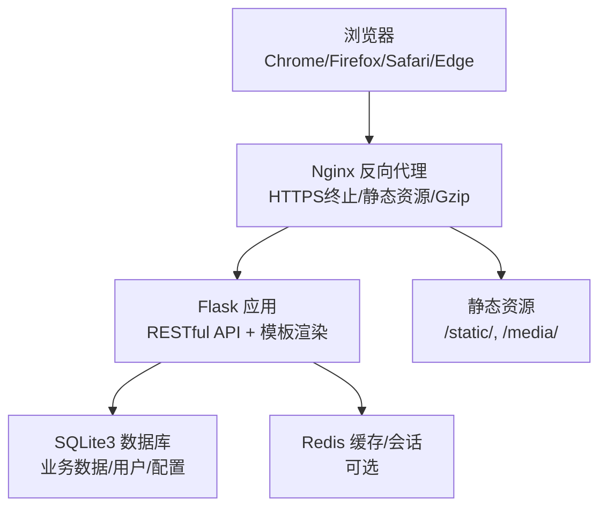
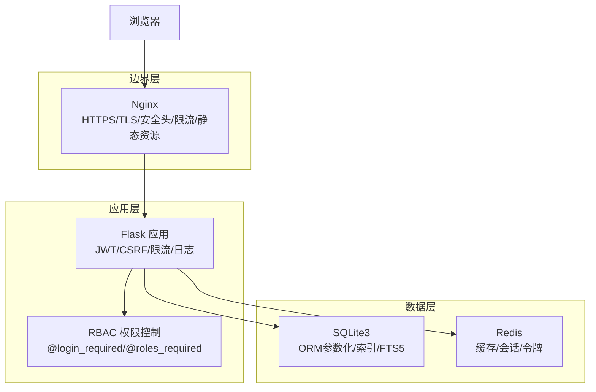
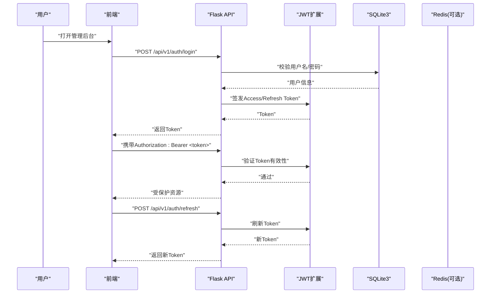
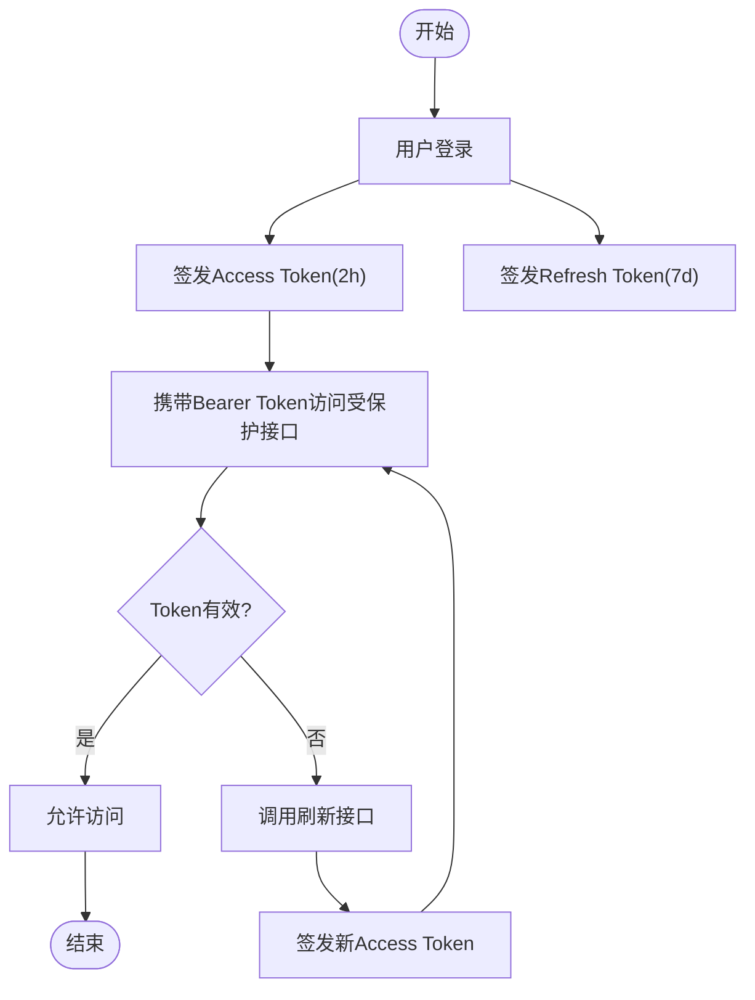
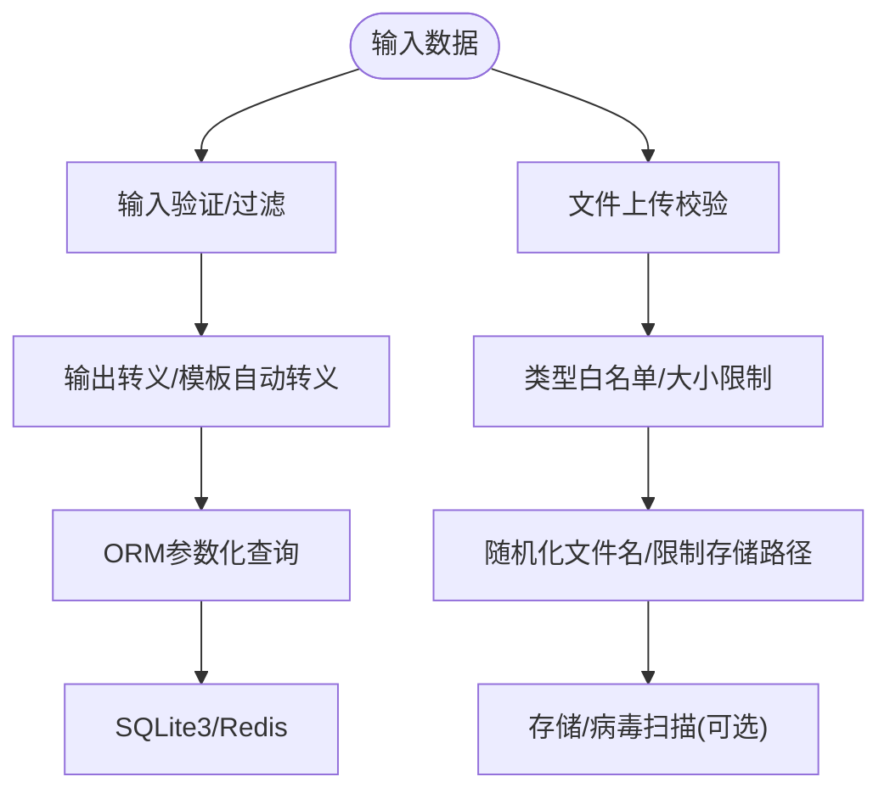
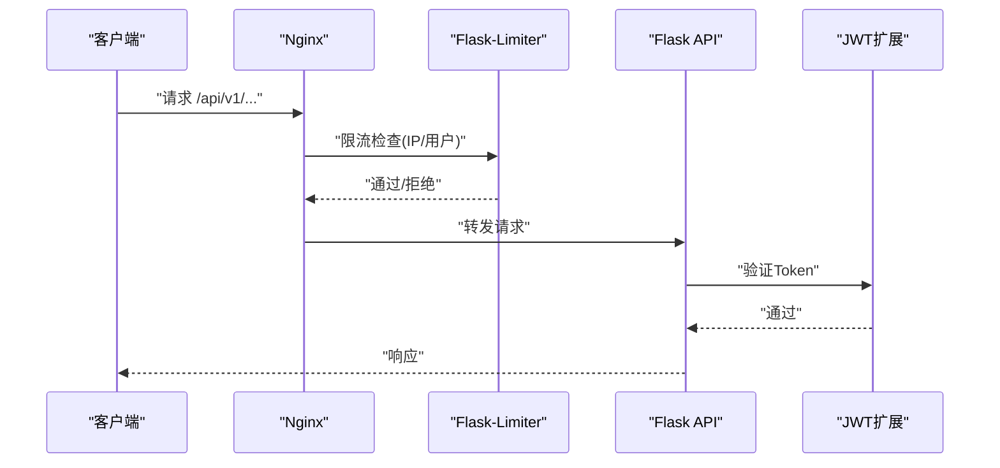
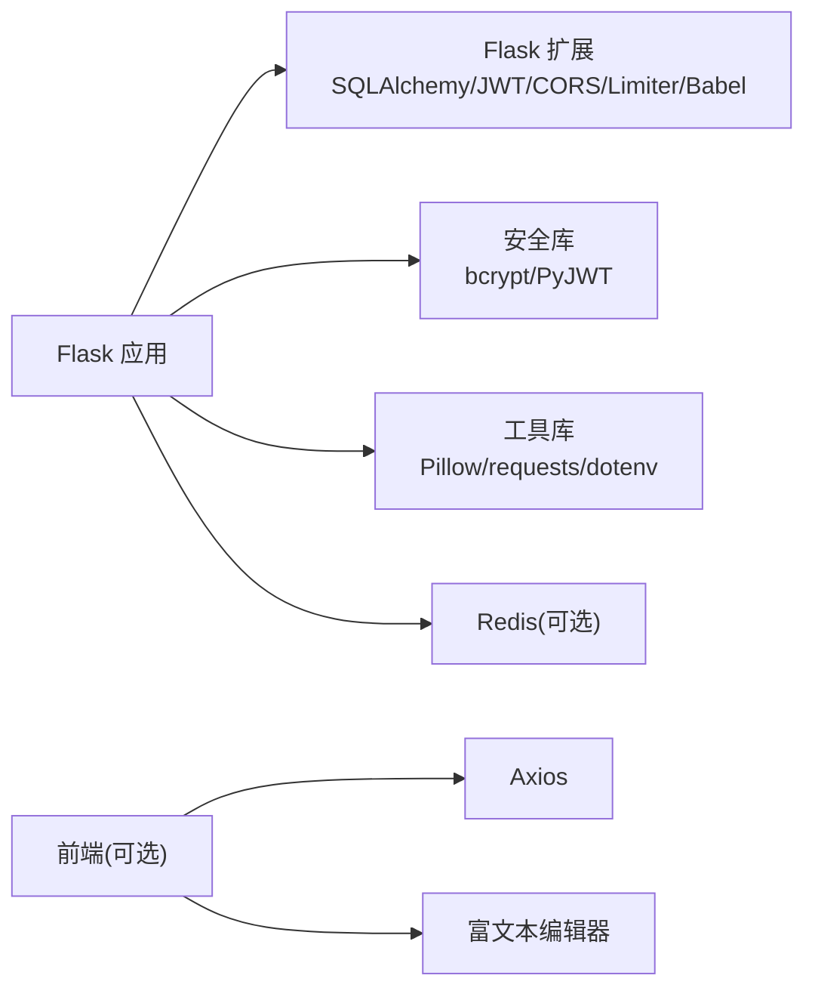

# 安全设计

<cite>
**本文引用的文件**
- [企业网站CMS系统开发需求文档.ini](file://企业网站CMS系统开发需求文档.ini)
- [企业网站CMS系统详细需求文档.md](file://企业网站CMS系统详细需求文档.md)
</cite>

## 目录
1. [引言](#引言)
2. [项目结构](#项目结构)
3. [核心组件](#核心组件)
4. [架构总览](#架构总览)
5. [详细组件分析](#详细组件分析)
6. [依赖分析](#依赖分析)
7. [性能考量](#性能考量)
8. [故障排查指南](#故障排查指南)
9. [结论](#结论)
10. [附录](#附录)

## 引言
本安全设计文档面向企业网站CMS系统，聚焦系统安全架构、威胁模型与防护措施，覆盖认证与授权、JWT身份验证与会话管理、数据安全与传输加密、API安全与输入输出治理、常见攻击（XSS、CSRF、SQL注入）的防护策略，并提供安全配置指南、漏洞扫描与渗透测试建议、安全监控与审计、应急响应机制以及合规性与最佳实践。本文档基于项目需求文档中的技术栈与安全要求进行系统化梳理与落地建议。

## 项目结构
系统采用前后端分离架构，后端基于Python Flask + Nginx + Windows Server，支持纯HTML模板渲染与SPA两种模式；数据库采用SQLite3（默认），可选Redis用于缓存与会话；部署通过Nginx反向代理、Gunicorn/Waitress提供WSGI服务，结合Windows服务管理器（NSSM）实现开机自启与崩溃重启。

**图表来源**
- [企业网站CMS系统详细需求文档.md](file://企业网站CMS系统详细需求文档.md#L22-L57)

**章节来源**
- [企业网站CMS系统详细需求文档.md](file://企业网站CMS系统详细需求文档.md#L22-L57)

## 核心组件
- 认证与授权：基于Flask-Login与Flask-JWT-Extended，RBAC模型，角色与权限解耦，支持多角色与细粒度权限控制。
- 会话与令牌：JWT访问令牌与刷新令牌，支持LocalStorage/Cookie存储与自动刷新；可选Redis存储Session。
- 数据安全：ORM参数化查询、输入校验、输出转义（Jinja2自动转义）、CSP头、HTTPS/HSTS、敏感数据加密。
- API安全：Flask-Limiter限流、CSRF Token、SameSite Cookie、双重提交Cookie、API密钥加密存储与轮换。
- 文件上传安全：类型白名单、大小限制、随机化文件名、存储路径限制、病毒扫描（可选）。
- 部署与传输：Nginx强制HTTPS跳转、安全响应头、Gzip压缩、CDN支持、SSL/TLS 1.2+。

**章节来源**
- [企业网站CMS系统详细需求文档.md](file://企业网站CMS系统详细需求文档.md#L1078-L1140)
- [企业网站CMS系统详细需求文档.md](file://企业网站CMS系统详细需求文档.md#L1234-L1322)

## 架构总览
系统安全围绕“边界防护（Nginx）—应用防护（Flask中间件/装饰器）—数据防护（ORM/加密/校验）—传输防护（TLS/HSTS）”的层次化设计展开，强调最小暴露面与纵深防御。

**图表来源**
- [企业网站CMS系统详细需求文档.md](file://企业网站CMS系统详细需求文档.md#L1143-L1230)
- [企业网站CMS系统详细需求文档.md](file://企业网站CMS系统详细需求文档.md#L1234-L1322)

## 详细组件分析

### 认证与授权机制
- 角色与权限模型：采用RBAC，用户-角色-权限三层关系，支持模块级、操作级、数据级权限控制。
- 认证方式：JWT Token（Header携带），支持登录、登出、注册、刷新、忘记/重置密码等接口。
- 会话管理：可选Redis存储Session，支持单点/多点登录配置与异常登录检测（IP/设备变化）。
- 密码安全：bcrypt加密（cost=12），密码强度要求（≥8位且包含字母数字），登录失败锁定（5次失败锁定30分钟）。

**图表来源**
- [企业网站CMS系统详细需求文档.md](file://企业网站CMS系统详细需求文档.md#L1002-L1011)
- [企业网站CMS系统详细需求文档.md](file://企业网站CMS系统详细需求文档.md#L1082-L1097)

**章节来源**
- [企业网站CMS系统详细需求文档.md](file://企业网站CMS系统详细需求文档.md#L237-L293)
- [企业网站CMS系统详细需求文档.md](file://企业网站CMS系统详细需求文档.md#L1082-L1097)

### JWT身份验证与会话管理
- Token策略：Access Token有效期2小时，Refresh Token有效期7天；支持LocalStorage/Cookie存储与自动刷新。
- 会话策略：Session可存储于Redis，支持永久会话生命周期配置；可配置单点/多点登录与异常登录检测。
- 前端集成：路由守卫进行权限校验，自动刷新机制保障用户体验。

**图表来源**
- [企业网站CMS系统详细需求文档.md](file://企业网站CMS系统详细需求文档.md#L1082-L1086)
- [企业网站CMS系统详细需求文档.md](file://企业网站CMS系统详细需求文档.md#L1267-L1270)

**章节来源**
- [企业网站CMS系统详细需求文档.md](file://企业网站CMS系统详细需求文档.md#L1082-L1097)
- [企业网站CMS系统详细需求文档.md](file://企业网站CMS系统详细需求文档.md#L1267-L1270)

### 数据安全保护
- SQL注入防护：ORM参数化查询、输入验证、避免动态SQL拼接。
- XSS防护：输入过滤、输出转义（Jinja2自动转义）、CSP头。
- CSRF防护：Flask-WTF CSRF Token、SameSite Cookie、双重提交Cookie。
- 文件上传安全：类型白名单、大小限制、随机化文件名、存储路径限制、病毒扫描（可选）。
- 传输加密：HTTPS强制跳转、HSTS头、敏感数据加密。

**图表来源**
- [企业网站CMS系统详细需求文档.md](file://企业网站CMS系统详细需求文档.md#L1101-L1126)

**章节来源**
- [企业网站CMS系统详细需求文档.md](file://企业网站CMS系统详细需求文档.md#L1101-L1126)

### API安全机制
- 访问频率限制：Flask-Limiter基于IP与用户维度限流，不同接口差异化配置。
- API密钥管理：第三方服务API Key加密存储于环境变量，定期轮换。
- CORS配置：白名单域名，避免跨域风险。
- 安全响应头：X-Frame-Options、X-Content-Type-Options、X-XSS-Protection等。

**图表来源**
- [企业网站CMS系统详细需求文档.md](file://企业网站CMS系统详细需求文档.md#L1130-L1140)
- [企业网站CMS系统详细需求文档.md](file://企业网站CMS系统详细需求文档.md#L1143-L1230)

**章节来源**
- [企业网站CMS系统详细需求文档.md](file://企业网站CMS系统详细需求文档.md#L1128-L1140)
- [企业网站CMS系统详细需求文档.md](file://企业网站CMS系统详细需求文档.md#L1287-L1288)

### 输入验证与输出编码
- 输入验证：表单验证（Flask-WTF）、参数校验、长度/格式/范围约束。
- 输出编码：Jinja2自动转义，避免XSS；CSP头进一步降低脚本注入风险。
- 富文本与组件：富文本编辑器（Quill/TinyMCE）配合白名单与Sanitizer，确保输出安全。

**章节来源**
- [企业网站CMS系统详细需求文档.md](file://企业网站CMS系统详细需求文档.md#L1106-L1110)

### 威胁建模与防护矩阵
- XSS：输入过滤、输出转义、CSP头、富文本白名单。
- CSRF：CSRF Token、SameSite Cookie、双重提交Cookie。
- SQL注入：ORM参数化、输入校验、避免动态SQL。
- 文件上传：类型白名单、大小限制、随机化文件名、存储路径限制、病毒扫描。
- 传输安全：HTTPS强制跳转、HSTS、TLS 1.2+。
- 会话劫持：短时效Access Token、Refresh Token轮换、异常登录检测。

**章节来源**
- [企业网站CMS系统详细需求文档.md](file://企业网站CMS系统详细需求文档.md#L1078-L1140)

## 依赖分析
- 后端依赖：Flask生态（SQLAlchemy、Migrate、Login、WTF、CORS、RESTful、Caching、Babel、JWT-Extended）、bcrypt、Pillow、requests、python-dotenv、Redis（可选）。
- 前端依赖：React/Vue（可选）或纯HTML模板（Jinja2），Ant Design/Element Plus，Axios，Quill/TinyMCE等。
- 部署依赖：Nginx、Gunicorn/Waitress、Windows服务（NSSM）、SSL证书。

**图表来源**
- [企业网站CMS系统详细需求文档.md](file://企业网站CMS系统详细需求文档.md#L1304-L1322)

**章节来源**
- [企业网站CMS系统详细需求文档.md](file://企业网站CMS系统详细需求文档.md#L1304-L1322)

## 性能考量
- 缓存策略：页面缓存（Redis）、数据缓存（查询结果/API响应）、静态资源缓存（浏览器/CDN）。
- 资源优化：图片懒加载、响应式图片、WebP、CSS/JS压缩、关键CSS内联。
- 数据库优化：索引优化、避免N+1查询、连接池配置、慢查询日志。
- CDN配置：静态资源CDN加速、缓存刷新。

**章节来源**
- [企业网站CMS系统详细需求文档.md](file://企业网站CMS系统详细需求文档.md#L512-L548)

## 故障排查指南
- 日志与监控：logging模块 + RotatingFileHandler，可选Flask-Profiler与Sentry。
- 错误追踪：Sentry（可选），统一错误上报与聚合。
- 安全事件：登录日志、操作审计日志、错误日志、安全事件日志。
- 备份与恢复：每日全量/增量备份，异地备份至云存储，定期恢复演练。

**章节来源**
- [企业网站CMS系统详细需求文档.md](file://企业网站CMS系统详细需求文档.md#L1360-L1422)
- [企业网站CMS系统详细需求文档.md](file://企业网站CMS系统详细需求文档.md#L1406-L1415)

## 结论
本安全设计文档基于项目需求文档中的技术栈与安全要求，构建了“边界—应用—数据—传输”的分层安全体系。通过JWT认证与RBAC授权、严格的输入输出治理、API限流与CSRF/XSS/SQL注入防护、文件上传安全与传输加密，以及完善的日志审计与备份恢复机制，确保系统在中小规模场景下的安全性与可维护性。建议在后续迭代中持续引入自动化安全扫描与渗透测试，强化安全监控与应急响应能力。

## 附录
- 安全配置清单
  - Nginx：HTTPS/TLS、安全响应头、限流、静态资源缓存、客户端最大上传大小。
  - Flask：JWT密钥、数据库连接、Redis、CORS白名单、缓存配置、日志级别。
  - 环境变量：SECRET_KEY、JWT_SECRET_KEY、DATABASE_URL、REDIS_URL、邮件配置。
- 漏洞扫描与渗透测试建议
  - 工具：OWASP ZAP、Burp Suite、SQLMap、Nmap。
  - 范围：认证绕过、越权访问、注入、XSS、CSRF、敏感信息泄露、文件上传。
  - 频率：上线前一次、季度一次、重大变更后一次。
- 合规性与最佳实践
  - 合规：遵循《网络安全法》《数据安全法》《个人信息保护法》相关要求。
  - 最佳实践：最小权限原则、默认拒绝、最小暴露面、定期轮换密钥、日志脱敏、数据加密存储与传输。

**章节来源**
- [企业网站CMS系统开发需求文档.ini](file://企业网站CMS系统开发需求文档.ini#L105-L114)
- [企业网站CMS系统详细需求文档.md](file://企业网站CMS系统详细需求文档.md#L1346-L1356)
- [企业网站CMS系统详细需求文档.md](file://企业网站CMS系统详细需求文档.md#L1381-L1401)