# 会话与Token安全

<cite>
**本文档引用的文件**
- [企业网站CMS系统开发需求文档.ini](file://企业网站CMS系统开发需求文档.ini)
- [企业网站CMS系统详细需求文档.md](file://企业网站CMS系统详细需求文档.md)
- [开发计划表_2月4日-2月12日.md](file://开发计划表_2月4日-2月12日.md)
</cite>

## 目录
1. [简介](#简介)
2. [项目结构](#项目结构)
3. [核心组件](#核心组件)
4. [架构总览](#架构总览)
5. [详细组件分析](#详细组件分析)
6. [依赖关系分析](#依赖关系分析)
7. [性能考虑](#性能考虑)
8. [故障排除指南](#故障排除指南)
9. [结论](#结论)

## 简介

本文件针对企业网站CMS系统的会话与Token安全管理进行全面阐述，涵盖Redis缓存中的会话数据安全存储与管理、JWT Token的生成、验证与刷新机制、Token过期策略与撤销机制、会话劫持防护、CSRF攻击防范、XSS攻击防护措施、Token加密存储、会话超时管理、多设备登录控制、会话数据加密、Token签名验证以及安全传输配置等方面。同时提供会话监控、异常登录检测与安全审计日志记录的实施方案。

## 项目结构

CMS系统采用前后端分离架构，后端基于Flask框架，使用SQLite3作为主数据库，Redis作为可选缓存层。系统整体架构如下：

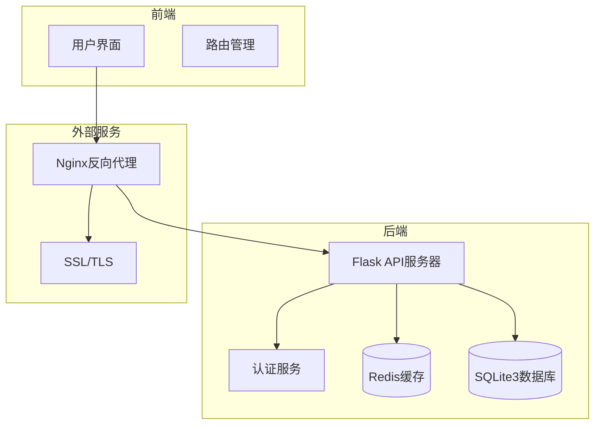

**图表来源**
- [企业网站CMS系统详细需求文档.md](file://企业网站CMS系统详细需求文档.md#L28-L57)

**章节来源**
- [企业网站CMS系统详细需求文档.md](file://企业网站CMS系统详细需求文档.md#L22-L57)

## 核心组件

### 认证与授权模块

系统采用基于Flask的认证体系，结合JWT Token实现用户身份验证与授权控制。核心组件包括：

- **用户认证服务**：负责用户登录、注册、密码验证等功能
- **权限控制系统**：基于角色的访问控制(RBAC)模型
- **Token管理服务**：JWT Token的生成、验证、刷新与撤销
- **会话管理服务**：Redis中的会话数据存储与管理

### 数据存储层

系统采用SQLite3作为主要数据库，支持用户信息、权限配置、内容管理等数据存储。Redis作为可选缓存层，用于存储会话数据和Token信息。

### 安全防护层

系统集成了多层次的安全防护机制：
- **XSS防护**：输入验证与输出编码
- **CSRF防护**：请求令牌验证
- **SQL注入防护**：ORM查询与参数绑定
- **文件上传安全**：文件类型验证与大小限制

**章节来源**
- [开发计划表_2月4日-2月12日.md](file://开发计划表_2月4日-2月12日.md#L142-L157)
- [企业网站CMS系统详细需求文档.md](file://企业网站CMS系统详细需求文档.md#L555-L594)

## 架构总览

系统采用分层架构设计，确保安全性的各个层面得到充分考虑：

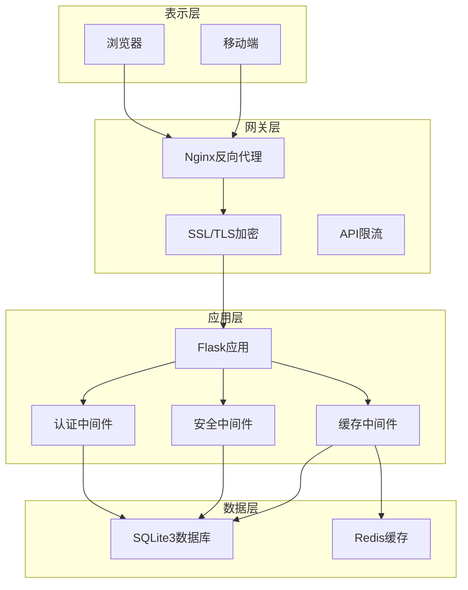

**图表来源**
- [企业网站CMS系统详细需求文档.md](file://企业网站CMS系统详细需求文档.md#L28-L57)

## 详细组件分析

### JWT Token安全机制

#### Token生成流程

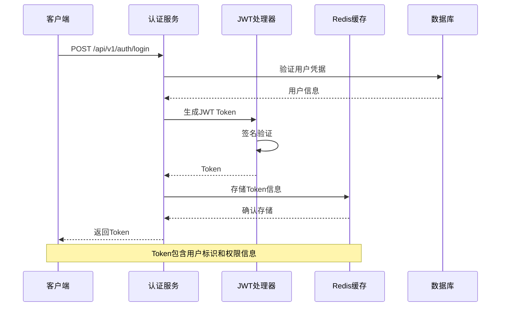

**图表来源**
- [开发计划表_2月4日-2月12日.md](file://开发计划表_2月4日-2月12日.md#L142-L157)

#### Token验证与刷新机制

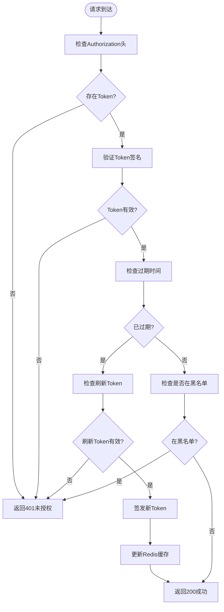

**图表来源**
- [开发计划表_2月4日-2月12日.md](file://开发计划表_2月4日-2月12日.md#L142-L157)

#### Token撤销机制

系统实现Token撤销功能，通过以下机制确保Token失效：

1. **黑名单机制**：将撤销的Token加入黑名单
2. **时间戳验证**：检查Token的签发时间
3. **会话管理**：在Redis中维护活跃会话列表

**章节来源**
- [开发计划表_2月4日-2月12日.md](file://开发计划表_2月4日-2月12日.md#L142-L157)

### 会话劫持防护

#### 多因素认证

系统支持多因素认证机制，包括：
- **设备指纹识别**：收集浏览器指纹信息
- **地理位置验证**：基于IP地址的地理位置检查
- **行为分析**：用户登录行为模式识别

#### 会话固定攻击防护

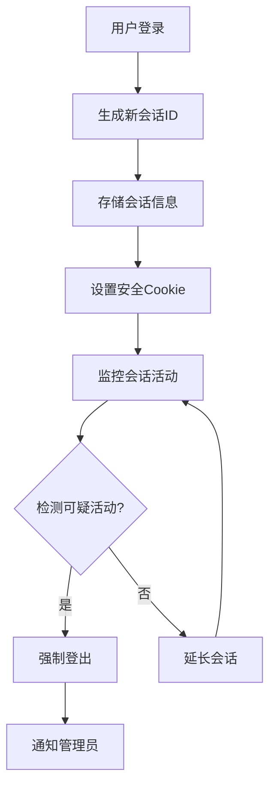

**图表来源**
- [企业网站CMS系统详细需求文档.md](file://企业网站CMS系统详细需求文档.md#L284-L293)

#### 会话超时管理

系统实现多层次的会话超时控制：

1. **活动超时**：用户长时间无操作自动登出
2. **绝对超时**：会话最大持续时间限制
3. **并发控制**：同一账户的并发登录限制

**章节来源**
- [企业网站CMS系统详细需求文档.md](file://企业网站CMS系统详细需求文档.md#L284-L293)

### CSRF攻击防范

#### 请求令牌机制

系统采用CSRF令牌防护机制：

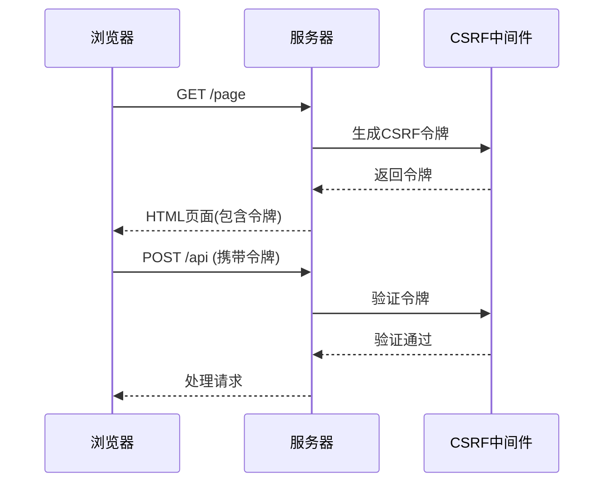

**图表来源**
- [企业网站CMS系统详细需求文档.md](file://企业网站CMS系统详细需求文档.md#L105-L109)

#### 安全校验清单

- **SameSite Cookie**：防止跨站请求
- **Origin验证**：检查请求来源
- **Referer验证**：验证请求来源页面
- **双重提交Cookie**：令牌与Cookie双重验证

### XSS攻击防护

#### 输入验证与过滤

系统实施多层次的XSS防护：

1. **输入验证**：对所有用户输入进行严格验证
2. **输出编码**：对敏感字符进行HTML实体编码
3. **内容安全策略**：设置CSP头防止脚本执行
4. **富文本过滤**：对富文本内容进行白名单过滤

#### 输出编码机制

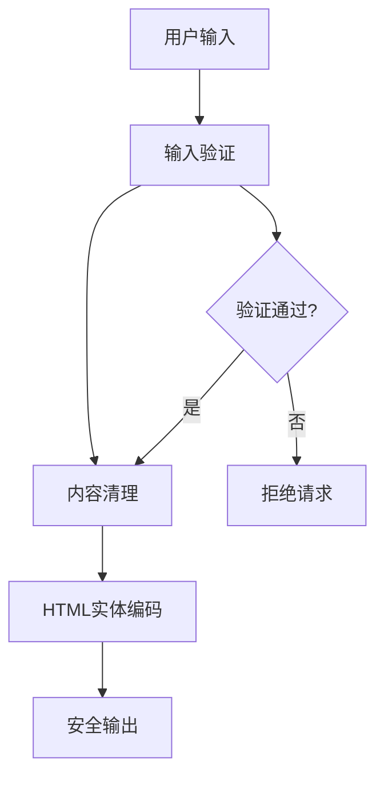

**图表来源**
- [企业网站CMS系统详细需求文档.md](file://企业网站CMS系统详细需求文档.md#L105-L109)

**章节来源**
- [企业网站CMS系统详细需求文档.md](file://企业网站CMS系统详细需求文档.md#L105-L109)

### Token加密存储

#### Redis中的Token存储

系统在Redis中安全存储Token相关信息：

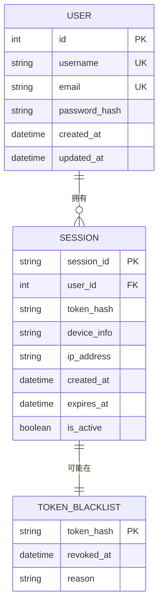

**图表来源**
- [企业网站CMS系统详细需求文档.md](file://企业网站CMS系统详细需求文档.md#L714-L768)

#### 加密策略

1. **Token哈希存储**：仅存储Token的哈希值
2. **会话信息加密**：敏感会话信息进行加密存储
3. **传输加密**：所有Token传输使用HTTPS
4. **定期轮换**：定期更换加密密钥

**章节来源**
- [企业网站CMS系统详细需求文档.md](file://企业网站CMS系统详细需求文档.md#L714-L768)

### 多设备登录控制

#### 并发登录管理

系统支持多设备登录控制机制：

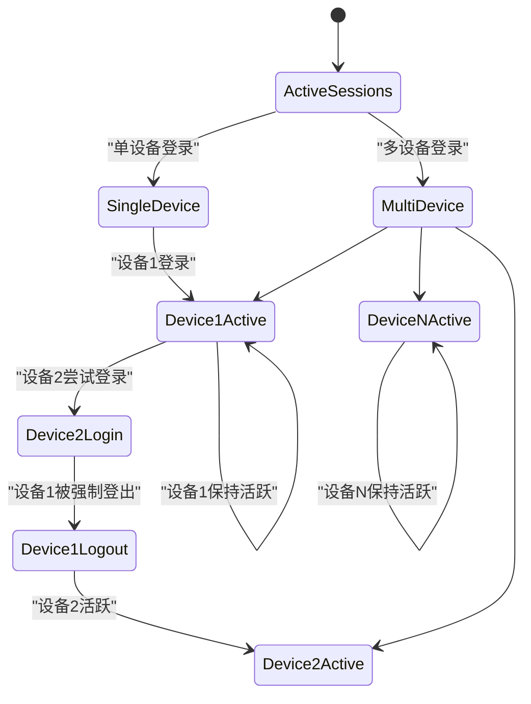

**图表来源**
- [开发计划表_2月4日-2月12日.md](file://开发计划表_2月4日-2月12日.md#L284-L293)

#### 设备管理功能

- **设备列表**：显示当前活跃的登录设备
- **远程登出**：允许用户主动登出特定设备
- **设备锁定**：对可疑设备进行临时锁定
- **登录通知**：新设备登录时发送通知

**章节来源**
- [开发计划表_2月4日-2月12日.md](file://开发计划表_2月4日-2月12日.md#L284-L293)

### 会话监控与异常检测

#### 异常登录检测

系统实现智能异常登录检测机制：

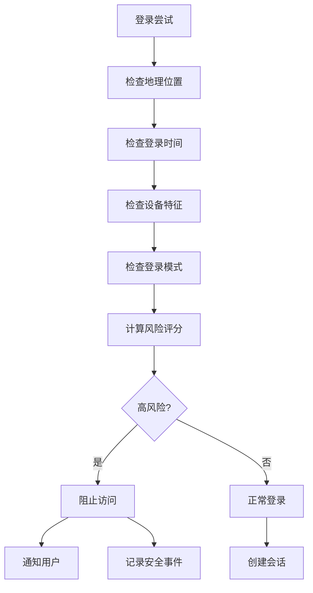

**图表来源**
- [企业网站CMS系统详细需求文档.md](file://企业网站CMS系统详细需求文档.md#L422-L428)

#### 安全审计日志

系统记录完整的安全审计日志：

- **登录日志**：用户登录时间、IP地址、设备信息
- **操作日志**：关键操作的时间、用户、结果
- **异常日志**：安全事件的详细信息
- **性能日志**：访问模式和性能指标

**章节来源**
- [企业网站CMS系统详细需求文档.md](file://企业网站CMS系统详细需求文档.md#L284-L293)

## 依赖关系分析

系统安全相关的依赖关系如下：

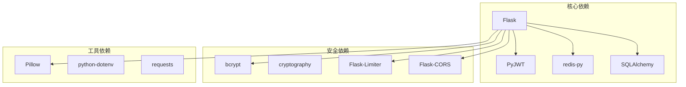

**图表来源**
- [企业网站CMS系统详细需求文档.md](file://企业网站CMS系统详细需求文档.md#L588-L594)

**章节来源**
- [企业网站CMS系统详细需求文档.md](file://企业网站CMS系统详细需求文档.md#L588-L594)

## 性能考虑

### 缓存策略优化

系统采用多层缓存策略以平衡性能与安全性：

1. **Redis缓存配置**：合理设置TTL和内存限制
2. **会话缓存优化**：使用连接池减少连接开销
3. **Token缓存策略**：区分短期Token和长期Token的缓存策略

### 安全性能平衡

- **异步处理**：安全检查采用异步处理避免阻塞
- **批量操作**：批量处理会话清理和审计日志
- **资源限制**：对API调用进行速率限制

## 故障排除指南

### 常见安全问题诊断

#### Token相关问题

1. **Token过期频繁**
   - 检查Token有效期配置
   - 验证刷新机制是否正常工作
   - 检查系统时间同步

2. **Token无法验证**
   - 确认签名密钥正确性
   - 检查Token格式和编码
   - 验证黑名单机制

#### 会话相关问题

1. **会话丢失**
   - 检查Redis连接状态
   - 验证会话存储配置
   - 检查Cookie设置

2. **并发登录冲突**
   - 检查多设备登录配置
   - 验证会话管理逻辑
   - 检查设备指纹识别

### 安全事件响应

1. **安全事件检测**：建立自动化监控和告警机制
2. **应急响应流程**：制定详细的应急响应程序
3. **数据恢复策略**：确保关键数据的备份和恢复能力

**章节来源**
- [开发计划表_2月4日-2月12日.md](file://开发计划表_2月4日-2月12日.md#L589-L625)

## 结论

本文件全面阐述了企业网站CMS系统的会话与Token安全管理体系。系统通过JWT Token实现强身份认证，结合Redis缓存提供高效的会话管理，采用多层次安全防护机制确保系统安全。通过合理的Token管理策略、会话劫持防护、CSRF和XSS防护、多设备登录控制以及完善的监控审计机制，系统能够在保证安全性的同时提供良好的用户体验。

建议在实际部署中：
1. 定期更新安全策略和防护机制
2. 建立完善的安全监控和告警系统
3. 制定详细的安全事件响应预案
4. 定期进行安全评估和渗透测试
5. 建立安全培训和意识提升机制

通过这些措施，可以确保CMS系统在生产环境中持续保持高水平的安全性。