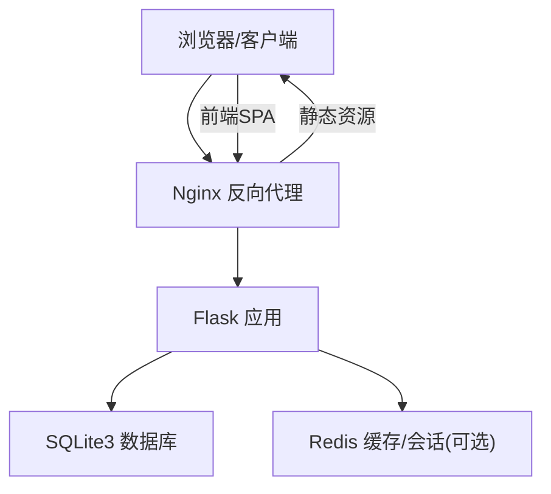
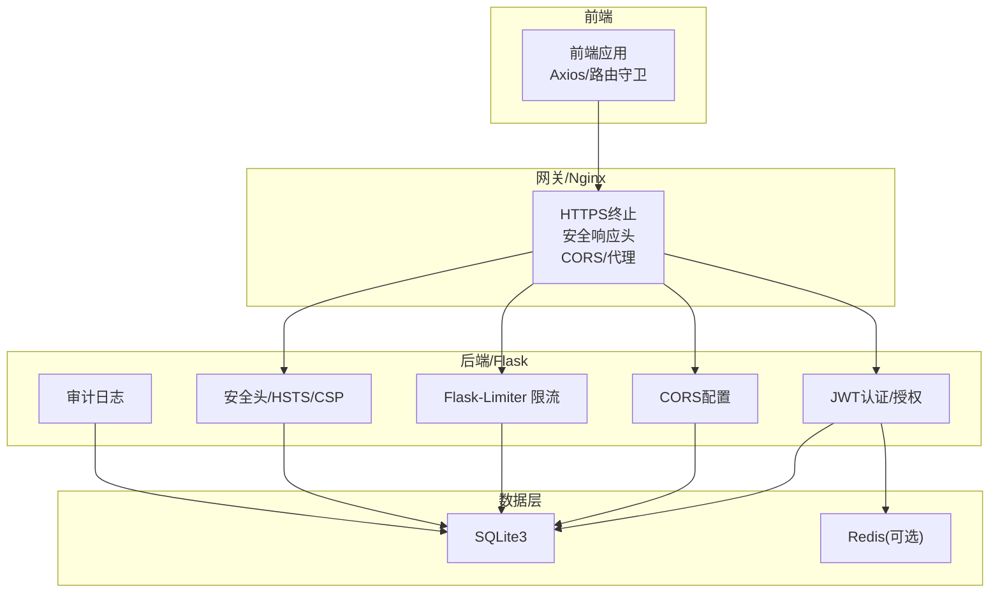
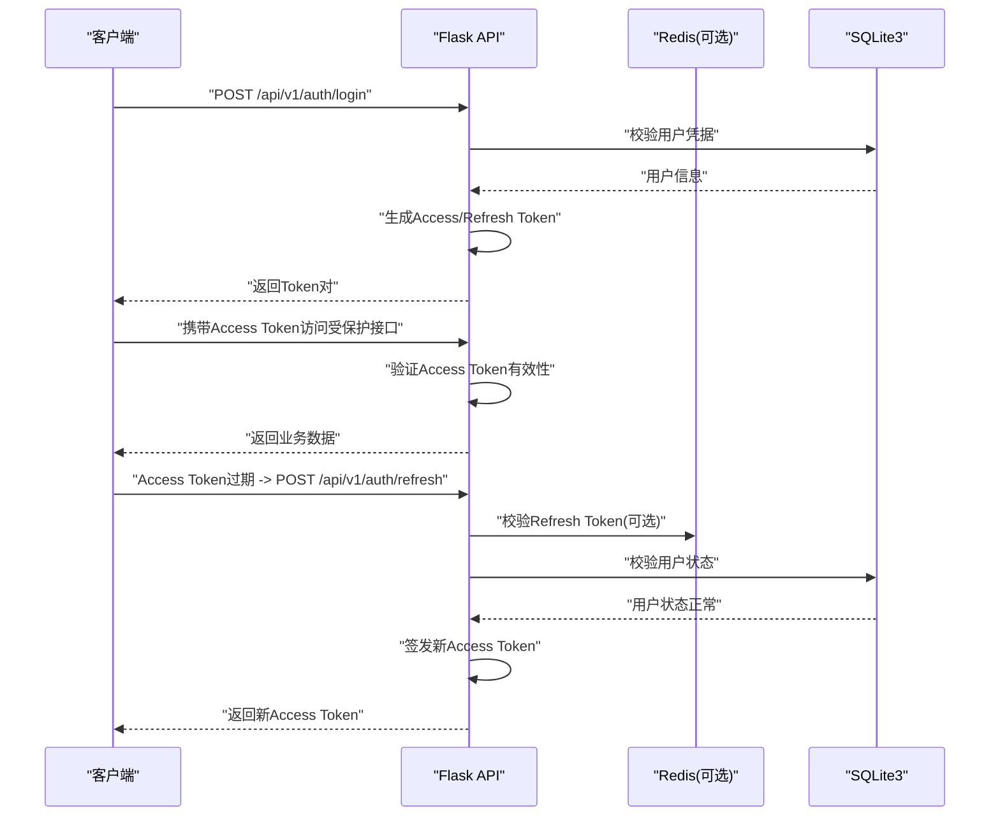
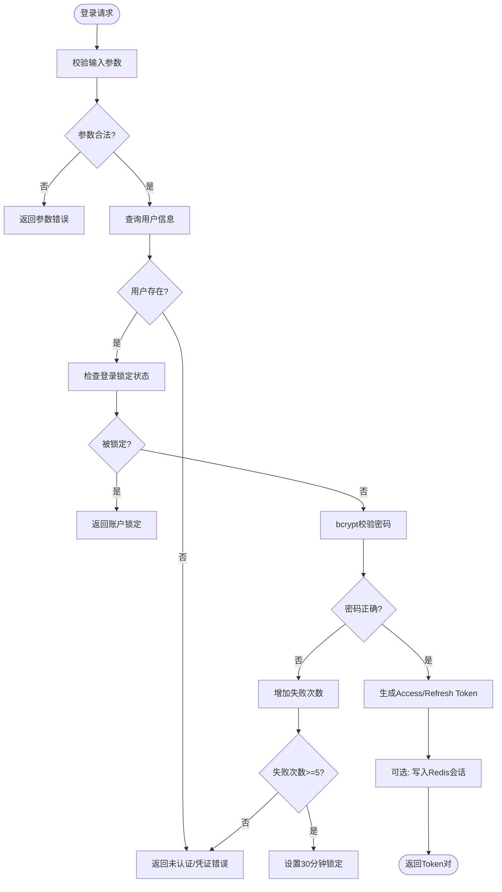
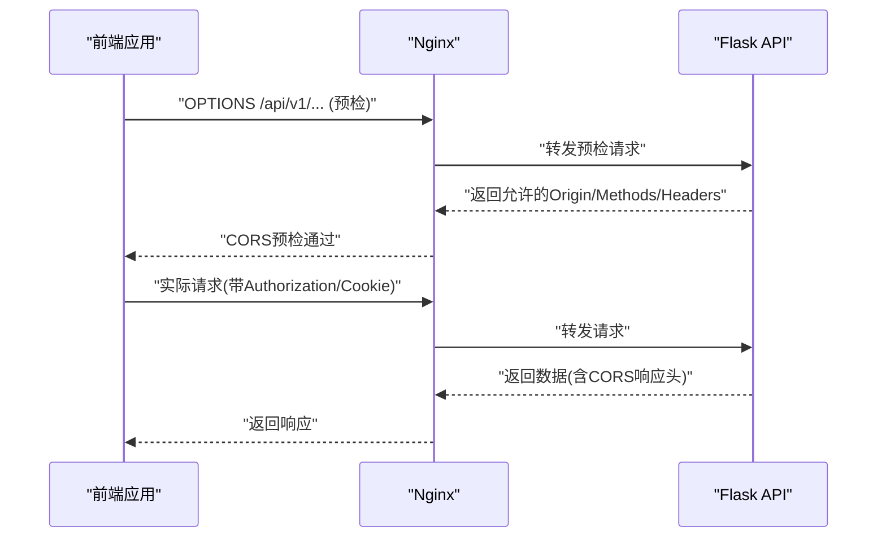
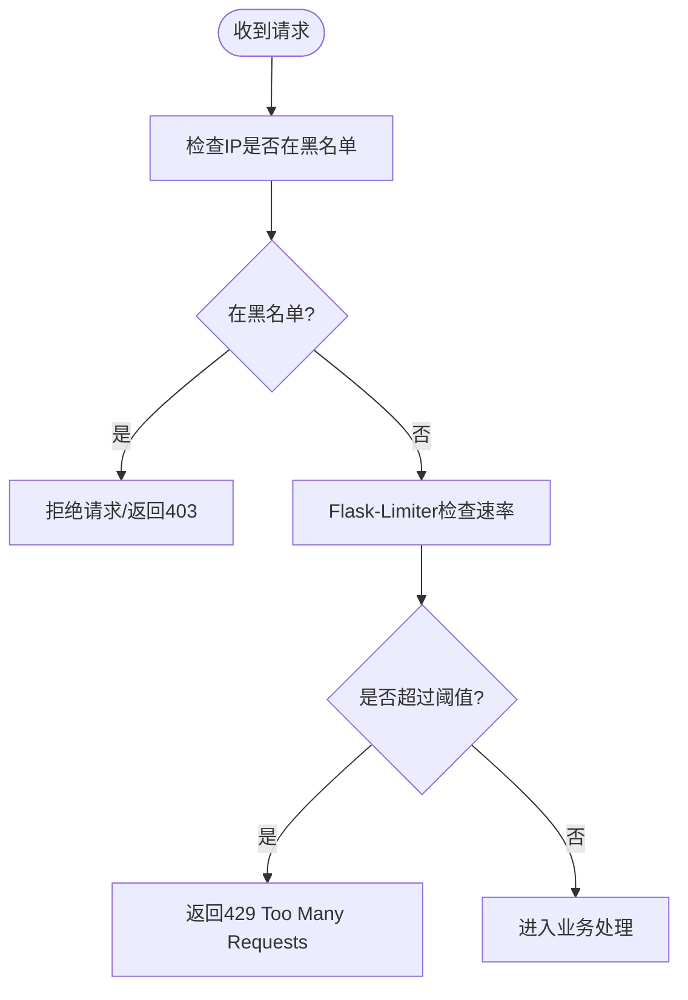
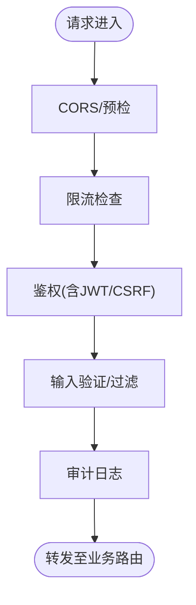
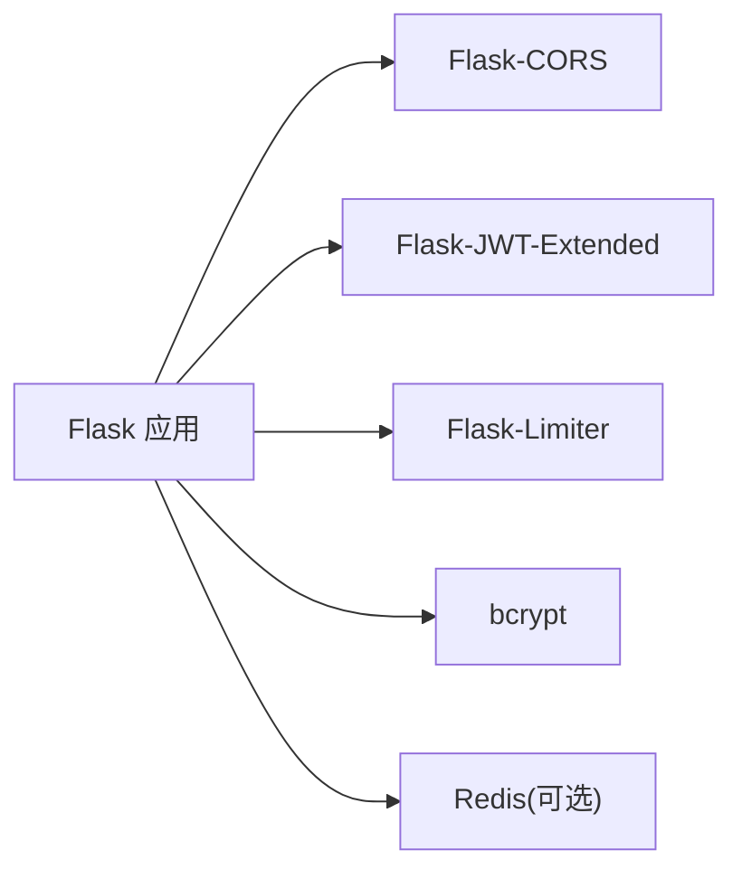

# API传输安全

<cite>
**本文引用的文件**
- [企业网站CMS系统详细需求文档.md](file://企业网站CMS系统详细需求文档.md)
- [开发计划表_2月4日-2月12日.md](file://开发计划表_2月4日-2月12日.md)
- [企业网站CMS系统开发需求文档.ini](file://企业网站CMS系统开发需求文档.ini)
</cite>

## 目录
1. [简介](#简介)
2. [项目结构](#项目结构)
3. [核心组件](#核心组件)
4. [架构总览](#架构总览)
5. [详细组件分析](#详细组件分析)
6. [依赖关系分析](#依赖关系分析)
7. [性能考量](#性能考量)
8. [故障排查指南](#故障排查指南)
9. [结论](#结论)
10. [附录](#附录)

## 简介
本文件围绕RESTful API接口的传输安全保障机制进行系统化梳理，结合项目需求文档与开发计划，重点覆盖：
- JWT Token的生成、验证与刷新机制（有效期、存储与刷新策略）
- API请求的签名验证、防重放与中间件安全过滤
- CORS跨域配置、API访问频率限制与IP黑白名单机制
- API安全测试方法与常见安全漏洞防护方案

本文件旨在帮助开发者与运维人员建立统一的安全基线，确保API在开发、测试与生产各阶段均具备可落地的安全能力。

## 项目结构
本项目采用前后端分离架构，后端为Flask应用，通过Nginx反向代理对外提供RESTful API；安全相关的关键点包括：
- Nginx层：HTTPS终止、安全响应头、静态资源与API代理
- Flask层：JWT认证、CORS、限流、缓存、会话与安全头
- 前端层：Token存储与自动刷新、路由守卫与权限控制

**章节来源**
- file://企业网站CMS系统详细需求文档.md#L22-L57
- file://开发计划表_2月4日-2月12日.md#L92-L105

## 核心组件
- 认证与授权：基于JWT的Access/Refresh Token机制，配合bcrypt密码加密与登录失败锁定策略
- 会话管理：Redis存储Session，支持单点/多点登录配置与异常登录检测
- 数据安全：ORM参数化查询、输入验证、XSS输出转义、CSRF Token与SameSite Cookie
- 传输安全：HTTPS强制跳转、HSTS头、敏感数据加密
- API安全：Flask-Limiter限流、CORS白名单、API密钥加密存储与定期轮换

**章节来源**
- file://企业网站CMS系统详细需求文档.md#L1078-L1139
- file://企业网站CMS系统详细需求文档.md#L1234-L1302

## 架构总览
下图展示了API安全在整体架构中的位置与交互关系，强调Nginx与Flask在安全层面的职责划分。

**图表来源**
- [企业网站CMS系统详细需求文档.md](file://企业网站CMS系统详细需求文档.md#L1143-L1230)
- [企业网站CMS系统详细需求文档.md](file://企业网站CMS系统详细需求文档.md#L1234-L1302)

**章节来源**
- file://企业网站CMS系统详细需求文档.md#L1143-L1230
- file://企业网站CMS系统详细需求文档.md#L1234-L1302

## 详细组件分析

### JWT Token机制与生命周期
- Token类型与有效期
  - Access Token：2小时有效
  - Refresh Token：7天有效
- Token存储
  - 前端可存储于LocalStorage或Cookie（需结合SameSite与HttpOnly策略）
- 刷新机制
  - Access Token过期后，使用Refresh Token换取新的Access Token
  - 建议在前端实现自动刷新与失败回退策略

**图表来源**
- [企业网站CMS系统详细需求文档.md](file://企业网站CMS系统详细需求文档.md#L1082-L1086)
- [开发计划表_2月4日-2月12日.md](file://开发计划表_2月4日-2月12日.md#L150-L157)

**章节来源**
- file://企业网站CMS系统详细需求文档.md#L1082-L1086
- file://开发计划表_2月4日-2月12日.md#L150-L157

### 密码安全与会话管理
- 密码加密：bcrypt，成本因子12
- 登录失败锁定：连续失败5次锁定30分钟
- 会话存储：Redis（可选），支持单点/多点登录配置与异常登录检测（IP/设备变化）

**图表来源**
- [企业网站CMS系统详细需求文档.md](file://企业网站CMS系统详细需求文档.md#L1088-L1097)

**章节来源**
- file://企业网站CMS系统详细需求文档.md#L1088-L1097

### CORS跨域配置
- CORS允许来源：开发环境与生产域名白名单
- 建议：生产环境严格限定Origin，启用Credentials时注意与前端Cookie策略一致

**图表来源**
- [企业网站CMS系统详细需求文档.md](file://企业网站CMS系统详细需求文档.md#L1287-L1289)

**章节来源**
- file://企业网站CMS系统详细需求文档.md#L1287-L1289

### API访问频率限制与IP黑白名单
- 限流：Flask-Limiter，支持基于IP与用户维度的限流，不同接口差异化配置
- IP黑白名单：建议在Nginx层或Flask中间件层实现，阻断恶意请求

**图表来源**
- [企业网站CMS系统详细需求文档.md](file://企业网站CMS系统详细需求文档.md#L1130-L1134)

**章节来源**
- file://企业网站CMS系统详细需求文档.md#L1130-L1134

### 中间件安全过滤与请求签名（概念性说明）
- 中间件安全过滤：统一鉴权、CORS、限流、日志与审计
- 请求签名与防重放（概念性）：可参考HMAC签名、Nonce/时间戳、签名窗口与幂等处理（具体实现需结合业务与密钥管理）

**图表来源**
- [企业网站CMS系统详细需求文档.md](file://企业网站CMS系统详细需求文档.md#L1128-L1139)

**章节来源**
- file://企业网站CMS系统详细需求文档.md#L1128-L1139

### 数据传输安全与敏感数据保护
- 传输加密：HTTPS/TLS 1.2+，生产环境强制跳转
- 安全响应头：X-Frame-Options、X-Content-Type-Options、X-XSS-Protection
- 敏感数据：密码bcrypt，其他敏感数据AES-256加密存储
- API密钥：加密存储、环境变量管理、定期轮换

**章节来源**
- file://企业网站CMS系统详细需求文档.md#L1123-L1127
- file://企业网站CMS系统详细需求文档.md#L1136-L1139
- file://企业网站CMS系统详细需求文档.md#L1397-L1400

## 依赖关系分析
- 技术栈与安全相关依赖
  - Flask-CORS：跨域支持
  - Flask-JWT-Extended：JWT认证
  - Flask-Limiter：限流
  - bcrypt：密码加密
  - Redis：会话与缓存（可选）

**图表来源**
- [企业网站CMS系统详细需求文档.md](file://企业网站CMS系统详细需求文档.md#L1304-L1322)

**章节来源**
- file://企业网站CMS系统详细需求文档.md#L1304-L1322

## 性能考量
- 限流与缓存：合理设置限流阈值与缓存策略，避免对用户体验造成过大影响
- 会话与Token：Access Token短周期、Refresh Token安全存储与轮换，减少频繁鉴权开销
- Nginx优化：Gzip压缩、静态资源缓存、TLS优化

[本节为通用指导，不直接分析具体文件]

## 故障排查指南
- 认证失败
  - 检查Access/Refresh Token是否过期或被撤销
  - 确认JWT密钥与算法配置一致
- CORS错误
  - 核对CORS允许来源与预检响应头
  - 确认前端请求是否携带Cookie且与CORS Credentials匹配
- 限流触发
  - 检查IP/用户维度限流配置与当前阈值
  - 临时提高阈值定位真实流量峰值
- 传输安全
  - 确认Nginx HTTPS配置与安全响应头生效
  - 检查HSTS头与证书链完整性

**章节来源**
- file://企业网站CMS系统详细需求文档.md#L1143-L1230
- file://企业网站CMS系统详细需求文档.md#L1234-L1302

## 结论
本项目在需求层面已明确了JWT Token机制、CORS配置、限流与安全响应头等关键安全能力。建议在实现阶段：
- 明确Token存储与刷新策略，确保前端自动刷新与失败回退
- 在Nginx与Flask层分别落实CORS与限流，形成纵深防御
- 强化日志与审计，完善安全事件告警与处置流程
- 持续进行安全测试与渗透评估，确保上线前无重大风险

[本节为总结性内容，不直接分析具体文件]

## 附录
- API接口清单（认证相关）
  - POST /api/v1/auth/login 登录
  - POST /api/v1/auth/logout 登出
  - POST /api/v1/auth/register 注册
  - POST /api/v1/auth/refresh 刷新Token
  - POST /api/v1/auth/forgot-password 忘记密码
  - POST /api/v1/auth/reset-password 重置密码
  - GET /api/v1/auth/me 当前用户信息

**章节来源**
- file://开发计划表_2月4日-2月12日.md#L150-L157
- file://企业网站CMS系统详细需求文档.md#L1002-L1011